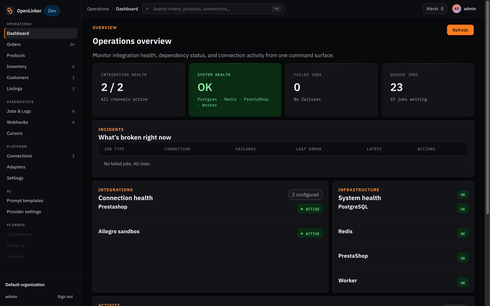
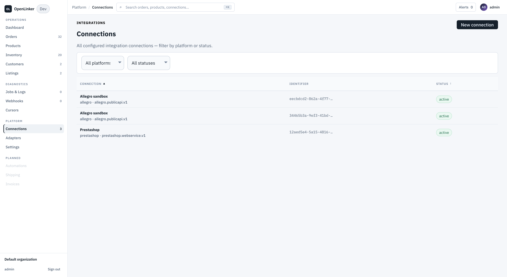
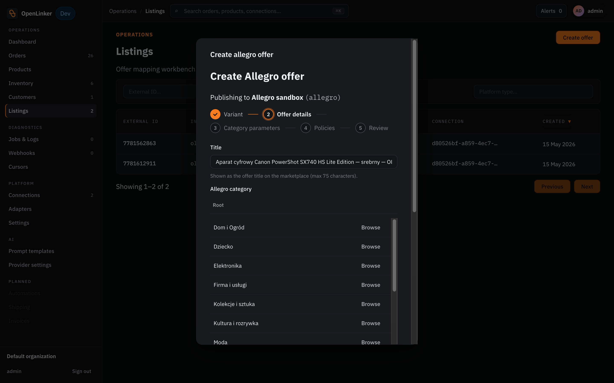

# OpenLinker

[](https://github.com/openlinker-project/openlinker/actions/workflows/ci.yml)
[](./LICENSE)
[](https://github.com/openlinker-project/openlinker/issues/670)

**Sync orders, inventory, and listings between your shop and the marketplaces you sell on. Self-hosted, open-source, pluggable.**

If you sell on your own shop *and* on marketplaces like Allegro, you've already lived the pain: orders coming in from multiple places, inventory drifting between channels, manually rewriting product descriptions for every listing, customer data scattered across systems. The usual answers are SaaS channel managers (you pay forever and your data lives on their servers) or custom scripts (fragile and yours to maintain alone). OpenLinker is the third option: a self-hosted, open-source orchestration platform that does the same job, on your servers, with your data, with code you can read and extend.

> **Status: alpha, pre-1.0.** First public release is in progress. Expect rough edges; report them.

<p align="center">
  <picture>
    <source media="(prefers-color-scheme: dark)" srcset="docs/plans/371-dashboard-dark.png">
    
  </picture>
</p>

---

## What you can do today

- **Orders flow automatically.** Every Allegro order creates a PrestaShop order, with the buyer auto-provisioned as a customer. Cursor-based and resumable — nothing's lost if anything pauses.
- **Stock stays in sync, both ways.** Sell on Allegro, your shop stock drops. Restock in your shop, Allegro listings update. No per-platform spreadsheet.
- **Create listings without copy-pasting.** Pick a product, pick a category (or look it up by EAN), get an Allegro offer up with images, parameters, GPSR data, and your saved seller policies — from one wizard. AI can draft the description if you let it.
- **Run multiple stores from one dashboard.** Each connection has its own encrypted credentials and config. Two PrestaShop stores plus three Allegro accounts? One OpenLinker instance.
- **You own everything.** Self-hosted, Apache 2.0. No subscription, no per-order pricing, no vendor that can shut you off. You host it; that's the trade.

<p align="center">
  
  &nbsp;
  
</p>

---

## Integrations

| Integration | Role | Status |
|---|---|---|
| **[PrestaShop](./libs/integrations/prestashop/)** | Shop *(source + destination)* | ✅ Live |
| **[Allegro](./libs/integrations/allegro/)** | Marketplace *(source + offers)* | ✅ Live |
| **[AI router](./libs/integrations/ai/)** *(Anthropic, OpenAI)* | Content suggestion | ✅ Live |
| **Subiekt nexo** *([#728](https://github.com/openlinker-project/openlinker/issues/728))* | Invoicing *(via Sfera bridge — first `InvoicingPort` adapter)* | 🚧 In progress |
| **InPost** *([#727](https://github.com/openlinker-project/openlinker/issues/727))* | Shipping *(ShipX — paczkomat + kurier, labels, webhooks)* | 🚧 In progress |
| Shopify · WooCommerce · BigCommerce · Magento | Shop | 📋 Planned |
| eBay · Amazon · OLX · Empik · Bol | Marketplace | 📋 Planned |
| DPD · DHL · FedEx · ORLEN Paczka · GLS | Shipping *(pending `ShippingProviderPort` from #727)* | 📋 Planned |
| Fakturownia · iFirma · wFirma · inFakt | Invoicing *(siblings of Subiekt under `InvoicingPort`)* | 📋 Planned |

Planned items are open for community contributions — see [Adding your own integration](#adding-your-own-integration) below.

---

## Capabilities

OpenLinker is built around a small set of capability ports. Each integration implements one or more of them — adding a new platform means adding implementations, not changing core code.

| Capability | What it does | Integrations |
|---|---|---|
| **Catalog & inventory** | Read products, variants, and stock from a master shop | PrestaShop |
| **Orders** | Ingest from any source *(event journal or watermark)*; create + manage them in a destination shop | PrestaShop *(source + destination)* · Allegro *(source only)* |
| **Offers / listings** | Manage marketplace offers — categories, prices, quantities, seller policies, GPSR data | Allegro |
| **Content suggestion** | Provider-agnostic AI completions with editable, versioned prompts | AI router *(Anthropic, OpenAI)* |
| **Auth & ops** | Per-integration connection testers, webhook provisioners, OAuth, retry classifiers, credentials/config validators | PrestaShop · Allegro |

See [`docs/architecture-overview.md`](./docs/architecture-overview.md) for the full port signatures, the offer sub-capability inventory, and the contracts plugin authors implement against.

**Host-provided, regardless of integration:** encrypted credentials store · multi-connection per platform type *(two PrestaShop stores from one instance)* · identifier mapping with a single unified seed *(`ol_product_*`, `ol_order_*`, `ol_variant_*`, …)* · customer identity resolution with optional email-fallback · PII-aware storage *(full or hash-only)* · sync-job orchestration with retry classification + outcome tracking · browser-based admin UI.

---

## Implementations

### PrestaShop · WebService v1

**Role:** shop / destination

OpenLinker's PrestaShop integration. Implements the full shop surface: catalog and inventory reads, order ingestion via the `date_upd` watermark, order creation with auto-provisioned guest customers, status lifecycle, cancellations, and returns. Ships the **OL Dynamic Carrier** PrestaShop module so buyer-paid shipping costs from marketplaces round-trip correctly into PrestaShop orders without breaking existing carriers. Registers connection tester, webhook provisioner, and connection-config + credentials shape validators with the host.

**~7.6k LOC source** · [`libs/integrations/prestashop/`](./libs/integrations/prestashop/) · [README](./libs/integrations/prestashop/README.md) · *also the recommended starting point when adding a new shop or marketplace plugin*

### Allegro · Public API

**Role:** marketplace / source

OpenLinker's Allegro integration. Implements every offer sub-capability the `OfferManager` port defines — `OfferLister`, `OfferEventReader`, `OfferFieldUpdater`, `CategoryBrowser`, `CategoryBarcodeMatcher`, `CategoryParametersReader`, `CatalogProductReader`, `OfferCreator`, `OfferStatusReader`, `OfferReader`, `SellerPoliciesReader`, `ResponsibleProducerReader`, `SafetyAttachmentUploader`. Order ingestion via the Allegro event journal with cursor persistence. Full OAuth flow with shared token state, refresh-on-401 retry, and a plugin-owned migration. Email normalization for Allegro's masked-buyer-email format.

**~7.5k LOC source** · [`libs/integrations/allegro/`](./libs/integrations/allegro/) · *also a useful template for any marketplace plugin that needs OAuth*

### AI · Anthropic, OpenAI

**Role:** content suggestion

OpenLinker's AI router for content generation. Wraps Anthropic and OpenAI behind a single `AiCompletionPort`, with per-provider encrypted key storage, admin-switchable active provider, and Anthropic prompt-caching wired in. Drives the offer-description suggestion flow in the create-offer wizard.

**~572 LOC source** · [`libs/integrations/ai/`](./libs/integrations/ai/) · *also a useful template for plugins that route through an external SaaS rather than per-connection*

---

## Why OpenLinker?

- **vs SaaS channel managers** *(BaseLinker, ChannelEngine, ChannelAdvisor)* — you own the data, you own the code, and your bill is your hosting bill. No per-order pricing, no vendor lock-in, no surprise terms changes.
- **vs custom scripts** — a tested foundation that doesn't break the next time Allegro changes their API. Real integration tests run against a real PrestaShop install via Testcontainers.
- **vs headless commerce platforms** *(Medusa, Vendure, Spree)* — OpenLinker is the **integration plumbing** for the shop you already have, not a replacement shop platform. Keep PrestaShop (or WooCommerce, BigCommerce, …) running; add OpenLinker alongside it.

---

## What we cover (and what we don't)

How OpenLinker measures against the standard set of multichannel-orchestration flows. Honest about gaps — they're either on the roadmap or intentionally out of scope.

**Legend:** ✅ supported today · ⚠️ partial · 🛣️ on the roadmap · — out of current scope

| Flow | Status | Capability / port |
|---|:---:|---|
| **Orders** | | |
| Ingest orders from any source *(marketplace or shop)* | ✅ | `OrderSourcePort` |
| Create + manage orders in destination shop | ✅ | `OrderProcessorManagerPort` |
| Generate invoices, receipts, accounting export | — | *Out of scope; integrate accounting separately* |
| **Inventory & catalog** | | |
| Read products, variants, attributes | ✅ | `ProductMasterPort` |
| Read inventory levels | ✅ | `InventoryMasterPort` |
| Multi-location / multi-warehouse stock | 🛣️ | `InventoryMasterPort` accepts `locationId`; not yet exercised by an adapter |
| Bulk catalog operations | ⚠️ | `OfferQuantityBatchUpdater` sub-capability defined; not yet implemented |
| **Marketplace listings** | | |
| Create + update offers *(categories, policies, GPSR)* | ✅ | `OfferManagerPort` + sub-capability ports |
| AI offer descriptions | ✅ | `AiCompletionPort` |
| Repricing / dynamic pricing rules | 🛣️ | `PricingAuthorityPort` planned |
| **Customers** | | |
| Identity resolution across channels | ✅ | Customer-identity service + plugin-provided email normalizer |
| GDPR-friendly PII modes *(full or hash-only)* | ✅ | Host-provided storage policy |
| Customer Q&A / messaging | — | *Out of scope* |
| **Shipping & carriers** | | |
| Carrier mapping *(marketplace ↔ physical carrier)* | ✅ | Host-provided carrier-mapping service |
| Pickup-point handling *(Paczkomat, etc.)* | ✅ | Through `OrderSourcePort` order shape |
| Buyer-paid shipping cost round-trip | ✅ | `OrderProcessorManagerPort` + plugin-owned shop module |
| Generate shipping labels | 🛣️ | `ShippingProviderManagerPort` planned |
| Push tracking back to marketplace | 🛣️ | Paired with `ShippingProviderManagerPort` |
| **Payments** | | |
| Payment status from order data | ✅ | Part of the `IncomingOrder` shape from `OrderSourcePort` |
| Refunds via return flow | ✅ | `OrderProcessorManagerPort.processReturn` |
| Payment provider integrations *(Stripe, P24, …)* | 🛣️ | `PaymentProcessorPort` planned |
| **Operations** | | |
| Multiple shops + marketplaces in one instance | ✅ | Host-provided connection model |
| Multi-user with roles | ⚠️ | Host-provided JWT + admin role gate; finer-grained roles are a known gap |
| Encrypted credentials store | ✅ | Host-provided crypto service |
| Webhooks *(HMAC + replay + dedup)* | ✅ | Host-provided webhook pipeline |
| Sync-job retry + outcome tracking | ✅ | Host-provided sync-job service + plugin-provided retry classifier |
| Workflow automation *("when X, do Y" rules)* | — | *Out of scope; write a worker handler instead* |
| Reporting / analytics dashboard | — | *Out of scope; export via the API* |

Spot a gap that's on your evaluation checklist? Open a [feature request](./.github/ISSUE_TEMPLATE/feature_request.md) — the table is a living scorecard, not a fixed roadmap.

---

## How it works

```
Marketplace (Allegro)                           Shop (PrestaShop)
   │                                                   ▲
   │ 1. order event                                    │ 4. create order,
   ▼                                                   │    update status
[OrderSourcePort]                          [OrderProcessorManagerPort]
   │                                                   ▲
   │ 2. hydrate                                        │ 3. map customer,
   │    full order                                     │    resolve products
   ▼                                                   │
              OpenLinker core ─────────────────────────┘
              (identifier mapping · retries · dedup · projections)
```

Every platform — shop or marketplace — implements the same set of typed capability ports (`OrderSourcePort`, `OrderProcessorManagerPort`, `ProductMasterPort`, `InventoryMasterPort`, `OfferManagerPort`). Core orchestration is platform-agnostic; per-platform behaviour lives in self-registering plugin packages. Full picture in [Architecture Overview](./docs/architecture-overview.md).

---

## For developers

OpenLinker is built so that adding a platform is a plugin, not a fork.

### Adding your own integration

A new integration is a workspace package under `libs/integrations/<name>/`. The path from idea to merged PR:

1. **Scaffold.** `pnpm create-adapter <your-platform>` generates the package skeleton — `package.json`, `tsconfig`, a stub plugin descriptor, and the canonical hexagonal layout.
2. **Pick your roles.** Shop, marketplace, content suggestion, or something new entirely? That decides which capability ports you'll implement. Implement only the ports your platform supports; capability guards handle the rest at runtime.
3. **Implement.** Each port has 1–10 methods. PrestaShop is the multi-port reference (~7.6k LOC across catalog, inventory, orders). Allegro is the OAuth + marketplace reference (~7.5k LOC, every offer sub-capability). The AI router is the thin single-port example (572 LOC). Effort scales with how much of a platform you cover.
4. **Register.** Add your plugin to `apps/api/src/plugins.ts` (and `apps/web/src/plugins/index.ts` for any FE contributions — routes, nav, wizards, error renderers).
5. **Test.** Use [`@openlinker/test-kit`](./libs/test-kit/) for integration tests against real Postgres + Redis + a real shop install via Testcontainers. Use the in-memory fakes from each context's `/testing` subpath for unit tests.

Full walkthrough in the [Plugin Author Guide](./docs/plugin-author-guide.md). The [PrestaShop reference adapter README](./libs/integrations/prestashop/README.md) is the closest thing to a worked example.

### Why it's pleasant to extend

- **Capabilities are open-world.** `Capability`, `EntityType`, and `PlatformType` are open strings at the registry boundary. Add `ShippingProvider`, `PricingAuthority`, or anything else without a core PR — the well-known set is a hint, not a gate.

- **Framework-free domain.** `libs/core/src/**/domain/` has zero NestJS / TypeORM imports. Runtime-enforced: `@openlinker/core` exposes only 28 explicit subpaths via `package.json#exports`, ESLint blocks deep imports in plugin packages, and `package exports` block the runtime path entirely.

- **Framework-neutral plugin SDK.** [`@openlinker/plugin-sdk`](./libs/plugin-sdk/) ships the `AdapterPlugin` contract, the `HostServices` bag, and the typed `dispatchCapability<T>` helper. Plugins compile against the SDK, not against the host's NestJS / TypeORM.

- **Frontend is pluggable too.** Routes, nav items, the typed `ApiClient`, offer-creation wizards, structured error renderers — all extension points populated from a per-platform plugin folder under `apps/web/src/plugins/`. Allegro and PrestaShop are the in-tree examples.

- **Real tests, exported.** Integration tests run against real Postgres + Redis + a real PrestaShop install via Testcontainers. The harness ships as [`@openlinker/test-kit`](./libs/test-kit/). Each context exports in-memory fakes from a `/testing` sub-barrel for plugin unit tests.

### Wanted

Any **📋 Planned** row in the [Integrations table](#integrations) is open for community contribution — or propose something not listed via the [`new_integration` issue template](./.github/ISSUE_TEMPLATE/new_integration.md). The [Plugin Author Guide](./docs/plugin-author-guide.md) walks through port selection, package layout, registry wiring, OAuth, and tests.

### Where we're at

OpenLinker is moving fast and publicly. See [recent activity](https://github.com/openlinker-project/openlinker/pulse) for what's landed lately, the [modularity audit (#546)](https://github.com/openlinker-project/openlinker/issues/546) for the architectural thread making the codebase plugin-ready, and the [OSS launch epic (#670)](https://github.com/openlinker-project/openlinker/issues/670) for what's blocking the first public release.

---

## Quickstart

```bash
git clone https://github.com/openlinker-project/openlinker.git
cd openlinker
pnpm install
cp apps/api/.env.example apps/api/.env

pnpm dev:stack:up        # PostgreSQL · Redis · MySQL · PrestaShop in Docker
pnpm start:dev:api       # NestJS API on :3000
pnpm start:dev:worker    # Background job worker
pnpm start:dev:web       # React admin UI on :5173
```

Then follow [`docs/getting-started.md`](./docs/getting-started.md) — a walkthrough from a clean machine to a working PrestaShop + Allegro setup with categories mapped.

### Prerequisites

- Node.js 18+ (LTS), pnpm 10+
- Docker + Docker Compose (dev stack + integration tests)
- An [Allegro sandbox account](https://apps.developer.allegro.pl.allegrosandbox.pl/) if you want to exercise the marketplace path

The dev stack starts PostgreSQL, Redis, MySQL, and a pre-configured PrestaShop in containers — you do not need any of those installed locally.

---

## Development

```bash
pnpm lint              # ESLint
pnpm type-check        # TypeScript strict mode, all workspaces
pnpm test              # Unit tests (no Docker needed)
pnpm test:integration  # Integration tests via Testcontainers (needs Docker)
pnpm format            # Prettier
pnpm build             # All workspaces
```

**Quality gate before every commit:** `pnpm lint && pnpm type-check && pnpm test`.

For schema changes, also run `pnpm --filter @openlinker/api migration:show` to confirm there are no missing migrations. See [`docs/migrations.md`](./docs/migrations.md).

---

## Architecture & docs

- [Architecture Overview](./docs/architecture-overview.md) — bounded contexts, capability ports, data flow
- [Engineering Standards](./docs/engineering-standards.md) — naming, file layout, repository-port pattern
- [Frontend Architecture](./docs/frontend-architecture.md) — admin UI conventions, state rules
- [Testing Guide](./docs/testing-guide.md) — Testcontainers + harness usage
- [Plugin Author Guide](./docs/plugin-author-guide.md) — adding a new integration
- [Connections & Adapter Resolution](./docs/connections-and-adapter-resolution.md) — per-connection runtime model
- [Public API Contract](./PUBLIC_API.md) — what's stable for plugin authors and downstream consumers; versioning policy.


---

## Contributing

Pull requests welcome. See [CONTRIBUTING.md](./CONTRIBUTING.md) for the workflow, branch naming, and the `Closes #N` PR convention.

If you're adding a new platform, jump to [Adding your own integration](#adding-your-own-integration) above for the five-step path.

---

## Community

- [Code of Conduct](./CODE_OF_CONDUCT.md) — the standards we hold ourselves and contributors to
- [Support](./SUPPORT.md) — where to ask questions vs. file bugs vs. propose features
- [Security](./SECURITY.md) — responsible-disclosure process (do **not** open public issues for vulnerabilities)

---

## License

Apache License 2.0. See [LICENSE](./LICENSE).
