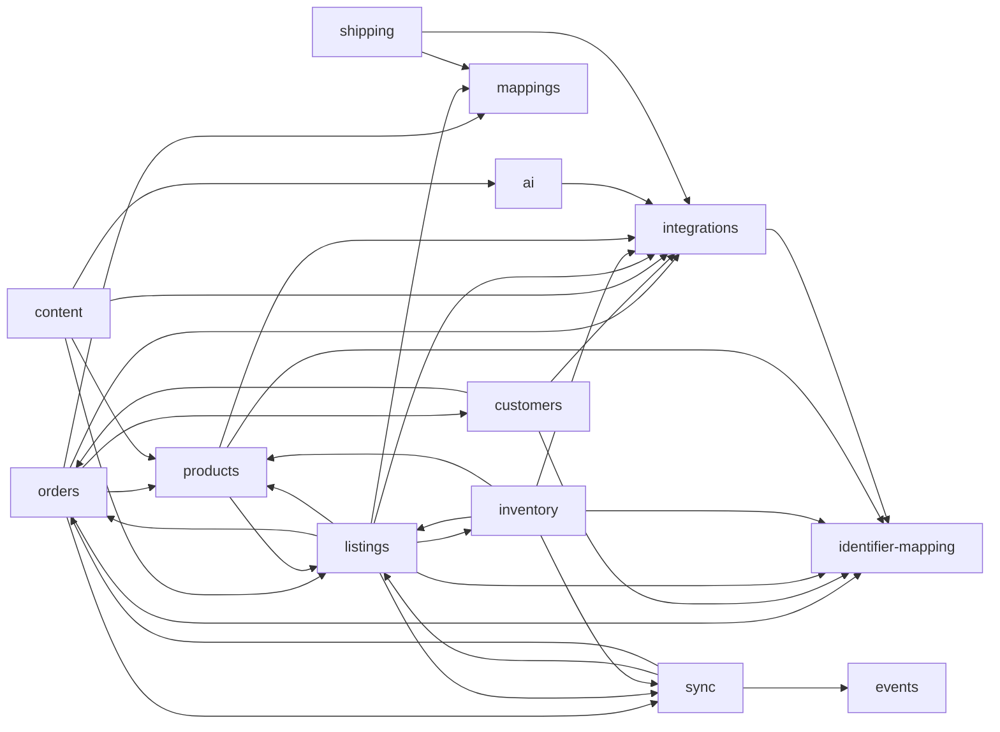

# Architecture Overview

## Table of Contents

1. [High-Level Architecture](#high-level-architecture)
2. [Core Bounded Contexts](#core-bounded-contexts)
3. [Capability Abstractions (Business Roles)](#capability-abstractions-business-roles)
4. [Hexagonal Architecture Structure](#hexagonal-architecture-structure)
5. [Cross-context dependencies in core](#cross-context-dependencies-in-core)
6. [Module Organization](#module-organization)
7. [Data Flow](#data-flow)
8. [Technology Stack](#technology-stack)

---

## High-Level Architecture

*See [ADR-001](./architecture/adrs/001-hexagonal-architecture-and-bounded-contexts.md) for the decision rationale.*

OpenLinker follows a **Hexagonal Architecture** (Ports and Adapters) pattern, organized as a modular monorepo. The system is designed to be:

- **Modular**: Clear separation between core domain and integrations
- **Extensible**: Easy to add new platforms without modifying core logic
- **Testable**: Domain logic isolated from infrastructure concerns
- **Maintainable**: Business capabilities abstracted from concrete implementations

### Architecture Diagram

```
┌─────────────────────────────────────────────────────────────────┐
│                         Frontend/UI                             │
│                    (Separate Application)                       │
└────────────────────────────┬────────────────────────────────────┘
                             │
                             │ HTTP REST API (JWT)
                             │
┌────────────────────────────▼────────────────────────────────────┐
│                    Core API (OpenLinker)                        │
│                                                                 │
│  ┌──────────────────────────────────────────────────────────┐   │
│  │              Interfaces Layer (HTTP/REST)                │   │
│  │  - Controllers (REST endpoints)                          │   │
│  │  - Request/Response DTOs                                 │   │
│  │  - Authentication & Authorization                        │   │
│  └──────────────────────────────────────────────────────────┘   │
│                                                                 │
│  ┌──────────────────────────────────────────────────────────┐   │
│  │           Application Layer (Use Cases)                  │   │
│  │  - ProductSyncService                                    │   │
│  │  - InventorySyncService                                  │   │
│  │  - OrderSyncService                                      │   │
│  │  - OfferSyncService                                      │   │
│  │  - MappingServices                                       │   │
│  │                                                          │   │
│  │  ┌────────────────────────────────────────────────────┐  │   │
│  │  │    Infrastructure Services                         │  │   │
│  │  │  - IdentifierMappingService                         │  │   │
│  │  └────────────────────────────────────────────────────┘  │   │
│  └──────────────────────────────────────────────────────────┘   │
│                                                                 │
│  ┌──────────────────────────────────────────────────────────┐   │
│  │              Domain Layer (Business Logic)               │   │
│  │   ┌──────────────┐  ┌──────────────┐  ┌──────────────┐   │   │
│  │   │   Products   │  │  Inventory   │  │    Orders    │   │   │
│  │   │   Domain     │  │    Domain    │  │    Domain    │   │   │
│  │   └──────────────┘  └──────────────┘  └──────────────┘   │   │
│  │                                                          │   │
│  │   ┌──────────────┐                                       │   │
│  │   │   Listings  │                                       │   │
│  │   │   Domain    │                                       │   │
│  │   └──────────────┘                                       │   │
│  │                                                          │   │
│  │  ┌────────────────────────────────────────────────────┐  │   │
│  │  │         Capability Ports (Interfaces)              │  │   │
│  │  │  - ProductMasterPort                               │  │   │
│  │  │  - InventoryMasterPort                             │  │   │
│  │  │  - OrderSourcePort                                 │  │   │
│  │  │  - OrderProcessorManagerPort                       │  │   │
│  │  │  - OfferManagerPort                                │  │   │
│  │  │  - PricingAuthorityPort (future)                   │  │   │
│  │  └────────────────────────────────────────────────────┘  │   │
│  └──────────────────────────────────────────────────────────┘   │
│                                                                 │
│  ┌──────────────────────────────────────────────────────────┐   │
│  │          Infrastructure Layer (Adapters)                 │   │
│  │   ┌──────────────┐  ┌──────────────┐  ┌──────────────┐   │   │
│  │   │  PrestaShop  │  │   Allegro    │  │   InPost     │   │   │
│  │   │   Adapters   │  │   Adapters   │  │   Adapters   │   │   │
│  │   └──────────────┘  └──────────────┘  └──────────────┘   │   │
│  │                                                          │   │
│  │  ┌────────────────────────────────────────────────────┐  │   │
│  │  │    Adapters Implementing Capability Ports          │  │   │
│  │  │  - PrestashopProductMasterAdapter                  │  │   │
│  │  │  - PrestashopInventoryMasterAdapter                │  │   │
│  │  │  - PrestashopOrderSourceAdapter                    │  │   │
│  │  │  - PrestashopOrderProcessorAdapter                 │  │   │
│  │  │  - AllegroOrderSourceAdapter                       │  │   │
│  │  │  - AllegroOfferManagerAdapter                      │  │   │
│  │  └────────────────────────────────────────────────────┘  │   │
│  └──────────────────────────────────────────────────────────┘   │
│                                                                 │
│  ┌──────────────────────────────────────────────────────────┐   │
│  │          Infrastructure Layer (Persistence)              │   │
│  │  - PostgreSQL (TypeORM)                                  │   │
│  │  - Redis (Caching, Event Bus)                            │   │
│  └──────────────────────────────────────────────────────────┘   │
└────────────────────────────┬────────────────────────────────────┘
                             │
                             │ HTTP/API Calls
                             │
        ┌────────────────────┼────────────────────┐
        │                    │                    │
┌───────▼──────┐    ┌────────▼────────┐    ┌─────▼──────────┐
│  PrestaShop  │    │     Allegro     │    │  Other         │
│     API      │    │       API       │    │  Platforms     │
└──────────────┘    └─────────────────┘    └────────────────┘
```

---

Frontend-specific conventions for the separate UI application are documented in `docs/frontend-architecture.md`.

---

## Core Bounded Contexts

The system is organized into the following core bounded contexts:

### 1. Identity
- **Responsibility**: User authentication, authorization
- **Key Entities**: User, Role, Permission
- **Location**: `apps/api/src/auth/` or `libs/core/src/auth/`

### 2. Products
- **Responsibility**: Product catalog management, product mapping between platforms
- **Key Entities**: Product, ProductMapping, ProductVariant
- **Location**: `libs/core/src/products/`
- **Capability**: Uses `ProductMasterPort` abstraction
- **Barcode Storage**: EAN/GTIN are stored on `ProductVariant` (not `Product`), as variants are the canonical offer-link targets.
- **Simple Products**: Products without combinations produce a deterministic synthetic variant to ensure a stable mapping target.

### 3. Inventory
- **Responsibility**: Inventory synchronization, stock level management
- **Key Entities**: Inventory, InventoryAdjustment, InventoryMapping
- **Location**: `libs/core/src/inventory/`
- **Capability**: Uses `InventoryMasterPort` abstraction
- **Variant-keyed master inventory (#822, [ADR-010](./architecture/adrs/010-variant-keyed-master-inventory.md))**: `MasterInventorySyncService` keys each `inventory_items` row to the product's canonical **variant** (a simple product's deterministic synthetic variant), not the bare product — so the variant-keyed availability read (`getAvailabilityByVariantIds`, used by the bulk offer wizard) finds stock. Resolution precedence: adapter-supplied `Inventory.variantId` → the product's lone variant when it has exactly one → else product-level (`productVariantId = NULL`).
- **Per-combination master stock (#823)**: the master sync iterates `InventoryMasterPort.listInventory(productId)` — one `Inventory` per variant — and writes one variant-keyed row each. The PrestaShop adapter enumerates `stock_availables` for the product and emits one entry per combination (resolving each combination id to its `ProductVariant`), or the synthetic variant for a simple product, so multi-variant products now carry correct per-variant stock. Marketplace-agnostic: any inventory master expresses per-variant stock the same way. The Allegro destination half (one auto-grouped offer per variant) remains **#824**.

### 4. Orders
- **Responsibility**: Order ingestion, synchronization, and lifecycle management
- **Key Entities**: Order, OrderMapping, OrderStatus, IncomingOrder
- **Location**: `libs/core/src/orders/`
- **Capabilities**:
  - `OrderSourcePort` — cursor-based order-event ingestion from marketplaces *and* shops (`listOrderFeed` + `getOrder({externalOrderId})`)
  - `OrderProcessorManagerPort` — order lifecycle on the destination shop (create / update-status / cancel / return)

### 5. Customers
- **Responsibility**: Customer identity resolution, customer projections, multi-origin identity management
- **Key Entities**: CustomerProjection, CustomerAddressProjection, DestinationAddressMapping
- **Location**: `libs/core/src/customers/`
- **Key Features**:
  - Customer identity resolution with email fallback mode
  - Multi-origin customer identity (same email across platforms → same internal customer)
  - Customer projections (Model C) for debugging and retry support
  - Configurable PII storage (hash-only mode for privacy compliance)
  - Address reuse tracking via destination address mappings
- **Identity Modes**:
  - `external_only`: Only use external buyer ID mapping (no email fallback)
  - `email_fallback`: Use email hash fallback if external mapping not found (may merge customers with shared emails)
- **Provisioning Model**: Destination-owned (Model A) - customers created in destination platform (e.g., PrestaShop)
- **Projection Model**: Lightweight internal storage (Model C) - non-authoritative projections for debugging

### 6. Listings (Offers)
- **Responsibility**: Marketplace offer/listing management, offer lifecycle, offer-to-product mapping
- **Key Entities**: Offer, Listing, OfferMapping, OfferStatus, OfferCreationRecord
- **Location**: `libs/core/src/listings/`
- **Capability**: Uses `OfferManagerPort` abstraction for offer operations (listing, quantity + field updates, offer creation, category directory, seller-policy discovery)
- **Key Features**:
  - Creating and updating offers on marketplaces
  - Managing offer quantities based on inventory
  - Offer-to-product mapping
  - Offer status synchronization
  - Price management for marketplace offers
- Offer mappings are populated via the `marketplace.offers.sync` job (pre-sync pipeline).
- Allegro offer sync uses `GET /sale/offer-events` with persisted cursor key `allegro.offers.lastEventId`.
- **Offer status sync (#816)**: the `marketplace.offer.statusSync` job refreshes the live marketplace publication status (`active | activating | inactivating | inactive | ended`) of mapped offers into the `offer_status_snapshots` table — the *steady-state* counterpart to `OfferCreationRecord`'s one-shot creation lifecycle. It reuses the `OfferStatusReader` capability, enumerates OL's own offer mappings paged by a rolling scan-offset cursor (`allegro.offerStatus.scanOffset`; Allegro has no bulk status endpoint), and writes a disjoint table from the creation poller (#447) so the two never race. See [ADR-009](./architecture/adrs/009-persisted-offer-status-snapshots.md).
- Offer linking by barcode uses master-catalog scoping and links only on unique matches.
- **Category parameter sections (#415 / #419)**: per-platform create-offer requests may split category parameters into **offer-section** and **product-section** payloads (`body.parameters[]` vs `body.productSet[].product.parameters[]` on Allegro — the latter carries Brand, Model, Manufacturer-code, etc., and mirrors the shape Allegro returns from `GET /sale/product-offers/{offerId}`). The neutral `CategoryParameter.section: 'offer' | 'product'` field carries this distinction through to adapters; the wizard renders both kinds in one unified list and the FE serializer (`serializeAllegroParameters`) splits them into two arrays at submit time. Adapters that cannot distinguish always emit `'offer'`.
- **Public surface**: `@openlinker/core/listings` exposes pure contracts (ports, types, capability guards, entities, exceptions, service interfaces, Symbol tokens) safe to value-import from any sibling package. Runtime wiring (`ListingsModule` + the 8 `@Injectable` service classes) lives on the `@openlinker/core/listings/services` subpath — kept separate to prevent runtime circular requires when sibling packages value-import from the main barrel (#337/#359). Cross-context ORM-entity access (host-only) is routed through `@openlinker/core/<ctx>/orm-entities` sub-barrels (#594) — see `docs/engineering-standards.md § Import Aliases` for the general rule.
- **Bulk-flow lifecycle (#726)**: a `BulkOfferCreationBatch` (#734) is the parent aggregate; four core application services own its phases — `BulkOfferCreationSubmitService` (intake, #736), `OfferCreationEnqueueService` / `OfferCreationExecutionService` (per-child enqueue + run, shared with single-offer), `BulkOfferCreationProgressService` (counter advancement gated at-most-once by `bulk_batch_advancements`, #737), and `BulkOfferCreationRetryService` (#742). All four delegate to the same single-offer primitives — there's no parallel "bulk" pipeline. `BulkOfferCreationRetryService` reopens a terminal-state batch: per failed record it deletes the `bulk_batch_advancements` row, decrements `failedCount` lock-stepped to the record reset, then transitions `completed | partially-failed | failed → running` once after the loop. The per-record V2 payload is rebuilt from the persisted `request` snapshot + the parent batch's `sharedConfig.generateDescription` / `sharedConfig.descriptionTone` (the snapshot itself doesn't carry AI flags — they're batch-scoped). Each retry wave uses a wave-distinct idempotency key (`bulk:{batchId}:variant:{variantId}:retry:{retryWaveId}`) to bypass the 7-day TTL on the original submit's dedup gate.
- **Multi-variant expansion (#824)**: `BulkOfferCreationSubmitService.submit` treats each submitted id as a primary-variant id and, for a **multi-variant** product, expands it into one offer-creation job per sibling variant before persisting the batch (so `totalCount` matches the real fan-out). Each variant-offer sources its `stock.available` from per-variant master inventory (`IInventoryQueryService.getAvailabilityByVariantIds`, #823) — **master is authoritative, including 0**, so an out-of-stock variant lists as 0 rather than being backfilled with the operator's bulk quantity (the operator quantity stays the source for single-variant / passthrough offers). Each offer self-links to its own Allegro catalog product by its own barcode (siblings drop the wizard-resolved `productCardId`). Allegro auto-groups the resulting offers into one buyer-facing listing from the Product Catalog (GTIN + distinguishing parameter) — the explicit variant-set API (`/sale/offer-variants`) was removed 14 Apr 2026 and is not used. Single-variant products and unknown ids pass through unchanged. Emitting OL variant `attributes` as explicit Allegro distinguishing parameters is a deferred follow-up (grouping already works off each variant's own catalog product).
- **Neutral variant-grouping command field (#1065)**: `OfferBuilderService.buildCreateOfferCommand` stamps a platform-neutral `CreateOfferCommand.variantGroup` (`OfferVariantGroup` = an opaque `groupId` shared by every sibling — today the parent OL product id — plus this variant's distinguishing `attributes`, flattened from `ProductVariant.attributes`) for a sibling of a **multi-variant** product (`getVariantsByProductId(...).length > 1`); single-variant / simple products leave it absent and list standalone. The field is the marketplace-neutral seam for explicit grouping: explicit-grouping adapters map it to their wire shape (Erli → `externalVariantGroup` + `attributes`, #986; `groupId` is BODY-ONLY and must never be path-routed), while auto-grouping adapters (Allegro) ignore it and group off their own catalog product (#824). No platform name leaks into core — the adapter owns the neutral→wire mapping.
- **Borrowed-taxonomy mapping reuse (#1045, [ADR-023](./architecture/adrs/023-cross-platform-category-and-attribute-projection.md) §40/§83)**: a destination that *borrows* its taxonomy (Erli — accepts Allegro ids verbatim, ships no `CategoryBrowser`/`CategoryParametersReader`) reuses an operator's existing PrestaShop→Allegro **category and attribute** mappings with **zero re-authoring**. It declares the owner taxonomy it consumes via the `TaxonomyBorrower` capability (`getBorrowedTaxonomy(): TaxonomyOwner`, e.g. `'allegro'`); `OfferBuilderService` threads that value + the master `sourceConnectionId` into `CategoryResolutionService` and `AttributeProjectionService`, which fall back from a destination-keyed lookup to the owner's provenance-matching rows (`destination_taxonomy_provenance`). Capability-driven, never `platformType`; the downstream `source:"allegro"` emission was already in place (#985/#1096) — #1045 wired the resolution half.

### 7. Sync Manager
*See [ADR-007](./architecture/adrs/007-syncjob-status-vs-outcome-split.md) for the decision rationale.*

- **Responsibility**: Job scheduling and retry logic; workers execute jobs. **Sync orchestration policies live in core application services** (e.g., order ingestion, inventory propagation), not in worker handlers.
- **Key Services**: SyncJobService, RetryService, SchedulerService
- **Location**: `libs/core/src/sync/` (core sync infrastructure), `apps/worker/src/sync/` (job runners/handlers)
- **Status vs outcome (#391 / #400)**: `sync_jobs.status` (`queued | running | succeeded | dead`) tracks orchestration. `sync_jobs.outcome` (`'ok' | 'business_failure' | null`) tracks the **business** result, set only on the succeeded path. Each `SyncJobHandler.execute()` returns a `SyncJobHandlerResult` whose `outcome` the runner persists via `markSucceeded(id, outcome)` — atomic with the status flip. `OfferCreationExecutionService` is the first orchestrator to derive `business_failure` from a terminal-rejection branch; other handlers return `'ok'` mechanically until they grow their own domain-failure semantics.

### 8. Event Bus / Messaging
- **Responsibility**: Event-driven communication between modules
- **Technology**: Redis Streams (initial), RabbitMQ/Kafka (future)
- **Location**: `libs/core/src/events/`

### 9. Identifier Mapping Service
*See [ADR-004](./architecture/adrs/004-identifier-mapping-service.md) for the decision rationale.*

- **Responsibility**: Centralized identifier mapping between external platform IDs and internal OpenLinker IDs
- **Key Services**: IdentifierMappingService
- **Location**: `libs/core/src/identifier-mapping/`
- **Key Features**:
  - Generates unique internal identifiers for all entities (single seed across entire system)
  - Maps external platform identifiers to internal OpenLinker identifiers
  - Context-aware mapping (entity type, platform, etc.)
  - Used by adapters to replace external IDs with internal IDs during data transformation
- **Architecture**: Core infrastructure service used by all adapters

### 10. Plugin Manager / Integrations
*See [ADR-003](./architecture/adrs/003-plugin-sdk-trust-model.md) for the decision rationale.*

- **Responsibility**: Adapter registry, per-connection adapter resolution, capability validation, registries for cross-cutting per-adapter capabilities (connection-test, webhook provisioning, connection-config + credentials shape validation).
- **Key Services**: IntegrationsService, AdapterRegistryService, ConnectionService, ConnectionTesterRegistryService, WebhookProvisioningRegistryService, ConnectionConfigShapeValidatorRegistryService, ConnectionCredentialsShapeValidatorRegistryService.
- **Location**: `apps/api/src/integrations/` (API layer), `libs/core/src/integrations/` (core domain).
- **Webhook provisioning (#583)**: `WebhookProvisioningPort` defines `install(connectionId, actorUserId?)` returning a neutral `WebhookProvisioningResult` (`webhooksConfigured`, `testPingTriggered`, optional `warning`). Each integration package self-registers its adapter against `WebhookProvisioningRegistryService` in `onModuleInit` (today only `PrestashopWebhookProvisioningAdapter` at `prestashop.webservice.v1`). `ConnectionService.installWebhooks` is the single dispatch layer: it resolves the connection's adapter via `IntegrationsService.resolveAdapterMetadata`, looks the provisioner up by `adapterKey`, and returns 400 if no provisioner is registered. `ConnectionController.installWebhooks` is a thin pass-through — the API package boots without any PrestaShop-specific binding, which keeps Modularity Thread E HIGH closed.
- **Connection config & credentials shape validation (#586 / #587)**: `ConnectionConfigShapeValidatorPort` and `ConnectionCredentialsShapeValidatorPort` define `validate(payload): Promise<void>`, throwing `InvalidConnectionConfigException` / `InvalidCredentialsShapeException` from `libs/core/src/integrations/domain/exceptions/` with a flat list of `{ path, message }` issues. Each integration package self-registers its validators against the host's two registry services in `plugin.register(host)` — today Allegro registers a config-shape validator at `allegro.publicapi.v1` (credentials shape is enforced deeper, at `AllegroAdapterFactory.resolveCredentials`), and PrestaShop registers both. `ConnectionService.create` / `update` / `updateCredentials` are the single dispatch layer: they call `IntegrationsService.resolveAdapterMetadata`, look the validator up by `adapterKey`, and short-circuit when no validator is registered (closing the previous platform-switch in `apps/api/src/integrations/application/services/util/`). The API maps the domain exceptions to `BadRequestException({ message, errors })` at the boundary; plugins never depend on `@nestjs/common`. The structural `ValidationErrorLike` type in `libs/core` keeps `class-validator` out of the core runtime — the function consumes the shape, and plugins that opt into class-validator-based DTOs depend on it from their own `package.json`.
- **Static manifest export (#575)**: every adapter package exports its `AdapterMetadata` as a top-level `const` from the package barrel — `allegroAdapterManifest` from `@openlinker/integrations-allegro`, `prestashopAdapterManifest` from `@openlinker/integrations-prestashop`, `erliAdapterManifest` from `@openlinker/integrations-erli` (#980 — ships `supportedCapabilities: []`; #984/#993 add `OfferManager`/`OrderSource` together with the adapters that deliver them, so the manifest never declares a capability the factory cannot construct). The runtime plugin descriptor (`createAllegroPlugin(deps).manifest`) returns the same reference, so static and runtime views can't drift. The static export is the seam for future host-side tooling — manifest-diff CLIs, capability-matrix dashboards, compatibility checks at boot — that needs to read `adapterKey` / `supportedCapabilities` / `version` without instantiating the plugin (which would require resolving its cross-package deps).
- **Type-safe capability dispatch (#573)**: `@openlinker/plugin-sdk` ships `dispatchCapability<T>(capability, table, pluginName)`. Plugin `createCapabilityAdapter` implementations declare a typed dispatch table `{ OfferManager: () => offerManager, OrderSource: () => orderSource }` and the helper returns the matching adapter cast to `T`. The cast lives in one place rather than once per `case` per plugin. True compile-time enforcement of `capability ↔ T` is blocked by the open string-set design (#576) — plugins can register new capability names at runtime, so a closed `Record<Capability, AdapterPort>` keyed by literal capability names can't exist statically. The helper is the right size for the problem: it deletes the per-case `as unknown as T` boilerplate and gives plugin authors a uniform error message format ("`{pluginName} adapter does not support capability: {capability}. Supported capabilities: …`", rendering `<none>` when the dispatch table is empty).

### 11. Logging & Monitoring
- **Responsibility**: Structured logging, metrics, tracing
- **Contract**: `LoggerPort` (`log/debug/warn/error`) shipped from `@openlinker/shared/logging`. The consumer-facing `Logger` factory (`new Logger(ClassName.name)`) delegates to a process-wide active backend.
- **Backends**: `ConsoleLoggerAdapter` is the zero-dependency default that ships in the same package, so plugins compiled against `@openlinker/shared` get working logs without any host wiring. The NestJS-backed `NestLoggerAdapter` lives on the host-only subpath `@openlinker/shared/logging/nest`; hosts call `installNestLogger()` at the top of `bootstrap()` to swap it in (#589). Plugins never transitively pull `@nestjs/common` through the logger.
- **Tracing**: OpenTelemetry (future).
- **Location**: `libs/shared/src/logging/` (port + default + factory); `libs/shared/src/logging/nest/` (Nest-backed adapter, host-only).

### 12. Content
- **Responsibility**: Per-product, per-channel (or master) content fields with draft write-through and conflict detection. First field key: `description`.
- **Key Entities**: `ProductContentField`
- **Location**: `libs/core/src/content/`
- **Capability**: Uses `ContentPublisherPort` for outbound publishing. Master path resolves `ProductMasterPort` via the integrations registry and calls `updateProduct` with a keyed patch. Channel path resolves an `OfferManagerPort` for the target connection, requires the `OfferFieldUpdater` sub-capability, walks the product's variants → `OfferMappingRepositoryPort.findMany` → distinct external offer IDs, and issues one `updateOfferFields` per distinct offer (Allegro TEXT-section payload; idempotency key `content:{productId}:{connectionId}:{publishTimestamp}`).
- **AI suggestion**: `ContentSuggestionService` composes `IIntegrationsService` (fetch product + variants) + `IPromptTemplateService` (render the `offer.description.suggest` template for the current channel) + `AiCompletionPort` (generate). Bound in the API layer (`apps/api/src/content/content.module.ts`) because `AI_COMPLETION_PORT_TOKEN` is only provided where `AiIntegrationModule.register()` is registered.
- **Storage**: `product_content_field` table with two partial unique indexes (master vs channel) to honour Postgres' NULL-distinct uniqueness for the nullable `connection_id` column.
- **Conflict model**: optimistic — inbound reconcile sets `has_conflict=true` when an external version diverges while a draft is pending; re-saving the draft is treated as implicit acknowledgement and clears the flag.

### 13. AI
- **Responsibility**: Provider-agnostic LLM completions for content generation, plus editable prompt-template storage (versioned draft/publish lifecycle) consumed by the suggestion flow.
- **Key Port**: `AiCompletionPort` (`complete(input) → result`).
- **Key Entity**: `PromptTemplate` (`libs/core/src/ai/domain/entities/prompt-template.entity.ts`) — one row per `(key, channel, version)`, stateful (`draft | published | archived`). The `channel` axis is **open-world** (#580): `PromptTemplateChannel = string` carries any platform connection's `platformType`, mirroring the same open-world shape used for capability (#576) and platformType (#578/#579). Plugin authors register templates against new channels without editing core. The DTOs use `@IsString() @IsNotEmpty()` (matching the `platformType` precedent in `CreateConnectionDto`); the controller maps the `'master'` query sentinel to `null` and forwards every other non-empty string verbatim. FE picker and list rendering are registry-driven via `usePlugins()`.
- **Key Service**: `PromptTemplateService` (`libs/core/src/ai/application/services/prompt-template.service.ts`) — CRUD, publish (archives previous published row transactionally), revert (clones a historical version into a new draft), render (`renderTemplate` pure helper substitutes `{{dotted.path}}` placeholders with strict-required / optional / passthrough semantics).
- **Location**: `libs/core/src/ai/`.
- **Adapter package**: `libs/integrations/ai/` (workspace `@openlinker/integrations-ai`) — registers one `VercelAiCompletionAdapter` instance per supported provider (anthropic via `@ai-sdk/anthropic`, openai via `@ai-sdk/openai`) plus `FakeAiCompletionAdapter` for tests / offline dev. `AI_COMPLETION_PORT_TOKEN` resolves to `MultiProviderAiCompletionAdapter`, a router that reads the active provider on every call and delegates to the matching per-provider adapter. Anthropic-specific cache-control on the system message is gated to `provider === 'anthropic'` so the OpenAI request never carries a stray `providerOptions.anthropic` block.
- **Selection (#451 / #452)**: the active provider is a runtime setting persisted on the singleton `ai_provider_active_setting` table. Resolution: DB row → `OL_AI_PROVIDER` env (first-boot fallback) → `'anthropic'` default. Admins switch the active provider via `PUT /ai-provider-settings/active`; the router reads the setting through-the-DB on every completion (no in-process cache — singleton-row PK lookup is sub-millisecond). Per-provider keys live at `ref = ai-provider:{provider}` in the encrypted `integration_credentials` table; `CredentialsAiProviderAdapter` retains a 60 s per-provider key cache.
- **Admin surface**: `PromptTemplatesController` at `apps/api/src/ai/http/prompt-templates.controller.ts`; `AiProviderSettingsController` at `apps/api/src/ai/http/ai-provider-settings.controller.ts` exposes `GET /ai-provider-settings`, `PUT /keys/:provider`, `DELETE /keys/:provider`, `PUT /active` (all `@Roles('admin')`). FE admin UI at `/ai/prompt-templates` and `/ai/provider-settings`.
- **Storage**: `prompt_templates` table with four partial unique indexes honouring `NULL`-distinct semantics on the nullable `channel` column (version uniqueness + "at most one published per `(key, channel)`").
- **Telemetry**: per-completion structured log `{ requestId, model, latencyMs, inputTokens, outputTokens, cachedInputTokens }`; publish / revert actions log `{ templateId, key, channel, version, actor }`.
- **Worker registration (#737)**: `AiIntegrationModule.register()` is registered in `apps/worker/src/plugins.ts` so the bulk-flow `marketplace.offer.create` handler can call `ContentSuggestionService.suggestDescription()` per-job for AI-generated offer descriptions. `AI_COMPLETION_PORT_TOKEN` resolves through `PluginRegistryModule.forRoot({ plugins: workerPlugins })` in the worker's `AppModule`. The suggestion binding lives at `apps/worker/src/content/worker-content.module.ts` (mirrors `apps/api/src/content/content.module.ts`) — it cannot live in `libs/core/src/content/content.module.ts` because that would force core to value-import `@openlinker/integrations-ai`, reversing the core → integration dependency direction.

### 14. Invoicing

*See [ADR-026](./architecture/adrs/026-country-agnostic-invoicing-domain.md) for the country-agnostic design.*

- **Responsibility**: Issue fiscal documents for orders, optionally submit them to a tax authority for clearance, and reconcile the authority-assigned identifier + receipt. **Country-agnostic by construction** — no `NIP`/`KSeF`/`FA`/`VAT`-specific vocabulary lives in `libs/core`; all national specifics are confined to the provider adapter package.
- **Key Entities**: `InvoiceRecord` (neutral projection of an issued document), value types `DocumentType`, `InvoiceStatus` (`pending | issued | failed`), `RegulatoryStatus` (`not-applicable | submitted | cleared | accepted | rejected`).
- **Location**: `libs/core/src/invoicing/`.
- **Capability**: `InvoicingPort` (base — `issueInvoice` / `getInvoice` / `upsertCustomer` / `getSupportedDocumentTypes`) plus two composable sub-capabilities in `domain/ports/capabilities/`, each with a co-located `is*` guard:
  - `RegulatoryStatusReader` — read the clearance status of a previously-submitted document.
  - `RegulatoryTransmitter` (extends `RegulatoryStatusReader`) — submit a document for clearance + read its status. `getSupportedDocumentTypes()` is value-level discovery (which neutral types a provider can issue), distinct from the method-bearing sub-capability.
- **First provider**: **KSeF** (Polish national e-invoicing), `@openlinker/integrations-ksef`, adapterKey `ksef.publicapi.v2`, registry capability `Invoicing`. The C2 plugin skeleton is wired (connection config + credentials validators registered; adapter dispatches `Invoicing` from the factory); the `KsefInvoicingAdapter` is a stub and all mutating methods throw until C4 ships the issuance mechanics. The target design: FA(3) `VAT` + `KOR` documents issued and cleared through the async submit→poll→UPO model, with the `RegulatoryTransmitter` sub-capability (guard `isRegulatoryTransmitter`) narrowed at call sites. See the [KSeF setup guide](./integrations/ksef/setup-guide.md) for the full target flow, current limitations, and compliance caveats.

---

## Capability Abstractions (Business Roles)

*See [ADR-002](./architecture/adrs/002-capability-ports-with-sub-capabilities.md) for the decision rationale.*

Instead of coding directly against specific systems (e.g., PrestaShop, Allegro), the core domain depends on **business capability abstractions** (ports). This allows:

- **Flexibility**: Switch implementations without changing core logic
- **Testability**: Easy to mock for testing
- **Clarity**: Business intent is explicit in code

### InventoryMasterPort

**Purpose**: Single source of truth for inventory/stock levels.

**Interface**:
```typescript
interface InventoryMasterPort {
  /**
   * Get current inventory for a product
   */
  getInventory(productId: string, locationId?: string): Promise<Inventory>;
  
  /**
   * Adjust inventory (increase or decrease)
   */
  adjustInventory(adjustment: InventoryAdjustment): Promise<Inventory>;
  
  /**
   * Reserve inventory for an order
   */
  reserveInventory(productId: string, quantity: number, orderId: string): Promise<void>;
  
  /**
   * Release reserved inventory
   */
  releaseInventory(productId: string, quantity: number, orderId: string): Promise<void>;
  
  /**
   * Get available quantity (total - reserved)
   */
  getAvailableQuantity(productId: string, locationId?: string): Promise<number>;
}
```

**Current Implementations**: `PrestashopInventoryMasterAdapter`, `WooCommerceInventoryMasterAdapter`

**Future Implementations**:
- `OpenLinkerInventoryMasterAdapter` (OpenLinker's own inventory system)
- `ShopifyInventoryMasterAdapter`

### ProductMasterPort

**Purpose**: Single source of truth for product catalog. Manages product data, variants, attributes, and categories.

**Interface**:
```typescript
interface ProductMasterPort {
  /**
   * Get product by ID
   */
  getProduct(productId: string): Promise<Product>;
  
  /**
   * Get products with filters
   */
  getProducts(filters?: ProductFilters): Promise<Product[]>;
  
  /**
   * Create a new product
   */
  createProduct(product: ProductCreate): Promise<Product>;
  
  /**
   * Update an existing product
   */
  updateProduct(productId: string, product: ProductUpdate): Promise<Product>;
  
  /**
   * Delete a product
   */
  deleteProduct(productId: string): Promise<void>;
  
  /**
   * Get product variants
   */
  getProductVariants(productId: string): Promise<ProductVariant[]>;
  
  /**
   * Create or update product variant
   */
  upsertProductVariant(productId: string, variant: ProductVariantCreate): Promise<ProductVariant>;
  
  /**
   * Get product categories
   */
  getProductCategories(productId: string): Promise<Category[]>;
  
  /**
   * Assign product to categories
   */
  assignCategories(productId: string, categoryIds: string[]): Promise<void>;
  
  /**
   * Search products by query
   */
  searchProducts(query: string, filters?: ProductFilters): Promise<Product[]>;
}
```

**Current Implementations**: `PrestashopProductMasterAdapter`, `WooCommerceProductMasterAdapter`

**Future Implementations**:
- `OpenLinkerProductMasterAdapter` (OpenLinker's own product catalog system)
- `ShopifyProductMasterAdapter`

**Usage Example**:
```typescript
@Injectable()
export class ProductSyncService {
  constructor(
    private readonly productMaster: ProductMasterPort, // ✅ Port interface
  ) {}

  async syncProductToMarketplace(productId: string, marketplaceId: string) {
    // Get product from master
    const product = await this.productMaster.getProduct(productId);
    
    // Map to marketplace format and publish
    // ...
  }
}
```

### OrderProcessorManagerPort

**Purpose**: Orchestrates order lifecycle (creation, status changes, cancellations, returns).

**Interface**:
```typescript
interface OrderProcessorManagerPort {
  /**
   * Create a new order
   */
  createOrder(order: OrderCreate): Promise<Order>;
  
  /**
   * Get order by ID
   */
  getOrder(orderId: string): Promise<Order>;
  
  /**
   * Update order status
   */
  updateOrderStatus(orderId: string, status: OrderStatus): Promise<Order>;
  
  /**
   * Cancel an order
   */
  cancelOrder(orderId: string, reason?: string): Promise<Order>;
  
  /**
   * Process return/refund
   */
  processReturn(orderId: string, returnData: ReturnData): Promise<Order>;
  
  /**
   * Get orders with filters
   */
  getOrders(filters: OrderFilters): Promise<Order[]>;
}
```

**Current Implementations**: `PrestashopOrderProcessorAdapter`, `WooCommerceOrderProcessorAdapter`

**Future Implementations**:
- `OpenLinkerOrderProcessorAdapter` (OpenLinker's own order system)
- `ShopifyOrderProcessorAdapter`

### OrderSourcePort

**Purpose**: Read-only, cursor-capable ingestion of orders from any source — marketplaces (Allegro event journal) *and* shops (PrestaShop `date_upd` watermark). Platform-neutral; the cursor is an opaque adapter-defined string.

**Interface**:
```typescript
interface OrderSourcePort {
  /**
   * List incremental order feed items (event journal).
   * `fromCursor` null = start from the beginning; `nextCursor` null = no more pages.
   */
  listOrderFeed(input: OrderFeedInput): Promise<OrderFeedOutput>;

  /**
   * Hydrate a full order by source-native external id.
   * Returns an IncomingOrder; identifier mapping happens in core services.
   */
  getOrder(input: { externalOrderId: string }): Promise<IncomingOrder>;
}
```

**Current Implementations**: `AllegroOrderSourceAdapter`, `PrestashopOrderSourceAdapter`, `WooCommerceOrderSourceAdapter`

**Future Implementations**: `ShopifyOrderSourceAdapter`, `ErliOrderSourceAdapter` (#993 — plugin skeleton registered at `erli.shopapi.v1`, see [ADR-025](./architecture/adrs/025-erli-marketplace-adapter.md))

### OfferManagerPort

**Purpose**: Base capability contract for marketplace offer/listing management. Split out of the legacy `MarketplacePort` (#328); the previously-optional methods were extracted into distinct capability interfaces (#337). The base port carries only the single method every marketplace adapter must implement.

**Interface**:
```typescript
interface OfferManagerPort {
  updateOfferQuantity(cmd: UpdateOfferQuantityCommand): Promise<void>;
}
```

**Sub-capabilities** (in `libs/core/src/listings/domain/ports/capabilities/`):

Each is an independent interface + co-located `is{Capability}(adapter)` type guard. Adapters declare the capabilities they support via `implements OfferManagerPort, OfferLister, OfferCreator, …`; call sites narrow via the guard before invoking the method — after the guard TypeScript knows the method is present.

| Capability | Method |
|---|---|
| `OfferLister` | `listOffers(input)` |
| `OfferEventReader` | `listOfferEvents(input)` |
| `OfferQuantityBatchUpdater` | `updateOfferQuantitiesBatch(cmd)` |
| `OfferFieldUpdater` | `updateOfferFields(cmd)` |
| `OfferStockRestorer` | `restoreStockOnCancellation(targets)` |
| `CategoryBrowser` | `fetchCategories(parentId?)` |
| `CategoryBarcodeMatcher` | `matchCategoryByBarcode(barcode)` |
| `OfferCreator` | `createOffer(cmd)` |
| `OfferStatusReader` | `getOfferStatus(externalOfferId)` |
| `OfferSmartClassificationReader` | `getOfferSmartClassification(externalOfferId)` |
| `SellerPoliciesReader` | `fetchSellerPolicies()` |
| `CatalogProductReader` | `findProductsByBarcode(input)`, `getProduct(input)` |

**Current Implementation**: `AllegroOfferManagerAdapter` (implements every capability except `OfferQuantityBatchUpdater`).

**Future Implementations**: `ShopifyOfferManagerAdapter`, `WooCommerceOfferManagerAdapter`, `EbayOfferManagerAdapter`, `ErliOfferManagerAdapter` (#984 — plugin skeleton registered at `erli.shopapi.v1`, reconciliation-first posture per [ADR-025](./architecture/adrs/025-erli-marketplace-adapter.md)).

### Future Capability Ports

- **PricingAuthorityPort**: Manages pricing rules and catalog pricing
- **ShippingProviderManagerPort**: Orchestrates shipping and tracking
- **PaymentProcessorPort**: Handles payment processing

**Capability is open at the registry boundary** (#576). The well-known set lives in `CoreCapabilityValues` as the closed `CoreCapability` type; adapter metadata (`AdapterMetadata.supportedCapabilities`), the `IntegrationsService` resolution methods, and the connection entity's `enabledCapabilities` accept `CoreCapability | string`. Plugin adapters can register new capability names without a core PR — the runtime gate at `IntegrationsService.getCapabilityAdapter` validates against `metadata.supportedCapabilities`. The HTTP request DTOs remain strict on `CoreCapabilityValues` until a runtime-aware DTO validator follow-up lands.

---

## Identifier Mapping Service

### Overview

The **IdentifierMappingService** is a core infrastructure service responsible for managing the mapping between external platform identifiers (e.g., PrestaShop product ID, Allegro order ID) and internal OpenLinker identifiers. It ensures that all entities in the system have unique internal identifiers from a single unified seed, regardless of their origin platform.

### Key Responsibilities

1. **Generate Internal Identifiers**: Creates new unique internal IDs for entities when they are first encountered from external platforms
2. **Map External to Internal**: Provides mapping from external platform IDs to internal OpenLinker IDs
3. **Context-Aware Mapping**: Handles mapping based on entity type (Product, Order, Offer, etc.), platform, and context
4. **Maintain Mapping Registry**: Stores and retrieves mappings between external and internal identifiers

### Connection Entity

The system supports **multiple integrations of the same platform** (e.g., two PrestaShop stores). Each integration is represented by a `Connection` entity:

```typescript
interface Connection {
  id: string;                    // Unique connection ID
  platformType: string;          // 'prestashop', 'allegro', etc.
  name: string;                  // Human-readable name
  status: 'active' | 'disabled' | 'error' | 'needs_reauth';
  config: Record<string, any>;   // Connection-specific configuration
  credentialsRef: string;        // Reference to credentials storage
  createdAt: Date;
  updatedAt: Date;
}
```

**Why connections?**
- Support multiple instances of the same platform (e.g., multiple PrestaShop stores)
- Each connection has its own configuration and credentials
- Mappings are connection-scoped, not platform-scoped

### Interface

```typescript
interface IdentifierMappingService {
  /**
   * Get or create internal identifier for an external entity
   * If mapping exists, returns existing internal ID
   * If not, generates new internal ID and creates mapping
   */
  getOrCreateInternalId(
    entityType: CoreEntityType | string,
    externalId: string,
    connectionId: string,  // ✅ Connection ID (not platform ID)
    context?: MappingContext
  ): Promise<string>;

  /**
   * Get internal identifier for an external entity
   * Returns null if mapping doesn't exist
   */
  getInternalId(
    entityType: CoreEntityType | string,
    externalId: string,
    connectionId: string  // ✅ Connection ID
  ): Promise<string | null>;

  /**
   * Get external identifier(s) for an internal ID
   * Returns all connection-specific external IDs mapped to this internal ID
   */
  getExternalIds(
    entityType: CoreEntityType | string,
    internalId: string
  ): Promise<ExternalIdMapping[]>;

  /**
   * Create explicit mapping between external and internal identifiers
   * Used for manual mapping or when internal ID already exists
   */
  createMapping(
    entityType: CoreEntityType | string,
    externalId: string,
    connectionId: string,  // ✅ Connection ID
    internalId: string
  ): Promise<void>;

  /**
   * Batch get or create internal identifiers
   * Optimized for processing multiple entities at once
   */
  batchGetOrCreateInternalIds(
    requests: IdentifierMappingRequest[]
  ): Promise<Map<string, string>>; // externalId -> internalId
}

interface MappingContext {
  parentEntityType?: string;
  parentInternalId?: string;
  metadata?: Record<string, any>;
}

interface IdentifierMappingRequest {
  entityType: CoreEntityType | string;
  externalId: string;
  connectionId: string;  // ✅ Connection ID
  context?: MappingContext;
}

interface ExternalIdMapping {
  externalId: string;
  platformType: string;  // Denormalized from Connection
  connectionId: string;   // ✅ Connection ID
  entityType: string;
}
```

### Internal Identifier Format

Internal identifiers are generated from a **single unified seed** across all entity types:
- Format: `ol_{prefix}_{uuid}` where `prefix` defaults to `entityType.toLowerCase()`
- Examples: `ol_product_fce2df4d853f4499b955a6bb1a212bd1`, `ol_variant_e4b98e91340a44edb4892905db8810b1`, `ol_order_xyz789`, `ol_offer_def456`, `ol_shipment_a3f24b09c4d1486789abcdef01234567` (#763)
- Uniqueness: Guaranteed across all entities in the system
- **Database Storage**: Internal IDs are stored as `TEXT` type in PostgreSQL (not UUID)
- **Prefix overrides**: A small `ENTITY_TYPE_ID_PREFIX` map in `identifier-mapping.types.ts` overrides the default for entity types where the documented prefix diverges from the lowercased class name. Today: `ProductVariant → variant` (so IDs are `ol_variant_*`, not `ol_productvariant_*`).
- **Canonical Entities**: Product, ProductVariant, InventoryItem use internal IDs as primary keys

### Usage by Adapters

**Adapters are responsible for**:
1. Fetching data from external platforms
2. Transforming data to OpenLinker unified schema
3. **Replacing external identifiers with internal identifiers** using `IdentifierMappingService`

**Example: PrestaShop Product Adapter**

```typescript
@Injectable()
export class PrestashopProductAdapter implements ProductMasterPort {
  constructor(
    private readonly identifierMapping: IdentifierMappingService,
    private readonly httpService: HttpService,
    private readonly connectionId: string, // ✅ Connection ID for this PrestaShop instance
  ) {}

  async getProduct(productId: string): Promise<Product> {
    // 1. Fetch product from PrestaShop API
    const prestashopProduct = await this.httpService.get(
      `/products/${productId}`
    );

    // 2. Transform to OpenLinker schema
    const product: Product = {
      // ... map PrestaShop fields to OpenLinker schema
      name: prestashopProduct.name,
      sku: prestashopProduct.reference,
      // ...
    };

    // 3. Replace external ID with internal ID (using connectionId)
    const internalId = await this.identifierMapping.getOrCreateInternalId(
      'Product',
      productId, // PrestaShop product ID
      this.connectionId // ✅ Connection ID (not platform type)
    );

    // 4. Use internal ID in the returned product
    return {
      ...product,
      id: internalId, // Internal OpenLinker ID
      externalIds: {
        prestashop: productId, // Keep external ID for reference
      },
    };
  }
}
```

**Example: Allegro Order Source Adapter**

```typescript
@Injectable()
export class AllegroOrderSourceAdapter implements OrderSourcePort {
  constructor(
    private readonly connectionId: string,
    private readonly httpClient: IAllegroHttpClient,
    private readonly identifierMapping: IdentifierMappingPort,
  ) {}

  async listOrderFeed(input: OrderFeedInput): Promise<OrderFeedOutput> {
    // 1. Fetch incremental order events from Allegro
    const response = await this.httpClient.get<AllegroOrderEventsResponse>('/order/events', {
      queryParams: { from: input.fromCursor ?? undefined, limit: input.limit },
    });

    // 2. Dedupe by checkoutFormId, map to the neutral OrderFeedItem shape
    const items = this.buildFeedItems(response.data.events);

    // 3. Next cursor is Allegro-assigned (monotonic per seller)
    const nextCursor = response.data.lastEventId ?? items.at(-1)?.eventKey ?? input.fromCursor ?? null;

    return { items, nextCursor };
  }

  async getOrder(input: { externalOrderId: string }): Promise<IncomingOrder> {
    // 1. Hydrate checkout-form from Allegro
    const checkoutForm = await this.httpClient.get<AllegroCheckoutForm>(
      `/order/checkout-forms/${input.externalOrderId}`,
    );

    // 2. Map to the neutral IncomingOrder DTO — identifier mapping happens
    //    downstream in OrderIngestionService, not in the adapter.
    return this.toIncomingOrder(checkoutForm.data);
  }
}
```

### Storage

Mappings are stored in PostgreSQL:

```typescript
// Connection entity
@Entity('connections')
class Connection {
  @PrimaryGeneratedColumn('uuid')
  id: string;

  @Column()
  platformType: string; // 'prestashop', 'allegro', etc.

  @Column()
  name: string;

  @Column()
  status: string; // 'active', 'disabled', 'error'

  @Column({ type: 'jsonb', nullable: true })
  config: Record<string, any>;

  @Column({ nullable: true })
  credentialsRef: string | null;

  @CreateDateColumn()
  createdAt: Date;

  @UpdateDateColumn()
  updatedAt: Date;
}

// Identifier mapping entity
@Entity('identifier_mappings')
class IdentifierMapping {
  @PrimaryGeneratedColumn('uuid')
  id: string;

  @Column()
  entityType: string; // 'Product', 'Order', 'Offer', etc.

  @Column()
  internalId: string; // OpenLinker internal ID

  @Column()
  externalId: string; // External platform ID

  @Column()
  platformType: string; // ✅ Denormalized from Connection (for query performance)

  @Column()
  connectionId: string; // ✅ References connections.id

  @Column({ type: 'jsonb', nullable: true })
  context: MappingContext;

  @CreateDateColumn()
  createdAt: Date;

  @UpdateDateColumn()
  updatedAt: Date;

  // ✅ Unique constraint: entityType + platformType + connectionId + externalId
  @Index(['entityType', 'platformType', 'connectionId', 'externalId'], { unique: true })
  @Index(['entityType', 'internalId']) // Reverse lookup
}
```

**Why denormalize `platformType`?**
- **Query performance**: Avoids JOINs for common queries
- **Index efficiency**: Unique constraint includes `platformType` for faster lookups
- **Data integrity**: `platformType` is immutable on Connection, safe to denormalize

### Benefits

1. **Unified Identity**: All entities have consistent internal identifiers regardless of source
2. **Platform Agnostic**: Core domain logic works with internal IDs only
3. **Traceability**: Can always find external IDs from internal IDs and vice versa
4. **Adapter Responsibility**: Adapters handle ID translation, keeping core domain clean
5. **Single Source of Truth**: One service manages all identifier mappings

---

## Customer Identity Resolution

OpenLinker provides a **customer identity resolution service** that enables multi-origin customer identity management. This allows the same customer to be recognized across different platforms (e.g., Allegro, PrestaShop direct orders) based on email address.

### Identity Resolution Modes

**External-Only Mode** (`OL_CUSTOMER_IDENTITY_MODE=external_only`):
- Only uses external buyer ID mapping (source connection scoped)
- No email fallback
- Each external buyer ID maps to a unique internal customer ID
- **Use Case**: When email sharing is common (families, businesses) and you want to avoid incorrect customer merging

**Email Fallback Mode** (`OL_CUSTOMER_IDENTITY_MODE=email_fallback`, default):
- Primary: External buyer ID mapping
- Fallback: Email hash lookup to link customers across origins
- Same email → same internal customer ID (across different platforms)
- **Use Case**: Better user experience, same customer recognized across platforms
- **Risk**: Shared emails (families, businesses) may incorrectly merge customers
- **Mitigation**: Collision policy creates new customer if >1 match (no merge)

### Customer Provisioning Model (Model A)

Customers are **destination-owned**: the destination platform (e.g., PrestaShop) is the source of truth for customer data. OpenLinker adapters are responsible for creating/updating customers in the external system.

**Example**: When an Allegro order arrives for a customer that doesn't exist in PrestaShop:
1. PrestaShop adapter provisions a guest customer (`is_guest=1`)
2. Customer is created with valid password (5-72 chars, PrestaShop hashes internally)
3. Customer ID is stored in identifier mappings for future reuse

### Customer Projection Model (Model C)

OpenLinker stores **lightweight, non-authoritative projections** of customer data for:
- **Debugging**: Track customer history across orders
- **Retry Support**: Enable order retry without re-fetching from source
- **Future Routing**: Support for future customer routing features

**Projection Storage**:
- `customer_projections`: Customer email hash, optional PII (name, email)
- `customer_address_projections`: Address hash, optional PII (address fields)
- `destination_address_mappings`: Maps internal customer + address hash → destination address ID

**PII Configuration** (`OL_STORE_PII`):
- `true` (default): Store raw PII (email, names, addresses)
- `false`: Store only hashes (emailHash, addressHash) - no raw PII
- **Note**: `emailHash` is always persisted regardless of PII setting

### Email Normalization

OpenLinker normalizes emails before hashing to handle platform-specific email formats:

**Allegro Masked Emails**:
- Format: `fixedPart+transactionId@allegromail.*`
- Normalization: Strip `+...` suffix before hashing
- Example: `8awgqyk6a5+cub31c122@allegromail.pl` → `8awgqyk6a5@allegromail.pl`
- **Why**: Transaction ID changes per order, but fixed part is stable per buyer

### Address Reuse

Addresses are reused across orders when identical (determined by hash):
- **Hash Components**: `address1`, `address2`, `city`, `postcode`, `countryIso2`
- **Reuse Priority**:
  1. Primary: Query `destination_address_mappings` table (fast, deterministic)
  2. Fallback: Query PrestaShop addresses and match by hash (recovery scenario)
- **Address Alias**: Deterministic alias format: `OL-{type}-{hash-prefix}` (e.g., `OL-shipping-a1b2c3`)

### Collision Handling

When `emailHash` matches multiple customers (collision):
- **Policy**: Create new internal customer (no merge)
- **Logging**: Warning logged with emailHash and match count
- **Result**: `collisionDetected=true` in resolution result
- **Rationale**: Prevents incorrect customer merging (shared emails in families/businesses)

---

## Hexagonal Architecture Structure

*See [ADR-011](./architecture/adrs/011-domain-entity-behavior.md) for the domain entity behavior policy (anemic-by-default with pure read-only derivations).*

Each domain module follows a standardized hexagonal structure:

```
libs/core/src/{domain}/
├── domain/                          # Domain Layer (Pure Business Logic)
│   ├── entities/                    # Domain Entities / Aggregates
│   │   ├── product.entity.ts
│   │   └── product-variant.entity.ts
│   ├── value-objects/               # Value Objects
│   │   ├── money.vo.ts
│   │   └── sku.vo.ts
│   ├── domain-services/             # Domain Services
│   │   └── product-mapping.service.ts
│   ├── domain-events/               # Domain Events
│   │   └── product-created.event.ts
│   └── ports/                       # Ports (Interfaces)
│       ├── product-master.port.ts
│       ├── inventory-master.port.ts
│       ├── order-processor-manager.port.ts
│       ├── product-repository.port.ts      # Repository ports (persistence contracts)
│       └── connection.port.ts
│
├── application/                     # Application Layer (Use Cases)
│   ├── use-cases/                   # Use Case Implementations
│   │   ├── sync-product.use-case.ts
│   │   └── map-product.use-case.ts
│   ├── services/                     # Application Services
│   │   └── product-sync.service.ts
│   └── dto/                         # Application DTOs
│       ├── product-sync.dto.ts
│       └── product-mapping.dto.ts
│
├── infrastructure/                  # Infrastructure Layer
│   ├── persistence/                 # Database
│   │   ├── entities/                # TypeORM Entities
│   │   │   └── product.orm-entity.ts
│   │   └── repositories/            # Repository Implementations
│   │       └── product.repository.ts
│   ├── adapters/                    # External Adapters
│   │   ├── prestashop-product-master.adapter.ts
│   │   ├── prestashop-inventory-master.adapter.ts
│   │   └── prestashop-order-processor.adapter.ts
│   └── mappers/                     # Data Mappers
│       └── product.mapper.ts
│
└── interfaces/                      # Interface Layer
    ├── http/                        # HTTP Controllers
    │   ├── product.controller.ts
    │   └── product.controller.spec.ts
    ├── events/                      # Event Handlers
    │   └── product-event.handler.ts
    └── dto/                         # Request/Response DTOs
        ├── create-product.dto.ts
        └── product-response.dto.ts
```

### Layer Dependencies

```
interfaces → application → domain
     ↓           ↓
infrastructure → domain
```

**Rules**:
- **Domain** has **NO** dependencies on NestJS, TypeORM, or any framework code
- **Domain** depends only on **ports** (interfaces)
- **Application** depends on **domain** and **ports** (never on infrastructure)
- **Infrastructure** implements **ports** and depends on **domain**
- **Interfaces** depend on **application** and **infrastructure**

### Repository Ports Pattern

**Application services must never depend on concrete infrastructure repositories.** Instead, they depend on repository ports (interfaces) defined in the domain layer.

**Why:**
- Maintains proper dependency direction (application → domain, not application → infrastructure)
- Enables easy testing (mock the port interface)
- Allows swapping implementations (e.g., in-memory repository for tests)
- Follows Dependency Inversion Principle

**Pattern:**

1. **Define repository port in domain layer:**
   ```typescript
   // domain/ports/product-repository.port.ts
   export interface ProductRepositoryPort {
     findById(id: string): Promise<Product | null>;
     save(product: Product): Promise<Product>;
     // ... only methods needed by application services
   }
   ```

2. **Implement port in infrastructure layer:**
   ```typescript
   // infrastructure/persistence/repositories/product.repository.ts
   @Injectable()
   export class ProductRepository implements ProductRepositoryPort {
     // Implementation using TypeORM
   }
   ```

3. **Inject port (not concrete class) in application service:**
   ```typescript
   // application/services/product.service.ts
   @Injectable()
   export class ProductService {
     constructor(
       @Inject(PRODUCT_REPOSITORY_TOKEN)
       private readonly repository: ProductRepositoryPort, // ✅ Port interface
     ) {}
   }
   ```

4. **Bind in module with token:**
   ```typescript
   // product.module.ts
   export const PRODUCT_REPOSITORY_TOKEN = Symbol('ProductRepositoryPort');
   
   providers: [
     ProductRepository,
     {
       provide: PRODUCT_REPOSITORY_TOKEN,
       useExisting: ProductRepository,
     },
   ]
   ```

**ORM ↔ Domain Mapping:**

- **Mapping lives in infrastructure persistence layer** (repository or dedicated mapper)
- Application services work **only with domain entities**, never ORM entities
- Mapping methods (`toDomain`, `toOrm`) are **private** in repository (or extracted to mapper if reused)

✅ **Good:**
```typescript
// Repository handles mapping internally
@Injectable()
export class ProductRepository implements ProductRepositoryPort {
  async findById(id: string): Promise<Product | null> {
    const entity = await this.ormRepository.findOne({ where: { id } });
    return entity ? this.toDomain(entity) : null; // Private mapping method
  }
  
  private toDomain(entity: ProductOrmEntity): Product { ... }
  private toOrm(product: Product): ProductOrmEntity { ... }
}
```

❌ **Bad:**
```typescript
// Service imports infrastructure repository directly
import { ProductRepository } from '../infrastructure/persistence/repositories/product.repository';

// Service works with ORM entities
const ormEntity = await this.repository.findOrmEntity(id); // ❌
```

**Repository Error Handling:**

- **Repositories must throw domain errors, not infrastructure errors**
- Catch infrastructure-specific errors (TypeORM, database) and convert to domain exceptions
- Application services handle domain errors, not infrastructure errors

✅ **Good:**
```typescript
// Repository throws domain error
@Injectable()
export class ProductRepository implements ProductRepositoryPort {
  async insertMapping(mapping: IdentifierMapping): Promise<IdentifierMapping> {
    try {
      const saved = await this.ormRepository.save(this.toOrm(mapping));
      return this.toDomain(saved);
    } catch (error) {
      // Convert infrastructure error to domain error
      if (error instanceof QueryFailedError && error.message.includes('duplicate key')) {
        throw new DuplicateIdentifierMappingError(...); // ✅ Domain error
      }
      throw error;
    }
  }
}

// Service handles domain error
@Injectable()
export class ProductService {
  async createMapping(...) {
    try {
      await this.repository.insertMapping(mapping);
    } catch (error) {
      if (error instanceof DuplicateIdentifierMappingError) {
        // Handle domain error - no infrastructure awareness
      }
    }
  }
}
```

❌ **Bad:**
```typescript
// Repository port exposes infrastructure-specific error checking
export interface ProductRepositoryPort {
  insertMapping(...): Promise<...>;
  isUniqueViolationError(error: unknown): boolean; // ❌ Infrastructure-specific
}

// Service depends on infrastructure error types
catch (error) {
  if (error instanceof QueryFailedError) { // ❌ Infrastructure awareness
    // ...
  }
}
```

---

## Cross-context dependencies in core

Each bounded context in `libs/core/src/<ctx>` is an independently testable hexagonal cell, but contexts legitimately depend on each other — `orders` needs `customers` and `identifier-mapping` for identity resolution, `content` needs `ai` for suggestions, `listings` needs `products` to walk variant catalogs. The architecture supports those dependencies via a **single, narrow contract surface** between contexts. This section names that contract.

### The rule

A file in `libs/core/src/<ctx-A>/**` may import from `@openlinker/core/<ctx-B>` (the top-level barrel of any sibling context) **only** the following kinds of symbols:

| Allowed | Pattern | Example |
|---|---|---|
| Service interfaces | `I*Service` | `IIntegrationsService`, `IIdentifierMappingService` |
| DI tokens (Symbol) | `*_TOKEN` | `INTEGRATIONS_SERVICE_TOKEN`, `EVENT_PUBLISHER_TOKEN` |
| Capability ports | `*Port` (single `Port` suffix) | `OfferManagerPort`, `OrderSourcePort`, `EventPublisherPort` |
| Capability type-guards | `is*` | `isOfferCreator`, `isCategoryBarcodeMatcher` |
| Domain entities, value objects, type aliases | published in the barrel | `Connection`, `Product`, `Order`, `MarketplaceCursor` |
| Domain exceptions | `*Exception`, `*Error` | `ConnectionNotFoundException`, `DuplicateIdentifierMappingError` |
| Other `as const` value constants | `UPPER_SNAKE_CASE` | `CORE_ENTITY_TYPE`, `OFFER_CREATION_STATUS` |
| NestJS module classes | `*Module` — **for `imports: [...]` only, never injected into services** | `CustomersModule` in `orders.module.ts` |

The cross-context contract is **explicitly forbidden** for these symbol shapes:

| Forbidden | Pattern | Why |
|---|---|---|
| Repository ports | `*RepositoryPort` | Intra-context contract — exposes persistence concerns the source context controls. Cross-context callers go through `I*Service`. |
| ORM entities | `*OrmEntity` | TypeORM-decorated infrastructure detail (and ESLint-guarded under `@openlinker/core/<ctx>/orm-entities` separately). |
| Adapter classes | `*Adapter` | Concrete infrastructure; sibling contexts see behaviour through `I*Service` or capability ports, never the adapter directly. |
| Application DTOs | `*Dto` | Owned by the source context's interface layer. |
| Default imports | `import X from '@openlinker/core/<ctx>'` | Barrels have no default export. |
| Namespace imports | `import * as X from '@openlinker/core/<ctx>'` | Reserved for barrel-purity tests; cross-context callers use named imports so the surface they touch is explicit. |

The rule applies only to imports from the bare top-level barrel `@openlinker/core/<ctx>`. The three documented sub-barrel exceptions (`/services`, `/orm-entities`, `/testing`) are governed by their own ESLint rules — see `docs/engineering-standards.md § Import Aliases`.

### Why each rule exists

- **Service interfaces are the seam.** A context's `I*Service` shape is the *only* thing sibling contexts can rely on staying stable. When `products` reorganises its repository layout, the consumers in `orders` / `listings` / `inventory` don't break — they kept asking `IProductsService` for what they needed, and `products` is free to change how it answers internally.
- **Capability ports are part of the published contract.** `OfferManagerPort`, `ProductMasterPort`, `OrderSourcePort` — these are the abstractions adapters implement. They cross context boundaries because they're how the marketplace integrations express themselves to the rest of core. Repository ports, by contrast, are persistence concerns that no sibling has business reaching into.
- **Domain entities cross by value.** When `orders` imports `Product` from `@openlinker/core/products`, it binds to the published shape — `products` can evolve internals freely, and any breaking shape change surfaces at type-check time. Value imports of entities are intentionally allowed (services construct, return, and pattern-match on them); the contract surface is what's published from the barrel, not the import kind.
- **NestJS module classes cross only at the module-graph layer.** `orders.module.ts` imports `CustomersModule` to compose providers. A service constructor must never type-hint `CustomersModule` directly — that's the wrong layer.

### Current dependency map

Audited 2026-05-15 from `libs/core/src/**`:



`identifier-mapping`, `integrations`, and `events` form the most-depended-upon "infrastructure spine" (each used by 5+ siblings). `users`, `webhooks`, and `mappings` have minimal outbound coupling.

The `orders ↔ customers` and `listings ↔ inventory` (the latter added for #824) pairs show up as cycles at the barrel level. They're safe at runtime because the cross-context surface is interfaces, Symbol tokens, and type imports — there's no value-level cycle between concrete classes (and at the NestJS module layer the back-edge — `inventory → listings` — is type/token-only, not a module import, so `ListingsModule` can import `InventoryModule` without a DI cycle). The same shape would be true of any future cyclic pair: cycle safety is a property of the contract surface, not the file-level dependency graph.

### Enforcement

`scripts/check-cross-context-imports.mjs` runs under `pnpm check:invariants` (chained into `pnpm lint`). On any cross-context import that doesn't match the allow shapes — or that matches a deny shape — it fails the build with a file:line and the rule that fired.

Pre-existing cross-context repository-port couplings are allow-listed in the script's `ALLOW_LIST` map by `(file, symbol)` pair until they're rewired through service interfaces:

- **Core-to-core** (20 entries) — tracked in **[#718](https://github.com/openlinker-project/openlinker/issues/718)**.
- **Plugins + apps** (64 entries) — tracked in **[#722](https://github.com/openlinker-project/openlinker/issues/722)**.

The per-symbol gate means new deny-pattern imports added to an already-listed file still fail the build — only the specific repository-port name listed against the path is silenced. When a rewire ships, its allow-list entries drop alongside.

### Scope

The rule applies to every consumer of `@openlinker/core/<ctx>` barrels under the walked scopes:

- `libs/core/src/<ctx>/**` — core-to-core seam (#713/#721).
- `libs/integrations/<plugin>/**` — every plugin's runtime, fixtures, and `__tests__/` (#719).
- `apps/{api,worker}/**` — host apps, including `src/**` and `test/integration/**` (#719).

`libs/plugin-sdk/src/**` is currently out of scope (no deny-pattern violations) but follows the same contract; if a violation surfaces a one-line walker addition closes the gap. `apps/web/**`, `libs/shared/**`, and `libs/test-kit/**` don't import from `@openlinker/core/*` and stay outside the walker.

Same-context skip applies only when the importer is under `libs/core/src/<ctx>/` — plugins and apps have no counterpart context, so every `@openlinker/core/<ctx>` import from those scopes is by definition cross-context.

---

## Module Organization

### Monorepo Structure

```
openlinker/
├── apps/
│   ├── api/                         # Main NestJS API Application
│   │   ├── src/
│   │   │   ├── main.ts
│   │   │   ├── app.module.ts
│   │   │   ├── auth/                # Authentication & Authorization
│   │   │   ├── sync/                # Synchronization orchestration
│   │   │   └── integrations/        # Integration modules
│   │   │       ├── allegro/
│   │   │       └── prestashop/
│   │   └── package.json
│   │
│   └── worker/                      # Background Workers (Future)
│       └── src/
│
├── libs/
│   ├── core/                        # Core Bounded Contexts
│   │   ├── src/
│   │   │   ├── products/
│   │   │   ├── inventory/
│   │   │   ├── orders/
│   │   │   ├── listings/
│   │   │   ├── identifier-mapping/
│   │   │   ├── sync/
│   │   │   └── events/
│   │   └── package.json
│   │
│   ├── shared/                      # Shared Utilities
│   │   ├── src/
│   │   │   ├── logging/
│   │   │   ├── config/
│   │   │   ├── errors/
│   │   │   └── types/
│   │   └── package.json
│   │
│   └── integrations/                # External Integrations (Optional)
│       ├── ai/
│       ├── allegro/
│       ├── dpd-polska/
│       ├── erli/
│       ├── inpost/
│       ├── prestashop/
│       └── woocommerce/
│
├── schema.yaml                      # Unified Data Schema (OpenAPI)
├── pnpm-workspace.yaml
└── package.json
```

### Capability Assignment (Implicit Capabilities)

OpenLinker uses **implicit capabilities**: capabilities are declared in code via adapter metadata, not stored in a database. Adapters are resolved per-connection at runtime.

**Key Principles**:
- ✅ **Per-Connection Resolution**: Each connection resolves its adapter independently
- ✅ **Code-Driven Capabilities**: Adapters declare supported capabilities in code (via Adapter Registry)
- ✅ **Multiple Connections Per Capability**: Multiple connections can support the same capability (e.g., multiple `OrderProcessorManager` connections)
- ✅ **Runtime Validation**: Capability support is validated at runtime when requested

**Connection Entity**:
```typescript
// Connection represents a configured integration instance
{
  id: string;                    // UUID
  platformType: string;          // 'prestashop', 'allegro', etc.
  name: string;                  // Human-readable name
  status: 'active' | 'disabled' | 'error' | 'needs_reauth';
  config: Record<string, any>;   // Platform-specific config
  credentialsRef: string;        // Reference to stored credentials
  adapterKey?: string;           // Optional explicit adapter key
  createdAt: Date;
  updatedAt: Date;
}
```

**Adapter Registry** (Code-Level):

Each integration module self-registers its adapter metadata via
`adapterRegistry.register({...})` in `onModuleInit` (#570/#571), mirroring
how `AdapterFactoryResolverService.registerFactory` works. `libs/core`
no longer carries platform-specific knowledge of which adapters exist —
the registry is empty on construct and populated by integration modules
at boot. The `isDefault: true` flag marks the platform-default adapterKey
for connections without an explicit `adapterKey` field.

**Plugin contract** (#593, `@openlinker/plugin-sdk`):

The framework-neutral `AdapterPlugin` contract decouples plugin authoring
from NestJS module composition. A plugin descriptor is a plain object with
a static `manifest`, an optional `register(host: HostServices)` for side
registrations (connection tester, retry classifier, scheduler tasks, email
normalizer, webhook provisioner), and a `createCapabilityAdapter(connection,
capability, host)` factory. The `HostServices` bag carries the curated set
of services every plugin can rely on: `logger`, `identifierMapping`,
`credentialsResolver`, optional `cache`, plus typed handles to the 8
well-known registries (the 7 originals plus the auth-failure classifier
registry, #819 — see [ADR-008](./architecture/adrs/008-auth-failure-classifier-connection-reauth.md)).
Plugin-specific cross-package ports (e.g.
`CustomerIdentityResolverPort`, `IMappingConfigService`) are passed into
the descriptor's constructor closure — they're intentionally not in the
host bag, to keep the contract surface lean.

In-tree plugins (Allegro, PrestaShop) keep their `@Module` decorator and
their own NestJS providers (TypeORM repositories, provisioners, …); their
`onModuleInit` body builds the descriptor + a `HostServices` bag from
injected fields and routes registration through the descriptor. The
`createNestAdapterModule(plugin)` helper at `@openlinker/plugin-sdk` is
the easy path for plugins that don't need any plugin-specific Nest
providers — it produces a `DynamicModule` that wires `HostServices` from
DI and delegates registration to the descriptor.

Each app composes the integration modules it ships with via a top-level
plugin list, then hands the list to `PluginRegistryModule.forRoot({ plugins })`
(#572). Apps no longer hard-code per-plugin names in their NestJS module
graph — the registry is the single seam an OSS contributor edits to enable
a third-party plugin. The adapter-registration mechanic itself is unchanged;
only the import seam moved.

```typescript
// apps/api/src/plugins.ts — single edit point for API plugins.
export const apiPlugins: PluginEntry[] = [
  PrestashopIntegrationModule,
  AllegroIntegrationModule,
  AiIntegrationModule.register(),
];

// apps/api/src/integrations/integrations.module.ts — composes the plugins.
@Module({
  imports: [
    /* ... core modules ... */,
    PluginRegistryModule.forRoot({ plugins: apiPlugins }),
  ],
  exports: [PluginRegistryModule],
})
export class IntegrationsModule {}

// AllegroIntegrationModule.onModuleInit() — descriptor-driven (#593):
const plugin = createAllegroPlugin({ /* plugin-specific deps */ });
const host: HostServices = { /* built from @Inject'd host fields */ };
host.adapterRegistry.register(plugin.manifest);
host.factoryResolver.registerFactory(plugin.manifest.adapterKey, factoryAdapter);
plugin.register?.(host);

// createAllegroPlugin's manifest:
{
  adapterKey: 'allegro.publicapi.v1',
  platformType: 'allegro',
  supportedCapabilities: ['OrderSource', 'OfferManager'],
  displayName: 'Allegro Public API v1',
  version: '1.0.0',
  isDefault: true,
}

// PrestaShop follows the same Shape A pattern via createPrestashopPlugin().
```

**Service Usage** (Per-Connection):
```typescript
@Injectable()
export class ProductSyncService {
  constructor(
    @Inject(INTEGRATIONS_SERVICE_TOKEN)
    private integrationsService: IntegrationsService,
  ) {}

  async syncProduct(connectionId: string, productId: string) {
    // Get ProductMaster adapter for specific connection
    const productMaster = await this.integrationsService
      .getCapabilityAdapter<ProductMasterPort>(connectionId, 'ProductMaster');
    
    // Use abstraction, not concrete implementation
    const product = await productMaster.getProduct(productId);
    // ... sync logic
  }
}

@Injectable()
export class InventorySyncService {
  constructor(
    @Inject(INTEGRATIONS_SERVICE_TOKEN)
    private integrationsService: IntegrationsService,
  ) {}

  async syncInventory(connectionId: string, productId: string) {
    // Get InventoryMaster adapter for specific connection
    const inventoryMaster = await this.integrationsService
      .getCapabilityAdapter<InventoryMasterPort>(connectionId, 'InventoryMaster');
    
    // Use abstraction, not concrete implementation
    const inventory = await inventoryMaster.getInventory(productId);
    // ... sync logic
  }
}

@Injectable()
export class OrderSyncService {
  constructor(
    @Inject(INTEGRATIONS_SERVICE_TOKEN)
    private integrationsService: IntegrationsService,
  ) {}

  async syncOrders() {
    // Get ALL OrderProcessorManager adapters (multiple connections)
    const orderProcessors = await this.integrationsService
      .listCapabilityAdapters<OrderProcessorManagerPort>({
        capability: 'OrderProcessorManager',
      });

    // Process orders from all sources
    for (const { connectionId, connection, adapter } of orderProcessors) {
      const orders = await adapter.getPendingOrders();
      // ... process orders from each connection
    }
  }
}
```

**Benefits**:
- ✅ **Multiple Connections**: Create multiple connections per platform type
- ✅ **Multiple Adapters Per Capability**: Support multiple `OrderProcessorManager` connections (e.g., PrestaShop + Allegro)
- ✅ **No Database Config**: Capabilities declared in code (type-safe, refactorable)
- ✅ **Runtime Validation**: Fail fast if capability unsupported
- ✅ **Per-Connection Configuration**: Each connection has its own config and credentials

**See Also**: [Connections & Adapter Resolution](./connections-and-adapter-resolution.md) for detailed documentation.

---

## Data Flow

### 1. Order Synchronization Flow (Marketplace → Shop)

#### Polling Flow

```
Scheduled Job / Controller
    │
    │ @Cron('*/5 * * * *') or HTTP endpoint
    │ Initiates order ingestion
    ▼
OrderIngestionService.ingestOrders()
    │
    │ Gets OrderSourcePort adapter for the connection
    │ (AllegroOrderSourceAdapter or PrestashopOrderSourceAdapter)
    ▼
OrderSourcePort.listOrderFeed({ fromCursor, limit })
    │
    │ cursor is opaque adapter-defined — Allegro event ID, PrestaShop date_upd
    ▼
Marketplace / Shop API
    │
    │ Returns order-event references (externalOrderId, eventKey, occurredAt)
    ▼
OrderIngestionService
    │
    │ 1. Enqueues one marketplace.order.sync job per feed item
    │ 2. Commits nextCursor only after successful enqueue (cursor-safety guard)
    ▼
OrdersPollHandler → OrderIngestionService.syncOrderFromSource()
    │
    │ 1. OrderSourcePort.getOrder({ externalOrderId }) → IncomingOrder
    │ 2. Resolves product / variant / customer identifiers via IdentifierMappingService
    │ 3. Builds unified Order and dispatches via OrderSyncService
    │ 4. Gets OrderProcessorManagerPort adapter for the destination shop
    ▼
OrderProcessorManagerPort (PrestashopOrderProcessorAdapter)
    │
    │ 1. Provisions customer + addresses; creates the cart (carrier +
    │    delivery address), writes the per-cart shipping sidecar (#516) and
    │    cart-scoped specific_prices (#895).
    │ 2. Uses IdentifierMappingService.getExternalIds() to get PrestaShop IDs.
    │ 3. Creates the order through PrestaShop's canonical PaymentModule::
    │    validateOrder via the OL module's HMAC-authed `importorder` endpoint
    │    (ADR-016 / #905) — NOT the raw webservice POST /orders, which bypasses
    │    validateOrder and drops the carrier + recomputes shipping (#503/#898).
    ▼
PrestaShop API (OL module front controller → validateOrder)
    │
    │ Returns created order
    ▼
OrderSyncService
    │
    │ Saves OrderMapping
    │ Updates sync status
```

#### Real-Time Flow

```
Marketplace API
    │
    │ (Webhook)
    ▼
MarketplaceAdapter
    │
    │ 1. Maps to unified Order schema
    │ 2. Uses IdentifierMappingService to replace external IDs with internal IDs
    │    - Order ID: external → internal
    │    - Product IDs: external → internal
    ▼
Event: 'marketplace.order.received'
    │
    │ Payload contains order with internal IDs
    ▼
OrderSyncListener
    │
    │ Gets OrderProcessorManagerPort adapter
    ▼
OrderSyncService.syncOrderFromEvent()
    │
    │ Uses ProductMappingService (for product references)
    │ Uses StatusMappingService (for status mapping)
    │ Order already has internal IDs from adapter
    ▼
OrderProcessorManagerPort (PrestashopOrderProcessorAdapter)
    │
    │ 1. Uses IdentifierMappingService.getExternalIds() to get PrestaShop IDs
    │    - Product IDs: internal → PrestaShop external IDs
    │    - Customer ID: internal → PrestaShop external ID
    │ 2. Maps unified Order → PrestaShop format
    │ 3. createOrder(orderCreate) with PrestaShop external IDs
    ▼
PrestaShop API
```

### 2. Inventory Synchronization Flow (Master → Slaves)

```
InventoryMasterPort (PrestashopInventoryMasterAdapter)
    │
    │ getInventory(productId)
    ▼
PrestaShop API
    │
    │ Returns inventory data
    ▼
InventorySyncService
    │
    │ Finds product mappings
    │ Calculates available quantity
    ▼
For each marketplace:
    │
    │ Gets OfferManagerPort adapter for the target connection
    ▼
OfferManagerPort.updateOfferQuantity(cmd)
    │
    ▼
Allegro API / Amazon API / etc.
```

### 3. Event-Driven Flow

```
External System Event
    │
    ▼
Adapter (e.g., AllegroAdapter)
    │
    │ Emits domain event
    ▼
Event Bus (Redis Streams)
    │
    ▼
Event Handlers
    │
    ├─> OrderSyncListener
    ├─> InventorySyncListener
    └─> NotificationListener
```

### 4. Webhook Ingestion Flow (Inbound → Event Bus → Sync Trigger)

*See [ADR-005](./architecture/adrs/005-postgres-authoritative-job-dedup.md) for the decision rationale.*

```
External System (PrestaShop)
    │
    │ POST /webhooks/:provider/:connectionId
    │ Headers: X-OpenLinker-Timestamp, X-OpenLinker-Signature
    ▼
WebhookController
    │
    │ 1. Validates timestamp (replay window, default 120 s — see below)
    │ 2. Validates signature (HMAC SHA256)
    │ 3. Postgres dedup gate: INSERT ... ON CONFLICT DO NOTHING on
    │    webhook_deliveries (provider, connectionId, eventId) — authoritative
    │ 4. Redis dedup (inner gate, fast-path safety net): markProcessing
    │ 5. Publishes to event bus
    │ 6. UPDATE webhook_deliveries row to status='published', markDone in Redis
    │ On publish failure: DELETE the row + clearProcessing in Redis
    │   (allows source-side retry to re-enter the gate cleanly)
    ▼
Redis Streams: events.inbound.webhooks
    │
    │ EventEnvelope with InboundWebhookEvent
    ▼
WebhookToJobHandler (Consumer Group: webhook-handler)
    │
    │ 1. Consumes events from stream
    │ 2. Maps webhook event to sync job
    │ 3. Enqueues job with idempotency key
    │ 4. ACKs message after successful enqueue
    ▼
Redis Streams: jobs.sync
    │
    │ SyncJob (e.g., master.product.syncByExternalId)
    ▼
Future: Worker processes jobs
    │
    │ Triggers "pull" sync via adapter APIs
    │ (Webhook payload is not source of truth)
```

**Key Design Principles**:
- **Fast webhook processing**: Validate → enqueue → ACK (target: <100ms).
- **At-least-once delivery**: Postgres-authoritative dedup (#711) prevents lost events; Redis inner gate is a fast-path safety net.
- **Idempotent job enqueue**: Job-level deduplication prevents duplicate sync jobs.
- **Webhook payload is not source of truth**: Triggers "pull" jobs that fetch full data via adapters.
- **Failure-recovery (#711)**: A row inserted by the Postgres gate is DELETED if downstream publishing fails, so the source's retry can re-enter the gate. The unique constraint never permanently blocks a legitimate retry.
- **Event routing (#900, [ADR-015](./architecture/adrs/015-inbound-event-routing-capability-translated.md))**: `WebhookToJobHandler` is a thin dispatcher — it resolves the connection's per-plugin `WebhookEventTranslator` (translate → neutral `CanonicalInboundEvent`) and delegates to the capability-gated core `InboundRoutingPolicy`, which maps `domain → jobType` (no platform string-matching in the interface layer). PrestaShop order events route to `marketplace.order.sync` (#902/#903).
- **Webhook = trigger, poll = reconciliation backstop (#904)**: webhooks are the low-latency primary path; PrestaShop also schedules a relaxed `prestashop-orders-poll` (default every 10 min, `marketplace.orders.poll`) that heals missed/dropped webhooks by re-reading orders changed since the `date_upd` watermark. Both paths converge on the idempotent `OrderIngestionService.syncOrderFromSource` (#906 lock + #909 core update-or-create), so the poll **reconciles** changed orders (re-pull is authoritative; last write wins) without re-creating webhook-ingested ones.

**Security**:
- HMAC SHA256 signature verification using raw body bytes.
- **Replay protection** via timestamp validation (#711): default ±120 s window, env-configurable via `OL_WEBHOOK_SKEW_WINDOW_MS`, clamped to `[1 s, 300 s]`. Tighter is more secure; too tight breaks legitimate webhooks under NTP drift or load-balancer latency. Operators with stable clock-sync can tighten to 60 s; cloud-hosted deployments with cross-region NTP drift can loosen up to 300 s.
- **Replay protection** via durable Postgres dedup (#711): the `uq_webhook_deliveries_event_key` unique constraint on `(provider, connection_id, event_id)` rejects same-event replays even if Redis is wiped or restarted between the original delivery and the replay. Failed-validation webhooks (bad signature, stale timestamp) do NOT insert a row — they're logged-only — so the unique constraint never blocks a legitimate retry of a previously-rejected event.
- Connection validation (exists, active, provider match).

**Location**: `apps/api/src/webhooks/` (Infrastructure / Inbound Adapters)

---

## Technology Stack

### Core Technologies

- **Framework**: NestJS
- **Language**: TypeScript (strict mode)
- **Database**: PostgreSQL (TypeORM)
- **Caching**: Redis
- **Event Bus**: Redis Streams (initial), RabbitMQ/Kafka (future)
- **Package Manager**: pnpm (monorepo)

### Key Libraries

- **HTTP Client**: 
  - **Adapter HTTP clients**: native `fetch()` (Node 18+, undici) wrapped in a per-plugin client (e.g. `AllegroHttpClient`, `InpostHttpClient`, `ErliHttpClient`) that hand-rolls retries, rate-limit backoff, and structured logging. This is the current in-tree standard — undici's default keep-alive pooling removes the original reason to reach for Axios (`@nestjs/axios`), which is no longer required for a new adapter client.
  - **Simple HTTP calls**: Native `fetch()` API (Node.js 18+) - acceptable for one-off calls like OAuth token exchange
- **Scheduling**: `@nestjs/schedule` (Cron jobs)
- **Events**: `@nestjs/event-emitter` (in-memory), Redis Streams (distributed)
- **Authentication**: JWT (`@nestjs/jwt`, `@nestjs/passport`)
- **Validation**: `class-validator`, `class-transformer`
- **Logging**: framework-neutral `LoggerPort` (`@openlinker/shared/logging`) with a console default; host apps install the NestJS-backed adapter at boot via `installNestLogger()` from `@openlinker/shared/logging/nest`

### Development Tools

- **Linting**: ESLint
- **Formatting**: Prettier
- **Testing**: Jest
- **Type Checking**: TypeScript (strict mode)

---

## Related Documentation

- [Engineering Standards](./engineering-standards.md) - Coding standards and conventions
- [AI Coding Assistant Guide](./ai-coding-assistant.md) - Behaviour, reasoning expectations and guardrails for AI coding assistants
- [ADR-025: Erli marketplace adapter](./architecture/adrs/025-erli-marketplace-adapter.md) - reconciliation-first posture, static API-key auth, Allegro-ID taxonomy reuse

