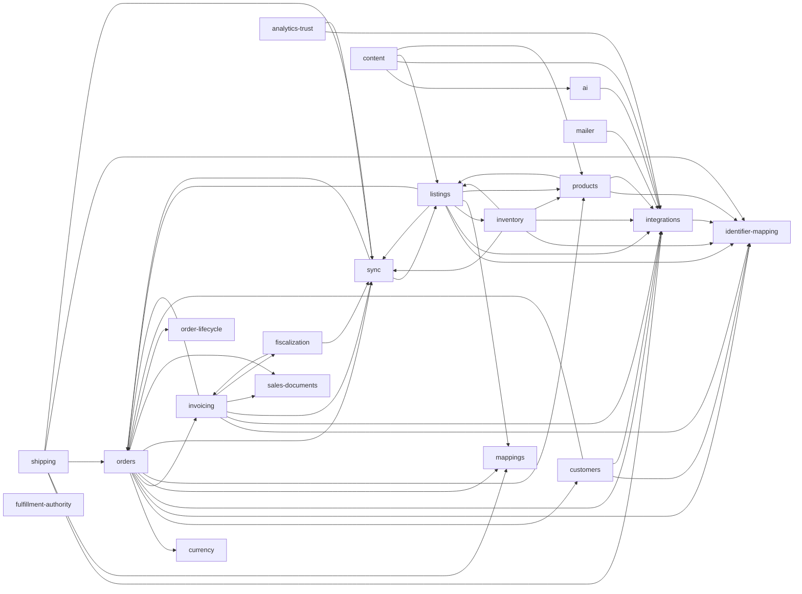

# Architecture Overview

## Table of Contents

1. [High-Level Architecture](#high-level-architecture)
2. [Core Bounded Contexts](#core-bounded-contexts)
3. [Capability Abstractions (Business Roles)](#capability-abstractions-business-roles)
4. [Hexagonal Architecture Structure](#hexagonal-architecture-structure)
5. [Cross-context dependencies in core](#cross-context-dependencies-in-core)
6. [Module Organization](#module-organization)
7. [Data Flow](#data-flow)
8. [Technology Stack](#technology-stack)

---

## High-Level Architecture

*See [ADR-001](./architecture/adrs/001-hexagonal-architecture-and-bounded-contexts.md) for the decision rationale.*

OpenLinker follows a **Hexagonal Architecture** (Ports and Adapters) pattern, organized as a modular monorepo. The system is designed to be:

- **Modular**: Clear separation between core domain and integrations
- **Extensible**: Easy to add new platforms without modifying core logic
- **Testable**: Domain logic isolated from infrastructure concerns
- **Maintainable**: Business capabilities abstracted from concrete implementations

### Architecture Diagram

```
┌─────────────────────────────────────────────────────────────────┐
│                         Frontend/UI                             │
│                    (Separate Application)                       │
└────────────────────────────┬────────────────────────────────────┘
                             │
                             │ HTTP REST API (JWT)
                             │
┌────────────────────────────▼────────────────────────────────────┐
│                    Core API (OpenLinker)                        │
│                                                                 │
│  ┌──────────────────────────────────────────────────────────┐   │
│  │              Interfaces Layer (HTTP/REST)                │   │
│  │  - Controllers (REST endpoints)                          │   │
│  │  - Request/Response DTOs                                 │   │
│  │  - Authentication & Authorization                        │   │
│  └──────────────────────────────────────────────────────────┘   │
│                                                                 │
│  ┌──────────────────────────────────────────────────────────┐   │
│  │           Application Layer (Use Cases)                  │   │
│  │  - ProductSyncService                                    │   │
│  │  - InventorySyncService                                  │   │
│  │  - OrderSyncService                                      │   │
│  │  - OfferSyncService                                      │   │
│  │  - MappingServices                                       │   │
│  │                                                          │   │
│  │  ┌────────────────────────────────────────────────────┐  │   │
│  │  │    Infrastructure Services                         │  │   │
│  │  │  - IdentifierMappingService                         │  │   │
│  │  └────────────────────────────────────────────────────┘  │   │
│  └──────────────────────────────────────────────────────────┘   │
│                                                                 │
│  ┌──────────────────────────────────────────────────────────┐   │
│  │              Domain Layer (Business Logic)               │   │
│  │   ┌──────────────┐  ┌──────────────┐  ┌──────────────┐   │   │
│  │   │   Products   │  │  Inventory   │  │    Orders    │   │   │
│  │   │   Domain     │  │    Domain    │  │    Domain    │   │   │
│  │   └──────────────┘  └──────────────┘  └──────────────┘   │   │
│  │                                                          │   │
│  │   ┌──────────────┐                                       │   │
│  │   │   Listings  │                                       │   │
│  │   │   Domain    │                                       │   │
│  │   └──────────────┘                                       │   │
│  │                                                          │   │
│  │  ┌────────────────────────────────────────────────────┐  │   │
│  │  │         Capability Ports (Interfaces)              │  │   │
│  │  │  - ProductMasterPort                               │  │   │
│  │  │  - InventoryMasterPort                             │  │   │
│  │  │  - OrderSourcePort                                 │  │   │
│  │  │  - OrderProcessorManagerPort                       │  │   │
│  │  │  - OfferManagerPort                                │  │   │
│  │  │  - PricingAuthorityPort (future)                   │  │   │
│  │  └────────────────────────────────────────────────────┘  │   │
│  └──────────────────────────────────────────────────────────┘   │
│                                                                 │
│  ┌──────────────────────────────────────────────────────────┐   │
│  │          Infrastructure Layer (Adapters)                 │   │
│  │   ┌──────────────┐  ┌──────────────┐  ┌──────────────┐   │   │
│  │   │  PrestaShop  │  │   Allegro    │  │   InPost     │   │   │
│  │   │   Adapters   │  │   Adapters   │  │   Adapters   │   │   │
│  │   └──────────────┘  └──────────────┘  └──────────────┘   │   │
│  │                                                          │   │
│  │  ┌────────────────────────────────────────────────────┐  │   │
│  │  │    Adapters Implementing Capability Ports          │  │   │
│  │  │  - PrestashopProductMasterAdapter                  │  │   │
│  │  │  - PrestashopInventoryMasterAdapter                │  │   │
│  │  │  - PrestashopOrderSourceAdapter                    │  │   │
│  │  │  - PrestashopOrderProcessorAdapter                 │  │   │
│  │  │  - AllegroOrderSourceAdapter                       │  │   │
│  │  │  - AllegroOfferManagerAdapter                      │  │   │
│  │  └────────────────────────────────────────────────────┘  │   │
│  └──────────────────────────────────────────────────────────┘   │
│                                                                 │
│  ┌──────────────────────────────────────────────────────────┐   │
│  │          Infrastructure Layer (Persistence)              │   │
│  │  - PostgreSQL (TypeORM)                                  │   │
│  │  - Redis (Caching, Event Bus)                            │   │
│  └──────────────────────────────────────────────────────────┘   │
└────────────────────────────┬────────────────────────────────────┘
                             │
                             │ HTTP/API Calls
                             │
        ┌────────────────────┼────────────────────┐
        │                    │                    │
┌───────▼──────┐    ┌────────▼────────┐    ┌─────▼──────────┐
│  PrestaShop  │    │     Allegro     │    │  Other         │
│     API      │    │       API       │    │  Platforms     │
└──────────────┘    └─────────────────┘    └────────────────┘
```

---

Frontend-specific conventions for the separate UI application are documented in `docs/frontend-architecture.md`.

---

## Core Bounded Contexts

The system is organized into the following core bounded contexts:

### 1. Identity
- **Responsibility**: User authentication, authorization
- **Key Entities**: User, Role, Permission
- **Location**: `apps/api/src/auth/` or `libs/core/src/auth/`

### 2. Products
- **Responsibility**: Product catalog management, product mapping between platforms
- **Key Entities**: Product, ProductMapping, ProductVariant
- **Location**: `libs/core/src/products/`
- **Capability**: Uses `ProductMasterPort` abstraction
- **Barcode Storage**: EAN/GTIN are stored on `ProductVariant` (not `Product`), as variants are the canonical offer-link targets.
- **Simple Products**: Products without combinations produce a deterministic synthetic variant to ensure a stable mapping target.
- **Connection-ownership guard on the staleness prune (#1904)**: neither `product_variants` nor `inventory_items` carries connection provenance, so the master-sync staleness sweeps (`MasterProductSyncService`'s `markVariantsStaleExcept`, `MasterInventorySyncService`'s `pruneStaleVariants`) key on the internal product id alone - correct only while ONE connection with the relevant master capability claims that id, which is what `getOrCreateInternalId`'s per-`(entityType, externalId, connectionId)` namespacing normally guarantees. Before every prune (both the partial post-pull sweep and the full-deletion sweep) each service asks the neutral `IEntityClaimService.findRivalClaimants` (`@openlinker/core/integrations`) whether another connection claims the same internal id *and* has `ProductMaster` / `InventoryMaster` enabled; on a hit the prune is **withheld** (never staling a sibling's live rows), no `master.*.stale` event is emitted, an error is logged, and the sync result reports `pruneSkipped: true` (the worker handler logs it with job context; `outcome` is unaffected). The claim lookup is one indexed `getExternalIds` read that short-circuits before the capability listing in the single-claimant case, and resolves capable connections via `listCapabilityAdapters({ lazy: true })` so no adapter is constructed. Deliberately a detect-and-withhold guard rather than a `connectionId` provenance column: the collision is unreachable through any supported workflow (it needs direct `identifier_mappings` manipulation), so the conservative runtime check beats a schema change plus backfill semantics.

- **Bounded, resumable master sweeps (#2218 / #2219, [ADR-048](./architecture/adrs/048-incremental-catalog-replication.md) decisions 4-6)**: both `master.product.syncAll` (every 20 min) and `master.inventory.syncAll` (every 15 min) used to enumerate an entire catalog and `map(...)` one child job per product with **no cap**, into a runner whose execution concurrency is 1 - a 20k-SKU connection enqueued 20k jobs per tick. Each run now enqueues at most a **budget** of children, records where it stopped on a connection cursor, and the next cron tick resumes; runs are serialised per connection by a `SyncLockPort` lock whose TTL covers one RUN, never one cycle. The shared shape is `runBoundedSweep` (`apps/worker/src/sync/bounded-sweep.ts`), copied from the **scan-offset** family (`IOfferStatusSyncService` / `IShopStatusSyncService` - `{limit, offset}` in, `nextOffset` out, handler persists the cursor), NOT from taxonomy's frontier-as-query, which re-derives remaining work from a predicate the master sweeps do not have. Four properties are load-bearing. (1) **The budget is derived from drain rate, not copied** - taxonomy's 500 bounds local category upserts, whereas one unit here is a child job doing a full per-product platform sync (~2-5 s) against a single execution slot, so `SWEEP_BUDGET_DEFAULT = 100` (≈55% of the shorter tick) with a 500 ceiling. This bounds the fan-out; it does **not** make the catalog fast, and contention between that work and a buyer's order remains ADR-050's subject (#2167). (2) **The cursor advances only when every enqueue in the page succeeded** - resumption removed the safety net that made a partial `allSettled` failure tolerable (the next tick used to re-enumerate everything), so a failure now holds the cursor and retries the page rather than skipping ids silently until the next cycle. (3) **The child idempotency key is scoped to the CYCLE, not the outer job id** - a resuming tick is a different job, so a job-scoped key would re-enqueue the same child under a fresh key on every overlapping page (#2039's `reconcileId` lesson). That also makes a crash between enqueue and cursor write safe: the retry mints identical keys. The cursor value is consequently the repo's first **composite** one (`{cycleId}:{offset}`), parsed defensively so a malformed value starts a fresh cycle rather than wedging the sweep. (4) **The old `MAX_PAGES` guard is deleted** - it warned `pagination may be truncated` and then returned `outcome: 'ok'`, so a catalog past `MAX_PAGES x pageSize` was silently half-replicated while the job read healthy. A budgeted run resumes instead of truncating, and nothing throws on a bound (ADR-048 decision 5: on a cron path a throw costs `maxAttempts=10` with backoff to 6 h plus one accumulating dead row per tick). A budgeted run reports a plain `outcome: 'ok'` like every other sweep; the **cursor** is the observable that a cycle is in flight. #2219 additionally gives `IdentifierMappingQueryPort.listExternalIdsByConnection` an **optional** page argument (return type stays `string[]`) - the inventory sweep reads OL's own mappings rather than the platform, and that read was a bare unbounded `find({entityType, connectionId})`. Optionality is what keeps the ~12 plugin sites that type-depend on `IdentifierMappingPort` source-compatible. A paged read is ordered by `externalId`, which is **unindexed** for that partition - an accepted, documented per-page sort rather than an oversight.
- **Deletion reconciliation - `master.product.reconcile` (#2222, [ADR-048](./architecture/adrs/048-incremental-catalog-replication.md) decision 2)**: the deletion authority for the catalog, and the counterpart to the sweeps above. A catalog enumeration **cannot** reveal a deletion - `master.product.syncAll` reads ids FROM the master, so a deleted product simply stops appearing and no child ever runs for it. This pass inverts the direction: it enumerates **OL's own `Product` identifier mappings** (paged via `listExternalIdsByConnection`, #2219), filters synthetic variant ids, and enqueues the *existing* `master.product.syncByExternalId` - so a live product re-syncs idempotently and a deleted one raises `MasterProductNotFoundError` into the deletion path. That is precisely the shape `master.inventory.syncAll` has always had, which is why an `InventoryMaster` connection already had deletion coverage and a `ProductMaster`-only one had none. **Absence is never the signal, and must not become one**: neither shipped adapter paginates stably (`PrestashopProductMasterAdapter.listExternalIds` sends no `sort`, `WooCommerceProductMasterAdapter.listExternalIds` no `orderby`), so a cycle spanning many ticks can miss a LIVE row after a mid-cycle delete shifts the offsets - and staling on that inference would zero that product's offers on every marketplace via #1689. Because the child is the authority the pass carries **no guards of its own** (an empty enumeration enqueues nothing; a missed mapping is re-checked next cycle; the #1904 guard lives where the write is), takes its own lock and cursor namespace (`product-reconcile`, a fourth `SweepKind`) so the full sweep cannot starve it, and uses its own child idempotency namespace so a re-check never dedups against a sweep or delta child. **Default ON**, unlike the opt-in delta pass (#2220) - it closes a live defect where a deleted product's offers kept selling, so every existing `ProductMaster` install picks it up on deploy as new recurring platform load. Hourly, and **not** capability-gated to connections lacking `InventoryMaster` - a capability-shaped exclusion rots and would skip the #1904 case - at a steady-state cost of ~14% more per-product children on a connection carrying both. Note the **cron is the tick, not the cycle**: a cycle spans `ceil(N / budget)` ticks, so detection latency is ~`ceil(N/100)` hours at the defaults.
- **The master capability ladder - modified-since rung (#2220 / #2221, [ADR-048](./architecture/adrs/048-incremental-catalog-replication.md) decisions 1/3/7)**: a `ProductMaster` adapter can now **say** that it enumerates only what changed since a watermark, via the `ModifiedProductLister` sub-capability (`listExternalIdsModifiedSince`) - the first entry in a new `products/domain/ports/capabilities/` directory. `master.product.syncDelta` consumes it: same `runBoundedSweep` budget/cursor shape as the full pass, its own lock, and a per-connection watermark cursor. Six properties are load-bearing. (1) **It is additive and OPT-IN** (`OL_MASTER_PRODUCT_DELTA_SYNC_ENABLED`, default off) - `master.product.syncAll` keeps its cadence and stays the bootstrap and reconciliation path, because only a full enumeration may conclude a product DISAPPEARED (decision 2); the two-cadence policy is #2222's. (2) **The rung is guard-only** - absent from every manifest and from `CoreCapabilityValues`, narrowed off the dispatched `ProductMaster` adapter. Advertising it would be harmless in itself, but a connection's `enabledCapabilities` is stamped at create and never retro-filled, so *gating* on the new name would drain nothing for every connection that already exists (the #2085 shape) - and an advertised name invites exactly that gating. The cost accepted is operator-facing discoverability. (3) **The delta pass takes its OWN lock.** Sharing the full sweep's would let it starve indefinitely - on a large catalog the full sweep is mid-cycle more or less permanently by #2218's design - while logging "already in progress" and returning ok, i.e. the delta path looking healthy while being wrong. The price is that a product in both passes is enqueued twice under two cycle ids; that is bounded and harmless because the child is idempotent. (4) **The watermark is captured BEFORE the read, overlapped by a configurable lookback, and advanced only when the cycle completes** (decision 3, never `since = lastRunAt`) - so a resuming tick recomputes the same `since` and the query set is stable across a multi-tick cycle. Re-reading is free *only* because every downstream write is idempotent. A missing watermark stamps and enumerates nothing rather than meaning "since the epoch", and warns, since a lost watermark is indistinguishable from a first run. (5) **Two silent-degradation modes are made observable**: a cycle that never completes never advances the watermark and quietly becomes a permanent full pass (warned on watermark age), and offset paging over a live `orderby=modified asc` set can step over a row that was re-modified mid-cycle - accepted, and survivable *only* while the full pass still runs, which is recorded in ADR-048 as a hard dependency for #2222. (6) **Only WooCommerce declares it**, and it reports **product-level freshness only** - a variation edit does not bump the parent's `date_modified` (WC #19562) and stock is not on this rung at all (`update_product_stock()` bypasses `wp_update_post()`). PrestaShop declares neither rung after the #2221 spike measured it: a combination write leaves the parent's `date_upd` untouched while a product write moves it, and neither `ps_product_attribute` nor `ps_stock_available` carries any mutation timestamp to union against. No inventory rung is written at all - decision 1 forbids an interface with no implementer, and after the spike no `InventoryMaster` in the tree can implement one.

### 3. Inventory
- **Responsibility**: Inventory synchronization, stock level management
- **Key Entities**: Inventory, InventoryAdjustment, InventoryMapping
- **Location**: `libs/core/src/inventory/`
- **Capability**: Uses `InventoryMasterPort` abstraction
- **Variant-keyed master inventory (#822, [ADR-010](./architecture/adrs/010-variant-keyed-master-inventory.md))**: `MasterInventorySyncService` keys each `inventory_items` row to the product's canonical **variant** (a simple product's deterministic synthetic variant), not the bare product — so the variant-keyed availability read (`getAvailabilityByVariantIds`, used by the bulk offer wizard) finds stock. Resolution precedence: adapter-supplied `Inventory.variantId` → the product's lone variant when it has exactly one → else product-level (`productVariantId = NULL`).
- **Per-combination master stock (#823)**: the master sync iterates `InventoryMasterPort.listInventory(productId)` — one `Inventory` per variant — and writes one variant-keyed row each. The PrestaShop adapter enumerates `stock_availables` for the product and emits one entry per combination (resolving each combination id to its `ProductVariant`), or the synthetic variant for a simple product, so multi-variant products now carry correct per-variant stock. Marketplace-agnostic: any inventory master expresses per-variant stock the same way. The Allegro destination half (one auto-grouped offer per variant) remains **#824**.
- **Master-side deletion (#1688)**: a product deleted at the inventory master surfaces as the neutral `MasterProductNotFoundError` (from `@openlinker/core/products`) at the `InventoryMasterPort` boundary — each adapter translates its own platform not-found there, so no platform exception type reaches core (the inventory-context counterpart of the products-side #1599 path). `MasterInventorySyncService` catches it, marks every one of the product's `inventory_items` rows stale via an empty keep-set, and then **delegates to the products context** (`IMasterProductSyncService.markProductDeletedAtMaster`, #2222) rather than emitting itself - the delegate stales `product_variants`, emits `master.product.stale`, and applies its own `ProductMaster` rival guard, whose withheld outcome propagates back into `pruneSkipped`. Until #2222 this path staled `inventory_items` ONLY, while `StaleOfferPauseService` re-verifies `product_variants.isStale` before pausing anything - so the whole #1689 chain fired and paused nothing, and a product deleted at the master kept selling. One deletion, one event, one authority. It reports `masterDeleted: true`; `MasterInventorySyncHandler` maps that to a terminal `outcome: 'business_failure'` ([ADR-007](./architecture/adrs/007-syncjob-status-vs-outcome-split.md)) so the runner does not retry a permanent condition. The neutral error is reserved for a **platform-reported product absence** — a mapping gap, a corrupted mapping, or a merely *inferred* absence (e.g. "the product resolves but carries no stock rows", which the PrestaShop adapter disambiguates with a product probe) stay platform-native and therefore retryable. A partial removal (some variants gone, product still resolves) instead flows through the normal sync's unconditional variant prune, which emits `master.variant.stale`; an empty-but-successful master response that stales every known row is warn-logged, since it reports `masterDeleted: false` / `outcome: 'ok'`.
- **Per-connection stock safety buffer (#1844)**: an operator-configurable **reserve** held back per destination connection so a fast-moving item cannot oversell between syncs. The published quantity is `max(0, masterStock - reserve)`. The reserve lives on `Connection.config.stockSafetyBuffer` (JSONB — no schema/migration change) and defaults to `0`, which preserves the pre-#1844 pass-through behaviour (master is authoritative, including 0). Two pure, marketplace-neutral helpers own the policy (`readStockSafetyBuffer` / `applyStockSafetyBuffer` in `@openlinker/core/identifier-mapping`, mirroring the `parseTriggerModel` config-coercion precedent). It is applied at **both** stock write sites and applied once per flow: the publish/create builders (`OfferBuilderService`, `ProductPublishBuilderService`) stamp the buffered `command.stock`, and the inventory write-back choke point (`InventorySyncService.updateOfferQuantities`, reached by both the offer and shop-product propagation fan-outs) buffers every written-back quantity. The buffer is orthogonal to the FE bulk stock policy (`use-master` / cap / flat, #726); it is the destination-side floor applied after the operator's chosen source quantity.
- **Bounded, resumable inventory sweep (#2219, [ADR-048](./architecture/adrs/048-incremental-catalog-replication.md))**: `master.inventory.syncAll` is budgeted, cursor-resumed and per-connection-locked - see the identical shape described under *Products* above, which both sweeps share via `runBoundedSweep`. Two things differ here. It enumerates **OL's own identifier mappings**, not the platform, so #2219 additionally gave `IdentifierMappingQueryPort.listExternalIdsByConnection` an optional page argument (that read was previously a bare unbounded `find({entityType, connectionId})`); and the synthetic-variant filter runs *after* the page is read, so the cursor advances by rows READ rather than children enqueued, or the filtered rows would be re-read every tick. Note this sweep carries more weight than its cadence suggests: `inventory.propagateToMarketplaces` has no cron of its own, so on a master with no stock webhook it is the only thing that discovers stock drift - it is paced, never disabled.
- **Locations are first-class rows (#2313, [ADR-058](./architecture/adrs/058-multi-location-positions-reservations-availability-authority.md) decision 1)**: `inventory_items.locationId` was nominally location-aware but pointed at nothing — no location table existed anywhere in the tree. `inventory_locations` is the operator-authored row it now names: `code` (unique, normalised in exactly one place — the application service — because the index is case-sensitive), `name`, `kind`, `status`, `externalRef`, plus `countryIso2` / `postcode` / optional `numeric(9,6)` geo carried **from day one** because the fulfillment router's filters are unimplementable without them and the table is cheapest to get right while new. **`ownerConnectionId` is provenance, never authority**: it records whose sync may write positions here, not who decides anything about them — authority over a position is separately assignable ([ADR-052](./architecture/adrs/052-independently-assignable-fulfillment-authorities.md)), and its FK is `ON DELETE SET NULL` (the `FK_category_mappings_source_connection` precedent) so an operator's warehouse outlives the integration that stocked it. Two absences are deliberate and load-bearing. **`locationId IS NULL` permanently means "the master declines to locate its stock"** (decision 2) — never a default location, so no row here is ever a stand-in for that NULL. And **no FK is added to `inventory_items.locationId`**: existing values are unattributable, making that a step-(iii)-class change under decision 3, which is why the #1904 withhold guard above stays in force as the documented fallback. `Location` is deliberately absent from `CoreEntityTypeValues` — that union is the external-mapping vocabulary and a location has no external counterpart (`externalRef` is a free-text operator field, not an identifier mapping); ids are minted `ol_location_*` straight from `formatInternalId`, the `ShipmentRepository` shape. This slice is persistence only; the CRUD API is #2316.
- **Position provenance, and the `'legacy'` sentinel backfill (#2317, [ADR-058](./architecture/adrs/058-inventory-positions-and-provenance.md) ladder step (ii))**: `inventory_items.sourceConnectionId` (added nullable by #2314) records which connection's sync owns a position. Step (ii) is the pass that makes the column trustworthy enough for step (iii) (#2325, `SET NOT NULL` plus folding provenance into the position key): the `inventory.provenance.backfill` job stamps every pre-existing row with `LEGACY_SOURCE_CONNECTION_ID` (`'legacy'`, declared once in `inventory.types.ts` and pointed at by the ORM column comment and the #2314 migration), a bounded page at a time, until none remain. **The sentinel is a VALUE, never a wildcard** - it names one position whose owner is unknown, and a real sync overwriting it with its own connection id is the correct and only direction of travel. Four properties are load-bearing. (1) **It is a backfill, not a migration.** Stamping inside DDL would hold an `ACCESS EXCLUSIVE` lock across every row of the table every published quantity derives from; the pass instead runs one `UPDATE ... WHERE id IN (SELECT ... LIMIT n FOR UPDATE SKIP LOCKED)` per tick, so a row mid-write by a buyer-facing `setInventory` is skipped rather than waited on. (2) **The predicate IS the cursor, so `runBoundedSweep` is deliberately not called.** `bounded-sweep.ts` itself distinguishes the scan-offset family (a stable set a run reads through) from taxonomy's frontier-as-query (remaining work re-derived from a predicate), and `sourceConnectionId IS NULL` is unambiguously the second: every page CONSUMES its own selection, so an advancing offset over a shrinking set would step over rows and leave them unstamped - a silent gap surfacing only as #2325's `SET NOT NULL` failing months later. The sweep *primitives* are reused (budget, lock TTL, lock key, cursor keys) and only the offset machinery is not; the ACs the shape exists to deliver - budgeted, per-run locked, never advancing past unfinished work, self-terminating - hold structurally, because a failed page persists nothing at all. (3) **The budget counts ROWS, not children, so the shared 100 default does not transfer** - that number is derived in `bounded-sweep.ts` from a child job doing a full per-product platform sync against an execution concurrency of 1, whereas one unit here is a row in a local UPDATE. The page is the family ceiling of 500, which makes the *cron* the drain rate (~6k rows/hour at the default `*/5`). (4) **Completion is `remainingNull === 0` ALONE, never "the page stamped nothing"** - a page can legitimately stamp zero rows while work remains, when every candidate was locked and skipped, and latching on that would switch the pass off permanently over a transient contention window. The job runs globally under the nil-UUID system connection id (the predicate's whole subject is the *absence* of a connection axis; electing a real connection was rejected because the installs with the most NULL rows are exactly those whose original connection was deleted, and a moving election would move the latch). It is **default ON** - no platform calls, bounded, idempotent, and it un-gates a correctness fix - and self-latches on two `connection_cursors` keys that are also #2325's readiness artefact: `master.inventory-provenance.completedAt:connection:{system}` and `master.inventory-provenance.remainingNull:connection:{system}`. Deleting the completion row re-arms the drain, which is safe at any time. `remainingNull` is honest about its own staleness - a caller with no connection axis can insert a fresh provenance-less row a moment later, so #2325 re-counts before it acts.
- **Connection-ownership guard on the inventory staleness prune (#1904)**: `MasterInventorySyncService` withholds both its post-pull prune and its full-deletion prune when a second connection with `InventoryMaster` enabled claims the same internal product id - see the identical guard described under *Products* above (one shared `IEntityClaimService` seam, one capability value per context).
- *See [ADR-061](./architecture/adrs/061-advisory-reservations-and-availability-authority.md) for OL-owned advisory reservations and the `AvailabilityAuthority` capability.*
- **Available-to-promise is a seam with PROVENANCE (#2321, [ADR-061](./architecture/adrs/061-advisory-reservations-and-availability-authority.md) decisions 1/2/3)**: four shipped sites each computed a publishable quantity themselves — `InventorySyncService`'s write-back, both listing builders, and the stock-at-risk read — so the buffer rule lived in four places and there was nowhere for a reservation term or an external authority's answer to arrive. `IAvailabilityService` (`libs/core/src/inventory`, ADR-052's A1 row assigns availability to this context) is the one place that answers *"how many may we promise for this scope"*, returning a `PromisableQuantity` whose `provenance` is the point: `'computed'` from OL's own mirrored positions, `'authority'` once a dispatched adapter answers (declared, Wave 3, never produced here), or `'unknown'` — which callers must treat as **suppress the publish and alert**, never as `0`, since an absent number silently written as zero is how a healthy catalogue stops selling. The formula is `max(0, Σ available[live, all locations AND sources] − Σ olReserved[atpEffect='published'])` with the operator's `stockSafetyBuffer` applied last **as a Control** (decision 3), and three of its properties are load-bearing rather than incidental. **Summing across sources is correct, not a duplicate-counting bug** (ADR-058 decision 2) — two positions differing only in owning connection are legitimate coexisting mirrors, and deduplicating them here would silently move published quantities on a healthy multi-source install; that is #2319/#2325's subject. **`inventory_items.reservedQuantity` is never subtracted** — it mirrors the *master's own* bookkeeping and is already reflected in `availableQuantity`, so subtracting it would double-count. And **the ledger term ships empty rather than absent**: `ReservationLedgerReaderPort` is called with a REQUIRED `atpEffect` argument (never defaulted — the wrong default subtracts diagnostic holds from a real quantity) against `EmptyReservationLedgerReader`, so every answer is byte-identical to what the four sites publish today and Wave 2 becomes one provider-binding swap rather than a formula change under four live callers. Scope is the leaf's discriminated `AuthorityScope`, aliased **inventory-side** so the zero-sibling-edge leaf never learns an inventory-flavoured spelling of its own type exists; `channel` (the publishing shape) and `global` are answered, while `location` / `order` / `work` **throw** rather than degrade to an unfiltered number — ignoring a location filter is correct on a single-warehouse install and oversells the day a second one appears. A variant with no positions at all is `'computed'` `0`, deliberately **not** `'unknown'`: #1844 makes the master authoritative including zero and #1689 zeroes offers precisely so a deleted product stops selling, so routing that case to a suppressed publish would keep it selling. **Consumed by nobody in this slice** — the #2304 "vocabulary ships first" posture; rewiring the four sites onto the seam is #2323, which checks itself against the parity fixture this slice exports.

### 4. Orders
- **Responsibility**: Order ingestion, synchronization, and lifecycle management
- **Key Entities**: Order, OrderMapping, OrderStatus, IncomingOrder
- **Location**: `libs/core/src/orders/`
- **Capabilities**:
  - `OrderSourcePort` — cursor-based order-event ingestion from marketplaces *and* shops (`listOrderFeed` + `getOrder({externalOrderId})`)
  - `OrderProcessorManagerPort` — destination-shop order creation (`createOrder`, the only base-port method); post-create status/tracking and lifecycle reads live in composable sub-capabilities (`OrderFulfillmentUpdater`, `OrderStatusWriteback`, …). The canonical OL-owned lifecycle state machine is deferred (#1032).
- **The lifecycle phase is DERIVED, and projects one-way onto the status (#2305/#2307, [ADR-059](./architecture/adrs/059-order-lifecycle-derived-phase.md))**: `OrderStatus` (`pending|processing|shipped|delivered|cancelled|refunded`) stays the **transport** vocabulary for `OrderCreate` / `OrderFulfillmentUpdater` and is unchanged. Alongside it, the `order-lifecycle` leaf (§ 21) owns a derived `OrderLifecyclePhase` computed from facts by the pure `deriveOrderLifecyclePhase`; it projects **one-way** onto the transport status for writeback via `phaseToOrderStatus` and **never reads back** from it. `order_state_mappings` — the operator-configured destination status translation — remains a transport-layer translation and **never feeds the derivation**. Stating the direction explicitly is the revert precondition ADR-043 failed to meet: a phase that could be read back from a destination-translated status would let a marketplace's vocabulary silently redefine OL's own lifecycle.

### 5. Customers
- **Responsibility**: Customer identity resolution, customer projections, multi-origin identity management
- **Key Entities**: CustomerProjection, CustomerAddressProjection, DestinationAddressMapping
- **Location**: `libs/core/src/customers/`
- **Key Features**:
  - Customer identity resolution with email fallback mode
  - Multi-origin customer identity (same email across platforms → same internal customer)
  - Customer projections (Model C) for debugging and retry support
  - Configurable PII storage (hash-only mode for privacy compliance)
  - Address reuse tracking via destination address mappings
- **Identity Modes**:
  - `external_only`: Only use external buyer ID mapping (no email fallback)
  - `email_fallback`: Use email hash fallback if external mapping not found (may merge customers with shared emails)
- **Provisioning Model**: Destination-owned (Model A) - customers created in destination platform (e.g., PrestaShop)
- **Projection Model**: Lightweight internal storage (Model C) - non-authoritative projections for debugging

### 6. Listings (Offers)
- **Responsibility**: Marketplace offer/listing management, offer lifecycle, offer-to-product mapping
- **Key Entities**: Offer, Listing, OfferMapping, OfferStatus, OfferCreationRecord
- **Location**: `libs/core/src/listings/`
- **Capability**: Uses `OfferManagerPort` abstraction for offer operations (listing, quantity + field updates, offer creation, category directory, seller-policy discovery)
- **Key Features**:
  - Creating and updating offers on marketplaces
  - Managing offer quantities based on inventory
  - Offer-to-product mapping
  - Offer status synchronization
  - Price management for marketplace offers
- Offer mappings are populated via the `marketplace.offers.sync` job (pre-sync pipeline).
- Allegro offer sync uses `GET /sale/offer-events` with persisted cursor key `allegro.offers.lastEventId`.
- **Offer status sync (#816)**: the `marketplace.offer.statusSync` job refreshes the live marketplace publication status (`active | activating | inactivating | inactive | ended`) of mapped offers into the `offer_status_snapshots` table — the *steady-state* counterpart to `OfferCreationRecord`'s one-shot creation lifecycle. It reuses the `OfferStatusReader` capability, enumerates OL's own offer mappings paged by a rolling scan-offset cursor (`allegro.offerStatus.scanOffset`; Allegro has no bulk status endpoint), and writes a disjoint table from the creation poller (#447) so the two never race. See [ADR-009](./architecture/adrs/009-persisted-offer-status-snapshots.md).
- **Channel-side commercial snapshots (#2024)**: the same `marketplace.offer.statusSync` pass (and the same `refreshOne` path, #1760) also persists each mapped offer's **live marketplace price + available quantity** into an `offer_commercial_snapshots` table - the third disjoint listings snapshot table alongside `offer_status_snapshots` (#816) and `shop_product_status_snapshots` (#1845). **No second marketplace call**: `OfferStatusReadResult` carries an optional neutral `commercial` observation that Allegro and Erli each project off the offer/product resource their `getOfferStatus` already fetched. Calling `OfferReader.getOffer` alongside would double the per-offer request count, and calling it *instead* would either push per-platform status mapping into core (`MarketplaceOffer.status` is a raw-string passthrough, unlike the closed neutral union the status snapshot persists) or drop Erli's frozen-stock cache side effect - see [ADR-009 § Amendment (#2024)](./architecture/adrs/009-persisted-offer-status-snapshots.md). Every observed column is independently nullable and `null` never means zero: a sparse response records "not reported" rather than a `0` an operator cannot tell apart from a sell-out, and a good quantity is never discarded because the price was missing. The stored values are **what the marketplace reports** - already net of `stockSafetyBuffer` (#1844) and already the output of `pricingRule` (#1843) - so they are operator-facing as "on channel", never as OL's own stock/price. The commercial write is strictly supplementary and wrapped in a catch: a failure warn-logs and continues, so it can never abort the #816 status pass or stall its scan cursor. **Erli's price/quantity were blank on a default deployment until #2230**: the same commercial write hangs off Erli's `marketplace.offer.statusSync` task, which was strict opt-in (`OL_ERLI_OFFER_STATUS_SYNC_SCHEDULER_ENABLED === 'true'`) while Allegro's defaulted ON - so an operator saw no error and no log line, just an empty column, and because the unregistered task also wrote no status snapshot, every mapped Erli offer sat permanently in the `Unsynced` lifecycle bucket and was invisible on the default `/listings` tab. The gate existed for a **status-specific** reason (#1063/#992: a wrong or absent Erli `status` field would fall through to `inactive` and write `inactive` snapshots for every mapped offer), it never applied to the commercial payload, and #2230 retired it - the sandbox swagger declares `ProductResponse.status` as `enum ["active","inactive"]`, so the premise had expired. Both Erli tasks now register unconditionally and keep their per-tick `enabledEnvVar`, so `OL_ERLI_OFFER_STATUS_SYNC_SCHEDULER_ENABLED=false` restores the old behaviour. Read surfaces + FE rendering are follow-ups in the same epic.
- **Offer status read + post-terminal reconcile (#1760)**: the snapshot is the *authoritative operator-facing live status*. `OfferStatusReadService` exposes it per product (`GET /listings/products/:productId/offer-status`, rendered on the products drawer), and a manual `POST .../offers/:externalOfferId/refresh-status` force-reads one offer. Because the creation poller (#447) terminalises a record to `draft`/`failed(POLL_TIMEOUT)` when Allegro's validator outruns its ~9-min budget — and Allegro may activate the offer minutes later — the poller then schedules a bounded, delayed `marketplace.offer.refreshSnapshot` job (~2/8/20 min) that re-reads live status via `OfferStatusSyncService.refreshOne` and upserts the snapshot, self-rescheduling while in-flight. The terminal creation record is never mutated (ADR-009 disjoint-tables invariant); the snapshot is the moving part, with the hourly sync as the backstop. Spun out of #1520.
- **Create-path status snapshot (#2039)**: before this, a successful offer create wrote **no** `offer_status_snapshots` row at all — `upsert` had exactly two callers, both in `OfferStatusSyncService` — so a freshly published offer had no live status until the hourly rolling scan happened to reach it (~40 h worst case on a 4,000-offer catalog, since a new mapping enters the `createdAt DESC` scan at an offset the cursor has already passed). The fix is one rule: **when an authoritative publication status is already in hand, persist it; otherwise write nothing.** Adapters report it through an optional `CreateOfferResult.publicationStatus` (set only when the platform's create response carried a status — Allegro maps `publication.status`; an adapter with nothing authoritative, e.g. Erli's async 202, omits it and no row is written rather than guessing a status the operator would act on). `IOfferStatusSyncService.recordObservedStatus` is the single write seam — it owns the snapshot port and every other `upsert` caller — invoked from exactly two places: unconditionally at the end of `OfferCreationExecutionService.executeCreation` (which also covers the previously-uncovered case where `scheduleFirstPoll` fails and no poll ever runs), and on the creation poller's `active` terminal, where the live read just happened (scheduling a delayed re-read of what was just read was waste; `POLL_TIMEOUT`/`draft` keep their #1760 ladder). Both call sites are **best-effort and never throw**: `loadOrCreateRecord` carries no terminal-state guard, so a throw after the create would let a job retry call `createOffer` again — Allegro does not dedup product-offer creates, so that would trade a missing status row for a duplicate live offer. Making the table multi-writer also required the `upsert` to become a freshness-guarded `INSERT … ON CONFLICT DO UPDATE` — see the ADR-009 amendment above. Erli status coverage stays with #992 (its status read defaults unknown values to `inactive`, which the review-#1063 scheduler gate deliberately suppresses). Two adjacent operator-facing gaps close in the same change. (1) **Reconcile-key scoping**: the #1760 ladder keyed its job `refreshSnapshot:{externalOfferId}:{attempt}` against a globally unique, TTL-less `sync_jobs.idempotencyKey`, so one offer id could only ever receive ONE attempt-1 reconcile - across connections (an Erli `externalOfferId` IS the internal variant id, shared by every Erli connection), across re-creates, and across retry waves, each silently deduped against a long-dead job. A `reconcileId` now identifies one chain: minted when attempt 1 is scheduled, carried through the handler's self-rescheduled follow-ups, and folded into the key by the shared `buildOfferRefreshSnapshotIdempotencyKey` (one format, two writers). The field is **optional** so a chain already in flight across the deploy keeps rescheduling under its legacy key instead of dead-lettering; at-most-one chain per terminalisation was never the key's job anyway - the record state machine owns it (`pollOnce` no-ops once the record leaves `validating`). (2) **The per-product status read now reports mapped-but-unread offers**: `IOfferStatusReadService` returns an `OfferPublicationStatusView` per offer OL has mapped to the product, with `publicationStatus: null` / `lastStatusSyncedAt: null` when no snapshot exists, instead of snapshot rows only. Previously "this product has no offers" and "its offers have no status yet" were the same empty response, and because the FE renders the manual `POST .../refresh-status` action per returned row, the mitigation was unreachable for exactly the offers needing it (the panel short-circuited to an empty state) - curl was the only route. The panel now lists such an offer as `Not synced yet` with a `Check status` action.
- **Why a listing cannot sell, and who it is about (#2231)**: a marketplace that reports a REASON alongside a status had nowhere to put it. `OfferStatusReadResult.validationErrors` was, for Erli, only ever populated from a `rejected` status branch that could not be reached - Erli declares `status` as `enum ["active","inactive"], nullable` and has no rejection status, and `statusReason` is not a property of its `ProductResponse` at all - so `validationErrors` was permanently `[]`, `resolveOfferLifecycle` routed every blocked Erli offer to `Draft`, and the `Invalid` bucket could never contain one. The reasons were in `ProductResponse.buyableProblems` (an 18-value enum) and `archived`, neither of which OL read. Three pieces close it. (1) The adapter maps each code to an operator-facing sentence, keyed by the platform's own `code` - the copy lives adapter-side because only the adapter knows what its codes mean, and the raw value survives the round trip so an operator can quote it in a support ticket and an unrecognised code is surfaced rather than dropped. `archived: true` reports `'ended'`, not `'inactive'`: Erli's own description is that an archived product cannot be bought and disappears from the seller panel, and `'ended'` is additionally the only bucket `countByConnectionAndVariants` treats as re-listable, so the offer becomes fixable through the wizard instead of being silently skipped. A `status: 'active'` offer stays `'active'` even carrying problems - Erli is the authority on whether it published the offer, and overruling it would put words in the marketplace's mouth. (2) Core gains the neutral vocabulary (`OfferValidationProblem` + `OfferValidationScope`, with `readValidationProblems` / `splitOfferValidationProblems` as pure helpers beside `offer-lifecycle.types.ts`) and persists it **additively** in the `statusDetails` jsonb: `validationMessages` is still written first and is still what the lifecycle rule and its SQL twin read, so no row moves between buckets for a reason other than now having messages at all, and no migration is needed. `resolveOfferLifecycle` is unchanged - populating `validationErrors` is what moves the row into `Invalid`, through the rule that already existed. (3) **The offer-vs-account split is declared by the adapter, never inferred in core.** Three of Erli's reasons describe the SHOP (`shop-activity`, `shopKyc`, `blocked`); the platform reports those against every one of the seller's offers, so per-row rendering would stamp one sentence on every row and bury the single actionable fact. The adapter marks them `scope: 'account'` and core splits on that neutral field - a core-side list of Erli strings would have been marketplace vocabulary in `libs/core`, and an adapter that declares nothing normalises to `'offer'` and behaves exactly as before. The frontend renders the three surfaces the split implies: one offer-scoped reason per row plus an overflow count (`.listing-cell__reason` is single-line by design, and the full list rides in its `title`), a **muted** variant so the red line always means outstanding work (an offer switched off with nothing reported says so quietly, and a row whose only problem is shop-level points at the notice instead of repeating it), every reason with its raw code in the per-product `OfferPublicationStatusPanel`, and one connection-level `Alert` above the table per affected connection - derived from the rows the page already fetched, which is also why it counts "the listings shown" rather than claiming a total the paged, filtered read cannot support. Erli's status-sync scheduler task is separately opt-in (#2230), so on a default deployment there is no snapshot to render until that lands.
- **Stale-variant offer pause (#1689)**: closes the fail-open marketplace side of a master-side deletion (#1599). When `product_variants.isStale` flips true, the `events.master.deletion` stream (see § Data Flow) is consumed by a worker stream handler (`MasterDeletionToJobHandler`) that enqueues `marketplace.offer.pauseStale`; the core `StaleOfferPauseService` re-verifies each variant is still stale immediately before zeroing its mapped offers' quantity (never trust the event's variant list as authority — a reappearance racing the event must never zero a live offer), fanning out across every connection the variant is mapped on. Quantity 0 is the pause primitive — no adapter in the repo exposes a deactivation/publication write, and zero already stops the offer selling on every shipped marketplace; a first-class `OfferDeactivator` capability is a deferred follow-up. Because the deletion event is published at-most-once (fire-after-commit, never re-emitted once the rows are already stale), an hourly `marketplace.offer.pauseStaleSweep` reconcile task (default ON, per `OfferManager`-capable connection) re-asserts the pause by reading straight from the persisted `isStale` flag via `OfferMappingRepositoryPort.findStaleMappedVariants` — the guarantee that survives a lost event. A concurrent `inventory.propagateToMarketplaces` run skips its offer branch for a stale variant, closing the re-raise race between the two flows. The bulk offer wizard (`BulkListingSubmitService.expandVariantJobs`) skips `isStale` siblings/selections so a deleted variant can never become a *new* offer either.
  - **Operator-facing honesty (#1689)**: an order whose item resolution fails because the mapped variant is `isStale` reads `OrderRecord.recordStatus = 'source_deleted'` (distinct from the ordinary, self-healing `'awaiting_mapping'` gap) with `mappingFailureReason` carrying the reason — surfaced as a dedicated health bucket + list badge + detail-timeline narration, and excluded from bulk dispatch with its own ineligibility reason. A `master.product.syncByExternalId` job whose `business_failure` was caused by the deletion carries `outcomeReason: 'master_deleted'` on `sync_jobs`, rendered as a distinct jobs-list label instead of the generic "business failure".
  - **Known gap — Erli seller-frozen stock**: `ErliOfferManagerAdapter` silently skips the quantity write when the connection has seller-frozen stock (`isStockFrozenCached`), so the pause is a no-op on such a connection — a deliberate existing adapter behaviour (a seller who froze stock owns it), not something #1689 changes. No operator-facing warning surfaces this gap yet; a follow-up.
  - **Remediation note — delete-then-recreate**: recreating a deleted product at the master usually mints a new master-native id, so the old `identifier_mappings` / `product_variants` rows tied to the deleted id stay `isStale` forever (nothing re-associates them with the new id). The paused offer stays paused; an operator noticing a "phantom" stale variant should re-map or delete the orphaned mapping rather than expect it to self-heal.
- Offer linking by barcode uses master-catalog scoping and links only on unique matches.
- **Destination-aware duplicate guard (#1837, semantics corrected by #1933)**: publishing behaves asymmetrically per destination kind. The **marketplace** path is guarded at *intake*: `BulkListingSubmitService.filterAlreadyListed` is the authoritative backend guard - it excludes from the batch every variant that already carries an active offer mapping on the target connection, because re-listing would both create a duplicate offer (batch-scoped idempotency keys don't dedup across batches, and Allegro doesn't enforce uniqueness on product-offer `external.id`) and fragment the auto-grouped listing (#824). Only past that guard does the execution layer (`OfferCreationExecutionService`) call `createOffer` unconditionally, so on the wizard path - the single FE entry point since #1754 - a duplicate offer is never produced. The **shop** path does not filter: `ProductPublishExecutionService` resolves the `ShopProduct` mapping first and **upserts the existing product** (`PUT /products/{id}`), which is a legitimate re-publish. `PublishedVariantsService.getPublishedVariantIds(connectionId, variantIds)` (`POST /listings/published-variants`) unions two connection-scoped reads - `OfferMappingRepositoryPort` (marketplace) + `ShopProductMappingRepositoryPort` (shop) - to report which variants already have a listing there; because a connection carries only one mapping kind the union is destination-kind-agnostic and can't double-count. The FE (picker + wizard Review) renders an "already on {destination}" chip and a confirm before publishing, resolving the wording from the connection's capabilities, never `platformType`. **The confirm's meaning differs per kind, matching the backend**: marketplace says the already-listed variants "will be **skipped, not duplicated**" and its primary action is "Publish remaining variants" (it is a warning about a *partial* submit, not an offer to duplicate); shop says "updates the existing product (upsert)" / "Update existing" and really is a soft warning - the publish proceeds for every selected variant. Making marketplace offer-create mapping-idempotent (so an explicit operator confirm could legitimately re-publish rather than skip) is out of scope. The two post-filter outcomes on the marketplace path are reported explicitly (#1933): if *every* expanded variant was filtered the submit fails with `AllVariantsAlreadyListedException` -> 400 (distinct from the generic `EmptyBulkSubmissionException`, which stays reserved for a submission that resolved to no variants at all); if only some were, the batch proceeds and `submit` returns `skippedAlreadyListedCount`, threaded through the response DTO to the FE success toast so the operator sees the batch shrink.
- **Category parameter sections (#415 / #419)**: per-platform create-offer requests may split category parameters into **offer-section** and **product-section** payloads (`body.parameters[]` vs `body.productSet[].product.parameters[]` on Allegro — the latter carries Brand, Model, Manufacturer-code, etc., and mirrors the shape Allegro returns from `GET /sale/product-offers/{offerId}`). The neutral `CategoryParameter.section: 'offer' | 'product'` field carries this distinction through to adapters; the wizard renders both kinds in one unified list and the FE serializer (`serializeAllegroParameters`) splits them into two arrays at submit time. Adapters that cannot distinguish always emit `'offer'`.
- **Public surface**: `@openlinker/core/listings` exposes pure contracts (ports, types, capability guards, entities, exceptions, service interfaces, Symbol tokens) safe to value-import from any sibling package. Runtime wiring (`ListingsModule` + the 8 `@Injectable` service classes) lives on the `@openlinker/core/listings/services` subpath — kept separate to prevent runtime circular requires when sibling packages value-import from the main barrel (#337/#359). Cross-context ORM-entity access (host-only) is routed through `@openlinker/core/<ctx>/orm-entities` sub-barrels (#594) — see `docs/engineering-standards.md § Import Aliases` for the general rule.
- **Bulk-flow lifecycle (#726)**: a `BulkOfferCreationBatch` (#734) is the parent aggregate; four core application services own its phases — `BulkOfferCreationSubmitService` (intake, #736), `OfferCreationEnqueueService` / `OfferCreationExecutionService` (per-child enqueue + run, shared with single-offer), `BulkOfferCreationProgressService` (counter advancement gated at-most-once by `bulk_batch_advancements`, #737), and `BulkOfferCreationRetryService` (#742). All four delegate to the same single-offer primitives — there's no parallel "bulk" pipeline. `BulkOfferCreationRetryService` reopens a terminal-state batch: per failed record it deletes the `bulk_batch_advancements` row, decrements `failedCount` lock-stepped to the record reset, then transitions `completed | partially-failed | failed → running` once after the loop. The per-record V2 payload is rebuilt from the persisted `request` snapshot + the parent batch's `sharedConfig.generateDescription` / `sharedConfig.descriptionTone` (the snapshot itself doesn't carry AI flags — they're batch-scoped). Each retry wave uses a wave-distinct idempotency key (`bulk:{batchId}:variant:{variantId}:retry:{retryWaveId}`) to bypass the 7-day TTL on the original submit's dedup gate.
- **Multi-variant expansion (#824)**: `BulkOfferCreationSubmitService.submit` treats each submitted id as a primary-variant id and, for a **multi-variant** product, expands it into one offer-creation job per sibling variant before persisting the batch (so `totalCount` matches the real fan-out). Each variant-offer sources its `stock.available` from per-variant master inventory (`IInventoryQueryService.getAvailabilityByVariantIds`, #823) — **master is authoritative, including 0**, so an out-of-stock variant lists as 0 rather than being backfilled with the operator's bulk quantity (the operator quantity stays the source for single-variant / passthrough offers). Each offer self-links to its own Allegro catalog product by its own barcode (siblings drop the wizard-resolved `productCardId`). Allegro auto-groups the resulting offers into one buyer-facing listing from the Product Catalog (GTIN + distinguishing parameter) — the explicit variant-set API (`/sale/offer-variants`) was removed 14 Apr 2026 and is not used. Single-variant products and unknown ids pass through unchanged. Emitting OL variant `attributes` as explicit Allegro distinguishing parameters is a deferred follow-up (grouping already works off each variant's own catalog product).
- **Neutral variant-grouping command field (#1065)**: `OfferBuilderService.buildCreateOfferCommand` stamps a platform-neutral `CreateOfferCommand.variantGroup` (`OfferVariantGroup` = an opaque `groupId` shared by every sibling — today the parent OL product id — plus this variant's distinguishing `attributes`, flattened from `ProductVariant.attributes`) for a sibling of a **multi-variant** product (`getVariantsByProductId(...).length > 1`); single-variant / simple products leave it absent and list standalone. The field is the marketplace-neutral seam for explicit grouping: explicit-grouping adapters map it to their wire shape (Erli → `externalVariantGroup` + `attributes`, #986; `groupId` is BODY-ONLY and must never be path-routed), while auto-grouping adapters (Allegro) ignore it and group off their own catalog product (#824). No platform name leaks into core — the adapter owns the neutral→wire mapping.
- **Unified offer-creation FE entry (#1754)**: the frontend has a single offer-creation entry point — the bulk offer wizard. `/listings` "Create offer" opens a multi-select, paginated, searchable product picker (whole product = all variants, a single variant, or a mix across products) that routes into the wizard at `bulk-create/wizard?productIds=…[&variantIds=…]&connectionId=…`; a single selected variant renders the wizard's flat single-offer path. The old per-platform single-offer wizards (`AllegroCreateOfferWizard`, `erli-create-offer-wizard`) and their `offerCreationWizard` plugin-contribution dispatch were removed — no backend/job change (the wizard already delegates to the same single-offer core primitives, #726).
- **Borrowed-taxonomy mapping reuse (#1045, [ADR-023](./architecture/adrs/023-cross-platform-category-and-attribute-projection.md) §40/§83)**: a destination that *borrows* its taxonomy (Erli — accepts Allegro ids verbatim, ships no `CategoryBrowser`/`CategoryParametersReader`) reuses an operator's existing PrestaShop→Allegro **category and attribute** mappings with **zero re-authoring**. It declares the owner taxonomy it consumes via the `TaxonomyBorrower` capability (`getBorrowedTaxonomy(): TaxonomyOwner`, e.g. `'allegro'`); `OfferBuilderService` threads that value + the master `sourceConnectionId` into `CategoryResolutionService` and `AttributeProjectionService`, which fall back from a destination-keyed lookup to the owner's provenance-matching rows (`destination_taxonomy_provenance`). Capability-driven, never `platformType`; the downstream `source:"allegro"` emission was already in place (#985/#1096) — #1045 wired the resolution half. **#2210 extends borrowing from the operator's *mappings* to the owner's *live catalogue*.** A borrowing destination has no product catalogue of its own, so `CategoryResolutionService.resolveEanMatcher` resolves the EAN lookup through a **peer connection that owns the borrowed taxonomy** and declares EAN matching - so a resolve on an Erli connection now issues up to one Allegro `/sale/products` call per variant on **the peer's** OAuth credentials, against **the peer's** rate-limit budget and cache keys. That cross-connection blast radius is the reason three properties are load-bearing rather than incidental. (1) **The borrow is optional and never fatal**: the discovery listing is `lazy` (no adapter is constructed while candidates are filtered), the destination's own connection is dropped first, and both the listing and the one surviving construction are caught - a third party's misconfiguration degrades to `no-match`, never to a 500 on the batch route or a `failed` stream, because that would make an optional upgrade worse than not having it. Owner selection is oldest-connection-wins, the same rule `findBySourceCategory` uses for borrowed mappings, so the catalogue lookup and the mapping fallback can never mean different owners. (2) **`getBorrowedTaxonomy()` must be ENVIRONMENT-QUALIFIED and must agree with the catalogue the borrower actually reads.** An Allegro connection declares `'allegro'` or `'allegro:sandbox'` per environment (`TaxonomyIdentityProvider`, #2063) and the owner match is exact, so a borrower that names the wrong environment silently matches nobody and every variant degrades - and because `resolveTaxonomyOwner` uses the borrower's value verbatim, the projection scope it reads and can be elected under would name an environment it does not read from (the #2063 failure ADR-037's identity rework exists to prevent). Erli therefore resolves both answers through one shared helper (`erli-allegro-taxonomy.policy.ts`) rather than deriving them independently: the Erli Shop API `environment` and the Allegro catalogue `allegroEnvironment` are **different axes** that only type-check together because both are `'sandbox' | 'production'`, and inferring one from the other declared a sandbox owner for a production catalogue on the ordinary "Erli sandbox, real Allegro catalogue" install. (3) **The operator's ADR-031 category-access opt-out covers it.** Borrowing is a different mechanism from the destination's own category browsing - different credentials, different budget - so it slipped the `allegroCategoryAccessEnabled: false` toggle (#1934/F10) while producing exactly the effect the operator switched off. `TaxonomyBorrower.allowsBorrowedCatalogueLookup?()` is the neutral seam for saying so: optional (absent means yes), and `false` degrades the resolve exactly as "no owner connection exists" does, leaving #1045 mapping reuse - which makes no network call - untouched.
- **Operator attribute mapping rules (#1841)**: an operator-authored, deterministic (no AI) rule layer consumed by `AttributeProjectionService`, on top of the base attribute-mapping model (#1038). Three rule kinds — **fixed** (set a destination attribute to a constant), **copy-remap** (copy a source attribute with per-value remap, e.g. `36S -> 36`), **place-value** (fill from product metadata: name / variant / manufacturer / ean / sku / weight). Rules live in the `mappings` context (`AttributeMappingRule` entity + `attribute_mapping_rules` table; kind-specific data in a `config` jsonb, scope + target in real columns) and are read through `IMappingConfigService.getAttributeMappingRules`. They are scoped (all optional, AND-combined) by source connection, destination category, manufacturer (equality), and product-name phrase (substring), and ordered by `priority` (lower first; a later rule wins for the same destination parameter name, and rules win over the base attribute mapping). Because integration is at the shared projection layer, the same rules serve BOTH marketplace parameters (owns/borrows paths) and WooCommerce/shop attributes (product-publish path) automatically. `place-value` reads product-derived `AttributeProjectionInput.metadata`, assembled by the `buildProjectionMetadata` helper at the offer-builder and product-publish-builder call sites (manufacturer derived from a well-known product feature). Operator-authored via `connections/:connectionId/attribute-rules` (GET/PUT/DELETE) and the connection Mappings page "Attribute Rules" tab (capability-gated to `OfferManager` / `ProductPublisher` destinations).
- **Bulk shop-publish per-item transport (#1831, [ADR-024](./architecture/adrs/024-destination-listing-capabilities.md))**: a bulk shop-publish batch is N independent publish decisions that happen to share a connection + `status`. `stock`/`price` are already per-item (#1414); `content` was batch-shared and category placement + parameters were server-derived by the #1042 builder. #1831 adds **optional per-item `content` / `destinationCategoryIds` / `parameters`** to `BulkShopPublishSubmitItemInput` (+ the request DTO) that **override** the batch-shared / server-derived defaults, threaded end-to-end (submit → `ProductPublishEnqueueService` V1/V2 payload → `shop.product.publish` handler → `ProductPublishExecutionService` → `ProductPublishBuilderService`). Precedence in the builder: a *defined* per-item `destinationCategoryIds` (even empty ⇒ publish uncategorised) skips `CategoryProvisioner` provisioning; a *defined* per-item `parameters` (even empty) skips attribute projection + the required-parameter gate; per-item `content` (chosen at submit via `item.content ?? batchContent`) still merges over master-product fallbacks. Every override is optional — omitting a field keeps the pre-#1831 batch-shared / server-derived behavior (backward compatible). FE consumption is #1830.
- **Shop category browse (#1834, [ADR-024](./architecture/adrs/024-destination-listing-capabilities.md))**: shops gain a *read* counterpart to `CategoryProvisioner` (the write path). `ShopCategoryBrowser` is a sub-capability of `ShopProductManagerPort` (`browseCategories(parentId?)` → neutral `ShopCategory[]`, co-located `isShopCategoryBrowser` guard) — the shop-side sibling of the marketplace `CategoryBrowser` (on `OfferManagerPort`). Unlike a marketplace's closed leaf-gated taxonomy, a shop lets a product be placed in *any* node, so `ShopCategory` carries no `leaf` flag. It is **advertised-without-dispatch** (declared in the WooCommerce manifest `supportedCapabilities` for host/FE discovery, resolved by narrowing the dispatched `ProductPublisher` adapter with the guard — never `getCapabilityAdapter('ShopCategoryBrowser')`; not in `CoreCapabilityValues`). The WooCommerce adapter implements it over `GET /products/categories` (parent-scoped, paged at the WC max `per_page=100`); `ShopCategoryBrowseService` + `GET /listings/connections/:id/shop-publish/categories` expose it, and a self-contained FE `ShopCategoryPickerModal` + `useShopCategoriesQuery` back the publish edit flow's category picker (mounted by #1830). **Since #2085 the capability is no longer on that read path**: `ShopCategoryBrowseService` delegates to the `DestinationCategory` projection and `browseCategories` is reached only by the `destination.taxonomy.sync` job — see *Destination taxonomy read model* § Wave 2c below.
- **Shop-publish operational parity (#1845)**: brings the shop-publish path to parity with the mature offer path across four axes. (1) **Partial-submit atomicity** — `BulkShopPublishSubmitService` mirrors `BulkListingSubmitService`: on a mid-fan-out enqueue failure it reconciles `totalCount` down to what actually reached the stream, deletes orphaned pre-created `ListingCreationRecord`s, and level-triggers the terminal-status derivation (`succeeded + failed === totalCount`) so a stranded `running` batch can never occur (previously it flipped the whole batch `failed` while already-enqueued children kept running). (2) **Status reconcile** — the steady-state `shop.product.statusSync` job drains one page of a connection's published/draft records per tick via `ShopStatusSyncService`, reads live shop-side status through the new `ShopProductStatusReader` sub-capability of `ShopProductManagerPort`, and upserts a `shop_product_status_snapshots` row (neutral `ShopPublicationStatus = published | draft | unpublished | removed`) — the shop-side counterpart to `offer_status_snapshots` (#816). WooCommerce maps its native `publish/draft/pending/private/trash` + a 404 onto the neutral union; scheduled per WC connection (`ProductPublisher`-gated, hourly). (3) **Retry** — `BulkShopPublishRetryService` re-runs only the failed children, rebuilding each `shop.product.publish` V2 payload from a new per-item `ListingCreationRecord.request` snapshot (persisted at enqueue) under a wave-distinct idempotency key (mirrors `BulkListingRetryService` #742). (4) **Duplicate handling** — `ProductPublishExecutionService` now swallows a first-publish `DuplicateIdentifierMappingError` only after verifying the winning `ShopProduct` mapping claims the same internal variant; a divergent mapping raises `ShopProductMappingConflictException` instead of silently mis-linking.
- **Shop global-attribute read + publish linkage (#1835, [ADR-024](./architecture/adrs/024-destination-listing-capabilities.md))**: shops previously emitted every neutral publish `parameter` as a per-product *free-text custom* attribute (`{name, options}`), dropping `valuesIds` — which cannot power storefront filtering. `ShopAttributeReader` is a sub-capability of `ShopProductManagerPort` (`listAttributes()` + `listAttributeTerms(attributeId)` → neutral `ShopAttribute[]` / `ShopAttributeTerm[]`, co-located `isShopAttributeReader` guard) that reads the shop's store-wide *global* attributes (`pa_*`) and their predefined terms. **Advertised-without-dispatch** (declared in the WooCommerce manifest for discovery, resolved by narrowing the dispatched `ProductPublisher` adapter — not in `CoreCapabilityValues`). The WooCommerce adapter reads `GET /products/attributes` + `GET /products/attributes/{id}/terms`, and on **publish** links a real global attribute when a neutral `OfferParameter` carries `valuesIds` (term ids) plus a numeric `id` (the global-attribute id) — emitted as `{ id, options: <term names>, visible }` — keeping free-text `{ name, options }` as the fallback. `ShopAttributeReadService` + `GET /listings/connections/:id/shop-publish/attributes[/:attributeId/terms]` expose the reads, and a self-contained FE `ShopAttributePicker` (+ `useShopAttributesQuery` / `useShopAttributeTermsQuery`) backs the publish edit flow's structured attribute picker (mounted by #1830).
- **Native WooCommerce variable products / variations (#1836, [ADR-024](./architecture/adrs/024-destination-listing-capabilities.md))**: lifts the variable-product deferral from ADR-024 §Consequences. A **multi-variant** OL product now publishes as one shared WooCommerce `type:'variable'` parent + one `products/{parentId}/variations` entry per sibling — a single-variant / simple product keeps the pre-#1836 `type:'simple'` path unchanged. `ProductPublishBuilderService` populates the shop-publish sibling of the marketplace `OfferVariantGroup` (#1065) — `PublishProductCommand.variantGroup: PublishProductVariantGroup` (`groupId` = the OL product id, this variant's own distinguishing attribute values, plus `groupAttributeValues` — the UNION of every sibling's values per attribute name, since the parent must declare its full variation-axis option set up front) — whenever `getVariantsByProductId(...).length > 1`, mirroring the #1065 populate rule. `ProductPublishExecutionService` additionally resolves the **parent's** `ShopProduct` mapping (keyed on `groupId`, distinct from the variant's own mapping — no schema change, since product and variant internal ids are distinctly prefixed and coexist in the same `ShopProduct` entityType) and stamps it onto `variantGroup.externalParentProductId`; `PublishProductResult.externalParentProductId` reports the resolved (created-or-reused) parent id back so the execution service persists that mapping the first time it resolves, under the same concurrency-safe swallow-or-conflict handling (#1845) already used for the variant's own mapping. The WooCommerce adapter's parent body carries variation-flagged custom attributes (`{name, options: <every sibling's value>, variation: true}` — custom, not global `pa_*`, since `ProductVariant.attributes` are freeform) and a `groupId`-keyed slug (stable regardless of which sibling triggers the parent upsert); each sibling's own variation body carries its price/sku/stock/image/barcode/weight/commerce fields plus its own attribute value (WC's singular `option`, not the parent's plural `options`).
- **Destination taxonomy read model (#1979, Wave 1 of #1937, [ADR-037](./architecture/adrs/037-destination-taxonomy-read-model.md))**: "browse a destination's category tree" existed as four unrelated fragments, the only persisted one being the platform-named `allegro_category_cache` in `apps/api` (which the worker cannot reach). `DestinationCategory` replaces it with a neutral, core-owned **projection** in `listings` — `{ taxonomyOwner | connectionId, externalId, name, parentId, leaf?, syncedAt }` — read through one service, `IDestinationTaxonomyService` (`browse` + `search`). **The projection is keyed by taxonomy OWNER for a marketplace and by CONNECTION for a shop**, and that split is a correctness requirement rather than a style choice: every seller shares one Allegro tree (so two connections must not duplicate it, and a *borrowing* destination like Erli reads the owner's rows via `TaxonomyBorrower` — #1045's principle applied to the tree itself), while a WooCommerce store authors its own. Both columns are nullable, so uniqueness needs **two partial unique indexes** (the NULL-distinct pattern `product_content_field` already uses). Scope resolution probes `OfferManager` then `ProductPublisher` and is capability-driven, never a `platformType` switch — **an owner DECLARES its identity** via the `TaxonomyIdentityProvider` sub-capability (`getTaxonomyIdentity(): TaxonomyOwner`), and an adapter declaring nothing resolves to `null` so the sync skips it instead of writing rows under a guessed owner. Wave 1 inferred that value from `platformType` instead; #2063 replaced the inference because `platformType` cannot express an axis the platform splits its tree along — every Allegro connection carries a required `environment` resolving to a different API host, so sandbox and production collapsed onto one `'allegro'` scope, overwrote each other's rows, and the watermark sweep deleted the loser's whole tree on each completing run (hence the added `'allegro:sandbox'` value). `TaxonomyIdentityProvider` is deliberately distinct from `TaxonomyBorrower` — the latter answers "whose *mappings* do I reuse?" for `OfferBuilderService` (#1045), and merging them would have silently rerouted every Allegro offer build onto the borrower branch of mapping resolution. **Reads never touch the live platform**; the `CategoryBrowser` / `ShopCategoryBrowser` capability is used only by the `destination.taxonomy.sync` job, which is paged and resumable and records disappearance via a `syncedAt` watermark sweep rather than deletion, so a mapping to a removed category fails loudly instead of resolving to a stale node. **Resumability is DB-derived (#2061)**: `expandedAt` records which run expanded a node, so the frontier is a query rather than an id list on the cursor (which stays scalar, like every other cursor in the repo), the run is owner-portable across a source re-election, and termination is inherent — a node reachable from two parents or through a cycle cannot re-enter the frontier, provided the `ON CONFLICT DO UPDATE` never assigns `expandedAt`. Runs are serialized per scope by a `SyncLockPort` lock, which is what makes ADR-037's "at most one in-flight run per owner" true rather than aspirational. The sweep additionally requires that the run **observed at least one row**: an empty frontier also describes a run that saw nothing (a hiccuping platform returning no roots), and sweeping on that reading would delete the whole scope. This follows the OL-store-backed principle [ADR-033](./architecture/adrs/033-openlinker-as-mcp-server.md) § Phase 1 amendments established — walking a tree is N platform calls, and a taxonomy you must paginate one parent at a time cannot be searched at all. `search` is therefore the point of the model and is a **bug fix, not a new feature**: the existing pickers filter only the currently-loaded level, so an operator searching from the root gets nothing and concludes the category does not exist. It matches a normalized `searchText` column (diacritic-folded in application code, so `odziez` finds `Odzież` and `artykuly` finds `Artykuły`) with `LIKE`, accelerated by a GIN `gin_trgm_ops` index — deliberately not the `%` similarity operator, which *errors* where `pg_trgm` is absent, so correctness never depends on an extension. Breadcrumbs are **derived** per query by a recursive CTE over the matched rows, not materialized (a resumable paged sync inserts children before their ancestors exist). That CTE carries a **depth cap, because the projection cannot be assumed acyclic**: the upsert reassigns `parentId` on conflict and re-parenting is a normal case (a node reachable from two parents is re-upserted when the second expands), so two individually-valid observations across a paged sync — A under B, then B under A after a platform reorganization — persist a cycle. #2061's `expandedAt` guard terminates the *sync* on that shape; it says nothing about *reading* the rows it wrote, and with no `statement_timeout` configured an uncapped walk would pin a pooled connection indefinitely on an operator page load. **Wave 2a (#2074) repointed the marketplace reads.** `mapping-options.controller`'s `source/categories` and `source/categories/:id/path` now read the projection, and a neutral `GET /listings/connections/:id/taxonomy/categories[/search]` exists — the marketplace tree-browse route the model never had, plus the first HTTP surface for `search`. `path()` is derived from the same recursive CTE `search` uses, which removed the last **live** platform call from the marketplace read path; `CategoryPathReader` still serves the offer-build path. Two carve-outs are deliberate and worth knowing: **`destination/categories` was NOT repointed** — it resolves `ProductMaster`, a third taxonomy kind the projection does not model (its DTO also carries `depth` / `active`, which have no column), so **Wave 3 cannot delete `CategoriesCacheService`** until that is modelled; and **`ShopCategoryBrowseService` delegation was deferred** to #2085 because at that point it read live and there was no bootstrap-on-connection-create (#2084), so delegating would have left a freshly created shop's category picker empty for up to an hour (both shipped in Wave 2c, below). Repointing also made `TaxonomySourceUnavailableException` — raised by the `resolveScope` every taxonomy read funnels through — reachable from a **second** controller, so its HTTP mapping is a global `TaxonomySourceUnavailableFilter` (422) alongside `CapabilityNotSupportedFilter` (400) and `ConnectionExceptionFilter`, not a per-controller catch: a local catch on the new controller would have left the repointed mappings routes answering 500 for a plain connection-configuration state. **Wave 2b (#2075) surfaced `search` in the pickers**, across all three category surfaces: the marketplace picker (`bulk-category-choose-modal`), the shop picker (`shop-category-picker-modal`), and the mapping-authoring picker (`AllegroCategorySearch`). One neutral hook (`useCategorySearchQuery`) serves all three, because the route resolves scope from the connection — which is also why it is deliberately **not** named `useAllegroCategorySearch` like its `allegro*` neighbours in that folder: those are the platform-named legacy this epic retires, and the shop picker is one of the three consumers. The hook owns the ≥2-character gate so no picker can forget it. **The framing in the issue understated the defect**: the marketplace picker's input was already labelled "Search categories" while filtering only the *currently-loaded level*, so an operator searching from the root was told `No categories match "…"` about a category two levels down — a false statement about their own catalogue rather than a missing feature. Search renders as a **sibling** of the tree (replacing it while a query is active) rather than a mode on `CategoryTreeBrowser`: only one of the three surfaces uses that primitive, and its `key`-remount breadcrumb-reset contract is precisely the state a search must bypass. Empty states are distinguished **without an extra request** — at root with zero browse nodes means "never synced", anywhere else means "no matches" — because conflating them would surface the read model's staleness as a broken search, the exact confusion the wave exists to remove. **That inference is only sound where browse and search read the same store, which is why Wave 2b gave the shop picker a third `'indeterminate'` state rather than reusing it**: its tree was still read live from the shop (the #2085 deferral) while its search read the projection, so a non-empty tree said nothing about whether the index had caught up. Claiming "nothing matched" there would have been a fresh instance of the very defect being removed. **Wave 2c retired that state** — see below. A search hit carries its **own** breadcrumb into `onSelect`; deriving the path from navigation state would stamp the offer/product/mapping with a trail the category does not have. The now-unmounted `category-picker.tsx` that #1741 superseded is tracked for deletion as **#2130**. **Wave 2c (#2084 + #2085) closed the last live read.** `ShopCategoryBrowseService` now delegates to `IDestinationTaxonomyService.browse` and survives only as the projection→`ShopCategory` mapping seam, so `ShopCategoryBrowser` — like its marketplace counterpart — is reached solely by the sync job. Shedding the live call also shed a documented layering violation: core no longer constructs a NestJS `UnprocessableEntityException`, and the domain `TaxonomySourceUnavailableException` reaches the #2074 global filter instead (still 422, but the body's `error` field now names the domain exception). The two issues had to ship together — #2084 alone adds a guarantee nothing consumes, #2085 alone is a live regression. The bootstrap is a second enqueue point for `destination.taxonomy.sync`, on `ConnectionService` beside the existing `enqueueInitialCatalogSync`, fired unconditionally at create and on the transition into `active`; both are best-effort and can never fail the connection write. Three details are load-bearing. (1) **Create is deliberately not gated on status** — `resolveScope` cannot resolve an adapter for a disabled connection and so skips on its own, and encoding that rule twice would give it two places to drift; the enable trigger tests `existing.status` against the **persisted** result, never `patch.status`, so a name-only patch is not a transition. (2) **The key is run-once per connection** (`bootstrap:{id}:taxonomy:sync`, no timestamp), unlike the scheduler's per-tick `taxonomy:owner:{owner}:sync:{ts}`. The two therefore cannot share a key, so a same-minute overlap is prevented by the #2061 per-scope **lock**, not by dedup — and a re-enable after a disable collapses into the original key and enqueues nothing, which is correct because `disable()` does not delete projection rows. (3) **A populated scope skips the enqueue**, because the lock only prevents a *concurrent* walk: a second Allegro connection joining an owner synced an hour ago finds a free lock and would re-walk thousands of nodes. What the bootstrap does **not** do is guarantee a complete tree — the handler runs one page per job (`SYNC_PAGE_LIMIT_DEFAULT = 500` parent expansions) and does not self-reschedule, so it makes the walk *start* immediately rather than up to an hour later; a shop tree finishes in that first run, a marketplace tree still spans several ticks. That is also why the FE `'indeterminate'` state could be **removed** rather than merely re-justified: the property `isTaxonomyUnsynced` needs is a *shared store*, not a complete one. Mid-walk both halves are equally incomplete, so a node missing from search is equally unreachable by drilling, and the operator can never see something in one half the other denies. The shop picker's empty-root copy changed for the same reason — it now says the tree has not synced yet instead of asserting the shop has no categories, a claim the UI is no longer in a position to make. **Not retro-filled**: a pre-existing shop connection that never synced shows an empty picker until the next hourly tick, since the trigger is a transition. `CategoriesCacheService` and its table are retired in Wave 3, and the deferred semantic half of MCP Phase 2 (`browse_categories` / `search_categories` tools, #1488) is Wave 4. The job is **connection-scoped as a documented interim scaffold** because `SyncJob.connectionId` is non-nullable, with the owner carried in the payload and "one run per owner" enforced by the scheduler electing one source connection per owner plus an owner-scoped idempotency key; removal is tracked as **#1943**.
- **Adapter-declared description format (#2193, [ADR-046](./architecture/adrs/046-adapter-declared-description-format.md))**: what a destination accepts in a product description is declared BY the destination, not guessed by the caller. `DescriptionFormat` (`@openlinker/core/listings`) carries allowed tags, per-tag allowed attributes, an optional `parent -> allowed children` content model, rewrites applied *before* the allowlist, block-opener and self-closing-void requirements, and a byte cap; `applyDescriptionFormat` is the single pure pass that enforces it, beside the `applyPricingRule` / `applyStockSafetyBuffer` / `checkRequiredToSell` precedents. **The seam is asymmetric on purpose**: `getDescriptionFormat()` is a member of the OPTIONAL `OfferFieldUpdater` sub-capability - required of any adapter that declares it, but a marketplace adapter may ship no field-update capability at all, so a marketplace destination can legitimately declare nothing - and a REQUIRED member of the `ShopProductManagerPort` base port (a shop always publishes content, so it always has a grammar). The resolver (`description-format-resolution.ts`) still probes for the method at runtime rather than trusting the type: an out-of-tree plugin compiled against an older `libs/core` satisfies `isOfferFieldUpdater` (whose guard tests only `updateOfferFields`) and would otherwise throw at publish time; it falls back to the conservative subset instead, and widening the guard was rejected because it would silently stop recognising such a plugin for field updates at all. Four write paths enforce it - `OfferBuilderService`, `ProductPublishBuilderService`, `IntegrationsContentPublisherService` (the Content tab's channel publish, which reaches `updateOfferFields` without either builder) and the worker's `MarketplaceOfferFieldUpdateHandler` - and a fifth is deliberately **excluded**: `publishToMaster` writes to the catalogue of record, where narrowing would destroy the operator's own content rather than protect a destination. The format is a **publish-time** contract, never a storage one: the stored draft keeps what the operator authored, and narrowing happens on the way out, which is why an italic mark is stored as `<em>` even for a destination that rewrites it to bold. Inbound is a separate, WIDER pass with a different job - `sanitizeStoredHtml` (`@openlinker/shared/html`) is the XSS boundary and keeps everything a real shop description carries (`div`, `table`, inline styles), because stripping those would rewrite the master catalogue. `applyDescriptionFormat` is explicitly NOT a security boundary. The frontend holds no destination knowledge at all: `GET /listings/connections/:id/description-format` returns the declaration plus a `declared` flag and a `resolvedVia` naming the capability that answered (`null` = no adapter could be resolved for the connection, which is a configuration state an operator can act on, not an undeclared destination), and the editor derives its toolbar, document schema and byte counter from the response - and every submit surface gates on the declared `maxBytes`, since an offer update or a bulk publish dispatches a job that would otherwise be rejected by the platform after the operator moved on - so a control exists because a destination declared a tag, and the pre-arrival state renders a loading surface with no toolbar (`aria-busy`) rather than authoring against a frontend-held default. A destination that declares nothing resolves to a conservative shared subset with `declared: false`, which the UI states rather than presenting as authoritative.
- **Pre-submit offer validation, two lanes (#2243)**: Allegro answers most of its rejections AFTER the operator submitted - some on the request, some once it validates the product card - and the operator reads them one record at a time in `Record failure detail`. Most are knowable earlier from data the wizard already holds, so they are checked earlier. The split is not a style choice: **the browser cannot see every value that reaches the marketplace.** Values injected by attribute mapping rules (#1841) are assembled in the worker, `apps/web` has no `@openlinker/*` dependency, and the only consumer of that projection is an MCP tool needing its own PAT - so drawing a Review chip for such a value would promise coverage that does not exist. **Lane A (Review step)** covers operator-authored values through the existing `offerValidation.validateRow` plugin seam (#1096): `allegro:param-value-invalid` (a value breaking a bound the CATEGORY declared), `title-too-short` (Allegro's 12-character / 3-word floor, the other end of #1962's ceiling, measured on the same sanitized title), `no-photo`, `siblings-without-card`, plus the ADVISORY `ean-unverified` / `in-store-barcode`. A chip carries the field it is about (`OfferBlockerDescriptor.field`, declared by the plugin because the plugin owns the blocker) so clicking it opens the SAME edit modal focused on that field via a `data-focus-field` anchor - `onFix` already routed to `setEditing`, only the field was missing. **Lane B (core, before the adapter call)** runs the same rules over the projected half: `AttributeProjectionService` calls the pure `checkParameterRestrictions` (`@openlinker/core/listings`, beside `checkRequiredToSell`) and returns `restrictionIssues`, which also turns its previously-silent dictionary miss into a reported issue - the offer used to publish *without* the value, which looks fine and is not (that miss is routed through the same checker rather than hand-written beside it, so a parameter carrying `customValuesEnabled` is never reported as breaking its own dictionary: upgrading a silent drop into a positive false claim would be worse than the debug line it replaced). **Lane B is REPORTED-ONLY in this slice** - the projection returns the issues and warn-logs them, and no builder gates on them, so a populated array means "observed", never "publish refused"; the values it covers come from mappings the wizard cannot show or edit, so the checker had to be observable before it could be trusted to refuse a publish, and a consuming gate is a deliberate follow-up rather than an implementation detail. The FE mirror (`features/listings/lib/parameter-restrictions.ts`, the `allegro-title.ts` / `required-to-sell.ts` precedent) is kept aligned by `scripts/check-parameter-restriction-mirror.mjs` under `pnpm check:invariants`. Three rules shape what may block. (1) **No bound is hardcoded** - every limit is read off `CategoryParameter.restrictions`, since a constant here would repeat the very defect being closed (the marketplace declared `minLength` and we published anyway; the schema reached the UI only as an HTML attribute on an input whose save path never ran native validation). (2) **A destination's own declaration is a fact and blocks; OUR inference only warns** - a barcode with no catalogue card may still be a perfectly licensed GTIN, so `advisory: true` chips render without gating the batch, while restricted-circulation prefixes (`02x`, `04x`, `2xx`, `98x`, `99x`) are flagged and publication prefixes (`977`/`978`/`979`, ISSN/ISBN/ISMN) explicitly never are. Nothing ever suggests a recomputed GS1 check digit: that value is a DIFFERENT, possibly real GTIN belonging to another item under the same company prefix. (3) **A failed schema fetch is a state, not a silence** - `useBulkRequiredProductParams` now reports `failedCategoryIds` and returns the full `schemaByCategory`, because previously a settled-but-failed query left `isLoading` false with the key absent, which the wizard read as "do not block" and the required-parameter blocker vanished with no operator signal. Card-linked rows stay exempt from every product-section check (they inherit those values, and sending them anyway is its own rejection), and the multi-variant `siblings-without-card` block exists because Allegro binds the new card to the first sibling it accepts and rejects the rest with `ProductConstraintViolationException.DataIntegrity` - a product-level fact no single row can see. Deferred with reason: per-row granularity for `enforceIdentifierRules` (one bad check digit still fails a whole batch for every caller, not just this wizard) and connection-level seller defaults (implied warranty, return policy, GPSR `responsibleProducer` + `safetyInformation`) as a batch-level precondition rather than a row chip.
- **Required-to-sell preflight (#1842)**: a publish can succeed on the destination while still being unbuyable there (a WooCommerce product missing weight/dimensions breaks live-rate shipping calc at checkout; zero stock with no backorder support can't be purchased at all). `checkRequiredToSell` (`@openlinker/core/listings`) is a pure, side-effect-free function — no I/O, reads only fields already resolved onto a `PublishProductCommand`-shaped input (`stock`, `weight`, `commerce.dimensions`) — that reports `RequiredToSellIssue[]` (`OUT_OF_STOCK` / `MISSING_WEIGHT` / `MISSING_DIMENSIONS`, each carrying a `severity`). `block` gates the publish exactly like the builder's existing price/unresolved-parameter gates; `warn` is a soft, operator-overridable signal. Every rule shipped today is `warn` — the severity field exists so a future hard-required rule (marketplace or shop) doesn't need a shape change. `ProductPublishBuilderService.buildPublishProductCommand` runs the check on every shop publish and logs `warn`-level issues; the bulk shop-publish Review step (`bulk-shop-review-step.tsx`) runs the same stock rule client-side (a small FE-local mirror, `checkShopLineSellability` — no network call) against the resolved stock it already computes, surfacing an out-of-stock banner + per-row chip with a required "publish anyway" acknowledgement before submit (soft-block, not a late platform reject). The weight/dimensions rules are wired at the builder today; surfacing them in Review is blocked on the wizard gaining weight/dimensions input (tracked separately as WooCommerce field-completeness work in epic #1838) — the checker's input shape already accepts them, so wiring is additive once that data exists. This is also the cross-cutting seam for a future marketplace-side check (e.g. delivery/return-policy completeness on `CreateOfferCommand`): same `RequiredToSellIssue` output shape, a different pure input projection — not built yet, no marketplace requirement is scoped.
- **The category-resolve in-flight ceiling is adapter-declared and operator-visible (#2229, [ADR-047](./architecture/adrs/047-streamed-per-variant-progress.md) § Amendment)**: the streamed EAN resolve path paces its own outbound marketplace calls *inside the adapter's resolver, below the shared outbound limiter*, so a connection with no `config.rateLimit` and no manifest `defaultRateLimit` (Allegro declares none, deliberately - #1810 §1) read as "not rate-limited" on the connection page while a fixed ceiling of 9 was in fact applied. The UI did not merely omit the number, it asserted the opposite. The adapter now declares it through the OPTIONAL `EanCategoryMatcherStreaming.getStreamConcurrency()`, returning a neutral `ResolveConcurrencyCeiling` (`maxInFlight`, `source`, `adapterDefault`), surfaced on `GET /connections/:id/rate-limit-status` and rendered by `RateLimitSection` - on **both** the `enabled: true` and `enabled: false` paths, the `false` one being exactly the connection whose ceiling was invisible (it is deliberately NOT on `ConnectionResponseDto`, whose `toResponse` runs per row on the connections list, so putting it there would construct N adapters to render a table). Four properties are load-bearing. **Reported === enforced structurally**: one pure function with two callers (`getStreamConcurrency()` and the `concurrency` passed into the stream), because a ceiling shown to the operator that drifts from the one applied is worse than the invisible ceiling it replaces - the operator would act on a number that is not true; the raw constant is unexported so a third call site cannot reopen that gap. **Callers probe for the method** rather than trusting `isEanCategoryMatcherStreaming`, which tests only `streamCategoriesForBatchByEan`: an out-of-tree plugin compiled against an older `libs/core` satisfies that guard and would throw on a settings page, and widening the guard was rejected for ADR-046's reason (it would silently stop recognising such a plugin for streaming at all). **Discovery is manifest-first** - building a capability adapter resolves credentials, so `supportedCapabilities` is checked before construction, and an unadvertised capability, a construction failure and an absent method all yield *no field* rather than an error or a fabricated number; a `getStreamConcurrency()` that itself throws is the one case logged at `warn`, since reporting an already-computed number cannot fail without a defect. **The operator's `config.rateLimit.maxConcurrent` clamps the ceiling DOWNWARD only** - that knob is a safety valve on the operator's own quota, and letting a generous value lift the adapter's pacing would turn a cap into a throttle-release; a non-numeric (the column is JSONB, so the coercion lives in the one resolver rather than at the read), non-finite or non-positive value is ignored rather than honoured, since a zero ceiling would stall every resolve run silently. Both resolve paths go through that one clamp: the non-streamed batch collector keeps its narrower default of 3 (a caller blocking on the whole map gains nothing an operator can see from a wider count) but honours the cap too, so no resolve path is left neither clamped nor reported.

### 7. Sync Manager
*See [ADR-007](./architecture/adrs/007-syncjob-status-vs-outcome-split.md) for the decision rationale.*

- **Responsibility**: Job scheduling and retry logic; workers execute jobs. **Sync orchestration policies live in core application services** (e.g., order ingestion, inventory propagation), not in worker handlers.
- **Key Services**: SyncJobService, RetryService, SchedulerService
- **Location**: `libs/core/src/sync/` (core sync infrastructure), `apps/worker/src/sync/` (job runners/handlers), `apps/worker/src/scheduler/` (the cron scheduler, moved out of `apps/api` by #2279)
- **Concurrency lanes (#2278, [ADR-050](./architecture/adrs/050-workload-isolation-concurrency-lanes.md))**: the worker runner schedules jobs through four **lanes** — workload profiles chosen by cost-of-starvation (`realtime | bulk | fiscal | fan-out`), never by I/O shape or bounded context. A job's lane is declared at handler registration (`SyncJobHandlerRegistry.register(jobType, handler, lane)` — a required parameter), and registration ends with a boot assertion that the partition covers **every** `JobTypeValues` member: lane-aware claiming selects rows by `"jobType" = ANY(<lane membership>)`, so an uncovered type would otherwise be silently stranded in `queued` (worse than the loud `markDead` an unhandled type used to get). Each tick every lane with free slots claims independently via `findAndLockDueJobsForLane` (same `FOR UPDATE SKIP LOCKED` shape, additive `jobType`/scope arms — no schema change) and jobs run **concurrently** under per-(lane, scope) slot accounting, `scope = connectionId` today via the pure `resolveJobScope` seam (ADR-050 decision 3). Never strict priority: a saturated `bulk` lane (an operator's 1000-child publish wave) cannot delay a queued `realtime` or `fiscal` job beyond its own lane's availability. Scopes at their per-scope cap are excluded **in the claim** (their rows stay `queued` — no lock/release churn), and the one case the exclusion cannot cover — a single claim returning several same-scope jobs — is trimmed post-claim, the surplus released back without an attempt penalty. Cap values (`OL_LANE_{REALTIME,BULK,FISCAL,FANOUT}_CAP` + `_SCOPE_CAP`, documented in `apps/worker/.env.example`) are env-overridable **illustrative defaults** until #1134 supplies per-lane measurements (ADR-050 decision 6). **The caps bound one worker PROCESS, not the deployment**: slot accounting is in-process, so N replicas multiply every effective cap by N — deliberately unlike the globally-enforced pg-boss `groupConcurrency` precedent ADR-050 decision 3 cites, since cross-replica enforcement is out of scope for Wave 3 (multi-replica *correctness* is still the existing `FOR UPDATE SKIP LOCKED` claim's job — only the pacing is per-process). Per-job machinery (retry ladder, heartbeat, rate-limit penalty-free requeue) is unchanged — stuck-job recovery moved out of the runner entirely in #2279, to the `maintenance` role; the legacy un-laned `findAndLockDueJobs` is retained for its non-runner consumers.
- **Worker roles (#2279, [ADR-051](./architecture/adrs/051-worker-topology-one-artifact-roles.md))**: one worker artifact carries four selectable responsibilities — `jobs` (intake + runner + handlers), `events` (domain-event stream consumers), `scheduler` (cron tasks), `maintenance` (stuck-job recovery) — chosen at boot via `OL_WORKER_ROLE` (default `all`, so an existing single-process deployment is unchanged). **Roles select MODULE IMPORTS, never runtime flags on a booted graph** (`AppModule.forRoles`): a role that is off contributes no providers, no consumers and no timers, which is what makes "this replica cannot possibly run crons" a structural fact rather than a config claim. An unknown role name **throws at boot** rather than being skipped — in a split deployment a typo would otherwise produce a worker that silently carries nothing, surfacing hours later as missing cron output. Three consequences are load-bearing. (1) **The scheduler is a fleet singleton, enforced by a lease, not by convention**: it previously ran in `apps/api`, so scaling the api to N replicas multiplied every cron's fan-out by N. `SchedulerLeaseCoordinator` competes for a `singleton:scheduler` lock and drives the now-idempotent `SchedulerService.start()`/`stop()` off lease transitions, so exactly one process ticks and a dead holder is replaced within one lease TTL (`OL_SCHEDULER_LEASE_TTL_MS`, default 60 s, clamped `[15 s, 10 min]`, heartbeated at TTL/3 via the new `SyncLockPort.extend` compare-and-PEXPIRE). A Redis blip while holding is deliberately **not** treated as loss — only an explicit `extend === false` is, since the lock is still there and the next tick retries inside the same TTL. (2) **Coverage becomes the operator's responsibility in a split deployment** — nothing enqueues if no process carries `scheduler`, nothing executes if none carries `jobs` — so the `jobs` role's boot gate matters more than before. That gate already exists as ADR-050's `assertFullLaneCoverage` (every `JobTypeValues` member must have a registered handler+lane, or the worker boot fails naming the uncovered types) and serves ADR-051 decision 6 unchanged — a booting process can only assert its OWN coverage, never the fleet's, which is why the deployment-level half stays with #2169. (3) **The scheduler's env vars are read by the worker now**: an operator setting `OL_PRODUCT_SYNC_CRON` on the api gets no error and no effect (documented in place in `apps/api/.env.example`, which still enumerates the full task inventory). Stuck-job recovery moved out of `SyncJobRunner` into `StuckJobRecoveryService` (`maintenance`); it needs no lease because `requeueStuckJobs` is a conditional UPDATE on a stale `lockedAt` and is idempotent across replicas. The api retains no `@nestjs/schedule` dependency at all — the one remaining api-side periodic task (demo-account cleanup) runs on an unref'd interval serialized by a per-tick `singleton:demo-cleanup` lock.
- **Status vs outcome (#391 / #400)**: `sync_jobs.status` (`queued | running | succeeded | dead`) tracks orchestration. `sync_jobs.outcome` (`'ok' | 'business_failure' | null`) tracks the **business** result, set only on the succeeded path. Each `SyncJobHandler.execute()` returns a `SyncJobHandlerResult` whose `outcome` the runner persists via `markSucceeded(id, outcome)` — atomic with the status flip. `OfferCreationExecutionService` is the first orchestrator to derive `business_failure` from a terminal-rejection branch; other handlers return `'ok'` mechanically until they grow their own domain-failure semantics.

### 8. Event Bus / Messaging
- **Responsibility**: Event-driven communication between modules
- **Technology**: Redis Streams (initial), RabbitMQ/Kafka (future)
- **Location**: `libs/core/src/events/`

### 9. Identifier Mapping Service
*See [ADR-004](./architecture/adrs/004-identifier-mapping-service.md) for the decision rationale.*

- **Responsibility**: Centralized identifier mapping between external platform IDs and internal OpenLinker IDs
- **Key Services**: IdentifierMappingService
- **Location**: `libs/core/src/identifier-mapping/`
- **Key Features**:
  - Generates unique internal identifiers for all entities (single seed across entire system)
  - Maps external platform identifiers to internal OpenLinker identifiers
  - Context-aware mapping (entity type, platform, etc.)
  - Used by adapters to replace external IDs with internal IDs during data transformation
- **Architecture**: Core infrastructure service used by all adapters

### 10. Plugin Manager / Integrations
*See [ADR-003](./architecture/adrs/003-plugin-sdk-trust-model.md) for the decision rationale.*

- **Responsibility**: Adapter registry, per-connection adapter resolution, capability validation, registries for cross-cutting per-adapter capabilities (connection-test, webhook provisioning, connection-config + credentials shape validation).
- **Key Services**: IntegrationsService, AdapterRegistryService, ConnectionService, ConnectionTesterRegistryService, WebhookProvisioningRegistryService, ConnectionConfigShapeValidatorRegistryService, ConnectionCredentialsShapeValidatorRegistryService.
- **Location**: `apps/api/src/integrations/` (API layer), `libs/core/src/integrations/` (core domain).
- **Webhook provisioning (#583)**: `WebhookProvisioningPort` defines `install(connectionId, actorUserId?)` returning a neutral `WebhookProvisioningResult` (`webhooksConfigured`, `testPingTriggered`, optional `warning`). Each integration package self-registers its adapter against `WebhookProvisioningRegistryService` in `onModuleInit` (today only `PrestashopWebhookProvisioningAdapter` at `prestashop.webservice.v1`). `ConnectionService.installWebhooks` is the single dispatch layer: it resolves the connection's adapter via `IntegrationsService.resolveAdapterMetadata`, looks the provisioner up by `adapterKey`, and returns 400 if no provisioner is registered. `ConnectionController.installWebhooks` is a thin pass-through — the API package boots without any PrestaShop-specific binding, which keeps Modularity Thread E HIGH closed.
- **Connection config & credentials shape validation (#586 / #587)**: `ConnectionConfigShapeValidatorPort` and `ConnectionCredentialsShapeValidatorPort` define `validate(payload): Promise<void>`, throwing `InvalidConnectionConfigException` / `InvalidCredentialsShapeException` from `libs/core/src/integrations/domain/exceptions/` with a flat list of `{ path, message }` issues. Each integration package self-registers its validators against the host's two registry services in `plugin.register(host)` — today Allegro registers a config-shape validator at `allegro.publicapi.v1` (credentials shape is enforced deeper, at `AllegroAdapterFactory.resolveCredentials`), and PrestaShop registers both. `ConnectionService.create` / `update` / `updateCredentials` are the single dispatch layer: they call `IntegrationsService.resolveAdapterMetadata`, look the validator up by `adapterKey`, and short-circuit when no validator is registered (closing the previous platform-switch in `apps/api/src/integrations/application/services/util/`). The API maps the domain exceptions to `BadRequestException({ message, errors })` at the boundary; plugins never depend on `@nestjs/common`. The structural `ValidationErrorLike` type in `libs/core` keeps `class-validator` out of the core runtime — the function consumes the shape, and plugins that opt into class-validator-based DTOs depend on it from their own `package.json`.
- **Static manifest export (#575)**: every adapter package exports its `AdapterMetadata` as a top-level `const` from the package barrel — `allegroAdapterManifest` from `@openlinker/integrations-allegro`, `prestashopAdapterManifest` from `@openlinker/integrations-prestashop`, `erliAdapterManifest` from `@openlinker/integrations-erli` (#980 — ships `supportedCapabilities: []`; #984/#993 add `OfferManager`/`OrderSource` together with the adapters that deliver them). The runtime plugin descriptor (`createAllegroPlugin(deps).manifest`) returns the same reference, so static and runtime views can't drift. The static export is the seam for future host-side tooling — manifest-diff CLIs, capability-matrix dashboards, compatibility checks at boot — that needs to read `adapterKey` / `supportedCapabilities` / `version` without instantiating the plugin (which would require resolving its cross-package deps).
  - **Advertised-without-dispatch sub-capabilities**: a manifest capability is not always backed by a `dispatchCapability` table entry. Finer `OfferManager` sub-capabilities — Allegro's `CategoryBrowser` / `EanCategoryMatcher` (#1367), Allegro's `OfferCreator` / `OfferEventReader` and Erli's `OfferCreator` (#1498) — are declared in `supportedCapabilities` purely so host-side discovery (the connection response) can tell them apart, and are resolved only by narrowing the dispatched `OfferManager` adapter with its `is*` guard (`isCategoryBrowser`, `isOfferCreator`, …), never via `getCapabilityAdapter(connectionId, 'OfferCreator')` directly. Calling `getCapabilityAdapter` / `listCapabilityAdapters` with an advertised-without-dispatch name still passes the manifest gate but then fails inside `dispatchCapability` (a generic `Error`, not `AdapterNotFoundException` — in the list path that aborts the whole listing instead of skipping the connection, `integrations.service.ts`). No current caller does this; the pattern is safe as long as call sites keep resolving these sub-capabilities through the guard, not the registry.
- **Type-safe capability dispatch (#573)**: `@openlinker/plugin-sdk` ships `dispatchCapability<T>(capability, table, pluginName)`. Plugin `createCapabilityAdapter` implementations declare a typed dispatch table `{ OfferManager: () => offerManager, OrderSource: () => orderSource }` and the helper returns the matching adapter cast to `T`. The cast lives in one place rather than once per `case` per plugin. True compile-time enforcement of `capability ↔ T` is blocked by the open string-set design (#576) — plugins can register new capability names at runtime, so a closed `Record<Capability, AdapterPort>` keyed by literal capability names can't exist statically. The helper is the right size for the problem: it deletes the per-case `as unknown as T` boilerplate and gives plugin authors a uniform error message format ("`{pluginName} adapter does not support capability: {capability}. Supported capabilities: …`", rendering `<none>` when the dispatch table is empty).

### 11. Logging & Monitoring
- **Responsibility**: Structured logging, metrics, tracing
- **Contract**: `LoggerPort` (`log/debug/warn/error`) shipped from `@openlinker/shared/logging`. The consumer-facing `Logger` factory (`new Logger(ClassName.name)`) delegates to a process-wide active backend.
- **Backends**: `ConsoleLoggerAdapter` is the zero-dependency default that ships in the same package, so plugins compiled against `@openlinker/shared` get working logs without any host wiring. The NestJS-backed `NestLoggerAdapter` lives on the host-only subpath `@openlinker/shared/logging/nest`; hosts call `installNestLogger()` at the top of `bootstrap()` to swap it in (#589). Plugins never transitively pull `@nestjs/common` through the logger.
- **Tracing**: OpenTelemetry (future).
- **Location**: `libs/shared/src/logging/` (port + default + factory); `libs/shared/src/logging/nest/` (Nest-backed adapter, host-only).

### 12. Content
- **Responsibility**: Per-product, per-channel (or master) content fields with draft write-through and conflict detection. First field key: `description`.
- **Key Entities**: `ProductContentField`
- **Location**: `libs/core/src/content/`
- **Capability**: Uses `ContentPublisherPort` for outbound publishing. Master path resolves `ProductMasterPort` via the integrations registry and calls `updateProduct` with a keyed patch. Channel path resolves an `OfferManagerPort` for the target connection, requires the `OfferFieldUpdater` sub-capability, walks the product's variants → `OfferMappingRepositoryPort.findMany` → distinct external offer IDs, and issues one `updateOfferFields` per distinct offer (Allegro TEXT-section payload; idempotency key `content:{productId}:{connectionId}:{publishTimestamp}`).
- **AI suggestion**: `ContentSuggestionService` composes `IIntegrationsService` (fetch product + variants) + `IPromptTemplateService` (render the `offer.description.suggest` template for the current channel) + `AiCompletionPort` (generate). Bound in the API layer (`apps/api/src/content/content.module.ts`) because `AI_COMPLETION_PORT_TOKEN` is only provided where `AiIntegrationModule.register()` is registered.
- **Storage**: `product_content_field` table with two partial unique indexes (master vs channel) to honour Postgres' NULL-distinct uniqueness for the nullable `connection_id` column.
- **Conflict model**: optimistic — inbound reconcile sets `has_conflict=true` when an external version diverges while a draft is pending; re-saving the draft is treated as implicit acknowledgement and clears the flag.

### 13. AI
- **Responsibility**: Provider-agnostic LLM completions for content generation, plus editable prompt-template storage (versioned draft/publish lifecycle) consumed by the suggestion flow.
- **Key Port**: `AiCompletionPort` (`complete(input) → result`).
- **Key Entity**: `PromptTemplate` (`libs/core/src/ai/domain/entities/prompt-template.entity.ts`) — one row per `(key, channel, version)`, stateful (`draft | published | archived`). The `channel` axis is **open-world** (#580): `PromptTemplateChannel = string` carries any platform connection's `platformType`, mirroring the same open-world shape used for capability (#576) and platformType (#578/#579). Plugin authors register templates against new channels without editing core. The DTOs use `@IsString() @IsNotEmpty()` (matching the `platformType` precedent in `CreateConnectionDto`); the controller maps the `'master'` query sentinel to `null` and forwards every other non-empty string verbatim. FE picker and list rendering are registry-driven via `usePlugins()`.
- **Key Service**: `PromptTemplateService` (`libs/core/src/ai/application/services/prompt-template.service.ts`) — CRUD, publish (archives previous published row transactionally), revert (clones a historical version into a new draft), render (`renderTemplate` pure helper substitutes `{{dotted.path}}` placeholders with strict-required / optional / passthrough semantics).
- **Location**: `libs/core/src/ai/`.
- **Adapter package**: `libs/integrations/ai/` (workspace `@openlinker/integrations-ai`) — registers one `VercelAiCompletionAdapter` instance per supported provider (anthropic via `@ai-sdk/anthropic`, openai via `@ai-sdk/openai`) plus `FakeAiCompletionAdapter` for tests / offline dev. `AI_COMPLETION_PORT_TOKEN` resolves to `MultiProviderAiCompletionAdapter`, a router that reads the active provider on every call and delegates to the matching per-provider adapter. Anthropic-specific cache-control on the system message is gated to `provider === 'anthropic'` so the OpenAI request never carries a stray `providerOptions.anthropic` block.
- **Selection (#451 / #452)**: the active provider is a runtime setting persisted on the singleton `ai_provider_active_setting` table. Resolution: DB row → `OL_AI_PROVIDER` env (first-boot fallback) → `'anthropic'` default. Admins switch the active provider via `PUT /ai-provider-settings/active`; the router reads the setting through-the-DB on every completion (no in-process cache — singleton-row PK lookup is sub-millisecond). Per-provider keys live at `ref = ai-provider:{provider}` in the encrypted `integration_credentials` table; `CredentialsAiProviderAdapter` retains a 60 s per-provider key cache.
- **Admin surface**: `PromptTemplatesController` at `apps/api/src/ai/http/prompt-templates.controller.ts`; `AiProviderSettingsController` at `apps/api/src/ai/http/ai-provider-settings.controller.ts` exposes `GET /ai-provider-settings`, `PUT /keys/:provider`, `DELETE /keys/:provider`, `PUT /active` (all `@Roles('admin')`). FE admin UI at `/ai/prompt-templates` and `/ai/provider-settings`.
- **Storage**: `prompt_templates` table with four partial unique indexes honouring `NULL`-distinct semantics on the nullable `channel` column (version uniqueness + "at most one published per `(key, channel)`").
- **Telemetry**: per-completion structured log `{ requestId, model, latencyMs, inputTokens, outputTokens, cachedInputTokens }`; publish / revert actions log `{ templateId, key, channel, version, actor }`.
- **Worker registration (#737)**: `AiIntegrationModule.register()` is registered in `apps/worker/src/plugins.ts` so the bulk-flow `marketplace.offer.create` handler can call `ContentSuggestionService.suggestDescription()` per-job for AI-generated offer descriptions. `AI_COMPLETION_PORT_TOKEN` resolves through `PluginRegistryModule.forRoot({ plugins: workerPlugins })` in the worker's `AppModule`. The suggestion binding lives at `apps/worker/src/content/worker-content.module.ts` (mirrors `apps/api/src/content/content.module.ts`) — it cannot live in `libs/core/src/content/content.module.ts` because that would force core to value-import `@openlinker/integrations-ai`, reversing the core → integration dependency direction.
- **Shop-publish AI descriptions (#1840)**: the outbound shop-publish path (`shop.product.publish`) reuses the same seam — the `ShopProductPublishHandler` (worker) calls `ContentSuggestionService.suggestDescription({ channel: 'woocommerce', ... })` to fill `content.description` when the operator sets `generateDescription` on the single/bulk shop-publish submit (threaded via `EnqueueProductPublishInput` → `ShopProductPublishPayload`). Same placement + precedence as the offer flow: an explicit operator `content.description` override always wins (never overwritten), and any AI failure (variant lookup, missing template, LLM error) logs a warning and falls through to the master description. The `offer.description.suggest` prompt template is seeded per channel; #1840 adds the `woocommerce` seed alongside the existing `allegro` / `prestashop` rows. The FE toggle lives in the WooCommerce publish wizard's Configure step; a per-row override awaits the #1830 publish edit modal (the payload + worker already honor a per-item explicit description).

### 14. Invoicing

*See [ADR-026](./architecture/adrs/026-country-agnostic-invoicing-domain.md) for the country-agnostic design.*

- **Responsibility**: Issue fiscal documents for orders, optionally submit them to a tax authority for clearance, and reconcile the authority-assigned identifier + receipt. **Country-agnostic by construction** — no `NIP`/`KSeF`/`FA`/`VAT`-specific vocabulary lives in `libs/core`; all national specifics are confined to the provider adapter package.
- **Key Entities**: `InvoiceRecord` (neutral projection of an issued document), value types `DocumentType`, `InvoiceStatus` (`pending | issued | failed`), `RegulatoryStatus` (`not-applicable | submitted | cleared | accepted | rejected`).
- **Location**: `libs/core/src/invoicing/`.
- **Capability**: `InvoicingPort` (base — `issueInvoice` / `getInvoice` / `upsertCustomer` / `getSupportedDocumentTypes`) plus composable sub-capabilities in `domain/ports/capabilities/`, each with a co-located `is*` guard:
  - `RegulatoryStatusReader` — read the clearance status of a previously-submitted document.
  - `RegulatoryTransmitter` (extends `RegulatoryStatusReader`) — submit a document for clearance + read its status. `getSupportedDocumentTypes()` is value-level discovery (which neutral types a provider can issue), distinct from the method-bearing sub-capability.
  - `RegulatoryDocumentReader` (#1224) — retrieve the authority's confirmation document (e.g. the PL UPO) or a rendered view for a cleared document, as a neutral `RegulatoryDocument` blob.
  - `BankAccountsReader` (#1303 follow-up) — list the seller's payable bank accounts known to the provider (neutral `InvoicingBankAccount`), backing the live picker for Transfer invoices.
  - `BankAccountDefaultSetter` (extends `BankAccountsReader`, #1303 follow-up) — mark an account as the provider's own default so it stays in sync with the account OL stamps on Transfer invoices.
  - `RegulatoryResubmitter` (#1356) — re-trigger transmission of an ALREADY-ISSUED document to the tax authority, for the operator "resend to KSeF" action on a document whose clearance ended in `rejected`. Kept flat (does not `extends RegulatoryStatusReader`) — it backs a NATIVELY-transmitting provider (e.g. inFakt) that needs an explicit resubmit kick from OL, distinct from `RegulatoryTransmitter` (OL itself holds the authority session).
  - `PaymentStatusReader` (#1354) — authoritative re-read of a document's payment state; a provider payment webhook is only a trigger, core always re-reads via this capability rather than trusting the webhook body.
  - `PaymentMarker` (#1362) — push an authoritative "paid" state to the provider for an order settled elsewhere (e.g. a marketplace order the buyer paid off-platform, so the provider's own bank-statement matching has nothing to reconcile against).
  - `InvoiceEmailSender` (#1353) — trigger the provider to render and email the already-issued invoice to the buyer.
  - `CorrectionIssuer` (#1229) — issue a correction (`IssueCorrectionCommand`) of an already-issued document. `IssueCorrectionCommand.originalDocument` is an OPTIONAL, caller-assembled reconstruction (buyer/currency/lines/clearance linkage) for adapters that cannot correct via a per-line delta and must resubmit a complete document (KSeF's FA(3) KOR, #1288); adapters that only need deltas (Subiekt) ignore the field. **Issuance-time line snapshot (#1297)**: `InvoiceRecord` persists a neutral `issuedLineSnapshot` (`{ buyer, currency, lines }`) whenever a document is issued (from the issue command) or corrected (the correction's own post-correction lines) — captured in the core `InvoiceService`, so no adapter change. The HTTP controller assembles `originalDocument` from that snapshot on the document being corrected, so the `originalLineNumber`-indexed deltas diff against the lines *as issued* (and, for a correction-of-correction, against the prior correction's own lines) even if the order changed since. Only records issued before the snapshot column existed fall back to rebuilding from the order's *current* state (the pre-#1297 path, with its `buyerTaxId: null` + line-fidelity caveats).
- **Cross-capability auto-issue gate (#2156, ADR-041 decisions 3a/4/7)**: `AutoIssueTriggerService` no longer resolves invoice-only. It lists ACTIVE connections with EITHER `Invoicing` or `Fiscalization` enabled, reduces each to a `SalesDocumentRoutingCandidate` via `readSalesDocumentRouting(connection.config)`, and resolves EXACTLY ONE `(documentKind, connectionId)` pair via the `sales-documents` context's pure `resolveSalesDocumentRouting` (#2155) — invoice XOR fiscal receipt, never both, across a SINGLE cross-kind candidate pool (an invoice candidate and a fiscal-receipt candidate compete for the same "primary" slot, per decision 3a). The pre-#2156 `selectPrimaryInvoicingConnection` selection logic now lives inside the resolver; the gate only calls it. Before dispatch, the resolved connection's actual support for the resolved kind is checked: for `'invoice'`, via the adapter's own `InvoicingPort.getSupportedDocumentTypes()` (decision 7's deeper, adapter-level check); `'fiscal-receipt'` has no such discovery method on `FiscalizationPort` yet, so the resolver's structural check (capability enabled) is the whole validation story for that kind today. Dispatch enqueues `invoicing.issue` (unchanged) for `'invoice'` and a new `fiscalization.register` job (#2156) for `'fiscal-receipt'`, idempotency-keyed `fiscal:{connectionId}:{orderId}` — the same key format the fiscalization HTTP controller already uses for a manual registration. The per-connection `config.invoicing.triggerModel` key is read for BOTH kinds (predates the two-kind split; a kind-scoped trigger-model key is a deferred, separate config-shape decision). **A connection only becomes a candidate once its operator sets `config.salesDocument.documentKind`** — an existing `Invoicing`-capable connection that has not been migrated to this key is not silently defaulted to `'invoice'`, so an install upgrading past #2156 must set it explicitly or auto-issue simply does not fire for that connection (no error, no candidate). **Persistence is wired for every non-issuing exit** (`unresolved-routing`, `unsupported-document-kind-on-connection`, `trigger-model-manual/batched`) via the same `SalesDocumentBlockOutcome` reporting seam #2100 shipped below — the gate's cross-kind exits reached the mechanism as soon as #2100 was backported onto this lineage, so no separate wiring step was needed. The one detail carried over verbatim rather than generalized: the persisted `detail` string for `'ambiguous-connection-no-primary'` still reads "invoicing connections" (not "sales-document connections"), matching the pre-#2156 wording operators already see.
- **Not fiscalization.** Registering a sale on a certified fiscal device or register is a different act with a different issuer, device dependency, legal basis and retry semantics; it is a separate capability, not an `InvoicingPort` document type - see § 16 below.
- **Tax rates are an input, never a computation (#2009) - proposed, pending the ADR-014 reversal in #2058.** *The rule as proposed*: a line's `taxRate` arrives from the ProductMaster together with the product; OpenLinker never computes, infers or defaults it, a tax engine belongs inside the master or the sales channel rather than being a port here, and a missing rate blocks issuance instead of falling back to a silent value. **This is neither current behaviour nor yet a settled decision** - today the order-to-command mapper emits an empty `taxRate` and each provider adapter substitutes its own default, and adopting the rule requires reversing the per-line tax-rate rejection in [ADR-014](./architecture/adrs/014-source-authoritative-order-pricing.md), proposed in the still-open #2058. See the VAT-rate amendment in [ADR-026](./architecture/adrs/026-country-agnostic-invoicing-domain.md); the contract work is #2054.
- **Which document a given order gets - routing policy (#2051, [ADR-041](./architecture/adrs/041-sales-document-routing-policy.md); Proposed; decision 11's visibility contract has shipped (#2100), the router itself has no code yet)**: `documentType` is command data the caller supplies (ADR-026 §Decision 3), so *selecting* it is a policy question that lives outside both document contexts - in a `sales-documents` policy module that is handed the order (never reading it back, so no dependency cycle with `orders` is created) and resolves **at most one** originating `(documentKind, connectionId)` pair. Invoice **or** fiscal receipt, never both for the same order: that exclusivity is a contract-level invariant, enforced at the write path against `pending` / `issued` / `failed`-but-not-`rejected` records on any connection, with corrections excluded as linked follow-ups. The `AutoIssueTriggerService` fan-out that breaches it today is #2047. ADR-041 also records the gating conditions, periodic aggregation as a non-issuing outcome, and the self-routing-destination bypass; the rule engine and the localised legal matrix are deferred by the ADR itself, with operator-configured per-connection choice as the first slice. The context and its edges are recorded at § Core Bounded Contexts 17 and in the § Cross-context dependencies in core map (#2100).
- **One originating document per order (#2047, [ADR-041](./architecture/adrs/041-sales-document-routing-policy.md) §3a/3b)**: an order gets at most ONE originating fiscal document across ALL connections. KSeF / inFakt / Subiekt are alternative *routes* for the same document to reach the authority, not complementary steps, so issuing on each produced two real fiscal documents for one sale. Enforced in two layers. **Selection**: `AutoIssueTriggerService` resolves EXACTLY ONE connection via the pure `selectPrimaryInvoicingConnection` over `config.invoicing.isPrimary` (`parseIsPrimaryInvoicing`, mirroring the `parseTriggerModel` config-coercion precedent) instead of fanning out over every `Invoicing`-capable connection - and with several candidates and no unambiguous primary it issues **nothing** and logs, per ADR-041 §6 (silence-and-pick-one is forbidden: for a fiscal document a wrong pick is a legal event). **Write-path guard**: `InvoiceService.issueInvoice` refuses a second document when any record on a DIFFERENT connection is `pending` / `issuing` / `issued`, or `failed` with a `failureMode` other than `rejected` (`InvoiceRecord.blocksIssuanceElsewhere`) - only a terminal `rejected` means the provider definitely created nothing and another connection is free to issue. Raised as `OrderAlreadyInvoicedException` → HTTP 409, and as a **terminal** `business_failure` in the worker's `invoicing.issue` handler ([ADR-007](./architecture/adrs/007-syncjob-status-vs-outcome-split.md)): the guard is a persisted-state fact, so retrying cannot change it. Corrections are excluded - a correction is a linked follow-up of an `issued` original, not a second originating document (ADR-041 §3b), and `issueCorrection` is therefore not guarded. **The guard is a read, so it is serialized by a per-order lock** (`SyncLockPort`, key `invoice:issue:{orderId}`, TTL `OL_INVOICE_ISSUE_LOCK_TTL_MS`): unlocked it would be read-then-act - two concurrent attempts on different connections both observe no blocking record, and ADR-026 §Decision 4's `(connectionId, idempotencyKey)` uniqueness cannot collide across connections, so both would create a row and cross the provider boundary. Keyed per ORDER rather than per (order, connection) for the same reason `shipmentDispatchLockKey` is (#1917): two operators picking different providers for one order is exactly the case a per-connection key would let through. Lock-TTL expiry is not a correctness cliff - the window that must be covered is only guard-read → `create`, and past that a `pending` row exists that a peer's own guard sees. A contended attempt answers from persisted state only (already-invoiced refusal, or an `issued` same-key row replayed verbatim) and otherwise raises the **retryable** `InvoiceIssueContendedException` → 409, never reaching the adapter. No `orderId` unique index is added: pre-existing duplicates would then block creation, and the missing piece was a service-level guard. Instead the read path is connection-agnostic - `GET /orders/:orderId/invoice` resolves the record's own connection, and `otherInvoicingConnectionIds` *surfaces* pre-existing duplicates rather than hiding them behind the single-record panel. **Every block on the auto-issue path is persisted and operator-visible, never log-only (#2100, [ADR-041](./architecture/adrs/041-sales-document-routing-policy.md) §54/§105 - decision 11's first implementing slice)**: `AutoIssueTriggerService.onOrderTransition` **returns** a neutral `SalesDocumentBlockOutcome` (`@openlinker/core/sales-documents` - a dependency-free leaf concern holding decision 11's two reason unions, `SalesDocumentGateBlockReason` + `SalesDocumentUnresolvedReason`, kept separate because they answer different questions, with `'unresolved-routing'` as the one bridge value) and `OrderIngestionService` writes it to `order_records.salesDocumentBlockReason` / `salesDocumentUnresolvedReason` / `salesDocumentBlockDetail`. **Reporting rather than persisting is load-bearing**: persisting in-place would need an `OrdersModule` token inside `InvoicingModule`, closing the runtime DI cycle the trigger's ONE-WAY EDGE property (F3, asserted by `apps/worker/test/integration/invoicing-auto-issue-boot.int-spec.ts`) exists to prevent - the caller already lives in `orders` and owns the write. Three reasons are reachable today: `'unresolved-routing'` + `'ambiguous-connection-no-primary'` (the #2047 ambiguity), `'trigger-model-manual'`, `'trigger-model-batched'`; `'missing-required-tax-id'` and `'tax-rate-conflict'` ship **declared but never written** pending their prerequisites (a buyer tax id on the order contract; #2057's unknown-vs-resolved-zero tax rate), and the remaining `unresolved` values await the #1908 router. **The write is level-triggered, not sticky**: the gate re-decides on every transition and the writer stores the answer including `null`, which is what clears a reason once the misconfiguration is fixed - plus an explicit best-effort clear on both manual-issue paths (`POST /invoices`, `POST /invoices/bulk-issue`), because fixing the config and issuing by hand fires no transition. All three columns are deliberately omitted from the repository's `toOrm` (the `cancelledAt` single-writer precedent): `persistOrder` runs *before* the gate on every ingestion, so round-tripping them would null-then-reset the value and let a stale in-memory read stomp a reason a peer transition just wrote. Operator surface follows #1689's `source_deleted` treatment - a row badge on `/orders` (desktop + mobile, replacing the "Issue invoice" CTA, since an order OL already refused is not one waiting for a click; `trigger-model-manual` keeps the CTA because issuing by hand *is* its configured workflow), an undated timeline entry, and the order-detail invoice panel reading the **persisted** reason instead of re-deriving the ambiguity client-side. Two deliberate deviations from a literal reading of #1689's treatment: the count ships as a **non-partitioning `salesDocumentBlocked` field + filter chip, not a sixth `OrderHealth` bucket** (`deriveOrderHealth` returns exactly one bucket and its SQL twins partition the set, so a sixth value would either double-count or hide a sync failure behind an invoicing one - a blocked order is usually also `synced`), and blocked orders are **not excluded from bulk issuance** (`POST /invoices/bulk-issue` names its connection explicitly, so every reachable reason means "auto-issue did not happen", never "this order cannot be invoiced" - excluding them would break the primary remediation path for the state this surfacing exists to reveal). The FE mirror of the reason union is guarded by `scripts/check-sales-document-reason-mirror.mjs` under `pnpm check:invariants`. **Three properties the review round made explicit.** (1) **The gate is invoice-aware, and "already invoiced" is the domain's own predicate**: before reporting any block it reads the order's own invoice projection (`IInvoiceService.getLatestInvoiceForOrder` - a SAME-CONTEXT read, so no module cycle and no F3 breach) and reports `none` when that record satisfies `InvoiceRecord.blocksIssuanceElsewhere` - the same getter the #2047 write-path guard uses. Without any check the gate was not idempotent against its own effect: a `manual` connection re-reports its reason on every later transition, so a block landed back on an order that had since been invoiced by hand, making the aggregate count wrong, the filtered rows badge-less, and the timeline claim "No invoice issued" under the issued invoice. Delegating rather than testing `status !== 'failed'` fixes the arm a status test gets wrong in the dangerous direction: an `in-doubt` failure means OL does **not** know whether the provider created a document, so recording "no fiscal document was issued" against it is a claim OL cannot support - only a terminal `rejected` failure (the provider is known to have created nothing) leaves the block standing. **Every FE surface mirrors that same predicate** - the projection ships the derived boolean (`OrderInvoiceProjectionDto.blocksIssuanceElsewhere`) rather than `failureMode`, the row and timeline resolve it through `invoiceSupersedesBlock`, and the panel through the equivalent `canRetryInvoice`. They have to agree: the aggregate count and the `?invoicing=blocked` filter have **no** invoice awareness, so a block the backend keeps but the surfaces hide is a number whose rows explain nothing - the same silent decline §54 forbids, one surface down. For the same reason the row renders the invoice pill, the block badge and the "Issue invoice" CTA as **independent parts** (the shared `OrderInvoicingCell`, used verbatim by the desktop cell and the mobile card): a three-way ternary made the badge unreachable behind any invoice record, including the rejected one the gate deliberately keeps blocked. (2) **`indeterminate` is a third outcome, not a clear**: a compose/enqueue error leaves the persisted value untouched, because three of the four errors the trigger allow-lists as deterministic throw identically forever - clearing on them erased a true reason and replaced it with nothing at all, the very silence §54 forbids. (3) **The aggregate counts only attention-worthy reasons** (`SalesDocumentAttentionReasonValues`, i.e. everything except `trigger-model-manual`), because `manual` is `parseTriggerModel`'s default: on a manual install every uninvoiced order carries it, and an `IS NOT NULL` count put a red "Invoicing blocked 4,312" on a healthy install. The per-order badge still renders manual, neutral; it is simply never aggregated or filtered on - which also means a stored reason this build does not recognise is no longer counted, since it cannot match the IN-list.
- **KSeF** (Polish national e-invoicing), `@openlinker/integrations-ksef`, adapterKey `ksef.publicapi.v2`, registry capability `Invoicing`. `KsefInvoicingAdapter` implements `InvoicingPort`, `RegulatoryTransmitter`, and `CorrectionIssuer` (#1288): FA(3) `VAT` + `KOR` documents are issued and cleared through the async submit→poll→UPO model (`issueInvoice`), and `issueCorrection` is a pure delegation into the same KOR path (KSeF has no delta-only correction primitive — every correction resubmits a complete FA(3) document). See the [KSeF setup guide](../libs/integrations/ksef/docs/setup-guide.md) for the full flow, current limitations, and compliance caveats.
- **Infakt** (Polish accounting SaaS), `@openlinker/integrations-infakt`, adapterKey `infakt.accounting.v1`, registry capability `Invoicing` (#1281). Infakt submits to KSeF on the seller's behalf rather than OL building FA(3) XML itself, so `InfaktInvoicingAdapter` implements `RegulatoryStatusReader` (poll the KSeF-relay clearance status Infakt reports) rather than `RegulatoryTransmitter`. It also implements `CorrectionIssuer`, `RegulatoryDocumentReader`, `RegulatoryResubmitter` (re-trigger transmission of an already-issued document — the operator "resend" action for a `rejected` clearance), `BankAccountsReader` / `BankAccountDefaultSetter`, plus the accounting-specific `PaymentStatusReader` / `PaymentMarker` and `InvoiceEmailSender` sub-capabilities. **Document creation is asynchronous on inFakt's side**: `issueInvoice`, `issueCorrection` and `markPaid` go through inFakt's `async/*.json` task endpoints, which return a task reference (`processing_code: 100`) rather than the document — so those adapter methods POST the task and then block on a bounded status poll (`async/{resource}/status/{ref}.json`) until it resolves, before hydrating the created document. That is why an inFakt adapter method can block for seconds; a poll timeout surfaces as `failureMode: 'in-doubt'` (the provider may still finish creating the document) rather than as a rejection (#1763).
- **Subiekt nexo** (via Sfera bridge), `@openlinker/integrations-subiekt` — the first `InvoicingPort` adapter (#753), implementing `RegulatoryStatusReader`, `CorrectionIssuer`, `BankAccountsReader`, and `BankAccountDefaultSetter`.

### 15. Analytics Trust

- **Responsibility**: A read-only data-trust signal for the analytics UI — per `OrderSource`-capable connection, whether its ingestion pipe is live and whether its order data is recent, so an operator reading a revenue/order chart can tell "sales dropped" apart from "the poll died" (#1982). No entities, no persistence, no invariants of its own — a composition of two existing seams (`IIntegrationsService`, `ISyncJobsService`) plus two pure domain functions.
- **Location**: `libs/core/src/analytics-trust/`.
- **Distinct from `libs/core/src/analytics/`** (PostHog settings) — adjacent names, unrelated subject matter.
- **`AnalyticsTrustService`** enumerates `OrderSource`-capable connections via `listCapabilityAdapters({ capability: 'OrderSource', lazy: true, includeAllStatuses: true })` — `includeAllStatuses` (opt-in, default off) is required here: the single most common real ingestion death is a token flipping a connection to `needs_reauth`, and the default `active`-only filter would silently drop exactly the connections this read exists to warn about. A connection whose own `status` isn't `'active'` is always classified `'disconnected'`, overriding whatever its poll history would otherwise say.
- **Poll liveness vs. data recency are reported as two independent facts**, not one. `lastPollAt` (last succeeded `marketplace.orders.poll` job) is a pipe-liveness signal, thresholded against a staleness window; `lastOrderIngestedAt` (last succeeded `marketplace.order.sync` job, same connection) is the actual order-data-recency signal and is deliberately never thresholded — a low-volume connection can go days without a new order and still be healthy. Both job types are always looked up regardless of whether a poll scheduler task is registered for the platform, since a poll task can be legitimately disabled on a webhook-first platform (PrestaShop, WooCommerce) while the connection keeps ingesting fine.
- **The staleness threshold is derived only from a currently-*enabled* scheduler task** (`ISyncJobsService.findEnabledPollTask`, mirroring `SchedulerService`'s own `enabledEnvVar`/`enabledDefault` runtime check) — never from mere task *registration*, since WooCommerce/Erli register their poll task unconditionally and gate only its execution. When no enabled task matches, the threshold falls back to a 30-minute floor rather than going unset, so an unknown-cadence connection can still eventually read `'stalled'`.
- **`ConnectionIngestionStatus`** (`never-ingested | fresh | stalled | disconnected | unknown`) — `'unknown'` is a distinct degraded value for a per-connection build failure (never `'never-ingested'`, which would assert a false claim about the operator's data for what is really an infrastructure hiccup); `computeWorstStatus` rolls the per-connection statuses up to one `worstStatus` for the FE banner, ranked `fresh < never-ingested < stalled < disconnected < unknown`.
- **Cross-context seam discipline**: the new context does not inject `SyncJobRepositoryPort` or the concrete `SchedulerTaskRegistryService` directly — it consumes both through the existing published `ISyncJobsService` interface (extended with `findLastSucceededJob` and `findEnabledPollTask`), keeping the cross-context contract to `I*Service` per the rule in § Cross-context dependencies in core.
- **Interface**: `GET /analytics/trust` (`apps/api/src/analytics-trust/`), guarded by the global `JwtAuthGuard`.

### 16. Fiscalization

*See [ADR-042](./architecture/adrs/042-fiscalization-capability.md) for the decision rationale.*

- **Responsibility**: hand a sale to a provider that performs or brokers its fiscal registration, and surface the result on the order. Designed in ADR-042 and built in #1908 (the neutral capability plus the first adapter); surfacing the record on the order is #1909. **OpenLinker never issues a fiscal receipt**: issuance is reserved to a registering device whose type carries a *potwierdzenie Prezesa GUM*, or to a software register meeting the same requirements, and OL stays on the feeding side of that line (#1906, art. 111 ust. 6a/6b applied *odpowiednio* by art. 111b ust. 2 of the PL VAT act). That states what the statute says and is **not legal advice** — no seller-facing compliance claim should rest on it without a professional opinion.
- **Location**: `libs/core/src/fiscalization/` - a context of its own, deliberately **not** an extension of `InvoicingPort` (different issuer, device dependency, legal basis, retry semantics). Code identifiers and the capability value use the `-ization` spelling, matching the repository's identifier convention; prose, spec and issue titles keep `-isation`.
- **Capability**: `FiscalizationPort` (registry capability `Fiscalization`), whose base contract carries the single invariant *transaction* operation both published middlewares converged on - register a transaction, receive back what identifies the registration plus whatever customer-facing artefacts it produced. **Delivery channel is a variable, not a constant**: the result carries a possibly-empty list of artefacts, each pairing content with an adapter-declared medium (document / markup / code / link / text) and disposition hint (print / display / send / retain), and an empty list is a *successful* registration — a pure reporting regime returns identifiers only. Regime-specific behaviour is composed as [ADR-002](./architecture/adrs/002-capability-ports-with-sub-capabilities.md) sub-capabilities: a `FiscalRegistrationLocator` for confirming an indeterminate outcome, and a device/peripheral operator for fiscal-printer regimes such as Poland (#1910) — advertised in the manifest for discovery and resolved only by narrowing the dispatched `Fiscalization` adapter with its guard. Fiscal corrections are explicitly deferred; a periodic journal/audit export (`FiscalJournalExporter`) is the *named first extension point*, kept off the base port because it is keyed to a period rather than a sale and is freely repeatable.
- **Trust anchor stays in the adapter**: certified device / security module / certified software plus hash chain / remote authority endpoint are observed classes, not core types - the class is not stable even *within* one country (Italy runs certified software alongside hardware RT with no sunset), so nothing in the shared contract may assume a fiscal printer exists. OL sits on the *caller* side of the POS boundary — it is not building the middleware, it is calling one.
- **Regime-specific identifiers are carried neutrally**: the registration record holds a provider-assigned reference, the document reference the registered document itself bears, a flat signing identity for whatever performed or signed it, and a timestamp — plus one adapter-owned, jsonb-backed extras bag for values with no cross-regime counterpart. Core indexes none of the extras keys; a key that shows up in a second adapter is promoted to a neutral field.
- **Exactly-once registration is a core-owned contract guarantee** (mandatory caller-supplied idempotency key, a durable per-connection unique index, and an atomic in-flight lease), because a double fiscal registration is a legal event for the seller. A repeat resumes status-aware: only a terminal `rejected` re-crosses the boundary; an indeterminate outcome is surfaced, never blindly resent. **No degraded/offline mode ships**, deliberately: `in-doubt` is a state OL can honestly hold, whereas a degraded artefact is one only the trust anchor may mint — and OL is never the anchor here. Amounts are transmitted as they stand - this capability never recomputes a VAT rate. Where the rate itself comes from is the proposed ProductMaster rule (ADR-026 annex, pending #2058).
- **First adapter (#1908)**: `@openlinker/integrations-eparagony`, adapterKey `eparagony.documents.v3`, platformType `eparagony`, registry capability `Fiscalization`. eparagony.pl is a private e-receipt *distribution hub* sitting in front of a fiscal printer driven by the vendor's own software, not a fiscalizer itself, so `EparagonyFiscalizationAdapter` implements `FiscalizationPort` + `FiscalRegistrationLocator` and no device sub-capability - `print`/`fiscalize` are booleans inside the vendor's document payload, not device operations, so there was never a device operation for one to call. #1910 was closed `not_planned` on this finding: the printer sits below the middleware boundary on every known adapter, so a device sub-capability has no shipped consumer. Three properties of that adapter are worth knowing because they are consequences of the neutral contract meeting a real provider, not local implementation detail. (1) **`registerTransaction` blocks on a bounded status poll.** The vendor's create answers `202 Accepted` before the device has registered anything and may still fail afterwards, so returning at `202` would report a completed registration that does not exist - and `registered` is TERMINAL in core. The call therefore polls the document status to a terminal value inside a wall-clock budget kept strictly under core's supported provider round-trip ceiling, so an expired in-flight lease can never be re-claimed mid-call (same shape as the inFakt async-task poll, #1763). (2) **The locator only works because the adapter mints its own document key.** The vendor's single document read is keyed by a path token and it publishes no search by order id, registration key or date range; its create accepts an OPTIONAL caller-supplied token, so the adapter derives one deterministically from `(connectionId, idempotencyKey)` and re-derives it to reconcile. Without that, an indeterminate call would leave nothing to look the registration up by - which is exactly the state ADR-042 decision 7 forbids resolving by a blind resend. It also turns the vendor's "document already exists" rejection into a resolvable outcome rather than a false `rejected`. (3) **Two contract mismatches are carried honestly rather than papered over.** `FiscalLocateResult` cannot express "the provider holds the document but has not registered it yet", so a non-confirmed lookup reports no match and the record stays in doubt for an operator instead of being terminalised on a registration that has not happened; and the vendor's fiscalization-status webhook is deliberately **not** wired, because `CanonicalInboundEvent.domain` is a closed union with no fiscalization member and no fiscalization job to route to, so a registered decoder would authenticate every delivery and then dead-letter it. Regime specifics - the PL rate-letter slots, grosze, the receipt envelope - live entirely adapter-side, and the per-line rate is resolved from what OL passes through or from an operator-declared per-connection slot, never inferred (ADR-042 decision 8; see the package README for the full gap list). Status/link surfacing on the order is #1909 and the connection UI is #1911. Which document a given order gets - invoice or receipt - is the sibling routing decision ([ADR-041](./architecture/adrs/041-sales-document-routing-policy.md)), not this capability's.

### 17. Sales Documents

*See [ADR-041](./architecture/adrs/041-sales-document-routing-policy.md) for the decision rationale; decision 11's visibility contract shipped as #2100, decision 1's routing resolver as #2155, decision 9's self-routing bypass as #2158, decision 5's rule engine as #2170.*

- **Responsibility**: own the neutral vocabulary and pure resolution logic that answer *"which fiscal document does this order get, and why does it sometimes get none?"*, shared by the invoicing gate today and by the routing decision itself. It is above both document contexts by construction: a fiscal receipt is not an invoice, so neither `invoicing` nor `fiscalization` can own the question.
- **Location**: `libs/core/src/sales-documents/`. **No longer types-only (#2170)** — the rule engine's write-path conflict guard genuinely needs a database, so the concern now also carries a NestJS module (`SalesDocumentsModule`), an application service (`SalesDocumentRulesService`), three repositories + ORM entities (`sales_document_rules` / `sales_document_country_defaults` / `sales_document_thresholds`), and — consequently — a normal `sales-documents.tokens.ts` (the #2100-era exception to `engineering-standards.md § Symbol DI Token Re-export Convention` rule 1 ended here, per that rule's own text).
- **Key types**: `SalesDocumentKind` (`'invoice' | 'fiscal-receipt'` — closed, never a third value; a document property such as "receipt carries the buyer's tax ID" belongs on the `fiscal-receipt` outcome, not as a new kind) and `SalesDocumentDecision` (#2155, the resolver's output — a `(documentKind, connectionId)` pair or `unresolved`). `SalesDocumentUnresolvedReason` (*routing could not decide*) and `SalesDocumentGateBlockReason` (*routing decided, or explicitly did not, and issuance is still not allowed*) are kept as **two** unions because they answer different questions, with `'unresolved-routing'` as the one bridge value carrying the routing reason alongside it (ADR-041 §107). Plus `SalesDocumentBlock`, the `SalesDocumentBlockOutcome` the gate reports (`none` / `blocked` / `indeterminate`), `SalesDocumentAttentionReasonValues` (the aggregate-worthy subset), and the two `is*` coercion guards.
- **Two pure resolvers, both live, rule-engine-first (#2173).** `evaluateSalesDocumentRules` (#2170, the country-agnostic 4-tier fallback evaluator — rule match → country default → `★` Rest of world → `unresolved`/`no-configuration-for-country`) is now consulted by `AutoIssueTriggerService` BEFORE `resolveSalesDocumentRouting` (#2155, the `operator-configured` single-primary model), via `ISalesDocumentRulesService.resolveRouting` (`SALES_DOCUMENT_RULES_SERVICE_TOKEN`, `@openlinker/core/sales-documents` — `InvoicingModule` now imports `SalesDocumentsModule`). A small pure mapper (`toSalesDocumentOrderFacts`, `libs/core/src/invoicing/application/mappers/`) builds the engine's `SalesDocumentOrderFacts` input from the order's DELIVERY (shipping) address country + `totals`, with `buyerHasTaxId` always `undefined` (never defaulted to `false` — the `Order` contract carries no such field yet, so "unknown" must not collapse into "known to have no tax id"; `SalesDocumentOrderFacts.buyerHasTaxId` was widened from `boolean` to `boolean | undefined` to let a caller say so honestly). **Fallback precedence**: any rule-engine decision OTHER than `unresolved`/`'no-configuration-for-country'` (a `route`, an `aggregate`, or a different `unresolved` reason) is used as-is and flows into the SAME dispatch/reporting pipeline as before — a non-`no-configuration-for-country` unresolved reason therefore surfaces via the existing `SalesDocumentBlockOutcome` seam, never a silent fallback. Only `'no-configuration-for-country'` (or an order with no delivery-address country at all) falls through to `resolveSalesDocumentRouting`, which keeps an untouched install byte-identical to its pre-#2170 behaviour. The flagship Poland `buyerHasTaxId` condition therefore still never matches a real order until the separate `buyerTaxId`-on-`Order` prerequisite lands — `evaluateSalesDocumentRules`'s existing handling of an absent fact (an `undefined` compares unequal to both `true` and `false`) was unchanged by this wiring, only fed real (if partial) data.
- **Self-routing bypass (#2158)**: `SelfRoutingDocumentKind` is a capability guard for a destination that fiscalizes at the point of sale and needs no separate OL-issued document — declared, with no adapter implementing it yet.
- **Zero outbound edges to sibling CORE contexts, enforced — narrower than "zero outbound edges" since #2170.** Both `invoicing` and `orders` value-import it — from a domain entity, a repository port, an application interface, an application service and an infrastructure repository. `libs/core/src/__tests__/barrel-purity.spec.ts` fails the build on any non-relative import of a `@openlinker/core/<ctx>` specifier under the directory (with the single #2155 type-only exception, `Order` from `@openlinker/core/orders/types`) — `@nestjs/*` / `typeorm` / `node:*` imports are unrestricted, since those are ordinary infrastructure dependencies every other context also has.

### 18. Currency

*See [ADR-040](./architecture/adrs/040-order-time-fx-stamping-against-a-system-reporting-currency.md) for the decision rationale.*

- **Responsibility**: hold the published reference rates OpenLinker reads, and the one system-level currency every order total is additionally expressed in, so that a cross-currency total is expressible at all. An order's own `currency` + `totalAmount` stay untouched and authoritative; the reporting figure is *stamped* at ingestion against the rate that applied then, because read-time conversion cannot produce a defensible financial figure and re-ingestion must not move one. **The stamp is analytics-only** - see the closing bullet, which is the one thing in this section that can cause legal damage if ignored.
- **Key entities**: `ExchangeRate` (a published rate as the shared registry stores it; `StoredExchangeRate` once it carries a registry id) and `ReportingCurrencySetting` (the singleton row). Tables: `exchange_rates`, keyed `(source, from, to, rateDate)`, and `reporting_currency_setting`, keyed `id = 'singleton'` - the shape `ai_provider_active_setting` establishes.
- **Location**: `libs/core/src/currency/` - a **leaf** context by construction: nothing under it imports a sibling `@openlinker/core/*` context, and nothing under it speaks HTTP. Both properties are load-bearing rather than incidental, and the coverage advisory is where they bite: reading the native currencies observed on existing orders is composed in the interfaces layer, because doing it inside the context would cost it the leaf property.
- **One system-level reporting currency, resolved `settings row -> OL_REPORTING_CURRENCY -> 'EUR'`.** It is a property of the *reporting entity*, not of a channel, so deriving it per connection would derive a business **choice** from channel **facts** and make a deployment-wide total impossible by construction - the problem the stamp exists to solve. The default converts and nobody chose it, so the resolved value is always reported with the rung that produced it (`ReportingCurrencySettingsView.source`: `setting | env | default`), which is what a surface renders as `EUR (default)` rather than comparing against a hardcoded `'EUR'` client-side. `Connection.config.currency` (#362) keeps its existing meaning and readers - a genuine fact about what a shop prices in - and is **explicitly not consulted** for reporting; there is no `Connection.config.fx` key and no per-connection FX configuration. Save-time validation is three layers and zero HTTP: ISO-4217 shape (400), membership of `SUPPORTED_REPORTING_CURRENCIES` narrowed by what the *registered* providers quote (422, the hard gate, a pure array test so an unreachable provider can never block a save), and a coverage advisory that warns and never blocks - blocking on history would let one junk currency in an old snapshot make a legitimate reporting currency permanently unsettable.
- **The rate source is a code constant, not a second setting**: `SOURCE_BY_REPORTING_CURRENCY` in `rate-source-resolution.ts` maps `PLN -> nbp` and `EUR -> ecb`. Each publisher quotes against exactly one base (NBP publishes `X -> PLN`, ECB publishes `EUR -> X`), so pairing the source *with the reporting currency* is what keeps every pair a direct published quote or a single documented inversion. Left as an operator choice, a PLN-reporting deployment reading ECB would pivot every order through EUR for no benefit. The pivot path stays implemented, so a third reporting currency is additive: one adapter plus one entry in the same map.
- **Direction is an invariant of the *stamp*, not of the registry.** `ExchangeRate.rate` is the number of `to` units per one `from` unit. For a stamp, `from` is always the order's own currency and `to` the reporting currency, so a stamp is always `total × rate` and **never** a division - getting it backwards produces a plausible number, throws nothing, and is wrong by the square of the rate. The registry itself is **consumer-neutral**: it stores published rates rather than stamps, so a future consumer with a different target simply stores its own `(from, to)` rows without weakening the invariant. A non-published figure records how it was obtained (`derivation`: `direct | inverted | pivot`, plus each leg's pair, document reference and effective date) and `derivation` is `NOT NULL` even for a direct rate, so it is never a field a consumer has to guess about. `rate` is a string end to end against a `numeric(18,8)` column - `Number()`-ing it in `toDomain`, which every other money column does, would reintroduce binary-float error into the one figure whose purpose is to be auditable.
- **The registry is append-only by construction, not by convention**: `ExchangeRateRepositoryPort` declares exactly `findByKey` and `insertIfAbsent` - no update, no upsert, no delete, no id-carrying `save`. A stamped order points at a registry row *as evidence*, so a rate editable after the fact would make every figure derived from it unverifiable; adding a mutating method is not a refactor, it changes what a stamp means. Get-or-create is insert-then-recover (unique violation -> the domain `DuplicateExchangeRateError` -> re-select the winner), matching `IdentifierMappingRepository.insertMapping`. No database-level guard ships - see ADR-040 § Consequences for why a trigger would first fire in production.
- **The stamp is written once, and the first *attempt* snapshots its own intent.** The write is a narrow conditional UPDATE that fires only when no stamp exists (the `ShipmentRepository.claimWaybillRelay` shape: `IsNull()` in the WHERE, `affected > 0` as the answer), never the `persistOrder` upsert path, so re-ingestion cannot move a reported figure. Before any rate lookup, the resolved reporting currency and rule are persisted as `fxIntendedCurrency` / `fxRule`, and the retry job and the reconcile sweep read that snapshot instead of re-resolving. That snapshot is the point: without it, an order degraded to the retry path could stamp a *different currency* than the same order stamped inline, making provider availability a silent input to a financial figure - and the reconcile sweep, whose lag is unbounded by design, could reclassify arbitrary history after any setting change. Changing the setting therefore does not restate history; a deployment that changes its mind carries two reporting-currency eras, and restatement is filed as #2096.
- **Port in core, providers in `@openlinker/integrations-fx`** - the `AiCompletionPort` / `@openlinker/integrations-ai` split, and deliberately *not* conditioned on whether a source needs a credential today, so nothing moves packages if NBP or ECB adds a key. `FxIntegrationModule` registers `NbpExchangeRateAdapter` and `EcbExchangeRateAdapter` (plus a deterministic `FakeExchangeRateAdapter` for tests) into the core `ExchangeRateProviderRegistryService` at boot, exactly as integration modules already populate `AdapterRegistryService` (#570/#571), and appears in both `apiPlugins` and `workerPlugins` purely as a module-composition seam. **Providers are not capability adapters**: a published reference rate is a shared read of a public source, not a per-connection capability, so there is no adapter manifest entry, no `createCapabilityAdapter`, and no `getCapabilityAdapter` path - and the connection-bound HTTP transport is structurally unusable here, since it keys its cache and its rate-limit bucket on `connection.id` and a rate read has no connection. One shipped detail diverges from what the ADR anticipated: `ExchangeRate.sourceRef` is a *source-assigned* document reference only for NBP (its table number, e.g. `149/A/NBP/2026`). ECB assigns none - its `header.id` is a fresh UUID per request - so the ECB adapter records an OpenLinker-constructed, re-executable locator (`ECB:EXR(1.0):D.PLN.EUR.SP00.A@{TIME_PERIOD}`) instead, and that difference is stated rather than papered over.
- **The rate-date rule is calendar-neutral, and that is a correctness requirement.** `resolveRateDate` derives a **candidate** calendar day from `placedAt` (the only shipped rule, `prev-business-day`, yields the preceding calendar day; "business" names the rule's intent), and each adapter absorbs *its own* publication calendar from that candidate - NBP walks back over the Polish working-day calendar, ECB passes it as `endPeriod` with `lastNObservations=1` and lets the API answer "the last publication on or before this day". A shared Polish calendar in core would be wrong: ECB publishes on Polish-only holidays, so an order placed the day after one would be stamped with a rate one or more days stale, silently and with no error anywhere (verified live: a Polish calendar skips Corpus Christi 2026-06-04 and resolves 4.2383 where ECB's actual last publication before Friday 2026-06-05 is 4.2368). The candidate is clamped to today in Warsaw, which is likewise load-bearing rather than defensive - a future `endPeriod` makes ECB answer a months-stale rate at HTTP 200 with no signal of any kind. A missing or unparseable `placedAt` returns `null`, the **terminal** signal (no stamp, no retry): the WooCommerce order source sets `createdAt` but not `placedAt`, so a foreign-currency WooCommerce order is recorded unstamped by design rather than retrying forever (#2097).
- **Five persisted states on `order_records`, and two predicates a consumer gets wrong.** The columns land with #2124 and are written by the stamp service and its jobs (#2125):

  | State | `reportingCurrency` | `reportingTotalAmount` | `exchangeRateId` | `fxRule` | `fxStampedAt` | `fxIntendedCurrency` |
  |---|---|---|---|---|---|---|
  | Never attempted (pre-feature, or not yet reached) | NULL | NULL | NULL | NULL | NULL | NULL |
  | Attempted, deferred to the retry job | NULL | NULL | NULL | **set** | NULL | **set** |
  | Terminal (no `placedAt`, unsupported pair) | NULL | NULL | NULL | set | **set** | set |
  | Stamped, same currency | **set** | **set** | NULL | set | set | set |
  | Stamped, converted | **set** | **set** | **set** | set | set | set |

  A consumer must read `reportingCurrency IS NULL` as "unstamped" and **never** `exchangeRateId IS NULL`, which is also NULL on the same-currency path - i.e. on the overwhelming majority of orders, every one of which would be silently discarded. `fxStampedAt IS NULL` is not an equivalent test either: it is also NULL on a deferred row, which is legitimately still in flight rather than unstampable. The sweep predicate is `reportingCurrency IS NULL AND (fxStampedAt IS NULL OR fxStampedAt < now - terminalRetryDays)`: the first arm is exactly the never-attempted and deferred states, and the second is a **cooldown re-admission of a terminal row** (#2135 review). A terminal answer is terminal about the *classification*, not about the world - `no-rate-source` clears the moment a host is rewired with `FxIntegrationModule`, and an `unsupported-pair` raised by a throttled public provider clears by itself - so without the second arm a transient 429 permanently cost those orders their reported figure, silently and with no re-open path anywhere in the codebase. The cooldown defaults to 7 days (payload-overridable per scheduler descriptor), and a terminal re-answer *moves* `fxStampedAt` forward so the row is retried once per cooldown rather than on every tick. `reportingCurrency IS NULL` is present in **both** arms, which is what keeps the stamp itself immutable: a row that carries a figure is never re-entered whatever its marker says. The same reasoning made 429 and 408 transient rather than terminal in both adapters (`isTransientFxStatus`), and made an empty provider registry a boot failure (`CurrencyModule.onApplicationBootstrap` -> `NoExchangeRateProvidersRegisteredError`) rather than a condition discovered one silently-unstamped order at a time. Because the equal-currency path writes `reportingTotalAmount = totals.total` with no lookup and no I/O, `reportingCurrency` - not `exchangeRateId` - is the only discriminator that means what it says. Any analytics figure built on stamped rows must therefore be paired with an unstamped count.
- **This stamp is analytics-only and must never supply a fiscal document's rate - in particular never FA(3) `KursWaluty`.** Stated positively because an earlier draft of the plan asserted the opposite, and the nearest persisted rate is the one the next person implementing `KursWaluty` will reach for. It differs from a statutory conversion on all three axes that define a rate, so no arithmetic recovers one from the other. **Date**: this stamp anchors on `order.placedAt`; PL VAT art. 31a ust. 1 anchors on the last business day preceding the day the *tax obligation* arose (art. 19a), which under ust. 8 is the **payment** instant when the buyer paid first - a timestamp no shipped OL source persists (Allegro reads one and discards it), so placement is not merely a different date, it is structurally never the tax point for OL's most common order shape. **Target**: always PLN statutorily, whatever the deployment reports in. **Derivation**: a statutory rate must be a directly published table-A quote, never an inverted or pivoted cross. **Invoicing therefore computes its own rate and does not consume this stamp**, and the two figures for one order legitimately differ - which bites hardest where it looks safest, because on a PLN-reporting deployment both come from NBP table A and differ *only* by date, so the rows look interchangeable and are not. Rate ownership stays per-provider (KSeF is the only path where OL builds the document at all; inFakt and Subiekt nexo convert server-side and must not be handed a rate). FA(3) draws the same line in its own schema: `KursWaluty` (`schemat_fa3_v1-0e.xsd:3199`) is scoped to *dział VI ustawy*, while `KursUmowny` / `WalutaUmowna` (`:3490`) is scoped *"Nie dotyczy przypadków, o których mowa w dziale VI"* - the only element a self-computed rate may occupy.

### 19. Catalog Trust

- **Responsibility**: A read-only, per-connection catalog-replication trust signal (#2258, the operator-facing half of [ADR-048](./architecture/adrs/048-incremental-catalog-replication.md) decision 2) — which **capability rung** a `ProductMaster` connection's adapter declares, whether the opt-in delta pass is actually enabled, and when the deletion-reconciliation pass (`master.product.reconcile`, #2242) last completed a cycle. No entities, no persistence, no invariants of its own — the `analytics-trust` shape (#1982): a composition of `IIntegrationsService`, `ISyncCursorsService` and `ISyncJobsService`.
- **Location**: `libs/core/src/catalog-trust/`. Interface: `GET /connections/:connectionId/catalog-trust` (`apps/api/src/catalog-trust/`, nested route prefix — the bare `connections` prefix is owned by the integrations module); rendered as a panel on the connection detail page's health tab, gated on the connection's enabled `ProductMaster` capability.
- **The rung is guard-narrowed, never manifest-derived.** `ModifiedProductLister` is guard-only (#2220 — absent from every manifest and from `CoreCapabilityValues`), so the service resolves the dispatched `ProductMaster` adapter and narrows with `isModifiedProductLister`. `listCapabilityAdapters({ lazy: true, includeAllStatuses: true })` answers only *membership* — in lazy mode the entry's `adapter` is the memoized construction Promise, so narrowing it directly would silently classify every rung `'full-enumeration'`; the rung read goes through `getCapabilityAdapter`. A resolution failure (disabled connection, credential failure) degrades to a distinct `'unknown'` rather than asserting a rung the adapter did not answer for; the base `'full-enumeration'` rung is a declared, correct state (PrestaShop, #2221), not a degradation.
- **Reconcile recency is a new cursor fact.** Cycle completion used to be an *absence* (the sweep cursor cleared to `''`, `completed: true` log-only). The reconcile handler now additionally stamps `master.product-reconcile.completedAt:connection:{id}` (ISO, `connection_cursors`, no schema change) on the completing branch — deliberately after the cursor clear (a crash between the two leaves a completed-but-unstamped cycle, the safe direction for a display fact). The sweep-key vocabulary (`masterSweepCursorKey` / `masterSweepCompletedAtCursorKey`, `MasterSweepKind`) moved to `@openlinker/core/sync` as the single source; the worker's `bounded-sweep.ts` re-exports it under the original names.
- **Honesty rules the vocabulary**: `reconcileCycleOpen` means a cycle *started and has not completed* — never "running" (the failure branch retains the cursor across backoff, and the cursor survives the task being disabled); the FE presents the cron as the tick, not the cycle (a cycle spans `ceil(N / budget)` ticks); and `deltaPassEnabled` (via the new `ISyncJobsService.findEnabledTaskByJobType`, which serves capability-scoped tasks that `findEnabledPollTask`'s `platformType` filter can never match) closes the "declared but dormant" misreading — a `modified-since` rung with the pass disabled still full-enumerates in practice. The task-registry read is meaningful only in the API process (the worker has no scheduler), which the interface docblock states.

### 20. Fulfillment Authority

*See [ADR-052](./architecture/adrs/052-independently-assignable-fulfillment-authorities.md) for the authority matrix and [ADR-053](./architecture/adrs/053-fulfillment-authority-vocabulary-leaf.md) for the leaf posture.*

- **Responsibility**: own the neutral vocabulary for *which system decides what* across the six independently assignable fulfilment authorities (ADR-052's matrix rows A1–A6) — `availability`, `sourcing`, `fulfillment-execution`, `order-lifecycle`, `returns-disposition`, `refund-trigger` — plus the scope, selection and outcome types each resolution speaks. Types and pure functions only; no module, service, repository, port or tokens file.
- **Location**: `libs/core/src/fulfillment-authority/`. **A7 (invoicing / fiscalization) deliberately carries no member** — `sales-documents` already owns that question (ADR-041), so the count is six on purpose.
- **A zero-outbound-edge leaf, and that is the load-bearing property — not framework-freedom.** Resolution lives where the *write* lives (A1 in `inventory`, A2/A3 in `fulfillment`, A4 in the lifecycle projection, A5 in `returns`, A6 in `orders`), so every one of those contexts will value-import this leaf and a single edge back from here would close a CJS module-load cycle. A single `oms-policy` context resolving everything was rejected for exactly that graph reason. Enforced per leaf by `libs/core/src/__tests__/barrel-purity.spec.ts` (#2308), whose allow-set for this leaf is **empty** — it reaches no sibling at all today, and its first type-only import must be a deliberate one-line registration rather than a free ride on a neighbour's carve-out.
- **The tokens-file exemption is a starting posture, not a vow** (ADR-053; `engineering-standards.md § Symbol DI Token Re-export Convention`): the leaf grows an ordinary `fulfillment-authority.tokens.ts` the day it needs a binding, exactly as `sales-documents` did at #2170 — which kept its sibling-edge property intact throughout, proving the two properties are separable.
- **Nothing consumes it yet (#2304)**: every reason member is declared and never written, and both pure functions have no production caller. The vocabulary ships first so the contexts that adopt it adopt one spelling.

### 21. Order Lifecycle

*See [ADR-059](./architecture/adrs/059-order-lifecycle-derived-phase.md) for the derived-phase decision and [ADR-053](./architecture/adrs/053-fulfillment-authority-vocabulary-leaf.md) for the leaf posture.*

- **Responsibility**: own the vocabulary the OMS lifecycle projection speaks — the derived `OrderLifecyclePhase` and its precedence order, the merged `HoldReason` union, `OrderAmendmentKind`, `LifecycleAuthority` with its pure coercer, the internal-only `OmsLifecycleFact` union, the one-way `phaseToOrderStatus` projection, and `deriveOrderLifecyclePhase` (#2307).
- **Location**: `libs/core/src/order-lifecycle/`. The **second** dependency-free vocabulary leaf, holding the same zero-sibling-edge property as *20. Fulfillment Authority* above and pinned by the same spec.
- **One authorized carve-out**: `OrderStatus` / `OrderRecordStatus` / `FulfillmentRollupState`, imported **type-only** from the `@openlinker/core/orders/types` cycle-breaker sub-barrel — the same shape `sales-documents` holds for `Order` (ADR-041 decision 2). A type-only import erases at build time, so it adds no runtime edge. Restating those unions locally was considered and rejected: two sources of truth for a transport vocabulary is precisely the drift the mapping exists to prevent. Registered **per leaf** in the walker, never shared with a sibling leaf's entry.
- **Naming note**: the design prose says `OrderHoldReason`; the shipped identifier is `HoldReason`, because the union is used at both the order and fulfilment-work grains. Do not "correct" it back.

---

## Capability Abstractions (Business Roles)

*See [ADR-002](./architecture/adrs/002-capability-ports-with-sub-capabilities.md) for the decision rationale.*

Instead of coding directly against specific systems (e.g., PrestaShop, Allegro), the core domain depends on **business capability abstractions** (ports). This allows:

- **Flexibility**: Switch implementations without changing core logic
- **Testability**: Easy to mock for testing
- **Clarity**: Business intent is explicit in code

### InventoryMasterPort

**Purpose**: Single source of truth for inventory/stock levels.

**Interface**:
```typescript
interface InventoryMasterPort {
  /**
   * Get current inventory for a product
   */
  getInventory(productId: string, locationId?: string): Promise<Inventory>;
  
  /**
   * Adjust inventory (increase or decrease)
   */
  adjustInventory(adjustment: InventoryAdjustment): Promise<Inventory>;
  
  /**
   * Reserve inventory for an order
   *
   * @deprecated (#2315, ADR-061) — see note below
   */
  reserveInventory(productId: string, quantity: number, orderId: string): Promise<void>;
  
  /**
   * Release reserved inventory
   *
   * @deprecated (#2315, ADR-061) — see note below
   */
  releaseInventory(productId: string, quantity: number, orderId: string): Promise<void>;
  
  /**
   * Get available quantity (total - reserved)
   */
  getAvailableQuantity(productId: string, locationId?: string): Promise<number>;
}
```

**Current Implementations**: `PrestashopInventoryMasterAdapter`, `WooCommerceInventoryMasterAdapter`

**Deprecated surface (ADR-061).** `reserveInventory` / `releaseInventory` are **deprecated in place** (#2315). No shipped master exposes a hold primitive; both adapters throw `NotSupported` and nothing calls them. Reservations are OL's own concern — the advisory reservation ledger (hold, never a decrement, with a mandatory `expiresAt`) plus the `AvailabilityAuthority` capability for ATP. The residual need to push a hold to a master that models one returns later as an optional `MasterReservationWriter` sub-capability, deferred until an adapter exists that can implement it. The methods are **not removed**: the port is a published contract that out-of-tree plugins compile against, so removal waits for a contract-major cycle (ANALYSIS-1032 §5).

**Future Implementations**:
- `OpenLinkerInventoryMasterAdapter` (OpenLinker's own inventory system)
- `ShopifyInventoryMasterAdapter`

### ProductMasterPort

**Purpose**: Single source of truth for product catalog. Manages product data, variants, attributes, and categories.

**Interface**:
```typescript
interface ProductMasterPort {
  /**
   * Get product by ID
   */
  getProduct(productId: string): Promise<Product>;
  
  /**
   * Get products with filters
   */
  getProducts(filters?: ProductFilters): Promise<Product[]>;
  
  /**
   * Create a new product
   */
  createProduct(product: ProductCreate): Promise<Product>;
  
  /**
   * Update an existing product
   */
  updateProduct(productId: string, product: ProductUpdate): Promise<Product>;
  
  /**
   * Delete a product
   */
  deleteProduct(productId: string): Promise<void>;
  
  /**
   * Get product variants
   */
  getProductVariants(productId: string): Promise<ProductVariant[]>;
  
  /**
   * Create or update product variant
   */
  upsertProductVariant(productId: string, variant: ProductVariantCreate): Promise<ProductVariant>;
  
  /**
   * Get product categories
   */
  getProductCategories(productId: string): Promise<Category[]>;
  
  /**
   * Assign product to categories
   */
  assignCategories(productId: string, categoryIds: string[]): Promise<void>;
  
  /**
   * Search products by query
   */
  searchProducts(query: string, filters?: ProductFilters): Promise<Product[]>;
}
```

**Current Implementations**: `PrestashopProductMasterAdapter`, `WooCommerceProductMasterAdapter`

**Future Implementations**:
- `OpenLinkerProductMasterAdapter` (OpenLinker's own product catalog system)
- `ShopifyProductMasterAdapter`

**Usage Example**:
```typescript
@Injectable()
export class ProductSyncService {
  constructor(
    private readonly productMaster: ProductMasterPort, // ✅ Port interface
  ) {}

  async syncProductToMarketplace(productId: string, marketplaceId: string) {
    // Get product from master
    const product = await this.productMaster.getProduct(productId);
    
    // Map to marketplace format and publish
    // ...
  }
}
```

### OrderProcessorManagerPort

**Purpose**: Create orders on a destination shop. The base port carries only `createOrder` — the single method every order destination must implement. Post-create status/tracking writes, lifecycle reads, and option discovery are split into composable sub-capabilities (mirroring `OfferManagerPort`); a full OL-owned order-lifecycle state machine (`updateOrderStatus` / `cancelOrder` / `processReturn` / `getOrders` as authoritative operations) is **deferred** — see #1032.

**Interface**:
```typescript
interface OrderProcessorManagerPort {
  /**
   * Create a new order on the destination shop.
   *
   * Returns the destination-native external order id (OrderRef.orderId),
   * never an internal OpenLinker id (#909). Idempotency and the
   * external↔internal mapping write are owned by OrderSyncService under a
   * per-(order, destination) lock — the adapter creates unconditionally.
   * Lines MUST be priced at the buyer-paid source price (#895, ADR-014).
   */
  createOrder(order: OrderCreate): Promise<OrderRef>;
}
```

**Sub-capabilities** (in `libs/core/src/orders/domain/ports/capabilities/`):

Each is an independent interface + co-located `is{Capability}(adapter)` type guard. Destinations declare what they support via `implements OrderProcessorManagerPort, OrderFulfillmentUpdater, …`; call sites resolve the destination adapter via `getCapabilityAdapter<OrderProcessorManagerPort>(connectionId, 'OrderProcessorManager')`, narrow with the guard, and degrade gracefully (skip) when a destination doesn't implement it.

| Capability | Method(s) | Notes |
|---|---|---|
| `OrderFulfillmentUpdater` | `updateFulfillment({ externalOrderId, status, trackingNumber? })` | Push a post-create status + tracking update to the destination order (#837). PrestaShop maps the neutral `OrderStatus` to its native state. |
| `OrderStatusWriteback` | `write(event: OrderLifecycleEvent)` | Relay-based, source-bound order-status round-trip — push a status change back to the originating marketplace (#1157, [ADR-027](./architecture/adrs/027-order-status-writeback-capability-and-relay.md)). |

**Late-arriving waybills reach the source too (#1947).** A carrier may mint the tracking number *after* the operator dispatched — InPost/ShipX mints it at confirmation — so the operator-dispatch relay legitimately carries no waybill and the marketplace is only marked sent. `ShipmentStatusSyncService`'s `null → value` tracking backfill therefore relays a second `dispatched` event through the same role-agnostic relay, replacing the last surviving pre-#1168 destination-only push (which resolved `record.syncStatus` + `OrderFulfillmentUpdater` — a capability no *source* adapter implements, so the waybill could previously never reach the marketplace at all; it kept asking the seller to add tracking numbers forever). Two supporting rules:

- **`Shipment.trackingNumber` is data; `Shipment.waybillRelayedAt` is the claim.** The field used to be both, which forced a choice between re-driving the source's non-idempotent waybill POST every tick and permanently losing the number. The marker is claimed conditionally (`WHERE "waybillRelayedAt" IS NULL`), which is also the serialization point between the status-sync poll and the carrier webhook — two unlocked triggers observing the same transition. Claim-then-release-on-failure mirrors the webhook dedup gate. Generalised per-*participant* notify state remains #861; retry is still all-or-nothing, so a permanently-broken destination re-drives the source — bounded at the adapter, where the Allegro waybill POST now treats a 409 as already-attached.
- **`OrderLifecycleRelayTargetResult.unsupportedReason`** splits `unsupported` into structural `no-capability` (nothing to retry) and transient `adapter-unresolved` (disabled connection, credential failure — retryable). Without it a source mid-re-auth was recorded as "nothing to notify", which also let `ShipmentDispatchNotificationService` advance a shipment past its at-most-once gate; that path now leaves it retriable. Deliberately a separate field, not new `OrderWritebackOutcome` values, so a new value cannot fall silently into an existing `default:` arm.

The terminal-status guard suppresses the relay for `cancelled`/`failed` only — **never** `delivered`, since one poll can carry `delivered` together with the first waybill and a delivered parcel unambiguously shipped (matching `FulfillmentStatusSyncService.isInitialDispatch`).
| `FulfillmentStatusReader` | `getFulfillmentStatus({ externalOrderId })` | Read a destination order's current fulfillment status. |
| `DestinationOptionsReader` | `listCarriers()`, `listOrderStatuses()`, `listPaymentMethods()` | Discover the destination's option vocabulary for mapping. |
| `SourceOptionsReader` | `listOrderStatuses()`, `listDeliveryMethods()`, `listPaymentMethods()` | Discover a source's option vocabulary for mapping. |

**Current Implementations**: `PrestashopOrderProcessorAdapter`, `WooCommerceOrderProcessorAdapter`

**Future Implementations**:
- `OpenLinkerOrderProcessorAdapter` (OpenLinker's own order system)
- `ShopifyOrderProcessorAdapter`

### OrderSourcePort

**Purpose**: Read-only, cursor-capable ingestion of orders from any source — marketplaces (Allegro event journal) *and* shops (PrestaShop `date_upd` watermark). Platform-neutral; the cursor is an opaque adapter-defined string.

**Interface**:
```typescript
interface OrderSourcePort {
  /**
   * List incremental order feed items (event journal).
   * `fromCursor` null = start from the beginning; `nextCursor` null = no more pages.
   */
  listOrderFeed(input: OrderFeedInput): Promise<OrderFeedOutput>;

  /**
   * Hydrate a full order by source-native external id.
   * Returns an IncomingOrder; identifier mapping happens in core services.
   */
  getOrder(input: { externalOrderId: string }): Promise<IncomingOrder>;
}
```

**Current Implementations**: `AllegroOrderSourceAdapter`, `PrestashopOrderSourceAdapter`, `WooCommerceOrderSourceAdapter`

**Future Implementations**: `ShopifyOrderSourceAdapter`, `ErliOrderSourceAdapter` (#993 — plugin skeleton registered at `erli.shopapi.v1`, see [ADR-025](./architecture/adrs/025-erli-marketplace-adapter.md))

### OfferManagerPort

**Purpose**: Base capability contract for marketplace offer/listing management. Split out of the legacy `MarketplacePort` (#328); the previously-optional methods were extracted into distinct capability interfaces (#337). The base port carries only the single method every marketplace adapter must implement.

**Interface**:
```typescript
interface OfferManagerPort {
  updateOfferQuantity(cmd: UpdateOfferQuantityCommand): Promise<void>;
}
```

**Sub-capabilities** (in `libs/core/src/listings/domain/ports/capabilities/`):

Each is an independent interface + co-located `is{Capability}(adapter)` type guard. Adapters declare the capabilities they support via `implements OfferManagerPort, OfferLister, OfferCreator, …`; call sites narrow via the guard before invoking the method — after the guard TypeScript knows the method is present.

> The table below is a curated highlight. The **complete, code-synced inventory of all 47 sub-capabilities across every port** (with descriptions and guards) lives in [`docs/capabilities.md`](./capabilities.md).

| Capability | Method |
|---|---|
| `OfferLister` | `listOffers(input)` |
| `OfferEventReader` | `listOfferEvents(input)` |
| `OfferQuantityBatchUpdater` | `updateOfferQuantitiesBatch(cmd)` |
| `OfferFieldUpdater` | `updateOfferFields(cmd)`, `getDescriptionFormat()` (optional, ADR-046) |
| `OfferStockRestorer` | `restoreStockOnCancellation(targets)` |
| `CategoryBrowser` | `fetchCategories(parentId?)` |
| `CategoryBarcodeMatcher` | `matchCategoryByBarcode(barcode)` |
| `OfferCreator` | `createOffer(cmd)` |
| `OfferStatusReader` | `getOfferStatus(externalOfferId)` |
| `OfferSmartClassificationReader` | `getOfferSmartClassification(externalOfferId)` |
| `SellerPoliciesReader` | `fetchSellerPolicies()` |
| `CatalogProductReader` | `findProductsByBarcode(input)`, `getProduct(input)` |

**Current Implementations**: `AllegroOfferManagerAdapter` (implements every capability except `OfferQuantityBatchUpdater`); `ErliOfferManagerAdapter` (registered at `erli.shopapi.v1`, reconciliation-first posture per [ADR-025](./architecture/adrs/025-erli-marketplace-adapter.md), #984); `WooCommerceOfferManagerAdapter` (#1498 — base-port-only stock write-back to published shop products: `updateOfferQuantity` → `PUT /products/{id}` with `manage_stock: true`. No offer-creation sub-capabilities; the propagation fan-out reaches it via `ShopProduct` mappings (second fan-out branch in `InventoryPropagateToMarketplacesHandler`), not `Offer` mappings. Write-back defaults OFF on new WC connections and is mutually exclusive with `InventoryMaster` per connection — the inventory master is never a write-back target).

**Future Implementations**: `ShopifyOfferManagerAdapter`, `EbayOfferManagerAdapter`.

### Future Capability Ports

- **PricingAuthorityPort**: Manages pricing rules and catalog pricing. A capability-port-shaped `PricingAuthorityPort` is still future work, but its underlying **pricing-resolution seam** already exists (#1843): `readPricingRule` / `applyPricingRule` (`libs/core/src/identifier-mapping/domain/types/pricing-rule.types.ts`) are pure, marketplace-neutral helpers — mirroring the `stockSafetyBuffer` config-coercion precedent (#1844) — that resolve a destination price from the master catalog price via a per-connection `Connection.config.pricingRule` (`{ type: 'passthrough' | 'markup' | 'margin', percent?, rounding?: 'none' | 'nearestWhole' | 'endingIn99' }`, JSONB — no schema/migration change). `markup` is cost-plus (`price = base * (1 + percent/100)`); `margin` solves for the price whose margin over the base equals `percent` (`price = base / (1 - percent/100)`, guarded for `percent >= 100`). Both `OfferBuilderService` and `ProductPublishBuilderService` call it as the sole source of `command.price` whenever no explicit per-item `input.price` is supplied (an explicit price always wins and is never re-priced) — replacing the prior raw `product.price` passthrough. A connection with no configured rule is untouched (byte-identical to the pre-#1843 passthrough). No FE control exists yet for editing `config.pricingRule` (same posture as `stockSafetyBuffer` today) — a follow-up.
- **ShippingProviderManagerPort**: Orchestrates shipping and tracking
- **PaymentProcessorPort**: Handles payment processing
- **FiscalizationPort** (#1908): hands a sale to a provider that performs or brokers its fiscal registration. Shipped, with eparagony.pl as its first adapter - the contract, its sub-capabilities and their rationale are described once, in § Core Bounded Contexts, *16. Fiscalization*.

**Capability is open at the registry boundary** (#576). The well-known set lives in `CoreCapabilityValues` as the closed `CoreCapability` type; adapter metadata (`AdapterMetadata.supportedCapabilities`), the `IntegrationsService` resolution methods, and the connection entity's `enabledCapabilities` accept `CoreCapability | string`. Plugin adapters can register new capability names without a core PR — the runtime gate at `IntegrationsService.getCapabilityAdapter` validates against `metadata.supportedCapabilities`. The HTTP request DTOs remain strict on `CoreCapabilityValues` until a runtime-aware DTO validator follow-up lands.

This same `getCapabilityAdapter` seam — with its per-connection gating and encrypted credential isolation sitting below it — is the mount point for exposing OpenLinker as an **MCP server** (agents drive OL), where MCP tools become a new Interface-layer adapter over the existing application services and `tools/list` is dynamic and capability-declared (each tool declares a required capability/sub-capability and is registered iff an in-scope connection supports it — a base port backs several tools, a decomposed port one per sub-capability; `connectionId` as an argument, via the `is{Capability}` guards). See [ADR-033](./architecture/adrs/033-openlinker-as-mcp-server.md) for the decision, security model, and phased plan, and [ADR-034](./architecture/adrs/034-mcp-authorization-user-issued-pats.md) for the auth layer (OL as an OAuth 2.1 Resource Server validating user-issued Personal Access Tokens; an OAuth Authorization Server is a deferred optional upgrade).

**MCP auth is shipped (Phase 0, #1486).** OL is an OAuth 2.1 **Resource Server** that validates its own
user-issued Personal Access Tokens — there is no Authorization Server. The seam is the MCP SDK's own
`OAuthTokenVerifier` interface, implemented by `OlMcpTokenVerifier` (`apps/api/src/mcp/auth/`); the SDK's
`requireBearerAuth` middleware then owns the 401/403 split, the `WWW-Authenticate` challenge, and scope
enforcement. Tokens are opaque (`olmcp_`-prefixed, SHA-256 at rest) with mandatory expiry, `mcp:read`/`mcp:write`
scopes, and an RFC 8707 `resource` binding; they live in `mcp_tokens` in the **users** bounded context, because a
service outside that context may not inject a `*RepositoryPort` — `apps/api/src/mcp/` crosses the boundary
through `IMcpTokenService` (`MCP_TOKEN_SERVICE_TOKEN`) instead. A token resolves to its owning OL user and
**inherits that user's RBAC role**, so it can never exceed its owner. The principal reaches tool handlers as
`ctx.authInfo` on the **request-scoped** `McpRequestContext` (the context the SDK hands a tool callback at
dispatch time does NOT carry it, so the registry threads the request-scoped value into each handler — #1487);
note that `AuthInfo` carries the **raw bearer token**, so it must never be logged or serialized
wholesale — consumers log a redacted projection from `AuthInfo.extra` via `redactPrincipal`. Adding an OAuth AS
later swaps the verifier implementation and nothing else.

**Read-only domain tools are shipped (Phase 1, #1487).** Six tools live at `apps/api/src/mcp/tools/`: two
always-registered discovery entry points (`whoami`, `list_connections`) plus four capability-gated domain reads
(`search_catalog` / `get_product` on `ProductMaster`, `get_availability` on `InventoryMaster`, `get_order` on
`OrderSource`). Two design points shape everything downstream:

- **Capability-*gated* but OL-store-*backed*.** `McpToolRegistryService` registers a tool iff
  `listCapabilityAdapters({ capability, lazy: true })` finds a supporting-and-enabled connection, but the tools
  read OL's own store through `IProductsService` / `IInventoryQueryService` / `IOrderRecordService` — never the
  capability port's adapter. Going through the port would make each tool call a live marketplace request
  (spending the operator's API quota on an agent's behalf), return external-id-keyed data that can't join the
  internal-id-keyed product reads, and — decisively — re-fetch buyer PII regardless of `OL_STORE_PII`. The
  consequence is that the gate and the data are **independent facts**: a passing gate does not imply data exists.
  Each tool's description says so, because an agent cannot otherwise read an empty result. See
  [ADR-033 § Phase 1 amendments](./architecture/adrs/033-openlinker-as-mcp-server.md).
- **One choke point.** Rate limiting (per-token ZSET rolling window + in-flight cap, fail-open on Redis outage),
  audit logging, and error mapping are applied by a single wrapper inside `McpToolRegistryService` — never by a
  tool. A `*.tool.ts` file contains only its read and its projection, so a concern like releasing an in-flight
  slot on the throw path cannot be forgotten per tool. Every result is an explicit-allowlist projection: tool
  output reaches an external LLM provider, so `list_connections` never emits `credentialsRef`/`config` and
  `get_order` never emits buyer name/email/address even when the snapshot stores them.

**Mapping-assistant tools + per-tool authorization are shipped (Phase 2, #1488).** Five tools at
`apps/api/src/mcp/tools/` — four reads (`list_category_mappings`, `list_attribute_mappings`,
`resolve_category`, `project_attributes`) and OL's **first MCP write** (`upsert_category_mapping`) — plus the
`configure-mappings` Skill encoding the discover → resolve → confirm → write → verify loop. Three design points:

- **Per-tool scope + role, enforced in one place.** `McpToolDefinition` carries `requiredScope` +
  `requiresAdmin` (both required — a write tool that forgot `requiresAdmin` would otherwise default to
  unprivileged). `McpToolRegistryService` checks at registration *and* at call time before the rate-limiter
  acquires, so a refusal costs no budget and audits as `outcome: 'forbidden'`. Registration filtering is a
  listing convenience; the call-time check is the guard. Note that because a handler closes over the
  request-scoped ctx and registration runs against that same principal, the two cannot diverge **today** — the
  call-time check is defence-in-depth for a sessionful transport (#1932 option 2).
- **Ungated, deliberately.** These tools declare `requiredCapability: null`: mapping configuration is OL-owned
  data, not adapter-served, so a marketplace-capability gate would imply something false about the data. The
  exception to Phase 1's OL-store-backed rule is `resolve_category` / `project_attributes`, which *do* reach the
  live destination (barcode catalogue lookup, category schema). Admitted as bounded — one call per invocation,
  not the N-call tree walk that keeps `browse_categories` deferred to #1937 — and stated in the tool
  descriptions so an agent does not loop on them.
- **The destination's kind must be DISCOVERED, not assumed.** `OfferBuilderService` and
  `ProductPublishBuilderService` each know their destination kind statically; an MCP tool does not, because
  the agent supplies an arbitrary `connectionId` from `list_connections`. `resolveDestinationContext`
  (`apps/api/src/mcp/tools/read/destination-context.ts`) probes `OfferManager` then `ProductPublisher` to
  resolve two facts the core services cannot derive themselves: which capability exposes the live category
  schema (a shop serves it under `ProductPublisher` and does **not** support `OfferManager` — projecting a
  shop under the default would throw), and whether the destination *borrows* a taxonomy (#1045), without
  which `resolve_category` reports `manual` for an Erli connection whose operator already has a working
  Allegro-authored mapping.
- **Two traps the write path had to avoid.** `upsert_category_mapping` requires `sourceConnectionId` even though
  `CategoryMappingInput` marks it optional (#1036 record-only): the repository upsert matches that column with
  `IsNull()` semantics while `findBySourceCategory` is oldest-wins, so an omitted value inserts a duplicate row
  and the write reports success while changing nothing. And the audit wrapper now reads
  `destinationConnectionId` as well as `connectionId`, or every mapping-tool audit line — including the write —
  would have recorded an undefined connection.

The **semantic** half of Phase 2 (taxonomy browse/search, the LLM-shaped matching the issue was framed around)
is **not** shipped: it needs a neutral destination-taxonomy read model, tracked as #1937 Wave 4.
`resolve_category` is named for what it is — a deterministic placement chain (provision → barcode → configured
mapping → manual), not a suggester. Its `mcp:read` declaration holds only while
`CategoryResolutionService.tryProvision()` remains a stub; a spec asserts the tool never resolves via
`provision`, so #1041 wiring that step fails the build instead of silently granting read tokens a destination
write. Order-mapping options tools (status/carrier/payment) are also deferred — that vocabulary is only
partially neutralized (ADR-023 / #1036).

`notifications/tools/list_changed` is deliberately **not** implemented: stateless per-request serving leaves no
session to push over. Note the accepted cost — the *server* is always fresh, but a **client's cached tool list**
can go stale, so an agent already connected when a connection is enabled won't see the new tool until it
reconnects. See [ADR-033 § Phase 1 amendments](./architecture/adrs/033-openlinker-as-mcp-server.md). The
operator-facing half of that cost is documented in the product (#1932): the MCP tokens settings page states
that tool availability follows enabled connections and that a connection change needs a client reconnect.
Closing the gap for real means adopting sessions, which reverses part of ADR-033 — so it starts with an
amendment, not with UI.

---

## Identifier Mapping Service

### Overview

The **IdentifierMappingService** is a core infrastructure service responsible for managing the mapping between external platform identifiers (e.g., PrestaShop product ID, Allegro order ID) and internal OpenLinker identifiers. It ensures that all entities in the system have unique internal identifiers from a single unified seed, regardless of their origin platform.

### Key Responsibilities

1. **Generate Internal Identifiers**: Creates new unique internal IDs for entities when they are first encountered from external platforms
2. **Map External to Internal**: Provides mapping from external platform IDs to internal OpenLinker IDs
3. **Context-Aware Mapping**: Handles mapping based on entity type (Product, Order, Offer, etc.), platform, and context
4. **Maintain Mapping Registry**: Stores and retrieves mappings between external and internal identifiers

### Connection Entity

The system supports **multiple integrations of the same platform** (e.g., two PrestaShop stores). Each integration is represented by a `Connection` entity:

```typescript
interface Connection {
  id: string;                    // Unique connection ID
  platformType: string;          // 'prestashop', 'allegro', etc.
  name: string;                  // Human-readable name
  status: 'active' | 'disabled' | 'error' | 'needs_reauth';
  config: Record<string, any>;   // Connection-specific configuration
  credentialsRef: string;        // Reference to credentials storage
  createdAt: Date;
  updatedAt: Date;
}
```

**Why connections?**
- Support multiple instances of the same platform (e.g., multiple PrestaShop stores)
- Each connection has its own configuration and credentials
- Mappings are connection-scoped, not platform-scoped

### Interface

```typescript
interface IdentifierMappingService {
  /**
   * Get or create internal identifier for an external entity
   * If mapping exists, returns existing internal ID
   * If not, generates new internal ID and creates mapping
   */
  getOrCreateInternalId(
    entityType: CoreEntityType | string,
    externalId: string,
    connectionId: string,  // ✅ Connection ID (not platform ID)
    context?: MappingContext
  ): Promise<string>;

  /**
   * Get internal identifier for an external entity
   * Returns null if mapping doesn't exist
   */
  getInternalId(
    entityType: CoreEntityType | string,
    externalId: string,
    connectionId: string  // ✅ Connection ID
  ): Promise<string | null>;

  /**
   * Get external identifier(s) for an internal ID
   * Returns all connection-specific external IDs mapped to this internal ID
   */
  getExternalIds(
    entityType: CoreEntityType | string,
    internalId: string
  ): Promise<ExternalIdMapping[]>;

  /**
   * Create explicit mapping between external and internal identifiers
   * Used for manual mapping or when internal ID already exists
   */
  createMapping(
    entityType: CoreEntityType | string,
    externalId: string,
    connectionId: string,  // ✅ Connection ID
    internalId: string
  ): Promise<void>;

  /**
   * Batch get or create internal identifiers
   * Optimized for processing multiple entities at once
   */
  batchGetOrCreateInternalIds(
    requests: IdentifierMappingRequest[]
  ): Promise<Map<string, string>>; // externalId -> internalId
}

interface MappingContext {
  parentEntityType?: string;
  parentInternalId?: string;
  metadata?: Record<string, any>;
}

interface IdentifierMappingRequest {
  entityType: CoreEntityType | string;
  externalId: string;
  connectionId: string;  // ✅ Connection ID
  context?: MappingContext;
}

interface ExternalIdMapping {
  externalId: string;
  platformType: string;  // Denormalized from Connection
  connectionId: string;   // ✅ Connection ID
  entityType: string;
}
```

### Internal Identifier Format

Internal identifiers are generated from a **single unified seed** across all entity types:
- Format: `ol_{prefix}_{uuid}` where `prefix` defaults to `entityType.toLowerCase()`
- Examples: `ol_product_fce2df4d853f4499b955a6bb1a212bd1`, `ol_variant_e4b98e91340a44edb4892905db8810b1`, `ol_order_xyz789`, `ol_offer_def456`, `ol_shipment_a3f24b09c4d1486789abcdef01234567` (#763)
- Uniqueness: Guaranteed across all entities in the system
- **Database Storage**: Internal IDs are stored as `TEXT` type in PostgreSQL (not UUID)
- **Prefix overrides**: A small `ENTITY_TYPE_ID_PREFIX` map in `identifier-mapping.types.ts` overrides the default for entity types where the documented prefix diverges from the lowercased class name. Today: `ProductVariant → variant` (so IDs are `ol_variant_*`, not `ol_productvariant_*`).
- **Canonical Entities**: Product, ProductVariant, InventoryItem use internal IDs as primary keys

### Usage by Adapters

**Adapters are responsible for**:
1. Fetching data from external platforms
2. Transforming data to OpenLinker unified schema
3. **Replacing external identifiers with internal identifiers** using `IdentifierMappingService`

**Example: PrestaShop Product Adapter**

```typescript
@Injectable()
export class PrestashopProductAdapter implements ProductMasterPort {
  constructor(
    private readonly identifierMapping: IdentifierMappingService,
    private readonly httpService: HttpService,
    private readonly connectionId: string, // ✅ Connection ID for this PrestaShop instance
  ) {}

  async getProduct(productId: string): Promise<Product> {
    // 1. Fetch product from PrestaShop API
    const prestashopProduct = await this.httpService.get(
      `/products/${productId}`
    );

    // 2. Transform to OpenLinker schema
    const product: Product = {
      // ... map PrestaShop fields to OpenLinker schema
      name: prestashopProduct.name,
      sku: prestashopProduct.reference,
      // ...
    };

    // 3. Replace external ID with internal ID (using connectionId)
    const internalId = await this.identifierMapping.getOrCreateInternalId(
      'Product',
      productId, // PrestaShop product ID
      this.connectionId // ✅ Connection ID (not platform type)
    );

    // 4. Use internal ID in the returned product
    return {
      ...product,
      id: internalId, // Internal OpenLinker ID
      externalIds: {
        prestashop: productId, // Keep external ID for reference
      },
    };
  }
}
```

**Example: Allegro Order Source Adapter**

```typescript
@Injectable()
export class AllegroOrderSourceAdapter implements OrderSourcePort {
  constructor(
    private readonly connectionId: string,
    private readonly httpClient: IAllegroHttpClient,
    private readonly identifierMapping: IdentifierMappingPort,
  ) {}

  async listOrderFeed(input: OrderFeedInput): Promise<OrderFeedOutput> {
    // 1. Fetch incremental order events from Allegro
    const response = await this.httpClient.get<AllegroOrderEventsResponse>('/order/events', {
      queryParams: { from: input.fromCursor ?? undefined, limit: input.limit },
    });

    // 2. Dedupe by checkoutFormId, map to the neutral OrderFeedItem shape
    const items = this.buildFeedItems(response.data.events);

    // 3. Next cursor is Allegro-assigned (monotonic per seller)
    const nextCursor = response.data.lastEventId ?? items.at(-1)?.eventKey ?? input.fromCursor ?? null;

    return { items, nextCursor };
  }

  async getOrder(input: { externalOrderId: string }): Promise<IncomingOrder> {
    // 1. Hydrate checkout-form from Allegro
    const checkoutForm = await this.httpClient.get<AllegroCheckoutForm>(
      `/order/checkout-forms/${input.externalOrderId}`,
    );

    // 2. Map to the neutral IncomingOrder DTO — identifier mapping happens
    //    downstream in OrderIngestionService, not in the adapter.
    return this.toIncomingOrder(checkoutForm.data);
  }
}
```

### Storage

Mappings are stored in PostgreSQL:

```typescript
// Connection entity
@Entity('connections')
class Connection {
  @PrimaryGeneratedColumn('uuid')
  id: string;

  @Column()
  platformType: string; // 'prestashop', 'allegro', etc.

  @Column()
  name: string;

  @Column()
  status: string; // 'active', 'disabled', 'error'

  @Column({ type: 'jsonb', nullable: true })
  config: Record<string, any>;

  @Column({ nullable: true })
  credentialsRef: string | null;

  @CreateDateColumn()
  createdAt: Date;

  @UpdateDateColumn()
  updatedAt: Date;
}

// Identifier mapping entity
@Entity('identifier_mappings')
class IdentifierMapping {
  @PrimaryGeneratedColumn('uuid')
  id: string;

  @Column()
  entityType: string; // 'Product', 'Order', 'Offer', etc.

  @Column()
  internalId: string; // OpenLinker internal ID

  @Column()
  externalId: string; // External platform ID

  @Column()
  platformType: string; // ✅ Denormalized from Connection (for query performance)

  @Column()
  connectionId: string; // ✅ References connections.id

  @Column({ type: 'jsonb', nullable: true })
  context: MappingContext;

  @CreateDateColumn()
  createdAt: Date;

  @UpdateDateColumn()
  updatedAt: Date;

  // ✅ Unique constraint: entityType + platformType + connectionId + externalId
  @Index(['entityType', 'platformType', 'connectionId', 'externalId'], { unique: true })
  @Index(['entityType', 'internalId']) // Reverse lookup
}
```

**Why denormalize `platformType`?**
- **Query performance**: Avoids JOINs for common queries
- **Index efficiency**: Unique constraint includes `platformType` for faster lookups
- **Data integrity**: `platformType` is immutable on Connection, safe to denormalize

### Benefits

1. **Unified Identity**: All entities have consistent internal identifiers regardless of source
2. **Platform Agnostic**: Core domain logic works with internal IDs only
3. **Traceability**: Can always find external IDs from internal IDs and vice versa
4. **Adapter Responsibility**: Adapters handle ID translation, keeping core domain clean
5. **Single Source of Truth**: One service manages all identifier mappings

---

## Customer Identity Resolution

OpenLinker provides a **customer identity resolution service** that enables multi-origin customer identity management. This allows the same customer to be recognized across different platforms (e.g., Allegro, PrestaShop direct orders) based on email address.

### Identity Resolution Modes

**External-Only Mode** (`OL_CUSTOMER_IDENTITY_MODE=external_only`):
- Only uses external buyer ID mapping (source connection scoped)
- No email fallback
- Each external buyer ID maps to a unique internal customer ID
- **Use Case**: When email sharing is common (families, businesses) and you want to avoid incorrect customer merging

**Email Fallback Mode** (`OL_CUSTOMER_IDENTITY_MODE=email_fallback`, default):
- Primary: External buyer ID mapping
- Fallback: Email hash lookup to link customers across origins
- Same email → same internal customer ID (across different platforms)
- **Use Case**: Better user experience, same customer recognized across platforms
- **Risk**: Shared emails (families, businesses) may incorrectly merge customers
- **Mitigation**: Collision policy creates new customer if >1 match (no merge)

### Customer Provisioning Model (Model A)

Customers are **destination-owned**: the destination platform (e.g., PrestaShop) is the source of truth for customer data. OpenLinker adapters are responsible for creating/updating customers in the external system.

**Example**: When an Allegro order arrives for a customer that doesn't exist in PrestaShop:
1. PrestaShop adapter provisions a guest customer (`is_guest=1`)
2. Customer is created with valid password (5-72 chars, PrestaShop hashes internally)
3. Customer ID is stored in identifier mappings for future reuse

### Customer Projection Model (Model C)

OpenLinker stores **lightweight, non-authoritative projections** of customer data for:
- **Debugging**: Track customer history across orders
- **Retry Support**: Enable order retry without re-fetching from source
- **Future Routing**: Support for future customer routing features

**Projection Storage**:
- `customer_projections`: Customer email hash, optional PII (name, email)
- `customer_address_projections`: Address hash, optional PII (address fields)
- `destination_address_mappings`: Maps internal customer + address hash → destination address ID

**PII Configuration** (`OL_STORE_PII`):
- `true` (default): Store raw PII (email, names, addresses)
- `false`: Store only hashes (emailHash, addressHash) - no raw PII
- **Note**: `emailHash` is always persisted regardless of PII setting

### Email Normalization

OpenLinker normalizes emails before hashing to handle platform-specific email formats:

**Allegro Masked Emails**:
- Format: `fixedPart+transactionId@allegromail.*`
- Normalization: Strip `+...` suffix before hashing
- Example: `8awgqyk6a5+cub31c122@allegromail.pl` → `8awgqyk6a5@allegromail.pl`
- **Why**: Transaction ID changes per order, but fixed part is stable per buyer

### Address Reuse

Addresses are reused across orders when identical (determined by hash):
- **Hash Components**: `address1`, `address2`, `city`, `postcode`, `countryIso2`
- **Reuse Priority**:
  1. Primary: Query `destination_address_mappings` table (fast, deterministic)
  2. Fallback: Query PrestaShop addresses and match by hash (recovery scenario)
- **Address Alias**: Deterministic alias format: `OL-{type}-{hash-prefix}` (e.g., `OL-shipping-a1b2c3`)

### Collision Handling

When `emailHash` matches multiple customers (collision):
- **Policy**: Create new internal customer (no merge)
- **Logging**: Warning logged with emailHash and match count
- **Result**: `collisionDetected=true` in resolution result
- **Rationale**: Prevents incorrect customer merging (shared emails in families/businesses)

---

## Hexagonal Architecture Structure

*See [ADR-011](./architecture/adrs/011-domain-entity-behavior.md) for the domain entity behavior policy (anemic-by-default with pure read-only derivations).*

Each domain module follows a standardized hexagonal structure:

```
libs/core/src/{domain}/
├── domain/                          # Domain Layer (Pure Business Logic)
│   ├── entities/                    # Domain Entities / Aggregates
│   │   ├── product.entity.ts
│   │   └── product-variant.entity.ts
│   ├── value-objects/               # Value Objects
│   │   ├── money.vo.ts
│   │   └── sku.vo.ts
│   ├── domain-services/             # Domain Services
│   │   └── product-mapping.service.ts
│   ├── domain-events/               # Domain Events
│   │   └── product-created.event.ts
│   └── ports/                       # Ports (Interfaces)
│       ├── product-master.port.ts
│       ├── inventory-master.port.ts
│       ├── order-processor-manager.port.ts
│       ├── product-repository.port.ts      # Repository ports (persistence contracts)
│       └── connection.port.ts
│
├── application/                     # Application Layer (Use Cases)
│   ├── use-cases/                   # Use Case Implementations
│   │   ├── sync-product.use-case.ts
│   │   └── map-product.use-case.ts
│   ├── services/                     # Application Services
│   │   └── product-sync.service.ts
│   └── dto/                         # Application DTOs
│       ├── product-sync.dto.ts
│       └── product-mapping.dto.ts
│
├── infrastructure/                  # Infrastructure Layer
│   ├── persistence/                 # Database
│   │   ├── entities/                # TypeORM Entities
│   │   │   └── product.orm-entity.ts
│   │   └── repositories/            # Repository Implementations
│   │       └── product.repository.ts
│   ├── adapters/                    # External Adapters
│   │   ├── prestashop-product-master.adapter.ts
│   │   ├── prestashop-inventory-master.adapter.ts
│   │   └── prestashop-order-processor.adapter.ts
│   └── mappers/                     # Data Mappers
│       └── product.mapper.ts
│
└── interfaces/                      # Interface Layer
    ├── http/                        # HTTP Controllers
    │   ├── product.controller.ts
    │   └── product.controller.spec.ts
    ├── events/                      # Event Handlers
    │   └── product-event.handler.ts
    └── dto/                         # Request/Response DTOs
        ├── create-product.dto.ts
        └── product-response.dto.ts
```

### Layer Dependencies

```
interfaces → application → domain
     ↓           ↓
infrastructure → domain
```

**Rules**:
- **Domain** has **NO** dependencies on NestJS, TypeORM, or any framework code
- **Domain** depends only on **ports** (interfaces)
- **Application** depends on **domain** and **ports** (never on infrastructure)
- **Infrastructure** implements **ports** and depends on **domain**
- **Interfaces** depend on **application** and **infrastructure**

### Repository Ports Pattern

**Application services must never depend on concrete infrastructure repositories.** Instead, they depend on repository ports (interfaces) defined in the domain layer.

**Why:**
- Maintains proper dependency direction (application → domain, not application → infrastructure)
- Enables easy testing (mock the port interface)
- Allows swapping implementations (e.g., in-memory repository for tests)
- Follows Dependency Inversion Principle

**Pattern:**

1. **Define repository port in domain layer:**
   ```typescript
   // domain/ports/product-repository.port.ts
   export interface ProductRepositoryPort {
     findById(id: string): Promise<Product | null>;
     save(product: Product): Promise<Product>;
     // ... only methods needed by application services
   }
   ```

2. **Implement port in infrastructure layer:**
   ```typescript
   // infrastructure/persistence/repositories/product.repository.ts
   @Injectable()
   export class ProductRepository implements ProductRepositoryPort {
     // Implementation using TypeORM
   }
   ```

3. **Inject port (not concrete class) in application service:**
   ```typescript
   // application/services/product.service.ts
   @Injectable()
   export class ProductService {
     constructor(
       @Inject(PRODUCT_REPOSITORY_TOKEN)
       private readonly repository: ProductRepositoryPort, // ✅ Port interface
     ) {}
   }
   ```

4. **Bind in module with token:**
   ```typescript
   // product.module.ts
   export const PRODUCT_REPOSITORY_TOKEN = Symbol('ProductRepositoryPort');
   
   providers: [
     ProductRepository,
     {
       provide: PRODUCT_REPOSITORY_TOKEN,
       useExisting: ProductRepository,
     },
   ]
   ```

**ORM ↔ Domain Mapping:**

- **Mapping lives in infrastructure persistence layer** (repository or dedicated mapper)
- Application services work **only with domain entities**, never ORM entities
- Mapping methods (`toDomain`, `toOrm`) are **private** in repository (or extracted to mapper if reused)

✅ **Good:**
```typescript
// Repository handles mapping internally
@Injectable()
export class ProductRepository implements ProductRepositoryPort {
  async findById(id: string): Promise<Product | null> {
    const entity = await this.ormRepository.findOne({ where: { id } });
    return entity ? this.toDomain(entity) : null; // Private mapping method
  }
  
  private toDomain(entity: ProductOrmEntity): Product { ... }
  private toOrm(product: Product): ProductOrmEntity { ... }
}
```

❌ **Bad:**
```typescript
// Service imports infrastructure repository directly
import { ProductRepository } from '../infrastructure/persistence/repositories/product.repository';

// Service works with ORM entities
const ormEntity = await this.repository.findOrmEntity(id); // ❌
```

**Repository Error Handling:**

- **Repositories must throw domain errors, not infrastructure errors**
- Catch infrastructure-specific errors (TypeORM, database) and convert to domain exceptions
- Application services handle domain errors, not infrastructure errors

✅ **Good:**
```typescript
// Repository throws domain error
@Injectable()
export class ProductRepository implements ProductRepositoryPort {
  async insertMapping(mapping: IdentifierMapping): Promise<IdentifierMapping> {
    try {
      const saved = await this.ormRepository.save(this.toOrm(mapping));
      return this.toDomain(saved);
    } catch (error) {
      // Convert infrastructure error to domain error
      if (error instanceof QueryFailedError && error.message.includes('duplicate key')) {
        throw new DuplicateIdentifierMappingError(...); // ✅ Domain error
      }
      throw error;
    }
  }
}

// Service handles domain error
@Injectable()
export class ProductService {
  async createMapping(...) {
    try {
      await this.repository.insertMapping(mapping);
    } catch (error) {
      if (error instanceof DuplicateIdentifierMappingError) {
        // Handle domain error - no infrastructure awareness
      }
    }
  }
}
```

❌ **Bad:**
```typescript
// Repository port exposes infrastructure-specific error checking
export interface ProductRepositoryPort {
  insertMapping(...): Promise<...>;
  isUniqueViolationError(error: unknown): boolean; // ❌ Infrastructure-specific
}

// Service depends on infrastructure error types
catch (error) {
  if (error instanceof QueryFailedError) { // ❌ Infrastructure awareness
    // ...
  }
}
```

---

## Cross-context dependencies in core

Each bounded context in `libs/core/src/<ctx>` is an independently testable hexagonal cell, but contexts legitimately depend on each other — `orders` needs `customers` and `identifier-mapping` for identity resolution, `content` needs `ai` for suggestions, `listings` needs `products` to walk variant catalogs. The architecture supports those dependencies via a **single, narrow contract surface** between contexts. This section names that contract.

### The rule

A file in `libs/core/src/<ctx-A>/**` may import from `@openlinker/core/<ctx-B>` (the top-level barrel of any sibling context) **only** the following kinds of symbols:

| Allowed | Pattern | Example |
|---|---|---|
| Service interfaces | `I*Service` | `IIntegrationsService`, `IIdentifierMappingService` |
| DI tokens (Symbol) | `*_TOKEN` | `INTEGRATIONS_SERVICE_TOKEN`, `EVENT_PUBLISHER_TOKEN` |
| Capability ports | `*Port` (single `Port` suffix) | `OfferManagerPort`, `OrderSourcePort`, `EventPublisherPort` |
| Capability type-guards | `is*` | `isOfferCreator`, `isCategoryBarcodeMatcher` |
| Domain entities, value objects, type aliases | published in the barrel | `Connection`, `Product`, `Order`, `MarketplaceCursor` |
| Domain exceptions | `*Exception`, `*Error` | `ConnectionNotFoundException`, `DuplicateIdentifierMappingError` |
| Other `as const` value constants | `UPPER_SNAKE_CASE` | `CORE_ENTITY_TYPE`, `OFFER_CREATION_STATUS` |
| NestJS module classes | `*Module` — **for `imports: [...]` only, never injected into services** | `CustomersModule` in `orders.module.ts` |

The cross-context contract is **explicitly forbidden** for these symbol shapes:

| Forbidden | Pattern | Why |
|---|---|---|
| Repository ports | `*RepositoryPort` | Intra-context contract — exposes persistence concerns the source context controls. Cross-context callers go through `I*Service`. |
| ORM entities | `*OrmEntity` | TypeORM-decorated infrastructure detail (and ESLint-guarded under `@openlinker/core/<ctx>/orm-entities` separately). |
| Adapter classes | `*Adapter` | Concrete infrastructure; sibling contexts see behaviour through `I*Service` or capability ports, never the adapter directly. |
| Application DTOs | `*Dto` | Owned by the source context's interface layer. |
| Default imports | `import X from '@openlinker/core/<ctx>'` | Barrels have no default export. |
| Namespace imports | `import * as X from '@openlinker/core/<ctx>'` | Reserved for barrel-purity tests; cross-context callers use named imports so the surface they touch is explicit. |

The rule applies only to imports from the bare top-level barrel `@openlinker/core/<ctx>`. The three documented sub-barrel exceptions (`/services`, `/orm-entities`, `/testing`) are governed by their own ESLint rules — see `docs/engineering-standards.md § Import Aliases`.

### Why each rule exists

- **Service interfaces are the seam.** A context's `I*Service` shape is the *only* thing sibling contexts can rely on staying stable. When `products` reorganises its repository layout, the consumers in `orders` / `listings` / `inventory` don't break — they kept asking `IProductsService` for what they needed, and `products` is free to change how it answers internally.
- **Capability ports are part of the published contract.** `OfferManagerPort`, `ProductMasterPort`, `OrderSourcePort` — these are the abstractions adapters implement. They cross context boundaries because they're how the marketplace integrations express themselves to the rest of core. Repository ports, by contrast, are persistence concerns that no sibling has business reaching into.
- **Domain entities cross by value.** When `orders` imports `Product` from `@openlinker/core/products`, it binds to the published shape — `products` can evolve internals freely, and any breaking shape change surfaces at type-check time. Value imports of entities are intentionally allowed (services construct, return, and pattern-match on them); the contract surface is what's published from the barrel, not the import kind.
- **NestJS module classes cross only at the module-graph layer.** `orders.module.ts` imports `CustomersModule` to compose providers. A service constructor must never type-hint `CustomersModule` directly — that's the wrong layer.

### Current dependency map

Audited 2026-06-26 from `libs/core/src/**`:


```mermaid
graph LR
  orders --> currency
  orders --> customers
  orders --> identifier-mapping
  orders --> integrations
  orders --> invoicing
  orders --> mappings
  orders --> products
  orders --> sync
  invoicing --> orders
  invoicing --> identifier-mapping
  invoicing --> integrations
  invoicing --> sync
  customers --> identifier-mapping
  customers --> integrations
  customers --> orders
  content --> ai
  content --> integrations
  content --> listings
  content --> products
  listings --> identifier-mapping
  listings --> integrations
  listings --> inventory
  listings --> mappings
  listings --> orders
  listings --> products
  listings --> sync
  inventory --> identifier-mapping
  inventory --> integrations
  inventory --> listings
  inventory --> products
  inventory --> sync
  products --> identifier-mapping
  products --> integrations
  products --> listings
  sync --> listings
  sync --> orders
  ai --> integrations
  integrations --> identifier-mapping
  shipping --> integrations
  shipping --> mappings
  shipping --> orders
  shipping --> identifier-mapping
  shipping --> sync
  mailer --> integrations
  invoicing --> sales-documents
  orders --> sales-documents
  analytics-trust --> integrations
  analytics-trust --> sync
  fiscalization --> invoicing
  fiscalization --> sync
  invoicing --> fiscalization
  orders --> order-lifecycle
  fulfillment-authority
```

`identifier-mapping`, `integrations`, and `events` form the most-depended-upon "infrastructure spine" (each used by 5+ siblings). The `sync --> events` edge was removed in #2163: `SyncJobBulkRetryService` was the context's only consumer of `EVENT_PUBLISHER_TOKEN`, and deleting the write-only `events.sync.jobs` publish left `SyncModule` importing `EventsModule` to satisfy an injection that no longer existed. `users`, `webhooks`, and `mappings` have minimal outbound coupling. `currency` has **none**: it is a leaf with a single inbound edge from `orders` (ADR-040 § Decision 7), which is why `ICurrencyRateService` takes an already-resolved rate date and source rather than reading `placedAt` back out of an order.

`sales-documents` (#2100) is the opposite extreme and deliberately so: **a sink with zero outbound edges to sibling CORE contexts**. As of #2170 it is no longer framework-free (it carries its own `SalesDocumentsModule`, an application service, and repositories backing the rule engine), but nothing in it injects `@openlinker/core/<sibling>` — which is what lets both `invoicing` and `orders` value-import it from a domain entity, a repository port and an application service without any risk of a CJS module-load cycle. The concern now has an ordinary `sales-documents.tokens.ts` — the `<ctx>.tokens.ts` exception (`engineering-standards.md § Symbol DI Token Re-export Convention`) applied only while the concern had no DI bindings to discover, and ended with #2170. **Framework-freedom and sibling-edge-freedom are different properties, and only the second is enforced**; #2170 is the proof they are separable.

**There are now three such leaves.** ADR-053 adopted the posture deliberately for the OMS vocabulary concerns, so `fulfillment-authority` (#2304, § 20) and `order-lifecycle` (#2305, § 21) join `sales-documents`. All three are pinned by `libs/core/src/__tests__/barrel-purity.spec.ts`, generalised in #2308 from a single hardcoded root into a `ZERO_SIBLING_EDGE_LEAVES` table — one line per leaf, carrying that leaf's **own** allow-set of authorized type-only specifiers. The spec fails on any non-relative `@openlinker/core/<ctx>` import added under a registered directory; `@nestjs/*` / `typeorm` / `node:*` imports are unrestricted. The allow-sets are per leaf rather than shared on purpose: a shared constant would silently authorise one leaf's future exception for every other. `sales-documents` and `order-lifecycle` each carry exactly one entry (`@openlinker/core/orders/types` — #2155's `Order` and ADR-059's `OrderStatus` respectively, both type-only and therefore erased at build time); `fulfillment-authority`'s is **empty**, which is a positive assertion that it reaches no sibling at all.

**The leaf property is INBOUND-edge-tolerant, and the map reflects that.** What "leaf" asserts is that the context imports no sibling — edges point *into* it, never out of it. So a leaf gaining consumers is the expected evolution, not an erosion of the guarantee; a leaf gaining an **outbound** edge is the failure the spec exists to catch. `order-lifecycle` has already made that transition: as of #2309 it carries `orders --> order-lifecycle` in the map above — a real **runtime (value)** edge, since `OrderRecordRepository` value-imports `OrderLifecyclePhaseValues` to build its SQL twin, alongside three type-only edges from the orders context and its HTTP DTOs. It remains a leaf: `barrel-purity.spec.ts` confirms zero outbound edges, which is what keeps that value import cycle-safe. `fulfillment-authority` is still a **bare node with no edges in either direction** — accurate rather than an omission, since grep confirms it has no consumers at all yet; its first arrive with W2-14, the wave that adopts the authority vocabulary.

None of the three is re-exported from the aggregating root barrel `libs/core/src/index.ts`, and that is also pinned by the same spec (#2308). Requiring the root barrel evaluates every listed context in one module graph, so a leaf whose entire value is cycle-safe value-importability gains nothing there and takes on the exact hazard it exists to avoid; each stays reachable at its own declared `@openlinker/core/<ctx>` subpath. The root barrel is not an inventory of contexts either way — several are legitimately absent.

The `orders ↔ customers`, `listings ↔ inventory` (the latter added for #824), `orders ↔ invoicing` (#1120), and `invoicing ↔ fiscalization` (#2157, the cross-document-kind one-document-per-order guard) pairs show up as cycles at the barrel level. They're safe at runtime because the cross-context surface is interfaces, Symbol tokens, and type imports — there's no value-level cycle between concrete classes. The NestJS module-graph back-edges (`inventory → listings` type/token-only; `invoicing → orders` via the `@openlinker/core/orders/types` sub-barrel that omits `OrdersModule`) avoid DI cycles. `invoicing ↔ fiscalization` is asymmetric in HOW it avoids the cycle rather than symmetric like the others: `FiscalizationModule` imports `InvoicingModule` in its `imports: [...]` (a real, one-way NestJS module edge — `FiscalRegistrationService` takes `IInvoiceService` via ordinary constructor DI) and consumes `invoiceIssueLockKey` / `INVOICE_ISSUE_LOCK_TTL_MS` so both write paths serialize under the identical per-order lock; `InvoiceService` resolves `IFiscalRegistrationService` lazily via `ModuleRef.get(..., { strict: false })` instead of a constructor dependency, so `InvoicingModule` never imports `FiscalizationModule` back — the TS barrel-level import exists in both directions, but only one direction is a static Nest module edge. The same shape would be true of any future cyclic pair: cycle safety is a property of the contract surface, not the file-level dependency graph.

### Enforcement

`scripts/check-cross-context-imports.mjs` runs under `pnpm check:invariants` (chained into `pnpm lint`). On any cross-context import that doesn't match the allow shapes — or that matches a deny shape — it fails the build with a file:line and the rule that fired.

Pre-existing cross-context repository-port couplings are allow-listed in the script's `ALLOW_LIST` map by `(file, symbol)` pair until they're rewired through service interfaces:

- **Core-to-core** (20 entries) — tracked in **[#718](https://github.com/openlinker-project/openlinker/issues/718)**.
- **Plugins + apps** (64 entries) — tracked in **[#722](https://github.com/openlinker-project/openlinker/issues/722)**.

The per-symbol gate means new deny-pattern imports added to an already-listed file still fail the build — only the specific repository-port name listed against the path is silenced. When a rewire ships, its allow-list entries drop alongside.

### Scope

The rule applies to every consumer of `@openlinker/core/<ctx>` barrels under the walked scopes:

- `libs/core/src/<ctx>/**` — core-to-core seam (#713/#721).
- `libs/integrations/<plugin>/**` — every plugin's runtime, fixtures, and `__tests__/` (#719).
- `apps/{api,worker}/**` — host apps, including `src/**` and `test/integration/**` (#719).

`libs/plugin-sdk/src/**` is currently out of scope (no deny-pattern violations) but follows the same contract; if a violation surfaces a one-line walker addition closes the gap. `apps/web/**`, `libs/shared/**`, and `libs/test-kit/**` don't import from `@openlinker/core/*` and stay outside the walker.

Same-context skip applies only when the importer is under `libs/core/src/<ctx>/` — plugins and apps have no counterpart context, so every `@openlinker/core/<ctx>` import from those scopes is by definition cross-context.

---

## Module Organization

### Monorepo Structure

```
openlinker/
├── apps/
│   ├── api/                         # Main NestJS API Application
│   │   ├── src/
│   │   │   ├── main.ts
│   │   │   ├── app.module.ts
│   │   │   ├── auth/                # Authentication & Authorization
│   │   │   ├── sync/                # Synchronization orchestration
│   │   │   └── integrations/        # Integration modules
│   │   │       ├── allegro/
│   │   │       └── prestashop/
│   │   └── package.json
│   │
│   └── worker/                      # Background Workers (one artifact, four roles — #2279)
│       └── src/
│           ├── roles/               # OL_WORKER_ROLE resolution + the singleton lease
│           ├── sync/                # `jobs` role: intake, runner, handlers
│           ├── events/              # `events` role: domain-event stream consumers
│           ├── scheduler/           # `scheduler` role: cron tasks (fleet singleton)
│           └── maintenance/         # `maintenance` role: stuck-job recovery
│
├── libs/
│   ├── core/                        # Core Bounded Contexts
│   │   ├── src/
│   │   │   ├── products/
│   │   │   ├── inventory/
│   │   │   ├── orders/
│   │   │   ├── listings/
│   │   │   ├── identifier-mapping/
│   │   │   ├── sync/
│   │   │   └── events/
│   │   └── package.json
│   │
│   ├── shared/                      # Shared Utilities
│   │   ├── src/
│   │   │   ├── logging/
│   │   │   ├── config/
│   │   │   ├── errors/
│   │   │   └── types/
│   │   └── package.json
│   │
│   └── integrations/                # External Integrations (Optional)
│       ├── ai/
│       ├── allegro/
│       ├── dpd-polska/
│       ├── erli/
│       ├── inpost/
│       ├── prestashop/
│       └── woocommerce/
│
├── schema.yaml                      # Unified Data Schema (OpenAPI)
├── pnpm-workspace.yaml
└── package.json
```

### Capability Assignment (Implicit Capabilities)

OpenLinker uses **implicit capabilities**: capabilities are declared in code via adapter metadata, not stored in a database. Adapters are resolved per-connection at runtime.

**Key Principles**:
- ✅ **Per-Connection Resolution**: Each connection resolves its adapter independently
- ✅ **Code-Driven Capabilities**: Adapters declare supported capabilities in code (via Adapter Registry)
- ✅ **Multiple Connections Per Capability**: Multiple connections can support the same capability (e.g., multiple `OrderProcessorManager` connections)
- ✅ **Runtime Validation**: Capability support is validated at runtime when requested

**Connection Entity**:
```typescript
// Connection represents a configured integration instance
{
  id: string;                    // UUID
  platformType: string;          // 'prestashop', 'allegro', etc.
  name: string;                  // Human-readable name
  status: 'active' | 'disabled' | 'error' | 'needs_reauth';
  config: Record<string, any>;   // Platform-specific config
  credentialsRef: string;        // Reference to stored credentials
  adapterKey?: string;           // Optional explicit adapter key
  createdAt: Date;
  updatedAt: Date;
}
```

**Adapter Registry** (Code-Level):

Each integration module self-registers its adapter metadata via
`adapterRegistry.register({...})` in `onModuleInit` (#570/#571), mirroring
how `AdapterFactoryResolverService.registerFactory` works. `libs/core`
no longer carries platform-specific knowledge of which adapters exist —
the registry is empty on construct and populated by integration modules
at boot. The `isDefault: true` flag marks the platform-default adapterKey
for connections without an explicit `adapterKey` field.

**Plugin contract** (#593, `@openlinker/plugin-sdk`):

The framework-neutral `AdapterPlugin` contract decouples plugin authoring
from NestJS module composition. A plugin descriptor is a plain object with
a static `manifest`, an optional `register(host: HostServices)` for side
registrations (connection tester, retry classifier, scheduler tasks, email
normalizer, webhook provisioner), and a `createCapabilityAdapter(connection,
capability, host)` factory. The `HostServices` bag carries the curated set
of services every plugin can rely on: `logger`, `identifierMapping`,
`credentialsResolver`, optional `cache`, plus typed handles to the 8
well-known registries (the 7 originals plus the auth-failure classifier
registry, #819 — see [ADR-008](./architecture/adrs/008-auth-failure-classifier-connection-reauth.md)).
Plugin-specific cross-package ports (e.g.
`CustomerIdentityResolverPort`, `IMappingConfigService`) are passed into
the descriptor's constructor closure — they're intentionally not in the
host bag, to keep the contract surface lean.

In-tree plugins (Allegro, PrestaShop) keep their `@Module` decorator and
their own NestJS providers (TypeORM repositories, provisioners, …); their
`onModuleInit` body builds the descriptor + a `HostServices` bag from
injected fields and routes registration through the descriptor. The
`createNestAdapterModule(plugin)` helper at `@openlinker/plugin-sdk` is
the easy path for plugins that don't need any plugin-specific Nest
providers — it produces a `DynamicModule` that wires `HostServices` from
DI and delegates registration to the descriptor.

Each app composes the integration modules it ships with via a top-level
plugin list, then hands the list to `PluginRegistryModule.forRoot({ plugins })`
(#572). Apps no longer hard-code per-plugin names in their NestJS module
graph — the registry is the single seam an OSS contributor edits to enable
a third-party plugin. The adapter-registration mechanic itself is unchanged;
only the import seam moved.

```typescript
// apps/api/src/plugins.ts — single edit point for API plugins.
export const apiPlugins: PluginEntry[] = [
  PrestashopIntegrationModule,
  AllegroIntegrationModule,
  AiIntegrationModule.register(),
];

// apps/api/src/integrations/integrations.module.ts — composes the plugins.
@Module({
  imports: [
    /* ... core modules ... */,
    PluginRegistryModule.forRoot({ plugins: apiPlugins }),
  ],
  exports: [PluginRegistryModule],
})
export class IntegrationsModule {}

// AllegroIntegrationModule.onModuleInit() — descriptor-driven (#593):
const plugin = createAllegroPlugin({ /* plugin-specific deps */ });
const host: HostServices = { /* built from @Inject'd host fields */ };
host.adapterRegistry.register(plugin.manifest);
host.factoryResolver.registerFactory(plugin.manifest.adapterKey, factoryAdapter);
plugin.register?.(host);

// createAllegroPlugin's manifest:
{
  adapterKey: 'allegro.publicapi.v1',
  platformType: 'allegro',
  supportedCapabilities: ['OrderSource', 'OfferManager'],
  displayName: 'Allegro Public API v1',
  version: '1.0.0',
  isDefault: true,
}

// PrestaShop follows the same Shape A pattern via createPrestashopPlugin().
```

**Service Usage** (Per-Connection):
```typescript
@Injectable()
export class ProductSyncService {
  constructor(
    @Inject(INTEGRATIONS_SERVICE_TOKEN)
    private integrationsService: IntegrationsService,
  ) {}

  async syncProduct(connectionId: string, productId: string) {
    // Get ProductMaster adapter for specific connection
    const productMaster = await this.integrationsService
      .getCapabilityAdapter<ProductMasterPort>(connectionId, 'ProductMaster');
    
    // Use abstraction, not concrete implementation
    const product = await productMaster.getProduct(productId);
    // ... sync logic
  }
}

@Injectable()
export class InventorySyncService {
  constructor(
    @Inject(INTEGRATIONS_SERVICE_TOKEN)
    private integrationsService: IntegrationsService,
  ) {}

  async syncInventory(connectionId: string, productId: string) {
    // Get InventoryMaster adapter for specific connection
    const inventoryMaster = await this.integrationsService
      .getCapabilityAdapter<InventoryMasterPort>(connectionId, 'InventoryMaster');
    
    // Use abstraction, not concrete implementation
    const inventory = await inventoryMaster.getInventory(productId);
    // ... sync logic
  }
}

@Injectable()
export class OrderSyncService {
  constructor(
    @Inject(INTEGRATIONS_SERVICE_TOKEN)
    private integrationsService: IntegrationsService,
  ) {}

  async syncOrders() {
    // Get ALL OrderProcessorManager adapters (multiple connections)
    const orderProcessors = await this.integrationsService
      .listCapabilityAdapters<OrderProcessorManagerPort>({
        capability: 'OrderProcessorManager',
      });

    // Process orders from all sources
    for (const { connectionId, connection, adapter } of orderProcessors) {
      const orders = await adapter.getPendingOrders();
      // ... process orders from each connection
    }
  }
}
```

**Benefits**:
- ✅ **Multiple Connections**: Create multiple connections per platform type
- ✅ **Multiple Adapters Per Capability**: Support multiple `OrderProcessorManager` connections (e.g., PrestaShop + Allegro)
- ✅ **No Database Config**: Capabilities declared in code (type-safe, refactorable)
- ✅ **Runtime Validation**: Fail fast if capability unsupported
- ✅ **Per-Connection Configuration**: Each connection has its own config and credentials

**See Also**: [Connections & Adapter Resolution](./connections-and-adapter-resolution.md) for detailed documentation.

---

## Data Flow

### 1. Order Synchronization Flow (Marketplace → Shop)

#### Polling Flow

```
Scheduled Job / Controller
    │
    │ @Cron('*/5 * * * *') or HTTP endpoint
    │ Initiates order ingestion
    ▼
OrderIngestionService.ingestOrders()
    │
    │ Gets OrderSourcePort adapter for the connection
    │ (AllegroOrderSourceAdapter or PrestashopOrderSourceAdapter)
    ▼
OrderSourcePort.listOrderFeed({ fromCursor, limit })
    │
    │ cursor is opaque adapter-defined — Allegro event ID, PrestaShop date_upd
    ▼
Marketplace / Shop API
    │
    │ Returns order-event references (externalOrderId, eventKey, occurredAt)
    ▼
OrderIngestionService
    │
    │ 1. Enqueues one marketplace.order.sync job per feed item
    │ 2. Commits nextCursor only after successful enqueue (cursor-safety guard)
    ▼
OrdersPollHandler → OrderIngestionService.syncOrderFromSource()
    │
    │ 1. OrderSourcePort.getOrder({ externalOrderId }) → IncomingOrder
    │ 2. Resolves product / variant / customer identifiers via IdentifierMappingService
    │ 3. Builds unified Order and dispatches via OrderSyncService
    │ 4. Gets OrderProcessorManagerPort adapter for the destination shop
    ▼
OrderProcessorManagerPort (PrestashopOrderProcessorAdapter)
    │
    │ 1. Provisions customer + addresses; creates the cart (carrier +
    │    delivery address), writes the per-cart shipping sidecar (#516) and
    │    cart-scoped specific_prices (#895).
    │ 2. Uses IdentifierMappingService.getExternalIds() to get PrestaShop IDs.
    │ 3. Creates the order through PrestaShop's canonical PaymentModule::
    │    validateOrder via the OL module's HMAC-authed `importorder` endpoint
    │    (ADR-016 / #905) — NOT the raw webservice POST /orders, which bypasses
    │    validateOrder and drops the carrier + recomputes shipping (#503/#898).
    ▼
PrestaShop API (OL module front controller → validateOrder)
    │
    │ Returns created order
    ▼
OrderSyncService
    │
    │ Saves OrderMapping
    │ Updates sync status
```

#### Real-Time Flow

```
Marketplace API
    │
    │ (Webhook)
    ▼
MarketplaceAdapter
    │
    │ 1. Maps to unified Order schema
    │ 2. Uses IdentifierMappingService to replace external IDs with internal IDs
    │    - Order ID: external → internal
    │    - Product IDs: external → internal
    ▼
Event: 'marketplace.order.received'
    │
    │ Payload contains order with internal IDs
    ▼
OrderSyncListener
    │
    │ Gets OrderProcessorManagerPort adapter
    ▼
OrderSyncService.syncOrderFromEvent()
    │
    │ Uses ProductMappingService (for product references)
    │ Uses StatusMappingService (for status mapping)
    │ Order already has internal IDs from adapter
    ▼
OrderProcessorManagerPort (PrestashopOrderProcessorAdapter)
    │
    │ 1. Uses IdentifierMappingService.getExternalIds() to get PrestaShop IDs
    │    - Product IDs: internal → PrestaShop external IDs
    │    - Customer ID: internal → PrestaShop external ID
    │ 2. Maps unified Order → PrestaShop format
    │ 3. createOrder(orderCreate) with PrestaShop external IDs
    ▼
PrestaShop API
```

### 2. Inventory Synchronization Flow (Master → Slaves)

```
InventoryMasterPort (PrestashopInventoryMasterAdapter)
    │
    │ getInventory(productId)
    ▼
PrestaShop API
    │
    │ Returns inventory data
    ▼
InventorySyncService
    │
    │ Finds product mappings
    │ Calculates available quantity
    ▼
For each marketplace:
    │
    │ Gets OfferManagerPort adapter for the target connection
    ▼
OfferManagerPort.updateOfferQuantity(cmd)
    │
    ▼
Allegro API / Amazon API / etc.
```

### 3. Event-Driven Flow

```
External System Event
    │
    ▼
Adapter (e.g., AllegroAdapter)
    │
    │ Emits domain event
    ▼
Event Bus (Redis Streams)
    │
    ▼
Event Handlers
    │
    ├─> OrderSyncListener
    ├─> InventorySyncListener
    └─> NotificationListener
```

### 4. Webhook Ingestion Flow (Inbound → Durable Work Row → Sync Trigger)

*See [ADR-005](./architecture/adrs/005-postgres-authoritative-job-dedup.md) and [ADR-049 decision 1](./architecture/adrs/049-durability-spine-and-domain-event-contract.md) for the decision rationale.*

```
External System (PrestaShop)
    │
    │ POST /webhooks/:provider/:connectionId
    │ Headers: X-OpenLinker-Timestamp, X-OpenLinker-Signature
    ▼
WebhookController → WebhookService
    │
    │ 1. Validates signature (HMAC SHA256), then timestamp (replay window,
    │    default 120 s — see below)
    │ 2. Routes SYNCHRONOUSLY at ingress (InboundWebhookRoutingService):
    │    per-plugin WebhookEventTranslator → capability-gated
    │    InboundRoutingPolicy.resolve() → SyncJobRequest | ping | unroutable
    │ 3. Redis dedup mark (best-effort HINT, never a gate): markProcessing —
    │    a Redis outage cannot fail the request
    │ 4. THE GATE (one Postgres transaction, WebhookJobGateRepository):
    │    INSERT sync_jobs (status='queued', ON CONFLICT idempotencyKey DO
    │    NOTHING) + INSERT webhook_deliveries in its FINAL status
    │    ('job_enqueued' | 'received' for pings | 'deadlettered' + dlqReason)
    │    — a replay conflicts on (provider, connectionId, eventId) and
    │    short-circuits to the idempotent 202
    │ 5. markDone in Redis (best-effort, post-commit)
    ▼
sync_jobs row (status='queued')
    │
    │ SyncJobRunner's 1 s Postgres poll (findAndLockDueJobs,
    │ FOR UPDATE SKIP LOCKED) picks the row up — no Redis hop, no hint needed
    ▼
Worker processes the job
    │
    │ Triggers "pull" sync via adapter APIs
    │ (Webhook payload is not source of truth)
```

**Key Design Principles**:
- **The work row is the spine (#2280, ADR-049 decision 1)**: the `sync_jobs` row commits in the SAME Postgres transaction as the `webhook_deliveries` gate row, so "delivery recorded" and "job exists" can never diverge. Redis is entirely out of the durable path at ingress — the `jobs.sync` stream, the `jobdedup:*` reservation, and the `events.inbound.webhooks` publish are all gone from this flow; the runner's existing 1 s poll is the wake-up. The pre-#2280 poison gap (webhook marked `published`, stream entry lost, redelivery bounced off the gate → silent order loss) is structurally unreachable: a failure before the transaction throws (source retries against no row), a failure inside rolls both rows back, and after commit the job is as durable as the delivery record.
- **Routing happens at ingress, and its failure taxonomy is explicit**: `InboundWebhookRoutingService` classifies deterministic faults (`ConnectionNotFound`/`ConnectionDisabled`, no translator for the adapterKey, undecodable event, capability-ungated domain) as `unroutable` → a durable `deadlettered` delivery row with `dlqReason`, replacing the Redis DLQ stream on this path; anything else rethrows so the source retries. The ADR-015 capability-translated routing contract is unchanged — `InboundRoutingPolicyService.resolve()` is the same policy, split from `route()` so the decision is available without the enqueue side effect.
- **At-least-once delivery**: Postgres-authoritative dedup (#711) prevents lost events; the Redis mark survives only as a fast-path observability hint.
- **Upgrade drain (`LegacyInboundWebhookDrain`)**: entries already in `events.inbound.webhooks` at deploy time would otherwise strand — their delivery rows read `published`, so the source's redelivery bounces off the gate without ever creating a job. A one-shot boot drain consumes the retired `webhook-handler` group's full backlog (any consumer's PEL via paged `XPENDING`/`XRANGE` with exclusive `(`-prefixed cursors, then unread entries via non-blocking `XREADGROUP`) through the new resolve→gate path. Because a legacy `published` row makes the gate report a replay while its job-first insert order still self-heals the job, the drain advances the status through the existing #1916 rank-guarded upsert as a second, idempotent step. Trimmed PEL ids are ACKed without a row; a transiently-failing entry stays un-ACKed for the next boot. The drain and the stream it reads are removed in a follow-up release.
- **Every stream carries a declared retention bound (#2163, [ADR-049](./architecture/adrs/049-durability-spine-and-domain-event-contract.md))**: `XACK` removes an entry from a Pending Entries List, not from the stream, so a fully-acked stream still holds every entry it ever received - retention is entirely the producer's job. Before #2163 exactly one of seven streams was bounded, and the map that bounded it lived inside `RedisStreamsEventPublisher`, which **three of the five write sites never call** (`jobs.sync` and both dead-letter streams write raw), so extending that map could not have reached them. The policy therefore moved up, to `@openlinker/shared/redis` - the one module every writer in `libs/core` and both host apps already depends on. Two properties matter more than the numbers. **The default is fail-safe**: an unregistered stream resolves a conservative bound rather than `undefined`, so "unbounded" is no longer a reachable state. **And the bound is enforced at the call site**: `xAddBounded` types its `streamName` as the `RedisStreamName` union, and `scripts/check-stream-writes.mjs` (in `check:invariants`) bans bare `.xAdd(` outside the module, so a new stream without a declared retention fails the build rather than silently inheriting the default. The one exception is `xAddBoundedDynamic`, used only by `RedisStreamsEventPublisher` because `EventPublisherPort.publish` takes a dynamic stream name by contract. **Two streams are bounded by AGE (`MINID`), not count, and the distinction is a correctness one.** `jobs.sync` because until `job-intake` writes the `sync_jobs` row the stream entry *is* the job, and `RedisStreamsJobEnqueueService` sets `jobdedup:{key}` with a 7-day TTL *before* the `XADD` - so a trimmed-but-unconsumed entry would be both permanently lost **and** un-re-enqueueable for a week, every retry returning `{isExisting: true}` silently. Webhook-derived job keys are stable (`{platformType}:{connectionId}:{sourceEventId}`), so that is a lost order while `webhook_deliveries` still reads `job_enqueued`. An **age** bound is chosen because a **count** bound discards under exactly the load spike it was sized for - volume-correlated, and so most likely precisely when the backlog is legitimate - whereas an age bound discards only after sustained intake failure, a condition an operator can alert on. The horizon is also deliberately **longer than that dedup TTL**, so anything trimmed has certainly lost its key. Note what that does and does not buy: a trimmed job is **un-blocked, not recovered**. A re-enqueue no longer no-ops with `{isExisting: true}`, but **nothing re-enqueues it automatically** - the consumer's recovery is PEL-based and a trimmed, never-delivered entry was never in a PEL, while a source redelivering the same webhook is stopped at the durable `webhook_deliveries` gate that outlives every TTL here. Recovery is operator-driven ([docs/operations/redis-stream-retention.md](./operations/redis-stream-retention.md)); closing the gap for real is [ADR-049](./architecture/adrs/049-durability-spine-and-domain-event-contract.md) decision 1 — **shipped for the webhook path in #2280**: a webhook-derived job now commits straight to `sync_jobs` at ingress and never transits `jobs.sync` or `jobdedup:*` at all, so the trim-vs-TTL interplay above still matters only for the remaining non-webhook writers of that stream. `events.master.deletion.dead` because, unlike its webhook sibling (whose dead-lettering is durable in `webhook_deliveries.status`), it has **no Postgres counterpart** - it is the sole record that a deletion event was discarded, and FIFO-drop would discard exactly the first entries that identify an incident's trigger. Trimming is also **lazy, on write**: a stream already past its cap converges over many writes and an idle stream never converges, so deploying onto an existing Redis needs a one-time `XTRIM` - and, because `noeviction` refuses the very `XADD` that would trim, a Redis that *boots* already above `maxmemory` cannot leave that state on its own (`XTRIM` is not a `denyoom` command and is the way out). The one-time upgrade steps live in [docs/operations/redis-stream-retention.md](./operations/redis-stream-retention.md). Approximate (`~`) trimming cannot go below one macro node (`stream-node-max-entries`, default 100), which is why `healthcheck` uses an **exact** `MAXLEN 1` - `~ 1` would really retain ~100 entries. Redis itself is now started with an explicit `--maxmemory` **and** `--maxmemory-policy noeviction`: the policy alone is inert without a cap (no cap means no eviction cycle, so Redis grows until the OS OOM-killer takes the container and every consumer group and PEL with it), and `noeviction` is deliberate because under any `allkeys-*` policy Redis can evict a *whole stream key* with no error surfaced to any consumer. `events.sync.jobs` was **removed** rather than bounded: it had a publisher and, in its entire life, no consumer, and the bulk retry it announced completes synchronously before publishing, so it triggered nothing and reported nothing `sync_jobs` did not already hold.
- **Stream-consumer recovery is the consumer's own job (#2164, [ADR-049](./architecture/adrs/049-durability-spine-and-domain-event-contract.md))**: Redis never expires a Pending Entries List entry, so an un-ACKed message is not "redelivered after a timeout" — nothing redelivers it unless a consumer asks. Before #2164 no code path in the repo read a PEL (`XREADGROUP` always used `id: '>'`, which returns only never-delivered entries), so a process killed between read and ACK lost its in-flight message **permanently** — and on the webhook path the `webhook_deliveries` row still read `published`, making a dropped order indistinguishable from a delivered one. Three shared primitives in `@openlinker/shared/redis` now close this for all three consumer groups (`webhook-handler`, `master-deletion-offer-pause`, `job-intake`): a **stable consumer identity** (`resolveConsumerName` → `OL_WORKER_ID` or hostname, never `process.pid` — in a container PID is typically `1`, so replicas collided on one PEL, while outside a container the name changed every restart and a restarted process could not reach its own history); a **startup drain** that reads this consumer's own `XPENDING` history until empty before switching to `'>'`; and a periodic **recovery pass** that re-drains own pending (a handler that throws leaves its entry un-ACKed, and the orphan half deliberately skips self-owned rows) and then claims entries orphaned by a replica that never returned, via `XPENDING ... IDLE` + `XCLAIM`. Its idle threshold is floored well above p99 handler duration, since a reclaim that fires early steals live work and double-runs it — and **the claim reply, not the `XPENDING` listing, decides what gets processed**: an `XCLAIM` that does not transfer returns a null element, and ACK removes an entry from the PEL but not from the stream, so trusting the listing would re-run work a live consumer still owns. They are deliberately **primitives, not a base class** — the three loops differ materially (job-intake dead-letters to a DB row rather than a stream; the webhook handler runs a shutdown drain), so sharing only the recovery mechanics avoids rewriting three live consumers. A recovered entry can also come back **bodiless**: once a stream carries a retention bound, Redis may remove the entry while its id stays in the PEL. That is classified as a distinct `trimmed` outcome and ACKed to clear the dangling id — never routed into the handler's error path, which would persist a bogus dead `sync_jobs` row or a dead-letter entry describing an event that was never actually dropped. Neither half uses `XREADGROUP` to *recover*, because node-redis (v1.5.x) transforms its reply through `transformTuplesReply`, which calls `.length` on the field array and therefore **throws** on a trimmed entry — aborting the drain and leaving the dangling id unackable. `XPENDING` + `XRANGE` return an answer instead of crashing. Everything here holds to the **Redis 6.2 command floor** (`XPENDING` / `XCLAIM` / `XRANGE`), so #1396's Valkey swap stays a retag rather than a redesign. Since #2280 the `webhook-handler` group has no live consumer — its always-on loop is retired (routing runs at ingress; see § 4 above) and only the one-shot `LegacyInboundWebhookDrain` still reads the group, reusing these primitives (`toPendingRows`, `ackTrimmed`, `resolveConsumerName`) for its upgrade backlog.
- **Idempotent job enqueue**: the derived `{platformType}:{connectionId}:{sourceEventId}` idempotency key (ADR-049 decision 4) dedups on the `sync_jobs` unique index, inside the gate transaction (`INSERT ... ON CONFLICT DO NOTHING` + in-transaction SELECT — never the catch-based dedup, which would abort the surrounding transaction).
- **Webhook payload is not source of truth**: Triggers "pull" jobs that fetch full data via adapters.
- **Failure-recovery (#711 semantics, #2280 mechanism)**: the pre-#2280 compensating DELETE is retired — the transaction replaces compensation. A failure anywhere before commit means no row exists (signature/timestamp rejections still short-circuit before any insert), so the source's retry re-enters the gate cleanly; the unique constraint never permanently blocks a legitimate retry. After commit there is nothing left that can fail durably — only the best-effort Redis `markDone`, whose failure is logged and swallowed (a post-commit delete would orphan the committed job and eat the retry).
- **`webhook_deliveries` = verified deliveries only + separate auth-rejection signal (#1814)**: an auth-rejected delivery (missing/wrong signing secret → signature verify fails) is thrown *before* any `webhook_deliveries` row is written (this doc's ADR-005 dedup-gate invariant), so that table cannot record failures. `WebhookService` instead upserts a durable rolling counter to a distinct `webhook_auth_rejections` table (one row per `(provider, connectionId)`: count + first/last-rejected timestamps + last reason), non-fatally. The webhook-status projection reads it to expose a third operator-facing `activation: 'auth-failing'` state — a connection whose every delivery is 401-ing is now visually distinct from one that never registered (`not-registered`). Precedence self-heals: a verified delivery newer than the last rejection wins (`verified`); a stale rejection (outside a 24h freshness window) reverts to `not-registered`.
- **`webhook_deliveries.status` is monotonic (#1916, narrowed by #2280)**: a NEW webhook row is written once, in its final status, inside the gate transaction — the `received → published → job_enqueued` ladder collapses to a single statement and `published` is unreachable for new rows. The `WebhookDeliveryRepository.upsert` rank guard (`WEBHOOK_DELIVERY_STATUS_RANK`: `received` < `published` < `job_enqueued` < the attention-worthy terminals `rejected`/`failed`/`deadlettered`) is retained for the rows that still have two writers: pre-#2280 legacy rows stuck at `published`, which the `LegacyInboundWebhookDrain` advances via that guard after the gate self-heals their job. Every other overlay column stays last-write-wins.
- **Event routing (#900, [ADR-015](./architecture/adrs/015-inbound-event-routing-capability-translated.md); moved to ingress by #2280)**: `InboundWebhookRoutingService` resolves the connection's per-plugin `WebhookEventTranslator` (translate → neutral `CanonicalInboundEvent`) and delegates to the capability-gated core `InboundRoutingPolicy.resolve()`, which maps `domain → jobType` (no platform string-matching in the interface layer). Only WHEN routing runs moved — the contract is ADR-015's unchanged. PrestaShop order events route to `marketplace.order.sync` (#902/#903).
- **Webhook = trigger, poll = reconciliation backstop (#904)**: webhooks are the low-latency primary path; PrestaShop also schedules a relaxed `prestashop-orders-poll` (default every 10 min, `marketplace.orders.poll`) that heals missed/dropped webhooks by re-reading orders changed since the `date_upd` watermark. Both paths converge on the idempotent `OrderIngestionService.syncOrderFromSource` (#906 lock + #909 core update-or-create), so the poll **reconciles** changed orders (re-pull is authoritative; last write wins) without re-creating webhook-ingested ones.

**Security**:
- HMAC SHA256 signature verification using raw body bytes.
- **Replay protection** via timestamp validation (#711): default ±120 s window, env-configurable via `OL_WEBHOOK_SKEW_WINDOW_MS`, clamped to `[1 s, 300 s]`. Tighter is more secure; too tight breaks legitimate webhooks under NTP drift or load-balancer latency. Operators with stable clock-sync can tighten to 60 s; cloud-hosted deployments with cross-region NTP drift can loosen up to 300 s.
- **Replay protection** via durable Postgres dedup (#711): the `uq_webhook_deliveries_event_key` unique constraint on `(provider, connection_id, event_id)` rejects same-event replays even if Redis is wiped or restarted between the original delivery and the replay. Failed-validation webhooks (bad signature, stale timestamp) do NOT insert a row — they're logged-only — so the unique constraint never blocks a legitimate retry of a previously-rejected event.
- Connection validation (exists, active, provider match).

**Location**: `apps/api/src/webhooks/` (Infrastructure / Inbound Adapters)

### 5. Master-Deletion Event Flow (Master Sync → Event Bus → Offer Pause)

A second, narrower core-domain-event stream alongside `events.inbound.webhooks`: `events.master.deletion` (#1599, #1689). Published by `MasterProductSyncService` / `MasterInventorySyncService` after a product/variant is soft-marked `isStale` — at-most-once, fire-after-commit (no transactional outbox; see the trade-off note under Listings § Stale-variant offer pause). Consumed by a dedicated worker stream handler (`MasterDeletionToJobHandler` — a consumer-group loop with ACK-after-enqueue and dead-lettering, the pattern the retired `WebhookToJobHandler` also used before #2280 moved the webhook path off streams entirely) that enqueues `marketplace.offer.pauseStale`. Unlike the webhook flow, the authoritative state is never the event itself — it's the persisted `product_variants.isStale` flag, which the hourly `marketplace.offer.pauseStaleSweep` reconcile task re-reads directly, so a lost event is not a lost pause. See Listings § Stale-variant offer pause for the full policy.

---

## Technology Stack

### Core Technologies

- **Framework**: NestJS
- **Language**: TypeScript (strict mode)
- **Database**: PostgreSQL (TypeORM)
- **Caching**: Redis
- **Event Bus**: Redis Streams (initial), RabbitMQ/Kafka (future)
- **Package Manager**: pnpm (monorepo)

### Key Libraries

- **HTTP Client**: 
  - **Adapter HTTP clients**: native `fetch()` (Node 18+, undici) wrapped in a per-plugin client (e.g. `AllegroHttpClient`, `InpostHttpClient`, `ErliHttpClient`) that hand-rolls retries, rate-limit backoff, and structured logging. This is the current in-tree standard — undici's default keep-alive pooling removes the original reason to reach for Axios (`@nestjs/axios`), which is no longer required for a new adapter client.
  - **Simple HTTP calls**: Native `fetch()` API (Node.js 18+) - acceptable for one-off calls like OAuth token exchange
- **Scheduling**: `@nestjs/schedule` (Cron jobs)
- **Events**: `@nestjs/event-emitter` (in-memory), Redis Streams (distributed)
- **Authentication**: JWT (`@nestjs/jwt`, `@nestjs/passport`)
- **Validation**: `class-validator`, `class-transformer`
- **Logging**: framework-neutral `LoggerPort` (`@openlinker/shared/logging`) with a console default; host apps install the NestJS-backed adapter at boot via `installNestLogger()` from `@openlinker/shared/logging/nest`

### Development Tools

- **Linting**: ESLint
- **Formatting**: Prettier
- **Testing**: Jest
- **Type Checking**: TypeScript (strict mode)

---

## Related Documentation

- [Engineering Standards](./engineering-standards.md) - Coding standards and conventions
- [AI Coding Assistant Guide](./ai-coding-assistant.md) - Behaviour, reasoning expectations and guardrails for AI coding assistants
- [ADR-025: Erli marketplace adapter](./architecture/adrs/025-erli-marketplace-adapter.md) - reconciliation-first posture, static API-key auth, Allegro-ID taxonomy reuse

