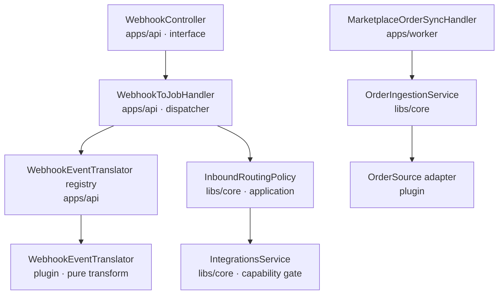
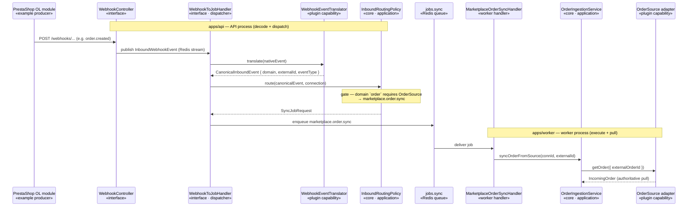

# ADR-015: Capability-driven, plugin-translated inbound webhook event routing

- **Status**: Accepted
- **Date**: 2026-05-30
- **Authors**: @piotrswierzy

## Context

`WebhookToJobHandler` (`apps/api/src/webhooks/`) turns inbound webhook events into sync jobs. It picks the job by string-matching the platform name — `isMasterProvider = provider === 'prestashop'` — behind a hardcoded `mapObjectType` table and a `['product', 'inventory']` allow-list. Three problems:

1. **Provider-name coupling.** "Is this a source we pull from?" is a capability question (`OrderSource`), not a platform-name one. One PrestaShop connection is simultaneously an order *source* (direct shop orders) and an order *destination* (Allegro orders pushed in) — a provider switch can't express that.
2. **Dead-lettered orders.** The PrestaShop OL module already emits `order.created` / `order.status_changed`, but `order` isn't allow-listed, so those events are dead-lettered instead of ingested.
3. **Misplaced orchestration.** Routing policy lives in an `apps/api` interface-layer handler, contradicting the rule that sync-orchestration policy lives in core.

This ADR is the architectural source of truth for inbound event routing and **drives** the phased implementation (epic #900); concrete wiring, signatures, and the test plan live in the Phase-2 plan (#903).

## Decision

Split inbound routing into two seams behind a thin dispatcher:

- **`WebhookEventTranslator` — a per-plugin capability** that decodes a native webhook into a neutral `CanonicalInboundEvent`. It is a **pure, payload-in transform** (no I/O, no connection state), so it joins the *shape-validator / OAuth-completion* family of host-bag registries — registered in each plugin's `register(host)`, keyed by `adapterKey` (registry *mechanics* mirror `WebhookProvisioning`; *semantics* match the validators). It knows nothing about job types.
- **`InboundRoutingPolicy` — a core application service** that maps a `CanonicalInboundEvent` to a `SyncJobRequest` via a deterministic, platform-agnostic table (below), gated on capability. It depends only on `IIntegrationsService` (gate) and `JobEnqueuePort`.
- **`WebhookToJobHandler` becomes a thin dispatcher**: resolve connection → `adapterKey` → translator → policy → enqueue. This deletes `isMasterProvider`, the `mapObjectType` table, and the `master.*`-vs-`marketplace.*` order-job split.

## Components

| Component | Layer / process | Responsibility |
|---|---|---|
| `WebhookEventTranslatorPort` + `WebhookEventTranslatorRegistryService` | plugin capability; resolved in **apps/api** | `translate(nativeEvent) → CanonicalInboundEvent` — pure decode of the plugin's own webhook vocabulary across all its domains |
| `CanonicalInboundEvent` (type) | core | neutral event — contract below |
| `InboundRoutingPolicy` (service) | core application (`webhooks`/`sync` context) | `domain → required capability → jobType` table + capability gate → `SyncJobRequest` |
| `WebhookToJobHandler` | apps/api interface | thin dispatcher; zero platform knowledge |

### `CanonicalInboundEvent` contract

```
domain:      'order' | 'inventory' | 'product'   // closed core union (additive) — the routing key
externalId:  string                              // source-native id
eventType:   per-domain closed vocabulary        // order → OrderFeedEventType ('created'|'updated'|'cancelled'|'paid')
occurredAt?: string                              // advisory only
payload?:    Record<string, unknown>             // non-authoritative hint; never source of truth
```

It is a **transient, in-process value** between two co-located seams (api-side `translate` → core `route`); never persisted, so it carries **no `schemaVersion`**. The durable, versioned contract is the emitted `SyncJobRequest` (per the job-payload convention). `eventType` reuses the **existing** poll-path vocabulary (`OrderFeedEventType`) so push and poll never fork for the same order.

### Routing table (core, deterministic)

| `domain` | required capability (gate) | `jobType` |
|---|---|---|
| `order` | `OrderSource` | `marketplace.order.sync` |
| `inventory` | `InventoryMaster` | `master.inventory.syncByExternalId` |
| `product` | `ProductMaster` | `master.product.syncByExternalId` |

`domain` is the **routing key**; capability is only the **gate**. A single connection routinely resolves several of these capabilities at once, so routing must key on domain, not "scan resolved capabilities". The gate is checked by introspecting `IntegrationsService.resolveAdapterMetadata().supportedCapabilities` (a pure metadata read) — **not** by catching `CapabilityNotSupportedException` as control flow. The existing PrestaShop `product` / `stock→inventory` mappings become rows here, not special cases.

## Architecture

Component ownership — each box names the part and the layer/process that owns it (full breakdown in the table above); edges are dependency direction. The runtime call sequence is the diagram below.



Target flow — PrestaShop is one example producer (Allegro, by contrast, is a pull-only `OrderSource` with no inbound webhook). The spanning notes mark the process boundary; the `«…»` stereotype marks each participant's layer:



## Required invariants

The webhook is a **trigger**; the pull is the truth. That only holds end-to-end if:

1. **Destination-side idempotency (load-bearing).** Ingestion must resolve an existing destination order mapping and **update-or-create**, not blindly `createOrder`. Today `OrderSyncService` always creates — so a webhook + poll (#904) converging on one order would create **two** destination orders. This is a prerequisite for Phase 1 (#902), tracked as its own issue.
2. **Unified trigger dedup.** Webhook- and poll-produced jobs must share a dedup-key derivation so a webhook-triggered and poll-triggered sync for the *same source change* collapse to one job (today they use disjoint namespaces). Dedup is an optimization; invariant 1 is the correctness guarantee.
3. **Narrow capability gate.** The policy introspects `supportedCapabilities` (or catches **only** `CapabilityNotSupportedException`), never connection-not-found / disabled / factory errors — otherwise transient/config faults become silent drops.
4. **DLQ observability.** Undecodable (no translator) and ungated (no capability) webhooks dead-letter; this needs a metric + alert distinguishing expected no-translator noise from real misconfiguration — the DLQ stream has no consumer today, so "audit trail preserved" requires a surface.
5. **Total translators.** A translator returns "undecodable" rather than throwing unbounded; a throw maps to DLQ, not a poison-retry loop. Only signature-verified payloads reach it.
6. **Convergence.** Because routing terminates in an authoritative pull keyed by `(connectionId, externalId)`, the design tolerates duplicate, out-of-order, and multi-producer delivery (last pull wins); `occurredAt` / `payload` are advisory.

## Capability orthogonality

`OrderSource` (pull — worker-side I/O) and `WebhookEventTranslator` (push-decode — api-side pure transform) are independent; a plugin may ship either alone:

| `OrderSource` | `WebhookEventTranslator` | Behaviour |
|---|---|---|
| ✓ | ✓ | Low-latency push **and** poll backstop. Target ideal. |
| ✓ | ✗ | **Poll-only** (e.g. Allegro). A stray webhook dead-letters ("no translator") — harmless given invariant 1 + the poll. |
| ✗ | ✓ | Misconfiguration: the gate finds no `OrderSource` → dead-lettered (invariants 3–4). |
| ✗ | ✗ | Not an order source; order webhooks don't apply. |

Translator-absence therefore degrades to poll-only: webhooks are a latency optimization over the authoritative poll, never a hard dependency.

## Alternatives considered

- **Quick fix — `master.order.syncByExternalId` + an `order` entry in the provider switch.** Rejected: deepens provider-name coupling and adds a third order-job taxonomy beside the poller's `marketplace.order.sync`.
- **Translation as a method on the domain capability port** (`OrderSourcePort.parseWebhook`). Rejected: inbound webhooks are **multi-domain** per connection (the PS module emits product + stock + order), so translation must *discover* the domain — a domain-scoped port can't own that decision. It is also a pure/api-side concern vs `OrderSource`'s I/O/worker-side role, and decodes the OL-module envelope, not the marketplace pull API. Its correct sibling is `WebhookProvisioning` (a per-`adapterKey` registry), not a domain port.
- **Data-drive the `mapObjectType` table** (config not code). Rejected: still host-owned platform knowledge; still can't express source-vs-destination per connection.
- **Trust the webhook payload as source of truth.** Rejected: contradicts the pull model — the webhook is a trigger; full state is fetched via the adapter, which tolerates partial/out-of-order/duplicate deliveries.

## Consequences

**Pros:**
- A new platform's webhooks need no host PR — a translator + one `register(host)` line. Aligns with open-world capability (#576) and the plugin trust model ([ADR-003](./003-plugin-sdk-trust-model.md)).
- Source/destination is capability-resolved, so one connection can be both.
- Push (`translate`) and poll (`OrderFeedItem`) converge on one event vocabulary per domain.
- Dispatcher + policy are unit-testable against a fake translator.

**Cons / trade-offs:**
- One more capability + registry to maintain.
- Phase 1 routes order webhooks before the translator exists (transitional).
- Correctness depends on invariant 1 (destination idempotency) — a real pre-existing gap *surfaced*, not introduced, by this design.

**Migration path:** Phase 1 (#902) routes PS order webhooks onto the existing `marketplace.order.sync` job — closing the dead-letter gap on the target taxonomy, **after** invariant 1 lands. Phase 2 (#903) adds the translator capability + `InboundRoutingPolicy` and deletes the central switches; the routing table absorbs the current product/stock mappings as rows. Phase 3 (#904) adds the poll backstop. No work is undone: Phase 2 only relocates *who decides*.

## References

- Related issues: #900 (epic), #902, #903, #904, #576 (open-world capability)
- Related ADRs: [ADR-002](./002-capability-ports-with-sub-capabilities.md), [ADR-003](./003-plugin-sdk-trust-model.md), [ADR-005](./005-postgres-authoritative-job-dedup.md), [ADR-008](./008-auth-failure-classifier-connection-reauth.md), [ADR-013](./013-neutral-oauth-completion-port.md)
- Primary doc section: [docs/architecture-overview.md](../../architecture-overview.md) § Webhook Ingestion Flow
