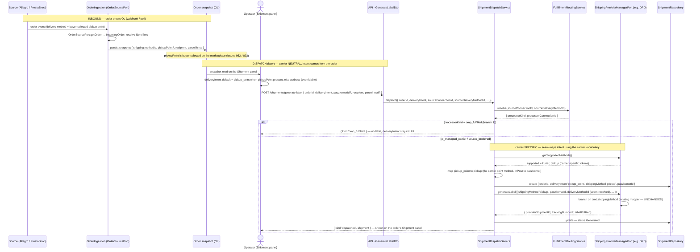

# ADR-020: Neutral delivery intent as the shipping-dispatch caller contract

- **Status**: Accepted
- **Date**: 2026-06-05
- **Authors**: @piotrswierzy

## Context

`GenerateLabelCommand.shippingMethod` (`ShippingMethod = paczkomat | pickup | kurier | omp`) is what a *caller* supplies to dispatch a label. Those tokens are **carrier vocabulary**: `paczkomat` is an InPost locker, `pickup` a DPD parcel-shop — both mean "deliver to a pickup point the buyer chose," differing only in carrier infrastructure. The destination carrier is resolved **server-side** at dispatch (`FulfillmentRoutingService.resolve` → `processorConnectionId` → adapter; [ADR-012](./012-branch-1-fulfillment-modeling.md)), so the frontend must name a carrier-specific method **before the carrier is known**. It can't be correct: it guesses with `LOCKER_METHOD_RE` (#952) and defaults to the InPost token, so a DPD parcel-shop order is sent as `paczkomat` and the DPD adapter rejects it (`preflight.unsupported-method`). DPD pickup dispatch is unreachable (#979). The contract conflates the buyer's neutral **intent** (point vs address) with the carrier's concrete **method**.

## Decision

Split intent from method. The **caller** supplies a carrier-neutral `DeliveryIntent = 'pickup_point' | 'address'` (closed `as const`; a third value is a one-line add). It is a **caller field** (HTTP DTO + form) whose **default** the form derives from authoritative order data — a pickup-point id on the order snapshot ⇒ `pickup_point` — replacing the `LOCKER_METHOD_RE` regex; the operator may override. The server does not re-derive it.

The **dispatch seam resolves the concrete carrier method**, reusing the port's **existing `getSupportedMethods()`** (today dead code — no caller). After `FulfillmentRoutingService.resolve` yields the carrier adapter, a pure core helper maps the intent to the carrier's one supported method of that shape: `pickup_point` → its single point method (`pickup` for DPD, `paczkomat` for InPost), `address` → its courier method (`kurier`). The resolved method is persisted and passed into the **unchanged** `generateLabel`; `deliveryMethodId` stays seam-resolved. **No plugin-facing port change, no adapter change** — the adapters' `generateLabel`/mapper branching on `cmd.shippingMethod` is untouched.

`ShippingMethod` is demoted from a *caller* contract to a **system-written, read-only** persisted value — the FE display source of truth (#966), still written as `'omp'` by the branch-1 projection (#834), but **never again caller-set** (which would re-open the leak).

This accepts one **benign assumption**: each carrier exposes exactly one point method (zero counterexamples across DPD / InPost / Allegro). The helper throws `preflight.unsupported-intent` when a carrier's supported set can't satisfy the intent — the trigger to add an adapter-owned resolver later (see Alternatives). It applies ADR-012's principle — *resolve provider specifics at the layer that owns the knowledge, never the caller* — with the seam **reading** the adapter's already-published method vocabulary instead of the caller naming it.

## Data flow

From the inbound order entering OL, through its persisted snapshot, to dispatch — the delivery intent originates in the buyer-selected delivery method / pickup point on the order; the carrier-specific method is derived only at the seam.

> **Before this ADR** the FE emitted a carrier-specific method (`paczkomat`) before the carrier was known, so a DPD parcel-shop order reached DPD as `paczkomat` and was rejected at `generateLabel`. The seam's intent→method step is exactly where that is now resolved correctly.

## Alternatives considered

- **(a) Adapter-owned `resolveMethodForIntent(intent)` port method** (replacing `getSupportedMethods`). Assumption-free, but a **breaking change to the plugin-facing `ShippingProviderManagerPort`** — every in-tree + third-party shipping adapter and ~20 test doubles, to remove an assumption no carrier exercises. **Deferred** — adopt it (passing the dispatch context, not a bare intent) the day a carrier first ships two point methods; the helper's `unsupported-intent` throw is the signal.
- **(b) Intent into `generateLabel`; adapter resolves + returns the method.** Rejected: same port/adapter churn as (a), and the shipment row is created *before* `generateLabel` (it needs the concrete method first), forcing a create-with-placeholder-then-update.
- **(c) Central seam coercion of an already-sent carrier method** (`paczkomat → pickup`). Rejected: keeps the leak — the caller still emits carrier vocabulary.
- **(d) FE carrier-aware selection.** Rejected: duplicates server carrier-resolution in the browser; risks `platformType`-coupling the FE (lint-banned).
- **(e) Status quo.** Rejected: structurally prevents a correct frontend.

## Consequences

**Pros:** caller is correct by construction; **no plugin-contract break** — and `getSupportedMethods()` stops being dead code (the seam is its first real consumer); retires the regex; the three adapters, their mappers, fakes, and int-test stubs are **unchanged**; a small, mostly-additive migration.

**Cons / trade-offs:** keeps the one-point-method-per-carrier assumption (guarded by the helper's `unsupported-intent` throw); the seam reads `getSupportedMethods()` per dispatch (cheap, in-process); the command carries both `deliveryIntent` and seam-resolved `deliveryMethodId` — own-contract adapters (DPD/InPost) use the resolved `shippingMethod`, source-brokered Allegro (#833) keeps forwarding `deliveryMethodId` (method stays cosmetic for it).

**Migration (additive):**
- New **nullable** `delivery_intent` column on the shipment entity — nullable because branch-1/omp rows have no intent (dispatch returns `omp_fulfilled` *before* the carrier step). Backfill label rows: `paczkomat|pickup → pickup_point`, `kurier → address`, `omp → NULL`. `shippingMethod` is kept as the now read-only display value.
- `GenerateLabelDto` / `GenerateLabelInput` gain `deliveryIntent`; legacy caller `shippingMethod` is accepted-but-ignored for one release, then removed. The FE `ShippingMethod` mirror gains `DeliveryIntent` — kept in one documented place (#966 drift lesson).
- **No** change to `ShippingProviderManagerPort`, the three adapters, their fakes, or the int-test stubs.

## References

- Related issues: #979, #952, #962, #963, #966, #769, #834, #833
- Related ADRs: [ADR-012](./012-branch-1-fulfillment-modeling.md), [ADR-002](./002-capability-ports-with-sub-capabilities.md)
- Primary doc: [docs/architecture-overview.md](../../architecture-overview.md) § Capability Abstractions (Business Roles)
