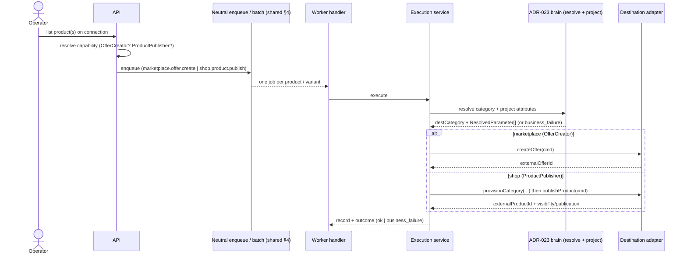
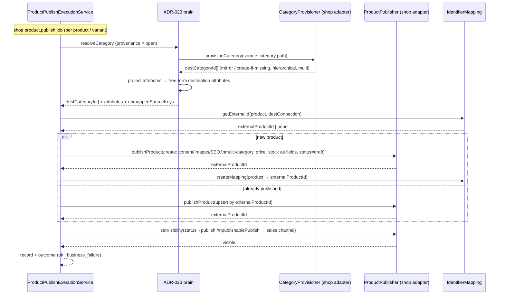

# ADR-024: Destination listing capabilities — marketplace `OfferManager` vs shop `ProductPublisher`

- **Status**: Accepted
- **Date**: 2026-06-13
- **Authors**: @piotrswierzy

> **Pairs with [ADR-023](./023-cross-platform-category-and-attribute-projection.md).** ADR-023 owns the *shared brain* (category placement + attribute projection + provenance). This ADR owns *how each destination shape is listed to* and how a new **shop** listing capability is introduced without forking the offer pipeline. They were designed together.

## Context

OpenLinker lists a master catalog product onto destinations of two structurally different kinds. "List a product" is **not one capability**:

- **Marketplace** (Allegro, ERLI): listing creates an **offer** — a thin sell-record over a (catalog) product, into a **closed** taxonomy, gated by required category parameters. Today: `OfferManagerPort.createOffer` + sub-capabilities. ERLI (spec PR #999) is a marketplace whose backend is *product-shaped* (single seller-keyed resource), yet the team deliberately maps it onto `OfferManager` — confirming the verb-based capability ports already stretch across offer-backed and product-backed marketplaces.
- **Shop** (WooCommerce, Shopify): listing creates/owns the **product record itself** (content, images, SEO, price/stock as product fields), into an **open** taxonomy you can create into, with a separate **visibility/publication** axis and no required-parameter gate.

The research (WooCommerce REST `POST /products` + `POST /products/categories`; Shopify GraphQL `productSet` + `publishablePublish`; how BaseLinker/Codisto publish to shops) shows the shop case **shares** a core with marketplace offer-create but **diverges** on three axes too substantial to collapse into `createOffer`:

| | Marketplace `createOffer` | Shop publish |
|---|---|---|
| Object created | Offer over a catalog card | **The owned product record** (content/images/SEO) |
| Taxonomy | Map-only into a fixed tree | **Create/mirror** (hierarchical, `POST products/categories`) |
| Cardinality | Single category | **Multiple categories** (Woo) |
| Required-param gate | Hard gate | None |
| Visibility | ≈ offer activation | **Separate channel-publish** (Shopify `publishablePublish`) + draft/`status` |
| Price/stock | On the offer | **On the product/variant** |

**Shared with `OfferManager`:** category resolution + attribute projection (ADR-023), variant expansion (#824 analog), stock/price sync, idempotent upsert + identifier mapping.

The current pipeline is offer-named end-to-end (`OfferCreationRecord`, `BulkOfferCreationBatch`, `marketplace.offer.create`, `OfferBuilderService`). An audit shows it is **~60% destination-neutral orchestration** (batch state machine, at-most-once advancement gate, variant expansion, idempotency, enqueue/execute/retry) and **~40% offer-welded** (entity *names*, the job-type string, and the genuinely-divergent builder).

## Decision

**Introduce a sibling shop-listing capability rather than overloading `createOffer`; share the cross-cutting brain (ADR-023) and extract the destination-neutral orchestration so both paths reuse it; keep the builders separate.**

### 1. New capability: `ProductPublisher` (shop-side), sibling to `OfferCreator` (marketplace-side)

A new optional capability with its own port + `is*` type guard, following the `OfferCreator` precedent:

```
publishProduct(cmd: PublishProductCommand): Promise<PublishProductResult>
```

`PublishProductCommand` expresses what `createOffer` cannot: **multi-category placement, draft/published status, full owned-record fields (content/images/SEO), price/stock as product fields**. It does **not** carry the offer-only concepts (catalog-card link, required-param gate).

Rejected: folding shop publish into `OfferCreator` (ERLI-style). ERLI is a *marketplace* whose backend happens to be product-shaped, so wearing `OfferManager` is conceptually honest there. A shop is a different domain (own-catalog projection), and the three divergences above would leak offer-isms into a "createOffer" that no longer means "create an offer."

### 2. New capability: `CategoryProvisioner` (the "open" provenance from ADR-023, now real)

```
provisionCategory(cmd: ProvisionCategoryCommand): Promise<CategoryProvisionResult>
```

Mirrors a source category path on the destination, creating missing nodes (`POST products/categories` with `parent`), returning the destination category id. It is ADR-023's placement step #1 — only shops implement it; marketplaces never can (you cannot create an Allegro/eBay category). Today no capability *creates* categories — `assignCategories` only attaches to existing ones — so this is net-new.

### 3. Visibility is a first-class axis, not "active = visible"

The command/result model a publication state distinct from record existence and from data sync: Woo `status` (draft→publish), Shopify `status` (ACTIVE/DRAFT) **plus** per-channel `publishablePublish`. Marketplace offers collapse this into activation; shops do not. The shop path must not assume create ⇒ visible.

### 4. Extract destination-neutral orchestration; keep builders separate

Rather than copy-paste a parallel bulk pipeline, **lift the ~60% generic scaffolding** — `BulkOfferCreationBatch` → a neutral `BulkListingBatch` (operation-typed), the at-most-once `bulk_batch_advancements` gate, variant expansion, the enqueue/execute/progress/retry services — into destination-neutral primitives that both `marketplace.offer.create` and the new `shop.product.publish` use. The **builders stay separate** (`OfferBuilderService` vs a new `ProductPublishBuilderService`) because that is the genuinely-divergent 40% (offer payload + required-param gate vs owned-record + provisioning).

This extraction is justified now (not premature) because there are **two real consumers** plus ERLI as a third on the offer side — the rule-of-three threshold is met. It is the medium-effort path; a full parallel copy is the fallback if the extraction proves riskier than the duplication on this hot subsystem.

### 5. `ProductMaster.createProduct` is not reused as the publish seam

WooCommerce already implements `ProductMaster.createProduct` (write methods exist, never called), but `ProductMaster` is semantically *master/source* (read the catalog of truth). Using it as a destination-publish seam blurs source vs. destination. `ProductPublisher` is a distinct capability; an adapter may implement both (a WC connection can be a source master *and* a publish destination) without conflating them.

## Flow

Both listing paths share the neutral enqueue/batch orchestration and the ADR-023 brain; they branch only on the resolved capability and the final adapter call.



### Shop publish path (`ProductPublisher`), in detail

The branch above collapses the shop path to one line; it differs from `createOffer` enough to warrant its own flow — category *provisioning* (not just resolution), owned-record fields, and a visibility step decoupled from record creation.



## Impact surface (audited)

A new shop-listing capability touches, end-to-end (~13 new files, ~15 edits):

- **Capability**: add `'ProductPublisher'` (+ `'CategoryProvisioner'`) to `CoreCapabilityValues` (`integrations/domain/types/adapter.types.ts`); add to the WooCommerce manifest `supportedCapabilities`; `enabledCapabilities` on `Connection` already accepts open strings.
- **Ports**: new `product-publisher.capability.ts` + `category-provisioner.capability.ts` (+ `is*` guards) under `listings/domain/ports/capabilities/`; barrel exports.
- **Types/exceptions**: `PublishProductCommand/Result`, `ProvisionCategoryCommand/Result`, `ProductPublishRejectedException`.
- **Jobs**: add `'shop.product.publish'` to `JobTypeValues` (`sync/domain/types/sync-job.types.ts`) + payload type; the generic Redis-Streams enqueue is reused unchanged.
- **Worker**: new `shop-product-publish.handler.ts` + registration in `handler-registration.service.ts`.
- **Services**: `ProductPublishExecutionService` (+ interface, tokens) consuming the ADR-023 resolution/projection services + `CategoryProvisioner`; reuse the extracted neutral enqueue/batch/progress/retry.
- **Persistence**: `listing_creation_records` (generalised from `offer_creation_records`) or a sibling table; ORM entity + repo port + impl + migration.
- **API**: single + bulk publish controllers under `apps/api/src/listings/http/` + DTOs.
- **FE**: a `shopProductPublishWizard` plugin contribution + a "Publish to shop" CTA gated on `enabledCapabilities.includes('ProductPublisher')`; the existing wizard-resolver pattern is reused.

## Alternatives considered

- **Overload `OfferManager.createOffer` for shops (ERLI-style).** Rejected (§1): leaks the three divergences into an offer capability; shops are a different domain.
- **Reuse `ProductMaster.createProduct`.** Rejected (§5): conflates source and destination roles.
- **Copy-paste a parallel bulk pipeline.** Rejected as default (§4): two+ consumers justify extraction; copy is the fallback only if extraction is riskier than duplication.
- **One unified `createListing` capability over a `listingMode` flag.** Rejected: the verb-based ports + sub-capabilities already give per-destination variation without a god-method; a mode flag re-centralises divergence the capability model is designed to keep at the edge. (Market evidence: BaseLinker — the closest competitor — keeps marketplace-listing and shop-publishing as separate flows.)

## Consequences

**Pros:** honest modelling of two genuinely different destination shapes; shops get category *provisioning* + multi-category + draft/visibility that offers never had; the shared brain (ADR-023) and the neutral orchestration are reused, not duplicated; ERLI stays on `OfferManager` (validated); capability-presence routing means no `platformType` branching.

**Cons / trade-offs:** the orchestration extraction is a refactor of the hottest subsystem (#726/#824 just landed) — sequence it carefully behind tests; two builder code-paths to maintain; the visibility axis adds state the offer model didn't have; WooCommerce global-attribute-on-variation writes are documented as REST-friction-prone (prefer per-product custom attributes initially); Shopify is GraphQL-forward (REST product endpoints legacy as of Oct 2024) — the adapter targets `productSet` + `publishablePublish`.

**Deferred:** Shopify collections (orthogonal to categories); scheduled publication; per-channel publication fan-out beyond Online Store; bulk publish UX depth.

## Related

- **[ADR-023](./023-cross-platform-category-and-attribute-projection.md)** — the shared placement/projection brain (provenance: owns/borrows/**open** ← this ADR's `CategoryProvisioner`).
- [ADR-002](./002-capability-ports-with-sub-capabilities.md) (sub-capability pattern reused), [ADR-007](./007-syncjob-status-vs-outcome-split.md) (`business_failure`), [ADR-004](./004-identifier-mapping-service.md).
- ERLI (#978 family, spec PR #999) — the marketplace-on-`OfferManager` precedent.
- Primary doc section: [docs/architecture-overview.md](../../architecture-overview.md) § Listings, Products.
