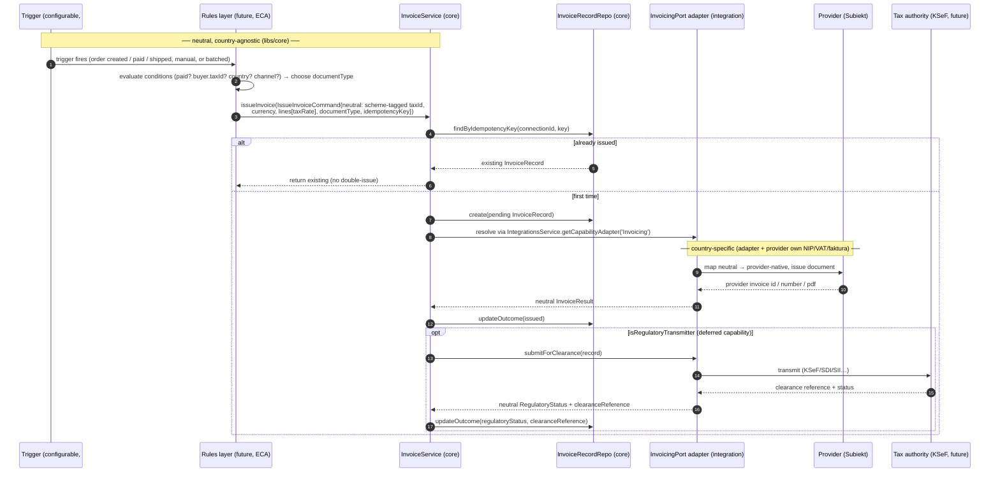

# ADR-026: Country-agnostic invoicing domain with capability decomposition

- **Status**: Accepted
- **Date**: 2026-06-16
- **Authors**: @piotrswierzy

## Context

OpenLinker is adding invoicing (product spec #728, foundation #751). Poland is the first market (Subiekt adapter, KSeF clearance mandate), but the domain must be **international-by-design** — a DACH or IT operator on a different provider must never see Polish tax terminology. The risk is baking PL concepts (`NIP`, `KSeF`, `VAT` rates, `faktura`/`paragon`, `JPK`) into `libs/core`, which would force every future adapter to speak Polish.

Two further forces shape the foundation: (1) a near-future feature lets operators configure **automation rules** ("auto-issue when an order is paid, full invoice for B2B, receipt for B2C, skip channel X"); (2) issuing a fiscal document and **transmitting it to a tax authority for clearance** (KSeF, IT SDI, ES SII…) are distinct acts with different lifecycles and failure modes — confirmed by every tax-compliance vendor (Avalara, Fonoa, Sovos) and by Stripe.

## Decision

1. **Neutral domain vocabulary, drawn from international standards — not invented.** Litmus test: zero `nip`/`ksef`/`vat`/`jpk`/`faktura` strings in `libs/core/src/invoicing`. We adopt the EN 16931 semantic model's blessed shapes: scheme-tagged tax identifiers (`{ scheme, value }`, per EN 16931 BT-30 / ISO 6523 and Stripe `tax_ids`), ISO 4217 currency, a neutral `taxRate`/`taxCode` string per line (PL `zw`/`np` map losslessly onto UNCL 5305 `E`/`O` inside the adapter), and an **open-world** `documentType` (UNTDID 1001 functional types `invoice`/`credit-note`/`corrected`/`proforma`/`prepayment`, plus `receipt` as a regime value the standard deliberately omits but our PL adapter needs).
2. **Capability decomposition by shape.** Issuance is the base `InvoicingPort` (`issueInvoice`, `getInvoice`, `upsertCustomer`). **Regulatory transmission/clearance is an [ADR-002](./002-capability-ports-with-sub-capabilities.md) sub-capability** (`RegulatoryTransmitter` + `isRegulatoryTransmitter` guard) — method-bearing (`submitForClearance`, `getClearanceStatus`), so it reuses the existing pattern rather than a novel mechanism. The transmitter **interface is deferred** to the KSeF issue; #751 only carries its persistence columns (`regulatoryStatus`, `clearanceReference`, nullable) on `InvoiceRecord` so no later migration is needed. Provider feature variance that is *not* method-bearing (which document types a provider issues) is exposed by a small discovery method (Avalara `GetMandates` precedent), not a sweeping `getCapabilities()`.
3. **The port is a dumb mechanism; policy sits above it.** `documentType` is **command data** the caller supplies — a future Event→Condition→Action rules layer (specification pattern for conditions) decides *whether/when/what-type* and composes an `IssueInvoiceCommand`; the adapter executes the fiscal mechanics of that type. Core never embeds trigger or document-type policy.
4. **Exactly-once issuance** via an `idempotencyKey` on the command + a durable partial-unique index `(connectionId, idempotencyKey)` (mirrors the `webhook_deliveries` dedup gate); not `UNIQUE(connectionId, orderId)`, so corrective re-issue stays possible.

## Flow

**Steps explained:**

1. **Trigger** — a *configurable* signal starts the flow; **payment is not a precondition**. Per #728 A4 the per-connection trigger is one of order-created / paid / shipped, manual operator action, or a nightly batch — and B2B is routinely invoice-then-pay (deferred terms), while proforma/advance documents precede payment entirely. Today this is a direct call; tomorrow the rules layer is the caller. The port never assumes a payment state.
2. **Policy decision (future)** — the ECA rules layer reads neutral facts (paid? buyer tax-id present? country? channel? order total?) and **chooses the `documentType` and whether to issue at all**. Payment status is just *one optional condition* here, never a hard gate. This logic lives *above* the port; core ships none of it in #751.
3. **Command composition** — the caller hands the core service a fully-neutral `IssueInvoiceCommand`. No country concept is present: the buyer's tax id is `{ scheme, value }`, amounts carry an ISO-4217 `currency`, lines carry a string `taxRate`.
4. **Idempotency gate** — the service looks up `findByIdempotencyKey`. A hit returns the existing record (steps 5–6) — a retried trigger never issues twice. The durable unique index is the authoritative backstop even if the in-process check races.
5. **Persist intent** — a `pending` `InvoiceRecord` is written before any external call, so a crash mid-issue is observable and retryable.
6. **Resolve the adapter** — the `Invoicing` capability adapter is resolved per-connection through `IntegrationsService` (identical to `OfferManager`/`ProductPublisher`).
7. **Cross the boundary** — the adapter is the *only* place that knows NIP, VAT rates, KSeF, and the word *faktura*. It maps the neutral command to the provider's native shape and issues the document.
8. **Neutral result back** — the adapter returns a neutral result (`providerInvoiceId`, number, pdf url, status); core updates the record to `issued`. Core still sees nothing country-specific.
9. **Regulatory transmission (deferred)** — when (and only when) the resolved adapter implements `RegulatoryTransmitter`, the service submits the issued document for clearance; the adapter maps the authority's regime states onto the neutral `RegulatoryStatus` lifecycle (`submitted → cleared → accepted | rejected`) and returns a `clearanceReference`. KSeF is one instance of this; a non-PL adapter simply doesn't implement the guard and the block is skipped.

## Alternatives considered

- **Country-specific fields in core (`nip`, KSeF status enum, `vatRate`)**: rejected — breaks the international-by-design promise; the EN 16931 / UNTDID / UNCL standards already give neutral equivalents.
- **A novel runtime `getCapabilities(): InvoiceCapability[]` on the port** (the original #751 sketch): rejected — regulatory transmission is *method-bearing*, which is exactly what ADR-002 `is{Capability}` guards already model; inventing a parallel capability mechanism duplicates ADR-002 and adds a third "capability" concept.
- **Closed `documentType` union (`invoice | receipt`)**: rejected — the document-type set varies unbounded by regime (corrective, proforma, prepayment, self-billed…); an open-world set matches the `platformType`/capability open-world precedent (#576/#578).
- **Put trigger/document-type policy inside the port (`issueInvoice(order)` decides)**: rejected — bakes one policy into the mechanism; every future automation variant would force a contract change. Stripe's draft/finalize/`auto_advance` split and BaseLinker's ECA model both keep policy above the primitive.

## Consequences

**Pros:**
- A new country = a new adapter + neutral capability names; **zero core change**.
- The future rules layer only ever composes a command — the port never re-cuts.
- KSeF is invisible to non-PL adapters; the neutral `RegulatoryStatus` lifecycle is the single seam every clearance regime maps onto.
- FE gates invoicing UI on neutral capability/feature checks, never on `platformType`.

**Cons / trade-offs:**
- The neutral vocabulary is a small upfront modelling tax (scheme-tagged ids, open-world doc types) versus a quick PL-shaped table.
- `InvoiceRecord` carries clearance columns before any transmitter implements them (nullable until KSeF lands) — chosen over a later migration.

**Migration path:** #751 ships the neutral domain + base port + record + repo + migration. The `RegulatoryTransmitter` sub-capability interface and the KSeF adapter land in a later #728 child; no schema change required then.

## References

- Related issues: #751, #728
- Related ADRs: [ADR-002](./002-capability-ports-with-sub-capabilities.md) (sub-capability composition), [ADR-024](./024-destination-listing-capabilities.md) (capability-port precedent), [ADR-009](./009-persisted-offer-status-snapshots.md) (reconciled-status precedent)
- Standards: EN 16931 (semantic invoice model), UNTDID 1001 (document types), UNCL 5305 (tax categories), ISO 6523 / ISO 4217; CTC taxonomy (post-audit / clearance / real-time reporting)
- Primary doc section: [docs/architecture-overview.md](../../architecture-overview.md)

## Amendments

> ADRs are append-only — the notes below **refine deferred details**, they do not change the decision.

**Amendment (2026-06-23, #1143).** The deferred `RegulatoryTransmitter` interface (Decision 2) is realized as **two** ADR-002 sub-capabilities: a read-only `RegulatoryStatusReader` (`getClearanceStatus`) and `RegulatoryTransmitter extends RegulatoryStatusReader` (adds `submitForClearance`). Providers that transmit natively and only expose status (Subiekt → KSeF, #1121) implement the reader alone; providers OL submits to directly implement the full transmitter. Across CTC regimes (PL KSeF, IT SDI, FR PA, Peppol) and compliance vendors, "submit for clearance" and "read clearance status" are consistently distinct operations — Poland even makes `InvoiceRead`/`InvoiceWrite` independently grantable permissions — and the authority reference (KSeF number / SDI id) is knowable only by reading post-submit, so a transmitter is necessarily also a reader (the `extends` is a genuine `is-a`). Both methods return a neutral `RegulatoryClearanceResult` (`regulatoryStatus` + optional `clearanceReference`); a business verdict incl. `rejected` is returned as data, a transport/infra failure throws. This refines, not changes, Decision 2 — it fills the interface ADR-026 deferred to the KSeF issue.
