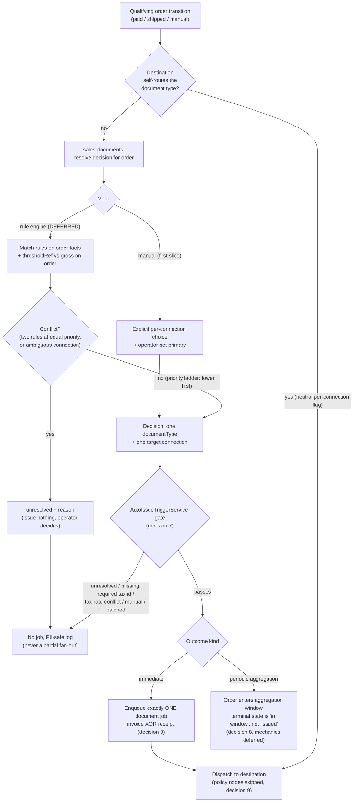

# ADR-039: Sales-document routing policy - which document a given order gets

- **Status**: Proposed
- **Date**: 2026-08-13
- **Authors**: @norbert-kulus-blockydevs

## Context

OpenLinker can issue an invoice ([ADR-026](./026-country-agnostic-invoicing-domain.md), `InvoicingPort`) and - once #1908 lands - register a fiscal receipt. **Nothing decides which of the two a given order should get.** ADR-026 §Decision 3 deliberately left that policy above the port ("a future Event-Condition-Action rules layer decides whether/when/what-type"), but never said *where* it lives.

Today the gap is masked: Poland is the only live market, and `AutoIssueTriggerService.onOrderTransition` fans out to **every** active `Invoicing`-capable connection unconditionally (`libs/core/src/invoicing/application/services/auto-issue-trigger.service.ts` - the capability filter, then `for (const connection of connections)`, with a per-connection idempotency key `invoice:{connectionId}:{orderId}` that cannot dedupe across connections). That already produces two invoices for one sale when an operator enables two Invoicing connections - #2047. Adding a second *document type* turns "which document" into a real branch on the same service.

## Decision

**1. The decision lives in a dedicated `sales-documents` core concern.** It reads the order and returns a decision - document type plus the target connection - and neither `invoicing` nor the future fiscalisation context owns it. Rationale: the rule crosses both document domains by definition, so placing it in either forces that context to know the other's connections, capabilities and document types. Placing it in `orders` is equally wrong: `orders` is the most-depended-on context in core and must not learn fiscal vocabulary.

**2. Cycle-safety condition for the `orders <-> sales-documents` back-edge.** The routing concern reads orders; `orders` (via the trigger path) asks it for a decision. That back-edge is safe **only if every symbol crossing the boundary is a type, a `Symbol` DI token, or a service interface - never a concrete class and never a value-import from a barrel that re-exports a Nest module.** Checkable, in this order:

- Cross-context imports match the allow shapes in `docs/architecture-overview.md` § Cross-context dependencies in core - `I*Service`, `*_TOKEN`, `*Port`, entities/types, `*Exception`/`*Error` - and none matches a deny shape (`*RepositoryPort`, `*OrmEntity`, `*Adapter`, `*Dto`). Enforced by `scripts/check-cross-context-imports.mjs` under `pnpm check:invariants`; a new deny-shape import fails the build.
- Domain entities cross as `import type` where the consumer only needs the shape (the existing `import type { Order }` in `auto-issue-trigger.service.ts`).
- Any **value** a context needs from the other side of the cycle comes from a dependency-free `types` sub-barrel that omits the Nest module, following `@openlinker/core/orders/types` verbatim: `AutoIssueTriggerService` imports `PAYMENT_STATUS` from there precisely because the main `@openlinker/core/orders` barrel re-exports `OrdersModule`, which imports `InvoicingModule` - a value-import from the main barrel would close a CJS module-load cycle at require time. `sales-documents` publishes the same seam for its own decision constants.
- The routing service injects only Symbol tokens (`SALES_DOCUMENT_ROUTING_SERVICE_TOKEN` and friends) typed as `I*Service` / `*Port`, and its providers name no sibling context's module. The existing "ONE-WAY EDGE" property of `AutoIssueTriggerService` (it injects no `OrdersModule` token) must survive the change.

The same three cyclic pairs already in core (`orders <-> customers`, `listings <-> inventory`, `orders <-> invoicing`) are safe on exactly this basis: cycle safety is a property of the crossing surface, not of the file-level graph.

**3. One document per order, never two - a contract-level invariant.** The routing decision resolves to **at most one** `(documentType, connectionId)` pair per order: invoice **or** receipt, never both, and never the same type twice on two connections. The decision is exclusive by construction (a single-valued return, not a list), and the write path must refuse a second document for an order that already carries a non-failed one on **any** connection. This is the invariant #2047 violates today - per-connection fan-out plus per-`(orderId, connectionId)` persistence with no uniqueness on `orderId` alone. Fixing the current invoice-only breach is #2047's scope; this ADR fixes the *contract* so a second document type cannot re-introduce it.

**4. Manual mode first.** For the first Polish slice the routing input is an **explicit per-connection operator choice** (which document that connection issues, plus which connection is the single primary for an order). No matching, no legal matrix. Rationale: manual choice is sufficient for a single-market, single-document-type deployment and it is the minimum needed to make invariant 3 real - see also #2047's proposed operator-set primary.

**5. Rule shape, for when the engine arrives (deferred - see below).** A rule matches on neutral order facts already on the order (buyer type and presence of a tax identifier, delivery country, source channel/connection, payment method) and an amount threshold; it carries a `priority` (lower first, later rule wins for the same target - the `AttributeMappingRule` ordering precedent from #1841), and yields a document type plus a target connection. The threshold is expressed as a **`thresholdRef`** - a named amount resolved from a versioned regime pack rather than an inline literal, so the legal matrix versions independently of the rules - plus an explicit comparison operator (`gte` / `lt`). **The threshold is evaluated on the gross amount already present on the order**, so there is no calculation step to order it against.

**6. Rule conflict is an outcome, not a coin flip.** When two rules match at the same priority, or when several connections are candidates and no primary is set, the decision is `unresolved` with a reason; nothing is issued and an operator resolves it. Silence-and-pick-one is forbidden: for a fiscal document a wrong pick is a legal event, not a data-quality issue.

**7. `AutoIssueTriggerService` is the gate.** Concretely: the call to the routing service replaces the unconditional capability filter and the `for (const connection of connections)` fan-out, so the loop runs over the at-most-one resolved decision. Automatic issue **must not fire** when:

- the routing decision is `unresolved` (no match, conflicting rules at equal priority, or ambiguous connection with no operator primary);
- the order carries no tax identifier where the resolved document type requires one (today discovered too late, as `InvalidBuyerProfileError` from the command mapper, after the fan-out already committed to a connection);
- the order is in a **tax-rate conflict** state - a channel-reported rate diverging from the master's (#2009, argument in #2054). The conflict blocks invoice issue *and* fiscal registration until an operator decides;
- the resolved outcome is a periodic-aggregation window rather than an immediate document (decision 8);
- the existing per-connection trigger model says not to (`manual`; `batched` still rejected cleanly as not implemented).

Every block logs and issues nothing - never a partial fan-out - reusing the service's existing PII-safe log envelope (`error.name`, connection id, order id, source event id).

**8. Periodic aggregation is a distinct terminal outcome.** For regimes that aggregate, the routing result is "this order **enters an aggregation window**", not "a document was issued". "Document issued" is therefore not the terminal state of every routing path, and callers must not treat the absence of a document id as a failure.

**9. Self-routing destinations bypass the policy nodes.** A destination that decides the document type itself is marked by a neutral per-connection flag (capability/config-declared, never derived from `platformType`); when set, routing skips matching, conflict resolution and threshold evaluation and goes straight to dispatch, carrying no `documentType` of OL's choosing. The one-document-per-order invariant still applies - the destination is the decider, not an extra document.

**10. The VAT rate arrives from the ProductMaster and OpenLinker does not compute it** - which is exactly why this ADR has no ordering question against any tax-calculation step: the amounts the router reads already include tax. The rule itself is recorded as an annex to [ADR-026](./026-country-agnostic-invoicing-domain.md) under #2009, with the ADR-014 supersession argument in #2054; this ADR references it and does not restate it.

### Deferred, with reasons

- **The rule engine, and suggest/auto modes** - deferred. Manual mode covers the first slice (decision 4), and an engine without a reviewed legal matrix would encode guesses as behaviour. Decision 5 fixes the shape so the engine is additive.
- **Localised legal content (the Polish matrix)** - deferred and out of architectural scope. Which order legally requires which document is a legal-review deliverable; the spec is explicit that OL must not imply it knows a seller's obligation (product spec #1902 § Out of scope 7).
- **The aggregation window's own mechanics** (window boundaries, the batch document, its numbering) - deferred. Decision 8 only reserves the outcome so no caller assumes issuance is terminal; the invoicing context's `batched` trigger model is likewise still unimplemented.
- **A capability-shaped `SalesDocumentRouterPort`** - not needed. Routing is core policy over neutral facts, with no external system behind it; a port would be a seam with exactly one possible implementation.

## Runtime flow

## Alternatives considered

- **Put routing in `orders`** (order transition picks the document): rejected - `orders` is the spine every other context depends on, and it would have to learn both fiscal domains' connections, capabilities and document types.
- **Put routing in `invoicing`** (extend `AutoIssueTriggerService` with receipt awareness): rejected - makes one document type's context the arbiter of its sibling, so fiscalisation would depend on invoicing to be routed at all; the contexts are peers.
- **Put routing behind the port** (`issueInvoice(order)` decides): rejected already by ADR-026 §Decision 3 - it bakes one policy into the mechanism, and every automation variant becomes a contract change.
- **Ship the rule engine now**: rejected - see Deferred. The engine's value is entirely in the matrix content, which is not available.

## Consequences

**Pros:**
- "Which document" becomes one named, testable decision instead of an emergent property of a connection loop.
- One-document-per-order is enforceable before a second document type exists, so #2047's failure mode cannot be duplicated per type.
- Adding a regime is a rule set plus (at most) an adapter; no core re-cut, matching ADR-026's country-agnostic promise.
- Aggregation and self-routing destinations have declared paths, so neither arrives as a special case bolted onto issuance.

**Cons / trade-offs:**
- A new core concern, with the `orders` back-edge to keep honest - mitigated only by the checkable condition in decision 2, which a careless value-import can break at boot.
- Manual mode means an operator can still configure a legally wrong document; OL refuses to guess instead (decisions 4 and 6).
- The decision surface is designed for a rule engine that is deliberately not being built, so decision 5 may need refinement when the matrix is real.

**Migration path:**
- #2047 first: single-connection resolution plus a write-path refusal in the invoice-only world.
- Then the `sales-documents` concern with manual mode, and `AutoIssueTriggerService` re-pointed at it (decision 7).
- Fiscalisation (#1908) plugs in as a second document type with no change to the routing contract.

## References

- Related issues: #2051, #2009, #2047, #1908, #2054, #1902
- Related ADRs: [ADR-026](./026-country-agnostic-invoicing-domain.md) (invoicing domain; policy-above-the-port and the VAT-rate annex), [ADR-002](./002-capability-ports-with-sub-capabilities.md) (capability decomposition), [ADR-014](./014-source-authoritative-order-pricing.md) (source-authoritative amounts the router reads)
- Primary doc section: [docs/architecture-overview.md](../../architecture-overview.md) § 14 Invoicing, § Cross-context dependencies in core
- Spec: [`docs/specs/product-spec-1902-eparagony-e-receipts.md`](../../specs/product-spec-1902-eparagony-e-receipts.md)
