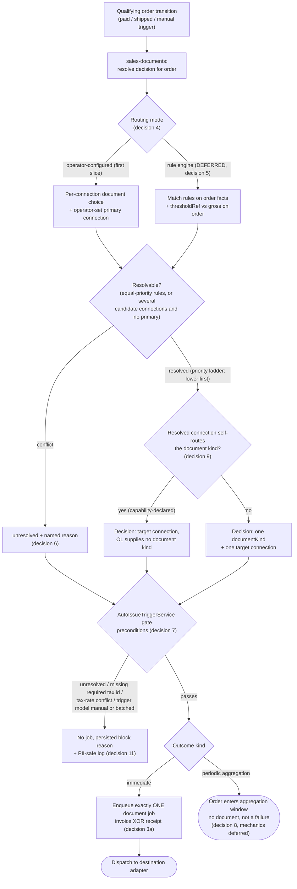

# ADR-041: Sales-document routing policy - which document type and which connection an order gets

- **Status**: Proposed (decision 11's visibility contract partially implemented - see the note under it)
- **Date**: 2026-08-13
- **Authors**: @norbert-kulus-blockydevs

## Context

OpenLinker can issue an invoice ([ADR-026](./026-country-agnostic-invoicing-domain.md), `InvoicingPort`) and - once #1908 lands - register a fiscal receipt. **Nothing decides which of the two a given order should get.** ADR-026 §Decision 3 deliberately left that policy above the port (a future Event-Condition-Action rules layer decides whether/when/what-type) but never said *where* it lives.

Today the gap is masked: Poland is the only live market, and `AutoIssueTriggerService.onOrderTransition` fans out to **every** active `Invoicing`-capable connection whose per-connection trigger model qualifies, with no "which one" selection (`libs/core/src/invoicing/application/services/auto-issue-trigger.service.ts` - the capability filter, then `for (const connection of connections)`, with a per-connection idempotency key `invoice:{connectionId}:{orderId}` that cannot dedupe across connections). Two configured auto-issuing connections therefore produce two invoices for one sale - #2047. Adding a second *document type* turns "which document" into a real branch on the same service.

One boundary fact removes a question a reader would otherwise ask about ordering: **the VAT rate arrives from the ProductMaster and OpenLinker does not compute it**, so the amounts the router reads already include tax and there is no tax-calculation step to sequence the router against. That rule will be recorded as an annex to ADR-026 under #2009 (with the ADR-014 supersession argument proposed in #2054); this ADR only points at it.

## Decision

**1. The decision is a named policy module in a `sales-documents` core concern, promoted to a full context when the rule table and the second document type both land.** It reads the order it is handed and returns a decision - document kind plus target connection - and neither `invoicing` nor the future fiscalization context owns it. Rationale: the rule crosses both document domains by definition, so placing it in either forces that context to know the other's connections, capabilities and document types. Placing it in `orders` is wrong for a different reason: `orders` must not learn fiscal vocabulary. The first slice is small enough to be one config read plus one pure resolve, which is why decision 1 says *module now, context later* rather than standing up a full hexagonal cell for it up front (see Alternatives for the two cheaper placements that were weighed against this).

**2. The caller passes the order; `sales-documents` performs no order read, so no cycle is created.** `orders` does not ask the router - it asks `invoicing`: `OrderIngestionService` injects `AUTO_ISSUE_TRIGGER_SERVICE_TOKEN`, and `AutoIssueTriggerService` already holds the transitioning `Order` and receives it as an argument (`onOrderTransition(order, sourceConnectionId, sourceEventId)`). The only candidate cycle is the three-node `orders -> invoicing -> sales-documents -> orders`, and it exists **only if** the router injects an orders token. It must not: the router takes the order as a parameter, typed via `import type`, so it depends on `orders` for types alone. A future rule needing a fact not on the order has the *caller* fetch it. There is no `forwardRef` anywhere in `libs/core`, `apps/api` or `apps/worker`, and the repo's shipped answer to this shape is the same one - `mappings` keeps `FulfillmentRoutingQuery` primitive so it does not couple to `orders`.

Defence in depth, if a value ever must cross: the allow/deny import shapes in `docs/architecture-overview.md` § Cross-context dependencies in core are enforced by `scripts/check-cross-context-imports.mjs` under `pnpm check:invariants`; a value must come from a module-free `types` sub-barrel rather than a barrel that re-exports a Nest module (the reason `AutoIssueTriggerService` imports `PAYMENT_STATUS` from `@openlinker/core/orders/types`); and `AutoIssueTriggerService`'s existing "ONE-WAY EDGE" property - it injects no `OrdersModule` token - must survive the change.

**3a. At most one *originating* sales document per order.** The routing decision returns a single `(documentKind, connectionId)`, never a list: invoice **or** receipt, never both, and never the same kind twice on two connections. It is exclusive by construction - a single-valued return.

**3b. The write path enforces 3a on originating documents only.** Refuse a second originating document when the order already carries one that is `pending`, `issued`, or `failed` with `failureMode !== 'rejected'` on **any** connection. The `failed` split is not optional: `rejected` means nothing was issued, while any other mode (including absent or unknown) means a document may exist at the provider, which is the `in-doubt` case the FE already treats as non-retryable (`derive-invoice-display.ts`) and the exact predicate #2047 landed on. Corrections and credit notes are **linked follow-ups**: they are not routed, they legitimately follow an `issued` original (`InvoiceService.issueCorrection` creates a new record for the same `orderId` by design), and they are outside this invariant. ADR-026 §Decision 4's `(connectionId, idempotencyKey)` uniqueness stands as chosen and no `orderId` unique constraint is added - the missing piece is a service-level guard, not an index. This is the invariant #2047 breaches today; fixing the invoice-only breach is #2047's scope, while this ADR fixes the *contract* so a second document type cannot re-introduce it.

**4. `operator-configured` mode first.** For the first Polish slice the routing input is explicit operator configuration, in two parts: (a) per connection, which document kind that connection issues; (b) which single connection is primary for issuance. Both live in `Connection.config` JSONB - no schema change, following the `stockSafetyBuffer` / `pricingRule` config-coercion precedent and read with a pure `readSalesDocumentRouting(connection.config)` helper next to `parseTriggerModel`. #2047 already introduces (b) as `connection.config.invoicing.isPrimary`; decision 4 fixes that shape so the router reads what #2047 wrote. No matching, no legal matrix. The mode is named `operator-configured`, not `manual`, because `manual` is already taken by the per-connection invoicing **trigger model** and the two would collide in the same sentence.

**5. Rule shape, for when the engine arrives (deferred - see below).** Rules are **operator-authored** (the #1841 `AttributeMappingRule` precedent), never OL-derived: matching on buyer type, country and threshold is the shape of a legal determination, which stays with the seller.

Of the facts such a rule wants, only two are on the `Order` today: delivery country (`Address.country`) and amount (`totals.total`). **Buyer type and tax identifier are not** - `buyerTaxId` is caller-supplied and scheme-tagged ("the `Order` has none"), it drives the B2B/B2C axis alone, and no issuance caller wires it, so every auto-issued document is `type: 'private'`, `taxId: null`. Payment method is absent from core order types entirely, and source channel is a separate argument (`sourceConnectionId`), not a field. Since the canonical invoice-vs-receipt split turns on tax-id presence, **a buyer tax-id / buyer-type on the order contract is a blocking prerequisite of the engine**, not an assumption it may make.

Ordering and threshold, precisely: matching rules are evaluated in ascending `priority`, the last match wins, and two matches at the same `priority` are a conflict rather than a tie-break (decision 6). The threshold is a **`thresholdRef`** - a named amount resolved from a versioned regime pack rather than an inline literal, so the legal matrix versions independently of the rules - carrying an explicit comparison operator (`gte` / `lt`) **and a currency**, with an explicit mismatch rule against the order's own `totals.currency` (which varies; that is ADR-040's subject). It is evaluated on a **gross** amount: `OrderTotals.taxTreatment` is optional, absent means only "not asserted by the source", and an `exclusive` (net) total compared against a legal threshold is wrong by the VAT rate - so `exclusive` resolves `unresolved`, never a guess. The invoicing mapper already hard-rejects net orders for the same reason.

**6. Rule conflict is an outcome, not a coin flip.** When two rules match at the same priority, or when several connections are candidates and no primary is set, the decision is `unresolved` with a named reason; nothing is issued and an operator resolves it. Silence-and-pick-one is forbidden: for a fiscal document a wrong pick is a legal event, not a data-quality issue.

**7. `AutoIssueTriggerService` is the gate.** The fan-out is deleted: the trigger acts on the single resolved decision or on nothing. It also becomes the place where the resolved target is validated, since dropping the capability filter otherwise removes the only guarantee that the target can issue at all: routing checks that the connection has the capability enabled **and** that the resolved kind is in `InvoicingPort.getSupportedDocumentTypes()` (the value-level discovery method ADR-026 §Decision 2 added for exactly this) - at rule-write time in `operator-configured` mode, following `FulfillmentRoutingService.replaceRules`, and as `unresolved` otherwise.

Two lists, deliberately separate - the first are *router outcomes*, the second are *gate preconditions*:

Router outcomes the gate acts on: `route` (issue), `aggregate` (decision 8 - passes the gate and terminates without a document), `unresolved` (no match, conflicting rules at equal priority, or ambiguous connection with no operator primary - blocks).

Gate preconditions, checked independently of the outcome:

- the order carries no tax identifier where the resolved document kind requires one. Today this is not "discovered too late" - it is **not discovered in core at all**: `InvalidBuyerProfileError` fires only for a missing address or an underivable name, a `null` tax id is a normal B2C outcome, and `composePayload` passes no `buyerTaxId`, so a wrong or absent identifier surfaces only at the provider boundary as `classifyFailureCode` -> `'buyer-tax-id-invalid'`;
- the order is in a **tax-rate conflict** state - a channel-reported rate diverging from the master's (#2009, argument in #2054). The conflict blocks invoice issue *and* fiscal registration until an operator decides;
- the existing per-connection trigger model says not to (`manual`; `batched` still rejected cleanly as not implemented).

**Two of those three preconditions are inert until their prerequisites land, and an implementer must not read them as live.**

- The tax-id precondition **cannot fire in the `operator-configured` first slice**. It shares decision 5's blocking prerequisite: no issuance caller wires `buyerTaxId`, so every auto-issued document is `type: 'private'`, `taxId: null`, and "carries no tax identifier" is true of *every* order. Until a buyer tax-id / buyer-type reaches the order contract, the precondition passes everything - it is recorded here so the gate has the right shape when the fact exists, not because it guards anything today. Wiring it against the current contract would block every auto-issue, which is why it is stated as inert rather than left ambiguous.
- The tax-rate-conflict precondition **depends on #2057**. An unknown tax rate is today indistinguishable from a resolved zero (that is #2057's subject: a failed read returned the number `0`, which is also a legitimate exemption), so "a channel-reported rate diverging from the master's" is not computable and the gate would read "no conflict" on precisely the unknown-rate orders it exists to catch. #2057 is therefore a **prerequisite of this precondition**, in the same sense the tax-id contract change is a prerequisite of decision 5's engine - not a nice-to-have sequencing note.

Every block issues nothing - never a partial fan-out - reusing the service's existing PII-safe log envelope (`error.name`, connection id, order id, source event id). A block is **never log-only**: it also persists a named reason (decision 11), because "OL silently declined to issue" is exactly as opaque to an operator as a wrong pick would be dangerous.

**8. Periodic aggregation is a distinct terminal outcome, reserved in the routing return type only.** For regimes that aggregate, the routing result is "this order **enters an aggregation window**", not "a document was issued", so callers must not read the absence of a document id as failure. Reserved in the return type *only*, because the aggregate document is not representable today: `invoice_records.orderId` is non-nullable and single-valued, so one document covering N orders has no persistence, and the aggregate-to-orders relation is many-to-many. No new `sync_jobs` `outcome` value is needed either: on an aggregation outcome no job is enqueued, so there is no row to mis-read ([ADR-007](./007-syncjob-status-vs-outcome-split.md)); `JobOutcomeReasonValues` is the extension point if a future aggregation job reports its window.

**9. Self-routing destinations bypass the policy nodes.** A destination that decides the document type itself is declared by an ADR-002-style capability guard (never derived from `platformType`); when it applies, routing skips matching, conflict resolution and threshold evaluation and dispatches directly, carrying no document kind of OL's choosing. This needs no port change: `IssueInvoiceCommand.documentType` is already optional and "the adapter may derive it when absent", with `InvoiceService` persisting `''` for that case. The resulting document **is still persisted as a record**, so invariant 3b remains enforceable on this branch - the destination is the decider, not an extra document.

**10. The router's discriminator is its own neutral document *kind*, not `IssueInvoiceCommand.documentType`, and that kind is open-world.** Which kind implies which capability to dispatch to (`Invoicing` vs the fiscalization capability). Keeping them distinct is load-bearing rather than pedantic: #1902 and #1908 both state a fiscal receipt is **not** an `InvoicingPort` `DocumentType` and must not be modelled as one (different issuer, device dependency, legal basis), while ADR-026 §Decision 1 does place `receipt` inside the invoicing union - so keying routing on `documentType` would quietly re-model a receipt as an invoicing document.

The shape, stated so it cannot be settled by accident at implementation time:

```ts
// @openlinker/core/sales-documents
export const CoreSalesDocumentKindValues = ['invoice', 'fiscal-receipt'] as const;
export type CoreSalesDocumentKind = (typeof CoreSalesDocumentKindValues)[number];

/** Open string set: well-known values come from CoreSalesDocumentKindValues. */
export type SalesDocumentKind = CoreSalesDocumentKind | string;
```

**Open-world, not a closed `invoice | receipt` union.** ADR-026 §Alternatives already rejected exactly that closed pair for `documentType` ("the document-type set varies unbounded by regime"), on the same open-world precedent as capability (#576) and `platformType` (#578). A closed kind here would re-adopt the rejected alternative in the one place widening is hardest - a two-value regime-specific pair sitting in the country-agnostic core, where a regime with a third originating document (a per-transaction register entry, a simplified invoice treated as its own document, an aggregate daily report) forces a core PR rather than an adapter. The well-known values stay a named `as const` array so validation, FE labels and the routing config all read one list.

Two consequences of the open stance, both already load-bearing elsewhere in this ADR: because a kind can be a string core has never seen, **validity is a runtime check against the target, never a type check** - decision 7's `getSupportedDocumentTypes()` / capability-enabled gate is that check, mirroring how `IntegrationsService.getCapabilityAdapter` validates an open capability name against the adapter manifest, with `unsupported-document-kind-on-connection` as the `unresolved` reason. And the spelling `fiscal-receipt` deliberately differs from `DocumentTypeValues`' `'receipt'`: the two vocabularies are separate by decision, so a grep must never make them look interchangeable.

**11. The exported surface, and one visibility contract for both block paths.** Enough for an implementer to start after #2047, and enough to make decision 8's outcomes mechanical. Every reason a document was not issued is persisted and shown to an operator, so each is an `as const` values array plus its derived union, following the shipped `DocumentTypeValues` / `InvoiceFailureModeValues` / `CoreCapabilityValues` convention:

```ts
// @openlinker/core/sales-documents
export const SalesDocumentUnresolvedReasonValues = [
  'no-matching-rule',
  'conflicting-rules-equal-priority',
  'ambiguous-connection-no-primary',
  'unsupported-document-kind-on-connection',
  'net-priced-order',
] as const;
export type SalesDocumentUnresolvedReason = (typeof SalesDocumentUnresolvedReasonValues)[number];

export const SalesDocumentGateBlockReasonValues = [
  'unresolved-routing',
  'missing-required-tax-id',
  'tax-rate-conflict',
  'trigger-model-manual',
  'trigger-model-batched',
] as const;
export type SalesDocumentGateBlockReason = (typeof SalesDocumentGateBlockReasonValues)[number];

export type SalesDocumentDecision =
  | { kind: 'route'; documentKind: SalesDocumentKind | null; connectionId: string } // null = self-routing destination
  | { kind: 'aggregate'; connectionId: string }
  | { kind: 'unresolved'; reason: SalesDocumentUnresolvedReason };
```

**Both unions carry the same visibility contract: persisted and operator-visible, never log-only.** A gate refusal is not a lesser signal than a routing `unresolved` - to the operator both read as "this order has no fiscal document and nothing told me why", and the two most interesting gate refusals (missing required tax id, tax-rate conflict) are missing-*input* conditions only a human can clear, which makes them the ones most worth surfacing. Leaving them log-only would be the silent-block cousin of the silence-and-pick-one that decision 6 forbids.

They stay **two unions rather than one** because they answer different questions and are not interchangeable: `SalesDocumentUnresolvedReason` says *routing could not decide*, and is a value the router returns; `SalesDocumentGateBlockReason` says *routing decided (or explicitly did not) and issuance is still not allowed*, and is a value the gate produces about state outside the router's knowledge. Collapsing them would let a caller answer "was this a policy gap or an operator-fixable data gap?" only by string-matching. `'unresolved-routing'` is the one bridge value - the gate's record of having blocked on a router `unresolved`, whose own reason travels alongside it.

The surfacing mechanics are the implementing issue's, not this ADR's; the repo precedent to follow is #1689's `source_deleted` - a dedicated health bucket, a list badge, and a named ineligibility reason that also excludes the order from bulk actions.

> **Implementation note (#2100, shipped).** Decision 11's *visibility contract* has landed as the first implementing slice; the router of decisions 1-10 has not. Both value arrays exist verbatim on `@openlinker/core/sales-documents` (a leaf concern with no module, no service and no persistence, so any context can value-import it), and the auto-issue gate's three reachable non-issuing exits now persist a reason on `order_records` alongside their existing PII-safe logs: the #2047 ambiguity as `'unresolved-routing'` + `'ambiguous-connection-no-primary'`, plus `'trigger-model-manual'` and `'trigger-model-batched'`. `'missing-required-tax-id'` and `'tax-rate-conflict'` ship **declared but never written**, per the preconditions above.
>
> Three details worth carrying into the router's own slice:
>
> - **The gate reports, it does not persist.** `AutoIssueTriggerService.onOrderTransition` returns the block and `OrderIngestionService` writes it. Persisting in place would need an `OrdersModule` token inside `InvoicingModule`, closing the runtime DI cycle that service's ONE-WAY EDGE property exists to prevent. A future router living in this module inherits the same constraint.
> - **The write is level-triggered, not an event.** The gate re-decides on every order transition and the writer stores the answer *including `null`*, which is what clears a reason once the misconfiguration is fixed. Nothing is appended, so nothing accumulates. A router returning `unresolved` should behave the same way.
> - **The gate must be idempotent against its own effect.** `manual` (and any reason derived from configuration rather than from the order) is still true after the document exists, so a gate that reports it unconditionally re-blocks an order it already blocked and an operator already resolved. #2100 fixes this by having the gate read the order's own document projection before reporting, and by adding a third `indeterminate` outcome so an error path can decline to answer instead of being forced to choose between "blocked" and "clear". A router returning `unresolved` inherits both requirements.
> - **An aggregate count is not the same population as a per-order badge.** `trigger-model-manual` is the trigger model's DEFAULT, so on a manual install every uninvoiced order carries it. Counting it turned the operator-facing number into noise, so the count and the list filter run over an attention-worthy subset while the badge still renders every reason. A future reason is attention-worthy by default; opting one out is a deliberate edit.
> - **Two surfacing deviations from #1689's literal treatment, both deliberate.** The count is a non-partitioning field plus a filter chip rather than a sixth `OrderHealth` bucket, because `deriveOrderHealth` returns exactly one bucket and its SQL twins partition the set - a blocked order is usually also `synced`, so a sixth value would double-count it or hide its real sync state. And blocked orders are **not** excluded from bulk issuance: `POST /invoices/bulk-issue` names its connection explicitly, so every reachable reason means "auto-issue did not happen", never "this order cannot be invoiced", and excluding them would break the primary remediation path for the very state the surfacing exists to reveal. A future `unresolved`-on-a-real-router reason may genuinely warrant exclusion; that is a per-reason judgement, not a blanket rule.

### Deferred, with reasons

- **The rule engine, and suggest/auto modes** - deferred. `operator-configured` mode covers the first slice (decision 4), and an engine without a reviewed legal matrix would encode guesses as behaviour. Decision 5 fixes the shape so the engine is additive - once its blocking prerequisite (a buyer tax-id on the order contract) exists.
- **Localised legal content (the Polish matrix)** - deferred and out of architectural scope. Which order legally requires which document is a legal-review deliverable; the spec is explicit that OL must not imply it knows a seller's obligation (product spec #1902 § Out of scope 7).
- **The aggregation window's own mechanics** (window boundaries, the batch document and its persistence, its numbering) - deferred. Decision 8 only reserves the outcome so no caller assumes issuance is terminal; the invoicing context's `batched` trigger model is likewise still unimplemented. Whether that trigger model and the aggregation outcome are one axis or two is an open question for the implementing issue.

## Runtime flow



## Amendment (#2599) - decision 5's blocking prerequisite is met; enabling the rule is a separate decision

The Context above records a buyer tax id on the `Order` contract as a **blocking prerequisite** of the rule
engine, and decision 5's tax-id precondition is described as inert because "no issuance caller wires
`buyerTaxId`". **#2599 landed the fact.** The prerequisite is met; the refusal is not turned on.

What shipped, and the one property that matters most: the field carries **three** states, not two.

| state | meaning | on the order contract | in `order_records.buyerTaxId` |
|---|---|---|---|
| absent | the source asserted nothing | `undefined` | `NULL` |
| asserted none | the source says this buyer has no tax id | `null` | `''` |
| present | the id itself | the string | the string |

`toSalesDocumentOrderFacts` maps that to `SalesDocumentOrderFacts.buyerHasTaxId` as `undefined` / `false` /
`true` respectively - which is why that field was widened from `boolean` to `boolean | undefined` rather than
defaulting the unknown case. Collapsing absent into `false` would make `evaluateSalesDocumentRules` decide a
real order on a fact nobody asserted, which for a fiscal document is decision 6's forbidden silent pick
wearing a different hat. A consumer reading the column directly must use `decodeBuyerTaxIdColumn`: a bare
`IS NOT NULL` reads the middle state wrong.

Three consequences the ADR should carry.

**The value is verbatim, never validated.** No format check, no normalisation, no scheme tag - ADR-026 keeps
national specifics in the provider adapter, and a `NIP` rule in `libs/core` is precisely what that forbids.

**It is PII-gated like `customerEmail`.** For a sole trader a tax id identifies a natural person, so
`sanitizeAddress` drops it from the snapshot and a `OL_STORE_PII=false` deployment stores no scalar either -
which reads back as *not asserted*, i.e. the safe state rather than a false "has none".

**Coverage is one source.** PrestaShop supplies it from `ps_address.vat_number`. Neither the Allegro nor the
WooCommerce order source reads one (Allegro's checkout-form invoice block carries a company tax id that OL's
own type does not model; WooCommerce's `billing` block has no tax field at all), so an order from either is
*not asserted*, never *known to have none*. A rule keyed on `buyerHasTaxId === false` therefore still matches
almost nothing in practice, for a data-coverage reason rather than a contract one.

**`'missing-required-tax-id'` is still declared and never written**, and turning it on is a separate decision -
it needs a gate that acts on the fact, and on this coverage a refusal keyed to it would block the two sources
that simply do not report. That is a routing-policy choice to take deliberately, not a wiring step that fell
out of #2599.

## Alternatives considered

- **Put routing in `orders`** (order transition picks the document): rejected - `orders` would have to learn both fiscal domains' connections, capabilities and document types, and it is depended on by five sibling contexts that have no fiscal concern.
- **Put routing in `invoicing`** (extend `AutoIssueTriggerService` with receipt awareness): rejected - makes one document type's context the arbiter of its sibling, so fiscalization would depend on invoicing to be routed at all; the contexts are peers.
- **Put routing in `mappings`, next to `FulfillmentRoutingRule`**: the closest existing shape - an operator-authored, connection-scoped, capability-validated engine that picks a target connection for an order, with `IncompatibleProcessorException` / `DuplicateRoutingRuleException` and no `orders` DI edge - and decision 5 even borrows its sibling `AttributeMappingRule`'s priority ladder. Rejected on subject matter, not mechanics: `mappings` owns *vocabulary translation between two connections* (category, attribute, status, carrier, payment), whereas this decision is a **legal** one about a single order and would put fiscal vocabulary into the context every marketplace mapping flows through. Worth revisiting if the rule table lands and looks exactly like `FulfillmentRoutingRule`.
- **A pure helper in the context owning `Connection.config`** (the `readPricingRule` / `readStockSafetyBuffer` / `checkRequiredToSell` precedent, i.e. `readSalesDocumentRouting` and nothing else): accepted *as the first slice's mechanism* (decision 4) but rejected as the destination. Those helpers are per-connection policy with no cross-connection question; routing must choose **between** connections, hold an `unresolved` state that an operator resolves, and later carry a rule table - none of which a config coercion helper can own. Decision 1's "module now, context later" is the compromise: the first slice really is one helper plus one resolve, and it is not promoted until it needs to be.
- **A capability-shaped `SalesDocumentRouterPort`**: rejected - routing is core policy over neutral facts with no external system behind it, so the port would be a seam with exactly one possible implementation ([ADR-002](./002-capability-ports-with-sub-capabilities.md)'s bar for adding one is not met).
- **Ship the rule engine now**: rejected - see Deferred. The engine's value is entirely in the matrix content, which is not available, and one of its inputs does not exist on the order contract yet.

## Consequences

**Pros:**
- "Which document" becomes one named, testable decision instead of an emergent property of a connection loop.
- One-document-per-order is enforceable before a second document type exists, so #2047's failure mode cannot be duplicated per type.
- Adding a regime is a rule set plus (at most) an adapter; no core re-cut, matching ADR-026's country-agnostic promise.
- Aggregation and self-routing destinations have declared paths, so neither arrives as a special case bolted onto issuance.

**Cons / trade-offs:**
- A new core concern to own and place. The cycle risk is structurally removed (decision 2 passes the order in rather than reading it), so what remains is the ordinary cost of one more module and the discipline not to let a rule reach for a fact the caller did not supply.
- `operator-configured` mode means an operator can still configure a legally wrong document; OL refuses to guess instead (decisions 4 and 6).
- The decision surface is designed for a rule engine that is deliberately not being built, so decision 5 may need refinement when the matrix is real - and its tax-id prerequisite is real work on the order contract, not a detail.

**Migration path:**
- #2047 first, in the invoice-only world: single-connection resolution plus the write-path refusal of 3b. It already stores the operator-set primary, and decision 4 fixes that shape, so it is not built twice.
- Then the `sales-documents` module with `operator-configured` mode, and `AutoIssueTriggerService` re-pointed at it (decision 7) - a caller move, not a re-model. Note that the idempotency key stays `invoice:{connectionId}:{orderId}`, so **changing the primary can still issue the same order twice under two keys**; 3b's write-path guard, not the key, is what prevents it.
- An operator who has two Invoicing connections auto-issuing today must be **refused until they choose**, not silently auto-picked: an incidental pick is exactly what decision 6 forbids, and picking for them would re-create #2047's defect with a single-valued API.
- Fiscalization (#1908) plugs in as a second document kind with no change to the routing contract.

## Relationship to ADR-026

This ADR **refines** [ADR-026](./026-country-agnostic-invoicing-domain.md) Decision 3 by filling the placement it deferred, and **narrows** Decision 4's write-path stance (adding a service-level originating-document guard) without superseding it: the `(connectionId, idempotencyKey)` uniqueness and the corrective-re-issue allowance both stand exactly as chosen.

## Amendment (#2504, 2026-08-26): routing-first as a product invariant

This ADR records how routing decides a document kind. Nothing bound the **user interface** to that decision, and the gap showed: the shipped order-detail panel offers a document-kind dropdown and two competing primary actions, so the operator is asked to re-decide what their configured rules already decided. A colleague testing the flow clicked the wrong control on each of her first three attempts. The same order consequently has two different answers on two different screens - the `/orders` row offers `+ Issue invoice` on an order routed to a fiscal receipt.

**The invariant.** Routing decides the document kind. Every surface **states that decision** and offers **only that document**. Where routing has not decided, the surface says so and points at the configuration - it never falls back to asking.

Three consequences follow, and they are testable rather than aspirational.

**1. "Sales document" is the generic noun.** *Invoice* and *fiscal receipt* appear only as a resolved kind. A counter, a filter or a column that spans both kinds may not be labelled with one of them - the shipped `Invoicing blocked` chip counts fiscal receipts too, and `SalesDocumentGateBlockReason` was never invoice-specific.

**2. Every action label follows the resolved kind.** `Issue invoice` for an invoice, `Register receipt` for a receipt. A hardcoded verb is a defect, not a wording preference, because it offers the document routing rejected.

**3. Absence of a decision is a first-class state, not an empty form.** An order whose routing is unresolved renders the persisted reason and the fix. It never renders a kind picker, because a wrong pick is a real tax document with the wrong details on it - see decision 6's rule that silence-and-pick-one is forbidden. This amendment extends that rule from the auto-issue gate to every operator surface.

**The one sanctioned exception.** A per-order override may exist, bounded: admin only, reachable **only** where nothing has been issued, recorded against the acting user, and never the default path. Offering it on an issued document invites a second document for one sale, and offering it where OpenLinker does not know whether a document exists (`in-doubt`) is worse - that is the state where a second attempt is most dangerous. An override that is not bounded this way breaks decision 3a rather than extending it.

**Enforcement.** Consequences 1 and 2 are lexical, so they get a mechanical gate rather than reviewer discipline: an invariant script under `pnpm check:invariants` (the `check-sales-document-reason-mirror.mjs` precedent) fails the build on a hardcoded `invoice` / `receipt` noun or action verb in the three bound surfaces, allowing those words only where they are rendered from a resolved `SalesDocumentKind`. Consequence 3 is structural, not lexical - a kind picker on an unresolved order is a component choice no grep can see - so it stays reviewer-enforced, and this amendment is what a reviewer cites. The gate ships with the implementing epic (#2499), not with this ADR.

**Scope.** The invariant binds three surfaces: `/settings/sales-documents`, the `/orders` row, and the order-detail sales-document panel. It is a UI contract; the write-path guard in decision 3a remains the enforcement of record, and no surface may rely on being the only thing preventing a second document.

## References

- Related PRs: #2055 (this ADR)
- Related issues: #2051, #2009, #2047, #1908, #2054, #1902, #1841, #2599 (buyer tax id on the order contract)
- Related ADRs: [ADR-026](./026-country-agnostic-invoicing-domain.md) (invoicing domain; policy-above-the-port, and the VAT-rate annex proposed under #2009), [ADR-002](./002-capability-ports-with-sub-capabilities.md) (capability decomposition), [ADR-007](./007-syncjob-status-vs-outcome-split.md) (job status vs outcome), [ADR-014](./014-source-authoritative-order-pricing.md) (source-authoritative amounts; note its live text *rejects* a per-line tax rate as destination-catalog knowledge - the supersession that would carry the VAT rate through is proposed in #2054, not settled here)
- Primary doc section: [docs/architecture-overview.md](../../architecture-overview.md) § 14 Invoicing, § Cross-context dependencies in core
- Spec: [`docs/specs/product-spec-1902-eparagony-e-receipts.md`](../../specs/product-spec-1902-eparagony-e-receipts.md)
