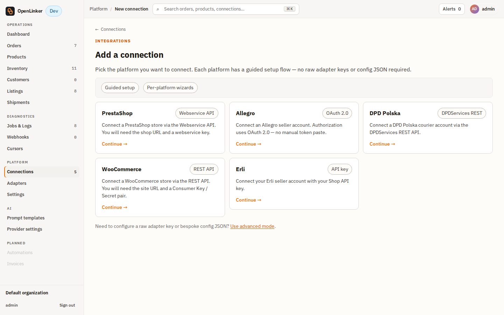
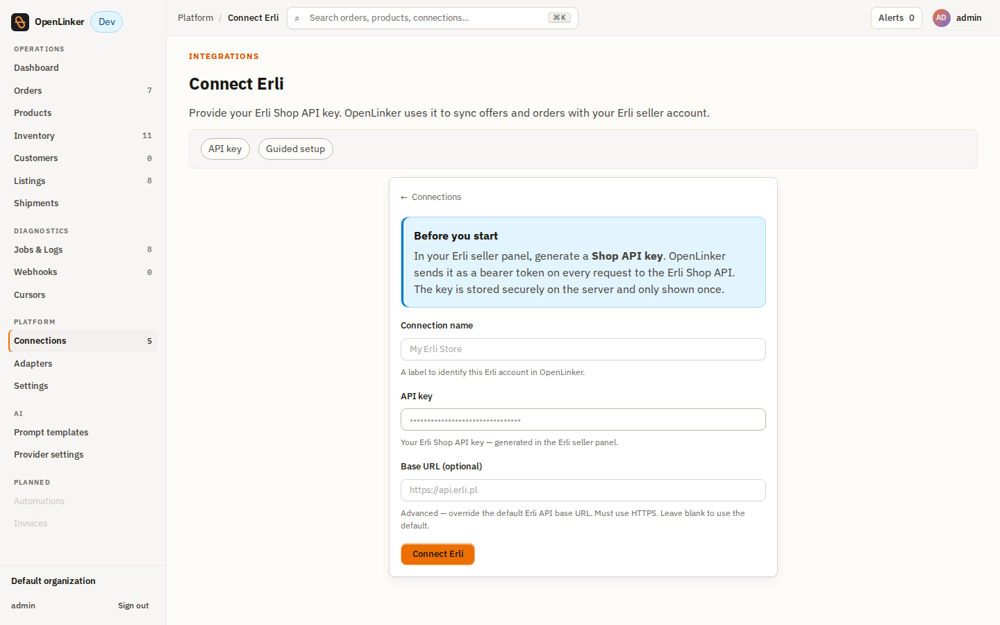
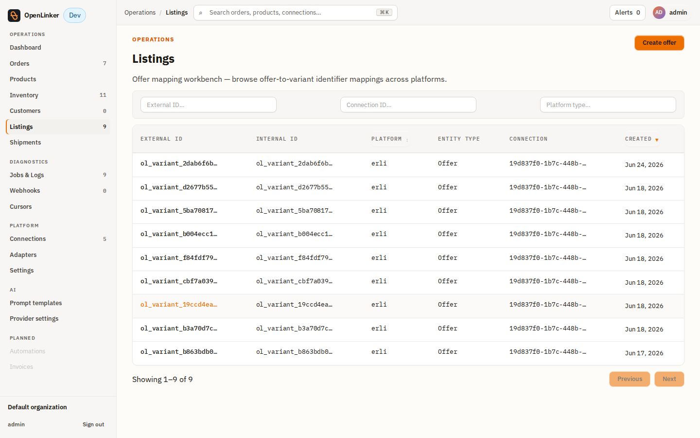
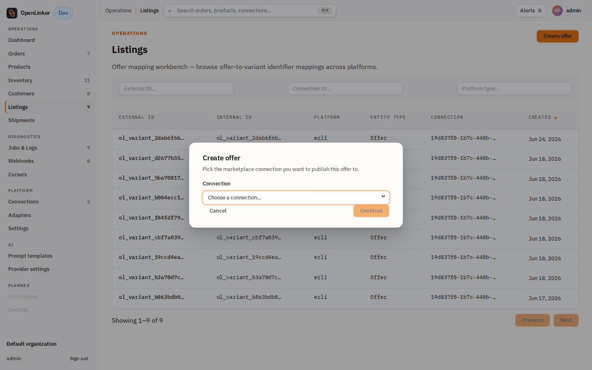
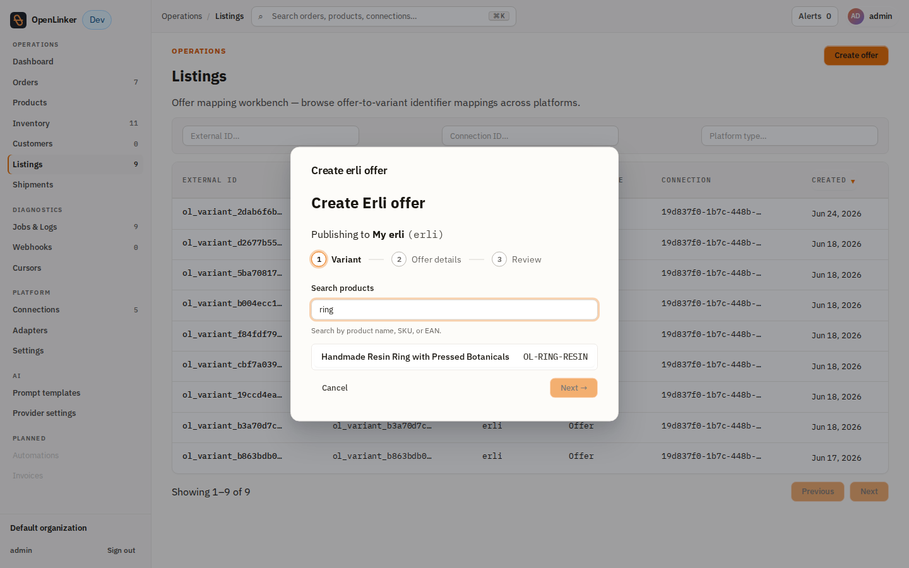
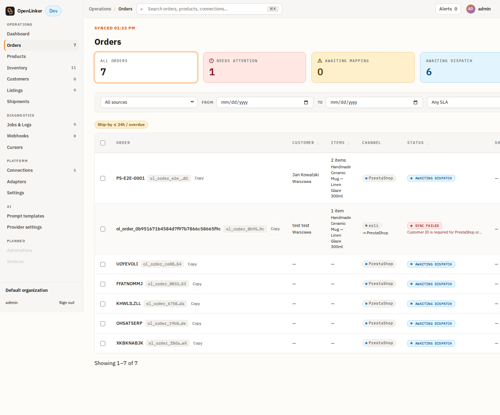

# Erli Marketplace — Operator Guide

This guide walks an operator through connecting an **Erli** marketplace account to
OpenLinker and using it end-to-end: adding the connection, installing webhooks,
creating offers, syncing stock, and receiving orders. It covers both what to
configure **on the Erli side** and the **OpenLinker click-through**.

> **Scope.** This is an operator guide. For the architecture and design rationale,
> see [ADR-025](./architecture/adrs/025-erli-marketplace-adapter.md) and the
> [product spec #978](./specs/product-spec-978-erli-marketplace-integration.md).
> The screenshots below were captured against the Erli **sandbox**
> (`https://sandbox.erli.dev/svc/shop-api`) during a live E2E verification run.

---

## 1. What you get

Erli is a Polish marketplace. The OpenLinker Erli adapter (`erli.shopapi.v1`)
delivers two capabilities:

- **OfferManager** — create/update offers (listings), push stock, reconcile offer
  status, restore stock on cancellation.
- **OrderSource** — ingest Erli orders into OpenLinker (webhook trigger + inbox-poll
  backstop).

---

## 2. Erli-side prerequisites (do this first)

You configure these **in your Erli seller panel**, before touching OpenLinker.

| What | Where / how | Notes |
|---|---|---|
| **Shop API key** | Erli seller panel → API / integrations → generate a Shop API key | This is the only credential OpenLinker needs. It is sent as a `Bearer` token on every request. Store it safely — Erli shows it once. |
| **Sandbox account** (for testing) | Request sandbox access from Erli; log in at the sandbox seller panel | Sandbox base URL is `https://sandbox.erli.dev/svc/shop-api`. Production is `https://erli.pl/svc/shop-api`. |
| **A product to list** | You list OpenLinker products onto Erli — no Erli-side product needed up front | Erli requires each offer to carry **at least one public `https` image** and a **dispatch (handling) time**. See §6. |

**There is no Erli API to create test orders.** An order only enters the system
when a **buyer places it** on the Erli marketplace (or Erli support seeds one in
sandbox). OpenLinker cannot synthesise a buyer purchase.

---

## 3. Add the connection in OpenLinker

Open **Connections → Add connection** (`/connections/new`) and pick the **Erli** card.



Fill the guided Erli setup form (`/connections/new/erli`):



| Field | Value |
|---|---|
| **Connection name** | A label, e.g. `My Erli Store` |
| **API key** | The Shop API key from your Erli seller panel (§2) |
| **Base URL** (optional, advanced) | Leave blank for production. For the sandbox, set `https://sandbox.erli.dev/svc/shop-api`. Must be `https` and an Erli-owned host. |

Click **Connect Erli**. The connection is created with the adapter's default
capabilities (**OfferManager + OrderSource**).

> **Extra config not in the guided form.** Two non-secret config values are needed
> for the full flow but are not on the guided form — set them afterwards via
> **Edit connection** (or `PATCH /connections/:id` with a merged `config`):
> - `callbackBaseUrl` — the public OpenLinker URL Erli should POST webhooks to
>   (required to install webhooks — see §5).
> - `defaultDispatchTime` — `{ "unit": "day", "period": 2 }` shop-wide default
>   handling time, applied when an offer doesn't specify its own (Erli requires it).

After creation you can review the connection on its detail page — platform,
adapter, ACTIVE status, and enabled capabilities:


---

## 4. Test the connection

On the connection (setup form or **Connection detail → Actions**), click
**Test connection**. OpenLinker calls Erli's `GET /me` with your API key. A green
result confirms the key is valid and Erli is reachable.

---

## 5. Install webhooks

Webhooks are the **low-latency trigger** for order events. They are optional for
correctness (a scheduled inbox poll backstops them — see §8) but recommended.

1. Set `config.callbackBaseUrl` on the connection to a URL Erli can reach:
   - **Production:** your public OpenLinker URL (e.g. `https://ol.example.com`).
   - **Local dev:** Erli (a cloud service) **cannot reach `localhost`**. Use a
     tunnel that exposes your local API (`:3000`) on a public `https` URL — e.g.
     `cloudflared tunnel --url http://localhost:3000` — and set `callbackBaseUrl`
     to the tunnel URL.
2. On **Connection detail → Actions**, click **Install webhooks** (or
   `POST /connections/:id/webhooks/install`).

OpenLinker rotates a per-connection webhook secret and registers two hooks with
Erli (`PUT /hooks/orderCreated`, `PUT /hooks/orderStatusChanged`). The callback
URL is `{callbackBaseUrl}/webhooks/erli/{connectionId}`; Erli echoes the secret as
a bearer token on each delivery for verification. A successful install returns
`{ "webhooksConfigured": true }`.

---

## 6. Create an offer

From **Listings**, click **Create offer**:



Pick the Erli connection in the dialog and click **Continue**:



Step through the wizard — **Variant → Offer details → Review**. Search for the
product/variant to list:



Then set price, stock, dispatch time, and (optionally) category on the details step.
Submit. OpenLinker enqueues the creation job; Erli accepts it asynchronously
(HTTP 202) and the offer starts as **draft**.

> **Image requirement (important).** Erli rejects offers without at least one
> **public `https`** image. OpenLinker pulls images from the master product and
> **drops any non-`https`/non-public URL** (e.g. a PrestaShop dev store on
> `http://localhost:8080`). If the master product has no usable image, the wizard
> blocks at the variant step. Make sure the master product carries public `https`
> images (or pass `overrides.imageUrls` via the API).

---

## 7. Stock sync

Stock propagation is **event-driven from your master catalog** (no manual step):

```
master inventory change  →  inventory.propagateToMarketplaces
                         →  marketplace.offerQuantity.update (per Erli offer)
                         →  Erli PATCH /products/{id} { stock }
```

When the master (e.g. PrestaShop) stock for a mapped product changes, the next
master-inventory sync writes the new value and OpenLinker pushes it to the linked
Erli offer automatically. *(Verified live: a master change from 100 → 7 propagated
to the Erli offer within one sync cycle.)*

> **Frozen fields.** If a seller manually edits an offer in the Erli panel, Erli
> marks those fields `frozen`. OpenLinker excludes frozen **content** fields
> (price/name/description) on field updates. Honoring frozen **stock** on the hot
> quantity path is a follow-up (#1066); enable the offer-status reconciliation
> scheduler (below) to populate the frozen-stock cache.

---

## 8. Orders

Orders reach OpenLinker two ways, which converge idempotently on one order record:

- **Webhook (trigger):** Erli `POST {callbackBaseUrl}/webhooks/erli/{connectionId}`
  with the order id → OpenLinker pulls the full order and ingests it. Erli webhooks
  are **fire-once, 5 s timeout, no retry** — so they are a latency optimization, not
  a guarantee.
- **Inbox poll (backstop, mandatory for correctness):** the `erli-orders-poll`
  scheduler reads Erli's unread inbox every 5 minutes and ingests any order events
  the webhook missed.

Ingested orders appear under **Orders**:



*(Verified live: an existing sandbox order ingested via the poll with
`recordStatus = ready`.)*

> **Downstream fulfilment.** Ingestion (the OrderSource half) is independent of
> creating the order on a destination shop. The latter requires resolved customer
> identity; an Erli order with no resolvable buyer email may not create downstream
> until identity resolution is configured.

---

## 9. Scheduler env flags (worker)

Two Erli schedulers are **opt-in** — enable them on the worker:

| Env var | Effect | Default |
|---|---|---|
| `OL_ERLI_ORDERS_POLL_SCHEDULER_ENABLED=true` | `erli-orders-poll` every 5 min (order backstop) | off |
| `OL_ERLI_OFFER_STATUS_SYNC_SCHEDULER_ENABLED=true` | `erli-offer-status-sync` hourly (reconcile offer status into `offer_status_snapshots`; populates frozen-stock cache) | off |

---

## 10. Known Erli quirks (read before relying on it)

- **Async writes (HTTP 202).** Create/update return 202 with a ~20-minute cache
  lag. **Read-after-write lies** — a freshly created offer won't read back
  immediately. Real status comes from the offer-status reconciliation, not the
  create response.
- **No webhook retry.** A dropped webhook is lost; the inbox poll is the only
  guarantee. Keep `OL_ERLI_ORDERS_POLL_SCHEDULER_ENABLED=true`.
- **Stock not auto-restored on cancellation.** Erli decrements stock on purchase
  but does not restore it on cancel; OpenLinker issues a compensating stock-restore.
- **Public https images required** (see §6).
- **Category is optional.** Offers prefer a resolved Allegro category id, fall back
  to the master shop's categories, and otherwise list uncategorised.
- **Static API key.** No OAuth/refresh — rotate by replacing the key in the seller
  panel and updating the connection credentials.

---

## 11. Troubleshooting

| Symptom | Likely cause / fix |
|---|---|
| **Install webhooks → 400 / 500** | Ensure `config.callbackBaseUrl` is set and reachable by Erli (public `https`; use a tunnel in dev). |
| **Offer create fails: "requires at least one valid public https image URL"** | Master product has no public `https` image. Add one or pass `overrides.imageUrls`. |
| **Offer create fails: "supply overrides.categoryId"** | No automatic category match and no override; supply a category or rely on the shop-source fallback. |
| **Test connection fails (401)** | Invalid/expired API key — regenerate in the Erli seller panel and update credentials. |
| **No orders arriving** | Confirm the inbox poll scheduler is enabled; confirm webhooks installed and the callback URL is reachable. |
