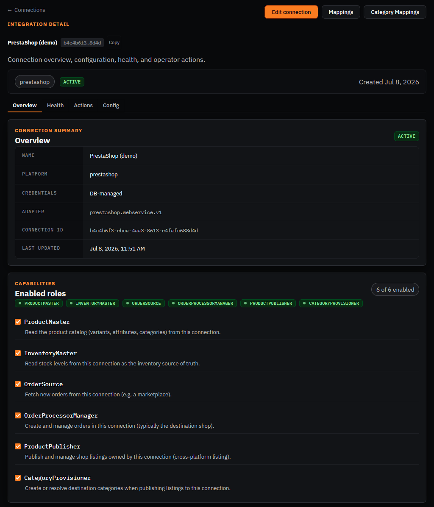
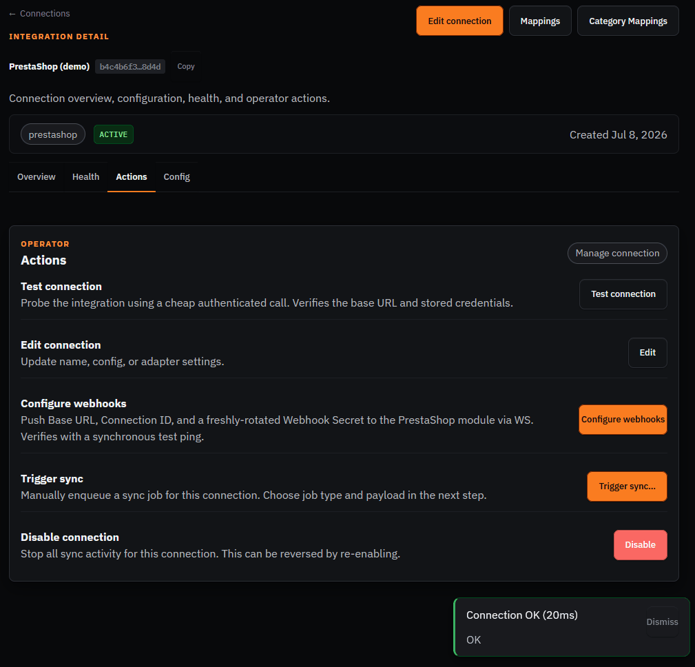
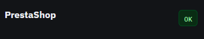
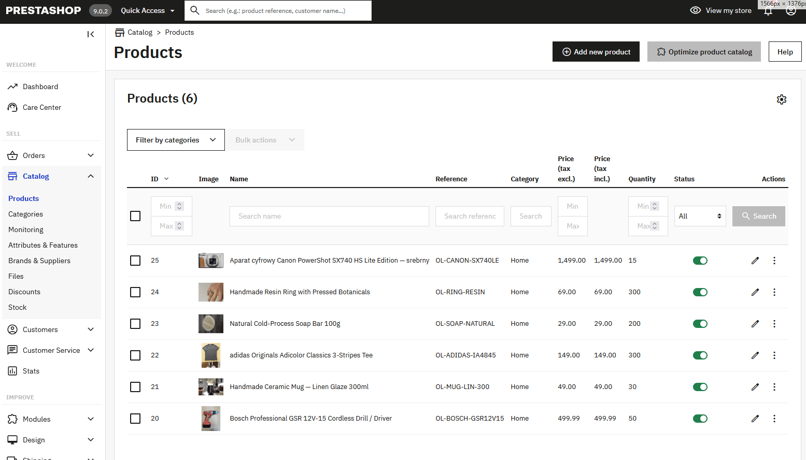
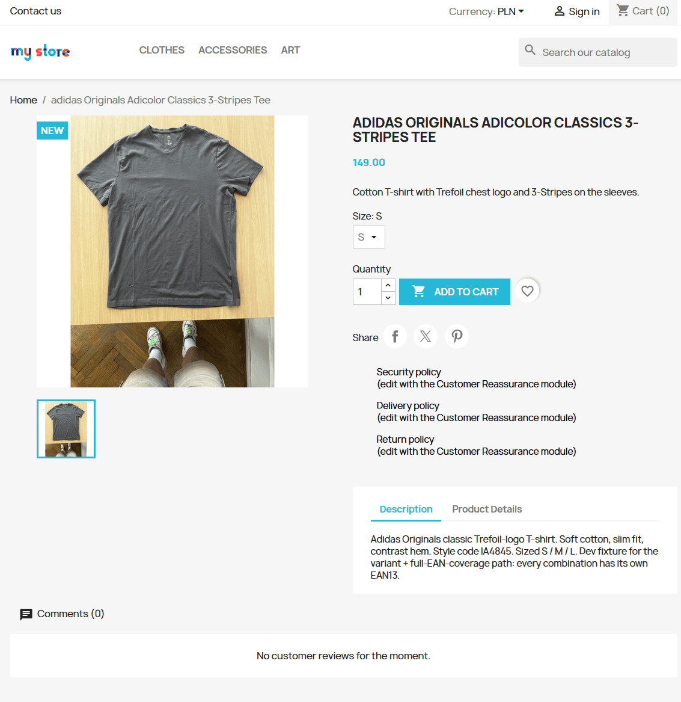
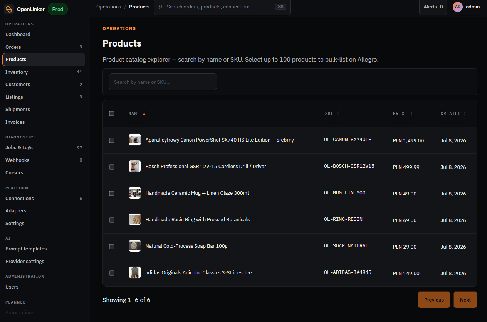
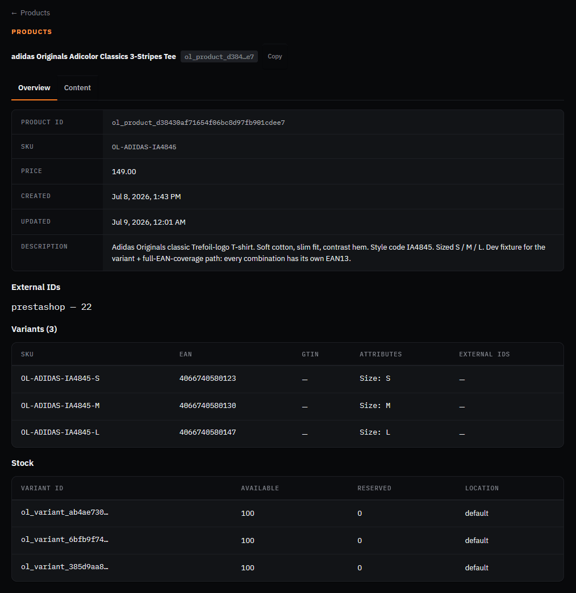

# Manual walkthrough — PrestaShop

Master catalog connection. Every other integration (Allegro, Erli, WooCommerce publish) reads
product data through this connection.

**Connection**: `PrestaShop (demo)` — id `b4c4b6f3-ebca-4aa3-8613-e4fafc688d4d`
**Config**: `baseUrl: http://prestashop` (internal), `storefrontBaseUrl:` the PrestaShop
cloudflared tunnel (public, so Erli can fetch images).

## Part A — Connection already set up, confirm it

- [x] Open http://localhost:8090/connections/b4c4b6f3-ebca-4aa3-8613-e4fafc688d4d
- [x] Confirm status badge shows **Active**
- [x] Go to the **Actions** tab, click **Test connection** → expect a green success result

- [x] Go to the **Overview**/dashboard page (http://localhost:8090) and confirm the "System
      health" widget shows PrestaShop as **OK** (this was the #1415 bug — should be fixed now)

## Part B — Seeded product data

PrestaShop ships with demo products out of the box (seeded via
`docker/prestashop/post-install/30-seed-test-products.sh` at container boot).

- [x] Open http://localhost:8080/admin-dev (admin login: see `.env` in the worktree,
      `ADMIN_PASSWD` default `prestashop_demo`, email `demo@prestashop.com`)
- [x] Go to **Catalog → Products**, confirm at least one product exists

- [x] Note the product name/SKU you'll use for the Allegro/Erli offer-creation walkthroughs —
      write it here: **adidas Originals Adicolor Classics 3-Stripes Tee** / SKU **OL-ADIDAS-IA4845**
      (3 size variants: S/M/L, each with its own EAN13)

## Part C — Product sync into OpenLinker

- [x] In OpenLinker, go to **Products** (left nav)
- [x] Confirm the PrestaShop products are visible/synced. If the list is empty, trigger a manual
      sync — check the connection's **Actions** tab for a "Sync now" / "Sync products" action, or
      wait for the scheduled `master.product.syncAll` job (runs every 20 min per the worker's
      registered scheduler tasks)

- [x] Open the reference product's detail page in OpenLinker and confirm the PrestaShop external
      ID and the 3 variants (with EANs) are mapped correctly

> **Finding:** none — sync worked cleanly, all 6 products + variants + EANs + stock mapped correctly on first sync.
