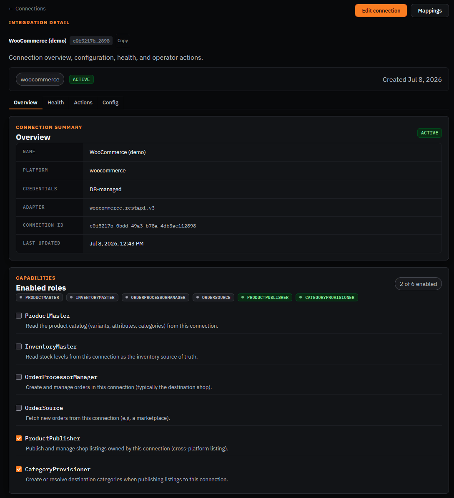
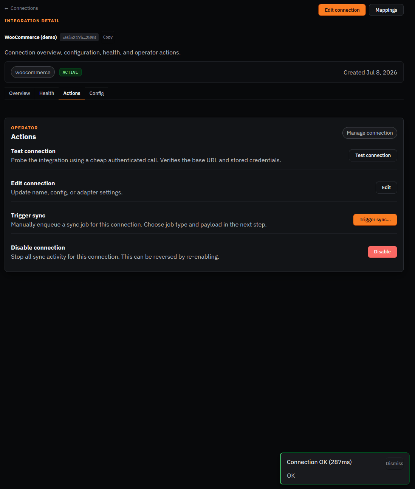
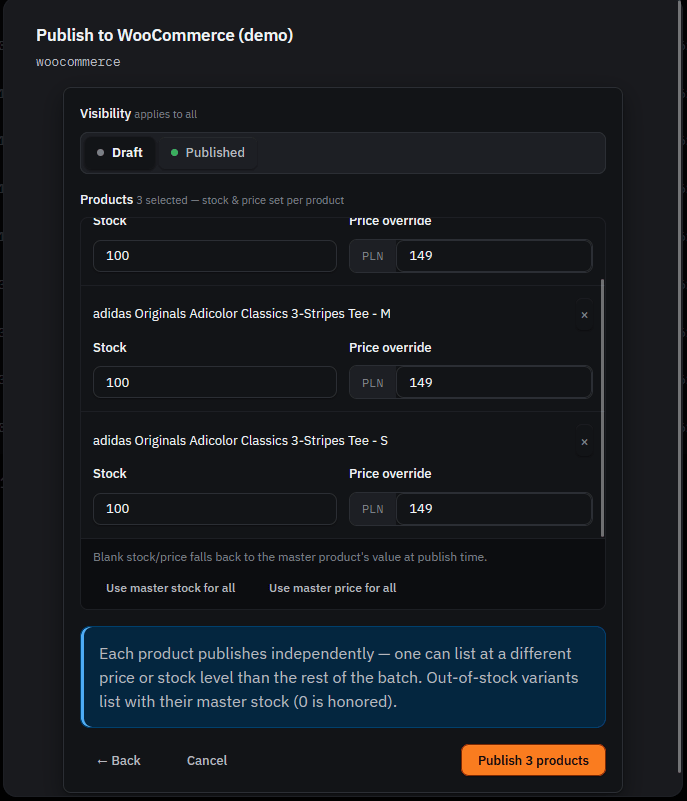
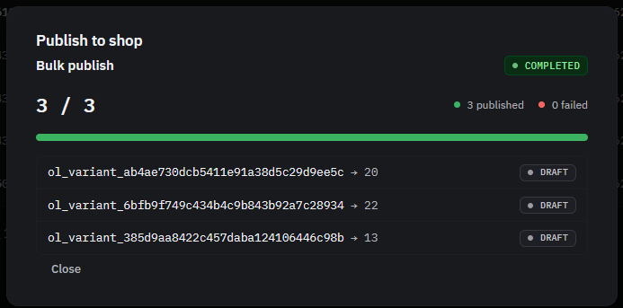
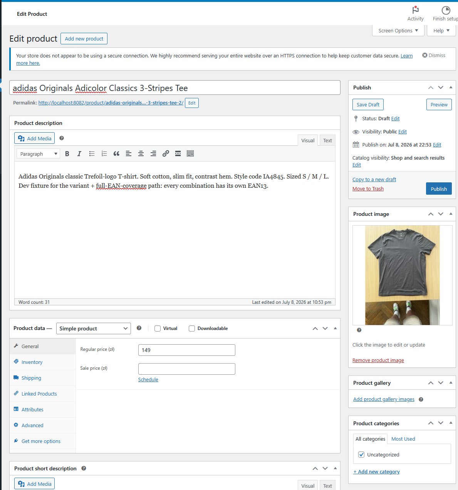

# Manual walkthrough — WooCommerce

Second shop connection, master-catalog product data pulled from the PrestaShop connection
(`masterCatalogConnectionId: b4c4b6f3-ebca-4aa3-8613-e4fafc688d4d`) and published out to
WooCommerce via the `ProductPublisher` capability.

⚠️ **This connection is configured as a destination shop only** — it has only `ProductPublisher`
and `CategoryProvisioner` enabled, not `ProductMaster`/`OrderSource`/`OrderProcessorManager`.
Unlike the PrestaShop connection (which is the master and enables all 6 capabilities), WooCommerce
here is purely a listing target: OpenLinker publishes products/categories out to it, but doesn't
read its catalog as a source of truth and doesn't ingest orders from it. Expect only 2 of 6
capability badges enabled on the connection detail page — that's correct, not a bug.

**Connection**: `WooCommerce (demo)` — id `c0f5217b-0bdd-49a3-b78a-4db3ae112898`
**Config**: `siteUrl:` the WooCommerce cloudflared tunnel (public HTTPS — required, WooCommerce's
REST API rejects Basic-Auth over plain HTTP, see issue #1416 / PR #1421 fix).

## Part A — Connection already set up, confirm it

- [x] Open http://localhost:8090/connections/c0f5217b-0bdd-49a3-b78a-4db3ae112898
- [x] Confirm status badge shows **Active**
- [x] Confirm the capabilities section shows only **ProductPublisher** and **CategoryProvisioner**
      enabled (2 of 6) — this connection is a destination shop, not a master catalog

- [x] Go to the **Actions** tab, click **Test connection** → expect a green success result

⚠️ If this fails with a 401, the cloudflared tunnel likely dropped and the `siteUrl` is stale —
tell me and I'll restart the tunnel + update the connection config.

## Part B — Publish a product to WooCommerce

- [x] In OpenLinker, go to **Products**, pick the adidas tee (3 variants: S/M/L) noted in
      `01-prestashop.md` Part B
- [x] Open the top-level **Publish to shop** wizard, target = WooCommerce connection, select all
      3 variants (bulk mode)
- [x] Configure step: stock/price fields prefill with the real master values (100 stock, 149 PLN)
      per variant, all editable; visibility set to Published

- [x] Submit — confirm success in OpenLinker (bulk publish tracker)

- [x] Open WooCommerce admin: http://localhost:8082/wp-admin/edit.php?post_type=product
      (login `admin` / `admin123`)
- [x] Confirm the product now appears in the WooCommerce product list, with the correct
      name/price/image

> **Finding:** none on the happy path. Along the way, fixed 3 real bugs surfaced by this
> walkthrough (all shipped, not just noted):
> - Publish-to-shop dialog: background content was visible through the overlay (missing
>   backdrop-blur) and, separately, product rows with long SKU/EAN text could overflow past the
>   dialog's rounded border (missing `overflow-x`/`min-width:0` on the CSS Grid picker list).
> - Toast notifications rendered *underneath* an open dialog (`z-index` collision) — invisible in
>   practice.
> - Configure step had no way back to the product-selection tray (only "Cancel", which discards
>   everything) — added a "← Back" button.
> - Stock/price fields showed a blank input behind a "master" placeholder instead of the real
>   current master value — now prefilled (editable) from master price/inventory, and "Use master
>   stock/price for all" re-fills from master instead of silently clearing to blank.

## Part C — Order ingestion (not applicable for this connection)

**Skip this** — the WooCommerce connection in this demo only has `ProductPublisher` +
`CategoryProvisioner` enabled, not `OrderSource`.

The WooCommerce order-poll job *does* exist and *does* run: the `woocommerce-orders-poll` scheduler
task (backed by `WooCommerceOrderSourceAdapter`) is gated by `OL_WOOCOMMERCE_POLL_SCHEDULER_ENABLED=true`
(set on the demo worker — see the README scheduler-flags table). But that task declares
`requiredCapability: 'OrderSource'`, so at tick time it only polls connections that have `OrderSource`
enabled. This connection doesn't (it's a destination shop), so it's skipped —
`listCapabilityAdapters('OrderSource')` never returns it. A test order placed in WooCommerce admin
therefore never appears in OpenLinker's Orders list *for this connection*.

So this is a not-enabled-on-this-connection situation, not a missing/unimplemented poll path. To
exercise WooCommerce as an order source you'd enable `OrderSource` on a WooCommerce connection (or
use a *separate* connection configured with `OrderSource`/`OrderProcessorManager`) — out of scope
for this demo instance.
