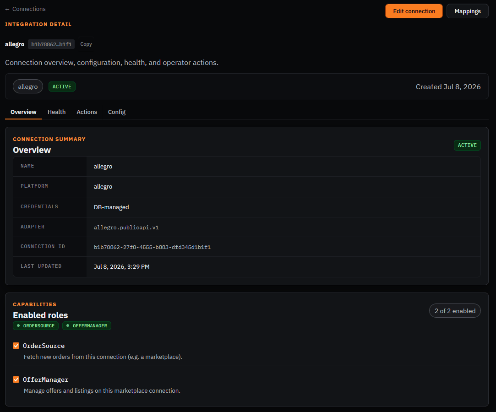
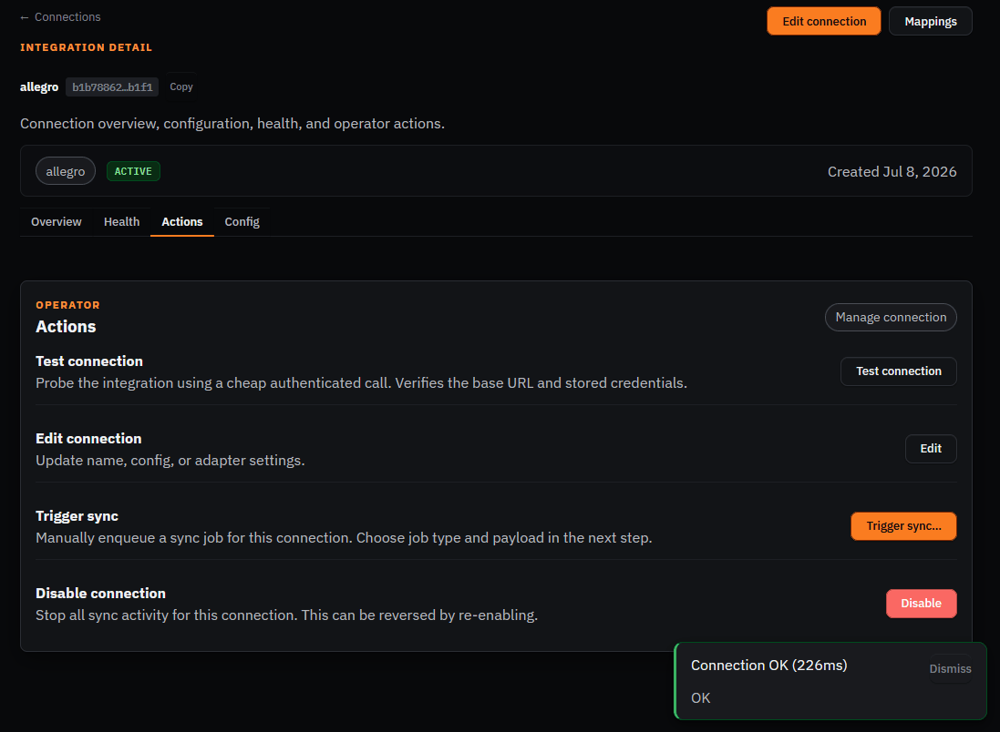
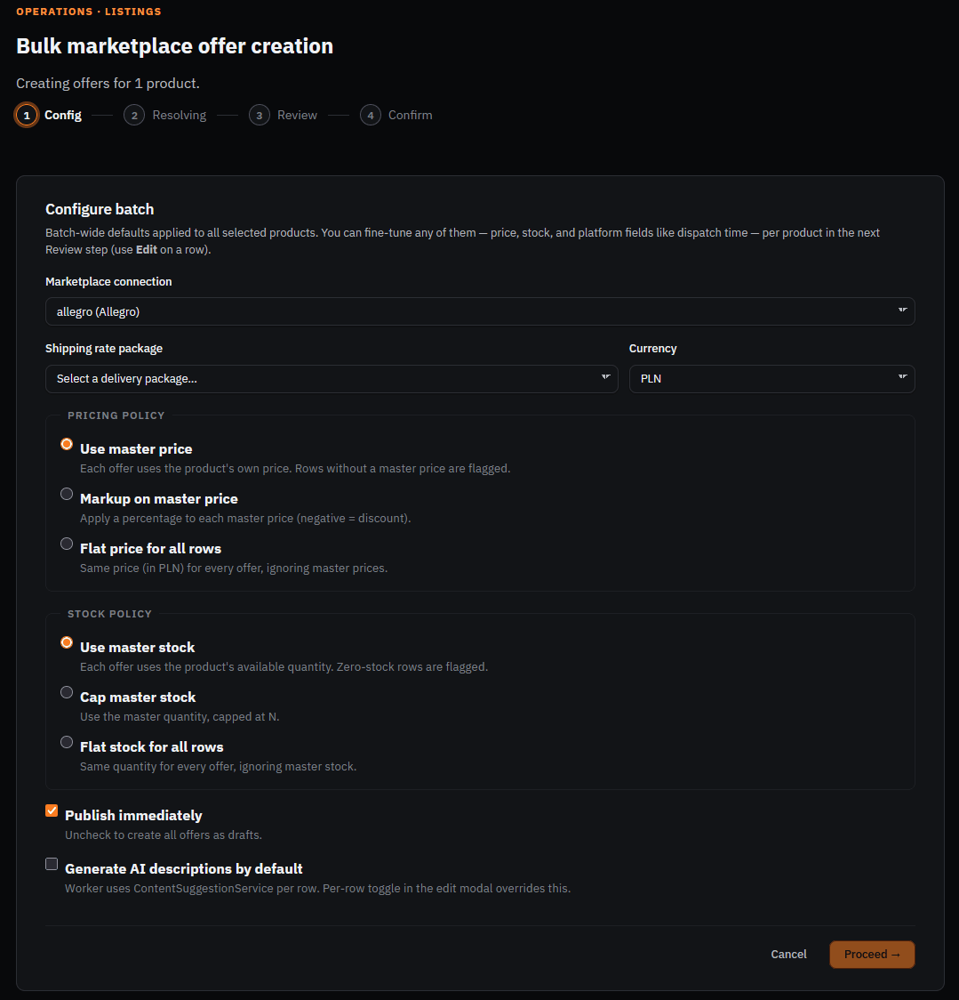
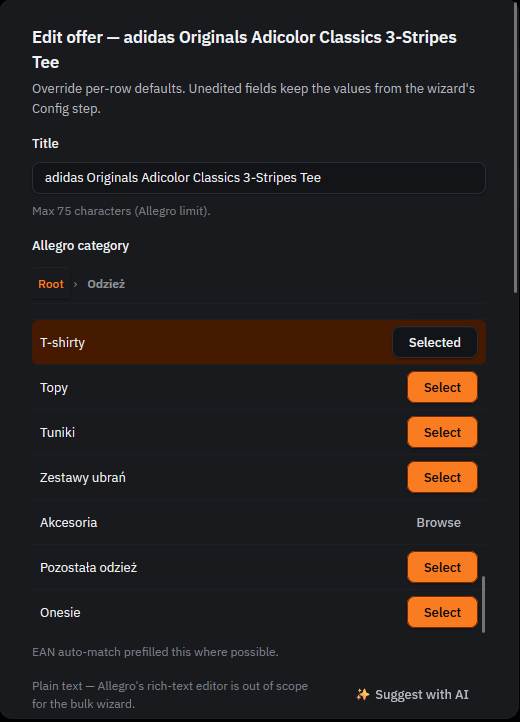
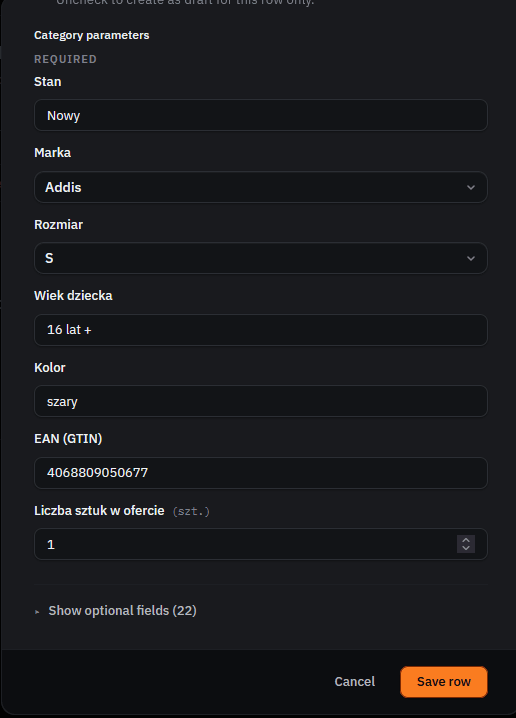
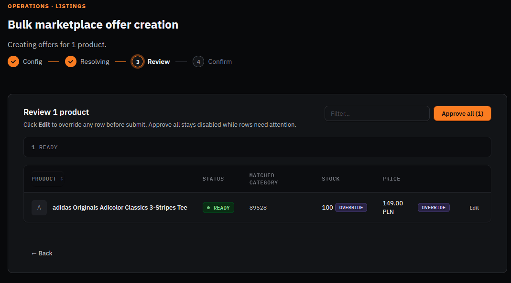
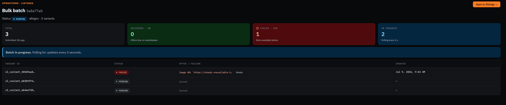
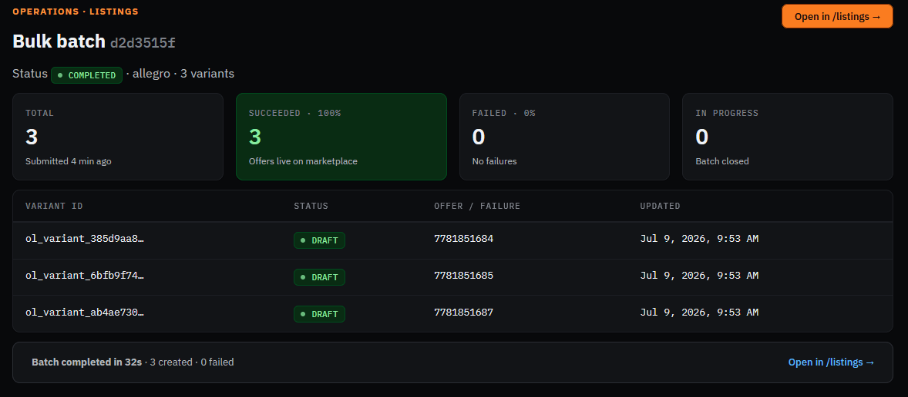
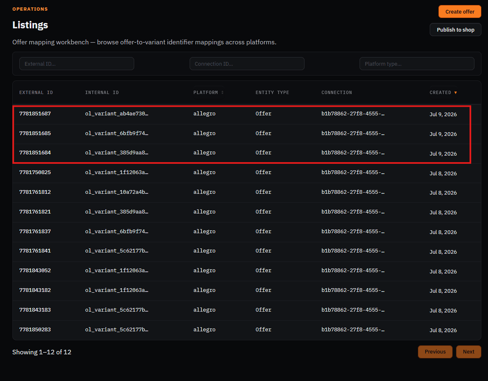

# Manual walkthrough — Allegro

Marketplace connection (sandbox), reads product data from the PrestaShop master catalog
(`masterCatalogConnectionId: b4c4b6f3-ebca-4aa3-8613-e4fafc688d4d`), creates offers + ingests
orders.

**Connection**: `allegro` — id `b1b78862-27f8-4555-b883-dfd345d1b1f1`
**Config**: sandbox environment, seller defaults already filled (ship-from location, safety
information, responsible producer) — required before offer creation will succeed
(`SELLER_DEFAULTS_NOT_CONFIGURED` otherwise).

## Part A — Connection already set up, confirm it

- [x] Open http://localhost:8090/connections/b1b78862-27f8-4555-b883-dfd345d1b1f1
- [x] Confirm status badge shows **Active**, environment shows **sandbox**



- [x] Go to the **Actions** tab, click **Test connection** → expect a green success result



## Part B — Create an offer via the bulk marketplace offer wizard

Used the **bulk** offer-creation wizard (`Operations · Listings → Bulk marketplace offer
creation`) rather than a single-offer flow — same underlying pipeline, and it's what the
Products page's bulk-select action opens by default. Config → Resolving → Review → Confirm.

- [x] Select the adidas tee product, launch **Bulk marketplace offer creation**, target = Allegro
      connection
- [x] Config step: pricing policy = **Use master price**, stock policy = **Use master stock**,
      **Publish immediately** checked



- [x] Per-row **Edit** → category step: EAN auto-match prefilled **T-shirty** under
      Root → Odzież



- [x] Parameters step: required category parameters (Stan, Marka, Rozmiar, Wiek dziecka, Kolor,
      EAN, Liczba sztuk w ofercie) all prefilled/resolved correctly — including **Stan** (the
      condition field flagged as broken in the *bulk wizard* per earlier notes — it rendered fine
      here, so that regression looks fixed or was single-offer-wizard-specific)



- [x] Review step: row shows **READY**, matched category `89528`, stock 100, price 149.00 PLN



- [x] Submit → Bulk batch tracker opens, polling every 5s

> **Finding (real bug, not a demo artifact):** The PrestaShop cloudflared tunnel's control stream
> had died silently in the background — the local process kept running and endlessly retrying
> ("control stream encountered a failure while serving"), but never actually served traffic, so
> the tunnel URL stopped resolving. The Allegro adapter's per-variant image fetch failed with
> `Image URL '<stale tunnel URL>' unreachable`, and one of the 3 auto-expanded variants
> (multi-variant expansion, #824) landed in **FAILED** while the other two sat **PENDING**.



**Fixed**: killed the dead tunnel process, restarted `cloudflared` (fresh ephemeral URL:
`https://exercises-tours-stylish-finals.trycloudflare.com`), updated the PrestaShop connection's
`config.storefrontBaseUrl` to match, and verified reachability from inside the `api` container
before retrying. This is an environment/tooling issue (ephemeral quick-tunnel dying under a
long-running demo session), not an OpenLinker product bug — but it's a good example of why the
image-fetch failure surfaces clearly per-variant in the batch tracker instead of failing silently.

- [x] Re-run the offer creation now that the tunnel is fixed — confirm all 3 variants reach
      **SUCCEEDED** and check **Listings** for the new Allegro offers





> **Finding (minor, worth a second look — not filed):** the batch tracker's per-row status shows
> **DRAFT** even though the Config step had "Publish immediately" checked and the batch-level
> summary reports "Offers live on marketplace" / SUCCEEDED 100%. Likely `DRAFT` here just reflects
> OL's own listing-record lifecycle state distinct from Allegro's publication status (`active` /
> `activating`), not a real publish-immediately regression — but worth confirming against Allegro
> sandbox directly if this resurfaces.

## Part C — Order ingestion from Allegro (optional, requires placing a real sandbox order)

- [ ] If you have Allegro sandbox buyer access, place a test order against the offer created
      above
- [ ] Wait for the `allegro-orders-poll` scheduled job (every 5 min) or trigger manually
- [ ] Confirm the order appears in OpenLinker's **Orders** list

```
[SCREENSHOT: OpenLinker Orders list showing the Allegro order]
```

- [ ] Confirm the order was created on the PrestaShop side too (destination shop)

```
[SCREENSHOT: PrestaShop admin order list showing the same order]
```

> **Finding:** _(fill in if anything here doesn't match expectations)_
