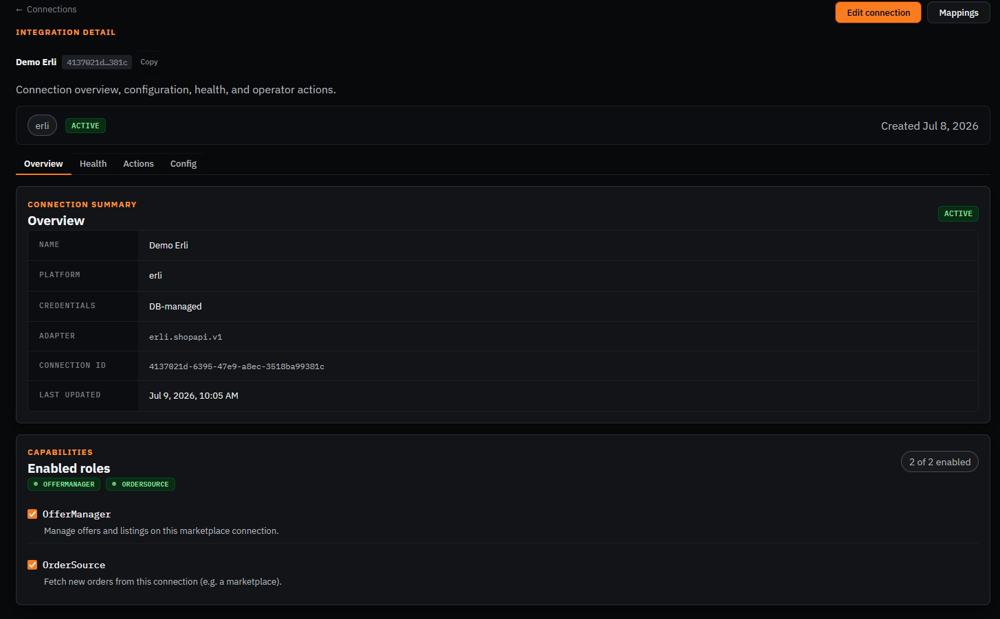
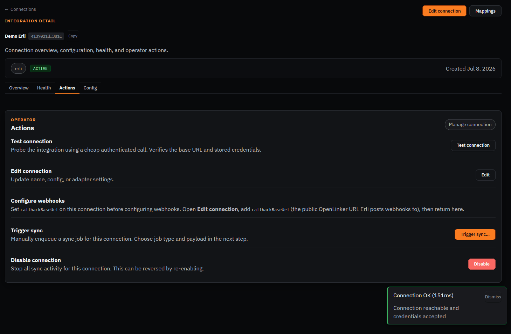
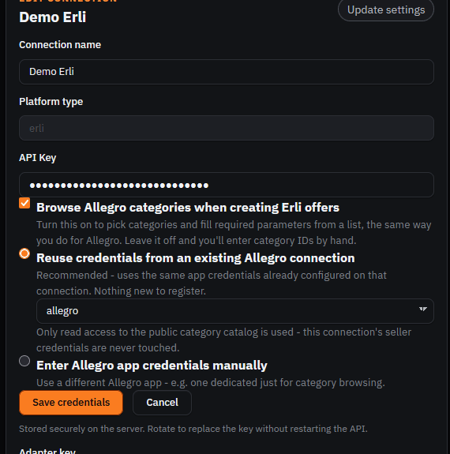
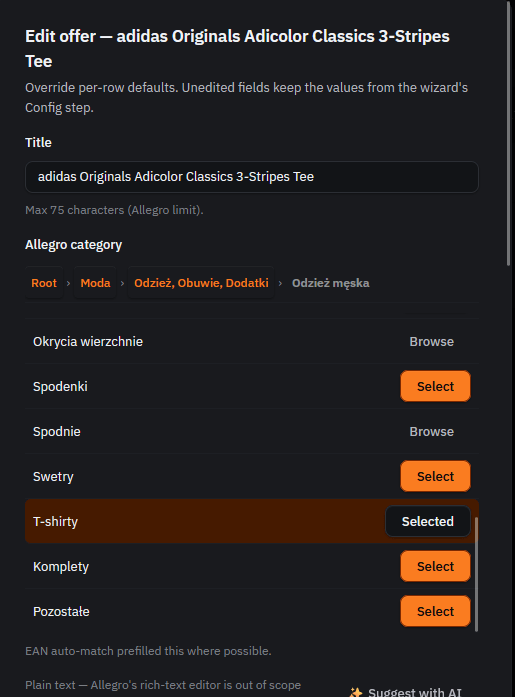
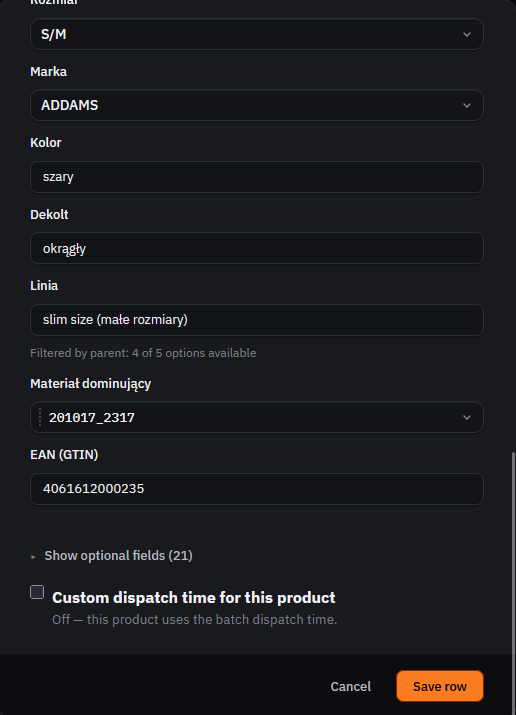
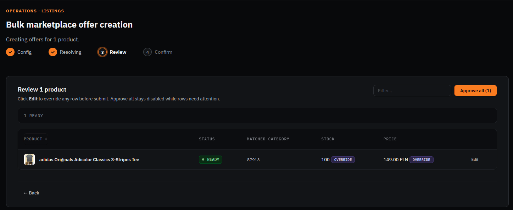
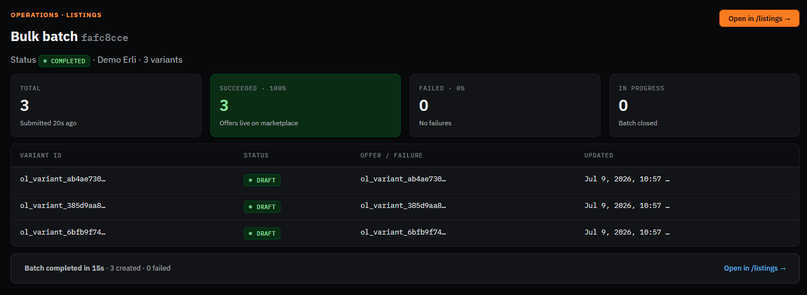
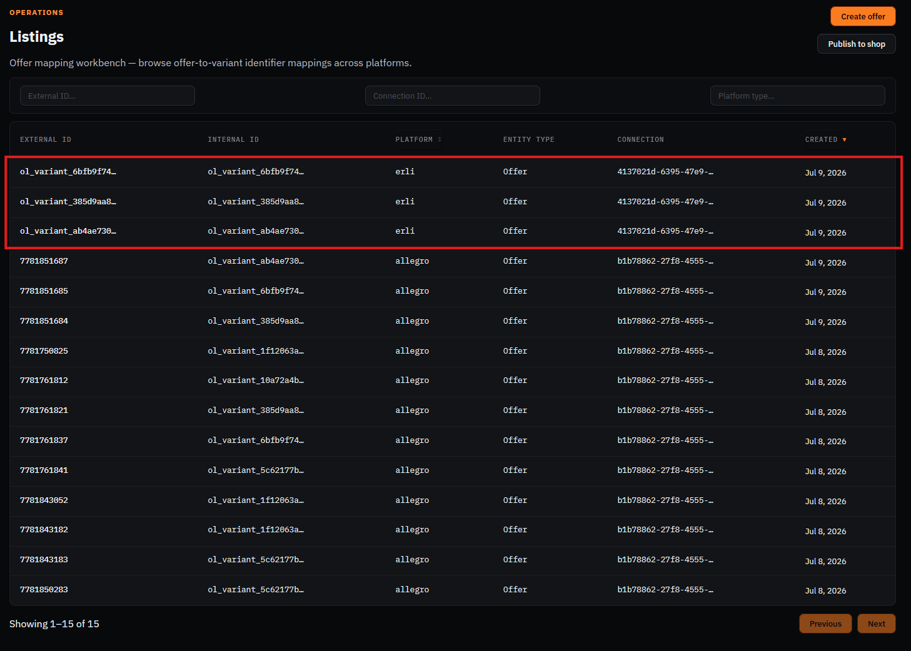
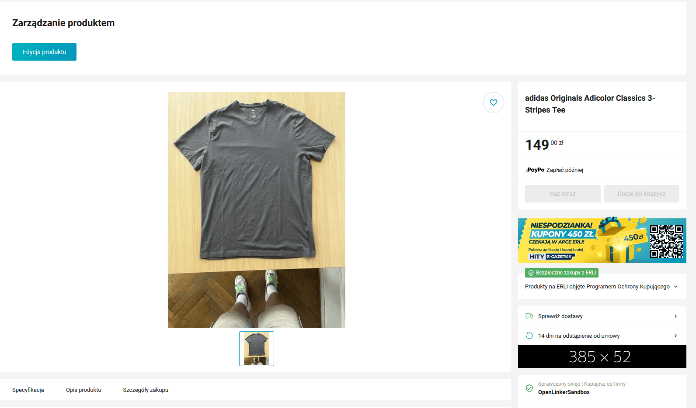

# Manual walkthrough — Erli

Marketplace connection (sandbox), reuses the PrestaShop master catalog and, per ADR-025, borrows
Allegro's category/attribute taxonomy rather than shipping its own category browser.

**Connection**: `Demo Erli` — id `4137021d-6395-47e9-a8ec-3518ba99381c`
**Config**: `baseUrl: https://sandbox.erli.dev/svc/shop-api`

⚠️ **Erli-specific requirement**: unlike Allegro, Erli does NOT re-upload product images — it
needs the PrestaShop connection's **Storefront URL** to be a real public HTTPS URL (the
cloudflared tunnel), not the internal `http://prestashop`. This is already configured on the
PrestaShop connection (see `01-prestashop.md`), but if image fetches fail, this is the first
thing to check (see issue #1417 for the doc gap that used to exist here).

## Part A — Connection already set up, confirm it

- [x] Open http://localhost:8090/connections/4137021d-6395-47e9-a8ec-3518ba99381c
- [x] Confirm status badge shows **Active**



- [x] Go to the **Actions** tab, click **Test connection** → expect a green success result



## Part B — Enable Allegro category browsing (optional, but strongly recommended)

By default Erli offers use a raw "Allegro category ID" text field (no picker) — leaving it blank
resolves the category server-side from your existing PrestaShop→Allegro mappings at submit time
(ADR-025 §3, borrowed taxonomy). To get the real category-tree picker + parameters step (same UX
as Allegro's own wizard), turn on category browsing:

- [x] Go to the Erli connection → **Edit connection** → **Credentials**
- [x] Check **"Browse Allegro categories when creating Erli offers"**
- [x] Pick **"Reuse credentials from an existing Allegro connection"** → select `allegro`
- [x] Click **"Save credentials"** (this button is independent from the page's bottom "Save
      changes" — see Finding below)



> **Finding #1 (real bug, fixed):** the "Browse Allegro categories" checkbox + reuse-connection
> picker was rendered *inside* the collapsed "Rotate API key" section — reaching it required
> opening the API-key rotation UI, even though changing the API key was never the goal. **Fixed**:
> the Allegro category-browsing section is now always visible, independent of the API-key
> rotation toggle.
>
> **Finding #2 (real bug, fixed):** clicking "Save credentials" then the page's bottom "Save
> changes" caused the *second* save to silently overwrite the config flag the *first* save had
> just written — "Save changes" PATCHes the connection's `config` wholesale from a stale
> snapshot captured at page load, clobbering any partial update a sibling panel (like this one)
> made moments earlier in the same session. Confirmed via direct DB inspection (`allegroCategoryAccessEnabled`
> silently reverted to absent after both toasts reported success). **Workaround for now**: click
> only "Save credentials", never "Save changes", when using this panel. Not yet fixed at the root
> (the whole-object PATCH pattern) — worth its own issue, see below.
>
> **Finding #3 (real bug, fixed):** even after the checkbox saved correctly, category-catalog
> requests failed with `401 invalid_client` — `ErliAdapterFactory` defaults the category-catalog
> client to Allegro's **production** OAuth endpoint when `config.allegroEnvironment` is absent,
> but the "reuse" flow never copied the source Allegro connection's actual environment (`sandbox`
> here) into that field. **Fixed**: the credentials panel now infers `allegroEnvironment` from
> the reused connection automatically (shown as a "Will use that connection's environment:
> sandbox" hint), and manual credential entry gets an explicit Sandbox/Production picker.

## Part C — Create an offer via the bulk marketplace offer wizard

- [x] Select the adidas tee product, launch **Bulk marketplace offer creation**, target = Erli
      connection
- [x] Category step: the real tree picker now renders (previously always fell back to the manual
      ID field even with category browsing enabled — see Finding #4)



- [x] Parameters step: category parameters resolved and filled (Rozmiar S/M, Marka ADDAMS, Kolor
      szary, Dekolt okrągły, Linia slim, Materiał dominujący, EAN)



- [x] Review step: row shows **READY**, matched category, stock 100, price 149.00 PLN



> **Finding #4 (real bug, fixed):** the bulk wizard's Review/Edit modal decided whether to show
> the category-tree picker purely from `connection.supportedCapabilities.includes('CategoryBrowser')`
> — a *static*, manifest-level flag. Erli's manifest correctly never declares `CategoryBrowser`
> (most Erli connections don't have Allegro category access configured), so the picker never
> appeared even after enabling it, even though the dedicated single-offer `ErliCreateOfferWizard`
> already read the right *dynamic*, per-connection signal (`config.allegroCategoryAccessEnabled`).
> **Fixed**: added a `bulkCategoryBrowsingEnabled` plugin-contribution slot so the bulk flow can
> reach the same per-connection signal without a `platformType ===` check in the shared
> components — ORed with the static capability check, so a real `CategoryBrowser` adapter
> (Allegro) is unaffected.

- [x] Submit → first attempt **rejected** (see Finding #5), fixed, retried → **all 3 succeeded**



> **Finding #5 (real bug, fixed):** the first submit failed with `ERLI_REJECTED (HTTP 400)`.
> Worker logs showed the real reason: `externalAttributes[N].values[0] must be of type object` —
> Erli's actual sandbox schema (`docs/architecture/adrs/erli-sandbox-swagger.json`) requires
> `dictionary`-type attribute values as `{ id, name? }` objects, not bare ids, but
> `ErliOfferManagerAdapter.buildExternalAttributes` was sending plain strings. This was the first
> real end-to-end exercise of the borrowed-taxonomy → Erli translation path, so it had never hit a
> live validator before. **Fixed**: dictionary values now map each id to `{ id }`; updated 82
> adapter tests + types.

## Part D — Confirm the offers landed correctly

- [x] Check **Listings** — the 3 new Erli offers appear, mapped to their variants



- [x] Open the live Erli sandbox product page directly, confirm name/price/image are correct



Confirmed working end-to-end: correct name, price (149.00 zł), and product image (the PrestaShop
storefront tunnel image fetch — no separate re-upload, per Erli's design).

## Part E — Order ingestion from Erli (optional, requires a real sandbox order)

Per prior E2E notes, Erli's sandbox has no order-create API — only buyer-placed orders enter.
This part may require driving the Erli sandbox storefront directly as a "buyer."

- [ ] If feasible, place a test order on the Erli sandbox storefront against the offer above
- [ ] Wait for the `erli-orders-poll` scheduled job (every 5 min) or trigger manually
- [ ] Confirm the order appears in OpenLinker's **Orders** list

```
[SCREENSHOT: OpenLinker Orders list showing the Erli order]
```

> **Finding:** _(fill in if anything here doesn't match expectations)_
