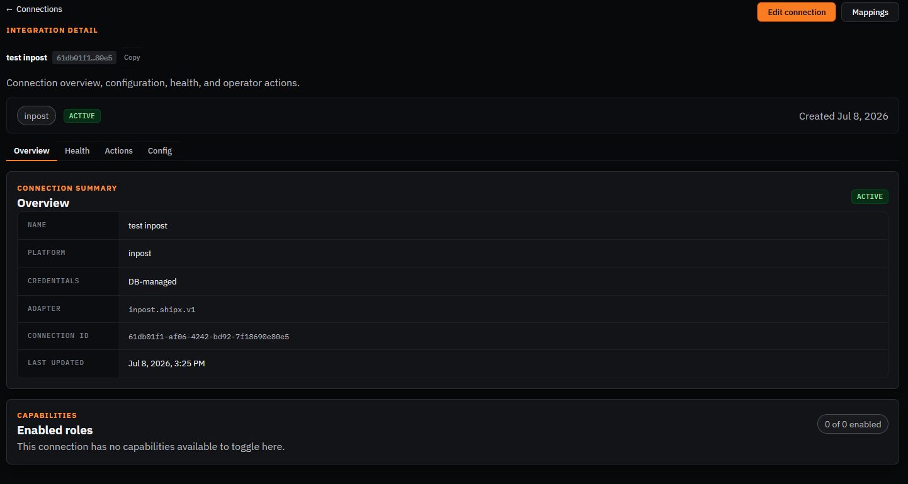
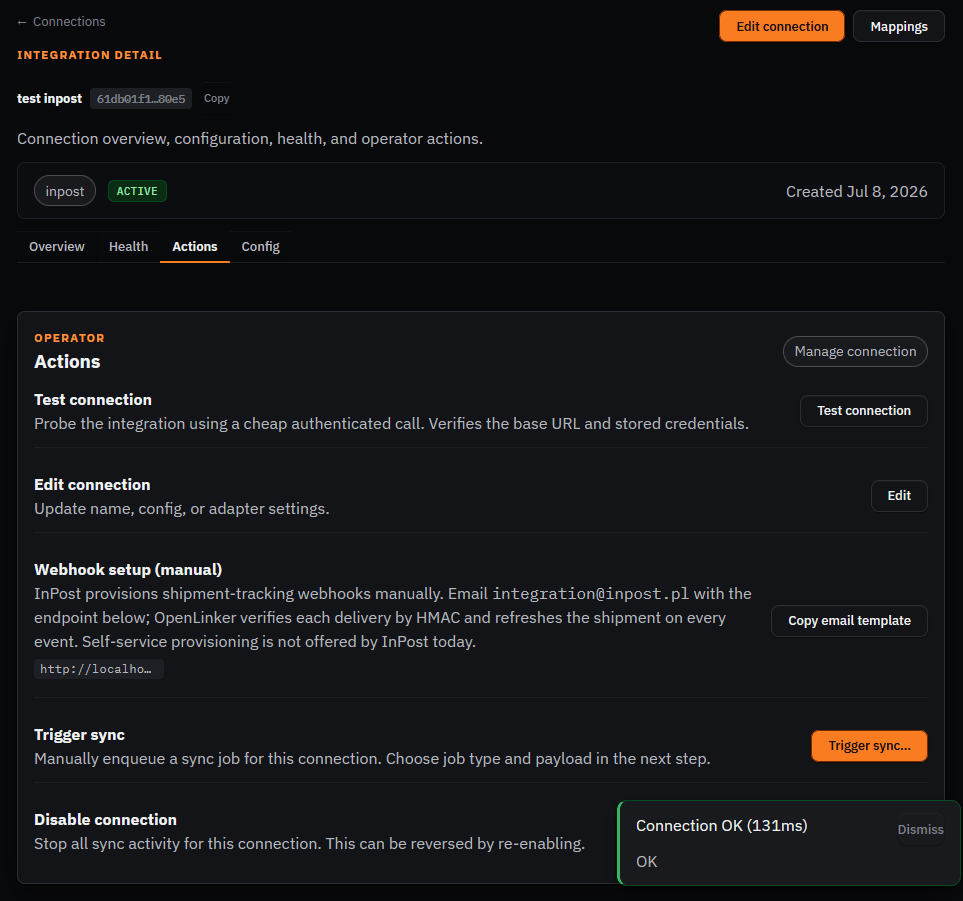
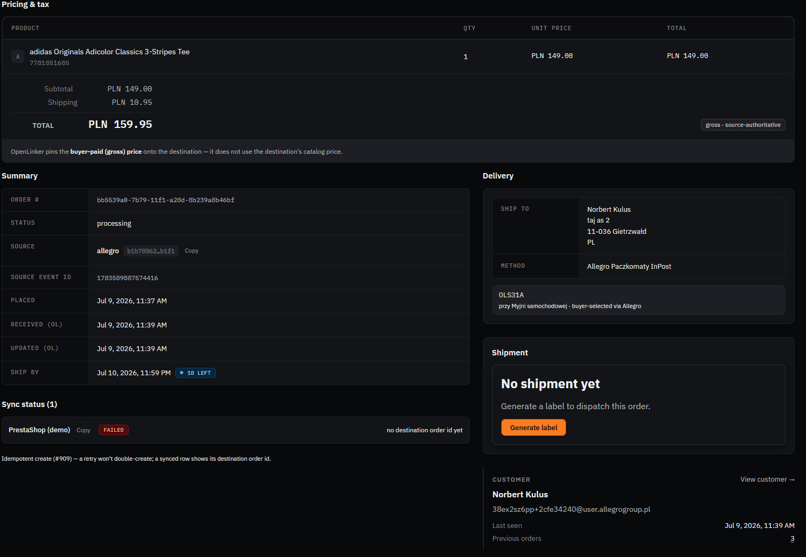
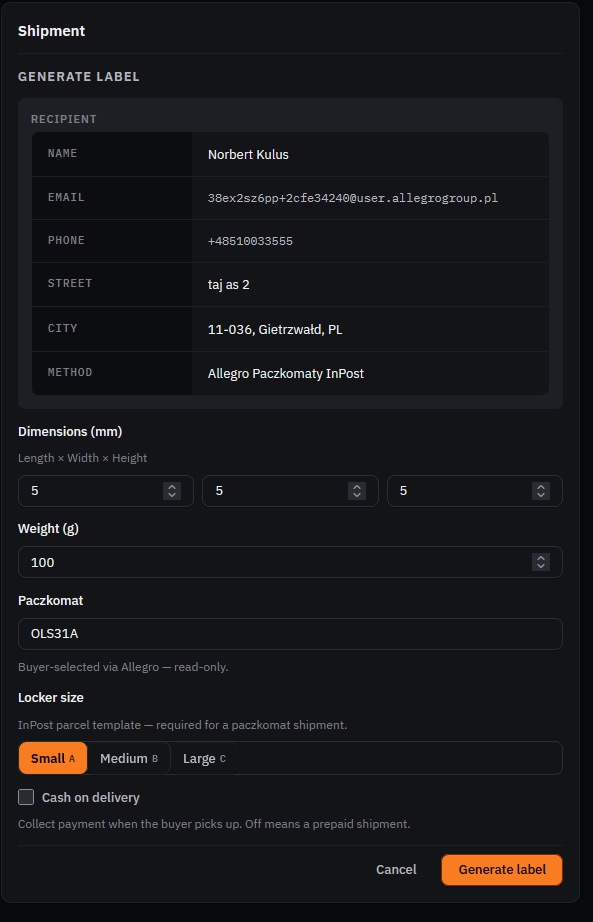
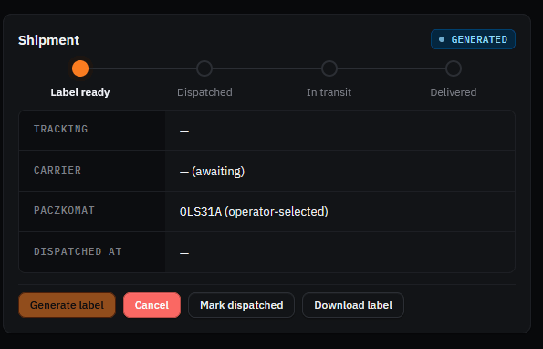
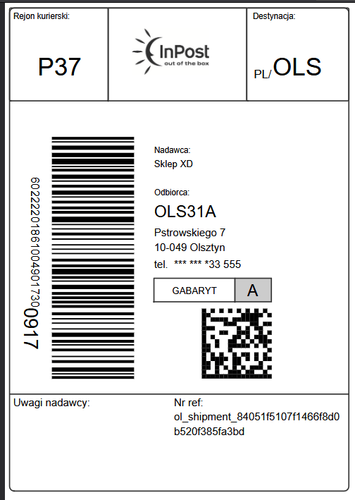
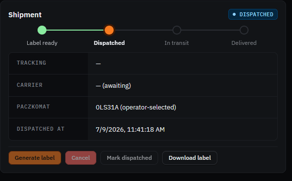

# Manual walkthrough — InPost

Shipping provider connection (sandbox) — `ShippingProviderManager` capability, used to generate
shipping labels/pickup-point (paczkomat) selection for orders.

**Connection**: `test inpost` — id `61db01f1-af06-4242-bd92-7f18690e80e5`
**Config**: sandbox environment, sender address + organization ID already filled.

## Part A — Connection already set up, confirm it

- [x] Open http://localhost:8090/connections/61db01f1-af06-4242-bd92-7f18690e80e5
- [x] Confirm status badge shows **Active**, environment shows **sandbox**



- [x] Go to the **Actions** tab, click **Test connection** → expect a green success result



> Note: the Actions tab also surfaces a manual webhook-setup flow — InPost doesn't offer
> self-service webhook provisioning, so OpenLinker generates an email template the operator sends
> to `integration@inpost.pl` with the callback endpoint, verified by HMAC on delivery.

## Part B — Generate a shipping label

Used an order that came in from the Allegro E2E testing earlier (adidas tee, buyer-selected
Allegro Paczkomaty InPost delivery method, pickup point `OLS31A` already resolved from Allegro).

- [x] Go to **Orders**, open the order — confirm delivery method + pickup point are correct,
      "No shipment yet"



- [x] Click **Generate label** — dimensions/weight defaulted, paczkomat pre-filled read-only
      (buyer-selected via Allegro), pick a locker size



- [x] Submit — shipment panel shows **GENERATED** status, "Label ready" stage in the lifecycle
      rail (new `ShipmentLifecycleRail` from PR #1429, merged into this demo earlier)



- [x] Click **Download label** — confirm a real InPost label PDF/image downloads with correct
      courier region, destination, barcode, and reference



- [x] Click **Mark dispatched** — shipment panel advances to **DISPATCHED**, dispatched
      timestamp recorded



> **Finding:** none — the whole generate-label → download → mark-dispatched flow worked cleanly
> end to end, including the new `ShipmentLifecycleRail` UI from #1429.

## Part C — Tracking status sync (optional)

- [ ] Wait for the `inpost-shipment-status-sync` scheduled job (every 30 min) or trigger manually
- [ ] Confirm the shipment status updates in OpenLinker

```
[SCREENSHOT: order shipment panel showing an updated tracking status]
```

> **Finding — sandbox tracking limitation (verified, not "custom integration"-specific):** the
> shipment above doesn't appear in InPost's own web dashboard. Initially suspected this was
> because OpenLinker's InPost connection is a "custom integration" (ShipX API access provisioned
> directly, not through InPost's official partner-dashboard onboarding) — **checked this against
> InPost's own developer docs and it does not hold up**:
> - No InPost documentation ties dashboard visibility to *how* the integration was provisioned.
> - What IS documented: **courier** shipments never appear in any sandbox dashboard (WebTrucker is
>   production-only by design) — but **paczkomat/locker** shipments (what we tested, `OLS31A`)
>   *should* be visible in the **sandbox-specific** Manager Paczek, which lives at a **different
>   URL** than production (`sandbox-manager.paczkomaty.pl`, not the production dashboard) — worth
>   double-checking that URL specifically before concluding it's not visible at all.
> - Separately, InPost's sandbox documentation describes the **tracking component as
>   generally limited/disabled** in sandbox — so full status progression (in transit → delivered)
>   may simply not be simulated there regardless of integration type. This reads as a blanket
>   sandbox constraint, not something OpenLinker can work around.
> - No sandbox-only "simulate a scan event" endpoint was found to manually advance status for
>   testing.
>
> **Net**: Part C likely can't be meaningfully exercised against the InPost *sandbox* at all — this
> looks like an InPost-side sandbox limitation rather than an OpenLinker bug. Confirming this
> conclusively would need InPost's own support/FAQ to weigh in directly (their FAQ page exists but
> its exact current wording couldn't be fetched during this research pass).
