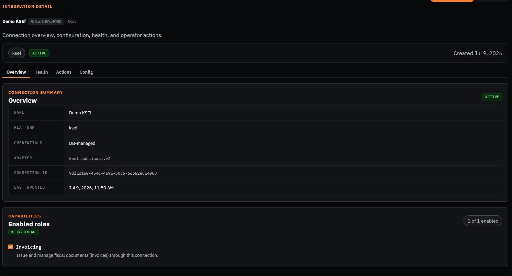
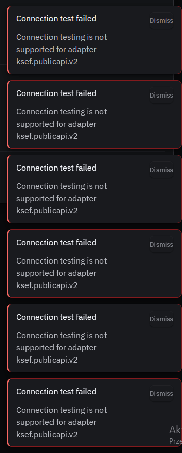
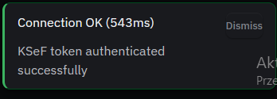
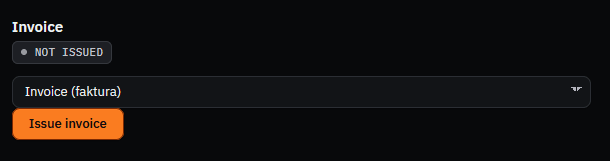
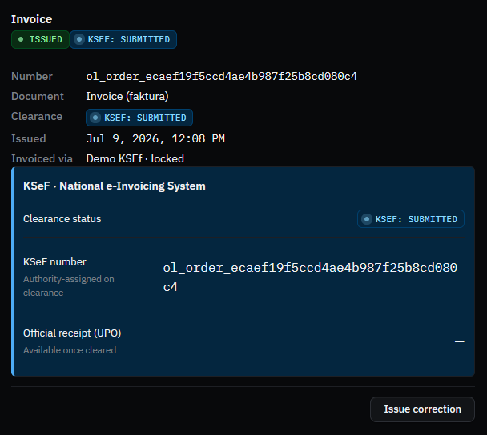
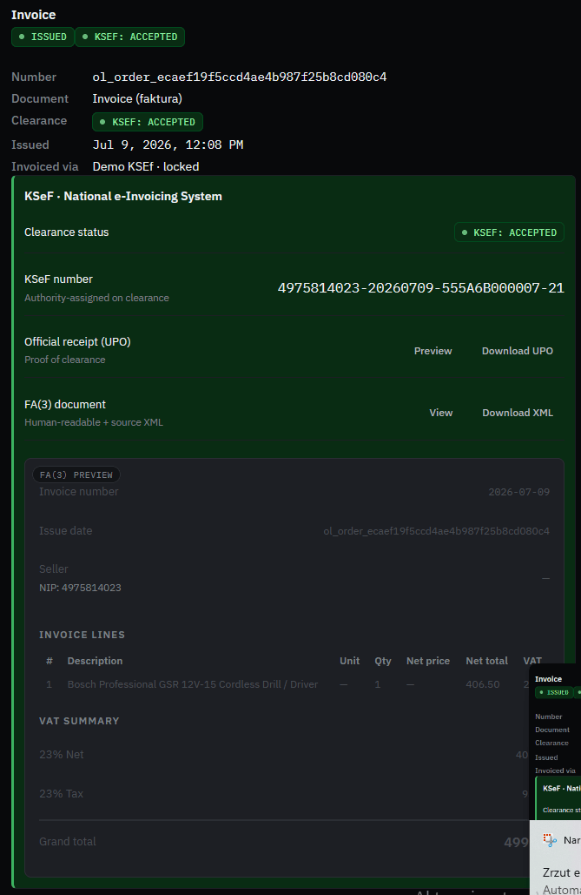
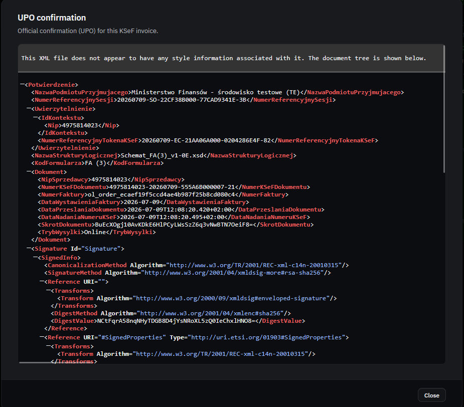

# Manual walkthrough — KSeF

Invoicing / regulatory-clearance connection. Country-agnostic invoicing domain, KSeF is the first
(and so far only) provider — see ADR-026.

**Connection**: `Demo KSEf` — id `9dfadf50-454d-459a-b0c6-6db62e5a4058`
**Config**: environment `test`, authType `ksef-token`, seller profile filled (NIP `4975814023`).

## Part A — Get a KSeF test token (external, on the government test portal)

Done outside this walkthrough — token generated via `https://ap-test.ksef.mf.gov.pl`
("Uwierzytelnienie testowe" + random test NIP, Tokeny → Generuj token with "wystawianie faktur"
permission). No screenshot needed (throwaway test-env token).

## Part B — Connection already created, confirm it

- [x] Open http://localhost:8090/connections/9dfadf50-454d-459a-b0c6-6db62e5a4058
- [x] Confirm status badge shows **Active**, 1 of 1 capability enabled (Invoicing)

- [ ] Go to the **Actions** tab, click **Test connection**

> **Finding (real bug, fixed — issue #1447 / PR #1448):** KSeF never implemented
> `ConnectionTesterPort` at all — every other platform in this walkthrough (and KSeF's own
> sibling invoicing integration Infakt) has one. Added `KsefConnectionTesterAdapter`, which runs
> the real `ksef-token` auth handshake (`challenge → submit-token → poll → redeem`) — there's no
> lighter-weight KSeF endpoint that proves a token authenticates, so the handshake itself is the
> cheapest possible probe. Handles `qualified-seal` gracefully (clear "not yet supported" result,
> matching `KsefAdapterFactory`'s existing posture) rather than attempting a handshake that can't
> succeed.

- [x] Retry **Test connection** after the fix

## Part C — Issue an invoice

- [x] Go to an order's **Invoice** panel — starts **NOT ISSUED**

- [x] Click **Issue invoice** — invoice shows **ISSUED**, clearance status **KSeF: SUBMITTED**
      (async — KSeF hasn't cleared it yet)

- [x] Wait for clearance and confirm the status flips to accepted, with a real KSeF number + UPO

_(initially appeared stuck at KSeF: SUBMITTED — reconcile-cadence env gotcha, resolved by a manual
job trigger; see Finding below)_

> **Finding (env gotcha, not a bug):** the clearance status stayed at `KSeF: SUBMITTED` well
> after KSeF itself had actually cleared the document (confirmed independently — the operator had
> already downloaded the real invoice XML from the KSeF portal directly, filename
> `4975814023-20260709-555A6B000007-21.xml`). Root cause: the `invoicing.regulatoryStatus.reconcile`
> sync job runs on a **30-minute** cadence, and the only job that had run so far predated this
> invoice's issuance (issued 10:08:19 UTC, last reconcile ran 10:00:03 UTC). Same known gotcha as
> earlier KSeF E2E sessions (starved/slow scheduled jobs in the demo environment). **Fixed by
> manually enqueuing** a `sync_jobs` row (`{"schemaVersion": 1}` payload — the handler validates
> this exact shape) instead of waiting up to 30 minutes; the job succeeded within seconds and the
> invoice record's `regulatoryStatus` flipped to `accepted` with `clearanceReference =
> 4975814023-20260709-555A6B000007-21` — an exact match to the filename downloaded from KSeF's
> own portal, confirming genuine correctness end-to-end, not just OL's own record-keeping.

- [x] Refresh — confirm **KSeF: ACCEPTED**, real KSeF number, UPO + FA(3) document both available

- [x] Open the UPO preview — confirm it's the real signed confirmation document from KSeF

Confirmed genuinely real: `<NazwaPodmiotuPrzyjmującego>Ministerstwo Finansów - środowisko
testowe (TE)</NazwaPodmiotuPrzyjmującego>`, the seller NIP matching the connection's configured
seller, the OL order id echoed as `<NumerFaktury>`, and a real XML digital signature block
(`SignedInfo`/`DigestValue`/canonicalization + RSA-SHA256).

**Note on scope**: this also directly satisfies part of tracked issue
[#1322](https://github.com/openlinker-project/openlinker/issues/1322) ("OL_DEMO_MODE safety audit
and demo readiness"), Priority 1 — KSeF: *"Manually run the full issueInvoice → getClearanceStatus
(poll) → getUpo flow against the real KSeF test environment using a ksef-token credential — no
automated integration test exercises this today."* Worth checking off that item.

> **Finding:** none beyond the two above (Test connection gap, reconcile-cadence env gotcha) — the
> actual issuance → clearance → UPO flow worked correctly end-to-end.
