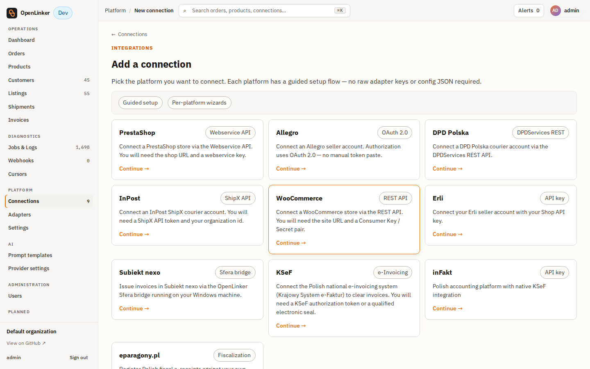
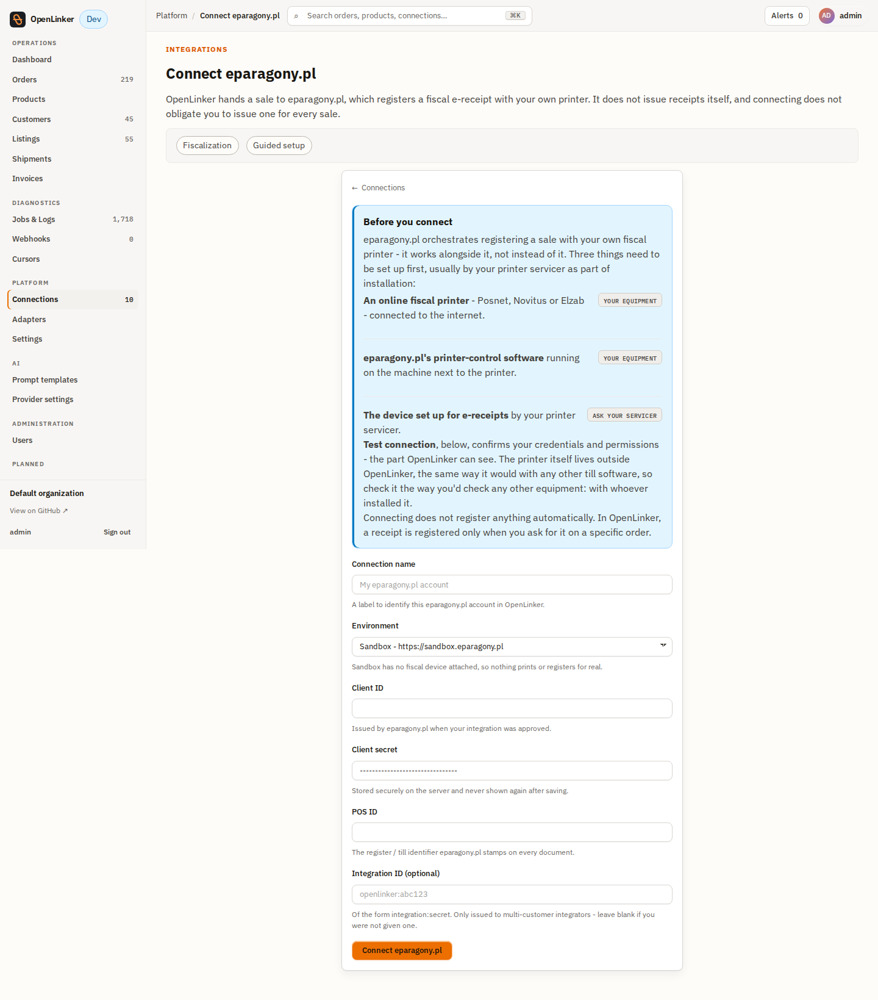
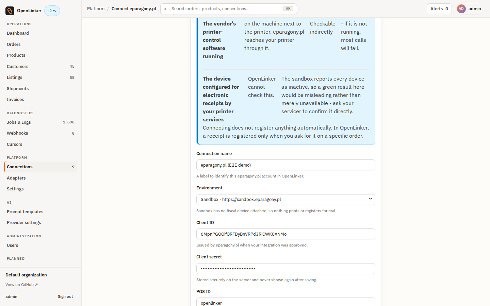
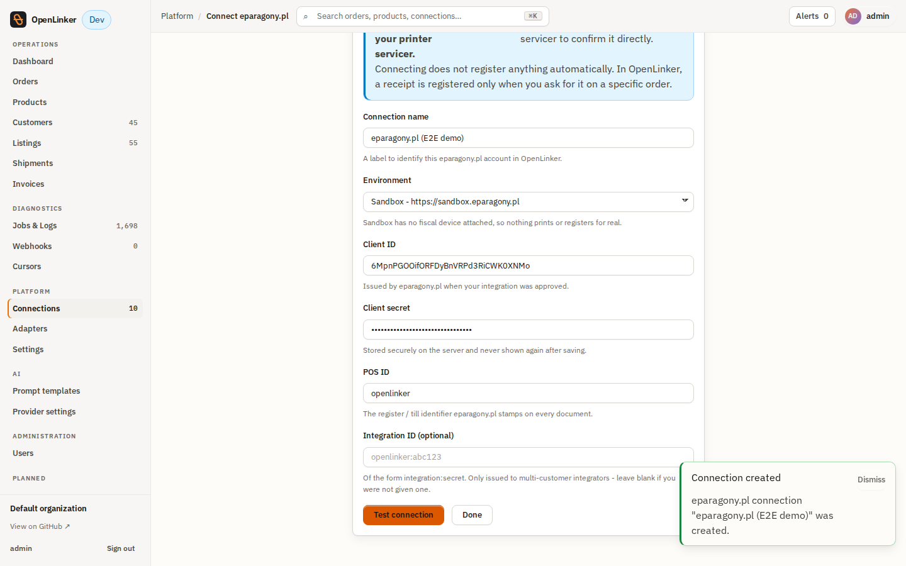
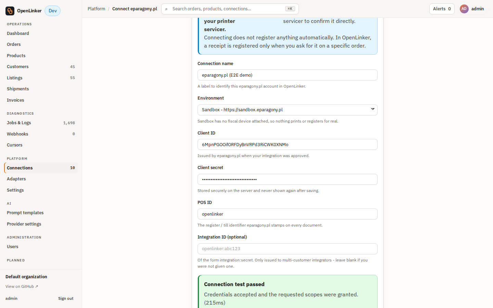
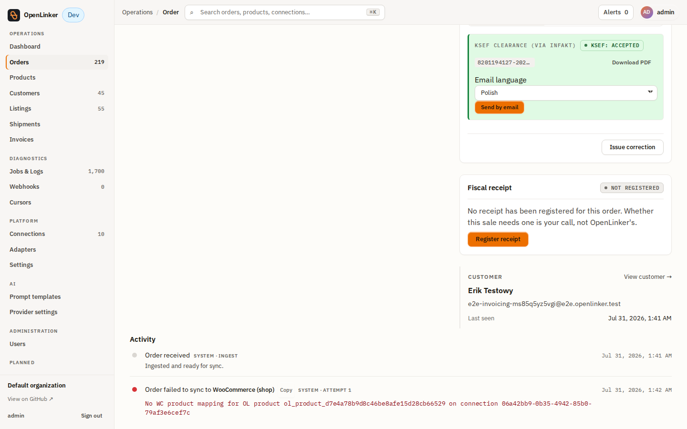
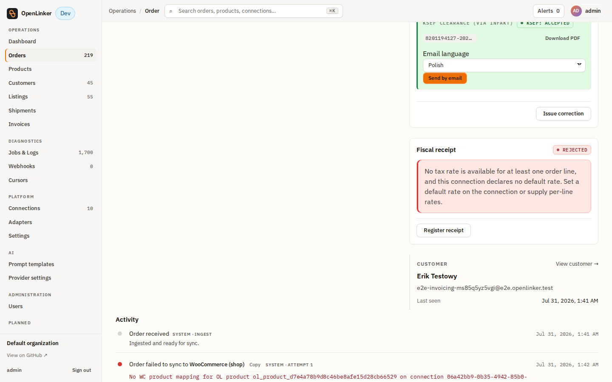
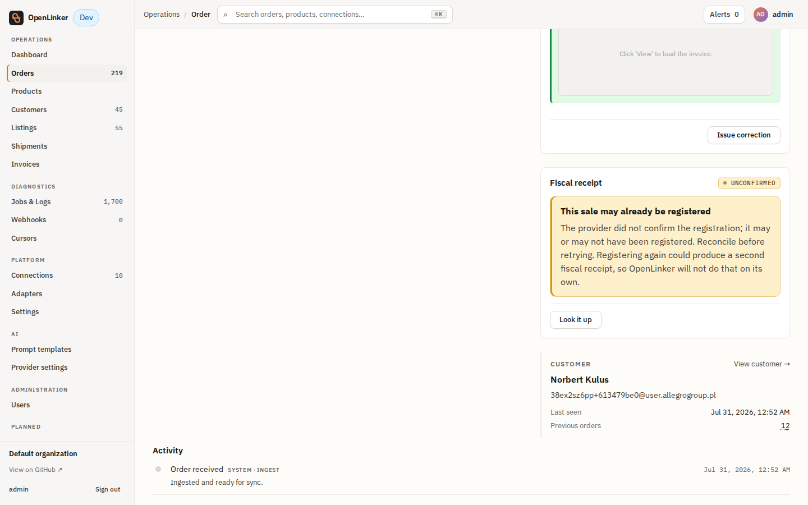
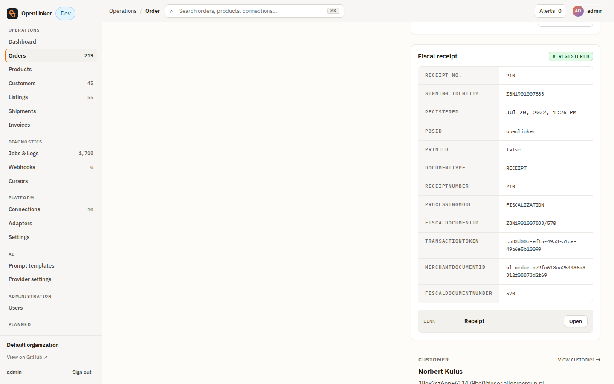

# Manual walkthrough — eparagony.pl

Fiscalization connection — hands a completed order's sale to eparagony.pl, which
registers it as a Polish fiscal e-receipt with the seller's own printer. First (and
so far only) adapter against `FiscalizationPort` — see ADR-042.

**Connection**: `eparagony.pl (E2E demo)` — id `6727a9ee-2d0d-4aaf-bb0c-23fbd69f416c`
**Config**: environment `sandbox`, `posId` `openlinker`, `defaultTaxRateCode` `A` (added
mid-session — see Part C).

Run live against `sandbox.eparagony.pl` (real network, real credentials, no mocks) on
2026-08-17, both from a standalone Node script driving the adapter directly and through
the actual OpenLinker UI on a demo stack running this epic's code.

## Part A — Direct adapter verification (pre-UI)

Before wiring the UI, the adapter was run directly against the sandbox to prove the
wire contract, independent of any FE/BE plumbing.

> **Finding 1 (real bug, fixed):** the first attempt crashed with `Cannot read
> properties of undefined (reading 'trim')` in `toProductLine`. The optional-SKU guard
> checked `line.sku !== null`, which is `true` for `undefined` — and the declared
> command shape never permits `undefined` through a well-typed caller, but a
> hand-built or serialization-crossing caller can still produce it. Fixed to
> `typeof line.sku === 'string'`.

> **Finding 2 (real bug, fixed — the important one):** every registration attempt
> failed with `400` before reaching the fiscal path at all. The `Idempotency-Key` HTTP
> header carried core's raw key (`fiscal:{connectionId}:{orderId}`) verbatim; the
> vendor requires `/^[0-9A-Za-z_-]+$/` and colons fail it outright. Fixed by sending
> the already-derived `documentToken` (a deterministic UUID-shaped hash of the same
> `(connectionId, idempotencyKey)` pair) instead — same safety property, vendor-legal
> characters.

After both fixes: token exchange succeeded, the vendor accepted the composed
document, `register()` hit its poll deadline and correctly classified the outcome
`in-doubt` (never `rejected`), and a subsequent `locateByQuery()` resolved the SAME
registration with real data — receipt number `210`, signing identity
`ZBN1901007833`, and a `link` artefact to the hosted receipt. This is the full
register → in-doubt → reconcile lifecycle working end to end against the live vendor.

**This revises an earlier documented finding** (spec #1902 §3 / #2010): "the sandbox
has no attached fiscal device" is not quite right — the device does confirm, just
later than this adapter's poll deadline. That is `in-doubt` working as designed, not
a gap.

## Part B — Connect eparagony.pl in OpenLinker

- [x] Go to **Connections → New connection**, confirm the eparagony.pl card is listed
      with the **Fiscalization** badge

- [x] Open the guided form, confirm the preconditions panel and every field

> **Finding (real bug, fixed — found by screenshot review):** the preconditions list
> originally rendered as a broken multi-column table. `.check-list li` is
> `display: flex; justify-content: space-between`, built for exactly two children (a
> description plus a trailing badge, matching how `.activity-list__item` is used
> elsewhere) — the markup instead put four separate inline nodes directly as children
> with no wrapper, so flexbox spread each one into its own column. Fixed by wrapping
> each item's description in one `` and using a `StatusBadge` as the trailing
> element. The copy was also rewritten: it originally repeated "OpenLinker cannot check
> this" / "would be misleading" per item, reading as a disclaimer about inadequate
> testing rather than calm setup guidance. Replaced with short "Your equipment" / "Ask
> your servicer" badges and one plain closing sentence about what Test connection
> actually covers — same honesty, none of the alarm. The screenshot above is the
> corrected version.

- [x] Fill in real sandbox credentials (`clientId`, `clientSecret`, `posId`)

- [x] Click **Connect eparagony.pl** — confirm the "Connection created" toast and the
      connections count incrementing

- [x] Click **Test connection** — confirm a real pass against the live sandbox

This round-trips the real `EparagonyConnectionTesterAdapter` against
`login.sandbox.eparagony.pl` — not a stub.

## Part C — Register a receipt for an order

- [x] Open an order's detail page — confirm the **Fiscal receipt** panel renders,
      starting **Not registered**, with copy that never asserts the order needs one

- [x] Click **Register receipt** on a EUR-priced demo order with no `taxRates`/
      `defaultTaxRateCode` configured

> **Finding (not a bug — the composition guard doing its job):** `toRegisterTransactionCommand`
> refused the order before anything reached the provider, because the line's tax rate
> could not be resolved and the connection declared no default. Confirms ADR-042
> decision 8's negative half live: OpenLinker never guesses a rate. Fixed the specific
> demo order's device-mismatch by setting `defaultTaxRateCode: "A"` on the connection.

- [x] Retry on a **PLN**-priced order after setting `defaultTaxRateCode` — confirm the
      request is now accepted by the vendor and the outcome resolves to **Unconfirmed**
      within the poll budget

Server log for this attempt: `eparagony.pl accepted the document for order
ol_order_a79fe613aa264436a3312f08873d2f69 as 9c1e8741-ba1e-4c53-b95b-fb24f14d646a` —
the vendor genuinely created the document; the poll budget simply ran out first, which
Part A already established is expected sandbox behaviour.

- [x] Click **Look it up** again after the device has had more time, and confirm it
      resolves to **Registered** with a real receipt number and signing identity

Resolved on a later `POST /fiscal-registrations/:id/reconcile` call (same order, several
hours after the original attempt): `outcome: "resolved"`, `status: "registered"`,
`documentReference: "210"`, `signingIdentity: "ZBN1901007833"`, plus every
`regimeExtras` field the vendor reported (`fiscalDocumentId`, `fiscalDocumentNumber`,
`processingMode`, `posId`, `merchantDocumentId`) and a working `link` artefact.

This confirms Part A's finding was not an isolated adapter-level result: the identical
`in-doubt → locateByQuery → registered` lifecycle resolves correctly through the real
HTTP surface and renders correctly in the real UI, with the two legally required
identifiers (§3 ust. 4) both present and copyable.

## Findings summary

| # | Finding | Severity | Status |
|---|---|---|---|
| 1 | `toProductLine` SKU guard crashes on `undefined` | Real bug | Fixed |
| 2 | `Idempotency-Key` header sent raw core key with colons, rejected by every call | Real bug, blocking | Fixed |
| 3 | Sandbox device confirms later than the adapter's poll deadline | Documentation correction, not a bug | `in-doubt` handles it correctly by design; confirmed resolving to `registered` |
| 4 | An order can carry both an invoice and a fiscal receipt today, with nothing enforcing "one sales document" across the two capabilities | Known, out-of-scope gap | ADR-041 / #2051 (sales-documents routing), deliberately sequenced after this epic |
| 5 | Preconditions panel rendered as a broken multi-column table; copy read as an alarming testing disclaimer | Real bug + tone issue, found by screenshot review | Fixed |
