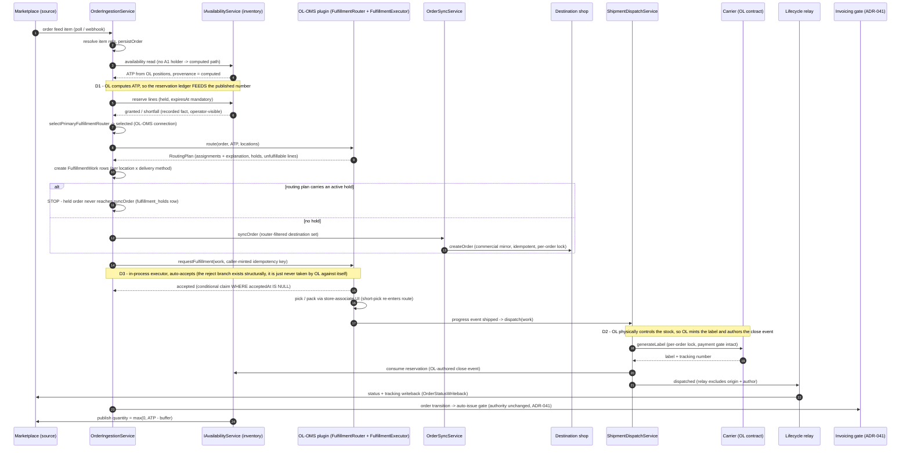
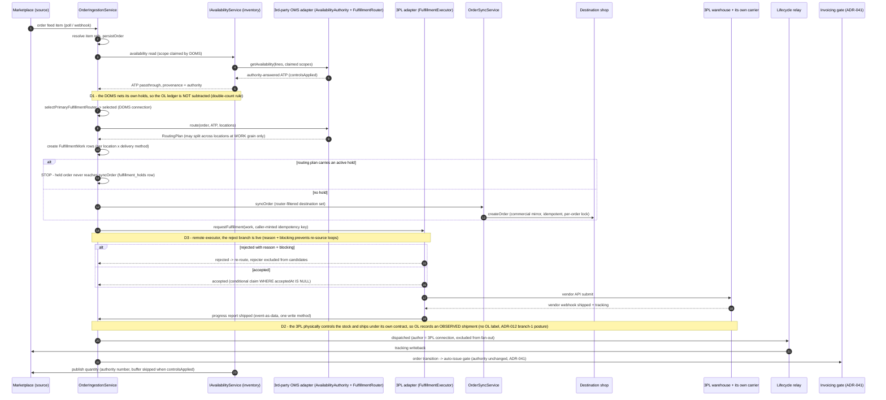
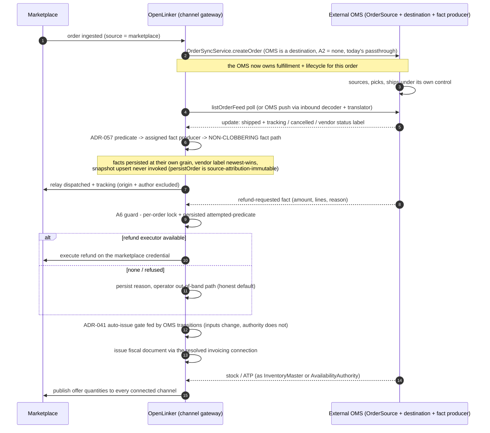

# DESIGN — A full OMS for OpenLinker, as a plugin, behind independently assignable authorities

**Status**: Design document (brainstorm output, not scheduled work — it lives under `analysis/` for
the same reason ANALYSIS-1032 does). Produced 2026-08-21 by a multi-agent design session: vendor
research (Shopify, Fluent, Sterling, Kibo, commercetools, Brightpearl, Linnworks, BaseLinker, Amazon
MCF), codebase grounding, five parallel domain designs, orchestrator adjudication, adversarial
review.

**Revision R1 (2026-08-21)**: amended after a five-panel specialist review (hexagonal
conformance, distributed correctness, product value, plugin contracts, delivery risk) — the full
adjudication record is [REVIEW-oms-authority-model.md](./REVIEW-oms-authority-model.md). §10 is
the revised, demand-gated roadmap; §14 reflects the panel's story additions and cuts.

**Revision R2 (2026-08-23, #2298)**: freshness pass only — no architectural change. R1 was written
while #2161 was an open PR; it has since merged, shipping ADR-041's router, its rule engine and
its persistence as real code. A7's matrix row, §2.1, §5.3(c), §8, §10's automation-layer spec and
ADRs 052/054/056 now describe that code as shipped rather than proposed, and §5.3(c) carries a
storage-shape **recommendation** (rows over `Connection.config.routing` jsonb) whose flagged ADR
amendment sits in ADR-054, pending adjudication. The authority matrix is unchanged: #2161
implements A7's "already specified" cell.

**The ask**: OpenLinker gets a state-of-the-art full OMS — multi-location inventory + ATP,
sourcing/routing + fulfillment execution, an OL-owned order lifecycle, returns/RMA — implemented as
a **first-party plugin** behind neutral capability ports, so that a **third-party OMS** can plug
into the exact same ports. Both integration postures must be supported: OL-as-orchestrator and
OL-as-channel-gateway, with an explicit answer to "can one build serve both?".

**Prior art this design is answerable to**: `ANALYSIS-1032-oms-module.md` (eight adversarial stress
tests, eight disqualifying findings; the "actions yes, states no" plugin-extensibility boundary),
ADR-043 (order lifecycle — Proposed and reverted), ADR-044 (proposed-then-confirmed order
mutations), ADR-012/020/027/028 (fulfillment axes), ADR-041/042 + #2047 (the shipped exactly-one-
authority pattern), ADR-010 (variant-keyed inventory), ADR-017 (cross-origin re-ingestion guard),
ADR-003 (plugin trust model). Nothing here re-proposes what those killed without addressing the
kill in place.

---

## 1. Executive summary

**"OMS" is not one capability — it is a bundle of authorities.** The design's keystone is an
**authority matrix**: six independently assignable, *physically scoped* decision rights
(availability/ATP, sourcing/routing, fulfillment execution, order lifecycle, returns disposition,
refund trigger), each with its own scope axis, holder candidates, zero-config default equal to
today's shipped behaviour, conflict rule, and enforcement mechanism. "Who owns the order?" is never
asked — that question has no good answer, and every vendor precedent that works (Shopify's
fulfillment-service model) works precisely because it splits authority along *what a party
physically controls* (a location, a channel obligation, a payment instrument) instead.

**OL's own OMS is `@openlinker/oms`** — a full `AdapterPlugin` with a real,
credential-less `Connection` row (`platformType: 'openlinker'`), registered through the same
`AdapterRegistry`, resolved through the same `getCapabilityAdapter`, shipping its own migrations
like Allegro's plugin does. No privileged path in core. A Fluent/Linnworks/3PL adapter implements
the same ports for the subset of authorities its archetype takes.

**The dual-posture verdict** (the explicit user question): **one build serves both postures — but
asymmetrically, and the asymmetry is the honest answer.** Roughly 55% of the build is the shared
authority/contract layer, ~40% is posture-A-only (the OL-OMS plugin, `FulfillmentWork`,
routing/execution), and posture B costs ~5% — because `OrderIngestionService` already *is* a
gateway pipeline: an external OMS that owns orders is very nearly just another `OrderSource` plus a
lifecycle-fact-producer seam and a one-predicate amendment to ADR-017. Posture A and posture B ship
as two named **presets** over the same assignment matrix ("Orchestrator" / "Gateway"), never as two
builds or a mode switch. The four breakage modes the vendor research documented for symmetric
dual-posture contracts each dissolve under this model (§8).

**The four domains** are designed in §§4–7, each cleared against its own graveyard:

- **Inventory/ATP**: first-class `inventory_locations`, provenance on `inventory_items` (retiring
  the #1904 withhold guard for inventory), an OL-owned reservation ledger with neutral
  *advisory/time-boxed* semantics and adapter-declared fidelity, and an `AvailabilityAuthority`
  capability whose degenerate default is byte-identical to today's `masterStock − buffer`.
- **Routing/execution**: `FulfillmentWork` as the unit of assignment (splits live here — the
  ADR-044 identifier-mapping bijection *forbids* order splits), a dry-run-first router with an
  operator-facing explanation, a request/accept/reject executor handshake, and a degenerate path
  that leaves the `omp_fulfilled` majority byte-identical — the property that survives the kill
  that took Wave 5.
- **Lifecycle**: the derived projection **wins again** — but ADR-043's central revert finding has
  *expired*: holds and in-flight amendments are facts no existing column can express. The design
  persists the new **facts** (never a canonical state) and grows the derivation from 2 to 6 inputs,
  with the full vocabulary ADR-043's revert demanded.
- **Returns**: an OL-owned aggregate *above* the Wave-4 source projection (kept as a layer), two
  orthogonal per-line machines (custody × money), disposition limited to what has an executing
  consequence, and restock written **to the inventory master**, never into OL's mirror.

§3 records the orchestrator's cross-section adjudications; §10 is the unified roadmap; §11 the ADR
suite (nine ADRs, provisional numbers 052–060); §13 the end-to-end process flows (sequence
diagrams per posture); §14 the consolidated supported-user-story catalogue.

---

## 2. The authority matrix

An *authority* is the right to make one class of decision binding on everyone else. Enforcement
reuses the four separable parts of the shipped #2047 shape:
**(1)** pure selection function (`selected | none | ambiguous`, ambiguity does **nothing**);
**(2)** untrusted-config coercion on `Connection.config` jsonb (no migration);
**(3)** write-path guard (persisted-state predicate + `SyncLockPort` lock on the contended key);
**(4)** gate-reports / caller-persists (`…BlockOutcome: none | blocked | indeterminate`).

| # | Authority | Scope axis | Holder candidates | Default when unassigned (= today, zero-config) | Conflict rule | Enforcement |
|---|---|---|---|---|---|---|
| A1 | **Availability / ATP** | per **location**; publication per **channel** | OL computed path (default), external OMS/WMS, 3PL per location | The computed path: `masterStock − stockSafetyBuffer`, whole catalogue, byte-identical | Locations partition; two claimants on one location → that location contributes **unknown** (reported), never silently summed | (1)+(2); read authority, no write guard |
| A2 | **Sourcing / routing** | per **order**, configured per **channel** | OL-OMS plugin, external DOMS, `none` | **`none`** — today's all-destinations fan-out runs untouched | Exactly one router per order; `ambiguous` → no routing, reason persisted, today's path runs | (1)+(4), per-order |
| A3 | **Fulfillment execution** | per **`FulfillmentWork`** (dynamic) | OL-OMS, 3PL adapter, the destination shop (today) | Today's destination create + shipping dispatch; no work objects minted | One holder per work object, granted by **handshake**, rejection re-enters routing | (3) — conditional claim, the `claimWaybillRelay` shape |
| A4 | **Order lifecycle** | per **order**, by fact class | OL derives (default); external OMS as **fact producer** | OL derives from its own persisted facts | Facts are recorded at their own grain with their producer; conflicting facts are **both kept**, the projection resolves by precedence, disagreement is displayed | (4) only |
| A5 | **Returns disposition** | per **return**, configured per **channel** | OL-OMS, external OMS, the marketplace itself (Allegro decides, OL records) | OL's own `ReturnDispositionService` (once returns exist; today: none) | One per return; a second enabled `ReturnsAuthority` connection is `ambiguous` → no automated disposition, reason persisted on the return and surfaced — inert, per the matrix rule (R1: boot-failure clause retired) | (1)+(4) |
| A6 | **Refund trigger** | per **payment instrument** = per source connection | **OL only** | OL, manual | **Never assignable away** — the OMS *requests*, OL executes or refuses with a persisted reason | (3) — per-order lock + attempted-predicate, the `blocksIssuanceElsewhere` shape |
| A7 | **Invoicing / fiscalization** | per order, one originating document | ADR-041's resolved connection | Shipped and unchanged by this design (#2161): the rule engine (`evaluateSalesDocumentRules`) first, `resolveSalesDocumentRouting` — carrying #2047's single-candidate/operator-primary rules — as the fallback | Already specified | (1)(2)(3)(4) — the source of the shape |

Three properties are load-bearing:

- **Scope is physical control, never ownership.** A6 is scoped to the payment instrument because
  only the credential holder *can* refund; A3 to the work object because only the party with stock
  in hand *can* ship. This is what makes A6's non-assignability a statement of fact rather than a
  product restriction, and it is what dissolves the orphaned-refund problem in posture B (§8).
- **Every default is the current shipped behaviour, reachable with zero config.** The #2047
  single-candidate rule generalised: an operator who never heard of the OMS is unaffected. Any
  authority whose default required config would be disqualified on that ground alone.
- **Ambiguity is always inert and reported, never resolved arbitrarily.** An unrouted order is
  recoverable by hand; two shipments of one order are not. Unreported ATP undersells;
  double-counted ATP oversells. Inert-plus-reported, every row.

### 2.1 The resolution layer

One **dependency-free vocabulary leaf**, `libs/core/src/fulfillment-authority/` — types and pure
functions only, no module/service/repository/port/tokens file *at the outset* (the posture
`sales-documents` established in #2100 and outgrew in #2170: the load-bearing property is **zero
sibling-context value edges**, not framework-freedom — see ADR-053), pinned by the barrel-purity
spec. It publishes `AuthorityKind`, `AuthorityScope` (discriminated
union: global / location / channel / order / work), `AuthorityAssignment`, the generic
`selectAuthorityHolder()` (the pure generalisation of `selectPrimaryInvoicingConnection`, including
its single-candidate rule — a rule the shipped `resolveSalesDocumentRouting` already mirrors
verbatim, so the generalisation has two consumers to keep honest, not one), `parseAuthorityConfig()`,
and `FulfillmentAuthorityBlockOutcome` with its reason unions.

**Resolution lives where the write lives** — A1 in `inventory`, A2/A3 in the new `fulfillment`
context, A4 in the projection itself, A5 in `returns`, A6 in `orders`. A single `oms-policy`
context that resolves everything is rejected: ADR-041's router is a module above two contexts only
because *neither may own the question*; here each authority has exactly one owning context, and
centralising would recreate the DI-cycle shape that forced `AutoIssueTriggerService` into
gate-reports/caller-persists. Sharing the vocabulary and the pure selection function buys all the
consistency at none of the graph cost.

**Per-order resolution is mandatory.** Real sellers split by channel (marketplace orders → OL-OMS;
B2B → the incumbent OMS), so A2/A5 configuration hangs on the **source connection** and resolution
runs per order — ADR-041's exact shape, reusing its persistence discipline (level-triggered write,
`none` clears, `indeterminate` leaves the prior value, columns omitted from `toOrm`).

### 2.2 Config vs handshake

**An authority is static config when its scope exists before any order does; it is a dynamic
handshake when its scope is an object the flow itself creates.** A1/A2/A5/A6/A7 are config
(`Connection.config.*`, coerced, #2047 part 2). A3 is handshake — a `FulfillmentWork` does not
exist until routing mints it; config only supplies the candidate set. The handshake is Shopify's
fulfillment-service grant and simultaneously ADR-044's proposed-then-confirmed shape: mint in
`proposed` → holder **accepts** (conditional claim, `WHERE acceptedAt IS NULL`) or **rejects** with
`{reason, blocking}` → on rejection/timeout re-route excluding the rejecter → exhausted candidates
leave the work `unassigned` and reported, never auto-fulfilled by OL (that would be OL taking an
authority it was not granted).

**Revocation is prospective-only.** Clearing a config flag changes the next resolution, never
in-flight objects; taking back in-flight work requires cancelling the specific work object — a
negotiation where the holder is reachable, or an audited operator **force-close to `cancelled`**
with reason `operator_forced` (a member of the declared status union; never `closed`-as-completed).
A disabled holder connection cannot be resolved for negotiation at all (`getCapabilityAdapter` is
active-only), so force-close is the stated exit for that case; the work itself resolves
`indeterminate`, not `none` — the #2100 lesson that clearing a reason on a transient error is
worse than keeping a stale one.

---

## 3. Cross-section adjudications (orchestrator rulings)

The five domain designs were produced in parallel against a shared provisional frame. Where they
diverged, these rulings apply throughout this document:

1. **Reservations are inventory-owned and order-keyed; routing assignment never reserves — and
   `olReserved` feeds published ATP only where OL itself executes fulfillment.** §5 (routing)
   upheld the Wave-5 kill by refusing to couple assignment to reservations; §4 (inventory) wanted
   routing-commit as the trigger. Ruling: the reservation ledger is created when the order is
   ingested (v2: against the single live position; v3: re-pointed using the routing plan's location
   as an *input*, with the write staying in `inventory`), closed on OL's own dispatch/consume,
   released on cancel, expired by a mandatory sweep. **The publish-path subtraction is scoped**: a
   reservation is subtracted from published ATP only for orders whose fulfillment OL executes
   (OL-OMS work; OL-managed-carrier dispatch) — the paths where OL authors the close event
   first-hand. On marketplace-/shop-fulfilled orders (`omp_fulfilled`, the default) the master
   itself decrements for the same sale and **no per-order close event is observable at all** (an
   order with no `OrderProcessorManager` destination never acquires a `syncStatus[]` entry, so the
   branch-1 `fulfillmentState` rollup never fires) — subtracting there would re-import Wave 5's
   double-subtraction kill verbatim, so those reservations are recorded as **diagnostic facts**
   (shortfall visibility, operator surfacing) and never feed the published number. The residual
   double-count window on OL-executed paths (OL's consume vs the master mirroring its own
   decrement) is bounded by the master sync interval, exactly as ANALYSIS-1032 §6I documented.
   Observation-only `FulfillmentWork` on `omp_fulfilled` closes on whole-order observed dispatch
   where a destination exists, else stays open until its order terminates — acceptable precisely
   because nothing (no ATP, no stock number) depends on that close.
2. **One location identity: the `inventory_locations` table.** Routing's `FulfillmentLocation` is a
   projection over it (plus, transitionally, destination connections surfaced as locations with
   `ownerConnectionId` set). Locations are rows, not jsonb — per-location authority partitioning
   must not degrade to string comparison in config.
3. **Authority assignment is config, not a table, in v1.** §4's `inventory_authority_assignments`
   table (DB-enforced at-most-one per scope) is deferred; the #2047 precedent deliberately chose
   config + pure selection + inert ambiguity over a unique index. The table is the named escalation
   path if config-level disjointness proves too weak in practice.
4. **One hold-reason vocabulary, two hold grains.** §5 and §6 each invented a reason union; merged:
   `['payment-review','fraud-review','operator','stock-shortfall','address-invalid',
   'awaiting-amendment','awaiting-customer-confirmation','external']`, living in the
   `order-lifecycle` leaf, used by both `order_holds` and `fulfillment_holds`. A held work item
   does **not** implicitly hold the order, and releasing a work hold never releases an order hold.
5. **"Fact ledger" corrected.** The keystone section assumed lifecycle facts live in one append-only
   ledger; the lifecycle section's actual (and better) model is facts persisted **at their own
   grain** (a hold row, a proposal row, a work row) + a derived phase. The dual-posture defusal
   survives unchanged: per-grain facts with named producers have no two-writer conflict either.
6. **`FulfillmentWork` lives in core** (`libs/core/src/fulfillment/`), because it crosses the port
   to third-party executors. The OMS plugin owns only its private working state (`oms_*` tables:
   routing-rule rows, pick-list state, wave state later).
7. **Two vocabulary leaves, not one.** `fulfillment-authority` (authority vocabulary) and
   `order-lifecycle` (phase/hold/amendment vocabulary) are separate concerns, each following the
   `sales-documents` leaf pattern — in its post-#2170 reading (ADR-053): what each leaf copies is
   the **zero sibling-context value edge**, not framework-freedom, which `sales-documents` itself
   gave up when the rule engine landed it a module, repositories and a tokens file. Merging them
   would couple two unrelated release cadences.
8. **Returns' restock into an OL-owned book routes through the OMS plugin's own
   `InventoryMaster` `adjustInventory` implementation** — the QC bucket flow
   (`received → quality_control → available`) is deferred with the `inspected` custody state; v1/v2
   restock is a plain positive adjustment.

---

## 4. Domain design — multi-location inventory, reservations, ATP

### 4.1 Model

**`inventory_locations`** (new): `id (ol_location_*)`, `code` (operator-authored, unique), `name`,
`kind ('warehouse'|'store'|'third-party'|'virtual')`, `ownerConnectionId` (nullable —
**provenance**, answering "whose sync may write positions here", deliberately *not* authority),
`externalRef`, `status`. Lives in the existing `inventory` context — a `locations` context would
have no independent lifecycle and would put a cross-context read on every ATP query.
`LocationNetwork` (Fluent's virtual-position scope: "what does this marketplace see") is specified
but deferred to v3.

**`inventory_items` stays the position row**, gaining three columns and keeping both partial unique
indexes (recreated to include provenance):

| column | owner | meaning |
|---|---|---|
| `availableQuantity` / `reservedQuantity` | master sync | unchanged: mirror of the master, net of the master's own reservations |
| `olReservedQuantity` | OL reservation service | denormalised sum of `held` ledger rows; repaired by the reconciler |
| `incomingQuantity` (nullable) | adapter | future stock (commercetools `expectedDelivery` shape); read-only, **never in ATP in v1** |
| `sourceConnectionId` (nullable at first, `'legacy'` sentinel written by every sync) | migration + sync | provenance, added by a **three-step ladder** (R1): (i) additive nullable column, O(1); (ii) sentinel backfill as a **batched job** (`runBoundedSweep`), never a migration; (iii) `SET NOT NULL` + unique-index recreation **deferred** behind a cleanliness check — the repo's single-transaction migration mode makes `CREATE INDEX CONCURRENTLY` unavailable, so a one-shot recreation would hold `ACCESS EXCLUSIVE` on the live oversell table. Until step (iii), the #1904 withhold guard stays in force as the documented fallback. A NULL-distinct nullable column must never enter the unique indexes (silent dedup loss → ATP double-count) — which is also why a **duplicate-position detection pass precedes any recreation**: the *existing* indexes already NULL-dup on `locationId` today, and recreation fails outright on a dirty install. Provenance must also enter the row **lookup** (`findByProductAndVariant`/`getInventory` gain the connection axis), or cross-source syncs clobber each other's rows regardless of the index. |

**`locationId IS NULL` gets a permanent distinct meaning: "the master declines to locate its
stock."** Never "the default location". Same-source NULL+non-NULL coexistence is a contradiction
(enforced in `MasterInventorySyncService`, which stales the NULL row once a source starts locating);
cross-source coexistence is legitimate (PrestaShop reports a pool, a 3PL reports a depot; ATP sums
both) — and is exactly why provenance is mandatory. Migrating NULL rows to a synthetic DEFAULT
location is rejected: it rewrites the unique-index surface on the live oversell path and asserts a
location fact OL does not have.

**Provenance retires the #1904 withhold guard for inventory.** The guard exists because a prune
cannot be attributed; with `sourceConnectionId`, `markStaleExceptVariants` prunes per-source, and
the withhold survives only as the fallback for un-backfilled sentinel-provenance rows. (The
products-side #1904 guard is untouched.)

### 4.2 Reservations — neutral semantics with declared fidelity

The wild holds three incompatible meanings: soft-and-reallocatable (Fluent, Brightpearl),
time-boxed-with-expiry (commercetools), hard-committed-at-placement (Shopify). **OL's neutral
reservation is a ledger-recorded, time-boxed, advisory claim on ATP**: creating one never
decrements `availableQuantity` (OL does not own on-hand); it reduces what OL will *promise* and
asserts nothing about what the fulfiller will physically pick (a short-pick is a recorded fact, not
an invariant violation); `expiresAt` is **mandatory** — an unbounded hold on a system that may
never observe the close event is an oversell leak with no floor.

Adapters declare fidelity via `ReservationBinding = 'advisory' | 'time-boxed' | 'hard-committed'`;
an authority that cannot hold at all simply does not implement the `AvailabilityHolder`
sub-capability — absence of the guard *is* the declaration (no separate flag to disagree with it),
OL then holds in its own ledger only, and the connection UI says so by reading the guard result
(the ADR-046 `resolvedVia` shape). The mechanism is ANALYSIS-1032 §6I **adopted verbatim** —
guarded `UPDATE … WHERE availableQuantity − olReservedQuantity ≥ $q RETURNING`, lines sorted by
`inventoryItemId`, partial-unique idempotency on `(orderRecordId, orderLineId, inventoryItemId)
WHERE status='held'`, the non-negativity `CHECK (olReservedQuantity ≥ 0)` retained (§6I's "hard
floor") while `olReserved ≤ available` deliberately has no `CHECK`, shortfall-is-a-fact surfaced
on the named order, scheduled reconciler, and §6I's multi-position guard carried as a v2 gate: a
reserve **rejects loudly** when a variant resolves to more than one non-stale position, unless an
explicit position is supplied. That SQL survived the stress tests; what was cut was the wave, and
the wave's kill (no close event on `omp_fulfilled`) is answered by adjudication #1's
**scoped subtraction** — reservations on topologies where OL does not execute fulfillment are
diagnostic-only and never feed published ATP.

Three correctness amendments (R1). **(1) The scope is a stamped column, not a cross-context
read**: `atpEffect: 'published' | 'diagnostic'` is written on the reservation row at creation by
the ingestion caller — which holds the routing outcome in hand — so the ATP query is a local
column test, immutable per reservation, and no `inventory ↔ fulfillment` edge exists. **(2)
Reserve is get-or-create, never reject-on-retry**: `ON CONFLICT DO NOTHING` + re-select — an
existing held row for the same `(order, line, position)` is a *success* (the insert-then-recover
idiom `IdentifierMappingService` ships); a differing quantity (the source amended the line) is an
explicit delta-adjust under the same guarded UPDATE. Without this, an ingestion crash after
reserve wedges the order forever behind a false "insufficient stock". **(3) Expiry is
state-dependent**: the sweep *extends* — never releases — a reservation whose order carries an
open hold or accepted/in-progress work, releasing only when no live OL-executed obligation
remains; an expiry firing against accepted work emits a fact and surfaces in needs-attention.
Without this, a fraud-held order's reservation expires by the mandatory-expiry rule, republishes
stock that is still promised, and the later dispatch oversells — silently, with every counter
internally consistent. Consume is likewise a **claim**: `Shipment.reservationConsumedAt`, claimed
conditionally and driven by a sweep over dispatched shipments with a null claim, so a dispatch
retry that short-circuits on the completed shipment cannot lose the consume.

**Double-counting, restated for multi-source**: §6I's answer holds (`availableQuantity` is already
net of the master's own reservations; `reservedQuantity` is subtracted nowhere), plus one new rule:
**OL subtracts its own ledger only for scopes where OL computes ATP itself.** An authority-answered
scope is taken as-is, with OL's ledger rows for that scope reported alongside as
`olHeldNotReflected` for operator diagnosis.

**`InventoryMasterPort.reserveInventory` / `releaseInventory` are deprecated in place, not
retired.** ANALYSIS-1032 §5 already killed outright removal ("inverting a promise the WooCommerce
operator guide makes and shipping a published-contract change with no deprecation cycle …
deprecate in place"), and that ruling stands. They are implemented today only as explicit
NotSupported throws (WooCommerce, PrestaShop) and are uncalled; they gain `@deprecated` docblocks
naming the successor, with removal deferred to a contract-major cycle. The legitimate need —
pushing a hold to a master that models one — returns later as an optional
`MasterReservationWriter` sub-capability, deferred until an adapter exists that can implement it.

### 4.3 The `AvailabilityAuthority` capability

```ts
export interface AvailabilityAuthorityPort {
  // Scope CLAIMS live in Connection.config.availabilityAuthority.scopes, read by the pure
  // parseAuthorityConfig - never a port call, so selection stays pure, lazy-compatible and
  // infallible (R1: getAuthorityScopes() removed for exactly that reason).
  getFreshness(): Promise<AvailabilityFreshness>;   // maxStalenessMs, isTransactional; cacheable
  getAvailability(input: { variantIds: readonly string[]; scope: AvailabilityScope })
    : Promise<readonly AvailabilityAnswer[]>;       // OL chunks to the adapter's declared maxBatchSize
}
// AvailabilityAnswer: { availableToPromise; onHand|null; held|null; incoming|null;
//   controlsApplied: boolean; observedAt } — every decomposition field nullable, null ≠ 0.
```

Sub-capabilities (advertised-without-dispatch, narrowed with guards): `AvailabilityHolder`
(hold/release/consume with mandatory idempotency keys + `getReservationBinding()`) and
`AvailabilityStreamer` (push feed instead of polling). Registry name `AvailabilityAuthority` enters
`CoreCapabilityValues`; **resolution falls back to the computed path when no connection claims a
scope**, which is what keeps existing stamped `enabledCapabilities` connections working (#2085
trap avoided by fallback, not by retro-fill).

Core seam: `IAvailabilityService.getPromisableQuantities(variantIds, scope)` returning the number
**and its provenance** (`'authority' | 'computed' | 'unknown'`, `observedAt`, staleness). Every
publishing site consumes the service, never the port. **`'unknown'` is a first-class outcome the
publish sites must handle explicitly** — it is returned when a claimed scope is `ambiguous` (two
claimants at the same tier) or when its authority errors, and it means **suppress the publish
write and alert** (OL persists no last-published number, so nothing can honestly be re-sent —
R1 restated this from the unimplementable "hold the last number"), bounded by
`OL_AVAILABILITY_UNKNOWN_MAX_HOLD_MS` — past the bound the scope publishes a conservative floor
under a distinct provenance value, so the operator can tell held from floored — and never "fall
back to computed": the fallback exists only for **unclaimed**
scopes, and letting ambiguity or an authority 502 silently reach the computed path would publish a
figure that ignores a declared authority — the silent oversell the inert-ambiguity rule exists to
prevent. Scope overlap is not ambiguity: an exact-scope claimant beats an enclosing `global`
claimant by the resolution order; ambiguity is two claimants at the **same** tier.
In the computed path, the `olReserved` term includes only reservations for OL-executed orders
(§3 adjudication #1). Freshness declaration is contractual because real vendors are
eventually consistent (commercetools documents up to 10 s) — a caller that assumes read-after-write
against a real DOMS is wrong by design.

**The safety buffer is reclassified as a Control, not retired.** Computed path:
`published = max(0, Σ(available − olReserved) − buffer)` — byte-identical to today with an empty
ledger. Authority path: if `controlsApplied === true`, no buffer (double-subtracting a reserve the
DOMS already applied is a silent stock-out); if `false`, the connection's buffer applies as today.

### 4.4 Collision verdicts (per read/write site)

- The four buffer read sites (`InventorySyncService`, `OfferBuilderService`,
  `ProductPublishBuilderService`, `StockAtRiskReadService`): **rewired** to consume
  `IAvailabilityService`; the pure helpers survive; stock-at-risk additionally surfaces shortfall
  rows (promised > available) — the more useful signal.
- `getAvailabilityByVariantIds` (~6 sites): **signature preserved**; already sums across locations;
  gains `availableToPromise`; publishing callers move to it, others keep `totalAvailable`.
- The `locationId !== null` propagation skip: **retired** — the single line that makes
  multi-location invisible to channels. Any position write propagates the *variant*; the handler
  reads aggregate ATP; `locationId` leaves the payload.
- The quantity-derived `inv:{sha256(conn:offer:qty)}` idempotency key: **retired — latent oversell
  bug.** With reservations, a variant legitimately returns to a prior quantity (hold → release),
  and the quantity-derived key would dedup the corrective write against the stale one. Replaced
  with an observation-token key (`inv:{conn}:{offer}:{observedAt}`), the idiom the propagation
  dedupe key already uses.
- Stale-pause quantity-0 collapse (#1689): **preserved** — a stale row is excluded from ATP so ATP
  reaches 0 naturally; the explicit pause remains the lost-event guarantee.
- ADR-028 offer stock-restore: **preserved, repointed to ATP, ordered after reservation release**
  (else the restore publishes a number that ignores the just-freed unit). Not redundant: it
  compensates a channel-side fact (the marketplace decremented and won't restore), the release is
  an OL-side ATP fact.

### 4.5 Phasing

**v1** — locations + provenance + the `IAvailabilityService` seam (computed path only), propagation
-skip retirement, idempotency-key swap. Publishes exactly today's numbers through the new seam.
**v2** — the reservation ledger (single-position; ANALYSIS-1032's "single-location in v1" finding is
**upheld for reservations** and **overturned for the read model** — the finding rested on adapter
behaviour, which v1 exists to change). **v3** — `AvailabilityAuthorityPort` with the OL-OMS plugin
as first implementer, networks, control policies. **v4** — `AvailabilityStreamer`,
`MasterReservationWriter`, date-qualified ATP for `incomingQuantity`.

---

## 5. Domain design — sourcing/routing + fulfillment execution

### 5.1 The premise and the survival property

The hard constraint: **OL cannot split or merge a commercial order** — `identifier_mappings` is a
bijection per connection (ADR-044), so a split child is permanently unmappable on its origin and a
marketplace cancel would leave it live and shippable. Therefore **split the fulfillment work, never
the order** — the Shopify FulfillmentOrder answer, adopted as the only available one.

The survival property (the Wave-5 kill, stated first because it decides shippability): **on an
`omp_fulfilled` install with no router configured, this entire layer is a degenerate pass-through**
— no work objects, no handshake, no holds evaluated, no new job types, no behavioural change to
`OrderSyncService`, `ShipmentDispatchService`, or the relay. The router is opt-in per source
connection; `selectPrimaryFulfillmentRouter → none` means today's code path runs byte-identically,
at the cost of one selection call over an already-loaded capability list. If a router *is* enabled
on an `omp_fulfilled` topology, work objects are **observation-only** — created `open`, closed by
observed whole-order dispatch, never requested to an executor — visibility without claiming a
control OL does not have. And **this layer never feeds published stock** (adjudication #1): the
availability read is an input to a decision; no ATP number moves because of an assignment.

### 5.2 `FulfillmentWork`

An order's line-quantities grouped per (location, delivery method), N per order, with **two
orthogonal state axes** — execution and negotiation — because collapsing them yields the
"cancel is a command" bug; cancelling accepted work is a negotiation:

```ts
FulfillmentWorkStatusValues  = ['open','scheduled','on_hold','in_progress','closed','cancelled','incomplete'];
FulfillmentRequestStatusValues = ['unsubmitted','submitted','accepted','rejected',
  'cancellation_requested','cancellation_accepted','cancellation_rejected'];
```

Lines carry **quantity counters, not statuses** (`totalQuantity`, `fulfilledQuantity`,
`cancelledQuantity` — "3 of 5 shipped" is not a status), constrained by
`CHECK (fulfilledQuantity + cancelledQuantity ≤ totalQuantity)`; every `fulfillment_works` column
has a **named owner and a conditional-UPDATE transition** — the §6.3 house discipline applied to
a five-writer table (R1). Holds are first-class rows
(`fulfillment_holds`, ≤10 active, shared reason vocabulary per adjudication #4). The read model
returns **`supportedActions` with the resource** — the server tells the client what is legal next,
which kills client-side state-machine drift across heterogeneous executors and is the "actions"
half of "actions yes, states no" — and actionable only with an optimistic-concurrency token: an
action against a stale version answers 409 with the refreshed set (R1). Relationship to
`Shipment` is 1:N with the shipment keeping its
identity; `shipment_lines` gains a nullable `fulfillmentWorkId`. **No new `order_records` column
is written by this layer.** Work holds surface at the work grain (the worklist and the order
detail's work panel); the orders-*list* hold chip renders only the order-grain `activeHoldReason`
(§6.3) — one projection, one derivation input, no second contradictory surface. Promoting a
work-hold rollup to an order-list signal is an open question (§12), deliberately not a column.

### 5.3 `FulfillmentRouterPort`

```ts
export interface FulfillmentRouterPort {
  evaluate(input: RoutingInput): Promise<RoutingEvaluation>;  // non-committing: candidates + suggestions + explanation
  route(input: RoutingInput): Promise<RoutingPlan>;           // committing
}
// RoutingPlan: { decisionId; assignments[]; unfulfillable[]; holds[]; explanation: RoutingExplanationStep[] }
```

Three deliberate properties. **(a) The return type can say "no"** — `unfulfillable` lines (Kibo's
`stateChangeSuggestions`) resolve as line-scoped refund/return, never an invented partial-cancel
state no source can express. **(b) Dry-run is first-class and is OL's differentiator** — ADR-044
records that nothing planned produces a dry-run; `evaluate()` closes that, and
`RoutingExplanationStep[]` (filter name, eliminations, sort scores) is the "why did this order go
here" answer commercial DOMSes rarely show. It never mints an internal id (operates on ingested
orders only). **(c) Rules are a closed set of named filters + sorts, not a rules engine** —
`method-capable`, `in-stock`, `country-served`, `not-blocked-by-reject`; sorts `priority`,
`nearest`, `most-complete`, `least-splits`; sequenced by an operator-authored ordered list (storage
shape: see the rule-engine precedent below), with `afterAction:
line-split | quantity-split | no-split` declared on the rule. **The named filters/sorts and
their coercer are owned by `@openlinker/oms`** — they configure OL's own router and
bind no vendor; core keeps only what crosses the port (`RoutingInput`, `RoutingPlan`,
`RoutingExplanationStep`, whose rule names are opaque strings with display labels so a vendor's
own names render). `RoutingPlan` carries a third arm, `pending {decisionId}`, for genuinely
asynchronous DOMS sourcing (R1). ANALYSIS-1032 cut Wave 3's *routing* rules
engine on evidence; filters+sorts is the smaller true shape — a cut about
routing's decision vocabulary, not about rule layers in general, which is why the shipped
sales-document engine below is precedent for the *mechanics* without reopening it.

**The house pattern for an operator-authored rule layer now exists in shipped code, and this
design mirrors it (#2161/#2170).** The `sales-documents` rule engine is the repo's one worked
example of exactly this problem: a **closed** condition vocabulary
(`SalesDocumentConditionFieldValues`, a discriminated union per field, no arbitrary predicates and
no country literals), a **pure evaluator** with the caller loading every fact it needs
(`evaluateSalesDocumentRules` — no I/O, `now` passed in, ambiguity resolving `unresolved` rather
than to a silent winner, and *no priority field*, so two rules matching one order is a reported
conflict and not a coin flip), **rows in dedicated tables** (`sales_document_rules` +
`sales_document_thresholds` + `sales_document_country_defaults`), and a **FE composer dialog**
(`SalesDocumentRuleComposerDialog`) over that shape. Routing's filters+sorts should copy all four —
closed vocabulary, pure evaluator, rows, composer — and `RoutingExplanationStep` is the routing
counterpart of the engine's reported `unresolved` reason.

**RECOMMENDATION (adopt/differ, pending adjudication) — storage shape: rows, not
`Connection.config.routing` jsonb; in the plugin's own table, not core.** The design previously argued jsonb from the `stockSafetyBuffer` precedent
(#1844); the newer precedent is the closer analogue and supersedes it, because `stockSafetyBuffer`
is a single scalar while a routing ruleset is an ordered, individually-addressable, individually-
dated collection. Three reasons decide it. (1) **Rule identity has to be citable.** The
`routing_decisions` intent row and its `RoutingExplanationStep[]` persist *why* an order went where
it did; an array inside a config blob has no stable id, so an explanation written today becomes
unreadable the moment the operator reorders or edits the list — `sales_document_rules` carries a
uuid PK for precisely this. (2) **Effective dating and conflict detection are already solved
once.** #2170 ships per-row `effectiveFrom`/`effectiveTo` filtering and an application-computed
`conditionsHash` behind a unique index; `Connection.config` jsonb has neither history nor any
uniqueness surface to guard a duplicate rule with. (3) **This changes placement, not ownership.**
Adjudication #6 already assigns the plugin's private working state to `oms_*` tables, so the table
is `oms_routing_rules` in `@openlinker/oms` — H7's ruling that the named filters/sorts and their
coercer leave core survives intact, and core still keeps only `RoutingInput` / `RoutingPlan` /
`RoutingExplanationStep`. The coercer does not disappear: it moves from parsing a config blob to
narrowing an untrusted persisted `conditions` column, which is what
`isSalesDocumentCondition` does today.

*This is a **recommendation pending orchestrator adjudication**, not an applied change*: it
touches ADR-054's reversal
gate, and the flagged amendment paragraph lives there. Nothing binds until Wave 3's demand gate
fires (§10).

**Exactly one router per order** — the #2047 four-part copy, verbatim shape: pure
`selectPrimaryFulfillmentRouter` (`none` = run today's path; `ambiguous` does nothing and persists
a reason); a `routing_decisions` **intent row persisted before the committing `route()`** (partial-unique
on the live decision — the #2047 persist-intent-before-the-boundary ordering the lock alone
cannot supply, R1); a write-path guard that reads the intent row and refuses when a live decision
or non-cancelled work exists for the order **regardless of router identity**; a mandatory route
idempotency key derived from the decision row, a declared `route()` timeout below the lock TTL,
and the N work rows created in **one transaction** with the decision's terminalisation; per-order
lock (`fulfillment:route:{orderId}`); gate-reports /
caller-persists (`OrderIngestionService` writes the outcome — the one-way edge that keeps
`fulfillment → orders` from becoming a DI cycle, with reason unions in the leaf).

### 5.4 `FulfillmentExecutorPort` and progress

```ts
export interface FulfillmentExecutorPort {
  requestFulfillment(req: FulfillmentRequest): Promise<FulfillmentRequestResult>;   // accepted | rejected{reason, blocking}
  requestCancellation(req: FulfillmentCancellationRequest): Promise<FulfillmentRequestResult>;
}
// Progress INGESTION is core-side (R1) - see below. The executor-side read for polling vendors:
export interface FulfillmentStatusSource {                                           // sub-capability, is* guard co-located
  getFulfillmentStatus(workRef: FulfillmentWorkRef): Promise<FulfillmentProgressSnapshot>;
}
// Core-side seam (not an adapter method): IFulfillmentProgressService.record(event)
//   event: picked | short_picked | packed | shipped | closed  (+ mandatory vendor-scoped idempotencyKey)
```

`blocking` on rejection excludes the rejecter from re-sourcing — without it, re-source plus a
deterministic sort is an infinite loop by construction. `FulfillmentRequest.idempotencyKey` is
mandatory and caller-minted: `work:{workId}:{assignmentAttempt}`, where `assignmentAttempt` is a
**persisted, monotonic counter on the work row, incremented only by a router-driven re-request
and written before the outbound call** — never the job-runner attempt, which changes on exactly
the retries the key must survive (R1; the Amazon MCF `sellerFulfillmentOrderId` model).
Progress is **event-as-data with one write-shaped seam — and the seam is core-side, because
progress is inbound** (R1: the panel found the original adapter-method shape pointed the wrong
way, and the transport did not exist). `IFulfillmentProgressService.record(event)` is the single
ingestion point. A vendor webhook reaches it through the shipped ingress: decoder → translator →
`CanonicalInboundEvent` — whose closed `domain` union gains a `'fulfillment'` member (and
`'return'` for §7) — → a routing-policy arm gated on `FulfillmentExecutor` → a
`fulfillment.work.statusSync` job (webhook-as-trigger, authoritative pull, keyed by the
documented inbound idempotency shape). A polling vendor is served by the pull-shaped
`FulfillmentStatusSource.getFulfillmentStatus(workRef)` sub-capability instead.
`FulfillmentProgressEvent.idempotencyKey` is mandatory and vendor-scoped, deduped by a
`(workId, key)` claim before any relay fires, with `dispatchRelayedAt` as the relay's own claim
column. New events are union members; outcomes live in results; adapters are never widened.
`short_picked` with `releaseShortfall` closes the work `incomplete` for the shortfall and
re-enters `route()` with the rejecter blocked — gated on the order carrying no `cancelledAt`,
under the routing lock; the commercial order is untouched throughout. `awaiting_wave`
is deliberately absent from v1 (waving needs a claim/release entity — the ADR-045 `packGrain`
lesson); it is the named first extension point.

Three implementer shapes, one port: a 3PL adapter (API submit + webhook progress), the OL-OMS
plugin (auto-accept + pick-list UI; progress from the store-associate surface), an enterprise DOMS
(3PL shape with a richer reject vocabulary). Nothing in core knows which.

### 5.5 Reconciliation with the existing stack

- **Intercept** at `order-ingestion.service.ts` between `persistOrder` and `syncOrder`: `none` →
  today's path; `ambiguous` → persist reason, today's path; `selected` → `route()` → create work →
  **a held order does not reach `syncOrder`** (a hold that still mirrors the order into the shop is
  not a hold). `OrderSyncService` is **retained, not reinterpreted**: destination-mirror creation
  is a commercial/catalogue act distinct from fulfillment assignment; under a router the fan-out
  becomes router-filtered via an optional `destinationConnectionIds` on `OrderSyncRequest`
  (defaulting to today's behaviour). A filtered-out destination gets no `syncStatus[]` entry by
  design, which means the branch-1 status-sync/`fulfillmentState` path never fires for it — that
  is acceptable *only because* nothing load-bearing depends on it for routed orders: their
  `fulfillmentState` is fed by work-progress-derived shipments (a 3PL `shipped` event or
  OL-executed dispatch, both through `ShipmentDispatchService` and the fulfillment projection),
  and the reservation publish-subtraction never depends on `fulfillmentState` at all
  (§3 adjudication #1).
- **The shipping-layer `IFulfillmentRoutingService` / `FULFILLMENT_PROCESSOR_KIND` stays,
  unchanged, below this layer.** Order-layer *sourcing* ("which location/party fulfils which
  lines") vs shipping-layer *dispatch resolution* ("by what mechanic does a label get made") are
  different questions at different grains; subsuming would re-decide ADR-012 to gain a name. A work
  object may carry a *preferred* processor hint; `resolve()` remains authoritative.
- **`ShipmentDispatchService` keeps its single-entry-point claim** — the OMS mints no shipments; a
  `shipped` progress event on OL-executed work calls `IShipmentDispatchService.dispatch(...)` with
  its lock and payment gate intact. A 3PL shipping under its own contract produces an *observed*
  shipment (the ADR-012 branch-1 posture), never a fabricated `providerShipmentId`.
- **The relay double-write hazard is closed** by excluding the origin **and the event's author**:
  `OrderLifecycleRelayInput` gains optional `authoredByConnectionId` (absent ⇒ today's exclusion
  set). Without it, a `dispatched` relay would tell the 3PL that just shipped the parcel that the
  parcel shipped.

---

## 6. Domain design — order lifecycle

### 6.1 The ADR-043 confrontation

**The derived projection wins; the fact ledger stays dead.** Referencing the revert's findings by
content (its own numbering differs — do not cite by number): the **materialised-column objection**
is upheld permanently (six inputs written by five contexts is an invalidation surface, and the
`CASE`+ordinal pattern has shipped three times), and the **relationship-to-existing-vocabularies
objection** is answered rather than dropped — `OrderHealth` stays the sync-health partition (the
phase is a second, orthogonal partition over a different question), and the phase's relation to
`OrderStatus` / `order_state_mappings` is stated explicitly in §6.2, which ADR-043 named as a
precondition of leaving Proposed. The **pure-function claim has expired**: "canonicalState reduces
to a pure function of `fulfillmentState` and `cancelledAt`" was true of the system as it stood and
is false of the system this design produces — a held order and an amendment-in-flight order are
`not-shipped` + `cancelledAt IS NULL`, byte-identical to an ordinary order, and the difference is
the whole operational point. That licenses **persisting the new facts** (a hold row has to live
somewhere). It does not license persisting a canonical *state* — OL persists facts it observes or
authors and derives the phase, which is the distinction the revert was reaching for.

### 6.2 Vocabulary (the revert's second demand, supplied)

In a new dependency-free leaf `libs/core/src/order-lifecycle/` (the `sales-documents` pattern in
its post-#2170 reading, ADR-053: types + pure guards, zero outbound sibling-context value edges,
pinned by barrel-purity — the no-tokens-file posture is the *starting* one and ends the day the
concern needs a binding, exactly as `sales-documents`' did):

**`OrderLifecyclePhase`** — nine values, derived, precedence highest-wins, mirrored FE + SQL with a
mirror-check script: `cancelled` (1: cancel wins over everything, a cancel-after-dispatch shows the
shipment as contradicting detail) → `vendor_authoritative` (2: posture B, unclassifiable vendor
label rendered verbatim) → `delivered` (3) → `in_transit` (4) → `fulfillment_failed` (5) → `held`
(6: outranks `amending` because a hold is a decision, an amendment is a request) → `amending` (7) →
`blocked` (8: ingest gaps, below OL-authored intentions) → `ready` (9: residual). Two deliberate
absences: no `partially_*` phase (quantity counters at line grain), no `returned` phase (OL
observes returns and owns no return state a source reports).

**`OrderHoldReason`** — the merged union (adjudication #4), closed; `external` is the posture-B
import of an unmappable vendor hold, promoted to a named value only when a second adapter needs it
(the ADR-042 extras-bag promotion rule). Plugins may not add reasons — actions yes, states no.

**`OrderAmendmentKind`** — `['address-change','line-quantity-change','cancel-request',
'delivery-method-change']`, each justified by a real remote verb; `line-quantity-change` is
admissible only against a destination shop OL created the order in (no marketplace in scope
supports partial cancellation; the adapter answers `unsupported` per ADR-027).

**`LifecycleAuthority`** — `{ mode: 'openlinker' } | { mode: 'external', connectionId }` (R1:
the holder carries a connection id, because A4 was the one authority without a selection function
and ADR-057's predicate was undecidable without it), read from
`Connection.config.lifecycleAuthority` on the **source** connection via a pure coercer and
resolved through the same `selectAuthorityHolder()` as every other authority — ambiguity inert;
the fact producer is **bound per order at ingestion** and prospective-only thereafter; a property
of the channel relationship, defaults `{ mode: 'openlinker' }` (zero-config).

**Relationship to the existing canonical vocabularies** (the ADR-043 precondition): `OrderStatus`
(`pending|processing|shipped|delivered|cancelled|refunded`) stays the **transport** vocabulary for
`OrderCreate` / `OrderFulfillmentUpdater`; the phase projects **one-way** onto it for writeback via
a defined `phaseToOrderStatus` mapping and never reads back from it. `order_state_mappings` — the
operator-configured destination status translation — remains the transport-layer translation and
never feeds the derivation.

### 6.3 Persisted additions (house discipline: single writer, excluded from `toOrm`, narrow conditional UPDATE)

- **`order_holds`**: append-only in effect (release stamps `releasedAt`); partial unique on
  `(internalOrderId) WHERE releasedAt IS NULL` — at-most-one open hold per order in v1 (Shopify's
  ≤10 is at the *fulfillment* grain, where this design also allows stacking); place =
  `ON CONFLICT DO NOTHING`, release = `WHERE releasedAt IS NULL` — both double-call-safe.
- **`order_records.activeHoldReason`**: denormalised projection of the open hold (the
  `fulfillmentState` push precedent) so list filter + phase `CASE` run without a join; the table
  wins on drift, a reconcile pass repairs.
- **`order_records.vendorLifecycleLabel` + `vendorLifecycleObservedAt`**: posture B only,
  timestamp-guarded newest-wins (vendor polls and webhooks race and cannot be rank-laddered because
  the vendor set is open).
- **`order_changes`**: ADR-044 as specified, plus `kind: OrderAmendmentKind`.

Derivation: `deriveOrderLifecyclePhase({cancelledAt, fulfillmentState, activeHoldReason,
hasOpenAmendment, recordStatus, authority, vendorDeclaredPhase})` — six inputs, **no clock**
(`slaState` stays a separate derived control; a phase fed by `now` is uninvalidatable).

### 6.4 Amendments, cancellation, holds

**Amendments adopt ADR-044 verbatim** — OL proposes, the authority disposes, OL confirms from
observation; `PENDING/REQUESTED` derives `amending`. Source-initiated changes are *observations*
(re-ingestion refreshes the snapshot) plus an internal `amended` fact when the line set or address
diffs — and the **ingestion line-diff is the single highest-value item in the lifecycle scope**,
because today a line that shrinks between polls does so silently and any shipment referencing it
dangles (a live silent-data-loss path, independent of the OMS). ADR-017 suppression: an observed
diff matching an open/recently-confirmed proposal for the same `targetRef` records the
confirmation, never a new amendment.

**The cancellation window is closed by downstream documents, not by a clock** (deterministic,
clock-skew-proof): (1) dispatched/delivered shipment — hard; (2) fiscal registration (ADR-042) —
hard; (3) `InvoiceRecord.blocksIssuanceElsewhere` (the #2047 getter, reused so the two can't
drift; `in-doubt` also closes) — hard; (4) accepted fulfillment work — **soft** (cancel requires a
hold on the work + explicit acknowledgement; picking may have started). The gate governs
**operator-initiated** cancellation only; a source-reported cancel is an observation, never gated,
written through the existing first-write-wins `COALESCE`. The `WHERE cancelledAt IS NULL`
provisioning predicate (ANALYSIS-1032 §0 item 1) is a **precondition of this design and ships
first**.

**Holds: two grains, one vocabulary** (adjudication #4). Order holds stop the order; work holds
stop one work item while siblings proceed. Service-placed holds are released by the placing service
or by an admin with a mandatory release note.

### 6.5 Posture B — the projection contract

Three layers. **(1) The adapter declares its graph**: optional `LifecycleAuthorityProvider`
sub-capability, `describeLifecycle(): LifecycleGraphDescription` — vendor state ids, labels,
optional transitions, optional per-state `declaredPhase` — advertised-without-dispatch, narrowed
with a guard, runtime-probed (the ADR-046 resolver precedent). **(2) Graceful degradation, the
commercetools precedent**: no declared transitions ⇒ no validation; declared transitions ⇒
*advisory* warning on an undeclared transition, never a rejection — OL is not the authority and
refusing to record what the authority says would be lying by omission. **(3) Never fabricate**: an
undeclared state maps to `vendor_authoritative` and the UI renders the vendor's own label verbatim
with attribution. A plugin can never add a state to OL's model; the worst it can do is decline to
classify. When OL is not the authority, every OL-authored write surface renders read-only *and says
so* (a missing button is indistinguishable from a bug); OL's own facts (shipments, invoices, FX)
display alongside the vendor phase, and disagreement is **displayed, not resolved**.

### 6.6 Event vocabulary — split, not grown

`OrderLifecycleEvent` is the **relay** payload; every member obliges every writeback adapter to
answer for it forever, and five two-branch consumers already mis-route on unexpected members. So
the relay union gains exactly **one** member in v1 (`amended`, relayed only where a destination
shop can accept it), and a new internal-only `OmsLifecycleFact` union (in the leaf, never relayed)
carries the rest: `held`, `released`, `routed`, `work-accepted`, `work-rejected`, `short-picked`,
`amendment-requested/confirmed/declined`. Precondition: `never`-default exhaustiveness on the five
existing consumers ships before any member is added.

---

## 7. Domain design — returns / RMA

### 7.1 Above the projection, not instead of it

ANALYSIS-1032's Wave 4 narrowed returns to a read-only source projection; its source-shape findings
are **absorbed wholesale** (verbatim `rawStatus` — Allegro's 11-value field is a timeline, not a
machine; Erli's positional `index` resolved at ingest and its misspelled `quentity`; Allegro
`offerId` attribution is best-effort and `resolvedOrderLineId` is nullable by design; the
correction mapper stays blocked on positional line identity). But its three disqualifying premises
were premises about the *previous scope*: custody and disposition are events in the operator's own
building with no source counterpart to contradict, the OMS builds the screen Wave 4 lacked, and the
restock write now executes (or refuses loudly). **The projection is kept as the source-observation
layer; an OL-owned `Return` aggregate sits above it.** Verbatim in, structured out; nothing OL owns
is inferred from a source field it cannot read.

### 7.2 Model

New context `libs/core/src/returns/` (its own aggregate, lifecycle, and port; folding into the
8-outbound-edge `orders` context would make it worse). `ReturnRecord` (header: `internalOrderId`
**nullable** — orphan returns are persisted, surfaced in an operator bucket, re-attributed by a
background reconcile, and **block every downstream trigger**; `origin: 'source_ingested' |
'operator_authored'`; verbatim `rawStatus`/`rawPayload`; independent nullable timestamps
`authorizedAt/declinedAt/closedAt`) + `ReturnLine` with **quantity counters, not statuses**
(`quantityAdvised ≥ quantityReceived ≥ quantityRestocked + quantityScrapped`) and **two orthogonal
per-line machines**:

```ts
ReturnCustodyStateValues = ['advised','in_transit','received','inspected','disposed','not_returned'];
ReturnMoneyStateValues   = ['not_refundable','pending','triggered','in_doubt','refunded','denied'];
// in_doubt (R1): the provider boundary was crossed with no confirmed outcome - blocks like
// pending, cleared only by a terminal observation (the ADR-042 discipline, by name).
```

Custody and money never collapse — a marketplace routinely refunds before goods arrive, and a
scrapped item is still refundable. `inspected` is flagged as inference (unverified in research) and
may collapse into `received` if no operator uses it. Disposition is `['restock','scrap']` only —
`refurbish`/RTV imply downstream processes OL has no entity for, the exact Wave-4 failure mode.

**`RefundRecord` is linked, not extended** (nullable `refunds.returnId`; `RefundReason` reused
verbatim on `ReturnLine.reason` so returns-by-reason and refunds-by-reason report on one axis) —
refunds exist without returns and vice versa. **A return label is a `Shipment` with
`direction: 'outbound' | 'inbound'`**, not a `ReverseDelivery` entity (the shipping context is
reusable; Shopify's isn't — the one real cost is auditing every outbound-assuming query).
`ReverseFulfillmentWork` is deferred until receive-node routing makes it a real decision.

### 7.3 Flows

- **Ingestion**: `ReturnSourceReader` sub-capability on `OrderSourcePort` (`listReturnFeed` +
  `getReturn`, opaque cursor, the cursor-safety guard transfers unchanged); job types
  `marketplace.returns.poll` / `marketplace.return.sync`; idempotent update-or-create keyed
  `(sourceConnectionId, externalReturnId)`; re-pull authoritative on source-owned fields,
  **OL-owned fields never touched by ingestion**. Allegro implements it (`[BETA]`, one write:
  rejection); Erli implements nothing (returns land as projection-only observations off order
  sync); PrestaShop `order_returns` is a spike, WooCommerce refunds feed the money machine only.
- **Authorization is an action, not a state** — two ADR-044 proposals: `return.decline` (the one
  Allegro write) and `return.authorize` (**operator-authored returns only** — the model must not
  pretend OL decides what the marketplace already decided).
- **Restock — the authority question answered**: when a shop is the `InventoryMaster`, **OL
  restocks THERE** via the **existing `InventoryMasterPort.adjustInventory`**, amended to carry an
  idempotency key + a reason on its command type (an additive change under the same
  deprecation discipline as §4.2 — *not* a new capability: the method already exists on the base
  port, implemented by WooCommerce and refused by PrestaShop) — `inventory_items` is a mirror
  rewritten by every master sync, so an OL-side increment silently vanishes at the next tick.
  Where the implementation refuses (PrestaShop today), the disposition records `restock_blocked`
  and surfaces to the operator — a restock that silently no-ops is worse than none. Marketplace-side
  stock is **not** written by returns; the ordinary propagation fan-out carries the master
  adjustment.
- **Refund trigger**: OL holds the trigger, the marketplace/PSP holds execution (A6). No shipped
  adapter exposes a refund write, so v1 confirms to `triggered` with
  `executedBy: 'operator_out_of_band'` and the existing capture endpoint writes the linked
  `RefundRecord` — an honest description of who moves money. `refunded` is entered only on
  observation, never inferred from `paymentStatus` (the adapters themselves document that signal as
  unreliable). A `RefundExecutor` capability seam ships for the day an adapter can implement it.
- **Invoice correction**: a disposed line **proposes** a correction through the existing
  `CorrectionIssuer`/`issuedLineSnapshot` seam (ADR-041 excludes corrections from the
  one-originating-document guard — a linked follow-up, not a second document), pre-filled with the
  best positional guess and **showing the ambiguity** — auto-issue stays gated on a stable line
  reference on `InvoiceLine`, because a correction wrong by a price delta on a KSeF-transmitted
  document is not retractable. Fiscal-receipt corrections stay out of scope (ADR-042 defers them).
- **Authority**: `ReturnsAuthorityPort` (`decideDisposition` only — single-method per ADR-002;
  R1 deleted `getRefundTriggerOwner()`, a method whose every answer other than "OL" core is
  contractually obliged to ignore under ADR-056), a dispatched `CoreCapability`. A second enabled
  `ReturnsAuthority` connection resolves `ambiguous` — no automated disposition, reason persisted
  and surfaced, **inert per the §2 matrix rule** (R1 retired the boot-time failure: taking down
  ingestion, invoicing and the API for every tenant flow over a returns misconfiguration is a
  wider blast radius than the double-disposition it prevents, and the cited
  `NoExchangeRateProvidersRegisteredError` precedent fires on *zero* providers, not two).
  `ReturnReceiver` (3PL receipt+inspection only) is **deferred with its story** until a receiving
  integration exists — its narrowing base must be named before it ships.

---

## 8. The dual-posture question, answered

**Posture A (orchestrator)** is the build: the `fulfillment` context, `FulfillmentWork`, A2/A3, the
OL-OMS plugin, five core job types, the FE surface. Everything else — ingestion, listings,
invoicing/fiscalization, shipping dispatch (reused as the executor's back end) — stays.

**Posture B (gateway)** inverts the flow: the external OMS owns orders and pushes them in; OL
relays to marketplaces, keeps listings/stock in sync, issues fiscal documents. The finding that
makes it cheap: **the external OMS is substantially just an `OrderSource`.** `listOrderFeed` +
`getOrder` + `OrderIngestionService.syncOrderFromSource` is already a complete, idempotent,
cursor-safe, per-order-locked pipeline; an OMS-origin order has A2 = `none` and takes today's
passthrough path; the push front door already exists (inbound decoder + translator registries).
Posture B therefore needs **no OMS plugin at all** — an OMS `OrderSource` adapter, the
lifecycle-fact-producer role (declared via `LifecycleAuthorityProvider`, assigned via
`Connection.config.lifecycleAuthority`, §6) so vendor shipment/cancel events land as facts in §6's
model, and one amendment to ADR-017.

**ADR-017 is the named blocker.** Its Consequences section flagged the guard's *directional
fragility* ("if shop→marketplace order push is ever added, this guard would skip legitimate
updates") — but the condition it names is OL pushing orders outward; posture B is a **second,
unanticipated expiry condition** (a third-party non-destination re-reader that is the legitimate
later authority), so the amendment carries its own burden of proof rather than a rubber stamp. The
fix is a **total, ordered predicate**, not a weakening: (1) if the re-reader is the order's
assigned lifecycle-fact producer → ingest, **via a dedicated non-clobbering fact path** — never
the snapshot upsert, whose overwrite of `sourceConnectionId`/`sourceEventId`/`syncStatus` is
exactly the #940 clobber ADR-017 exists to prevent, and whose hardening (`persistOrder` becomes
source-attribution-immutable) is a stated **precondition** of the amendment; (2) else if the
re-reader is a destination of this order → skip (today's protection, verbatim); (3) else → skip.
A connection that is *both* destination and fact producer for the same order — the canonical
posture-B shape, where the OMS receives the order from OL and then owns it — takes arm (1), but
only ever through the fact path, so the destination-echo protection is preserved by the write
path's own shape rather than by the predicate alone.

**The orphaned refund/fiscal authority — the least-precedented problem — dissolves under physical
scoping.** A refund is a call on a payment instrument only the credential holder can make; a fiscal
document is a legal act through a provider connection OL owns. Neither follows from "owning the
order" — so in posture B the OMS **supplies facts and requests**: a `refund-requested` fact that
OL's A6 guard executes or refuses with a persisted reason — the attempted-predicate persisted
**before** the provider call, with `ReturnMoneyState.in_doubt` recording a crossed-but-unconfirmed
boundary (R1: the ordering that makes the invoicing guard safe, restated rather than inherited by
analogy), so a crash cannot double-refund (unexecuted is recoverable; a double refund is not) —
and order transitions that feed ADR-041's `AutoIssueTriggerService` exactly as OL's own
ingestion does today (its inputs change; its authority does not; it reports a
`SalesDocumentBlockOutcome` and the caller in `orders` persists it, so **no new `orders` edge**
appears — the precise property `invoicing-auto-issue-boot.int-spec.ts` pins, and the one that
survived #2156/#2173 adding this service three unrelated dependencies). The problem with no vendor precedent has a clean answer under the
matrix and none under any order-ownership model — the strongest single piece of evidence for the
design.

**The four breakage modes** (from vendor research on symmetric dual-posture contracts): (1)
state-machine inversion — defused by per-grain facts + derived projection (no exclusive state
writer exists to invert; conflicting facts are both kept and displayed); (2) circular availability
— defused by keeping stock-fact mastery (`InventoryMaster`) separate from ATP authority (A1) plus
the publish-target exclusion rule (a connection that is a publish target may not write positions
for the same variant — the shipped WooCommerce mutual-exclusion generalised); (3) idempotency-key
direction — not an inversion at all: **the party that mints the object mints its key**, and
`identifier_mappings` already absorbs the mapping under the minter's connection; (4) orphaned
refund/fiscal authority — dissolved above.

**Product surface: presets, not the raw matrix.** Six independently assignable authorities is a
configuration surface an operator will get wrong, and getting it wrong means double-shipping. Ship
two named presets — **Orchestrator** and **Gateway** — that write the underlying flags, with
per-authority override visible. The matrix is the model; the presets are the UX. A preset switch on
a deployment with in-flight work applies prospectively only (§2.2); the bulk-switch semantics are
an open question (§12).

---

## 9. Packaging: `@openlinker/oms`, and third-party adapters

**A full `AdapterPlugin` with a real, credential-less `Connection` row** (`platformType:
'openlinker'`, `credentialsRef: ''` — the shipped **Subiekt precedent**, resolved only
`if (credentialsRef)`, so no migration, no domain-type change and no null-guard sweep (R1:
`null` would break a NOT NULL column, the create guard, an unguarded `.startsWith('db:')` on
every list render, and the FE wizard) — plus an advertised `AdapterMetadata.requiresCredentials?:
boolean` that relaxes the create guard capability-wise rather than via a privileged platformType
check; no HTTP), one row per **location-set** (default: one). The
mechanical argument: `getCapabilityAdapter(connectionId, capability)` is the only resolution path,
so anything not reachable through it forces a second resolution branch at every call site — which
disqualifies the fx-style registry shape (legitimately connection-less, but an OMS emphatically has
a connection axis: config, scope, enablement, health, a settings page). The synthetic SYSTEM id is
disqualified because it has no row and cannot be enumerated by `listCapabilityAdapters`, which the
selection functions depend on. In exchange the row gets, free: `enabledCapabilities` gating,
`config` jsonb for authority flags, `status`, the connections FE, connection-scoped jobs
(`SyncJob.connectionId` stays non-nullable — #1943 unfixed), identifier-mapping namespacing, and
discovery.

**Created on enable, never seeded.** A migration-seeded row would enter every existing install's
candidate sets and flip previously-single-candidate selections to `ambiguous`, silently stopping
working behaviour — the single highest-risk mechanical detail in this design, and the zero-config
non-negotiable.

**Repo posture (R2, decided): monorepo package, publishable-but-not-published.** Named
**`@openlinker/oms` at `libs/oms/`** — a first-party *product* package beside `libs/core`, not an
entry in the external-integrations directory: the `integrations-*` prefix would read as "an
adapter to somebody's OMS" and collide with future third-party OMS adapters
(`integrations-fluent`, …), while this package *is* the OMS and its name is the product name.
Authored to publishing standard from day one (complete
`exports` map, `files` whitelist, `license` field, barrel-only imports, own README as the product
front door) but `"private": true` until a single decision point at the **end of Wave 3**, when
the port contract freezes. A separate repo was rejected: it forces publishing `@openlinker/core`
during peak churn and buys no deployment separation (the plugin is composed in
`apps/*/src/plugins.ts` regardless). "OpenLinker OMS" as a marketed product line is a
README/docs/labels concern, not git topology; open-core, if ever chosen, is a license-split
directory in this repo and must be decided before the history goes public.

**Persistence**: plugin-shipped migrations (the Allegro precedent; declared on the descriptor *and*
enabled in `apps/api/src/plugin-migrations.ts` + `scripts/plugin-migration-dirs.json`), tables
prefixed `oms_`. Rule: **core owns what crosses the port** (`FulfillmentWork`, the reservation
ledger, `order_holds`, `returns`); **the plugin owns its own working state** (routing-rule rows,
pick-list state, wave state).

**Jobs**: `JobTypeValues` stays closed — a plugin-invented job type widens every switch forever
("actions yes, states no", one layer down). The OMS job vocabulary is **core-owned and generic**,
named for contract operations: `fulfillment.work.route`, `fulfillment.work.dispatch`,
`fulfillment.work.statusSync`, `fulfillment.availability.recompute`, `returns.disposition.sync` —
identical for the OL-OMS plugin and any vendor adapter. A vendor needing an inexpressible job type
is evidence the *contract* is missing an operation; the fix is a core PR.

**The plugin descriptor IS the OMS's adapter to OpenLinker** (R2 clarification): core resolves
the OMS connection through the same `getCapabilityAdapter` path as any vendor and receives the
same port implementations — the only asymmetry is below the port line, where the OL-OMS answers
from OL's own tables instead of a vendor API, which is why the row is credential-less and no wire
machinery exists (there is no network boundary to adapt across; adding one would put an HTTP hop
on the ATP publish hot path for an in-process consumer). Contract symmetry is enforced by a
**shared port-contract test suite**: one spec kit every `AvailabilityAuthority` /
`FulfillmentRouter` / `FulfillmentExecutor` implementation must pass — run against the OL-OMS
plugin from day one, against every vendor adapter later — giving the seam two-implementer honesty
before a second implementer exists. A standalone-deployable "OpenLinker OMS" (served over HTTP to
a non-OL consumer, via a future `integrations-openlinker` adapter) is a named expansion product
on top of the same ports, not a v1 concern.

**Core services** reach the plugin via factory deps (the Erli precedent —
`createOmsPlugin({inventoryQuery, orderRecords, products, shipping, mappingConfig})`, all
`I*Service` shapes); **`HostServices` is not widened** (five OMS-specific services fail the bag's
"every plausible plugin needs this" test).

**FE**: the compile-time contribution registry, as Erli does. An out-of-tree OMS vendor gets
connection config + the generic jobs/orders surfaces until a runtime FE plugin loader exists (out
of scope, stated honestly).

**Third-party archetype shapes** (from vendor research):

| Archetype | Takes | Implements | The trap |
|---|---|---|---|
| Enterprise DOMS (Fluent/Sterling) | A1 + A2 + A4 | `AvailabilityAuthority`, `FulfillmentRouter`, `LifecycleAuthorityProvider` | Wants A6 too — refused; it gets the refund-request seam |
| Mid-market OMS (Linnworks/Brightpearl) | A1, weak A2 | `AvailabilityAuthority`, `InventoryMaster`, often also `OrderSource`/`OfferManager` — **it competes with OL on channel connectivity** | If it is also the `OrderSource`, the ADR-017 discriminator is what keeps its echoes and its authority straight |
| 3PL / WMS | A3 for its locations | `FulfillmentExecutor` (+ scoped `AvailabilityAuthority`) | Caller-assigned idempotency keys; per-location scope only |

**Capability registry mechanics** — the rule: *a name enters `CoreCapabilityValues` iff a call site
resolves it by connection id through `getCapabilityAdapter`*; everything narrowed off a dispatched
adapter stays manifest-only and is immune to the stamped-`enabledCapabilities` trap by
construction. New dispatch names (9 → 13): `AvailabilityAuthority`, `FulfillmentRouter`,
`FulfillmentExecutor`, `ReturnsAuthority`. Advertised-without-dispatch: `AvailabilityHolder`,
`AvailabilityStreamer`, `FulfillmentStatusSource` (the executor-side pull for polling vendors —
progress *ingestion* is core-side, §5.4), `LifecycleAuthorityProvider`, `ReturnSourceReader`,
`MasterReservationWriter`. (Names deliberately absent: work acceptance is the *return value* of
`requestFulfillment`, not a capability; refund requests arrive as facts through the posture-B
fact path, not as a dispatched capability; restock uses the existing
`InventoryMasterPort.adjustInventory`, amended — §7.3; `ReturnReceiver` is deferred with its
story, §7.3.)

The 9 → 13 change touches three pinned mirrors, named here as work (R1): the exact-array spec on
`CoreCapabilityValues`, the FE's hand-mirrored union with its exhaustive `CAPABILITY_HELP`
strings, and `docs/capabilities.md`. **Forward-compat rule for out-of-tree adapters** (R1,
ADR-055): new port-input fields are optional and ignorable; union growth requires `default:` arms
across the port boundary (never `never`-exhaustive there — that discipline is core-internal);
sub-capability guards narrow by runtime method probe, the ADR-046 resolver precedent. **Trust
posture** (R1, ADR-062): in v1 the *trust* target is first-party in-tree code even though the
*contract* target is third-party; `RoutingInput`'s PII is an explicit allowlist projection
(`OL_STORE_PII`-aware, the MCP-tools discipline); and a **plausibility envelope** guards the
availability path — an authority answer that moves published ATP beyond a configured factor
resolves `'unknown'` rather than publishing.

---

## 10. Unified roadmap (R1 — demand-gated)

Revised by the five-panel review: the roadmap inverts around the **actual majority**
(single-location, self-shipping sellers) and restores Gate D's discipline — routing/execution and
the third-party seam sit behind explicit demand gates. **Demand status: no un-defer trigger has
fired**; Waves 0–2 are authorized as independently valuable, Waves 3–4 are designs-in-waiting.
Sizing (delivery panel): ≈70–85 eng-weeks total; minimal coherent V1 = Wave 0 + 1a + 1b + Wave
2's holds and reservation ledger.

**Wave 0 — live-defect fixes + demand-backed quick wins** (no OMS dependency): the
`WHERE cancelledAt IS NULL` provisioning predicate; the ingestion line-diff + `amended` fact
(closes a live silent-data-loss path; the prior snapshot is already loaded, so the cost is an
in-memory compare); `never`-default exhaustiveness on the five `OrderLifecycleEventType`
consumers; the `inv:{hash}` idempotency-key swap (`observedAt` = the position row's `updatedAt`,
never wall-clock — else dedup collapses and every tick issues a marketplace write; old/new key
formats occupy disjoint dedup keyspaces, so the deploy boundary is safe);
**`persistOrder` source-attribution immutability** (closes the #940 clobber; ADR-057's
precondition, valuable years before any OMS reads it); **`packedAt` + `packedByUserId`** (the
only demand-backed ask on record — one endpoint, one toggle, one list column, works for 100% of
orders including `omp_fulfilled`); the **Allegro customer-returns feed spike** (kill condition:
if the feed is neither cursor- nor watermark-shaped, returns ingestion shrinks to a projection
off order sync).

**Wave 1a — vocabulary + lifecycle phase** (the only genuinely zero-behaviour wave): the two leaf
contexts; lifecycle Phase A (derivation over existing inputs + SQL/FE mirrors + mirror-check);
the **dispatch-SLA risk list** (ranked, FE over the already-persisted `dispatchByAt`); the
conformance checklist (barrel-purity walker generalized over a leaf list, standards-doc exemption
list, `libs/core` package exports, architecture-overview map + ADR pointer lines).

**Wave 1b — inventory foundations**: `inventory_locations` **including `countryIso2`, `postcode`,
optional geo** (the router's filters are unimplementable without them, and the table is cheapest
to get right while new); `sourceConnectionId` nullable + sentinel via the three-step ladder
(§4.1; #1904 guard retained); provenance-scoped row lookup + the third (OL-owned) column group;
the `IAvailabilityService` computed seam; the propagation-skip retirement — **declared breaking
for out-of-tree `InventoryMaster` plugins that populate `locationId`** (verified a no-op for
every in-tree adapter); the duplicate-position detection pass.

**Wave 1c — returns observe** (scope set by the Wave-0 spike): the `returns` context, aggregate +
orphan bucket + `return.decline`. *(1d, optional, later: `SET NOT NULL` + unique-index recreation
behind a cleanliness check.)*

**Wave 2 — the majority's OMS value** (authorized; needs a product spec first): order holds +
`activeHoldReason`; the **authority-status surface** (who holds what; what is currently inert and
why — reusing #2100's attention-worthy/routine split) and **presets**, shipping together with the
first operator-settable authority flag (no per-authority override in v1 — a needed override is a
missing third preset); the reservation ledger (resume semantics, state-dependent expiry, consume
claim, shortfall surfacing, ADR-028 ordering); returns custody + the `adjustInventory` amendment
+ the refund trigger (`in_doubt`) + **Allegro commission-refund automation** (a distinct money
flow from the buyer refund, and the PL-specific story that makes the returns module read as
complete); **automation layer v1** — a small **closed** set of triggers OL already owns (phase
held N days, hold placed, work short-picked, dispatch deadline within X) × actions OL already
ships (issue invoice, dispatch label, relay status, email buyer), built on the **shipped
`sales-documents` rule engine as the house pattern** (#2161/#2170 — closed condition vocabulary,
pure evaluator with caller-loaded facts and no priority tie-break, rows in dedicated tables, a
composer dialog over them; see §5.3(c) for the four properties and the storage-shape decision that
follows from them). The automation layer is the sellable product layer above the phase; the phase
is plumbing.

**Wave 3 — routing + execution + the OL-OMS plugin** — **GATED on a fired demand trigger** (a
live 2+-location deployment in pain; a no-shop/WMS seller; a late-penalty case): 3a — router +
intent row + `FulfillmentWork` + the desktop worklist with manual mark-picked/mark-shipped
(lights the 3PL story with no floor UI); 3b — the store-associate scan/pick surface (a
wizard-scale FE epic, ~30 files/~10k lines, sized as its own line item) + short-pick → re-source.

**Wave 4 — third-party OMS + posture B** — **GATED on a named vendor/prospect** (building against
no adapter repeats the entity-ahead-of-requirement failure): port hardening (the nine I/O type
definitions, per-port error taxonomy + wall-clock budgets, the `pending {decisionId}` arm, batch
caps); the external-OMS `OrderSource` + `LifecycleAuthorityProvider` + the ADR-057 predicate
(precondition already shipped in Wave 0); ADR-062's plausibility envelope activation; location
networks; disposition routing; waving.

## 11. The ADR suite (R1: block 052–062 — numbers provisional, re-verify against the README reserved-numbers note and open PRs at filing time, then claim the block in one PR)

| ADR | Title | Decision |
|---|---|---|
| 052 | Independently assignable, physically scoped fulfilment authorities | The matrix + the enumerated `AuthorityKindValues` with a per-row mapping (capability name or "config-only", config key, owning context); scope-is-physical-control; default-is-today; inert ambiguity — **every** row, A5 included; the dual-posture verdict (presets over one matrix) |
| 053 | `fulfillment-authority` as a vocabulary leaf; resolution in the owning contexts | Why not one `oms-policy` context; ADR-041's per-order gate reused; the **no-injection invariant** (`fulfillment` takes order data as arguments, never injects `orders`/`inventory` services; boot int-test pins the one-way edge) |
| 054 | `FulfillmentWork` as the unit of assignment; config-for-existing-scopes, handshake-for-flow-created objects | The two orthogonal axes + per-column writer discipline + counter CHECK + optimistic-concurrency token; the **routing intent row before the committing `route()`**; the accept/reject grant + `assignmentAttempt`; the core-side progress ingress (`'fulfillment'` inbound domain member); prospective-only revocation; splits at work grain only |
| 055 | OL's OMS ships as a credential-less connection-backed plugin | `platformType: 'openlinker'`; `credentialsRef: ''` + `requiresCredentials?` (the Subiekt precedent); created-on-enable-never-seeded; plugin migrations; core-owned generic job vocabulary; the forward-compat rules for out-of-tree adapters |
| 056 | Refund and fiscal authority never leave OpenLinker | Physical scoping of A6/A7; request-and-execute with the attempted-predicate persisted **before** the provider call + `in_doubt`; how ADR-041 is fed in posture B |
| 057 | Superseding ADR-017 for authoritative re-ingestion | The total ordered predicate (fact producer resolved by `selectAuthorityHolder` over `{mode, connectionId}`, bound per order at ingestion → non-clobbering fact path; destination → skip); `persistOrder` immutability precondition; **`## Supersedes` ADR-017** (its protection survives verbatim as arm 2) |
| 058 | Multi-location positions with provenance | **Narrowed (R1)**: locations (with country/postcode/geo) + `locationId IS NULL` semantics + the provenance three-step migration ladder + #1904 retirement path + duplicate-position detection. Reservations and `AvailabilityAuthority` moved to ADR-061 |
| 059 | Order lifecycle phase as a derived projection over persisted facts | The ADR-043 successor (**`## Supersedes` ADR-043**); the nine-phase vocabulary; facts at their own grain; the `OrderStatus`/`order_state_mappings` relation |
| 060 | Returns as an OL-owned aggregate above the source projection | Custody × money (with `in_doubt`); counters not statuses; restock via the amended `adjustInventory`; A5 ambiguity inert (no boot failure); authorization as ADR-044 actions; no `getRefundTriggerOwner` |
| **061** | OL-owned advisory reservations + `AvailabilityAuthority` (split from 058) | The three-way semantics resolution + declared binding; the `atpEffect` stamp; resume-not-reject; state-dependent expiry; consume-as-claim; scope claims in config; `'unknown'` = suppress-and-alert, bounded, then floored; buffer-as-Control |
| **062** | Trust posture for authority-holding capabilities | The ADR-003 successor question answered: first-party in-tree is the v1 *trust* target while third-party is the *contract* target; `RoutingInput` PII allowlist (`OL_STORE_PII`-aware); the availability plausibility envelope |

## 12. Consolidated open questions

1. **Bulk preset-switch semantics** with in-flight work (prospective-only answers the single grant,
   not the switch).
2. **Per-channel availability discrimination** (`channelConnectionId` on the ATP scope) — *R1: the story is cut; the field stays on the scope type, unexercised by design until an authority uses it.*
3. **`amending` as a phase vs a chip** — the weakest of the new phase inputs; decide against a real
   operator before amendments ship.
4. **Per-(connection, axis) lifecycle authority** — posture B currently assigns lifecycle authority
   whole; "external OMS owns fulfillment, OL owns cancellation" would need a second dimension the
   design deliberately refuses to carry until asked for.
5. **Allegro customer-returns feed shape** (cursor vs date watermark) — *R1: scheduled as a Wave-0 issue with an explicit kill condition.*
6. **`SyncJob.connectionId` nullability (#1943)** — owner-scoped OMS jobs would be cleaner; this
   design adds a second consumer of the interim scaffold.
7. **`inspected` custody state** — inference; delete before it enters a downstream `switch` if no
   operator distinguishes it from `received`.
8. **Re-pointing a held reservation** — *R1: constrained, no longer fully open — one transaction, rows locked in `inventoryItemId` order, new-hold-succeeds as the precondition for releasing the old.*
9. **Whether `FulfillmentWork` assignment should also be an ADR-044 `order_changes` row** —
   reusing it gives declined-as-outcome for free; a fourth hand-rolled at-most-once claim otherwise.
10. **Whether a work-hold rollup earns an order-list signal** — deliberately not a column today
   (§5.2); if operators demonstrably need it, it enters the phase derivation as a seventh input
   with an explicit precedence slot rather than as a second projection column.

---

## 13. Process flows (sequence diagrams)

Three flows, not four — deliberately. The 2×2 of {OL-OMS, third-party OMS} × {orchestrator,
gateway} has one empty cell: **OL-OMS × gateway does not exist**, because posture B's defining
finding (§8) is that the gateway needs *no OMS plugin at all* — OL itself is the gateway and the
external OMS owns the order. Drawing a flow for that cell would depict machinery the design
deliberately avoids building.

Conventions in all three diagrams: every gate is one of the §2 enforcement parts; "today's path"
means byte-identical shipped behaviour; the relay always excludes the event's **origin and
author** (§5.5); reservations follow §3 adjudication #1 (publish-path subtraction only where OL
executes; mandatory expiry everywhere). The two Posture A diagrams share one normalized
participant set and differ ONLY at the three marked points D1/D2/D3 — the comparison table after
§13.2 states why each divergence is forced by an authority row rather than by a second code path.

### 13.1 Posture A — OpenLinker's own OMS (orchestrator; OL routes and executes)



### 13.2 Posture A — third-party OMS (orchestrator; DOMS holds availability + routing, a 3PL executes)



**What differs between 13.1 and 13.2, and why it must** — the pipeline is holder-agnostic; every
divergence traces to one authority row of §2 and to physical control, never to a second code path:

| Step | 13.1 (OL-OMS) | 13.2 (third-party) | Why it must differ |
|---|---|---|---|
| **D1 — ATP source** | Computed path: OL positions, reservation ledger subtracts | DOMS answers, already net of its own holds — OL ledger **not** subtracted | A1 holder + the multi-source double-count rule (§4.2). Subtracting twice is a silent stock-out. |
| Router | OL-OMS plugin answers `route()` | DOMS adapter answers `route()` | **Nothing but the holder.** Same port, same `RoutingPlan`, same gate. |
| **D3 — execution handshake** | In-process, auto-accepts | Remote, live reject branch with `{reason, blocking}` | Implementer shape of the same `FulfillmentExecutorPort` — OL never rejects work against itself, a vendor legitimately does. |
| **D2 — shipment** | OL mints the label via `ShipmentDispatchService`, authors the close event, consumes the reservation | 3PL ships under its own carrier contract, OL records an *observed* shipment | Physical control (ADR-052): only the party holding the parcel can label it, and only the close-event author may consume (§3 adjudication #1). |
| Everything else (ingest, persist, selection gate, `FulfillmentWork`, hold gate, shop mirror, relay, invoicing) | identical | identical | The core resolves each port by connection and cannot tell the scenarios apart. |

### 13.3 Posture B — third-party OMS owns the order (OL as channel gateway)

The canonical shape: the same OMS connection is **both** a destination (OL creates the order in
it) **and** the assigned lifecycle-fact producer (it then owns the order) — ADR-057's arm (1),
reachable only through the non-clobbering fact path.



**The degenerate default, for contrast (no OMS at all):** every diagram above collapses to today's
shipped flow — ingestion → all-destinations `syncOrder` → shipping dispatch or marketplace-fulfilled
observation → relay → invoicing — with `selectPrimaryFulfillmentRouter` returning `none` at the
cost of one selection call. That collapse is the design's zero-config guarantee (§2), not an
omission.

## 14. Supported user stories

Consolidated from the four domain designs and the vendor research; each story names the wave
(§10) that first supports it. Wave 0 stories are live-bug fixes or demand-backed quick wins that
hold regardless of the OMS. **R1 changes**: three stories added (L0 `packedAt`, L9 dispatch-SLA
risk, T10 Allegro commission refund, P8 automation), four re-tagged as gated or deferred (I8, I9,
P5, T8), two reclassified as invariants rather than stories (P4, P7). **Explicit, reasoned
non-goals** (silence would read as oversight): order **merge** (the identifier-mapping bijection
forbids it, as it forbids split); **backorder-selling** (deferred with date-qualified ATP —
`incomingQuantity` is read-only until then); **scan-driven pick/pack and returns receiving**
(Wave 3b, behind the demand gate).

### Multi-location inventory & ATP

| # | As a/an… | Story | Wave |
|---|---|---|---|
| I1 | operator | Nothing changes on my existing install: `masterStock − buffer` publishes byte-identically with zero config | always |
| I2 | operator with two warehouses | I see stock per location and one aggregate; channels publish the aggregate net of policy | 1 |
| I3 | operator using a 3PL | The 3PL's location shows quantities it is authoritative for; a shop catalogue sync never overwrites them (provenance) | 1 |
| I4 | operator | An ingested order immediately reduces what my channels may promise — before the master notices (OL-executed paths, §3 #1) | 2 |
| I5 | operator | A cancelled or expired order returns its claim to the promisable pool and my offers go back up | 2 |
| I6 | operator | When the master drops below what I promised, I see a **shortfall on a named order**, never a silently clamped number | 2 |
| I7 | operator | Published numbers carry provenance and freshness (`authority` / `computed` / `unknown`) — an authority outage holds the last number and alerts, it never publishes a guess | 3 |
| I8 | integrator | I plug an enterprise DOMS in as availability authority for the whole network or one location, and OL stops computing that scope itself | gated — Wave 4, named vendor (R1) |
| I9 | operator | Per-channel availability views over location networks ("this marketplace sees warehouse A only") | deferred (R1 cut — unexercised until an authority uses it) |

### Sourcing, routing & fulfillment execution

| # | As a/an… | Story | Wave |
|---|---|---|---|
| R1 | operator on the default topology | I never asked for routing and pay nothing for it: `omp_fulfilled` runs today's path byte-identically | always |
| R2 | operator | I preview where an order *would* go before enabling routing (dry-run), with a step-by-step explanation of why | 2 |
| R3 | operator | I route by ordered filter/sort rules ("Warsaw-area → Warsaw store, else 3PL") configured per channel — and see why each order went where it did | 2 |
| R4 | operator | I hold orders (payment, fraud, operator) and release them; a held order never reaches the destination shop | 2 |
| R5 | operator | Two lines ship from two places **without the commercial order splitting** | 2 |
| R6 | operator | An unfulfillable line is surfaced as a line-scoped refund/return decision, never an invented partial-cancel | 2 |
| R7 | operator | A rejected or short-picked assignment re-sources to the next-best location with the rejecter excluded — no loops | 3 |
| R8 | store associate | I get a pick list, can short-pick 1-of-3, and the shortfall is released and re-routed | 3 |
| R9 | 3PL / integrator | I receive fulfillment requests with caller-minted idempotency keys, accept/reject with reasons, and report progress as events | 3 |
| R10 | operator | Observation-only visibility on marketplace-fulfilled orders ("routed to the shop, the shop shipped it") without OL claiming control it lacks | 2 |

### Order lifecycle

| # | As a/an… | Story | Wave |
|---|---|---|---|
| L0 | operator | I can mark any order **packed** (and see who packed it and when) in the orders list — whoever ships it. The only demand-backed ask on record (R1) | 0 |
| L1 | operator | A line that changes at the source between polls is **detected and surfaced**, never silently lost | 0 |
| L2 | operator | A cancelled order can never be provisioned into a destination shop | 0 |
| L3 | operator | One derived phase answers "what is this order waiting on and who is holding it up" — orthogonal to sync health | 1 |
| L4 | operator | I place and release order holds with a reason, a placer, and an audit trail | 2 |
| L5 | operator | Cancellation is gated by **downstream documents** (dispatch, fiscal registration, invoice, accepted work) — deterministic, never a timer | 2–3 |
| L6 | operator | A cancel-after-dispatch shows the contradiction instead of hiding either fact | 1 |
| L7 | operator | An in-flight amendment (address change, cancel request) is visible, so a stall is explained, and OL only proposes — the authority disposes | 3 |
| L9 | operator | I see which orders are **at risk of missing their dispatch deadline**, ranked, before the marketplace penalises me (`dispatchByAt` is already persisted and inert today; R1) | 1a |
| L8 | operator (gateway) | When an external OMS owns the order, I see its own status label verbatim with attribution, OL's write surfaces read-only *and saying why* — never a fabricated phase | 4 |

### Returns / RMA

| # | As a/an… | Story | Wave |
|---|---|---|---|
| T1 | operator | Every return lands in one place, regardless of which marketplace the buyer opened it on | 1 |
| T2 | operator | Returns on orders OL never saw are kept, surfaced as orphans, and blocked from money-moving triggers | 1 |
| T3 | operator | I decline a marketplace return where the platform allows it; I authorize only returns I authored (OL never pretends to decide what the platform decided) | 1–2 |
| T4 | warehouse user | I record what physically arrived, per line and quantity, with condition | 2 |
| T5 | operator | I dispose restock/scrap; restock lands in the **authoritative inventory book** — or blocks loudly (`restock_blocked`), never a silent no-op | 2 |
| T6 | operator | A disposed return proposes a refund; execution stays with the marketplace/PSP, and out-of-band refunds link back honestly | 2 |
| T7 | accountant | A credit-note proposal references the original invoice lines, with positional ambiguity shown for confirmation — never auto-issued wrong | 2 |
| T8 | 3PL | I do receipt + inspection only; disposition resolves at the authority | deferred (R1 cut, with `ReturnReceiver`) |
| T10 | PL seller | When a return completes, OL also files the **Allegro commission refund** — a distinct money flow from the buyer refund, covered by exactly one competitor (R1) | 2 |
| T9 | integrator | I replace OL's returns brain with my own OMS behind `ReturnsAuthority` — two enabled authorities fail at boot, never double-dispose | 3 |

### Platform, authority & dual posture

| # | As a/an… | Story | Wave |
|---|---|---|---|
| P1 | operator | I enable OL's OMS like any other connection — no seeding, no effect on any existing selection until I do | 3 |
| P2 | operator | I choose a named preset — **Orchestrator** or **Gateway** — and can override any single authority visibly | 4 |
| P3 | operator | Marketplace orders route through OL-OMS while B2B orders stay with my incumbent OMS (per-channel, per-order resolution) | 3–4 |
| P4 | — | Any authority conflict is **inert and reported** — misconfiguration can never double-ship, double-refund, or double-issue | invariant, not a story (R1) — its operator-facing form is the authority-status surface, Wave 2 |
| P5 | integrator (enterprise DOMS) | I take availability + routing + lifecycle; refunds and fiscal documents stay with OL, fed by my facts and requests | gated — Wave 4, named vendor (R1) |
| P6 | integrator (gateway OMS) | My OMS owns orders; OL gives me marketplace connectivity, offer/stock publication, status relay, refund execution under guard, and PL-grade fiscal documents | 4 |
| P7 | — | Disabling or switching an authority is prospective-only — in-flight work is never silently seized | invariant, not a story (R1) |
| P8 | operator | I automate my workflow with a small **closed** set of triggers (phase held N days, hold placed, work short-picked, dispatch deadline near) × actions (issue invoice, dispatch label, relay status, email buyer) — the sellable layer above the phase (R1) | 2 |

## 15. Method note

Produced by one orchestrating session with five parallel Opus design agents (one per domain plus
the authority/packaging keystone), each grounded in the codebase and the vendor research, each
returning explicit frame deviations and cross-section conflicts; the orchestrator's adjudications
are §3. An adversarial review pass ran over this document before it was finalised.
