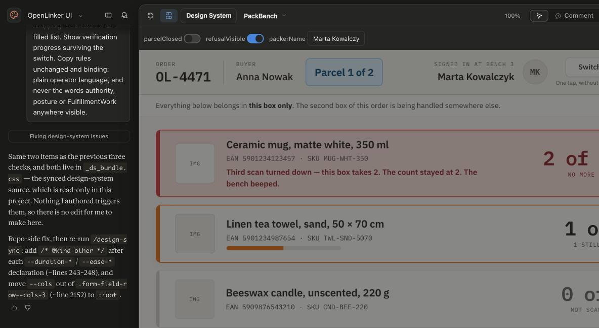
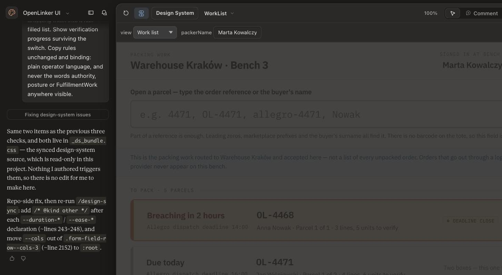
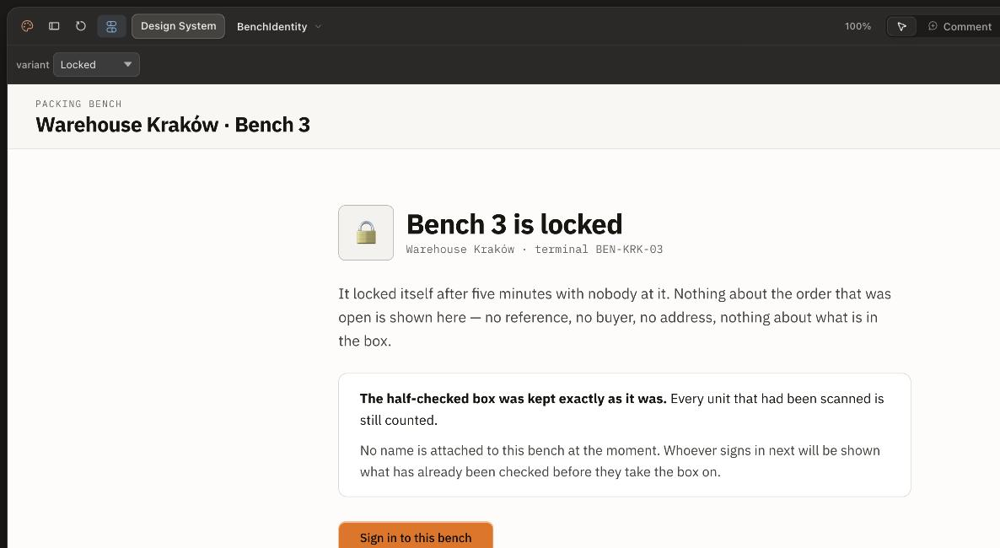
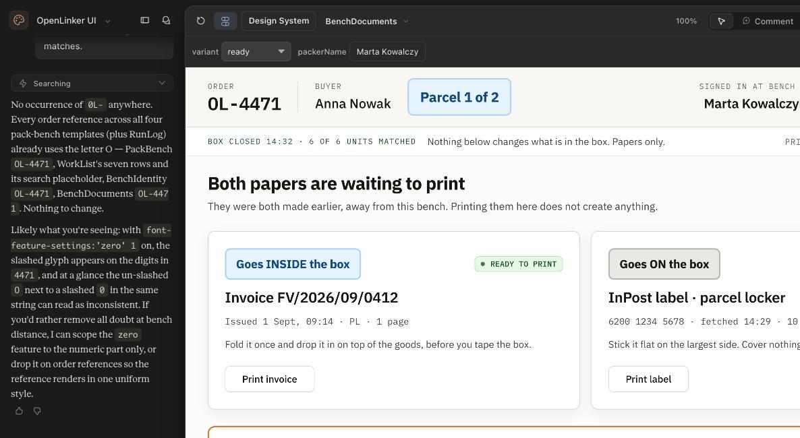

# OMS Wave 3b — pack bench mockups

Four designed surfaces for the Wave 3b pack bench, drawn against OpenLinker's own component
library in Claude Design. Companion to
[`docs/specs/product-spec-oms-wave3b-scan-pick-pack.md`](../../../specs/product-spec-oms-wave3b-scan-pick-pack.md)
and [ADR-071](../../../architecture/adrs/071-pack-station-principal.md).

## Read this first

**The live project is canonical. This directory is a point-in-time snapshot and can silently go
stale.**

→ **[OpenLinker UI → Templates](https://claude.ai/design/p/9811a593-63ff-4c9d-95bc-e80fe2651c8d)**

The `.dc.html` sources **do not render standalone** — they need `support.js`, `ds-base.js` and the
multi-MB `_ds_bundle.js` that live in the project. The screenshots here are the readable artifact;
open the project to interact with a surface or to flip its variants.

Each template carries **tweaks** (the panel above the canvas) that switch between states. The
screenshots capture one state each; the interesting states are often the other ones.

### The sources are here too

`templates/` holds a byte-faithful export of the four `.dc.html` sources, so the markup is diffable
and reviewable in a pull request rather than only in a browser. They are the files the project
serves, copied rather than re-authored, and they carry the tweak definitions and the `renderVals()`
logic that decide which state each screenshot above is showing. Nothing about the caveat above
changes — they are here to be read, not run.

## The four surfaces

### Pack bench — verify a parcel

*Tweaks: `parcelClosed`, `refusalVisible`, `packerName`.*

Four line states — not started, part-verified, verified, over-pack refused. What it pins down:

- **There is no commit control anywhere.** The parcel closes when the last line is verified, and the
  footer says so: *"This box closes itself the moment the last line is verified. There is nothing
  here to press."* Flip `parcelClosed` for the completion state — *"The last scan closed it — there
  was nothing to press."* (**D18**)
- Refusals are stated in operator language, not as codes: *"Third scan turned down — this box takes
  2. The count stayed at 2. The bench beeped."*
- **Switch packer** sits in the top bar — *"One tap, without leaving the box"* (**A2**).

### Pack bench — work list

*Tweak: `view` — work list / nothing to pack / routing switched off.*

- **The list is authoritative, not derived**: *"This is the packing work routed to Warehouse Kraków
  and accepted here — not a list of every unpacked order. Orders that go out through a logistics
  provider never appear on this bench."* (**D8**)
- **It never claims readiness.** Rows count *"units to verify"*, never "picked" — OpenLinker cannot
  see a shelf, and a list that implies otherwise sends a packer to fetch something that is not
  there. (**D11**)
- **Opening is by search, not scan**, because nothing prints a barcode on the tote. The placeholder
  teaches the forgiving matching: `e.g. 4471, OL-4471, allegro-4471, Nowak`.
- The two empty states are deliberately distinct — "nothing to pack right now" is not the same fact
  as "routing is not switched on, so this bench will never receive work", and the second names the
  fix rather than showing an empty page.

### Pack bench — who is signed in

*Tweak: `variant` — locked / sign in / handover.*

- **The locked screen withholds buyer data and says so**: *"Nothing about the order that was open is
  shown here — no reference, no buyer, no address, nothing about what is in the box."* A shared
  terminal on a floor is often unattended.
- **Sign-in is an ordinary account**, deliberately not a PIN pad and not a badge reader — *"Use your
  own account. It works at any bench in this warehouse."* (**ADR-071**)
- **Handover** shows the incoming packer what the previous one already verified, before they take
  the parcel on — because whoever finishes it is the one recorded as having packed it (**D13**).

### Pack bench — documents and label

*Tweak: `variant` — ready / missing / unlabelled.*

- **INSIDE vs ON the box** is the organising distinction, because that is the thing a packer has to
  get right.
- **The bench prints; it never issues**: *"They were both made earlier, away from this bench.
  Printing them here does not create anything."* The label is fetched upstream (`fetched 14:29`), so
  a carrier outage cannot stop packing. (**D14**, **F1**)
- **`missing`** — a document that was never issued names its reason and does **not** block packing:
  *"No invoice issued — payment is on hold… Send it without one."* A tax-rate gap is an office
  problem the packer cannot fix. (**D17**)
- **`unlabelled`** — the state this surface exists for. A box that is finished and cannot ship:
  *"Packed, but there is no label… Do not open it and do not check it again."* It quotes the
  carrier, retries **without** re-opening or re-verifying, and states that dispatch sees it too, so
  it does not depend on anyone remembering this bench. (**F4**)

## Not mocked

Stated so absence is not read as oversight:

- **Surface H** — offline behaviour, and never claiming a state the system has not confirmed.
- **D2's refusal when opening a held parcel** — belongs as a variant on an existing template rather
  than a screen of its own.
- **B5's expedited marker** — the expedite story was added to the spec after these were drawn.

### Known gaps against the shipped surface

Recorded when Surfaces D/E/F were built (#2418), so the difference reads as a
deliberate omission rather than a rendering bug.

`BenchDocuments.dc.html` shows two facts about a label that **no data model
carries**, and the shipped surface therefore does not render either:

- **`fetched 14:29`** — when the label was retrieved. `Shipment` has no such
  column, and `failedAt` (the only label timestamp OpenLinker holds) records the
  opposite event.
- **`tried 3 times`** — how many attempts the carrier has had. Nothing counts
  them; a shipment records its current state, not a history of attempts.

Adding either would mean a schema change plus a backfill, so the shipped panel
states what it knows — the carrier, the tracking number, and the carrier's own
refusal where a caller is allowed to see it — and invents nothing.

Two mockup controls are also absent, for the standing reason that a control
wired to nothing is worse than a missing one:

- **"Put the box on the problem shelf"** — nothing records a shelf.
- **"Try the label again"** — on this panel there is nothing to try. A label
  that EXISTS is reported `ready`, where the Print control re-fetches it every
  time it is pressed, so a transient fetch failure is already retried by
  pressing that. The `unlabelled` state is reached only when no label was ever
  produced, and buying one needs the buyer's address and the box measurements —
  precisely the data this surface is shaped not to hold. The panel names
  dispatch as the owner instead.

And one field renders differently by role: the carrier's own words
(*"Parcel locker 4471 is full"*) are gated on `shipments:write`, which no packer
holds, because the raw rejection text may embed address fragments. A packer sees
the carrier's short code, and — where even that is absent — is told the reason is
withheld rather than that the carrier gave none.

## Provenance and drift

Drawn 2026-09-03 against the **OpenLinker UI** design system (45 components synced from
`apps/web/src/shared/ui`, PR #2303). The design agent reports all templates and the manifest clean.

Two `check_design_system` items it flags are **not** defects in these templates — they live in the
read-only synced `_ds_bundle.css` (motion token kinds; `--cols` under `.form-field-row--cols-3`) and
are repo-side fixes tracked as **#2436**.

Product names, EANs, SKUs, bench numbers and times are invented placeholders.
