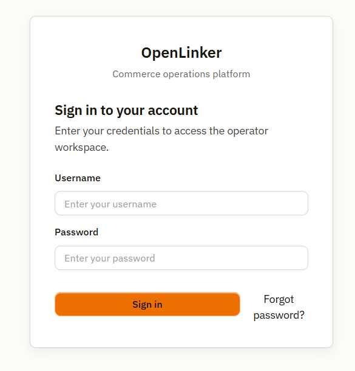
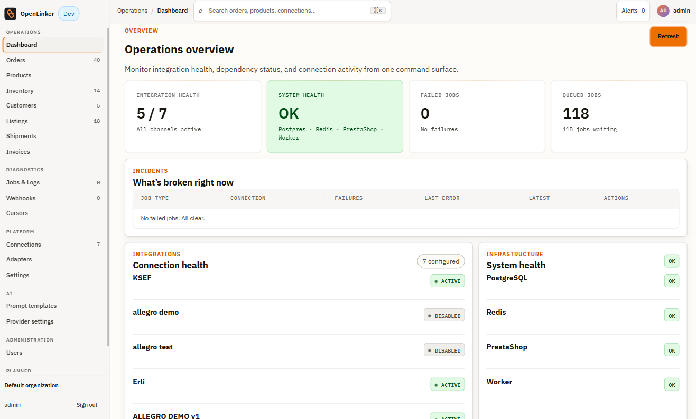
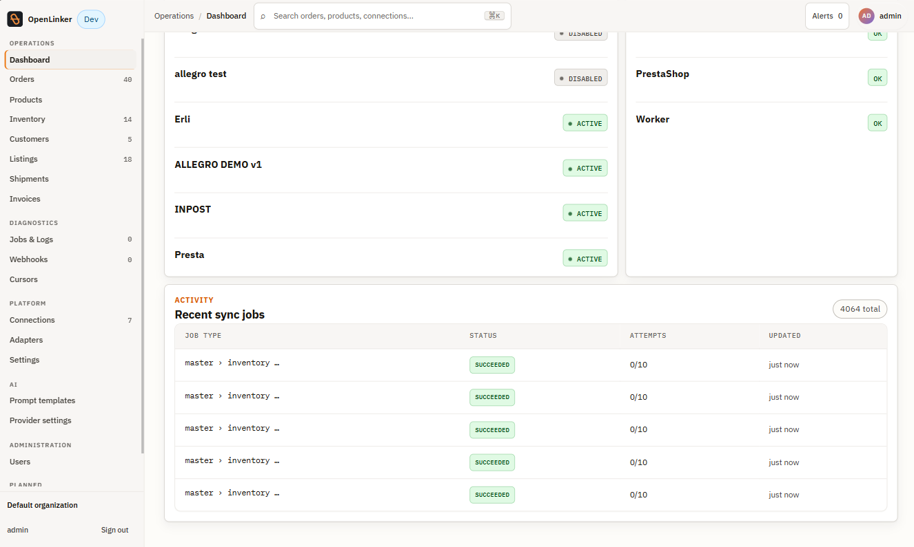

# Overview & First Login

OpenLinker's admin UI is a browser-first single-page application. Everything — connections, catalog, orders, diagnostics — lives in one place, organized around a persistent left sidebar. This section walks you through logging in for the first time and getting your bearings.

---

## First Login

Navigate to the OpenLinker web app in your browser. In a local dev setup the default address is **http://localhost:4173**; on a production install it's whatever hostname you've configured.

<!-- screenshot: login screen showing username/password fields and "Forgot password?" link -->


Enter your admin credentials. On first boot the API prints a one-time default password to the log:

```
[BootstrapAdminService] Default admin credentials: username=admin password=<generated>
```

If you've lost your password, click **Forgot password?** — the API logs the reset link to its console output.

After a successful login you land on the **Dashboard**.

---

## Shell Layout

The admin UI follows a fixed shell: persistent left sidebar, top utility bar, and a main workspace area.

<!-- screenshot: full dashboard view showing the nav groups in the sidebar and the main workspace -->


### Left Sidebar

The sidebar is always visible and organized into groups, separated by frequency of use:

**Operations** — the surfaces you touch daily:
- **Dashboard** — system health overview, connection status, and job activity at a glance
- **Orders** — every order ingested from any connected source
- **Products** — the synced product catalog from your master shop
- **Inventory** — per-variant stock levels pulled from your master shop
- **Customers** — customer projections built from order data
- **Listings** — marketplace offers managed by OpenLinker
- **Shipments** — shipment tracking and dispatch
- **Invoices** — issued/pending/failed invoices per order, with regulatory (e.g. KSeF) clearance status — see [Invoices](./04-invoices.md)

**Diagnostics** — when something needs investigation:
- **Jobs & Logs** — every background sync job: status, payload, and detail
- **Webhooks** — inbound webhook delivery log with payload inspector
- **Cursors** — sync-progress bookmarks; reset one here if a sync stalls

**Platform** — one-time and occasional configuration:
- **Connections** — your connected platforms (PrestaShop, Allegro, WooCommerce, …)
- **Adapters** — registered adapter manifests (read-only metadata)
- **Settings** — platform configuration and account info

**AI** — AI content generation tools:
- **Prompt templates** — editable prompts used when generating offer descriptions
- **Provider settings** — configure and activate an AI provider (Anthropic / OpenAI)

Below the AI group you'll see **Automations** listed in a muted style. This is a planned future feature — it is not yet functional and is not covered by this guide.

### Top Bar

The top bar carries:
- **Environment/workspace name** — useful when you run multiple OpenLinker instances
- **Alerts** badge — unread alert count
- **Theme toggle** — switch between light and dark mode; the preference is stored in your browser
- **User menu** — log out and account settings

---

## Dashboard

The Dashboard is your at-a-glance view of system and integration health.



### Summary cards

Four cards at the top give a quick health read:

| Card | What it shows |
|---|---|
| **Integration health** | `5 / 7` — how many connections are active out of the total configured |
| **System health** | OK when all core dependencies (PostgreSQL, Redis, PrestaShop, Worker) are reachable |
| **Failed jobs** | Count of jobs in `dead` state that need attention |
| **Queued jobs** | Jobs currently waiting to be picked up by the worker |

### Incidents panel

The **INCIDENTS — What's broken right now** panel lists any connections or system components that are currently in an error state. An empty panel ("No failed jobs. All clear.") means everything is healthy.

### Connection health & Infrastructure

Two side-by-side sections show:
- **INTEGRATIONS — Connection health** — per-connection status chip (ACTIVE / error) for each configured platform (e.g. Allegro, Pretashop)
- **INFRASTRUCTURE — System health** — PostgreSQL, Redis, PrestaShop module, and Worker process — each with an OK / error chip

### Recent sync jobs

The **ACTIVITY — Recent sync jobs** table at the bottom shows the latest background jobs across all connections: job type, status chip, attempt count, and last-updated timestamp. Use this as a quick sanity check that syncs are running.

---

## Theme toggle

Click the sun/moon icon in the top-right of the top bar to switch between light and dark mode. The choice is stored in your browser and persists across sessions.

---

## What's next

With the layout in mind, the next step is connecting a platform:

→ **[Connecting a Platform](./02-connecting-a-platform.md)**
