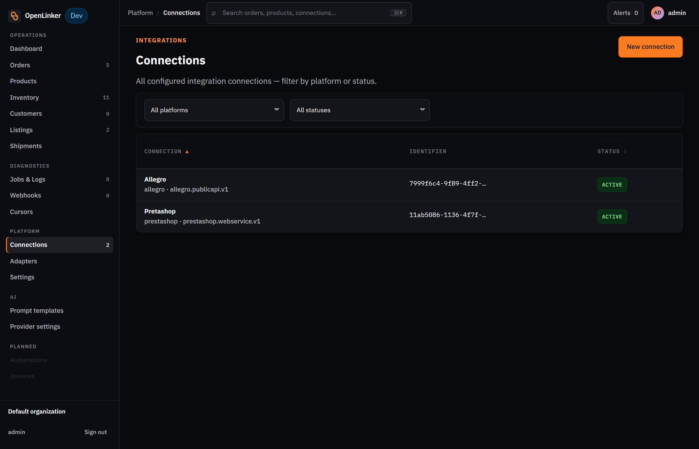
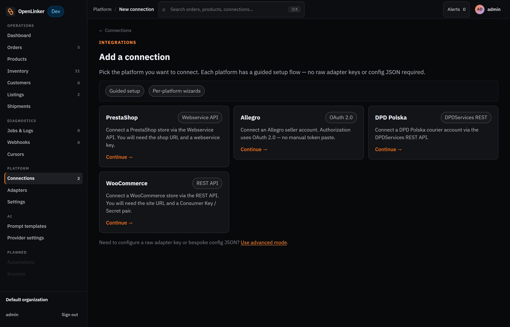
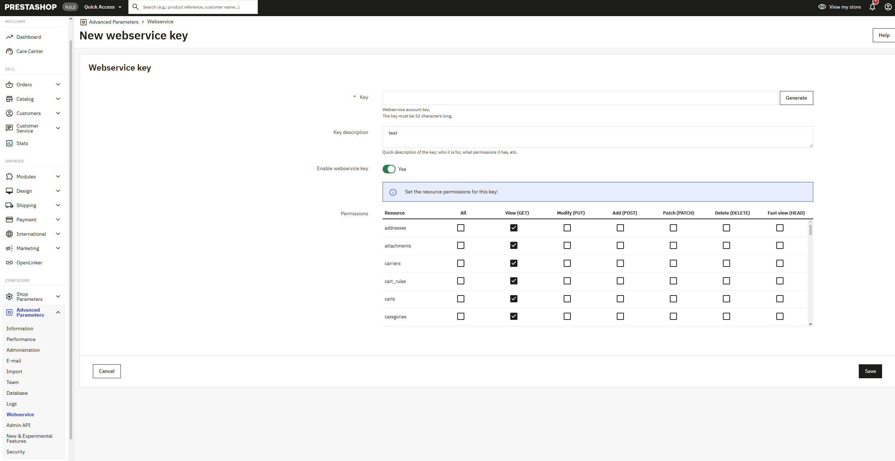
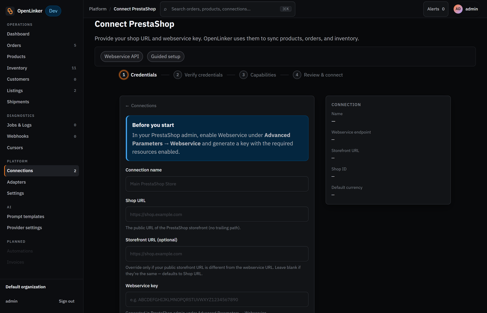
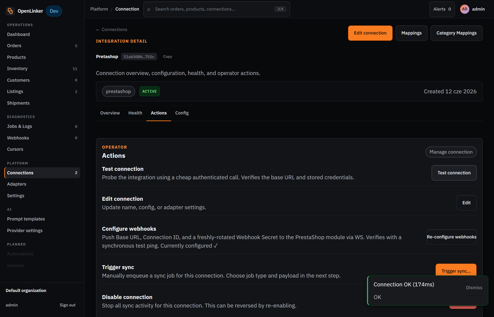
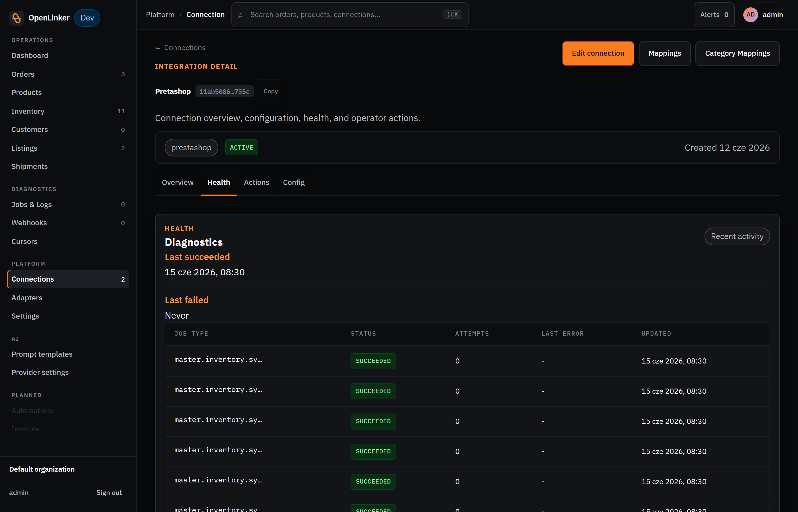
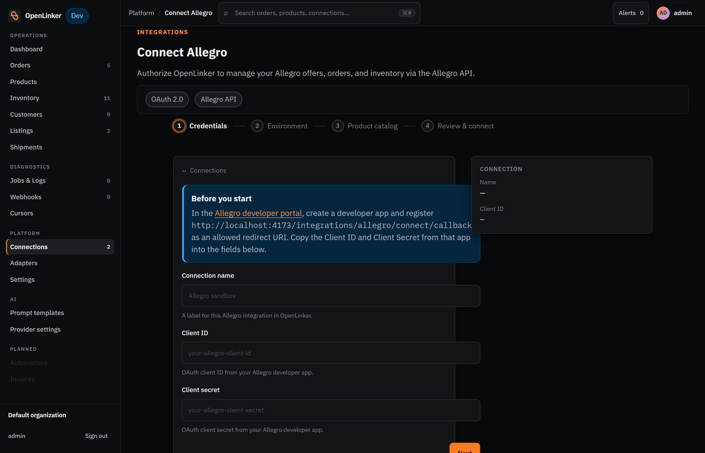
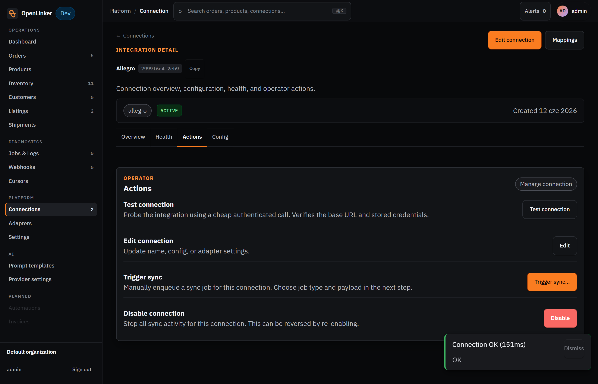

# Connecting a Platform

OpenLinker works by connecting to your existing platforms — a **master shop** (PrestaShop or WooCommerce) that is the source of truth for products and inventory, and one or more **marketplace** connections (Allegro) where offers are created and orders are ingested. This section walks you through the full connection flow using PrestaShop and Allegro as worked examples.

For WooCommerce-specific wizard steps, see the **[WooCommerce Setup Guide](../integrations/woocommerce/setup-guide.md)**.

---

## Connections list

Open **Connections** in the sidebar (under the **Platform** group). The connections list shows every platform you've configured.

<!-- screenshot: connections list showing configured connections with status pills visible, or empty state before any connection is added -->

Each row shows:
- **Name** — the label you gave the connection
- **Platform** — e.g. `prestashop`, `allegro`
- **Adapter** — the specific adapter version, e.g. `prestashop.webservice.v1`
- **Status** — one of:

| Status | Meaning |
|---|---|
| **active** | Connected and all capabilities resolve correctly |
| **error** | Last connection test or sync attempt failed — check the connection detail for the error |
| **needs_reauth** | OAuth token has expired or been revoked; click the connection to re-authorize |
| **disabled** | Manually disabled; no sync jobs are scheduled for this connection |

---

## Adding a new connection

Click **New connection** (or the **Add connection** button if the list is empty) to open the platform picker.

<!-- screenshot: platform picker dialog showing platform cards (PrestaShop, Allegro, DPD Polska, WooCommerce) -->

Select the platform you want to connect. The wizard adapts to the chosen platform.

---

## PrestaShop walkthrough

### Before you start — generate a webservice API key

OpenLinker calls the PrestaShop API using a webservice key. Create one in the PrestaShop admin before running the wizard:

<!-- screenshot: PrestaShop admin — Advanced Parameters → Webservice → Add new webservice key form -->

1. Open the PrestaShop admin → **Advanced Parameters → Webservice**.
2. The webservice should be enabled (the dev stack enables it automatically).
3. Click **Add new webservice key**.
4. Set a description (e.g. `OpenLinker`), tick **GET** permissions on all resources, and save.
5. Copy the generated key — you'll paste it into the OpenLinker wizard.

### Step 1 — Credentials form

After selecting **PrestaShop**, fill in the wizard form:

<!-- screenshot: PrestaShop credential form with all fields visible; API key field blurred/redacted -->

| Field | Description |
|---|---|
| **Connection name** | A human-readable label, e.g. `Main store` |
| **Shop URL** | Base URL of the PrestaShop install, e.g. `http://localhost:8080/` |
| **Storefront URL** *(optional)* | Public-facing URL if different from the admin URL |
| **Webservice key** | The API key generated above |
| **Shop ID** *(optional)* | Leave blank for a standard single-shop install |
| **Default currency** *(optional)* | Override the shop's default currency for this connection |

Click **Create connection**. OpenLinker validates the credentials and, if successful, redirects you to the connection detail page.

### Step 2 — Test the connection

On the connection detail page, click **Test connection** in the **Actions** tab.

<!-- screenshot: PrestaShop connection detail — Actions tab, with "Connection OK" toast notification visible at bottom-right -->

A **Connection OK** toast confirms the webservice key is valid and all registered capabilities resolve correctly.

If the test fails, check:
1. The shop URL includes a trailing slash and is reachable from the OpenLinker host
2. The webservice is enabled in PrestaShop (**Advanced Parameters → Webservice → Enable**)
3. The key has at least `GET` permissions on the required resources

### Connection detail tabs

The connection detail page has four tabs:

- **Overview** — platform type, adapter key, status chip, and configured capabilities
- **Health** — per-capability diagnostic checks and recent job activity for this connection
- **Actions** — Test connection, Edit connection, Configure webhooks, Trigger sync, Disable connection
- **Config** — current configuration values stored for this connection

<!-- screenshot: PrestaShop connection Health tab showing diagnostic checks and recent jobs -->

### Category Mappings

The PrestaShop connection detail also exposes a **Category Mappings** page, accessible from the connection's action bar. This is where you map your PrestaShop product categories to Allegro's category tree — a prerequisite for creating Allegro offers. See [Listings & Offers](./04-listings.md#category-mappings) for details.

---

## Allegro walkthrough

### Step 1 — OAuth credentials

After selecting **Allegro**, the wizard asks for OAuth credentials from your registered Allegro application:

<!-- screenshot: Allegro connection wizard — Credentials step showing Connection name, Client ID, Client secret fields and the OAuth/Allegro API tab selector -->

| Field | Description |
|---|---|
| **Connection name** | A human-readable label, e.g. `Allegro sandbox` |
| **Client ID** | From your Allegro developer application |
| **Client secret** | From your Allegro developer application |

The wizard also lets you configure the Allegro environment (Sandbox / Production) and link a PrestaShop product catalog.

> ⚠️ **Required defaults for Allegro**: The wizard includes a step to configure GPSR (General Product Safety Regulation) required fields and a default ship-from location. These are required by Allegro for offer creation. Fill them in before finishing the wizard.

### Step 2 — Authorize via OAuth

After filling in credentials, the wizard redirects you to Allegro's authorization page. Log in to your Allegro account and authorize the application. You are redirected back to OpenLinker and the connection is saved.

### Step 3 — Verify

On the Allegro connection detail, click **Test connection**:

<!-- screenshot: Allegro connection detail — Actions tab with "Connection OK" toast notification -->

The **Connection OK** toast and the displayed response time confirm the Allegro API credentials are valid.

---

## Multiple connections

You can add multiple connections of the same platform type — for example, two PrestaShop stores and three Allegro accounts. Each connection has its own credentials, config, and set of scheduled sync jobs. The Dashboard and Jobs & Logs views aggregate across all connections.

---

## What's next

With at least one shop connection active and catalog synced:

→ **[Catalog & Inventory](./03-catalog-and-inventory.md)** — browse the synced product catalog and inventory levels
