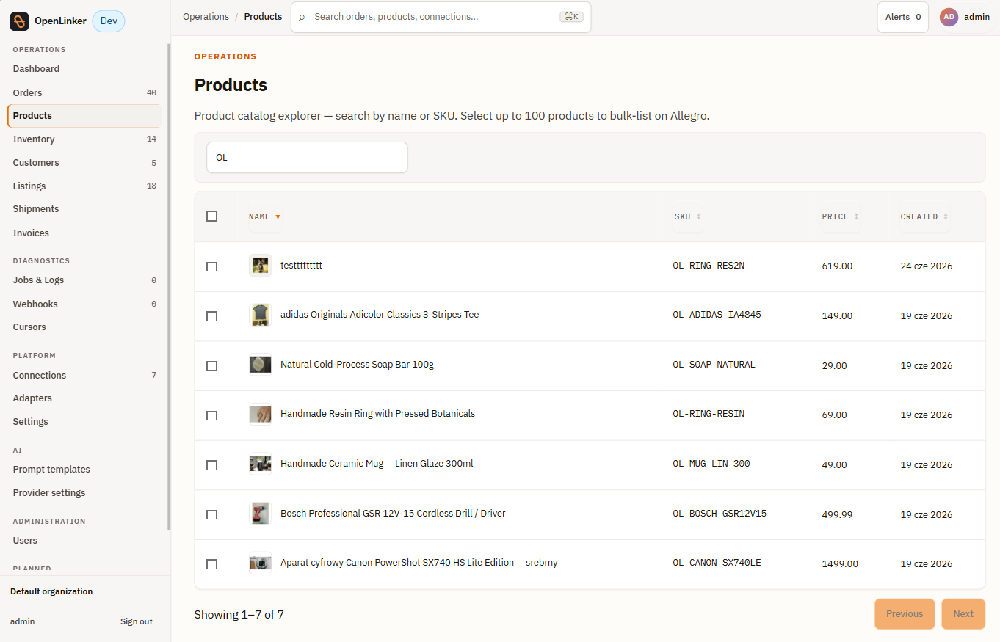
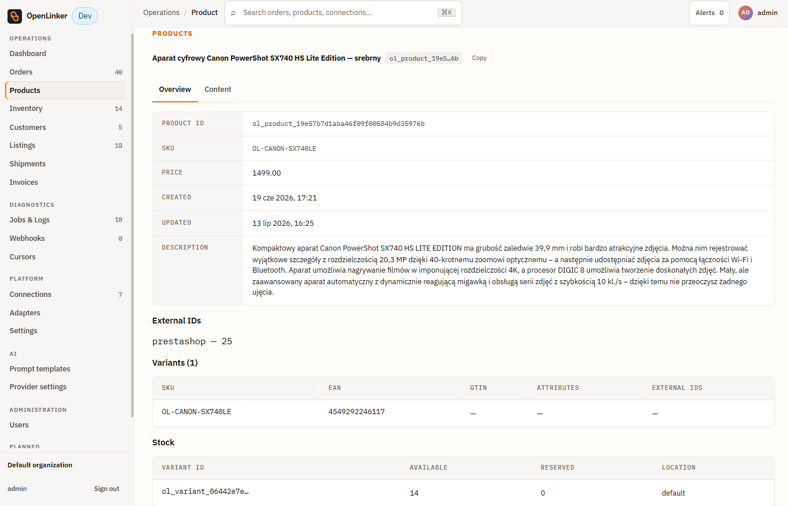
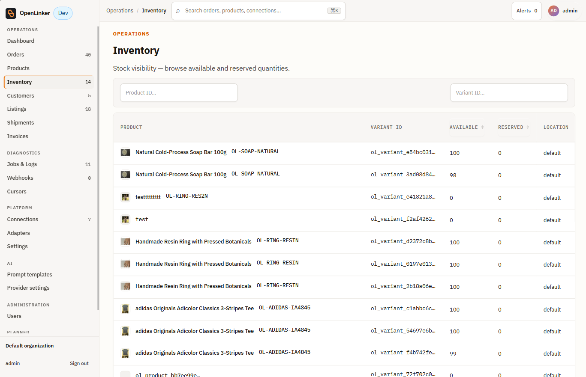
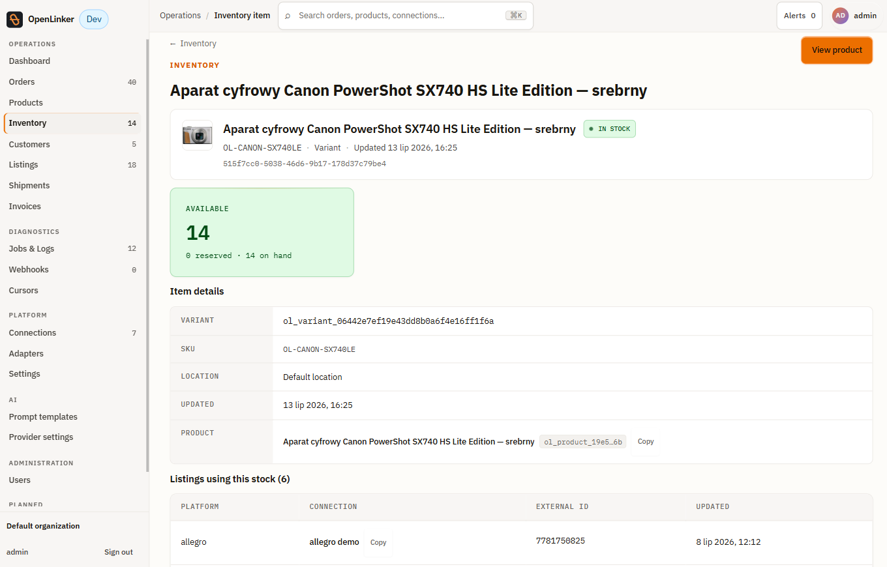

# Catalog & Inventory

OpenLinker treats your master shop (PrestaShop or WooCommerce) as the single source of truth for product data and stock levels. The Products and Inventory surfaces in the admin UI are read-only views into that synced state — you manage products in your shop, and OpenLinker keeps its copy in sync.

---

## Products

Open **Products** in the sidebar (under **Operations**).

<!-- screenshot: products list showing product rows with name, SKU, price, and creation date columns -->

### Products list

Each row in the products list represents one product synced from your master shop. Columns include:

- **Name** — product name (with thumbnail image) as it appears in the shop
- **SKU** — the shop's internal reference code
- **Price** — the product's base price
- **Created** — when this product was first synced into OpenLinker

Use the **search bar** to filter by product name or SKU.

### Product detail

Click any product row to open the product detail page.

<!-- screenshot: product detail page showing product information, variants table, and stock section -->

The page header shows the product name, its internal OpenLinker ID (click the ID chip to copy it to the clipboard), and any category tags assigned to the product.

The product detail has two tabs:

**Overview tab** — shows:

- **Product metadata** — a fixed set of fields read from the master shop:
  - **PRODUCT ID** — OpenLinker's internal identifier for this product (`ol_product_…`); stable across re-syncs
  - **SKU** — the shop's reference code
  - **PRICE** — the base price as stored in the shop
  - **CREATED** — when this product was first synced into OpenLinker
  - **UPDATED** — when OpenLinker last updated its projection from the shop
  - **DESCRIPTION** — the full product description imported from the shop
- **External IDs** — each connected platform where this product has a known identifier, shown as `platform — external_id`. For example, `prestashop — 25` means the product's ID in that PrestaShop connection is 25.
- **Variants** — a table of all variants (combinations) with columns:
  - **SKU** — the variant's reference code
  - **EAN** — barcode used for Allegro catalog product matching
  - **GTIN** — Global Trade Item Number (if populated in the shop)
  - **ATTRIBUTES** — distinguishing attribute values (e.g. colour, size)
  - **EXTERNAL IDS** — per-connection external identifiers for this variant
  
  Simple products without combinations appear with one synthetic variant so the offer-linking system always has a stable target.
- **Stock** — per-variant stock rows sourced from the last inventory sync:
  - **VARIANT ID** — OpenLinker's internal variant identifier (`ol_variant_…`)
  - **AVAILABLE** — units available for sale
  - **RESERVED** — units reserved by pending orders
  - **LOCATION** — warehouse or stock location (`default` if not configured)

**Content tab** — shows the product's content fields (e.g. description) that OpenLinker manages for cross-channel publishing. See **[Listings & Offers](./05-listings.md)** for how content fields are used when creating marketplace offers.

OpenLinker does not provide an edit UI for product data — changes to names, descriptions, or pricing are made in your master shop and picked up on the next catalog sync (every 20 minutes by default, or immediately after clicking **Trigger sync** on the connection detail page).

---

## Inventory

Open **Inventory** in the sidebar (under **Operations**).

<!-- screenshot: inventory list showing per-variant rows with available/reserved quantity columns -->

### Inventory list

The inventory list shows stock levels per product variant, as last read from the master shop. Columns include:

- **Product** — product name and SKU; multi-variant products (e.g. a ring with multiple sizes) appear as one row per variant
- **Variant ID** — OpenLinker's internal variant identifier (`ol_variant_…`)
- **Available** — units available for sale (total stock minus reserved)
- **Reserved** — units reserved by pending orders
- **Location** — warehouse or stock location identifier (`default` if no locations are configured)

Inventory is refreshed on a 15-minute schedule by default (`OL_INVENTORY_SYNC_ENABLED` in the API config). Stock changes in your shop are reflected after the next scheduled sync.

### Inventory detail

Click any inventory row to open the detail page for that variant's stock record.

<!-- screenshot: inventory detail page showing stock summary, item details, and linked listings -->

The page header shows the product name and a **View product** button that jumps directly to the product detail page.

The detail page is divided into three areas:

**Stock summary card** — a prominently displayed count of available units with a breakdown underneath: `{reserved} reserved · {on hand} on hand`. The card turns green when stock is positive and indicates the stock status (e.g. **IN STOCK**).

**Item details** — the fields that identify this inventory record:
- **VARIANT** — OpenLinker's internal variant identifier (`ol_variant_…`)
- **SKU** — the variant's reference code from the master shop
- **LOCATION** — the warehouse or stock location this record belongs to (`Default location` if not configured)
- **UPDATED** — when this record was last refreshed from the master shop
- **PRODUCT** — the parent product name with its internal ID chip; click **Copy** to copy the product ID

**Listings using this stock** — a table of marketplace offers that draw their quantity from this variant's stock. Columns:
- **PLATFORM** — the marketplace (e.g. allegro)
- **CONNECTION** — the specific connection; click **Copy** to copy the connection ID
- **EXTERNAL ID** — the offer's native ID on the marketplace (e.g. the Allegro offer ID)
- **UPDATED** — when the offer's quantity was last propagated

Use this section to confirm that a stock change has reached the right marketplace offers, or to investigate why a quantity hasn't updated.

### Marketplace quantity propagation

When inventory levels change, OpenLinker automatically updates the quantity on any active marketplace offers linked to that variant. The propagation is triggered by the inventory sync job — you don't need to do anything manually. Check **Jobs & Logs** to see the `inventory.propagate` jobs if you want to confirm propagation has run.

---

## How sync works

Both catalog and inventory syncs follow the same pattern:

1. A scheduled job (or a manual trigger from the connection detail page) reads data from the master shop via the shop's API.
2. OpenLinker updates its internal projection of each product and variant.
3. For inventory, updated stock levels are propagated to any linked marketplace offers.

If a sync fails (network error, API key expired, etc.), check the corresponding job in **Jobs & Logs** for the error detail.

---

## What's next

With the catalog synced, orders that arrive can be invoiced automatically:

→ **[Invoices](./04-invoices.md)** — issuing invoices per order and regulatory (KSeF) clearance status

Or skip ahead to create marketplace offers:

→ **[Listings & Offers](./05-listings.md)** — create Allegro offers from your synced catalog
