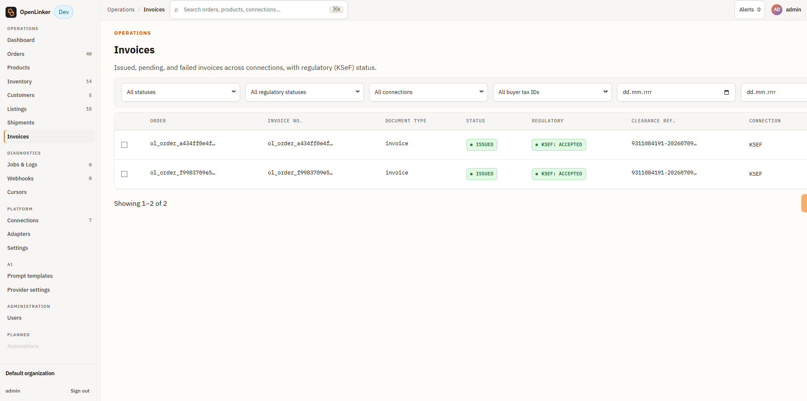
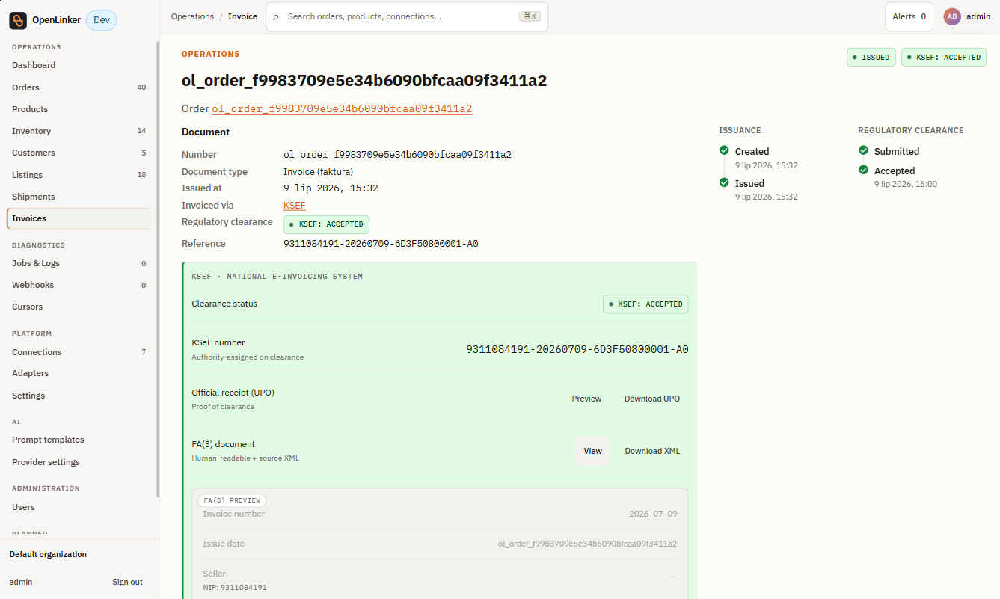
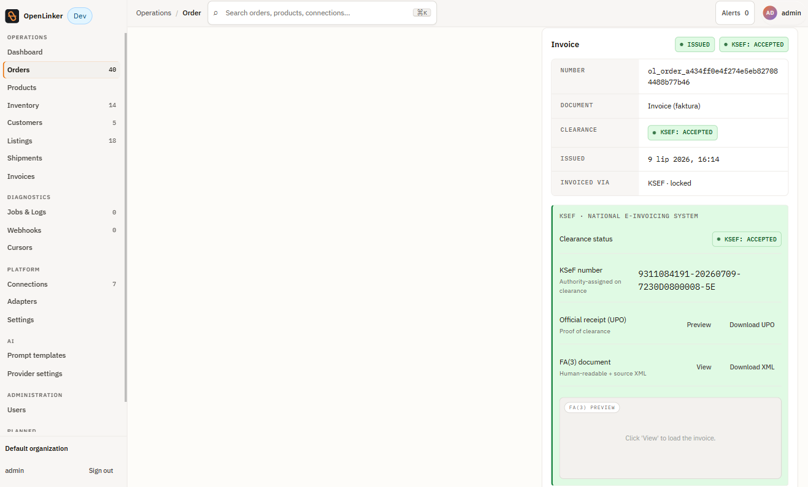
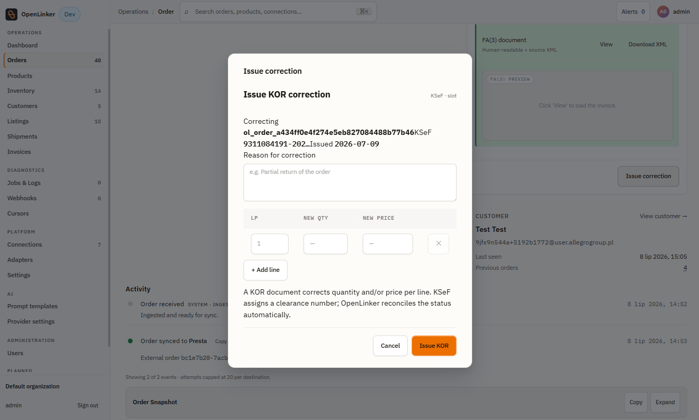

# Invoices

OpenLinker can issue fiscal documents for orders and, where the connected provider supports it, submit them to a tax authority for clearance — for example Poland's KSeF system. This section covers the Invoices list, the invoice detail page, and the per-order invoice panel embedded in Order detail.

---

## Prerequisites

Invoicing is capability-gated per connection, the same way ProductMaster or OfferManager are. Before you can issue an invoice you need at least one **active** connection with the `Invoicing` capability enabled — for example a KSeF connection (`ksef.publicapi.v2`), Subiekt (`subiekt.invoicing.v1`), or inFakt (`infakt.accounting.v1`). See [Connecting a Platform](./02-connecting-a-platform.md#invoicing-providers) for how to add and activate one.

If no active invoicing connection exists, the **Invoice** panel on an order's detail page does not render at all, and the **Invoices** list shows no data. If a connection exists but is in `error` or `needs_reauth` status, the panel shows a **Re-authenticate** prompt linking to that connection instead.

---

## Invoices list

Open **Invoices** in the sidebar (under **Operations**).

<!-- screenshot: invoices list showing filter row (status, regulatory, connection, tax ID, date range), the data table with Order/Invoice no./Document type/Status/Regulatory/Clearance ref./Connection columns -->

### Filters

| Filter | Values |
|---|---|
| **Status** | `pending`, `issuing`, `issued`, `failed` |
| **Regulatory status** | `submitted`, `accepted`, `rejected` (KSeF-style clearance; `not-applicable` and `cleared` are excluded from the filter as noise/unused) |
| **Connection** | Any configured invoicing connection |
| **Buyer tax ID** | With tax ID / Without tax ID |
| **Issued from / Issued to** | Date range |

### Columns

| Column | Description |
|---|---|
| **Order** | Internal order ID (`ol_order_*`) the invoice was issued for |
| **Invoice no.** | Provider-assigned invoice number, linked to the PDF when available |
| **Document type** | e.g. `invoice`, `receipt`, `credit-note`, `corrected`, `proforma`, `prepayment` |
| **Status** | Derived display status — see **Invoice statuses** below |
| **Regulatory** | Clearance status with the connected tax authority, when applicable |
| **Clearance ref.** | The authority-assigned reference (e.g. KSeF number), once cleared |
| **Connection** | Which invoicing connection issued the document |
| **Issued** | Date the document was issued |

### Invoice statuses

| Status | Meaning |
|---|---|
| **pending** | Issue request accepted, not yet confirmed by the provider |
| **issuing** | An issue attempt is in flight and the row is locked — no action is available while this runs |
| **issued** | Document successfully issued |
| **failed (rejected)** | The provider rejected the request — nothing was issued, safe to retry once the underlying issue is fixed |
| **failed (in-doubt)** | The request timed out or was interrupted — a document **may already exist** on the provider. OpenLinker never offers a one-click Retry here, to avoid creating a duplicate; use **Check provider** to verify manually |

> ⚠️ **Fiscal safety.** Retry is only ever offered for a `failed` row whose failure mode is `rejected`. Any ambiguous or unknown failure is treated as in-doubt and shows **Check provider** / **Mark resolved** instead of a blind retry — this is deliberate, to prevent double-issuing a fiscal document.

### Bulk actions

Select one or more rows with the checkbox column to reveal the bulk-action bar:

- **Issue invoices** — issues invoices for the selected rows' orders. Orders that already have an issued invoice (or one in progress) are skipped; issuance is idempotent per order.
- **Retry selected** — retries only the rows eligible for retry (`failed` + `rejected`); everything else is skipped with a reason.

Both actions show a result banner with counts (issued/retried, skipped, failed) after completion.

---

## Invoice detail

Click any row to open `/invoices/:invoiceId`.

The page shows:

- **Document** — invoice number, document type, issued date, invoicing connection ("Invoiced via"), and regulatory clearance status + reference.
- **Issuance** / **Regulatory clearance** — the dual timeline for the document: when it was created and issued on one side, when it was submitted and accepted by the tax authority on the other.
- **Provider extras panel** — provider-specific detail below the timeline (for KSeF: clearance status, the authority-assigned KSeF number, an **Official receipt (UPO)** preview/download, and the FA(3) document preview/download as XML).
- **Failure/in-doubt alert + actions** — when the invoice failed or is in-doubt, a banner appears above the Document block with contextual actions: **Retry** (rejected failures only), or **Check provider** / **Mark resolved** (in-doubt failures).

---

## Order-level invoice panel

Every order's detail page ([Orders](./06-orders.md#order-detail)) embeds an **Invoice** panel scoped to that order:

- **Not issued** — shows a document-type selector and an **Issue invoice** button.
- **Pending / Issuing** — a locked, read-only notice; the panel refreshes automatically when the provider responds.
- **Issued** — a read-only summary (number, document type, issued date, clearance status, invoicing connection) plus an **Issue correction** action when the connected provider supports corrections (e.g. KSeF FA(3) `KOR` documents).
- **Failed (rejected)** — an inline error with a **Retry** button.
- **Failed (in-doubt)** — an inline warning with **Check provider** / **Mark resolved**, no Retry.
- **Needs reauth** — shown when the only matching invoicing connection has lost its access; links to that connection to re-authenticate.

If more than one active invoicing connection is configured, the panel shows a connection picker before you can issue or view the invoice for that order.

### Issuing a correction

Clicking **Issue correction** on an issued invoice opens a per-line correction dialog. For KSeF, this issues a FA(3) `KOR` document — the correction resubmits a complete document rather than a delta, since KSeF has no delta-only correction primitive:

Enter a **reason for correction**, adjust the **quantity** and/or **price** per affected line (`+ Add line` for more lines), and submit. OpenLinker reconciles the corrected document's clearance status automatically once the provider responds.

---

## Emailing and downloading

Where the invoicing connection supports it, an issued invoice can be emailed to the buyer (choice of PL/EN document language, with an optional copy to the operator) or downloaded as a PDF via the invoice-number link shown throughout the list, detail, and panel views.

---

## What's next

→ **[Listings & Offers](./05-listings.md)** — create marketplace offers from your synced catalog

Don't have an invoicing connection yet? See **[Connecting a Platform → Invoicing providers](./02-connecting-a-platform.md#invoicing-providers)** to add one (KSeF, Subiekt, inFakt).
