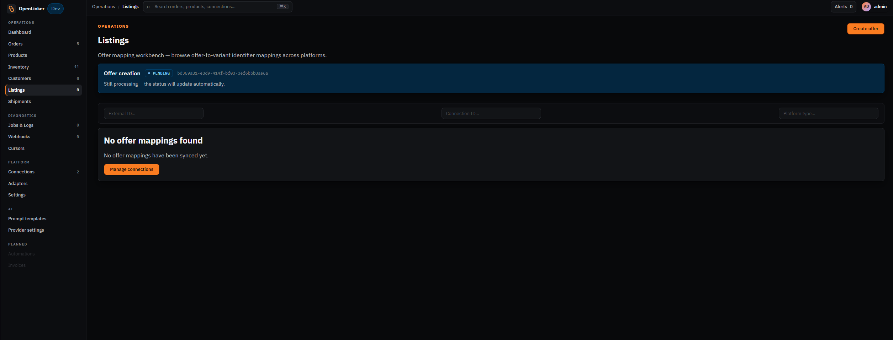
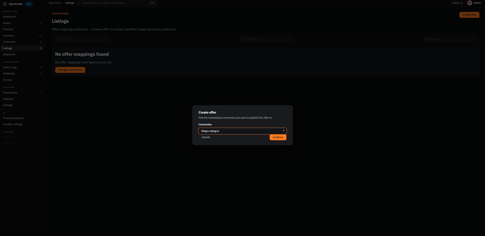
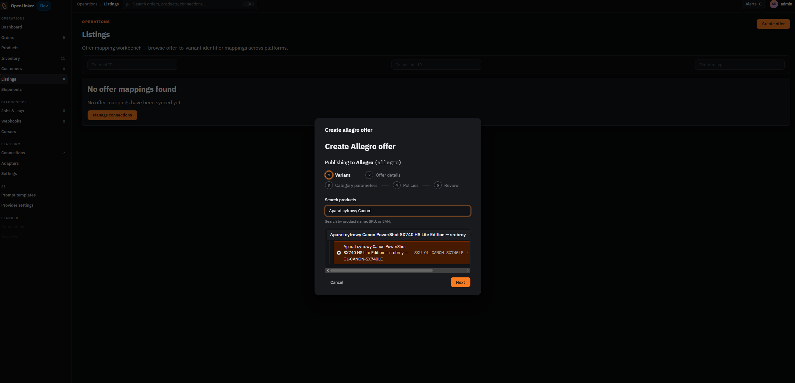
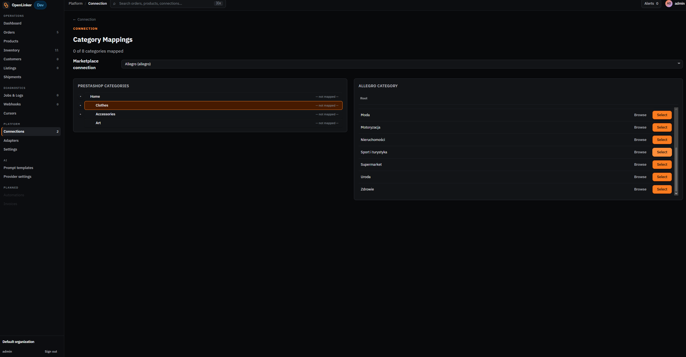

# Listings & Offers

Listings are the marketplace offers OpenLinker manages on your behalf. Each listing is linked to a product variant in your catalog and published to a marketplace (Allegro) via the configured connection. This section covers the listings view, the offer-creation wizard, and category mappings.

For Allegro-specific category parameter details, see the **[Allegro Setup Guide](../integrations/allegro/setup-guide.md)**.

---

## Listings list

Open **Listings** in the sidebar (under **Operations**).

<!-- screenshot: listings list showing offer rows with status banners or chips and connection filter -->

The Listings page is the **offer mapping workbench** — it shows offer-to-variant identifier mappings across platforms. Each row represents one offer on a marketplace. Columns include:

- **Product / variant** — the linked OpenLinker product and variant
- **Offer ID** — the marketplace's own offer identifier (e.g. Allegro offer ID)
- **Connection** — which marketplace connection this offer belongs to
- **Status** — current publication status:

| Status | Meaning |
|---|---|
| **active** | The offer is live and visible to buyers |
| **activating** | The offer was submitted and is being processed by the marketplace |
| **inactivating** | The offer is being deactivated |
| **inactive** | The offer exists on the marketplace but is not currently published |
| **ended** | The offer has ended and is no longer visible |

While an offer creation job is running, a banner at the top shows **Offer creation · PENDING** with a progress indicator. Once the job completes, the new offer appears in the list.

Use the **connection filter** to narrow the list to one marketplace account, and the **search bar** to find by SKU or EAN.

---

## Creating an offer

Click **Create offer** to open the connection picker dialog.

<!-- screenshot: "Create offer" connection picker dialog showing available marketplace connections -->

Select the marketplace connection to create the offer on (e.g. your Allegro account). The offer-creation wizard opens.

### Step 1 — Variant

<!-- screenshot: offer-creation wizard step 1 showing the product/variant search field -->

Search for the product you want to list by name, SKU, or EAN. Select the specific variant (for multi-variant products like a T-shirt with sizes S/M/L, each size is a separate variant).

### Step 2 — Offer details

Fill in the offer details for the selected variant:
- **Title** — the offer title as it will appear on the marketplace
- **Description** — offer description. Enable the **AI description** toggle to have OpenLinker draft a description using the configured AI provider (Anthropic or OpenAI). The draft can be edited before submission.
- **Price** — listing price
- **Stock quantity** — starting quantity (defaults to the current master inventory level for the selected variant)

### Step 3 — Category parameters

Select the Allegro category for the offer and fill in the required parameters:

- **Category browser** — drill down through the Allegro category tree. Use the breadcrumb to navigate back up.
- **EAN barcode lookup** — enter the product's EAN/GTIN. OpenLinker searches the Allegro catalog and, if there's a unique match, selects the correct category and pre-fills catalog parameters automatically.
- **Offer parameters** — attributes specific to this listing (e.g. condition)
- **Product parameters** — attributes that describe the product itself (brand, model, manufacturer code)

If you've already mapped your PrestaShop categories to Allegro categories (see [Category Mappings](#category-mappings) below), the wizard may pre-select the category automatically.

Required parameters are marked with an asterisk. The wizard will not allow submission until all required parameters are filled.

### Step 4 — Policies

Select your saved **seller policies** (payment, delivery, return) from the dropdowns. These are fetched live from your Allegro account.

If the product category requires **GPSR (General Product Safety Regulation)** data, fill in the responsible producer details. This field appears only for categories where Allegro requires it.

### Step 5 — Review & submit

Review the complete offer before submitting:
- Selected category and variant
- All parameter values
- Offer description
- Starting stock quantity
- Seller policies

Click **Create offer** to submit. OpenLinker enqueues a `marketplace.offer.create` job. The offer appears in the Listings list with status **activating** while Allegro processes it, then transitions to **active** once live.

---

## Bulk offer creation

From the **Products** list, check multiple product rows and click **Create offers** to open the wizard pre-seeded with all selected variants. For multi-variant products, OpenLinker expands each submitted product into one offer per variant — so selecting a T-shirt with sizes S, M, L creates three offers, each drawing stock from per-variant master inventory.

Allegro automatically groups the resulting per-variant offers into a single buyer-facing listing in the product catalog when the variants share the same GTIN-based catalog product.

---

## Category Mappings

Category mappings connect your PrestaShop product categories to Allegro's category tree. Without a mapping, the offer wizard cannot pre-select a category — you'll need to browse the tree manually for each offer.

<!-- screenshot: Category Mappings page showing PrestaShop category tree on the left and Allegro category browser on the right -->

To open the Category Mappings page:

1. Go to **Connections** (Platform group in the sidebar).
2. Click your **PrestaShop connection**.
3. Click **Category Mappings** in the connection's action bar.

The page shows:
- **Left panel** — your PrestaShop category tree
- **Right panel** — the Allegro category browser with a **Marketplace connection** selector at the top

### Mapping a category

1. Click a PrestaShop category in the left panel — it highlights and the right panel activates.
2. Browse the Allegro category tree using **Browse** to drill into subcategories.
3. When you find the right Allegro category, click **Select** — a preview bar appears showing your pick.
4. Click **Save mapping**. The row updates to show the mapped Allegro category name.

### Changing or removing a mapping

- To **change**: click the PS category again, pick a different Allegro category, click **Select → Save mapping**.
- To **remove**: click the PS category → click **Clear mapping** in the preview bar.

Repeat for each category you intend to list products in on Allegro.

---

## What's next

With offers live, orders will start arriving from the marketplace:

→ **[Orders](./05-orders.md)** — how to view and track ingested orders
