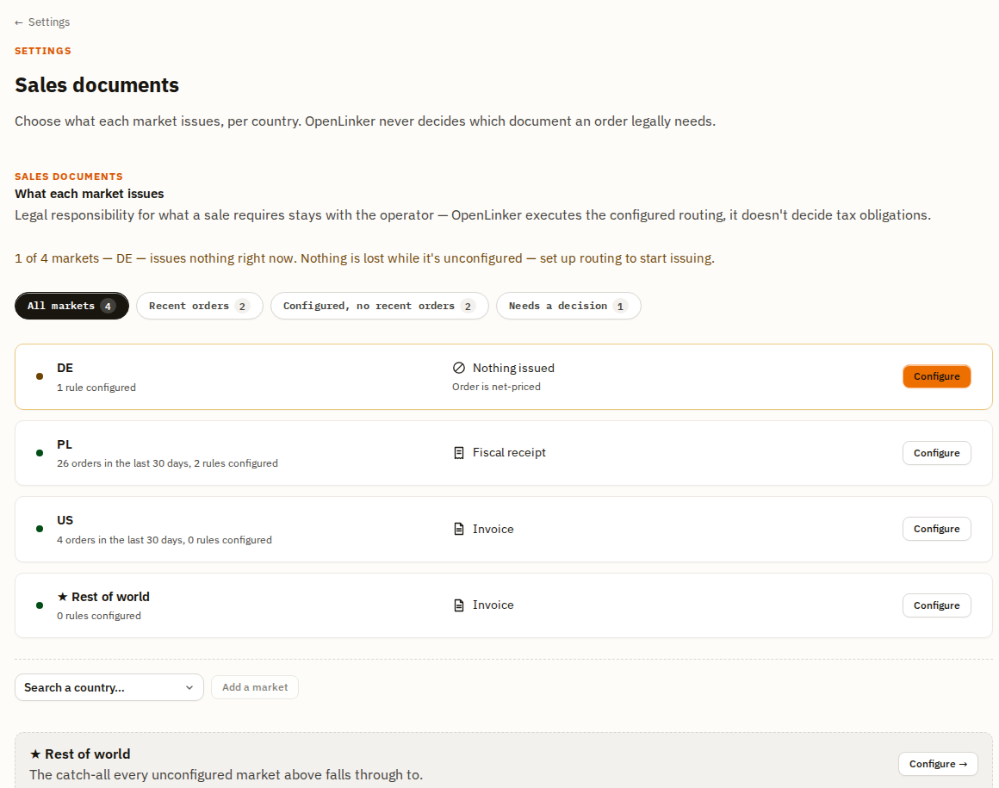
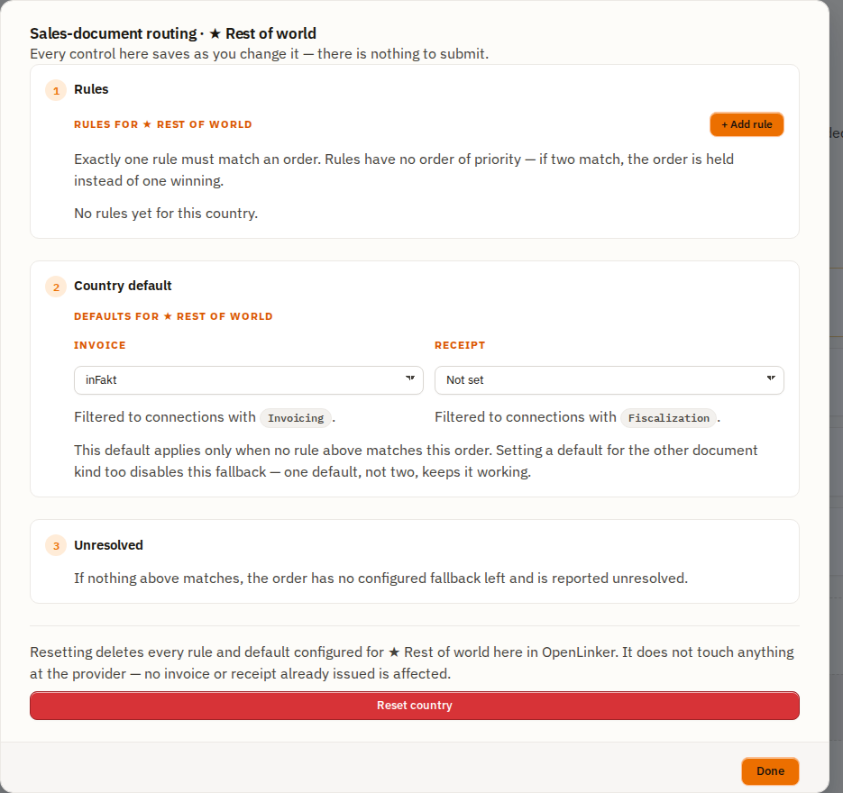
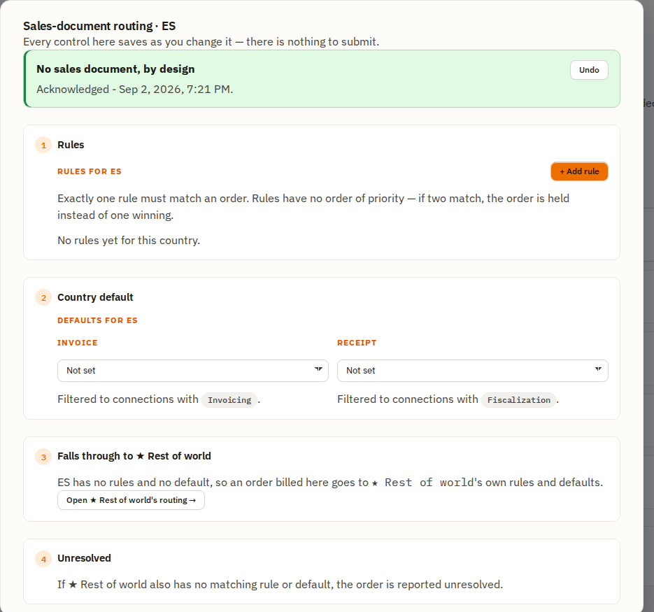
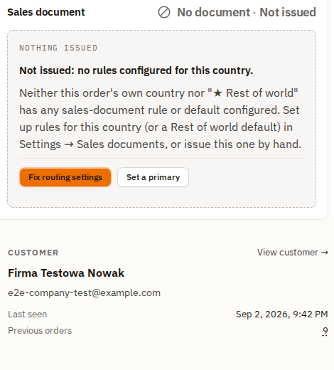
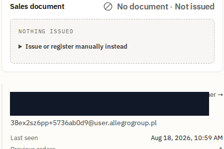
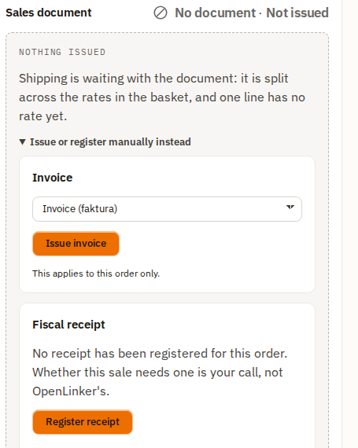
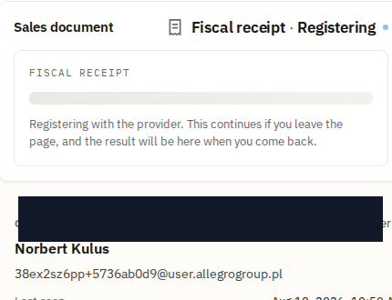
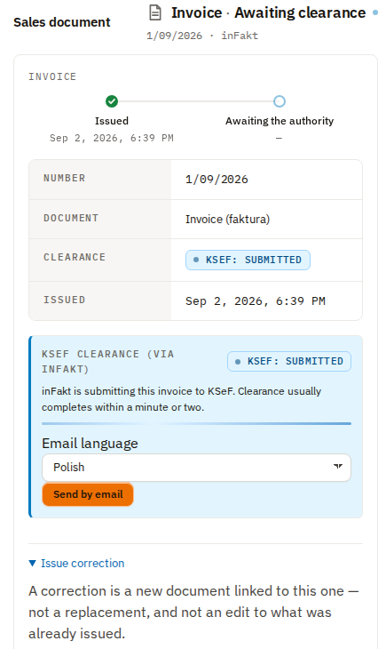
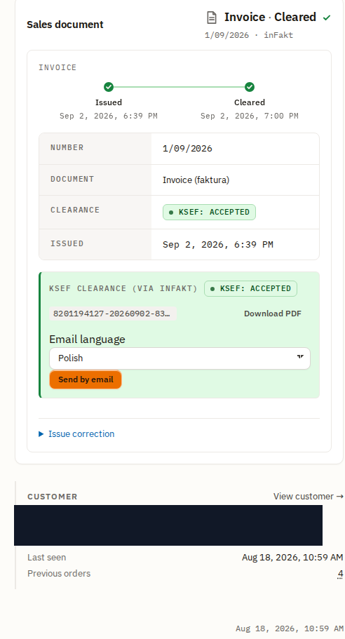

# Sales documents (routing)

OpenLinker never decides what a sale legally requires — that stays your call and
your accountant's. What it does is **execute the routing you configure**: given
an order, decide which document (an invoice, or a fiscal receipt) it gets and
through which connection, automatically, the moment the order settles. This
section covers the Settings → **Sales documents** screen where you configure
that routing, and the per-order **Sales document** panel that shows what
happened (or explains why nothing did).

If you haven't set up an invoicing or fiscalization connection yet, do that
first — see [Invoices](./04-invoices.md#prerequisites) and
[Fiscal receipts](./04a-fiscal-receipts.md#prerequisites).

---

## The idea in one sentence

For every **market** (a country your orders ship to), you tell OpenLinker: *"an
order like this gets that document, through that connection."* OpenLinker
re-evaluates this on every order and issues automatically — no daily review, no
manual clicking, unless you want it that way.

---

## Prerequisites

- At least one **active** connection with `Invoicing` and/or `Fiscalization`
  enabled (KSeF, inFakt, Subiekt, or eparagony.pl — see the two guides linked
  above).
- Knowing which of your order sources actually reports a **buyer tax ID**. As of
  this writing, only PrestaShop-sourced orders carry one (from the customer's
  address on that platform) — an order from Allegro or WooCommerce is treated
  as **not asserting** a tax ID, never as "known to have none." Any rule
  condition that reads the buyer's tax ID only ever matches an order from a
  source that reports it.

---

## Settings → Sales documents

Open **Settings → Sales documents**. This is the market list — one row per
country you've configured or that has recent order activity, plus a standing
**★ Rest of world** row that always exists.

- The **filter chips** at the top narrow the list: markets with recent orders,
  markets that are configured but haven't seen an order lately, and markets
  that genuinely need a decision from you.
- Each row shows what that market **currently issues** (or "Nothing issued" if
  it's unconfigured) and how many rules it has.
- **★ Rest of world** is the catch-all every unconfigured market falls through
  to — it always exists and is always at the bottom of the list.
- **Add a market** lets you search for and add a country that has no row yet.

Click **Configure** on any row to open that market's routing dialog.

---

## The routing dialog: four tiers

Every market's dialog follows the same four-tier ladder. An order is evaluated
top to bottom; the first tier that resolves it wins.

### Tier 1 — Rules

Rules are the sharpest tool: conditions you author yourself (buyer has a tax
ID, order total above/below a threshold, order country), each pointing at a
document type and a connection.

- **Conditions** are AND-combined — every one you add must be true for the rule
  to match. Three condition fields exist today: **Buyer has a tax ID**
  (yes/no), **Order country is** (a country code), and **Order total (gross)**
  (a comparison operator against a named threshold — never a free number, so
  the same threshold can be reused and reasoned about across rules).
- **Document & destination** picks what this rule issues and through which
  connection. The connection picker is filtered to connections that actually
  support the chosen document type.
- **Effective window** lets a rule apply only from a given date, optionally
  until another — useful when a threshold or a provider changes and you don't
  want to rewrite history.
- **Exactly one rule may match an order.** If two rules both match, the order
  is **held**, not guessed at — you'll see this reported on the order itself
  (see below).

#### Worked example: a real 3-tier setup

Here's a genuine three-rule configuration for Poland, mixing all three
condition fields, that a company seller might use — route by whether the buyer
asserted a tax ID and how large the order is:

Read top to bottom, these three rules say:

| Buyer has tax ID | Order total | → | Document | Connection |
|---|---|---|---|---|
| No | (any) | | *(falls through — no rule matches; see Tier 2/3)* | |
| Yes | < 450 PLN | → | Fiscal receipt | eparagony.pl |
| Yes | 450 – 999.99 PLN | → | Invoice | KSeF (direct) |
| Yes | ≥ 1000 PLN | → | Invoice | inFakt |

The banner above the rule list ("3 of these rules read the buyer's tax ID")
is a standing reminder that a buyer-tax-ID condition only ever matches an order
from a source that actually reports one — it isn't a warning that something is
wrong.

**Note (a known limitation as of this writing):** an `Order total (gross)`
condition requires the order to be reported with a **gross** total. Some order
sources report totals net of tax even when the buyer paid the gross amount —
an order from such a source will never match an amount-based rule, however
correctly its catalogue is tax-rated. If a country's orders are consistently
landing as **unresolved / net-priced-order** (see the order-panel section
below), this is why — check with your OpenLinker operator or the project's
issue tracker for the current state of that gap for your specific order
source.

### Tier 2 — Country default

If no rule matches (or the country has no rules at all), the **country
default** applies — a single Invoice connection and/or a single Fiscal receipt
connection, with no conditions.

- You may set an invoice default, a receipt default, or both — but only one of
  each **per market**, since setting a default for both document kinds for the
  same market would leave nothing to discriminate between them for an
  unmatched order.
- The default's connection pickers are filtered exactly like a rule's: invoice
  defaults only show `Invoicing`-capable connections, receipt defaults only
  show `Fiscalization`-capable ones.

### Tier 3 — ★ Rest of world

Every market that has **no rules and no default at all** falls through to the
standing **★ Rest of world** market — configured exactly like any other market,
with its own rules and its own default.

This is what makes Rest of world genuinely useful: set an invoice default here
once, and every market you haven't touched yet auto-issues through it — you
don't have to configure every country you might ever sell to in advance.

★ Rest of world's own dialog has only **three** tiers (Rules, Country default,
Unresolved) — never a fourth "falls through to Rest of world" tier, since it
*is* that fallback and cannot fall through to itself.

### Tier 4 — Unresolved

If nothing above matches — the market's own rules don't match, it has no
default, and ★ Rest of world doesn't resolve it either — the order is reported
**unresolved**. Nothing is issued, nothing is silently guessed, and the reason
is persisted on the order itself (see the next section).

### "No sales document, by design"

Not every market needs a document at all — maybe you don't sell there, or a
local rule makes it genuinely out of scope. Closing the dialog on a completely
untouched market routes you through a confirmation, and afterwards the market
shows a settled, explicit **acknowledgment** instead of a nagging "needs a
decision" state:

This is reversible any time via the inline **Undo** — acknowledging a market
"by design" is a statement you're making today, not a permanent lock.

---

## The order-level Sales document panel

Every order's detail page ([Orders](./06-orders.md#order-detail)) carries a
**Sales document** panel reporting what routing decided for that specific
order.

### Unresolved — no configuration for this market

If the order's market has no rule, no default, and ★ Rest of world doesn't
resolve it either, the panel says so plainly and gives you two ways forward:

- **Fix routing settings** jumps straight to that market's dialog in Settings.
- **Set a primary** is a quick, order-independent way to designate one
  connection as the fallback issuer for this document kind, if you'd rather not
  build out full rules yet.

### Not issued — rules exist, but manual override is available

Where routing resolved to *manual issuance* (or nothing has fired yet), the
panel offers a disclosure to issue or register by hand instead of waiting:

Expanding it reveals two independent cards — one for an invoice, one for a
fiscal receipt — because either, or neither, may apply to a given order:

Only one of the two can ever be exercised per order — issuing an invoice
retires the receipt card (and vice versa), since an order gets **one**
originating sales document, never both.

### In progress

Once you (or auto-issue) trigger a registration, the panel shows a live
progress state and keeps polling — you can leave the page and come back:

### Issued — the lifecycle stepper

Once a document is issued, the panel shows the **document type**, a
**lifecycle stepper**, and every provider-reported field. Two real lifecycle
states, captured live:

**Invoice submitted, awaiting the tax authority's clearance:**

**The same invoice, minutes later, after KSeF accepted it:**

A **fiscal receipt**, once registered, has no clearance step — it's a single
terminal state with every field the provider returned:

Note the receipt panel's own honesty: **"This registration is final and cannot
be corrected here."** Unlike an invoice, a fiscal receipt has no correction
primitive in OpenLinker — check with your provider directly if one is needed.

### Issuing a correction

An issued **invoice** (not a receipt) can carry a correction — a new document
linked to the original, never an edit of what was already issued. The
disclosure is visible in the "Cleared" and "Awaiting clearance" screenshots
above; opening it walks you through a per-line correction, the same flow
documented in [Invoices → Issuing a correction](./04-invoices.md#issuing-a-correction).

---

## How auto-issue actually decides (so you can predict it)

Put together, this is the full decision an order goes through the moment it
settles:

1. Does this order's own **market** have a rule that matches it? → issue there.
2. No rule matched (or none exist) — does the market have a **country
   default**? → issue there.
3. The market has **nothing configured at all** — does **★ Rest of world**
   resolve it (its own rules, then its own default)? → issue there.
4. Nothing above resolved it → the order is **unresolved**. Nothing is issued,
   and the reason is persisted and shown on the order (see above).

Two things are true by design, not by accident:

- **Two matching rules never mean "pick one."** If a market's rules are
  ambiguous for a given order, that order is held, exactly like an unresolved
  one — a wrong pick on a fiscal document is a legal event, not a UX
  inconvenience.
- **An order never silently routes through a connection just because it's
  marked "primary."** A connection's primary flag only matters for the
  quick **Set a primary** fallback mentioned above — it has no effect on rule
  or default evaluation, and a market with no rule or default genuinely stays
  unresolved rather than picking whatever connection happens to be marked
  primary.

---

## What's next

→ **[Listings & Offers](./05-listings.md)** — create marketplace offers from
your synced catalog

Need the connection-level detail first? See **[Invoices](./04-invoices.md)**
and **[Fiscal receipts](./04a-fiscal-receipts.md)** for the Invoices list,
invoice detail page, and the fiscal-receipt connection setup this routing
depends on.
