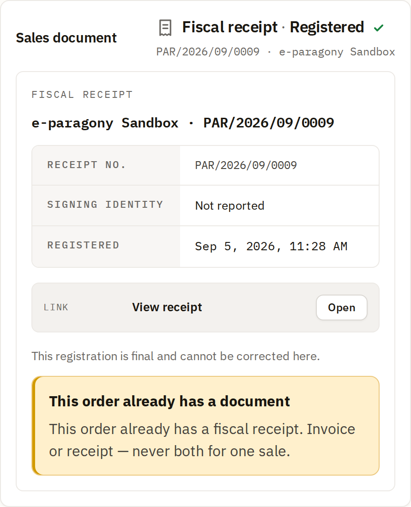

# Sales documents (routing)

OpenLinker never decides what a sale legally requires — that stays your call and
your accountant's. What it does is **execute the routing you configure**: given
an order, decide which document (an invoice, or a fiscal receipt) it gets and
through which connection, automatically, the moment the order settles. This
section walks through the Settings → **Sales documents** screen where you
configure that routing, and the per-order **Sales document** panel that shows
what happened (or explains why nothing did).

If you haven't set up an invoicing or fiscalization connection yet, do that
first — see [Invoices](./04-invoices.md#prerequisites) and
[Fiscal receipts](./04a-fiscal-receipts.md#prerequisites).

This page is the screen-by-screen walkthrough. Three shorter reference pages
sit alongside it and go deeper on one question each:

- [How OpenLinker decides which document a sale gets](../sales-documents-how-routing-decides.md) — the decision, in prose, for working out why one order got what it got.
- [Setting up a market](../sales-documents-setting-up-a-market.md) — a checklist for configuring a country the first time.
- [Sales document states](../sales-documents-state-reference.md) — every state an order can show, and what to do about it.

---

## The idea in one sentence

For every **market** (a country your orders are delivered to), you tell
OpenLinker: *"an order like this gets that document, through that connection."*
OpenLinker re-evaluates this on every order and issues automatically — no daily
review, no manual clicking, unless you want it that way.

---

## Prerequisites

- At least one **active** connection with `Invoicing` and/or `Fiscalization`
  enabled (KSeF, inFakt, Subiekt, or eparagony.pl — see the two guides linked
  above).
- Knowing which of your order sources actually reports a **buyer tax ID**, if
  you plan to write rules that read one. All four sources can report it, but
  each only under its own condition: PrestaShop when the buyer filled in a VAT
  number on the address; Allegro and Erli when the buyer requested a VAT
  invoice; WooCommerce only if the store runs a supported VAT-number plugin. An
  order whose source asserted nothing is treated as **not asserting** a tax ID —
  never as "known to have none" — so a rule reading that condition neither
  matches nor rejects it. It simply never fires for that order.

---

## Settings → Sales documents

Open **Settings → Sales documents**. This is the market list — one row per
country you have configured, plus every country that has had recent order
activity.

- The **summary line** above the list says how many markets currently issue
  nothing, and states plainly that nothing is lost while they are unconfigured.
- Rows are **ordered and highlighted, not filtered** — every market needing a
  decision is listed first and drawn highlighted; markets that are already
  routing follow, plain. There is no filter control to set; the ordering is the
  whole mechanism.
- Each row shows the market's rule count, its order count over the last 30 days,
  what it **currently issues** (or *Nothing issued*), and — when it issues
  nothing — a short reason such as *No routing anywhere* or *Order is
  net-priced*.
- The row's action is **Set up** for a market that needs a decision (or **Use
  starter setup** where OpenLinker ships a template for that country), and
  **Configure** for one that is already routing.
- Below the list, a table shows **every country carrying rules, defaults, or a
  no-document acknowledgment**, with what each kind defaults to.
- **Add country** takes any ISO 3166-1 alpha-2 code — and `*`, which opens
  **★ Rest of world**. Rest of world has no standing row in the list; `*` is how
  you reach it.

Where OpenLinker ships a **starter template** for a country (Poland is the only
one today), the page offers it below the list: the template's rules with a
connection picker each, its cited public source, and a plain statement that this
is not legal advice and nothing is active until you adopt it.

---

## The routing dialog: four tiers

Every market's dialog follows the same four-tier ladder. An order is evaluated
top to bottom; the first tier that resolves it wins. Every control saves as you
change it — there is nothing to submit.

### Tier 1 — Rules

Rules are the sharpest tool: conditions you author yourself, each pointing at a
document type and a connection.

- **Conditions** are AND-combined — every one you add must be true for the rule
  to match. Three condition fields exist today: **Buyer has a tax ID**
  (yes/no), **Order country is**, and **Order total (gross)** (a comparison
  against a *named threshold*, never a free number, so the same threshold can be
  reused and reasoned about across rules).
- **Document type** is Invoice or Receipt.
- **Integration** picks the connection that issues it, filtered to connections
  that actually support the chosen document type.
- **Effective from** and **Effective to (optional)** let a rule apply only from
  a given date, optionally until another — useful when a threshold or a provider
  changes and you don't want to rewrite history.
- **Exactly one rule may match an order.** Rules have no priority and no order.
  If two rules both match, the order is **held**, not guessed at — you'll see
  this reported on the order itself.

The composer also warns you where a condition cannot match on **your** install
— if no order OpenLinker has seen carries a buyer tax ID yet, a rule reading one
is flagged as unable to fire until that data arrives.

#### Worked example: three rules for Poland

Here is a genuine three-rule configuration for Poland that a company seller
might use — route by whether the buyer asserted a tax ID and how large the order
is:

Read together, these three rules say:

| Buyer has tax ID | Order total | → | Document | Connection |
|---|---|---|---|---|
| Yes | below `pl-simplified-invoice-2026` (450 PLN) | → | Receipt | eparagony |
| Yes | at or above `pl-simplified-invoice-2026`, below `pl-full-invoice-1000-2026` (450–999.99 PLN) | → | Invoice | KSeF (direct, test) |
| Yes | at or above `pl-full-invoice-1000-2026` (1000 PLN) | → | Invoice | inFakt |

The screenshot shows the threshold **names**, not the amounts, because a name is
what a rule stores — on this install `pl-simplified-invoice-2026` is 450 PLN and
`pl-full-invoice-1000-2026` is 1000 PLN. The third rule also carries an end date
(`ends 2026-12-31`); the other two run indefinitely.

A threshold is defined in one currency, and amounts are **never converted** when
routing decides. An order priced in a different currency therefore matches no
amount-based rule and is reported as a currency mismatch — see
[How routing decides](../sales-documents-how-routing-decides.md) for that state
and its remedy.

An order where the buyer asserted no tax ID matches none of them and falls to
Tier 2.

The banner above the rule list — **"3 rules read the buyer's tax ID"** — is a
standing count, not an error, and it carries the caveat that matters: a
buyer-tax-ID condition only matches an order whose source actually recorded that
fact. On an install whose sources rarely report one, a market built entirely out
of tax-ID rules will fall to its default on almost every order, so keep a
default in place beneath them.

**Note (a known limitation as of this writing):** an `Order total (gross)`
condition needs the order to be reported with a **gross** total. Some order
sources report totals net of tax even when the buyer paid the gross amount — an
order from such a source can never match an amount-based rule. If a market's
orders are consistently landing as **Order is net-priced**, this is why; the
remedy is a condition that does not depend on the total.

### Tier 2 — Country default

If no rule matches (or the country has no rules at all), the **country default**
applies — one connection, no conditions.

You can set an invoice default and a receipt default separately. **Setting both
disables the fallback**: the tier then has nothing to choose between, so every
order that no rule matched is held instead of issued. The dialog says so under
the pickers, and this is the single most common way a market ends up issuing
nothing while looking configured. Set one, not two — or add a rule that decides
between them.

The default's pickers are filtered exactly like a rule's: the invoice default
lists `Invoicing`-capable connections, the receipt default `Fiscalization`-capable
ones.

### Tier 3 — depends on whether the market is configured

Tier 3 is the one tier whose meaning changes, and reading it wrong is the
easiest way to misconfigure a market:

- On a market with **no rules and no default at all**, Tier 3 reads *Falls
  through to ★ Rest of world* — the order goes to Rest of world's own rules and
  defaults, and the dialog links straight there.
- On a market that carries **any** rule or default of its own, Tier 3 reads *An
  unmatched order is held*. A configured market never falls through. If its own
  rules and default produce no answer, the order stops there.

That distinction matters when you are debugging: setting up Rest of world does
not rescue a configured market that is not working.

This is what makes Rest of world useful: set an invoice default there once, and
every market you have not touched auto-issues through it — you don't have to
configure every country you might ever sell to in advance.

Its own dialog is the one place with only **three** tiers (Rules, Country
default, Unresolved). There is no fall-through tier because Rest of world *is*
the fall-through, and it cannot fall through to itself.

### Tier 4 — Unresolved

If nothing above resolved the order, it is reported **unresolved**. Nothing is
issued, nothing is silently guessed, and the reason is persisted on the order
itself (see the next section).

### "No sales document, by design"

Not every market needs a document at all — maybe you don't sell there, or a
local rule puts it out of scope. An untouched market's dialog offers **Mark as
no sales document** at the top, so operators can tell a deliberate decision apart
from a market nobody has looked at yet:

The acknowledgment is a statement you are making today, not a permanent lock —
the market keeps its dialog and you can configure it whenever you like.

---

## The order-level Sales document panel

Every order's detail page ([Orders](./06-orders.md#order-detail)) carries a
**Sales document** panel reporting what routing decided for that specific order.
[Sales document states](../sales-documents-state-reference.md) is the full
reference; the states below are the ones you will meet most.

### Unresolved — no routing anywhere

If the order's market has no rule and no default, and ★ Rest of world doesn't
resolve it either, the panel says so plainly:

The one action offered is **Set a primary**, which designates a connection as
the fallback issuer so orders like this one start issuing without full rules.
The panel does not link into Settings — set the routing up from
Settings → Sales documents, or issue this order by hand from the cards below.

### Not issued — issuing by hand

Where the connection is configured to issue by hand, the panel says nothing is
wrong and offers both cards inline — one for an invoice, one for a fiscal
receipt, because either, or neither, may apply to a given order:

Each card notes that it **applies to this order only** — issuing here changes
nothing about the market's routing.

Only one of the two can be exercised per order. Once either has been used, the
other is replaced by a blocking notice — *This order already has a document* —
because an order gets **one** originating sales document, never both. The two
notices differ: an existing invoice tells you to void it first if a receipt is
what the order actually needed.

### In progress

Once you (or auto-issue) trigger a registration, the panel's heading switches to
**Registering** and the page keeps polling for the result. Registering continues
even if you navigate away, and the panel says so — except where the order already
carries a document, as in the capture below, and the blocking notice takes that
space instead:

### Issued — the lifecycle stepper

Once a document is issued, the panel shows the **document type**, a **lifecycle
stepper**, and every provider-reported field. Two real lifecycle states,
captured live:

**Invoice submitted, awaiting the tax authority's clearance:**

**The same invoice, after KSeF accepted it:**

Note the two words for one thing: the panel's own heading and stepper say
**Cleared**, while the clearance field reports the authority's own answer,
**KSEF: ACCEPTED**. The Invoices pages use the authority's word throughout, so
expect *Accepted* there.

A **fiscal receipt**, once registered, has no clearance step — it is a single
terminal state with every field the provider returned:

Note the receipt panel's own honesty: **"This registration is final and cannot
be corrected here."** Unlike an invoice, a fiscal receipt has no correction
primitive in OpenLinker — talk to your provider directly if one is needed.

### Issuing a correction

An issued **invoice** (not a receipt) can carry a correction — a new document
linked to the original, never an edit of what was already issued. The action is
visible in both invoice screenshots above; it walks you through a per-line
correction, the same flow documented in
[Invoices → Issuing a correction](./04-invoices.md#issuing-a-correction).

---

## How auto-issue actually decides (so you can predict it)

Put together, this is the decision an order goes through the moment it settles:

1. Does this order's own **market** have a rule that matches it? → issue there.
2. No rule matched (or none exist) — does the market have a **country default**?
   → issue there.
3. The market has **nothing configured at all** — does **★ Rest of world**
   resolve it (its own rules, then its own default)? → issue there.
4. Nothing above resolved it → the order is **unresolved**, and the reason is
   persisted and shown on the order.

Two things are worth stating plainly, because both surprise people:

- **Two matching rules never mean "pick one."** If a market's rules are
  ambiguous for an order, that order is held exactly like an unresolved one — a
  wrong pick on a fiscal document is a legal event, not a UX inconvenience.
- **A connection's "primary" flag is a last resort, not a routing input.** It
  has no effect on rule or default evaluation at all. It is consulted only when
  the market, *and* Rest of world, have nothing configured: if exactly one
  connection could issue, that one is used; if several could, the one marked
  primary wins; if several could and none is primary, the order is held. So an
  install with a primary set and no routing anywhere still issues — which is
  usually what you want, and worth knowing before you conclude that an
  unconfigured market issues nothing.

---

## What's next

→ **[Listings & Offers](./05-listings.md)** — create marketplace offers from
your synced catalog

Need the connection-level detail first? See **[Invoices](./04-invoices.md)**
and **[Fiscal receipts](./04a-fiscal-receipts.md)** for the Invoices list,
invoice detail page, and the fiscal-receipt connection setup this routing
depends on.
