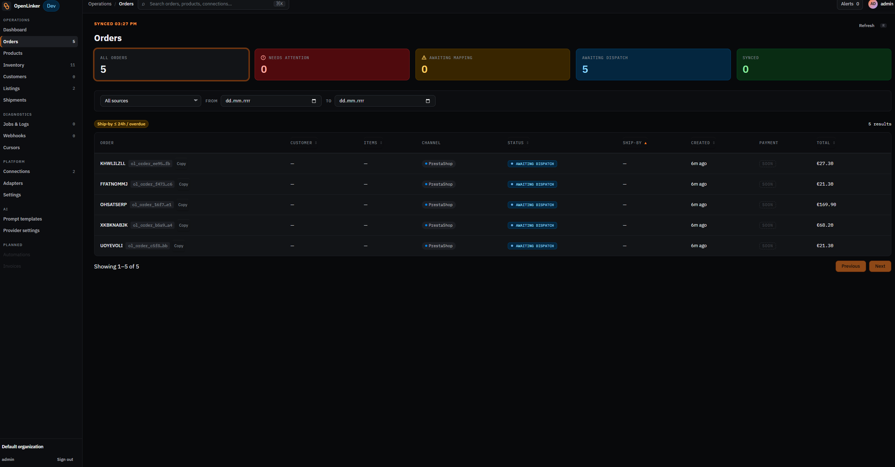
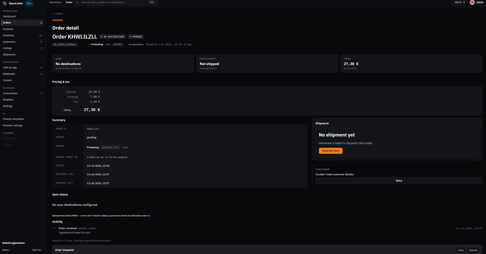
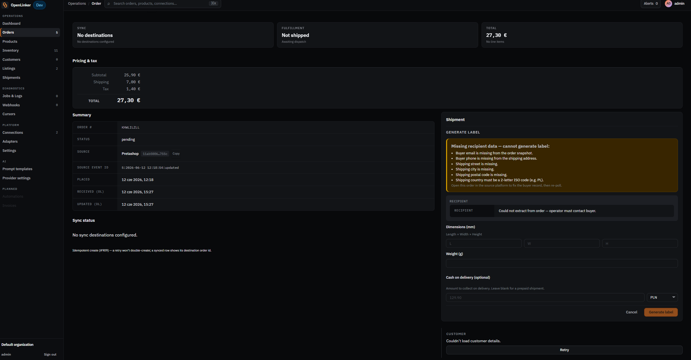

# Orders

OpenLinker ingests orders from every connected marketplace and shop automatically. Each incoming order is mapped to an internal representation, the buyer is provisioned as a customer in the destination shop (PrestaShop / WooCommerce), and the order is created in that shop. This section covers the Orders list and detail pages.

---

## How orders arrive

Orders are ingested in two ways:

- **Webhooks (primary path)** — when a buyer places an order on Allegro, Allegro sends a webhook to OpenLinker in near-real-time. OpenLinker validates the signature, deduplicates the event, and enqueues a `marketplace.order.sync` job.
- **Polling (reconciliation fallback)** — every 10 minutes OpenLinker polls each connected source for orders changed since the last run (using a cursor — see [Diagnostics](./06-diagnostics.md)). This heals any orders that were dropped or missed by the webhook path.

Both paths converge on the same idempotent ingestion logic — an order arriving twice is processed once.

---

## Orders list

Open **Orders** in the sidebar (under **Operations**).

<!-- screenshot: orders list showing summary cards at the top and order rows with status chips, channel, and amount columns -->

### Summary cards

Five cards at the top give a quick breakdown:

| Card | Meaning |
|---|---|
| **All orders** | Total number of ingested orders |
| **Needs attention** | Orders with an error or blocked state requiring manual action |
| **Awaiting mapping** | Orders where a product variant couldn't be matched to the catalog |
| **Awaiting dispatch** | Orders confirmed in the destination shop, ready for shipment |
| **Synced** | Orders fully processed with shipment status updated |

The **last synced** timestamp and a **Refresh** button appear in the top-right corner.

### Filter bar

Filter the list by **source connection** (dropdown) and by a **date range** (FROM / TO). Active filter tags appear below the filter bar — for example, "Ship-by ≤ 24h / overdue" highlights orders approaching their dispatch deadline.

### Order list columns

| Column | Description |
|---|---|
| **Order** | Short order reference + internal ID (`ol_order_*`), with a Copy button |
| **Customer** | Buyer name or email (depending on PII configuration) |
| **Items** | Number of line items |
| **Channel** | Source platform (e.g. `PrestaShop`, `Allegro sandbox`) |
| **Status** | Current order status chip |
| **Ship-by** | Required dispatch date (from marketplace SLA) |
| **Created** | When the order was placed on the source platform |
| **Payment** | Payment method |
| **Total** | Order amount with currency |

### Order statuses

| Status | Meaning |
|---|---|
| **pending** | Order ingested, not yet processed in the destination shop |
| **awaiting_dispatch** | Order confirmed in the destination shop, awaiting shipment dispatch |
| **sent** | Shipment dispatched; tracking number recorded |
| **delivered** | Delivery confirmed |
| **cancelled** | Order cancelled by buyer or seller |
| **returned** | Return processed |

---

## Order detail

Click any order row to open the order detail page.

<!-- screenshot: order detail page showing the order header, summary fields, pricing section, activity log, and shipment panel -->

### Header

The header shows three summary tiles:
- **Destinations** — how many destination shops this order has been pushed to
- **Shipment status** — whether the order has been dispatched ("Not shipped" / shipment details)
- **Total** — order amount

### Pricing & tax

A breakdown of subtotal, shipping, tax, and total.

### Summary

Key order metadata:
- **Name** — the marketplace order reference
- **Status** — current lifecycle status
- **Source** — which connection this order came from
- **Source event ID** — the marketplace-native event identifier
- **Placed / Received / Modified / Updated** — lifecycle timestamps

### Sync status

Shows whether the order has been synced to a destination shop. If "No sync destinations configured" appears, no destination shop connection has been set up yet.

### Activity

A chronological log of significant events in the order's lifecycle:
- **Order received** — when OpenLinker first ingested the order
- **Logged and ready for sync** — order saved and queued for destination processing
- **Order created** — when the PrestaShop/WooCommerce order was created
- **Status updates** — each status change

If order creation failed, the activity log shows the failure reason. Check **Jobs & Logs** for the full job payload and error detail.

### Shipment panel

<!-- screenshot: order detail — Shipment section showing "Generate label" form or tracking details once a shipment is dispatched -->

The shipment panel is on the right side of the order detail. Before dispatch it shows a **Generate label** button. Once a shipment is associated it shows:

- **Carrier** — the physical carrier (InPost, DHL, etc.)
- **Tracking number** — the carrier's tracking reference
- **Pickup point** (InPost paczkomat orders) — the selected paczkomat machine ID and address

Shipment data is pushed to the destination shop automatically. For InPost, tracking status updates arrive via webhook (if configured) or are polled on a schedule.

---

## Troubleshooting a missing order

If an order you expect to see hasn't appeared:

1. **Check Jobs & Logs** — search for `marketplace.order.sync` jobs around the time the order was placed. A `dead` status means the job exhausted its retries; click the job for the error detail.
2. **Check the Webhooks log** — if the order arrived via webhook, it will appear in the **Webhooks** delivery log. A missing entry means the webhook was never delivered to OpenLinker (check the Allegro developer console for delivery failures).
3. **Check Cursors** — if the poll cursor is stuck, orders after a certain timestamp won't be re-fetched. See [Diagnostics → Cursors](./06-diagnostics.md#cursors) for how to inspect and reset.

---

## What's next

When something isn't working as expected, the Diagnostics surfaces help you investigate:

→ **[Diagnostics](./06-diagnostics.md)** — Jobs & Logs, Webhooks, Cursors
