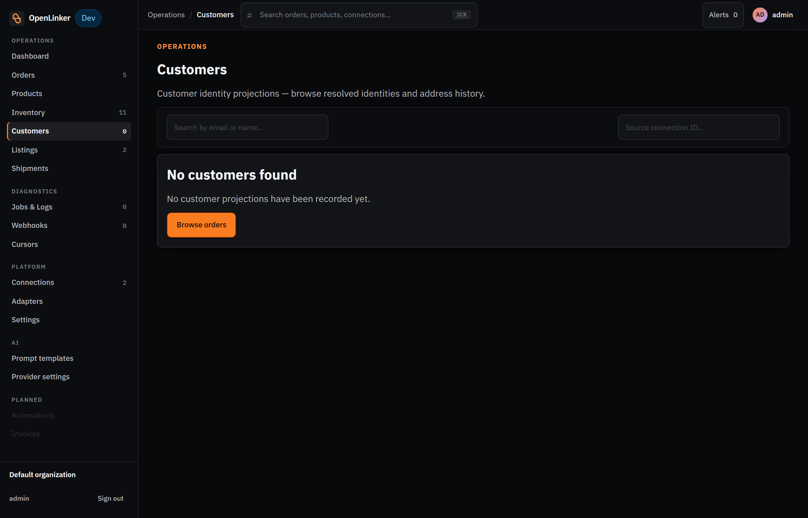

# Orders

OpenLinker ingests orders from every connected marketplace and shop automatically. Each incoming order is mapped to an internal representation, the buyer is provisioned as a customer in the destination shop (PrestaShop / WooCommerce), and the order is created in that shop. This section covers the Orders list and detail pages.

---

## How orders arrive

Orders are ingested in two ways:

- **Webhooks (primary path)** — when a buyer places an order on Allegro, Allegro sends a webhook to OpenLinker in near-real-time. OpenLinker validates the signature, deduplicates the event, and enqueues a `marketplace.order.sync` job.
- **Polling (reconciliation fallback)** — every 10 minutes OpenLinker polls each connected source for orders changed since the last run (using a cursor — see [Diagnostics](./06-diagnostics.md)). This heals any orders that were dropped or missed by the webhook path.

Both paths converge on the same idempotent ingestion logic — an order arriving twice is processed once.

---

## Orders list

Open **Orders** in the sidebar (under **Operations**).

<!-- screenshot: orders list showing summary cards at the top and order rows with status chips, channel, and amount columns -->

### Summary cards

Five cards at the top give a quick breakdown:

| Card | Meaning |
|---|---|
| **All orders** | Total number of ingested orders |
| **Needs attention** | Orders with an error or blocked state requiring manual action |
| **Awaiting mapping** | Orders where a product variant couldn't be matched to the catalog |
| **Awaiting dispatch** | Orders confirmed in the destination shop, ready for shipment |
| **Synced** | Orders fully processed with shipment status updated |

The **last synced** timestamp and a **Refresh** button appear in the top-right corner.

### Filter bar

Filter the list by **source connection** (dropdown) and by a **date range** (FROM / TO). Active filter tags appear below the filter bar — for example, "Ship-by ≤ 24h / overdue" highlights orders approaching their dispatch deadline.

### Order list columns

| Column | Description |
|---|---|
| **Order** | Short order reference + internal ID (`ol_order_*`), with a Copy button |
| **Customer** | Buyer name or email (depending on PII configuration) |
| **Items** | Number of line items |
| **Channel** | Source platform (e.g. `PrestaShop`, `Allegro sandbox`) |
| **Status** | Current order status chip |
| **Ship-by** | Required dispatch date (from marketplace SLA) |
| **Created** | When the order was placed on the source platform |
| **Payment** | Payment method |
| **Total** | Order amount with currency |

### Order statuses

| Status | Meaning |
|---|---|
| **pending** | Order ingested, not yet processed in the destination shop |
| **awaiting_dispatch** | Order confirmed in the destination shop, awaiting shipment dispatch |
| **sent** | Shipment dispatched; tracking number recorded |
| **delivered** | Delivery confirmed |
| **cancelled** | Order cancelled by buyer or seller |
| **returned** | Return processed |

---

## Order detail

Click any order row to open the order detail page.

<!-- screenshot: order detail page showing the order header, summary fields, pricing section, activity log, and shipment panel -->

### Header

The order title and status badges are shown at the top: the order reference, source platform chip (e.g. `Pretashop`), and lifecycle status badges (e.g. `NO DESTINATIONS`, `PENDING`). Below the header, three summary panels provide a quick read:

- **SYNC** — whether the order has been pushed to a destination shop ("No destinations configured" = no destination set up yet)
- **FULFILLMENT** — shipment status ("Not shipped / Awaiting dispatch" or shipment details once dispatched)
- **TOTAL** — order value

### Pricing & tax

A breakdown of subtotal, shipping, tax, and total.

### Summary

Key order metadata displayed in a definition list:
- **Order #** — the marketplace order reference
- **Status** — current lifecycle status
- **Source** — which connection this order came from (with connection ID)
- **Source event ID** — the marketplace-native event identifier
- **Placed** — when the order was placed on the source platform
- **Received (OL)** — when OpenLinker first ingested the order

### Sync status

Shows the destination sync state. "No sync destinations configured. Idempotent create — a retry won't double-create; a synced row shows its destination order ID." means no destination shop has been connected yet.

### Shipment panel

The shipment panel is on the right side of the order detail. Before dispatch it shows a **Generate label** button. Clicking it expands the label-generation form:

- **Missing recipient data** warning — lists any required fields that could not be extracted from the order (e.g. buyer email, phone, street, city, postal code, country ISO). If this appears, the operator needs to obtain the missing details directly from the buyer.
- **Recipient** — extracted from the order; shows "Could not extract from order — operator must contact buyer" if data is missing.
- **Dimensions (mm)** — Length, Width, Height fields
- **Weight (g)**
- **Cash on delivery (optional)** — amount and currency to collect on delivery

Once a shipment label is generated and the order is dispatched, the panel shows:
- **Carrier** — the physical carrier (InPost, DHL, etc.)
- **Tracking number** — the carrier's tracking reference
- **Pickup point** (InPost paczkomat orders) — the selected paczkomat machine ID and address

Shipment data is pushed to the destination shop automatically. For InPost, tracking status updates arrive via webhook (if configured) or are polled on a schedule.

---

## Troubleshooting a missing order

If an order you expect to see hasn't appeared:

1. **Check Jobs & Logs** — search for `marketplace.order.sync` jobs around the time the order was placed. A `dead` status means the job exhausted its retries; click the job for the error detail.
2. **Check the Webhooks log** — if the order arrived via webhook, it will appear in the **Webhooks** delivery log. A missing entry means the webhook was never delivered to OpenLinker (check the Allegro developer console for delivery failures).
3. **Check Cursors** — if the poll cursor is stuck, orders after a certain timestamp won't be re-fetched. See [Diagnostics → Cursors](./06-diagnostics.md#cursors) for how to inspect and reset.

---

## Customers

Open **Customers** in the sidebar (under **Operations**).

<!-- screenshot: customers list showing empty state with Browse orders CTA -->

The Customers page shows **customer identity projections** — OpenLinker's internal view of every buyer whose order has been processed. A projection is created automatically the first time an order arrives for a buyer; it is not editable here.

### What is a customer projection?

When an order arrives from Allegro (or another source), OpenLinker resolves the buyer's identity and provisions them in the destination shop (e.g. PrestaShop). The projection stored here is a lightweight, non-authoritative copy used for:

- **Lookup** — confirm which internal customer ID maps to a buyer
- **Debugging** — trace an order back to its buyer if an identity-resolution issue occurred
- **Retry support** — allows order re-processing without re-fetching from the source platform

### Filter bar

- **Search by email or name** — find a customer by their email address or display name
- **Source connection ID** — filter projections originating from a specific connection

### Empty state

If no orders have been processed yet, the page shows "No customer projections have been recorded yet." with a **Browse orders** shortcut. Projections appear as orders are ingested — you don't create them manually.

---

## What's next

When something isn't working as expected, the Diagnostics surfaces help you investigate:

→ **[Diagnostics](./06-diagnostics.md)** — Jobs & Logs, Webhooks, Cursors
