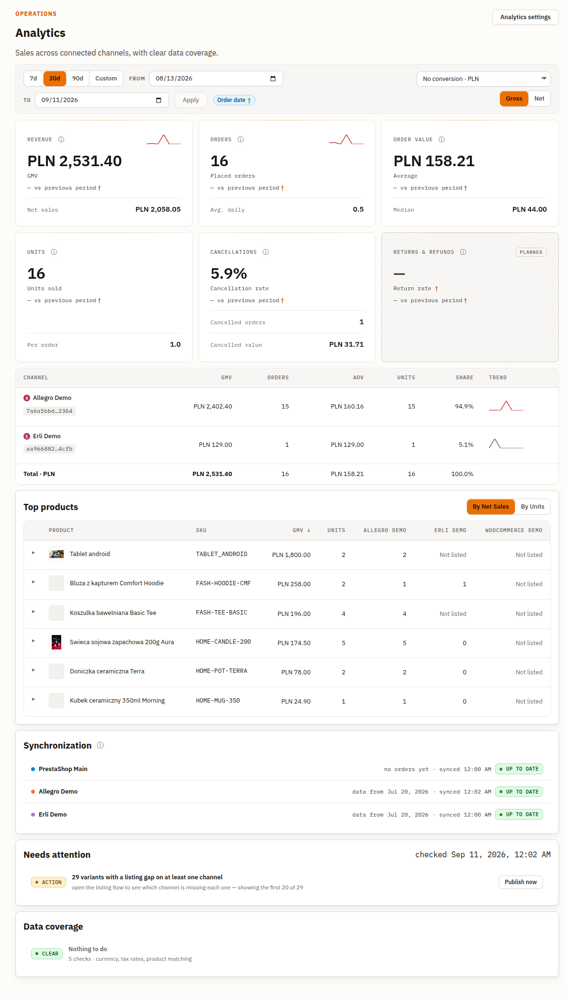
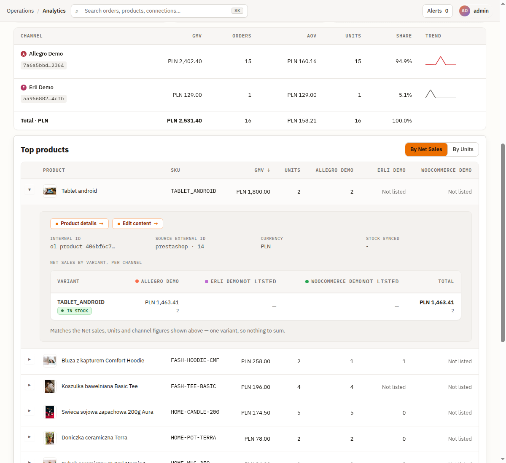
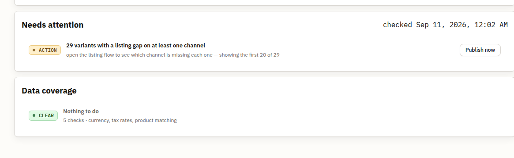
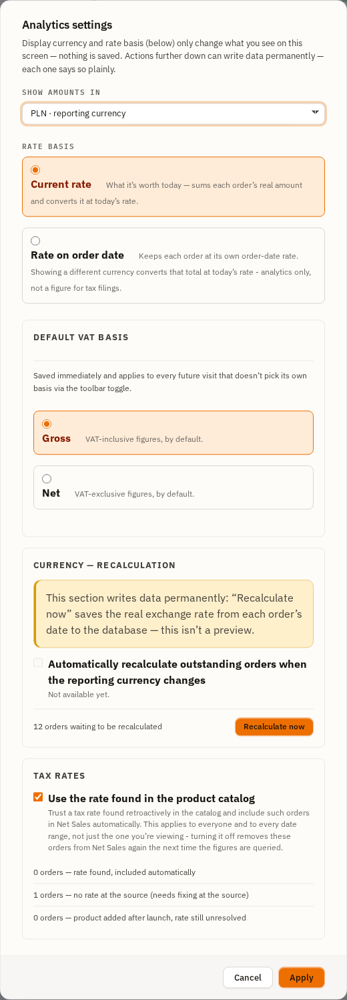

# Analytics

The Analytics page (`/`, also reachable at `/analytics`) is the operator-facing revenue dashboard —
sales across every connected channel, in one comparable currency, with an explicit account of what
data is missing or in flux rather than a silent guess. This section covers the date-range toolbar,
the display-currency and VAT-basis controls, every KPI card, the channel and product tables, the
Needs Attention and Data Coverage panels, and the Analytics Settings dialog.

If a figure here contradicts a number you'd compute by hand from raw platform exports, that's
usually the point — see the per-metric definitions below and the Data Coverage panel, which exists
specifically to surface the orders a figure is *not yet* counting.

---

## Prerequisites

- At least one **active** connection with the `OrderSource` capability enabled and orders already
  ingested (Allegro, PrestaShop, WooCommerce, Erli — see [Connecting a Platform](./02-connecting-a-platform.md)).
- With no connection configured yet, the KPI cards and tables render at zero and the Synchronization
  panel has nothing to list — there's nothing broken to diagnose, just nothing ingested yet.

---

## The date-range toolbar

- **7d / 30d / 90d** — quick preset ranges, always ending today.
- **Custom** sets the toolbar's highlight to Custom and focuses the **From** field — the **From** /
  **To** date pickers and the **Apply** button are always rendered, not disclosed by picking this
  option. Both dates are plain calendar days; the range is inclusive of the whole of the end date.
- A **400-day limit** applies to the sales, channel/product, and Data Coverage reads — every one of
  them takes the selected range and rejects a wider one with an explicit "Range too wide" error
  rather than silently truncating. The **Needs attention** panel is different: it takes no date
  range at all — coverage gaps, stock at risk, and stuck-sync value are reported across the whole
  install, independent of whatever range you're viewing.
- **Order date** (the small pill next to Apply, marked with a dagger) currently carries a
  **disclaimer**, not a confirmation: hovering or focusing it today reads **"This range doesn't
  filter results yet — coming soon."** That reads as stale against the sales/coverage reads
  actually being range-scoped end to end — a real product inconsistency, filed as
  [#3032](https://github.com/openlinker-project/openlinker/issues/3032) with a fix proposed in
  [#3130](https://github.com/openlinker-project/openlinker/pull/3130) (not yet merged at the time of
  writing). This page quotes the pill's **actual, currently-shipped** text rather than the intended
  future one, per this file's own rule of tracking what's really live. Once #3130 merges, this
  paragraph should be updated to match. Separately, and unrelated to that pill: every metric
  definition below is bucketed by an order's own **placement** date, never its sync or payment date
  — see the two rules under [KPI strip metric definitions](#kpi-strip-metric-definitions).
- Changing the range re-runs the KPI strip, the channel/product tables, and the Data Coverage panel
  — all of which take the selected range, including the trend sparkline embedded in each KPI card
  and channel row: a week-long range renders a daily trend, a longer one resamples into up to seven
  buckets so the shape stays legible without a dense chart. The Needs Attention panel does **not**
  change with the range, per the note above.

---

## Display currency and rate basis

The **display currency** picker sits at the top-right of the toolbar. It is a **view-only**
preference — it changes what you see, never what is stored — and lives in the URL
(`?displayCurrency=`), so a link you copy while viewing EUR opens the same way for the next person.

- The default option reads **"No conversion · {reporting currency}"** — the deployment-wide
  reporting currency an admin configured in Settings (or the `EUR` fallback default), shown exactly
  as stamped, with no conversion applied. It deliberately does **not** say "Current rate" — that
  phrase names a *rate-basis mode* used only when a conversion is actually happening (see below), and
  reusing it for the option that performs no conversion at all would put one phrase on two different
  axes.
- Every other option reads **"Convert to {code}"**: the dashboard's native figures are converted on
  the fly.
- Two **rate-basis** modes govern *how* a conversion is done, chosen in the Analytics Settings
  dialog (below) or via the `?rateBasis=` URL param:
  - **Current rate** — sums each order's real, already-stamped amount and converts the total at
    today's exchange rate. What the revenue is worth *right now*.
  - **Rate on order date** — keeps every order at the rate that applied on its own order date, then
    converts *that* total at today's rate only if you're viewing a different display currency than
    the one it was stamped in. Analytics-only — this is never the rate a fiscal document uses.

A conversion banner appears directly under the toolbar whenever a conversion is active, stating
which of the two modes is in effect and, if the live rate couldn't be fetched, that the figures
below fall back to the last successfully stamped rate rather than silently converting at zero.

**What deliberately never converts**: the per-channel Synchronization panel's "data from" dates,
and any order still awaiting its own currency stamp (see Data Coverage → currency, below) — those
stay in the panel's own **unconverted** count until the stamp exists, rather than being folded into
a total that would then mix currencies invisibly.

---

## The Net / Gross toggle

Directly below the display-currency picker sits a small **Gross | Net** segmented control — a
VAT-basis toggle for the figures that actually have two versions of themselves: the **Revenue** and
**Order value** cards. Units Sold/Units per Order, the Cancellations card, and every trend sparkline
are unaffected by this toggle — there is only one version of a unit count or a cancellation rate.

- **Gross** (the default) — VAT-inclusive figures: GMV, gross AOV, gross Median.
- **Net** — VAT-exclusive figures: Net Sales substitutes for GMV, and AOV/Median switch to their
  net value field. Every other rule (which orders count, currency conversion, the date cohort)
  stays identical between the two — this is a *view* of the same order population, not a second
  metric definition.

Like the currency picker, this toggle is **URL-state** (`?netGrossBasis=`) and changes nothing
persisted — reload the page with no override and it falls back to whatever default an admin saved
in Analytics Settings.

**Worked example** — the same 30-day window, same connections, toggled between the two bases:

| | Gross | Net |
|---|---|---|
| Revenue card | GMV: **PLN 2,531.40** | Net Sales: **PLN 2,058.05** |
| Order value — Average | **PLN 158.21** | **PLN 128.63** |
| Order value — Median | **PLN 44.00** | **PLN 35.77** |

The gap between the two headline figures is exactly the VAT the gross figure includes and the net
one excludes — plus, for Net Sales specifically, the value of any returns in the same period. The
**Order value** card's Average and Median follow the same rule: on Gross they read the order's
VAT-inclusive value field, on Net they read its net-of-VAT value field, over the identical set of
orders and the identical date cohort either way. See
[KPI strip metric definitions](#kpi-strip-metric-definitions) below for the precise formulas.

An order whose line items carry no resolvable tax rate is **excluded** from every net figure
(never defaulted to a guessed rate) — its count and value are reported as `netExcludedCount` /
`netExcludedValue` alongside the net figures, and the Data Coverage panel's tax categories (below)
are where you go to close that gap.

---

## KPI strip metric definitions

Every quoted definition below is copied **verbatim** from `docs/specs/metrics-analytics-dashboard.md`
— the canonical source this page implements — never paraphrased.

Two rules apply to every metric on this page:

- All amounts are converted to a single currency at the exchange rate from the day preceding the
  order.
- An order is assigned to a period based on the **order placement date** (not the payment or
  shipment date).

| Card | Metric | Definition |
|---|---|---|
| **Revenue** | Gross Merchandise Value (GMV) | "the total value of orders placed in the period (excluding cancelled orders), at gross selling prices (incl. VAT), before deducting discounts, commissions and returns. Covers the merchandise portion only – excluding shipping costs." |
| **Revenue** (Net row) | Net Sales | "the net value (excluding VAT) of orders placed in the given period (excluding cancelled orders), reduced by discounts and the net value of returns. Does not include: cancelled orders, costs (commissions, advertising, goods) or shipping revenue." |
| **Orders** | Number of Orders | "the number of orders placed in the period (excluding cancelled orders)." |
| **Order value** (Average) | Average Order Value (AOV) | "the average value of a single order, net, after discounts, before accounting for returns. Calculated on orders placed in the period, excluding cancelled orders. Orders in which a return occurred are included at their full original value." |
| **Order value** (Median) | Median Order Value | "the value of the middle order (excluding cancelled) after ranking all orders in the period from cheapest to most expensive; 50% of orders are cheaper, 50% more expensive." |
| **Orders** (Avg. daily) | Average Daily Orders | "the average number of orders placed per calendar day over the analyzed period. We include orders placed in the period by order placement date, excluding cancelled orders." |
| **Units** (Units sold) | Units Sold | "the total number of product units sold in the period (the sum of quantities across all line items of placed orders, excluding cancelled)." |
| **Units** (Per order) | Units per Order | "the average number of product units in a single order (excluding cancelled)." |
| **Cancellations** (rate) | Cancellation Rate | "the share of orders placed in the analyzed period (by placement date) that were cancelled — regardless of when the cancellation itself occurred." |
| **Cancellations** (value) | Cancellations Value | "the total net value of orders **placed in the analyzed period** (by placement date) that were cancelled before shipment – revenue that was 'in the basket' but did not proceed to fulfillment." |

**The on-screen card label isn't always the metric name above it.** The spec keeps one dedicated
mapping table for exactly this ("the mapping is deliberate; neither side is a typo"):

| Label on the card | Metric in this file |
|---|---|
| Refunded value | Returns Value |
| Cancelled value | Cancellations Value |
| Units per order | Units per Order |

Two more labels diverge in the same way without (yet) being in that table: the **Orders** card's
headline reads **"Placed orders"**, not "Number of Orders"; and the **Cancellations** card renders
a *third* figure this table doesn't otherwise cover — a **"Cancelled orders"** qualifier next to
"Cancelled value", the raw count of cancelled orders in the period (Cancellation Rate's numerator).

A **Returns & refunds** card is visible on the page carrying a **Planned** badge — the Return Rate
and Returns Value metrics are defined in the spec but not yet computed by this build; the card is a
placeholder rather than a metric silently omitted.

**Two things the spec states about its own shipped implementation, worth knowing before a figure
looks wrong:**

> **GMV is computed *after* discounts, contrary to its own definition above.** `order_line_items`
> carries no pre-discount price column — the write path denormalizes the line's actual (post-discount)
> unit price and nothing else. GMV as shipped is therefore identical in basis to Net Sales' value
> field except for VAT.

> **AOV and Median operate on a narrower cohort than the Number of Orders card.** AOV/Median only
> include orders that are `stamped ∧ ¬cancelled`; the Number of Orders card renders the full placed
> cohort, including orders not yet FX-stamped. An unstamped order carries a known count but an
> **unknown** amount, so admitting it to AOV's denominator would divide a partial numerator by a
> full denominator. This is disclosed on the card itself — the same gap mark that flags an
> unstamped order elsewhere renders on the Order value card whenever any order in range is
> unstamped.

**Partially cancelled orders**: an order where some but not all line items were cancelled is *not*
a cancelled order. It still counts once in Number of Orders, and its surviving lines count normally
everywhere else — only the cancelled lines drop out of GMV and Units Sold. Cancellation Rate and
Cancellations Value cover **fully** cancelled orders only, by design, so the two figures describe
the same cohort; a partially-cancelled line's value is reported nowhere else on this page.

A small **dagger (†)** next to a figure or caption marks a value that a currently-open Data Coverage
category is holding back from being fully counted — hover it for the reason, or click it where it's
rendered as a button to jump straight to that category's detail modal. The channel table's
**"Awaiting FX stamp"** badge on a connection row is the same signal at channel grain.

---

## Channel and product sales tables

Below the KPI strip, a **per-channel** table breaks GMV/Net Sales, orders, AOV, units and revenue
share down by connection, each row carrying its own inline trend sparkline and a `Partial history`
badge for a channel whose earliest ingested order is later than the range you're viewing — a
statement about *data availability*, not about that channel's real performance.

The **Top products** table (toggle between **By Net Sales** and **By Units**) ranks products across
every connected channel: Product, SKU, GMV/Net sales, Units, then one column per connected channel.
There's no stock column at this level — expand a row for its per-variant detail, which does carry a
stock status badge (e.g. **IN STOCK**) alongside each channel's listing status (e.g. **NOT
LISTED**), plus quick links to the product's own detail and content-edit pages:

**Exclusion annotations**: a row whose own figures are under-counted by a currently-open Data
Coverage category (see below) carries one small pill per affected category — for example *"3 orders
counted in an outdated currency"*. Clicking it opens that category's detail modal directly from the
row, so you can see exactly which orders are excluded and why, rather than treating the row's total
as complete. A row can carry more than one such pill if it's affected by more than one category at
once (for example some orders unstamped for currency *and* others missing a tax rate) — each gets
its own pill rather than a single ambiguous note.

A caption below the products table states plainly when some products on that page "could not be
resolved to a catalogue entry" — the product-matching coverage category, covered next. Note the
units differ: this caption counts **products**, while the Data Coverage category itself counts
**orders** affected by a product-matching error — a product with one bad match can appear on many
orders.

---

## Needs attention and the sync/ingestion trust header

A **stalled** or **disconnected** connection surfaces a banner directly above the KPI strip
(*"{connection} has not been polled since {date}. This is an ingestion gap, not a drop in sales."*)
— stated explicitly so a real sales drop and a broken poll are never mistaken for each other.

Further down the page — after the channel and product tables, below everything order-derived — a
**per-connection Synchronization panel** reports, for each connection: which date its data covers
from, when it last synced, and a status badge:

| Badge | Meaning |
|---|---|
| **Up to date** | Ingestion is current — the poll is live and recent orders have arrived. |
| **Stalled** | The connection's poll has gone quiet past its expected cadence — an ingestion gap, not necessarily a drop in real sales. |
| **Disconnected** | The connection itself is not `active` (needs re-auth, disabled, or erroring). |
| **Never ingested** | No order has ever been ingested through this connection. |
| **Unknown** | The trust check itself failed to resolve — a degraded read, not a claim about your data. |

The **Needs attention** panel sits directly below the Synchronization panel and lists operational
gaps that don't fit the Data Coverage categories below — **three** categories, each with its own
remediation action:

| Category | Badge | Remediation action |
|---|---|---|
| Coverage gaps — products listed on one channel but not yet published on another | **ACTION** | **Publish now** |
| Stock at risk | **ACTION** | **Review stock** |
| Orders stuck in a failed destination sync | **STUCK** | **Review orders** |

When nothing is outstanding, the panel collapses to a single neutral (grey) **"Nothing needs
attention"** line rather than an empty list, still naming all three checks (*"3 checks · coverage,
stock, destination syncs"*) — an empty array is never treated as a positive claim elsewhere on this
page; only this explicit resolved state is. A **"checked {time}"** stamp next to the panel title
always shows when the underlying read last completed, whether or not anything is outstanding.

---

## The Data Coverage panel

The **Data coverage** panel is the page's honesty mechanism: rather than silently including or
excluding an order a figure can't fully account for, each of five categories reports exactly how
many orders are affected — three of the five (currency, category A, category C) offer a real
remediation action; the other two (category B, product-matching) are browse-only, for a reason
that's OpenLinker's own admission rather than a limitation of this panel: there's nothing here for
OpenLinker to fix (see each category below).

Both panels prefix their open rows with a small colored badge naming the severity: **ACTION**
(orange) on a Needs attention row that has something for you to do, and **CLEAR** (green) on the
Data Coverage panel's own resolved, nothing-outstanding state (*"Nothing to do"*). The Needs
Attention panel's equivalent resolved state (*"Nothing needs attention"*) is styled neutral (grey),
not green — a smaller visual distinction than the two panels otherwise share, worth knowing so you
don't go looking for a green badge that isn't there. On the Data Coverage panel the **ACTION**
badge appears only on an open currency-mismatch or category-A row — the two categories with a real
fix to apply. An open category B, category C, or product-matching row instead carries an **INFO**
badge: OpenLinker isn't withholding a fix behind a different color, there genuinely isn't one to
offer (category B and product-matching are browse-only for that reason; category C still opens a
modal with its own **Sync the catalog for these N now** action, but starts out informational
because nothing is wrong yet — the catalog simply hasn't answered these products' tax rates yet).
The screenshot above happens to be captured on an install with every Data coverage category clear,
which is itself the honest common case rather than a staged one.

Each open row is itself a button — clicking anywhere on it (not just the labelled action text)
opens that category's detail modal, one row per affected order, paginated, each linking straight to
the order it names. The row's own label previews what you'll find there: **Recalculate now**,
**Include anyway**, **View products**, **View orders**. Currency, category A, and category C carry
a further *write* action inside the modal's own footer once you're looking at the real total
(covered under each category below); category B and product-matching are browse-only — there's
nothing to click beyond reviewing the list and following an order link. When every category is
clear, the panel instead renders one line: **"Nothing to do"**, with a subline naming all five
checks (*"5 checks · currency, tax rates, product matching"*) — no timestamp is shown here (that's
the Needs Attention panel's signature, above). Still never a bare absence: the sub-line is what
makes "nothing to do" a stated fact rather than an empty list.

### Currency mismatch

An order whose reporting-currency stamp doesn't match the deployment's *current* reporting currency
— usually because the reporting currency setting was changed after the order was ingested.

| State | What it looks like |
|---|---|
| **Open** | The row is labelled **Recalculate now** and, once opened, its detail modal offers **Recalculate all N now** in the modal's own footer — same action, restated with the real total once you're looking at the affected orders. |
| **In progress** | A live, polling badge on the row; a **Cancel stuck run** action appears if the run stalls. |
| **Fixed** | The row briefly shows **Fixed** before disappearing from the open list, and a dismissible green banner confirms the restatement. |
| **Failed** | The row reports the failure plainly rather than silently retrying — an operator decides whether to retry. |

Recalculating is a **real, permanent write** — it saves the actual historical exchange rate from
each affected order's own date to the database. It is not a preview and, once started, cannot be
undone from this screen.

> **TL;DR — the three tax-rate categories at a glance**: **A** is a rate OpenLinker already knows
> about (found in the catalog after the order shipped) and just needs your opt-in to use; **B** is a
> rate nobody has — the gap is at the source, and no button here can fix it; **C** is a rate that
> exists but hasn't been synced yet, and the row's own action can force that sync early. If the row
> offers a footer action beyond "review the list," it's A or C — B never does.

### Tax rate — category A (unconfirmed, found in the catalog)

An order whose line items have no tax rate stamped on them at ingestion time, but for which a rate
has since been found retroactively in the product catalog. The row is labelled **Include anyway**;
opening its detail modal (the same orders-list dialog category B and C share) reveals the real
action in the modal's own footer, **"Turn on this setting ›"** — which closes the modal and opens
the Analytics Settings dialog's tax-rates section rather than flipping the setting from here
directly. This category is an **opt-in**: nothing is silently included until an operator turns on
**"Use the rate found in the product catalog"** in Analytics Settings, and turning it off again
removes those orders from Net Sales the very next time figures are read — the setting is a live
filter, not a one-time backfill.

### Tax rate — category B (no rate at the source)

An order whose line items report no tax rate at all, and none can be found — the gap is at the
source (the master catalog or the platform itself), not something OpenLinker can resolve on its
own. The row is labelled **View products**, but its detail modal lists the same shape of orders
category A and C do (not a product list) and carries **no footer action** — there's nothing to
write here; the modal is for reviewing which orders are affected and following an order's link to
fix the tax rate at the source.

### Tax rate — category C (product added after launch, rate unresolved)

An order for a product added to the catalog after the tax-rate feature's own rollout, whose rate
has not yet been resolved by the ordinary catalog sync. The row is labelled **View orders**;
opening its detail modal exposes **"Sync the catalog for these N now"** in the modal's own footer,
which triggers the existing catalog-rate resolution early, scoped to the orders on the currently
open page — stated in the button's own label rather than implied.

### Product-matching errors

An order whose line item(s) couldn't be resolved to a catalog entry at all — the products table's
own "could not be resolved" caption traces back to this category. Its detail modal opens exactly
like the other categories' — one row per affected order, paginated, each linking straight to the
order it names — and, like category B, carries no footer write action.

---

## Analytics Settings

Open **Analytics settings** (top-right of the page) for the full dialog:

- **Show amounts in** / **Rate basis** — the *same* view-only preference the toolbar's currency
  picker and Net/Gross toggle already drive. **Apply** here only changes the URL, exactly like the
  toolbar controls — nothing is saved by this half of the dialog.
- **Default VAT basis** — the persisted, org-wide default a *future* visit opens in when no
  `?netGrossBasis=` URL override is present. Saved immediately on click; this is the save-as-default
  counterpart to the toolbar toggle above it, not a duplicate control.
- **Currency — recalculation** — the same action as the Data Coverage panel's currency row, offered
  here too, with the same permanent-write warning. The section also shows a disabled checkbox for
  **"Automatically recalculate outstanding orders when the reporting currency changes"**, labelled
  **"Not available yet"** — a control the dialog shows deliberately disabled rather than omitted, so
  an operator knows the capability is planned rather than missing by oversight.
- **Tax rates** — the category-A opt-in toggle (**"Use the rate found in the product catalog"**),
  plus a live one-line summary of how many orders sit in each of the three tax categories.

The dialog states its own reversibility honestly, section by section: the currency/rate-basis pair
at the top is a harmless view preference, while every section below it writes real, persisted state
— each one says so plainly rather than leaving it to be assumed.

---

## What's next

→ **[Diagnostics](./08-diagnostics.md)** — Jobs & Logs, Webhooks, and Cursors, for when a sync has
actually stalled rather than merely looking that way on this page.

Don't have any orders ingested yet? See **[Connecting a Platform](./02-connecting-a-platform.md)**
to add a channel first.
