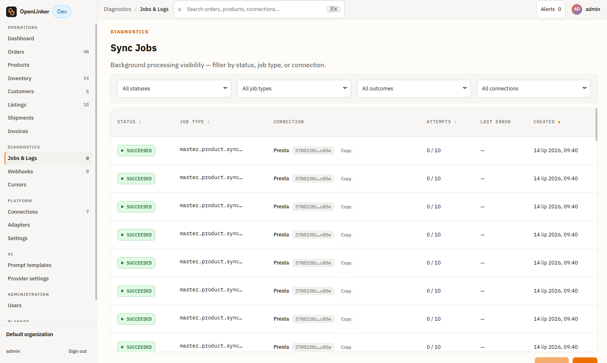
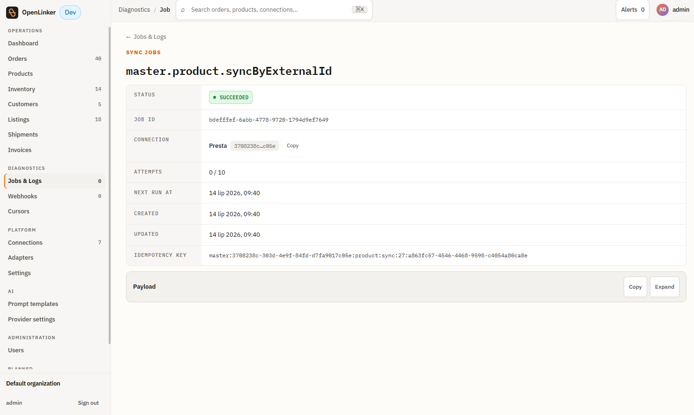
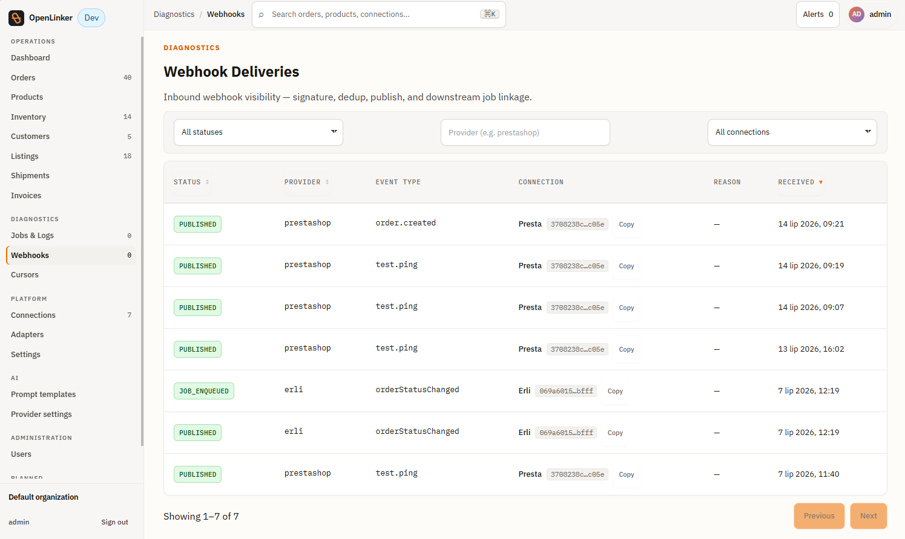
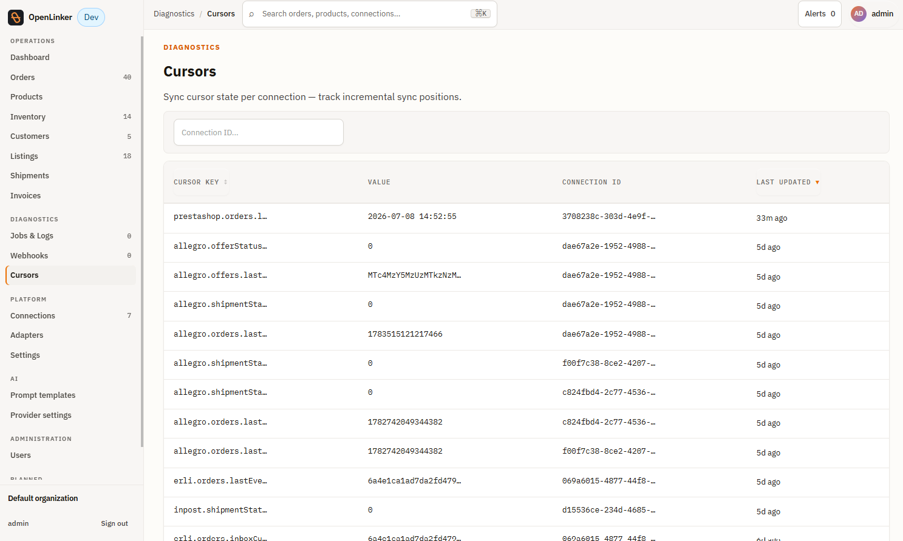

# Diagnostics

The Diagnostics group in the sidebar contains three surfaces for investigating and unblocking sync issues: **Jobs & Logs**, **Webhooks**, and **Cursors**. This section explains what each one shows and how to use it when something stalls.

---

## Jobs & Logs

Open **Jobs & Logs** in the sidebar (under **Diagnostics**).

<!-- screenshot: Sync Jobs list showing job rows with status chip, job type, connection, attempts, and creation date columns -->

### What is a job?

Every sync operation in OpenLinker runs as a background job under the **Sync Jobs** page. Jobs are enqueued by the scheduler (on a cron schedule), by webhook ingestion, or by manual triggers (e.g. "Trigger sync" on a connection detail page). The worker process picks them up and executes them.

### Job list

Filters at the top let you narrow by **status**, **job type**, **outcome**, and **connection**. Each row shows:

- **Status** — current execution state (color-coded chip)
- **Job type** — the job's function, e.g. `master.product.syncAll`, `marketplace.order.sync`, `inventory.propagate`, `master.inventory.syncByExternalId`
- **Connection** — which connection this job ran against (where applicable)
- **Attempts** — how many times the job has been tried
- **Last error** — a short excerpt of the last error message (if any)
- **Created** — when the job was enqueued

| Status | Meaning |
|---|---|
| **queued** | Waiting to be picked up by the worker |
| **running** | Currently being executed |
| **succeeded** | Completed without error |
| **dead** | Exhausted all retries; the job will not run again without manual intervention |

Use the **status filter** to show only dead or running jobs when investigating an issue.

> 🔍 **If orders or inventory updates are missing:** filter by `dead` status and look for `marketplace.order.sync` or `inventory.propagate` jobs. Dead jobs indicate a persistent error — click the job to read the failure reason.

### Job detail

<!-- screenshot: job detail page showing status, job ID, connection, attempts, timestamps, idempotency key, and the collapsible payload section -->

Click any job row to open the detail page. It shows:

- **Status** — current state (e.g. SUCCEEDED)
- **Job ID** — internal identifier
- **Connection** — which connection this job ran against
- **Attempts** — number of attempts made out of the maximum (e.g. `0 / 10`)
- **Next run at** — scheduled time for the next run (for recurring jobs)
- **Created / Updated** — lifecycle timestamps
- **Idempotency key** — the deduplication key used to prevent double-processing
- **Payload** — the input data the job was given (expandable; click **Expand** to read)

If a job is in `dead` state, expand the payload to read the last error. Fix the underlying cause (expired API key, missing product mapping, unreachable shop URL) then trigger a fresh sync from the connection detail page.

---

## Webhooks

Open **Webhooks** in the sidebar (under **Diagnostics**).

### What is the webhook log?

OpenLinker receives inbound webhooks from connected platforms (currently PrestaShop). Each delivery is logged here — whether it was accepted, deduplicated, or rejected.

### Webhook list

<!-- screenshot: webhook deliveries list showing one published test.ping row from prestashop -->

Each row represents one inbound webhook delivery. Columns include:

- **Provider** — the platform that sent the webhook (e.g. `prestashop`)
- **Connection** — which connection the webhook was routed to
- **Event type** — the event domain and type (e.g. `order.placed`, `product.updated`)
- **Received** — timestamp of receipt
- **Status** — delivery outcome:

| Status | Meaning |
|---|---|
| **published** | Accepted, deduplicated, and published to the event bus; a sync job was enqueued |
| **duplicate** | A webhook with the same event ID was already processed; this delivery was ignored |
| **rejected** | The webhook failed signature or timestamp validation; logged but not processed |

### Payload inspector

Click a webhook row to see the full payload OpenLinker received. This is useful for confirming the event content when an expected order or product update didn't trigger a sync.

> 🔍 **If an order is missing and you expected a webhook:** check the Webhooks log for a delivery from the same connection around the time the order was placed. If no entry exists, the webhook was never delivered to OpenLinker — check the platform's webhook delivery log (e.g. PrestaShop module logs). If the entry shows `rejected`, the webhook failed HMAC signature verification — confirm the shared secret matches what the platform was configured with.

---

## Cursors

Open **Cursors** in the sidebar (under **Diagnostics**).

<!-- screenshot: Cursors page showing cursor rows with key, value, connection ID, and last-updated timestamp -->

### What is a cursor?

A cursor is a sync-progress bookmark. When OpenLinker polls a platform for changes (orders since last check, offer events since last event ID), it stores a cursor to remember where it left off. The next poll resumes from that point — no events or orders are re-fetched unnecessarily.

Each cursor is identified by a key, for example:
- `allegro.offerStatus...` — the Allegro offer-status scan cursor
- `allegro.shipmentSta...` — the Allegro shipment-status poll cursor
- `prestashop.fulfillm...` — the PrestaShop fulfilment cursor
- `prestashop.orders.d...` — the PrestaShop order watermark; stores the `date_upd` timestamp of the last processed order

### Cursors list

Filter by connection using the **Connection ID** search box. Each row shows:

- **Cursor key** — the cursor's identifier (connection-scoped)
- **Value** — the current bookmark value (an event ID, timestamp, or offset)
- **Connection ID** — which connection this cursor belongs to
- **Last updated** — when this cursor was last advanced by a successful sync

### Resetting a cursor

> ⚠️ **Resetting a cursor causes OpenLinker to re-fetch all events from the beginning** (or a specified point). This is safe — ingestion is idempotent — but it may enqueue many jobs and take time to process.

If a sync is stalled (the cursor hasn't advanced in an unexpectedly long time, or orders from a known period are missing), click the cursor row to edit its value, enter an earlier position, and save. The next scheduled poll resumes from the new position.

> 🔍 **If orders from a specific date range are missing:** check the order-poll cursor for the connection. If the cursor value skipped past that date range (e.g. due to a temporary API error), reset the cursor to before the affected window.

---

## What's next

For platform-wide configuration and AI settings:

→ **[Settings & Admin](./08-settings-and-admin.md)**
