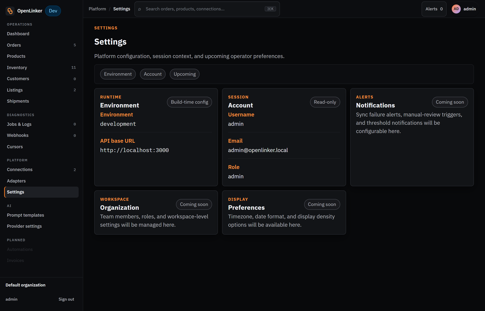
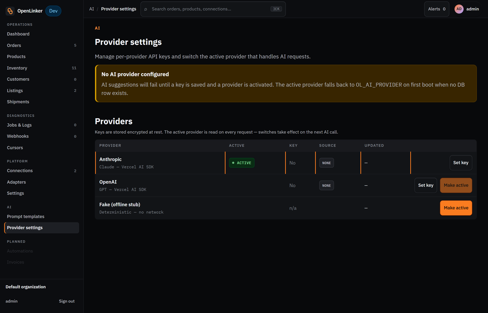
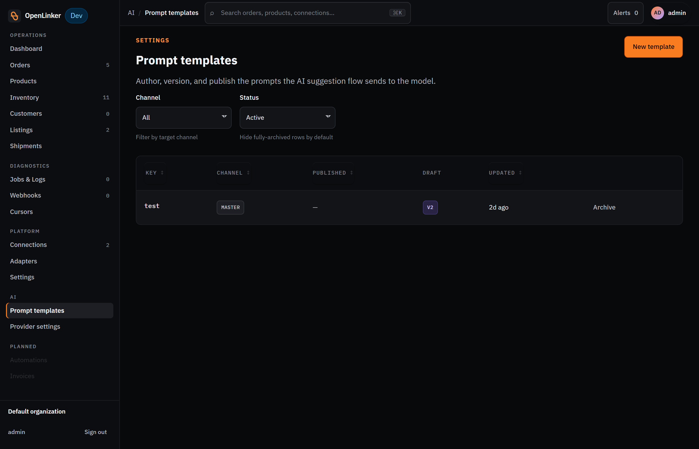

# Settings & Admin

The **Platform** group in the sidebar contains configuration surfaces for connections, adapters, and settings. AI content tools live in the separate **AI** group. This section covers **Settings**, **AI Provider Settings**, **Prompt Templates**, and **Adapters**.

Some of these pages are admin-only. If you don't see them in the nav or get a 403 response, your account may not have the `admin` role.

---

## Settings

Open **Settings** in the sidebar (under **Platform**).

<!-- screenshot: Settings page showing Environment, Account, and Upcoming tabs with the Runtime/Environment and Account info cards -->

The Settings page is organized into three tabs:

### Environment tab

Shows read-only runtime information about the current OpenLinker instance:

- **Environment** — the runtime environment (e.g. `development`, `production`)
- **API base URL** — the base URL the web app uses to reach the API

### Account tab

Shows the currently logged-in account details (read-only):

- **Username** — your login name
- **Email** — your account email
- **Role** — your role in the system (e.g. `admin`)

### Upcoming tab

Preview cards for settings features that are coming soon:

- **Notifications** — sync failure alerts, manual-review triggers, and threshold notifications
- **Organization** — team members, roles, and workspace-level settings
- **Preferences** — timezone, date format, and display density options

---

## AI Provider Settings

> ⚠️ **Admin only.** This page requires the `admin` role.

Open **Provider settings** in the sidebar (under the **AI** group). This page controls which AI provider powers the offer-description suggestion feature.

<!-- screenshot: AI Provider Settings page showing provider selector, API key field, and active provider indicator -->
<!-- Note: screenshot not yet captured — page is at /ai/provider-settings in the web app -->

### Configuring a provider

OpenLinker supports **Anthropic** (Claude) and **OpenAI** (GPT) as AI providers. To configure one:

1. Select the provider.
2. Paste your API key into the **API Key** field.

   > ⚠️ API keys are stored encrypted. Never share your key, and do not commit screenshots that show a real key.

3. Click **Save key**.

### Switching the active provider

The **Active provider** selector controls which provider is used for all completions. Switch between Anthropic and OpenAI without re-entering keys — both can have keys stored simultaneously. The change takes effect immediately.

---

## Prompt Templates

> ⚠️ **Admin only.** This page requires the `admin` role.

Open **Prompt templates** in the sidebar (under the **AI** group). Prompt templates are the instructions OpenLinker sends to the AI provider when generating content (currently: offer descriptions).

<!-- screenshot: Prompt Templates list showing template rows with key, channel, status chips (draft/published/archived), and version number -->
<!-- Note: screenshot not yet captured — page is at /ai/prompt-templates in the web app -->

### Template list

Each row represents one template. Columns include:

- **Key** — the template's identifier (e.g. `offer.description.suggest`)
- **Channel** — `MASTER` chip for shop-generic prompts, or a platform type chip (e.g. `allegro`) for channel-specific overrides
- **Published** — the currently published version (dash if none published yet)
- **Draft** — avatar icon of the user who last saved a draft (present when an unpublished draft exists)
- **Updated** — when the template was last modified

At any time, at most one template per `(key, channel)` combination can be **published** — that's the version the AI uses. Rows with only a draft and no published version are not yet active. Use the **Archive** action to retire a template.

### Editing and publishing a template

1. Click a template row to open the editor.
2. Edit the prompt text. Use `{{dotted.path}}` placeholders for values the system substitutes at render time (e.g. `{{product.name}}`, `{{product.description}}`).
3. Click **Save as draft** to save without activating.
4. Click **Publish** to make this version active. The previous published version is automatically archived.

### Reverting a template

Click **Revert** on any `archived` row to clone that historical version into a new draft. Useful for rolling back a poorly-performing prompt without losing the edit history.

---

## Adapters

Open **Adapters** in the sidebar (under **Platform**).

The Adapters page shows the registered adapter manifests for every integration that is loaded in this OpenLinker instance. This is a read-only registry view.

Each adapter entry shows:
- **Adapter key** — the unique identifier (e.g. `prestashop.webservice.v1`, `allegro.publicapi.v1`)
- **Platform type** — the platform this adapter targets
- **Version** — the adapter's declared version
- **Capabilities** — the capability ports this adapter implements (ProductMaster, InventoryMaster, OfferManager, etc.)
- **Default** — whether this is the default adapter for its platform type

Adapters are registered at startup by the plugin packages loaded in the API and worker processes. You cannot add or remove adapters from the UI — that requires a code change and restart.

---

## Theme toggle

The light/dark theme toggle is in the **top bar** — click the sun (light) or moon (dark) icon on the right side. The preference is stored in your browser and persists across sessions.

---

## Back to the guide index

→ **[Operator Guide index](./README.md)**
