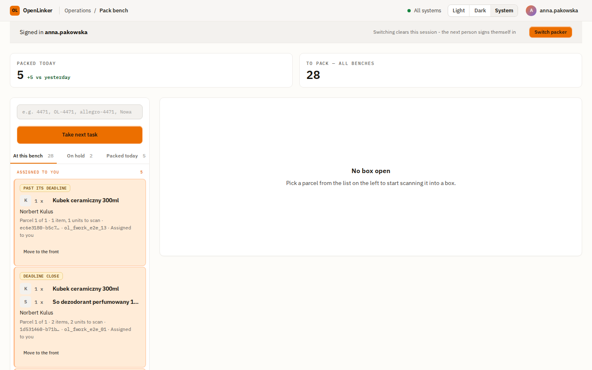
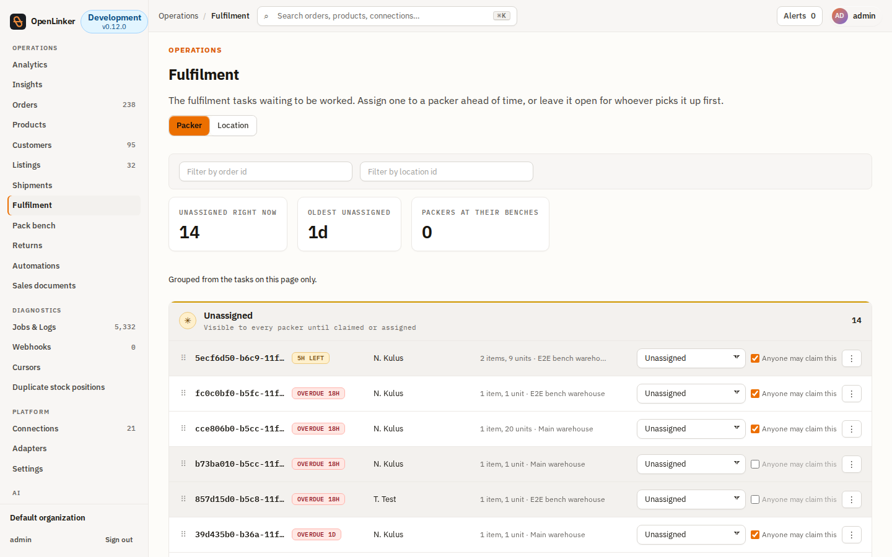

# Pack bench & Assign Packing Work

Two screens for the in-house fulfilment (OMS) workflow: the **pack bench**, a
kiosk-style scanning terminal a packer stands at, and **Assign Packing Work**,
an admin/operator staffing board a supervisor uses to steer which packer
works which parcel before it's picked.

Both are new, first-party OMS surfaces (see [ADR-054](../architecture/adrs/054-fulfillment-work-unit-of-assignment.md)
and [ADR-074](../architecture/adrs/074-fulfillment-work-pre-assignment.md)).
They only do anything once you've enabled the OpenLinker OMS on a connection
and routing is switched on — see the OMS setup section of
[Connecting a Platform](./02-connecting-a-platform.md) if you haven't yet.

---

## The pack bench

Open **`/bench`** directly by URL — it's a standalone, full-screen terminal
with no sidebar, meant to run on a shared device at a packing station rather
than be navigated to from the main nav.

<!-- screenshot: /bench worklist showing several accepted parcels queued for packing -->

### Signing in at the bench

The bench renders its own sign-in rather than redirecting to the normal login
page — this is deliberate, because the bench's idle lock (below) clears the
session on purpose, and a redirect to `/login` would lose whatever a packer
had half-scanned. Sign in with your own OpenLinker account; any user with the
`packer`, `operator` or `admin` role can use the bench.

### The worklist

The bench shows every parcel that's been routed to OpenLinker's own packing
executor and accepted — this is *routing's dispatch queue*, not a
deadline-sorted list you build yourself. Each row shows the order reference,
the ship-by deadline, and an **Open parcel** button.

Two empty states look similar but mean different things:

- **"Nothing to pack right now"** — the pipe is healthy, there's just no
  work waiting. Nothing to do.
- **"Routing isn't switched on"** — this bench will never receive work until
  a supervisor configures fulfilment routing. Points you at the settings
  page that owns it.

### Packing a parcel

Click **Open parcel** to switch into the scanning view for that box. Scan (or
type) each line's barcode; a scanned quantity that matches what's required
turns the line green. The bench has **no explicit "Close" button** — the box
closes automatically on the last correct scan, because a box that's fully
verified *is* closed, and adding a confirm step would just be one more click
between a packer and the next parcel.

A line you can't find or can't fulfil can be put **on hold** with a reason —
the parcel stays visible (with the hold reason shown) until someone releases
it, so it doesn't silently vanish from the queue.

Once closed, if OpenLinker doesn't yet have a shipping label for the box, the
closed view shows an **unlabelled** panel instead of tracking info — a
reassurance that the box is packed and correctly recorded, with dispatch
still to follow.

### Idle lock

If nobody touches the bench for a while, it locks and clears the session —
this is a shared-terminal safety measure, not a bug. Sign back in to
continue; anything already scanned survives the lock.

---

## Assign Packing Work

Open **Assign Packing Work** (under **Operations** in the sidebar, or
`/fulfillment/assign` directly) — admin/operator only. This is a **staffing**
board: it decides who a parcel is earmarked for *before* anyone picks it up,
which is a different question from the bench's own claim-on-open flow.

<!-- screenshot: Assign Packing Work board with an Unassigned lane and one lane per packer -->

### Reading the board

Tasks are grouped into **lanes** — one **Unassigned** lane plus one lane per
packer. Each row shows the parcel's reference, its current fulfilment state,
and three staffing controls:

| Control | What it does |
|---|---|
| **Move to** | Re-assign the parcel to a named packer, or back to Unassigned. This is the *only* way to move a parcel — there's no drag-and-drop, on purpose: a dropdown is faster and far less error-prone on a touch device or an unreliable connection than a drag gesture. |
| **Anyone may claim this** (checkbox) | When checked (the default), any packer may still pick up this parcel from the bench even though it's earmarked for someone. Uncheck it to lock the parcel to the assigned packer only. |
| **Hold** | Put the parcel on hold with a reason, the same mechanism the bench itself uses. |

### Assigning a parcel

Pick a packer from the **Move to** dropdown on any row. The change applies
immediately — there's no separate save step. The row moves to that packer's
own lane.

### What the packer sees

The moment you assign a parcel, the affected packer's own bench worklist
picks it up on its next refresh: their row shows an **"Assigned to you"**
badge. A parcel assigned to someone else shows **"Assigned to another
packer"** and, if "Anyone may claim this" was turned off, that packer can no
longer open it — a locked note replaces the Open button. OpenLinker never
shows one packer another packer's internal account details; only the badge.

### Putting a parcel on hold from the board

Click **Hold**, choose a reason, optionally add a note, and confirm. The row
picks up the held indicator immediately — the same visual state the bench
itself shows when it opens that parcel.

---

## See also

- [ADR-053 — Fulfilment authority vocabulary leaf](../architecture/adrs/053-fulfillment-authority-vocabulary-leaf.md)
- [ADR-054 — FulfillmentWork as the unit of assignment](../architecture/adrs/054-fulfillment-work-unit-of-assignment.md)
- [ADR-074 — Fulfillment work pre-assignment](../architecture/adrs/074-fulfillment-work-pre-assignment.md)
- [Manual testing: Pack bench & Assign Packing Work](../manual-testing/pack-bench-assign-packing-work.md)
