# Erli Integration — Setup Guide

This tutorial takes you from nothing to a working **Erli** marketplace
connection in OpenLinker: adding the connection, installing webhooks, creating
your first offer, syncing stock, and receiving orders. It covers both what to
configure **on the Erli side** and the **OpenLinker click-through**, with the
equivalent API calls noted as asides for developers.

> For the architecture and design rationale behind the adapter, see
> [ADR-025](../../../../docs/architecture/adrs/025-erli-marketplace-adapter.md) and the
> [product spec #978](../../../../docs/specs/product-spec-978-erli-marketplace-integration.md).
> For day-2 operations — scheduler env flags, known Erli quirks, and
> troubleshooting — see the [Erli runbook](./runbook.md).

---

## What you get

Erli is a Polish marketplace. The OpenLinker Erli adapter (`erli.shopapi.v1`)
delivers two capabilities:

- **OfferManager** — create/update offers (listings), push stock, reconcile
  offer status, restore stock on cancellation.
- **OrderSource** — ingest Erli orders into OpenLinker (webhook trigger +
  inbox-poll backstop).

---

## Prerequisites

### 1. A configured PrestaShop connection (do this first)

OpenLinker lists **your own catalog** onto Erli — Erli does not hold the master
product data. Before connecting Erli you need a working **PrestaShop connection**
that acts as:

- the **master catalog** Erli offers source their product data, images, and
  stock from, and
- the **order destination** that Erli orders are fulfilled to.

If you don't have one yet, set it up first — see
[Connecting a Platform → PrestaShop walkthrough](../../../../docs/user-guide/02-connecting-a-platform.md#prestashop-walkthrough).

For Erli orders to be **fulfilled** on PrestaShop, the destination shop must also:

- have the **buyer's country active** (PrestaShop → International → Locations →
  Countries). Erli sells in Poland, so **Poland must be enabled** — an order to
  an inactive country fails at order-create with *"Country … not found / not
  active"*.
- have the **OpenLinker PrestaShop module installed and its webhooks configured**
  on the connection (Connection detail → **Install webhooks**). OpenLinker creates
  the PrestaShop order through the module's `validateOrder` endpoint, which is
  HMAC-signed with the secret provisioned during webhook install — without it,
  order-create fails with *"Webhook secret not found"*.

> **Images must be public `https`.** Erli rejects offers that have no public
> `https` image, and OpenLinker drops any non-`https`/non-public image URL when
> building the offer. Make sure your master products carry public `https` images
> (a PrestaShop dev store on `http://localhost` will not work). See
> [Create an offer](#6-create-an-offer).

### 2. An Erli Shop API key

You generate this **in your Erli seller panel** — it is the only credential
OpenLinker needs, sent as a `Bearer` token on every request.

| What | Where / how |
|---|---|
| **Shop API key** | Erli seller panel → **moje Erli** (top-right) → **Ustawienia sklepu** → **Metoda integracji** → **Własna integracja po API** → **Wygeneruj nowy klucz**. The key is shown once — copy it straight into OpenLinker. |
| **Sandbox account** (for testing) | Request sandbox access from Erli and log in to the sandbox seller panel. Sandbox base URL: `https://sandbox.erli.dev/svc/shop-api`. Production: `https://erli.pl/svc/shop-api`. |

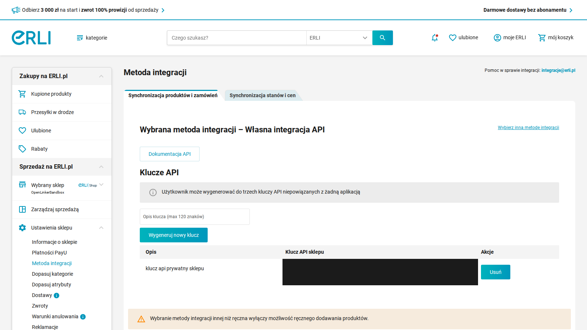

*The Erli "Metoda integracji" screen. Pick **Własna integracja API**, then under
**Klucze API** click **Wygeneruj nowy klucz** to mint the Shop API key. (Key value
redacted.)*

> **Heads-up.** Choosing an API integration method disables manual product adding
> in the Erli panel — products and offers are then managed via the API (i.e. by
> OpenLinker).

---

## 3. Add the connection in OpenLinker

Open **Connections → Add connection** (`/connections/new`) and pick the **Erli** card.

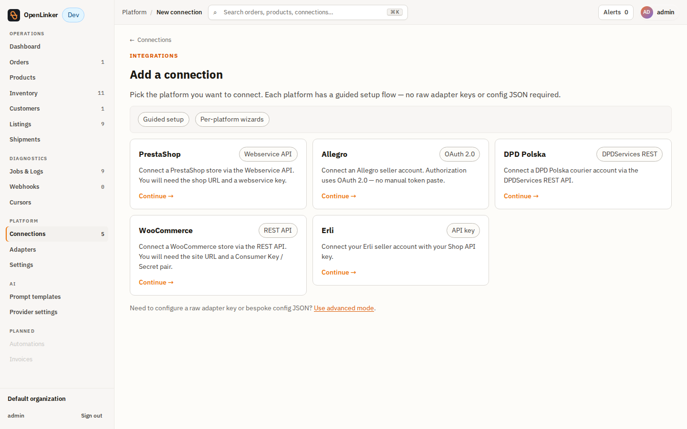

Fill the guided Erli setup form (`/connections/new/erli`):

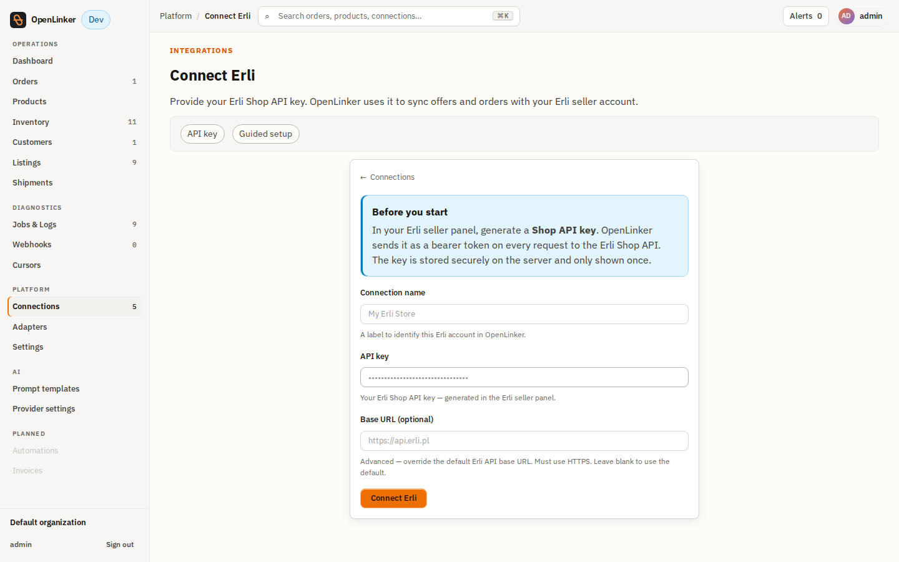

| Field | Value |
|---|---|
| **Connection name** | A label, e.g. `My Erli Store` |
| **API key** | The Shop API key from your Erli seller panel |
| **Base URL** (optional, advanced) | Leave blank for production. For the sandbox, set `https://sandbox.erli.dev/svc/shop-api`. Must be `https` and an Erli-owned host. |

Click **Connect Erli**. The connection is created with the adapter's default
capabilities (**OfferManager + OrderSource**) and an ACTIVE status.

> **Two extra config values** are needed for the full flow but aren't on the
> guided form — set them afterwards via **Edit connection**:
> - `callbackBaseUrl` — the public OpenLinker URL Erli posts webhooks to
>   (required to install webhooks — see [step 5](#5-install-webhooks)).
> - `defaultDispatchTime` — e.g. `{ "unit": "day", "period": 2 }`, a shop-wide
>   default handling time applied when an offer doesn't specify its own (Erli
>   requires a dispatch time).
>
> **Developer aside.** The same operations are available over the API:
> `POST /connections` to create, `PATCH /connections/:id` with a merged `config`
> to set `callbackBaseUrl` / `defaultDispatchTime`.

After creation you can review the connection on its detail page — platform,
adapter, status, and enabled capabilities:

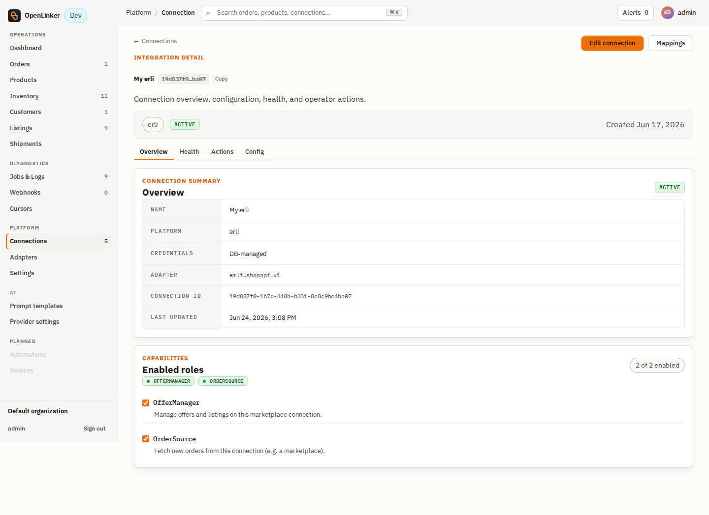

---

## 4. Test the connection

On the connection (setup form or **Connection detail → Actions**), click
**Test connection**. OpenLinker calls Erli's `GET /me` with your API key. A green
result confirms the key is valid and Erli is reachable.

---

## 5. Install webhooks

Webhooks are the **low-latency trigger** for order events. They are optional for
correctness — a scheduled inbox poll backstops them (see [Orders](#10-orders)) —
but recommended.

1. Set `config.callbackBaseUrl` on the connection to a URL Erli can reach:
   - **Production:** your public OpenLinker URL (e.g. `https://ol.example.com`).
   - **Local dev:** Erli is a cloud service and **cannot reach `localhost`**. Use
     a tunnel that exposes your local API (`:3000`) on a public `https` URL — e.g.
     `cloudflared tunnel --url http://localhost:3000` — and set `callbackBaseUrl`
     to the tunnel URL.
2. On **Connection detail → Actions**, click **Configure webhooks**.

OpenLinker rotates a per-connection webhook secret and registers two hooks with
Erli (`orderCreated`, `orderStatusChanged`). The callback URL is
`{callbackBaseUrl}/webhooks/erli/{connectionId}`; Erli echoes the secret as a
bearer token on each delivery for verification. A successful install returns
`{ "webhooksConfigured": true }`.

> **Developer aside.** `POST /connections/:id/webhooks/install`.

---

## 6. Create an offer

From **Listings**, click **Create offer**:


Pick the Erli connection in the dialog and click **Continue**:


The wizard has three steps — **Variant → Offer details → Review**.

**Step 1 — Variant.** Browse or search your catalog for the product to list:

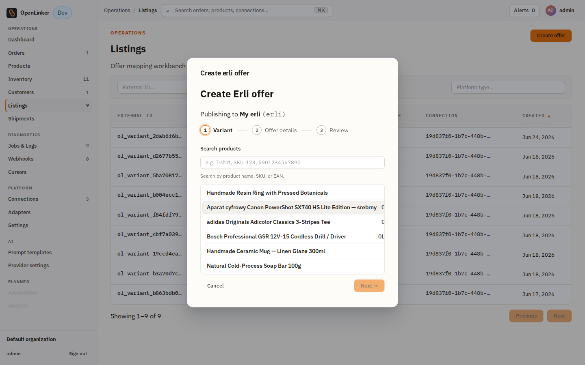

Search by product name, SKU, or EAN, then expand a product and pick the variant
to publish:


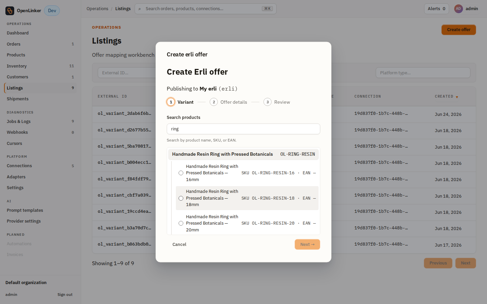

**Step 2 — Offer details.** Set the title, price (PLN), stock, dispatch time, and
(optionally) a category. The dispatch time defaults to the connection's
`defaultDispatchTime`; the category can be left blank to resolve from the variant
barcode at create time:

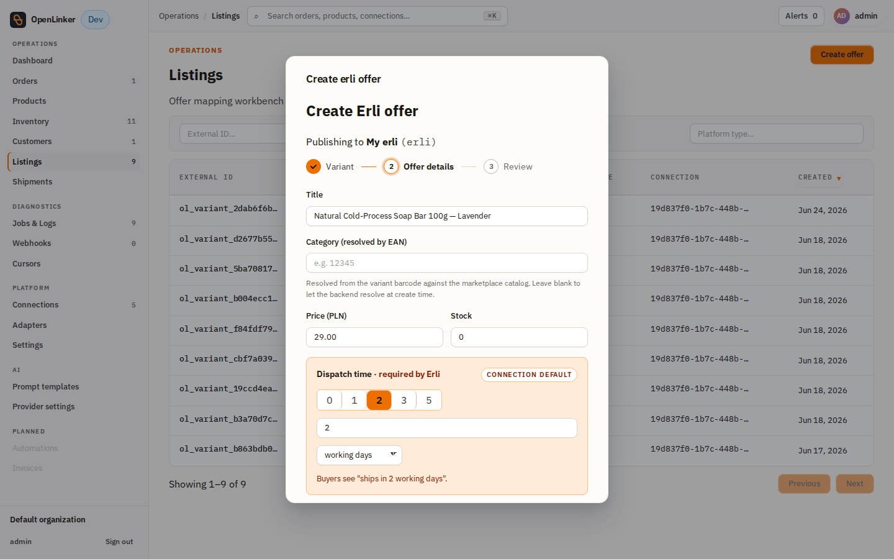

**Step 3 — Review.** The final step summarises the chosen values (variant, price,
stock, dispatch, images, publish-as-draft). Submitting enqueues the creation job;
Erli accepts it asynchronously (HTTP 202) and the offer starts as a **draft**.

> **Image requirement (gates submit).** Erli rejects offers without at least one
> **public `https`** image. OpenLinker pulls images from the master product and
> **drops any non-`https`/non-public URL**. If the master product has no usable
> image, the wizard blocks at the variant step and submit fails with
> *"overrides.imageUrls must be an array of valid URLs"*. Ensure the master
> product carries public `https` images (or pass `overrides.imageUrls` via the API).

> **Developer aside.** The wizard posts to the offer-creation API; you can also
> create offers programmatically (single or **bulk**, one offer per variant) via
> the same endpoint.

### Verify your offers

Created offers appear in **Listings**, the offer-to-variant mapping workbench.
Erli keys each offer by the OpenLinker **variant id**, so the row shows the
variant, platform **erli**, the target connection, and the created date:

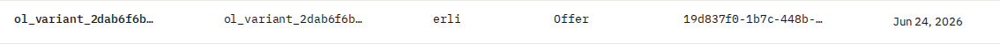

Use the **External ID / Connection / Platform** filters at the top of Listings to
narrow to a single Erli connection's offers. Click a row to open the **listing
detail** page — it shows the mapping (variant, external/internal id, platform,
connection) and the **offer-creation status** (`DRAFT` for a freshly created Erli
offer that is set up and ready to list):

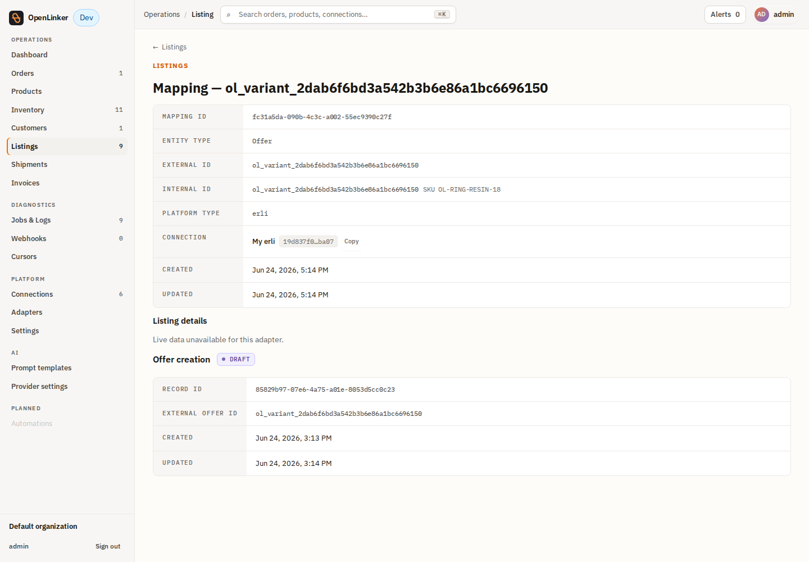

The "Listing details" panel reads *"Live data unavailable for this adapter"* until
Erli's async write settles — because Erli writes are async (~20-min cache lag), a
freshly created offer's live marketplace status becomes authoritative only after
offer-status reconciliation runs (see the
[runbook](./runbook.md#scheduler-env-flags-worker)).

**On the Erli side**, the published offers appear in your seller panel under
**Moje produkty**. Each OpenLinker-created offer carries its OpenLinker **variant
id** as the external id (**ID zewn.** = `ol_variant_…`), alongside the Erli-assigned
**ID ERLI**, the stock (Szt.) OpenLinker pushed, and the price:

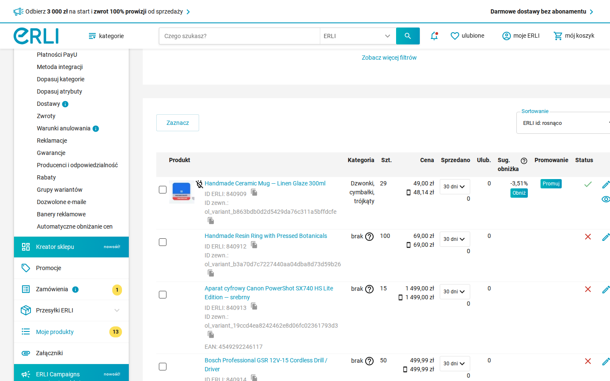

---

## 7. Stock sync

Stock propagation is **event-driven from your master catalog** — under normal
operation there is no manual step:

```
master inventory change  →  inventory.propagateToMarketplaces
                         →  marketplace.offerQuantity.update (per Erli offer)
                         →  Erli PATCH /products/{id} { stock }
```

When the master (e.g. PrestaShop) stock for a mapped product changes, the next
master-inventory sync writes the new value and OpenLinker pushes it to every
linked Erli offer automatically. The OpenLinker **Inventory** view reflects the
new master quantity for the mapped variant:

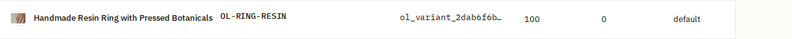

### Triggering a stock sync manually

Stock to Erli always originates from the **master** (PrestaShop) — Erli is a
destination, not an inventory master. So to force a stock push without waiting for
the scheduled cycle, trigger the master inventory sync **on the PrestaShop
connection** (the one holding the `InventoryMaster` capability):

1. Open the **PrestaShop** connection → **Actions** tab → **Trigger sync…**.
2. Pick **Sync all inventory** (`master.inventory.syncAll`) — or **Sync inventory
   by ID** (`master.inventory.syncByExternalId`) for one product — and click
   **Trigger**.

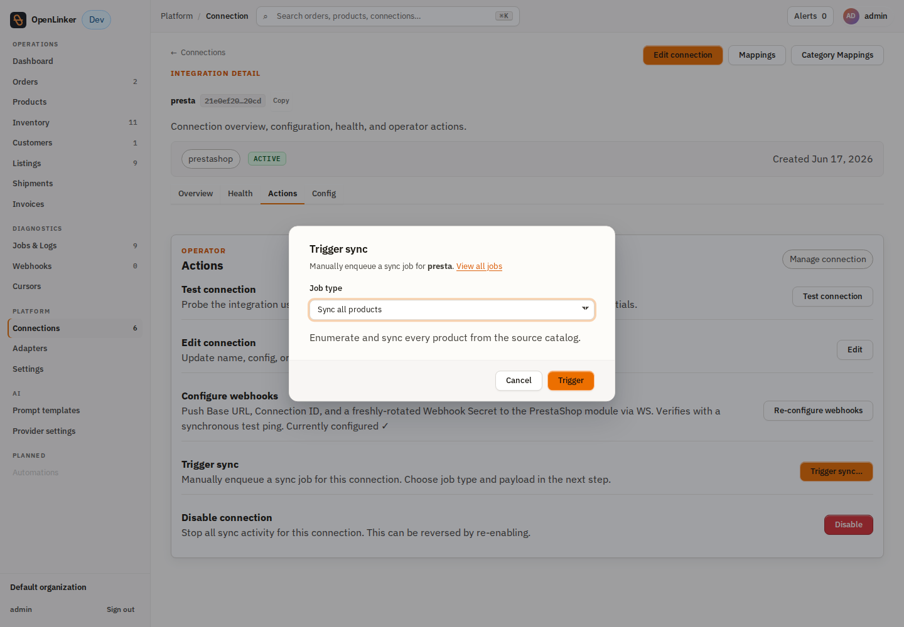

OpenLinker re-reads master stock and propagates each change to the linked Erli
offers (`marketplace.offerQuantity.update` → Erli `PATCH`). Watch progress under
**Jobs & Logs**.

> The **Erli** connection's own **Trigger sync** offers `marketplace.offers.sync`
> (refresh offer mappings) and `marketplace.orders.poll` (pull orders) — **not**
> stock, because stock is owned by the master. Frozen-stock handling and the
> offer-status reconciliation scheduler are covered in the [runbook](./runbook.md).

---

## 8. Update an offer (price, title, description)

Unlike stock, OpenLinker does **not** auto-propagate **price** from the master —
price, title, and description are **operator-initiated** changes to the offer's
content fields. OpenLinker sends them to Erli via `updateOfferFields`
(`PATCH /products/{id}`, sparse), enqueued as a `marketplace.offer.updateFields`
job (HTTP 202 — async, like every Erli write).

**API (today):**

```
POST /listings/connections/{connectionId}/offers/{offerId}/fields
{ "price": { "amount": "59.00", "currency": "PLN" },
  "title": "…",
  "description": { "sections": [ { "items": [ { "type": "TEXT", "content": "…" } ] } ] } }
```

At least one field is required; the response returns a `{ jobId }`.

> **UI button is coming.** An **Edit offer** button on the listing-detail page
> (price / title / description, with AI-assisted descriptions) is wired for other
> platforms and tracked for Erli in **#1215** — until it ships, use the API above.

> **Frozen fields.** If a field was edited directly in the Erli panel, Erli marks
> it `frozen` and OpenLinker excludes it from the update (it won't overwrite a
> seller's manual edit). See the [runbook](./runbook.md).

---

## 9. Bulk offer creation

To list many products on Erli at once, use the **bulk** wizard instead of the
single-offer flow. It's a four-step flow — **Config → Resolving → Review →
Confirm** — with an Erli-specific dispatch-time section on the Config step:

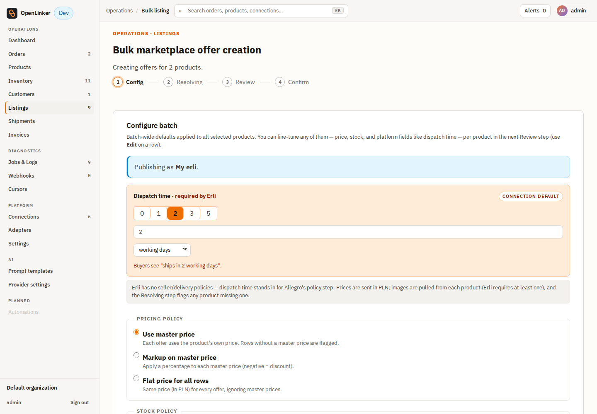

1. Go to **Products**, select up to **100** products, and click **Bulk create**
   (the action bar appears once rows are selected). This opens
   `/listings/bulk-create/wizard`.
2. **Config** — pick the Erli connection, a pricing policy (use master price /
   markup / flat), a stock policy (use master / cap / flat), currency (PLN for
   Erli), and toggles for **Generate AI description** and **Publish immediately**.
   Erli's config section adds the **dispatch time** (its stand-in for Allegro's
   policy step — Erli has no seller/delivery policies).
3. **Resolving** — OpenLinker batch-resolves each product's category and stock and
   flags **blockers** (e.g. missing image — Erli requires ≥1 public `https`
   image). Only blocker-free rows can submit.
4. **Review** — inspect each row; click a row to override price, stock, category,
   or (Erli) a per-product **dispatch-time override**.
5. **Confirm** — **Approve all & submit** enqueues the batch
   (`POST /listings/bulk-create`); you land on the **batch progress** page
   (`/listings/bulk-batches/{batchId}`) to watch each offer's creation.

Each offer follows the same async path and public-`https`-image requirement as the
single-offer flow ([§6](#6-create-an-offer)).

---

## 10. Orders

Orders reach OpenLinker two ways, which converge idempotently on one order record:

- **Webhook (trigger):** Erli posts to
  `{callbackBaseUrl}/webhooks/erli/{connectionId}` with the order id → OpenLinker
  pulls the full order and ingests it. Erli webhooks are **fire-once, 5 s timeout,
  no retry**, so they are a latency optimization, not a guarantee.
- **Inbox poll (backstop, recommended):** the `erli-orders-poll` scheduler reads
  Erli's unread inbox on an interval and ingests any order events the webhook
  missed. Enable it on the worker (see the [runbook](./runbook.md)).

Ingested orders appear under **Orders**:

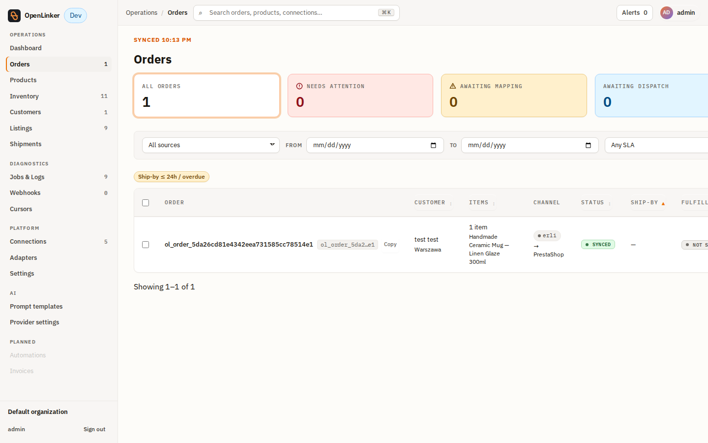

Opening an ingested order shows its **source = the Erli connection** flowing to
the PrestaShop destination, with the line items, customer, and totals:

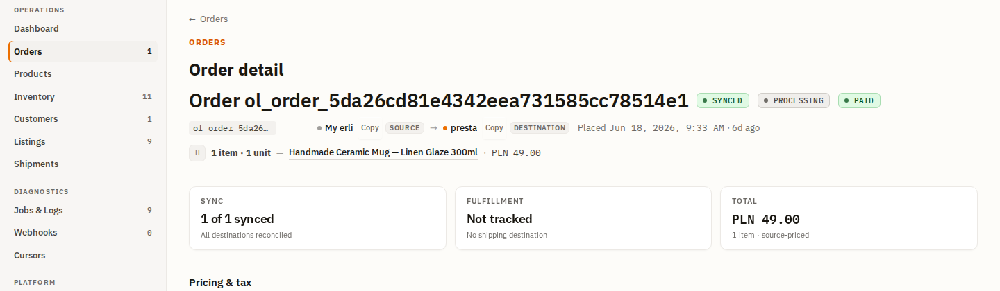

The same order is visible on the **Erli side** in the seller panel. The dashboard
("Zarządzaj sprzedażą") shows it in the **Zamówienia do zrealizowania** (orders to
fulfil) count:

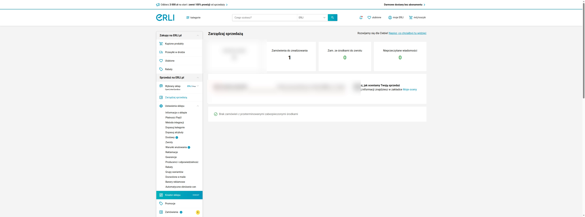

…and it appears in the Erli **Zamówienia** (orders) list — here the same order
(`260618x10002`) under **Do realizacji**:

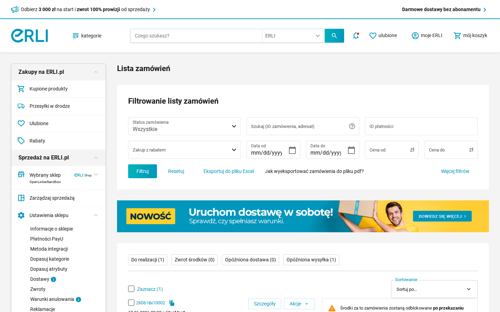

> **Customer identity.** Erli orders carry a buyer **email** (no buyer id).
> OpenLinker resolves the internal customer from that email so the order can be
> created on the PrestaShop destination. Ensure customer identity resolution is
> configured for your deployment (see the
> [architecture overview → Customer Identity Resolution](../../../../docs/architecture-overview.md#customer-identity-resolution)).

### Order cancellation

When a buyer or seller cancels an order on Erli, the next webhook/poll ingest
picks up the `cancelled` status like any other status change. OpenLinker then
does one extra thing automatically: because Erli decrements stock on purchase
but does **not** restore it on cancel (see the [runbook's known
quirks](./runbook.md#known-erli-quirks)), OpenLinker enqueues a compensating
`marketplace.offer.stockRestore` job the first time an order transitions to
`cancelled` — the worker resolves the connection's `OfferStockRestorer`
capability and pushes the restored quantity back to Erli. This fires once per
order (a later re-poll of an already-cancelled order is a no-op) and needs no
operator action.

---

## Next steps

- **Day-2 operations** — scheduler env flags, known Erli quirks (async writes,
  no webhook retry, stock-on-cancel, frozen fields), and troubleshooting:
  [Erli runbook](./runbook.md).
- **Multiple connections** — you can connect more than one Erli shop; each has its
  own credentials, config, and offer mappings.
