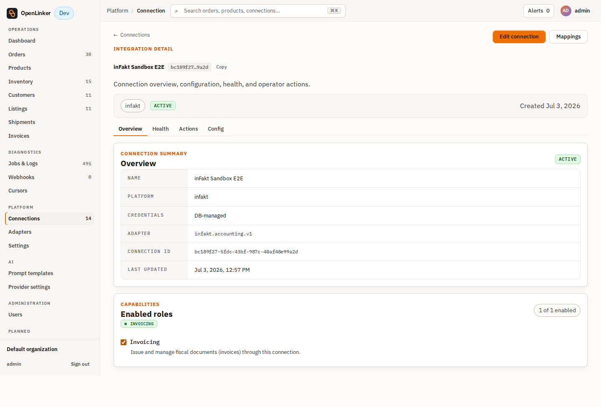
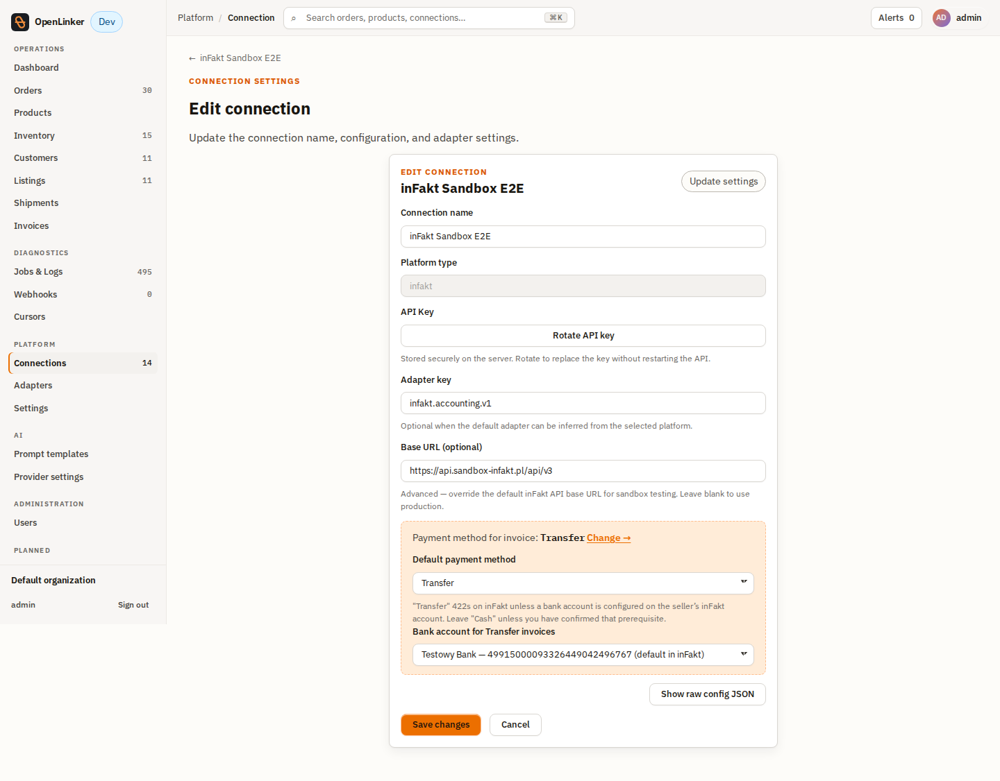
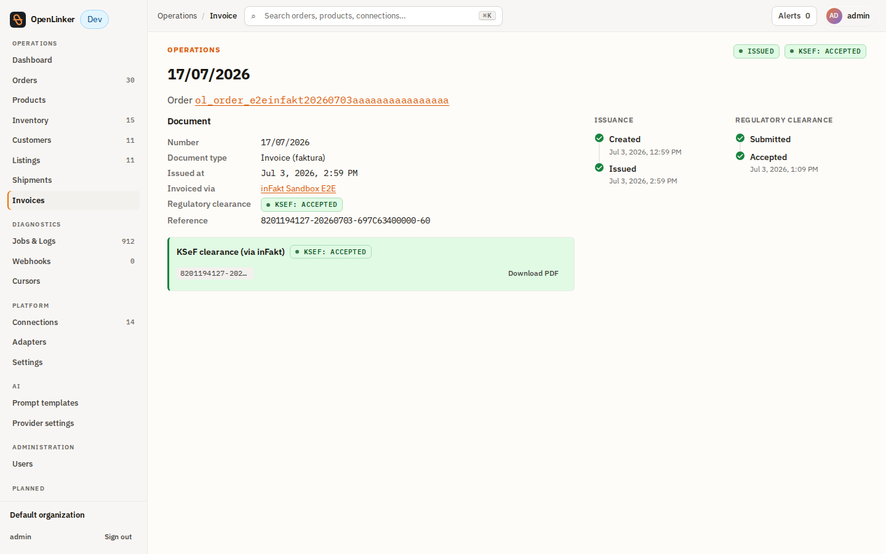

# inFakt Integration Setup Guide

OpenLinker integrates with **inFakt** (a Polish accounting SaaS) as a fiscal-document
provider: it issues invoices and reads back their KSeF clearance status through
inFakt's own, native KSeF submission.

inFakt is the second provider of the country-agnostic **Invoicing** domain
([ADR-026](../../../../docs/architecture/adrs/026-country-agnostic-invoicing-domain.md)). Unlike
the `@openlinker/integrations-ksef` package, OL never opens a KSeF session or builds
FA(3) XML for inFakt-issued invoices — inFakt does that internally, on its own
timing. See [ADR-030](../../../../docs/architecture/adrs/030-infakt-ksef-indirection.md) for the
full rationale behind that design.

---

## Capabilities

| Capability | Supported | Notes |
|---|---|---|
| `Invoicing` (`issueInvoice` / `getInvoice` / `upsertCustomer` / `getSupportedDocumentTypes`) | ✅ | Document types: `invoice`, `corrected`, `proforma`, `prepayment`. |
| `RegulatoryStatusReader` (`getClearanceStatus`) | ✅ | Reads `ksef_data.status` off the stored invoice. **Not** `RegulatoryTransmitter` — OL does trigger submission (`send_to_ksef.json`, called inline at issuance), but clearance timing and status ownership stay with inFakt's own KSeF integration, so that trigger isn't exposed as an independently-callable submit method. |
| `CorrectionIssuer` (`issueCorrection`) | ✅ | Issues a `corrective` invoice against `POST /invoices.json` with a before/after line-pair payload. |
| `BankAccountsReader` (`listBankAccounts`) + `BankAccountDefaultSetter` (`setDefaultBankAccount`) | ✅ | Backs the live bank-account picker for `Transfer` invoices - accounts are fetched from `GET /bank_accounts.json`, and the picked account is synced back as the inFakt default. |
| `RegulatoryDocumentReader` (`getRegulatoryDocument`, kind `rendered`) | ✅ | Fetches the inFakt-rendered invoice PDF - powers the **Download PDF** button on the invoice detail page. |

The connection detail page shows the enabled capability roles for the connection:



- **adapterKey:** `infakt.accounting.v1`
- **platformType:** `infakt`
- **displayName:** `Infakt Accounting API v3`

---

## Prerequisites

1. An active [inFakt](https://www.infakt.pl/) account (or an inFakt **sandbox**
   account for testing — the same API shape, a different `baseUrl`).
2. **KSeF integration enabled** in your inFakt account settings. OL's adapter explicitly
   triggers KSeF submission right after creating each invoice — an inFakt draft does
   **not** submit to KSeF on its own — but that trigger only succeeds if KSeF
   integration is turned on for the account; inFakt still owns the actual clearance
   session and timing once submission starts. See
   [ADR-030](../../../../docs/architecture/adrs/030-infakt-ksef-indirection.md) for the full
   rationale.
3. An **API key**, generated from your inFakt account settings.


---

## 1. Creating the connection in OL

From **Connections → New connection**, pick **inFakt** from the platform picker.


The guided wizard (`/connections/new/infakt`) collects:

| Field | Required | Description |
|---|---|---|
| Connection name | ✅ | A label to identify this inFakt account in OpenLinker. |
| API key | ✅ | The credential from [Prerequisites](#prerequisites). Stored encrypted server-side; never echoed back to the browser after creation. |
| Base URL (optional) | ❌ | Advanced override for sandbox testing. Must use HTTPS. Leave blank to use inFakt's production API. |
| Default payment method | ❌ | `Cash` or `Transfer` - the `payment_method` stamped on every invoice issued through this connection. Leave it untouched to fall back to `Cash`. `Transfer` is rejected (422) by inFakt unless a bank account is configured on the seller's inFakt account. |


When **Transfer** is selected, the connection also carries a **bank account for
Transfer invoices**. The picker for a specific account unlocks once the connection
exists (the API key is needed to query inFakt): OL fetches the account list live from
inFakt and defaults to whichever account is marked default there, falling back to
`Cash` if the inFakt account has no bank accounts at all. The issued document really
carries this configuration - invoices land in inFakt with `payment_method: transfer`
and the picked account's number and bank name.

After submitting, the connection is created and a **Test connection** affordance
appears — use it to confirm the API key is valid before relying on the connection.


Both payment fields stay editable after creation. On the connection **Edit** form,
the **Payment method for invoice** disclosure exposes the same **Default payment
method** select plus a **Bank account for Transfer invoices** picker populated live
from inFakt. Picking a different account persists it eagerly and syncs it back as the
default account in inFakt, so the connection config and the inFakt account never
drift apart.




---

## 2. Webhook configuration

Webhooks are the low-latency path for learning that inFakt has finished submitting an
invoice to KSeF (the "webhook = trigger, poll = reconciliation backstop" pattern —
`getClearanceStatus()` remains the source of truth; the webhook only triggers an
immediate re-read).

**inFakt webhook subscriptions are configured entirely in the inFakt dashboard** — there
is no programmatic `WebhookProvisioningPort` for this adapter (unlike PrestaShop's
auto-provisioning). Set it up manually:

1. In your inFakt account, go to **Settings → Webhooks** (or the equivalent
   integrations/API section) and create a new subscription.
2. **URL**: `POST https://<your-ol-host>/webhooks/infakt/{connectionId}` — substitute
   the connection ID shown on the connection-detail page in OL.
3. **Events**: subscribe at minimum to `send_to_ksef_success` and `send_to_ksef_error`
   (every other event inFakt can send is accepted and silently ignored by OL).
4. inFakt sends a **verification ping** — a POST with `{"verification_code": "..."}` —
   to confirm the endpoint is live. OL's webhook decoder echoes the same code back
   automatically; the subscription activates once inFakt sees the matching echo.
5. **Secret**: as the subscription-creation form below shows, inFakt's "Nowy webhook"
   form has **no secret field** — only the account fields (URL, description, payload
   content, event checkboxes) plus your inFakt **account password**, required to
   confirm the action. inFakt instead **auto-generates a secret per subscription**
   after creation, visible in that subscription's details view in the inFakt
   dashboard. Open the newly-created webhook's details, copy the generated secret, and
   set it as OL's webhook secret for this connection so `X-Infakt-Signature`
   verification matches.


> **Known gap**: there is currently no OL admin-UI affordance for webhook secrets on
> the inFakt connection page (unlike PrestaShop/Erli, which push an OL-generated
> secret out to the platform). OL's rotate endpoint only **generates a new random
> secret server-side** — there is no endpoint to set it to an arbitrary caller-supplied
> value, such as the one inFakt just generated:
>
> ```bash
> curl -X POST "https://<your-ol-host>/v1/connections/{connectionId}/webhooks/secret/rotate" \
>   -H "Authorization: Bearer <your-ol-jwt>"
> # => { "secret": "...", "revealedOnce": true, "warning": "..." } (shown once, copy immediately)
> ```
>
> The returned `secret` will **not** match the one inFakt generated for the
> subscription, so signature verification fails until either an FE affordance or a
> "set secret" endpoint ships. See [Troubleshooting](#troubleshooting) for the
> resulting symptom.

---

## 3. Verifying the integration

1. Trigger an invoice issuance from OL for a test order (**Order detail → Issue
   invoice**, connection set to your inFakt connection).

   

   

2. Immediately after issuance, the invoice section shows `submitted` — inFakt has
   accepted the invoice and queued it for KSeF submission.

   

3. Within roughly a minute (sandbox: ~90s observed), inFakt's own KSeF submission
   completes. The webhook fires, OL re-reads the status, and the invoice section
   updates to `accepted` with a clearance reference chip.

   

4. Confirm the same invoice shows as KSeF-confirmed from inFakt's own side.

   

5. The full invoice detail page renders the regulatory region alongside the rest of
   the invoice.

   

6. Download the invoice PDF. On the accepted invoice detail page, the **Download
   PDF** button in the KSeF clearance panel fetches the invoice as rendered by
   inFakt.

   

### Correcting an invoice

Use **Issue correction** on an already-issued invoice to file a `corrective` document.
Pick the line(s) to correct and the new quantity/price. Correction deltas diff
against the invoice lines as issued (the issuance-time snapshot persisted with the
invoice record, #1297), not against the order's current state - editing the order
after issuance does not shift the correction baseline.


---

## Troubleshooting

| Symptom | Cause | Fix |
|---|---|---|
| Connection test fails immediately | Wrong or revoked API key, or `baseUrl` pointed at the wrong environment | Re-check the API key in inFakt account settings; confirm `baseUrl` is blank (production) or the correct sandbox host. |
| Webhook deliveries return 401 | `X-Infakt-Signature` doesn't match — inFakt auto-generates the subscription's secret and OL has no endpoint to set its own secret to that same value (known gap, see [Webhook configuration](#2-webhook-configuration)) | Re-check the secret copied from inFakt's webhook-details view against whatever value was last set on the OL side; until a "set secret" endpoint or FE affordance ships, this requires a manual DB/API workaround per connection. |
| Webhook subscription never activates | The verification-ping echo didn't reach inFakt (host unreachable, TLS issue, or the connection ID in the URL is wrong) | Confirm the URL path matches `POST /webhooks/infakt/{connectionId}` exactly and the host is publicly reachable from inFakt's servers. |
| Invoice stays `submitted` forever, never reaches `accepted` | KSeF itself rejected the document after inFakt submitted it, or (less likely, since OL's `sendToKsef` call would normally fail outright at issuance time if this were disabled) KSeF integration is off in inFakt's account settings | Check inFakt's own invoice/KSeF status in its dashboard first — `ksef_data.status: error` there means inFakt attempted submission and KSeF rejected it (fix the underlying document data and re-issue). If `getClearanceStatus()` keeps returning `not-applicable` with no `ksef_data` at all, confirm KSeF integration is enabled in inFakt's account settings (the [Prerequisites](#prerequisites) requirement). |
| Rate limiting / `429` from inFakt | Sandbox and low-tier plans enforce API rate limits | Space out bulk issuance; inFakt's retry classifier (`InfaktRetryClassifierAdapter`) already treats `429` as retryable in the worker's job runner. |

---

## Related documentation

- [ADR-030](../../../../docs/architecture/adrs/030-infakt-ksef-indirection.md) — why this adapter
  implements `RegulatoryStatusReader`, not `RegulatoryTransmitter`
- [ADR-026](../../../../docs/architecture/adrs/026-country-agnostic-invoicing-domain.md) — the
  country-agnostic invoicing domain this provider plugs into
- [ADR-021](../../../../docs/architecture/adrs/021-third-party-native-inbound-webhook-ingestion.md) —
  the inbound-webhook-decoder pattern `InfaktInboundWebhookDecoderAdapter` implements
- [`libs/integrations/infakt/README.md`](../README.md) —
  package-level adapter reference (capabilities, credentials/config shape)
