# KSeF — Operator Tutorial

Issue FA(3) VAT invoices from OpenLinker orders and submit them to KSeF
(Krajowy System e-Faktur) for government clearance — complete A-to-Z guide.

> **Happy path only.** For error handling, retry, and compliance caveats see
> [`setup-guide.md`](./setup-guide.md).

---

## What you need before you start

- OpenLinker running (API + worker + web).
- A source connection (PrestaShop, Allegro, …) already set up so orders flow in.
- Access to the KSeF 2.0 Taxpayer Application for your target environment:
  - **Test:** `https://ap-test.ksef.mf.gov.pl` — supports a built-in **test
    authentication** mechanism (no real Trusted Profile / qualified certificate
    needed; uses fictional data only)
  - **Demo:** pre-production environment, announced separately by the Ministry
    of Finance ahead of go-live
  - **Prod:** `https://ksef.mf.gov.pl` (requires a real Trusted Profile,
    qualified signature, or qualified seal)
- The **NIP** (Polish tax ID) of the seller entity you will invoice as.

> ⚠️ The older `ksef-test.mf.gov.pl` (KSeF 1.0) test portal was decommissioned
> on 1 September 2025. The current test environment lives at
> `ap-test.ksef.mf.gov.pl`.

---

## Part 1 — Get a KSeF authorisation token

KSeF uses token-based auth. You generate a token on the KSeF portal once and store
it in OpenLinker's encrypted credential store.

Open the test portal (`ap-test.ksef.mf.gov.pl`) and choose **Uwierzytelnienie
testowe** (test authentication) — no real Trusted Profile is required here.

Accept the test-environment declaration (confirms you'll only use anonymised,
fictional data).

Enter your test **NIP**, click **Generuj certyfikat** to mint a throwaway test
certificate (SHA256 + ID), then scroll down.

In the **Podpisz testowe żądanie autoryzacyjne** section, enter the same NIP
again and click **Uwierzytelnij do aplikacji testowej**.

You're now logged in to the Taxpayer Application as your test NIP.

Open **Tokeny → Lista tokenów** in the left menu to see existing tokens (if any),
then click **Generuj token**.

Give the token a description and check **wystawianie faktur** (invoice issuance)
under permissions, then submit.

Click **Odśwież** (refresh) once the request finishes processing. The token value
is shown **only this once**.

> ⚠️ **Copy the token now.** KSeF does not let you retrieve it again — store it
> in a password manager before navigating away.

---

## Part 2 — Create a KSeF connection in OpenLinker

In OpenLinker, go to **Connections** and click **Add connection**.

On the platform picker, find and select **KSeF**.

The KSeF connection wizard opens with all the fields needed for invoice issuance.

Fill in the form:

- **Connection name** — a human-readable label, e.g. `KSeF — main seller`.
- **Environment**: `test`, `demo`, or `prod` to match where you generated the
  token. The test environment is recommended for initial setup — documents
  issued there have no legal force.
- **Seller NIP** — the Polish tax ID (10 digits, no dashes).
- **Seller legal name** and the full seller address (street, city, postal
  code, country `PL`). These appear verbatim on every issued invoice.
- **Authentication type** — either **KSeF authorization token** (paste the
  token you generated in Part 1 — the common case) or **Qualified electronic
  seal** for entities using a qualified e-seal certificate.
- **Authentication secret** — the token or seal reference. Stored encrypted
  and never shown again.

Click **Connect KSeF**. The connection is created with the **Invoicing**
capability and appears in the Connections list:

Click the connection row to view its detail page — environment, NIP, status, and
the capability breakdown.

---

## Part 2a — Configure invoice payment details (FA(3) Platnosc)

Optionally, give the connection default payment details - once set, every
invoice issued through this connection carries them as the FA(3) **Platnosc**
block (`TerminPlatnosci`, `FormaPlatnosci`, `RachunekBankowy`, `Skonto`), so
the buyer sees how and where to pay directly on the structured invoice.

On the connection detail page click **Edit connection**. Scroll down past the
seller-address fields - the payment section starts at **Default payment
method**. Each field's helper text names the exact FA(3) `Platnosc` element it
is emitted as; all fields are optional, and leaving the payment method at
`(not set)` keeps payment info off issued invoices entirely.

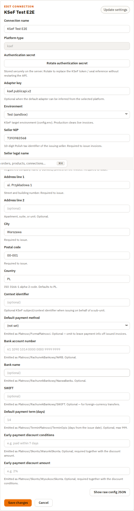

Fill in the section:

- **Default payment method** - pick `Przelew (bank transfer)` from the
  dropdown (emitted as `FormaPlatnosci`).
- **Bank account number** - the seller's account number (NRB, emitted as
  `RachunekBankowy/NrRB`).
- **Bank name** - e.g. `Santander Bank Polska` (`RachunekBankowy/NazwaBanku`).
- **SWIFT** - e.g. `WBKPPLPP` (`RachunekBankowy/SWIFT`; mainly for
  foreign-currency transfers).
- **Default payment term (days)** - e.g. `14`; the due date is computed as
  this many days from the issue date (`TerminPlatnosci`).
- **Early-payment discount (skonto)** - optional pair: the discount **amount**
  (e.g. `2%`, `Skonto/WysokoscSkonta`) and its **conditions** (e.g.
  `2% if paid within 7 days`, `Skonto/WarunkiSkonta`). If you fill one, fill
  both.

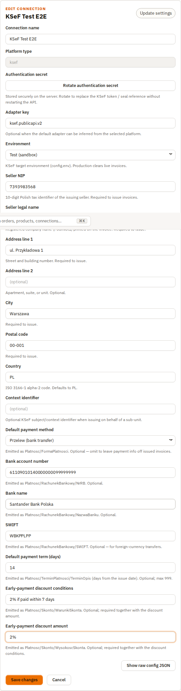

Click **Save changes**. Reopen the Edit form to confirm the values persisted -
they will be stamped onto every invoice you issue from Part 4 onwards.

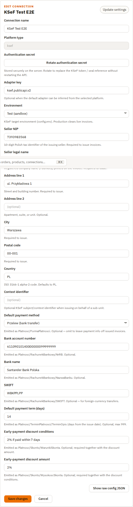

---

## Part 3 — Get a B2B order into OpenLinker

Orders flow into OpenLinker automatically from any configured source connection
(PrestaShop, Allegro, etc.) — no KSeF-specific setup is needed on the order side.
This tutorial uses a B2B order (buyer is a company) already ingested from a
PrestaShop-style source.

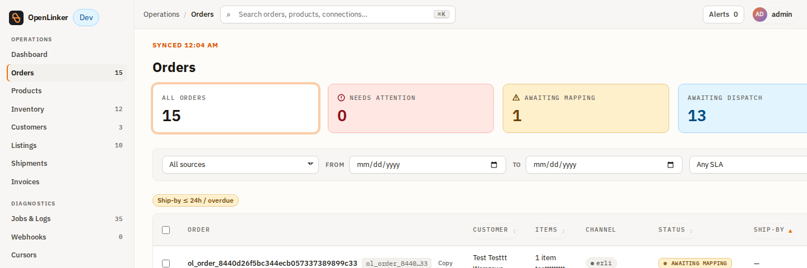

Open the order. The detail page shows the full order — line items, delivery
address, and the **Invoice** panel on the right, currently **Not issued**.

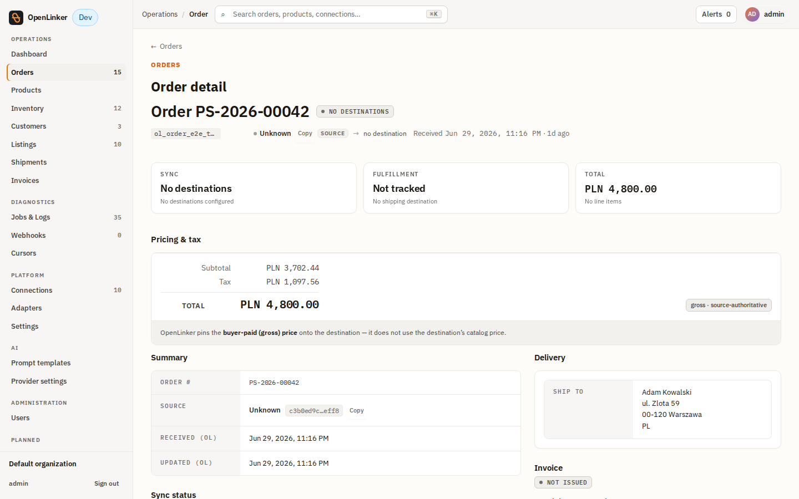

---

## Part 4 — Issue the invoice

If you have more than one Invoicing connection, the panel first shows a
**connection picker** — select your KSeF connection.

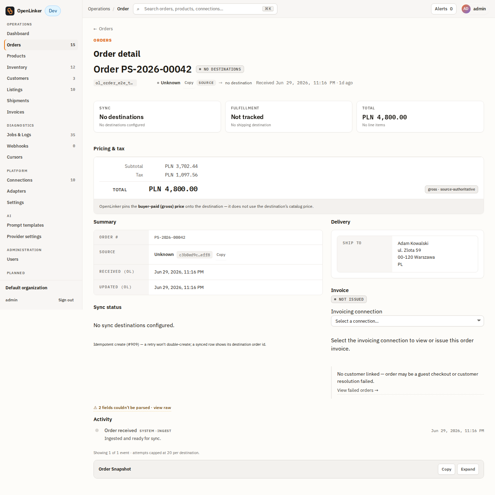

After selecting the connection, the panel shows the document-type dropdown
(defaults to **Invoice (faktura)**) and the **Issue invoice** button.

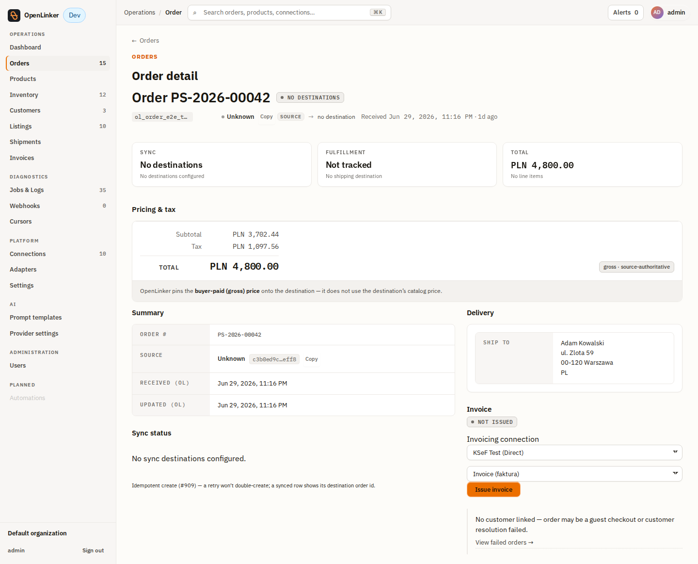

Click **Issue invoice**. OpenLinker builds the FA(3) XML payload and calls KSeF.
Once cleared, the panel shows **Issued** with the KSeF regulatory badge, the
official KSeF reference number, and the UPO / FA(3) document actions.

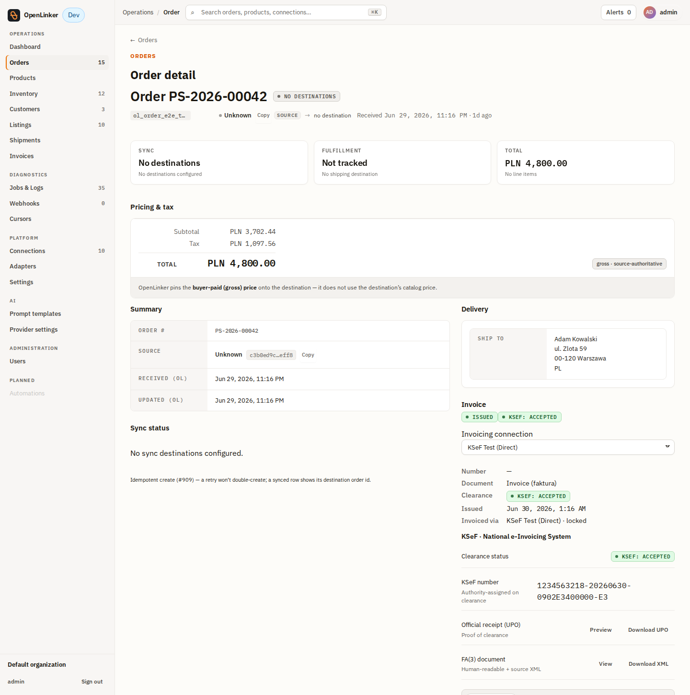

> **Async clearance:** KSeF processes documents asynchronously. Right after
> issuing, the badge typically shows **Submitted**; it updates to **Accepted**
> (green) or **Rejected** (red) once OpenLinker's regulatory-reconcile worker
> polls KSeF for the clearance status — typically within seconds on the test
> environment.

---

## Part 5 — Track clearance and download the UPO

Go to **Operations → Invoices** (`/invoices`) to see all issued documents.

Each row shows the document number, issue date, document type, invoice status,
and the KSeF regulatory badge (`pending → submitted → accepted` or `rejected`).

Click a row to open the invoice detail. The detail page shows the full issuance
timeline: when the document was sent to KSeF, when it was accepted, and the
official KSeF reference number.

Once the status reaches **Accepted**, the **Download UPO** button becomes active.
Click it to save the *Urzędowe Poświadczenie Odbioru* — the official government
receipt of clearance. Store it alongside the invoice PDF for compliance.

---

## Part 6 — Correction invoices (KOR)

If a shipped order changes after the invoice was issued (a returned item, a
price adjustment), issue a correcting document instead of editing the
original — KSeF invoices are immutable once accepted.

Open the invoice on the order detail page and click **Issue correction**.

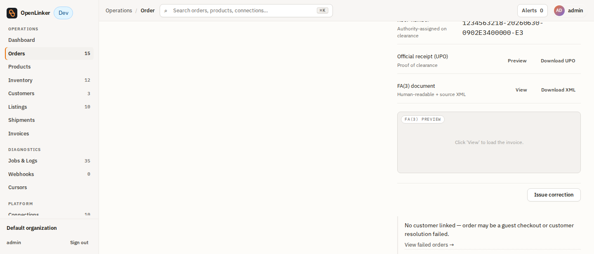

Fill in the reason and the affected line's `LP` (line number, 1-based),
plus the new quantity and/or new price. Only the fields you change need a
value — leave the others blank to keep the original.

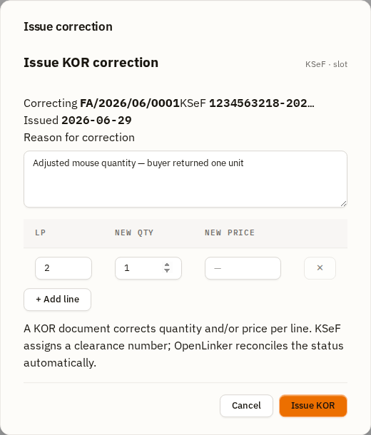

KSeF has no delta-only correction primitive — OpenLinker rebuilds the
**complete** corrected FA(3) document from the original (buyer, currency, all
lines) with your changes applied, and submits it referencing the original
document number and KSeF clearance number.

> **Corrections diff against the invoice as issued.** OpenLinker persists a
> snapshot of the invoice lines at issuance time (#1297), and your correction
> deltas are applied against that snapshot - not against the order's current
> state. If the order was edited after the invoice went out, the KOR still
> corrects the original issued values. Only invoices issued before this
> feature existed fall back to rebuilding from the order's current state.

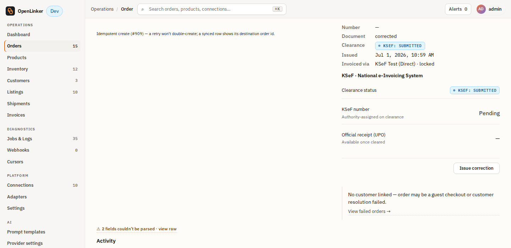

The correction appears as its own row on **Operations → Invoices**, linked to
the same order as the original — OpenLinker reconciles its clearance status
the same way as any other document.

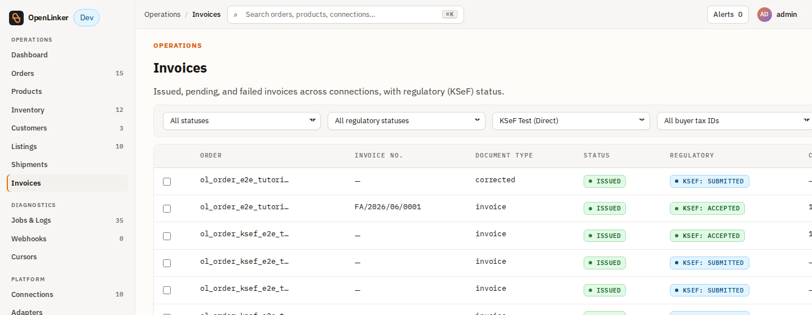

---

## Next steps

- **Automatic issuance** — instead of clicking per order, change the connection's
  **Invoice trigger** to `auto-on-paid` or `auto-on-shipped`. Edit the connection
  and set the trigger model; OpenLinker enqueues issuance automatically.

- **Operational reference** — environments table, auth types, FA(3) schema
  constraints, compliance caveats, troubleshooting:
  [`setup-guide.md`](./setup-guide.md).
