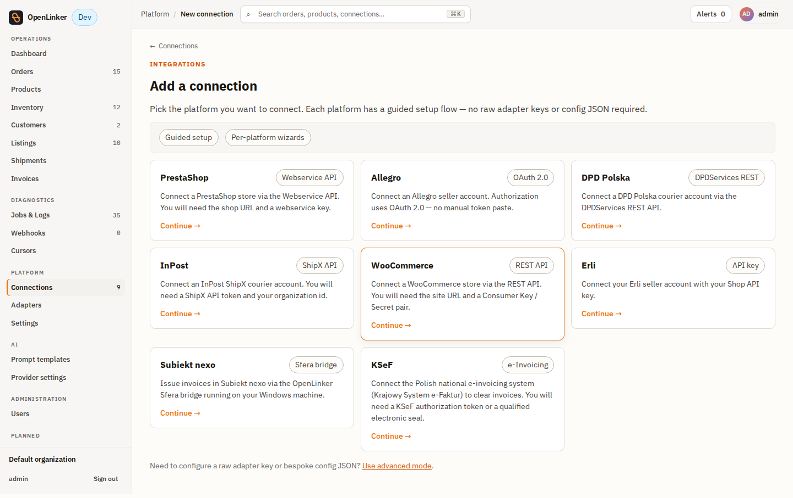
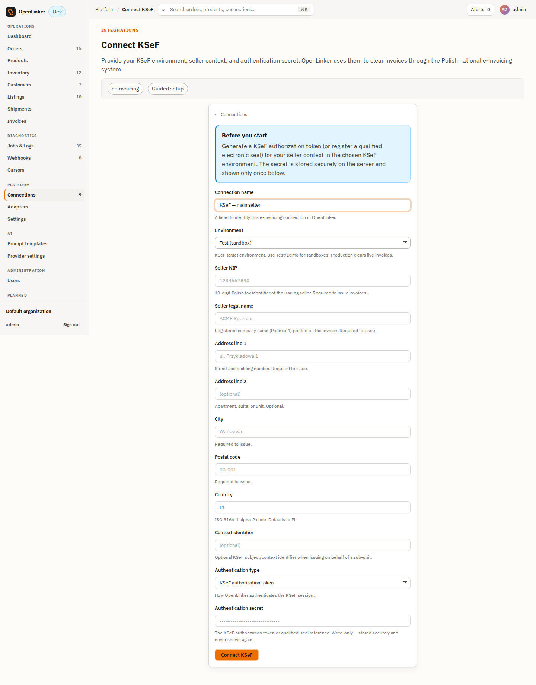
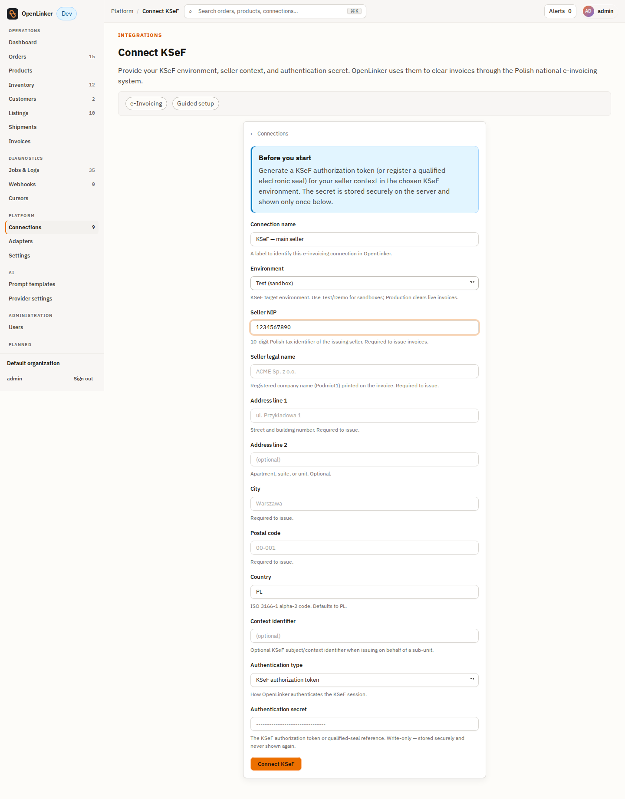
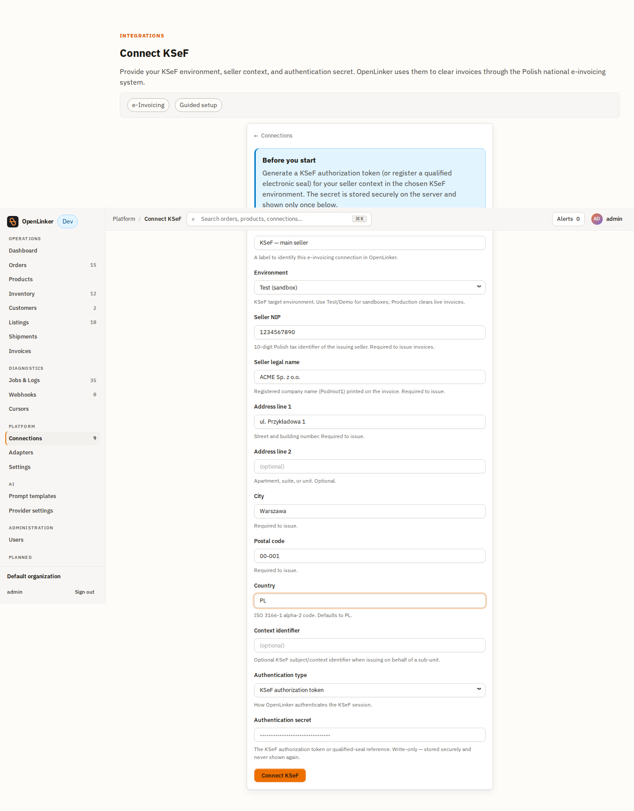
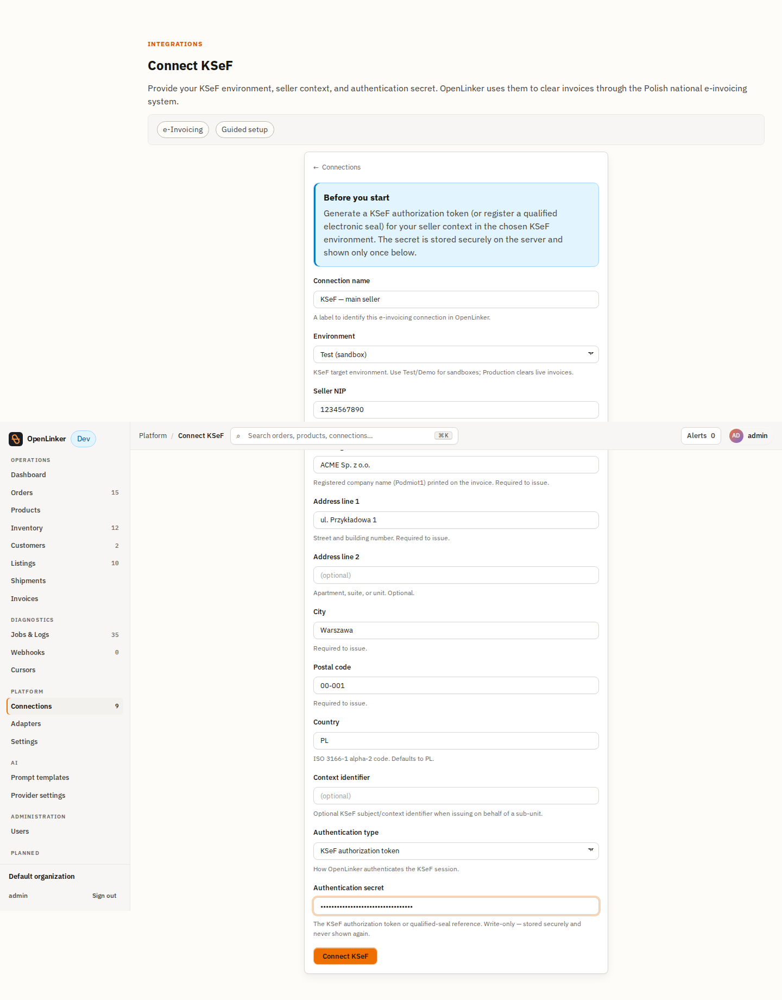
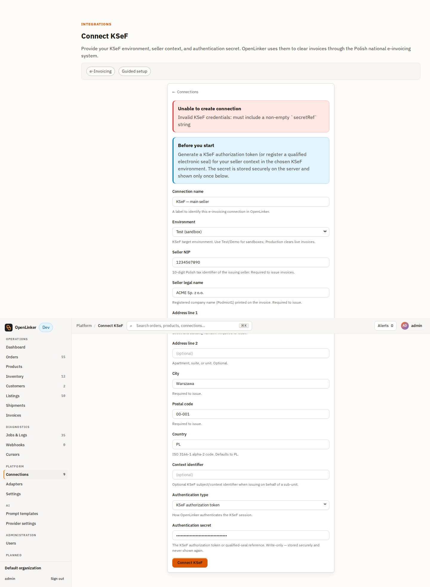
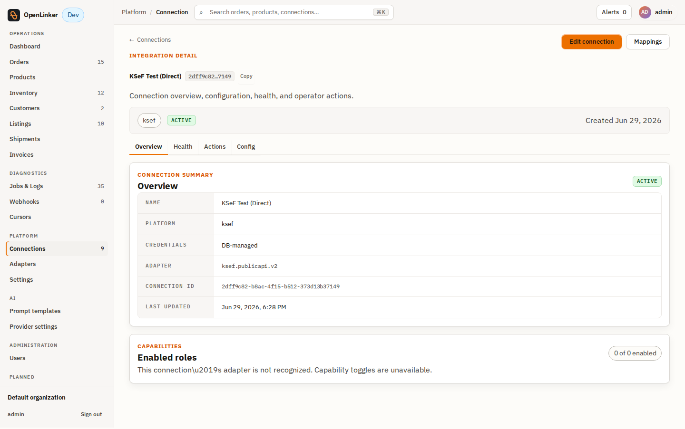
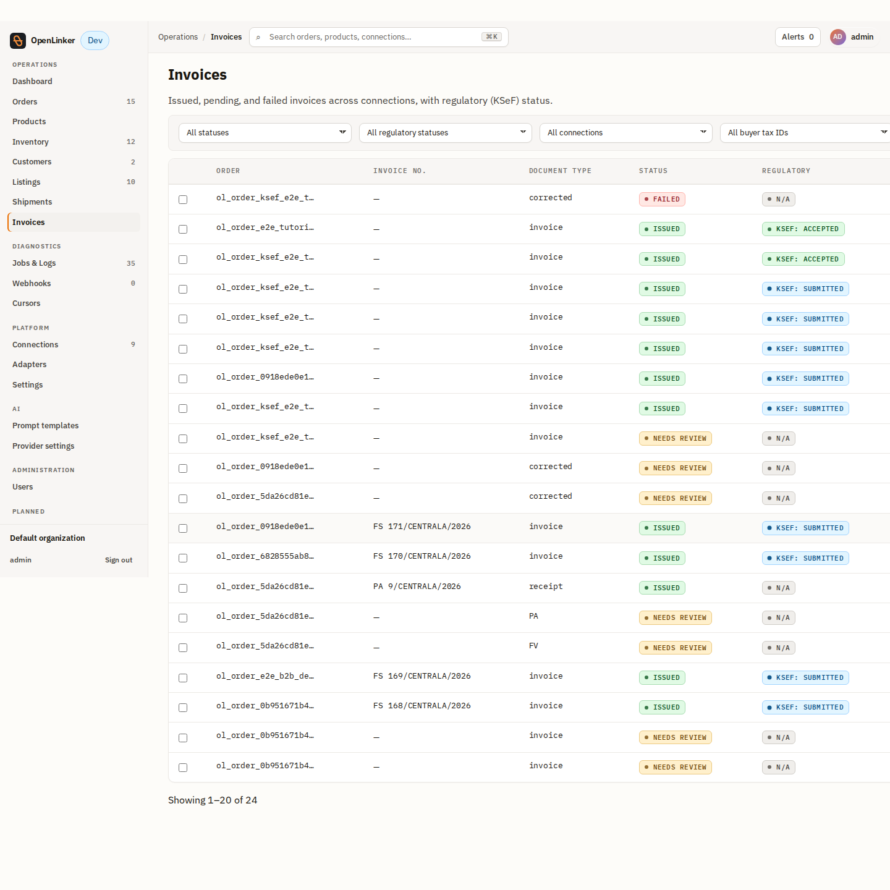
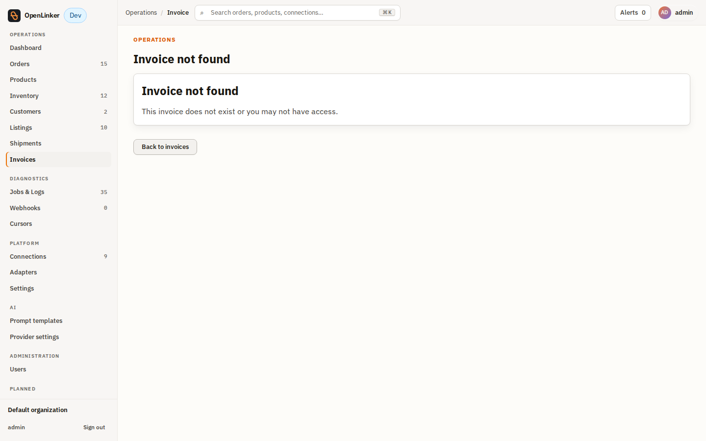

# KSeF — Operator Tutorial

Issue FA(3) VAT invoices from OpenLinker orders and submit them to KSeF
(Krajowy System e-Faktur) for government clearance — complete A-to-Z guide.

> **Happy path only.** For error handling, retry, and compliance caveats see
> [`docs/integrations/ksef/setup-guide.md`](../../../docs/integrations/ksef/setup-guide.md).

---

## What you need before you start

- OpenLinker running (API + worker + web).
- A source connection (PrestaShop, Allegro, …) already set up so orders flow in.
- Access to the KSeF portal for your target environment:
  - **Test:** `https://ksef-test.mf.gov.pl` (no legal force; use a test NIP)
  - **Demo:** `https://ksef-demo.mf.gov.pl`
  - **Prod:** `https://ksef.mf.gov.pl`
- The **NIP** (Polish tax ID) of the seller entity you will invoice as.

---

## Part 1 — Get a KSeF authorisation token

KSeF uses token-based auth. You generate a token on the KSeF portal once and store
it in OpenLinker's encrypted credential store.

1. Open the KSeF portal for your environment and log in with your NIP.
2. Navigate to **Zarządzanie tokenami** (Token management).
3. Click **Wygeneruj token** (Generate token), give it a description, and select
   the role **Wystawianie faktur** (Invoice issuance).
4. Click **Generuj** (Generate).

> ⚠️ **Copy the token now.** It is shown **only once**. Store it in a password
> manager before closing the dialog — KSeF does not let you retrieve it again.

> **Manual step.** The KSeF portal screenshots (token management UI) are taken
> directly in the browser on the KSeF portal. Use a test NIP (e.g. `9999999999`)
> and blur any real tax IDs before sharing.

---

## Part 2 — Create a KSeF connection in OpenLinker

In OpenLinker, go to **Connections** and click **Add connection**.

On the platform picker, find and select **KSeF**.

The KSeF connection wizard opens with all the fields needed for invoice issuance.

Fill in **Connection name** — a human-readable label, e.g. `KSeF — main seller`.

Select **Environment**: `test`, `demo`, or `prod` to match where you generated
the token. The test environment (`ksef-test.mf.gov.pl`) is recommended for
initial setup — documents issued there have no legal force.

Fill in **Seller NIP** — the Polish tax ID (10 digits, no dashes).

Fill in **Seller legal name** and the full seller address (street, city, postal
code, country `PL`). These appear verbatim on every issued invoice.

Choose **Authentication type**. Two options are available:

- **KSeF authorization token** — paste the token you generated in Part 1. This
  is the most common option.
- **Qualified electronic seal** — for entities using a qualified e-seal
  certificate instead of a KSeF token.

Paste your KSeF token (or seal certificate) into **Authentication secret**.
The value is stored encrypted and never shown again.

Click **Connect KSeF**. The connection is created with the **Invoicing** capability.

The new KSeF connection appears in the Connections list:

Click the connection row to view its detail page — environment, NIP, status, and
the capability breakdown.

---

## Part 3 — Get a B2B order into OpenLinker

KSeF issues a **faktura VAT** when the buyer address contains a **NIP**. Orders
without a NIP use a different document type (or are skipped by KSeF rules).

Orders flow into OpenLinker automatically from any configured source connection
(PrestaShop, Allegro, etc.). For the issuance flow to work, the order must have
arrived with a buyer NIP in the address block.

> **PrestaShop:** fill the **VAT number** field on the customer's company address
> in the PrestaShop back office. OpenLinker reads this field during order ingestion
> and stores it on the order snapshot.

---

## Part 4 — Issue the invoice

Open **Operations → Orders**. Find the order you want to invoice and click it.

The order detail page shows the full order with the **Invoice** panel. If you
have multiple Invoicing connections, the panel first shows a **connection picker**
— select your KSeF connection.

The panel shows **Not issued** with the document type pre-set to
**Invoice (faktura VAT)** (when a NIP is present). Click **Issue invoice**.

OpenLinker builds the FA(3) XML payload, calls KSeF, and the panel transitions
to **Issued**. The KSeF regulatory status badge appears as **Submitted** while
KSeF processes the document asynchronously.

> **Async clearance:** KSeF processes documents asynchronously. The badge updates
> to **Accepted** (green) or **Rejected** (red) when OpenLinker's
> regulatory-reconcile worker polls KSeF for the clearance status — typically
> within seconds on the test environment.

---

## Part 5 — Track clearance and download the UPO

Go to **Operations → Invoices** (`/invoices`) to see all issued documents.

Each row shows the document number, issue date, document type, invoice status,
and the KSeF regulatory badge (`pending → submitted → accepted` or `rejected`).

Click a row to open the invoice detail. The detail page shows the full issuance
timeline: when the document was sent to KSeF, when it was accepted, and the
official KSeF reference number.

Once the status reaches **Accepted**, the **Download UPO** button becomes active.
Click it to save the *Urzędowe Poświadczenie Odbioru* — the official government
receipt of clearance. Store it alongside the invoice PDF for compliance.

---

## Part 6 — Correction invoices (KOR)

When a previously accepted invoice needs correction (wrong amount, buyer data,
etc.):

1. Open the invoice detail page.
2. Click **Issue correction** — the correction flow pre-fills the original
   document data and the KSeF reference number.
3. Adjust the fields that changed (quantity, price, VAT rate) and confirm.

OpenLinker issues a KOR document that references the original KSeF number. Both
the original and the correction appear on the `/invoices` list.

---

## Next steps

- **Automatic issuance** — instead of clicking per order, change the connection's
  **Invoice trigger** to `auto-on-paid` or `auto-on-shipped`. Edit the connection
  and set the trigger model; OpenLinker enqueues issuance automatically.

- **Pair with Subiekt nexo** — if you also use Subiekt nexo, you can issue the
  document via the Subiekt bridge and separately submit the resulting FS number to
  KSeF through the KSeF connection. See
  [`libs/integrations/subiekt/tutorial.md`](../subiekt/tutorial.md).

- **Operational reference** — environments table, auth types, FA(3) schema
  constraints, compliance caveats, troubleshooting:
  [`docs/integrations/ksef/setup-guide.md`](../../../docs/integrations/ksef/setup-guide.md).
