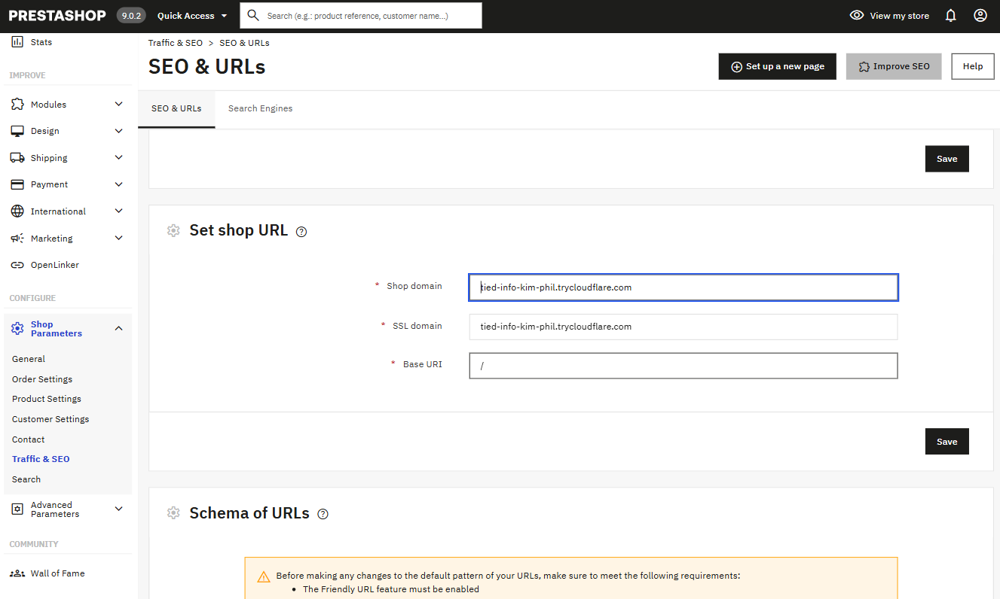
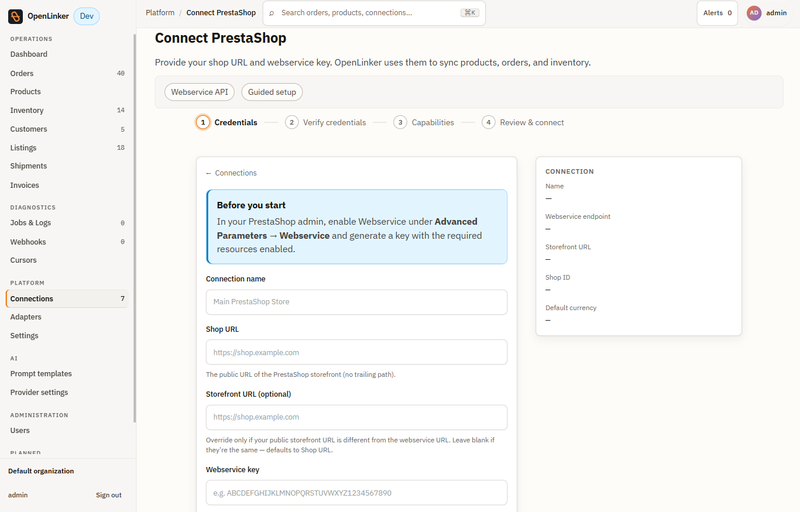
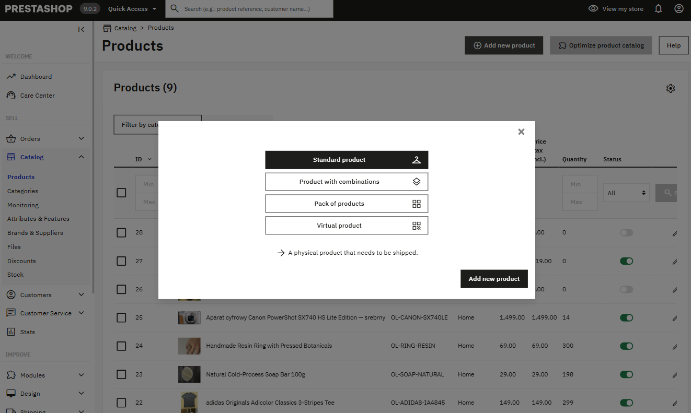
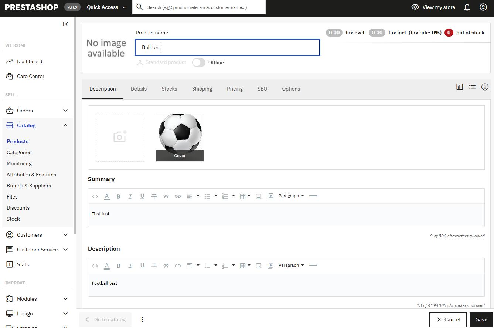
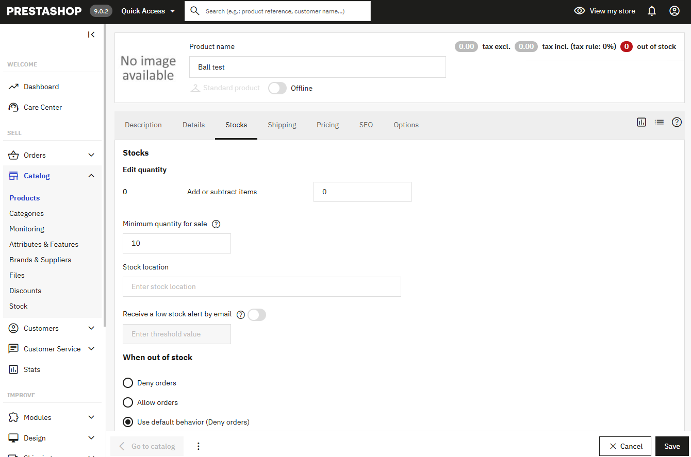
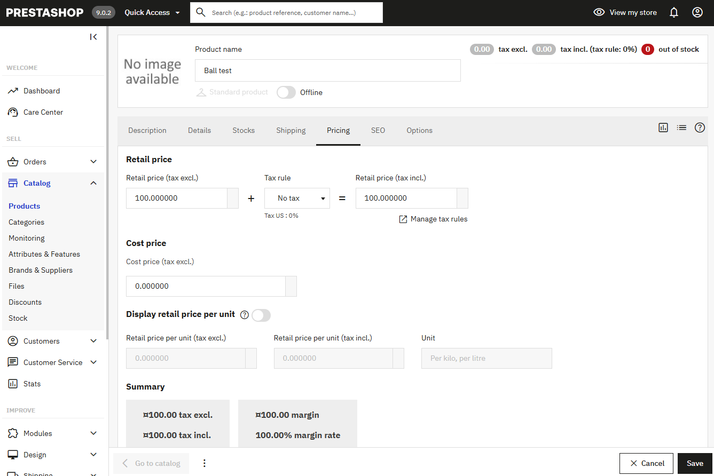
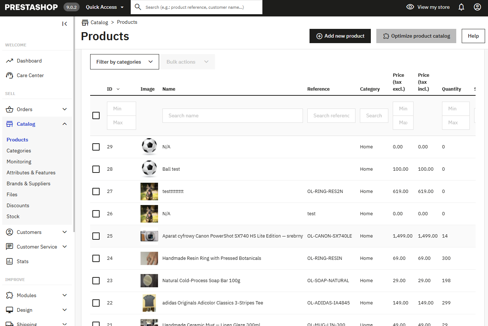
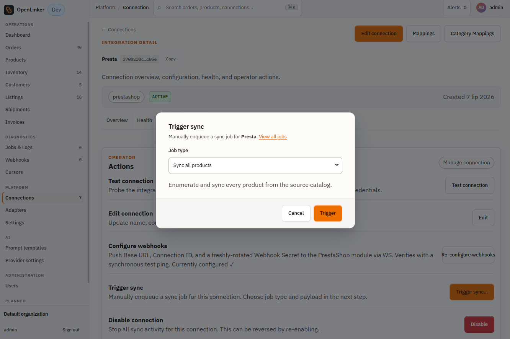
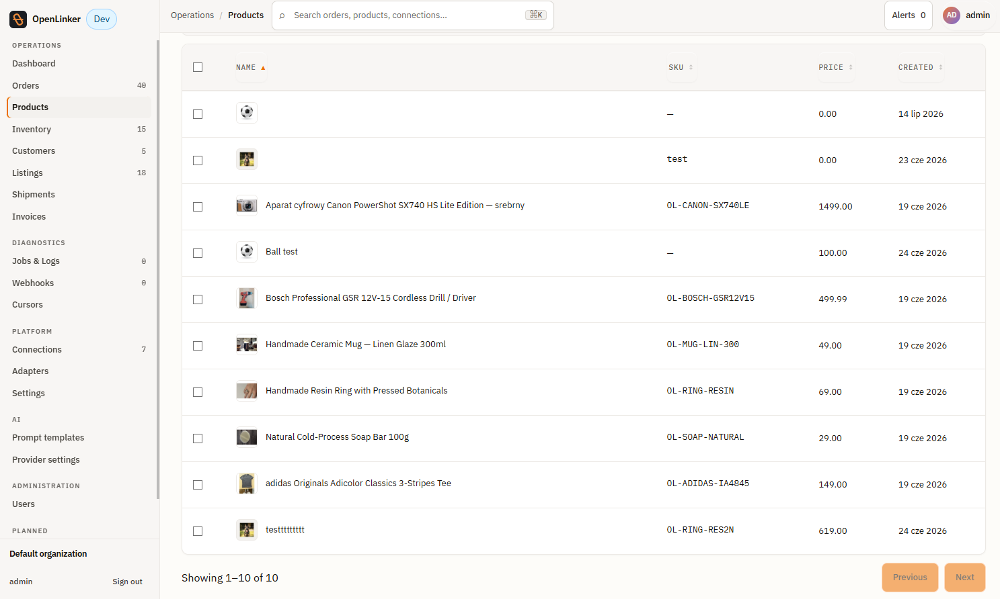

# PrestaShop Integration Setup Guide

Step-by-step: from a fresh PrestaShop store to a working OpenLinker connection
with catalog sync, inventory propagation, order ingest, and reliable order
creation.

## Prerequisites

- PrestaShop 8.0 or later (9.0.x is the tested/target version — it's what the
  dev stack ships)
- PrestaShop's **Webservice** enabled (Advanced Parameters → Webservice)
- OpenLinker API server running

> **Using InPost paczkomat lockers?** See [`paczkomat.md`](./paczkomat.md) for
> the InPost-specific address setup — it's a separate, optional step from the
> core connection flow below.

## 1. Generate a PrestaShop webservice API key

1. Log in to PrestaShop admin → **Advanced Parameters → Webservice**
2. Confirm the webservice toggle is **enabled** (the top of the page)
3. Click **Add new webservice key**
4. Fill in the key form:
   - **Description**: e.g. `OpenLinker`
   - **Permissions**: this is a per-resource checkbox grid. At minimum:
     - Tick the **View (GET)** column header to grant read on all resources —
       OpenLinker reads products, combinations, stock, orders, customers,
       addresses, carriers, categories, currencies, and more.
     - Also tick **Modify (PUT)** and **Add (POST)** on the **Configurations**
       row specifically. OpenLinker writes to `ps_configuration` when you
       click **Configure webhooks** later (Step 6) — without this, that
       button will fail.
5. Save and copy the generated key — shown in full only once


> Ignore a "Webservice URL rewriting not functional" warning on the status
> panel if you see one — that check runs from inside the PrestaShop container
> against its own internal hostname and doesn't reflect reachability from OL.

## 2. Create the connection in OpenLinker

1. In the OpenLinker web app → **Add connection** → **Guided setup** → choose
   **PrestaShop**
2. Fill in the fields:

   > **HTTPS is required for the Shop URL.** Set the SSL domain in PrestaShop
   > under **Shop Parameters → Traffic & SEO → SEO & URLs → Set shop URL**
   > (the **SSL domain** field, alongside **Shop domain**), and use a
   > `https://` Shop URL when creating the connection below — the
   > webservice key travels as Basic Auth on every request, so a plain
   > `http://` Shop URL exposes it in transit.
   >
   > 

   **No public TLS yet (local/demo store)?** Get an HTTPS URL in one command
   with a free [Cloudflare Quick Tunnel](https://developers.cloudflare.com/cloudflare-one/connections/connect-networks/do-more-with-tunnels/trycloudflare/)
   — no account needed:

   ```bash
   cloudflared tunnel --url http://localhost:8080
   # → prints something like https://tied-info-kim-phil.trycloudflare.com
   ```

   Use the printed `https://...trycloudflare.com` URL as **both** the SSL
   domain above and the Shop URL below. The URL rotates every time you
   restart the tunnel, so re-run **Test Connection** (and re-set the SSL
   domain) after restarting it. Any other tunnel tool (ngrok, etc.) or a real
   domain with a proper certificate works the same way.

   

   | Field | Required? | What it's for |
   |---|---|---|
   | **Connection name** | yes | Human-readable label, e.g. `My PrestaShop store` |
   | **Shop URL** | yes | The webservice base URL, e.g. `https://shop.example.com`. **Must be HTTPS** — see the callout above. |
   | **Webservice key** | yes | The key from Step 1 |
   | **Storefront URL** | no | Only set this if your public storefront is on a different host than the webservice URL. Leave blank to default to Shop URL. |
   | **Shop ID** | no | Only for multi-shop PrestaShop installations. Leave blank for a single-shop install. |
   | **OL callback URL** | no (but required before Step 6) | OpenLinker's own URL, as reachable **from PrestaShop** — not derived automatically, since guessing it from request headers would be a spoofing risk. Local/Docker dev: `http://host.docker.internal:3000`. Production: your public OL API URL. |
   | **Fallback carrier** | no | Which PrestaShop carrier to use when an incoming shipping method has no explicit mapping. Leave unset to fall back to the **OpenLinker Dynamic** carrier (Step 5) once it's installed — this always works and carries the exact marketplace shipping cost. |
   | **InPost PS module type** | no | Only if you use InPost paczkomat lockers — see [`paczkomat.md`](./paczkomat.md). |

3. Click **Create connection** — you're redirected to the connection detail page


### Verify

Click **Test connection** on the detail page (**Actions** tab) — it should
return a green success indicator confirming the webservice key is valid and
reachable.

## 3. Enable capabilities

After the connection is saved, enable the capabilities you need:

| Capability | What it does |
|---|---|
| `ProductMaster` | Reads the PrestaShop catalog into OL (products, variants/combinations, categories) |
| `InventoryMaster` | Syncs PrestaShop stock levels → marketplace offer quantities |
| `OrderSource` | Ingests PrestaShop orders into OL (`date_upd` watermark polling — see §8) |
| `OrderProcessorManager` | Creates PrestaShop orders from marketplace order events |
| `ProductPublisher` / `CategoryProvisioner` | Advanced: lets OL create/update products and categories directly in PrestaShop, for setups where PrestaShop is a *destination* catalog rather than the source. Most operators using PrestaShop as their master shop won't need these — skip unless you know you do. |

## 4. Map categories to your marketplace

With `ProductMaster` enabled, the connection detail page gains a **Category
Mappings** entry. This connects your PrestaShop category tree to a
marketplace's category tree, so products can be listed in the right category
when you create marketplace offers later.

1. On the PrestaShop connection's detail page, click **Category Mappings**
2. Pick the marketplace connection at the top (auto-selected if you only have
   one)
3. Click a PrestaShop category on the left — the right panel activates
4. Browse or search the marketplace's category tree, then click **Select**
5. Click **Save mapping** — the left-panel row updates to show the mapped
   category


To change a mapping, click the category again and pick a different target.
To remove one, click **Clear mapping** in the green preview bar. This step
is optional — you can skip it and map categories later, right before
creating your first offer.

## 5. The OL Dynamic Carrier module

PrestaShop's own order-creation endpoint recomputes shipping cost from the
carrier's own price-range tables and ignores whatever total OpenLinker sends
— which would silently produce the wrong shipping charge on marketplace
orders. The **OpenLinker PrestaShop module** closes this gap, and does two
other useful things at the same time:

1. **Reliable order creation** — a front controller that creates orders
   through PrestaShop's own canonical order-validation flow, so the carrier,
   shipping cost, and totals on the resulting order are always correct (see
   §7 below).
2. **Dynamic shipping carrier** — an OL-owned carrier that reports the exact,
   authoritative shipping cost OpenLinker calculated for that order.
3. **Webhook outbox** — captures product/order/stock changes in PrestaShop
   and delivers them to OpenLinker as webhooks, for near-real-time sync
   instead of relying purely on polling.

Installing this module is **recommended, not strictly required** — without
it, order creation still works via your own carrier mappings or a configured
fallback carrier (§2), just without the "exact marketplace shipping cost,
zero configuration" convenience the module provides.

### Installing — development

1. Bind-mount the module into your PrestaShop container:
   ```yaml
   services:
     prestashop:
       volumes:
         - ./apps/prestashop-module/openlinker:/var/www/html/modules/openlinker
   ```
2. Start/restart PrestaShop: `docker compose up -d prestashop`
3. PrestaShop admin → **Modules → Module Manager** → search "OpenLinker" →
   **Install**
4. Code edits under `apps/prestashop-module/openlinker/` apply instantly —
   no reinstall needed while developing

### Installing — production

1. Package the module: `cd apps/prestashop-module && zip -r openlinker.zip openlinker/`
2. PrestaShop admin → **Modules → Module Manager** → **Upload a module** →
   select the zip
3. Click **Install** on the uploaded module

<!-- SCREENSHOT: PS Module Manager showing the OpenLinker module installed -->

### Module configuration

Once "Configure webhooks" (§6) has run, the module's **Base URL**,
**Connection ID**, and **Webhook Secret** are pushed automatically — you
don't need to enter them by hand. One thing still needs a manual step:

- **Cron Token**: generated automatically on install. Open the module's
  config page (**Improve → OpenLinker** in the left sidebar, or **Modules →
  Module Manager → OpenLinker → Configure**) and copy it, then wire up a
  system cron job on the PrestaShop server to drive webhook delivery:

  ```bash
  # Every 1–5 minutes
  */2 * * * * curl -s "https://your-shop.com/index.php?fc=module&module=openlinker&controller=cron&token=YOUR_CRON_TOKEN" > /dev/null 2>&1
  ```

<!-- SCREENSHOT: OL module admin config page showing the cron token field -->

Everything else on that page (event-type toggles, batch size, retry
attempts, backoff multiplier) has sane defaults — leave them unless you have
a specific reason to change them. Full internals (outbox pattern, event
deduplication, retry/backoff design) are documented in the module's own
[README](../../../../apps/prestashop-module/openlinker/README.md).

## 6. Configure webhooks

With the module installed (§5) and the **OL callback URL** set on the
connection (§2), click **Configure webhooks** on the connection detail page.

This one click:
- rotates a fresh webhook secret for this connection,
- pushes the Base URL, Connection ID, and that secret into PrestaShop via the
  webservice (the reason Step 1 needed **Configurations** write permission),
- and fires a test ping to confirm the round-trip works —

all in a single request. You'll see a success indicator once it completes.


Without this step, OpenLinker still ingests orders via polling (§8) — webhooks
just make it near-real-time instead.

## 7. How orders reach PrestaShop

OpenLinker creates orders through PrestaShop's own order-validation flow
(the same path PrestaShop's checkout itself uses), not a raw insert — that's
why the shipping cost and carrier on the resulting order are always correct,
instead of being silently recomputed or dropped.

Carrier resolution for an incoming order, in order of priority:

1. Your own explicit shipping-method mapping (configured per marketplace
   connection), if one exists for that shipping method
2. The **fallback carrier** you set in §2, if configured
3. The **OpenLinker Dynamic** carrier (§5) — always available once the
   module is installed, and always carries the exact marketplace shipping
   cost

Guest customers are auto-provisioned for marketplace buyers, and PrestaShop's
own order-confirmation emails are suppressed by default on these
OL-imported orders (the marketplace already notified the buyer). To let
PrestaShop send its own emails too, set **OPENLINKER_IMPORT_SEND_MAIL** to
`1` in the module's configuration.

## 8. Environment variables

| Variable | Default | Description |
|---|---|---|
| `OL_PRESTASHOP_POLL_SCHEDULER_ENABLED` | `true` | Enable the `prestashop-orders-poll` scheduler task. Set to `false` to disable order polling entirely (only sensible if webhooks — §6 — are configured and reliable). |
| `OL_PRESTASHOP_POLL_INTERVAL_CRON` | `0 */10 * * * *` | Poll cadence — every 10 minutes by default. |
| `OL_PRESTASHOP_POLL_PAGE_LIMIT` | `100` | Orders fetched per polling page. |
| `OL_PRESTASHOP_FULFILLMENT_STATUS_SYNC_SCHEDULER_ENABLED` | `true` | Enable fulfillment-status sync back to PrestaShop. |
| `OL_PRESTASHOP_FULFILLMENT_STATUS_SYNC_INTERVAL_CRON` | `0 */15 * * * *` | Fulfillment-status sync cadence. |
| `OL_PRESTASHOP_FULFILLMENT_STATUS_SYNC_PAGE_LIMIT` | `100` | Orders checked per sync page. |
| `OL_PRESTASHOP_FULFILLMENT_STATUS_SYNC_UPDATED_SINCE_DAYS` | `30` | How far back to look for orders needing a status check. |

Add any overrides to your worker `.env`.

## 9. Local development

The dev stack includes a pre-configured PrestaShop instance at
**http://localhost:8080** (WooCommerce, if you also run it, uses `8082` to
avoid the collision):

```bash
# Start the full dev stack (includes PrestaShop)
pnpm dev:stack:up

# Re-seed the fixture catalog if needed (idempotent — safe to run multiple times)
pnpm dev:stack:seed-prestashop
```

**Dev stack PrestaShop credentials:**

| Field | Value |
|---|---|
| URL | http://localhost:8080 |
| Admin panel | http://localhost:8080/admin-dev/ (`demo@prestashop.com` / `prestashop_demo`) |
| Webservice key | **generated manually** — there is no automated retrieval script for PrestaShop (unlike WooCommerce's `pnpm dev:stack:wc-credentials`). Follow Step 1 above against the dev-stack admin every time you rebuild the stack. |

The dev stack seeds five fixture products on first boot (sourced from real
Allegro listings, covering the variant/EAN-coverage matrix the codebase
exercises) — see the full table in
[`docs/getting-started.md`](../../../../docs/getting-started.md#dev-fixture-catalogue)
rather than duplicating it here.

For the complete first-time walkthrough (connection creation, category
mapping, first offer, first order) with a guided narrative, see
[`docs/getting-started.md`](../../../../docs/getting-started.md).

## 10. Verify catalog sync with a test product

Once `ProductMaster` is enabled (§3), the fastest way to confirm the
connection is actually pulling catalog data is to create a throwaway product
in PrestaShop and watch it show up in OL.

1. PrestaShop admin → **Catalog → Products → Add new product** → pick
   **Standard product** (a plain physical product is enough for a smoke test)

   

2. Fill in a name, optionally an image and a description, then **Save**

   

3. On the **Stocks** tab, set a quantity so the product isn't `0` in stock

   

4. On the **Pricing** tab, set a retail price

   

5. Confirm the product now appears in the PrestaShop products list

   

6. Rather than waiting for the next scheduled sync job, force it: on the OL
   connection detail page → **Actions** → **Trigger sync** → job type
   **Sync all products** → **Trigger**

   

7. Once the job completes (check **Jobs & Logs** in the left nav), the
   product shows up in OL's own **Products** list

   

If the product doesn't appear after the sync job succeeds, re-check that
`ProductMaster` is enabled on the connection (§3) and that the webservice key
still has **View (GET)** permission on the **Products**, **Combinations**,
and **Stock** resources (§1).

## 11. Troubleshooting

| Symptom | Cause | Fix |
|---|---|---|
| "Configure webhooks" fails | Webservice key is missing **Modify (PUT)** / **Add (POST)** permission on **Configurations** | Edit the key's permissions in PS Admin → Advanced Parameters → Webservice and retry |
| Test connection fails, but the key looks right | Webservice is disabled, or the key lacks **View (GET)** on a resource OL needs (products, orders, customers, carriers, categories, currencies, …) | Re-check the permission grid — tick the **View** column header to grant read on everything |
| Orders fail with "no shipping methods available" | OpenLinker's cart-build step for that order didn't complete before order creation, so no shipping-cost sidecar row exists for the cart | Check the worker logs for the failed order's `marketplace.order.sync` job; the OL Dynamic carrier fails closed rather than silently charging zero |
| Carrier picked is unexpected / wrong shipping charge on some orders | No explicit shipping-method mapping and no fallback carrier set, and the OL module isn't installed | Install the OL Dynamic Carrier module (§5), or set an explicit fallback carrier (§2) |
| Order created without expected customer-group discounts/restrictions | `guestCustomerGroupId` unset — defaults to PrestaShop group `2` | Set **Fallback carrier** section's sibling field `guestCustomerGroupId` in the connection's advanced config to match your shop's actual guest group |
| Module install fails with "This functionality has been disabled" | PrestaShop is still in demo mode, or a leftover `/install` folder exists | Disable demo mode and remove the `/install` directory, then retry |
| Multi-shop install: "Configure webhooks" pushes config to the wrong shop scope | PrestaShop ≥8.2 multi-store may reject the plain config-write body OL sends; explicit shop-scope targeting isn't implemented yet | Known limitation for multi-store installs — configure the three module settings (Base URL, Connection ID, Webhook Secret) manually on the affected shop via the module's own admin page instead |
| Orders not appearing in OL | `OL_PRESTASHOP_POLL_SCHEDULER_ENABLED=false` and webhooks aren't configured | Set the scheduler flag to `true`, or complete §6 |
| Editing the OL Dynamic carrier in PS Admin seems to "lose" its ID | Expected PrestaShop behavior — editing a carrier duplicates the row and assigns a new `id_carrier` | No action needed; the module automatically detects this and stays in sync. Only relevant if you're editing the underlying database directly. |
