# Subiekt GT — integration setup guide

Issue **invoices** (faktura) and **receipts** (paragon) in **Subiekt GT** for the
orders OpenLinker ingests from your shop or marketplace. OpenLinker never talks to
Subiekt directly — it goes through the **OpenLinker Subiekt bridge**, a small .NET
service you run on the Windows machine where Subiekt GT is installed.

> **What you get:** the `Invoicing` capability for a Subiekt connection — issue a
> document for an order (manual, from the order screen, or auto-on-paid), track its
> status and KSeF (e-faktura) state, and download the PDF.

---

## How it works

```
Shop / marketplace        OpenLinker                 Subiekt Bridge (Windows)      Subiekt GT
(orders)            →     (orchestrates)      →      (HTTPS + Bearer)        →     (Sfera GT / COM)
                          - connection of type            - translates to              - issues the
                            "Subiekt GT"                    Sfera GT business ops        real FS / PA
                          - issues invoices for                                          document, numbering,
                            ingested orders                                              KSeF
```

- **OpenLinker** holds a *connection* of type **Subiekt GT** pointing at the bridge.
- **The bridge** runs next to Subiekt on Windows, exposes an HTTP(S) API, and translates
  OpenLinker's neutral invoice command into **Sfera GT** business operations — classic COM
  automation against Subiekt GT (COM ProgID `InsERT.GT`), **not** the separate .NET Sfera SDK
  (`InsERT.Moria.Sfera`), which is a different, unrelated InsERT product/API.
- **Subiekt GT** issues the real document (faktura `FS …` / paragon `PA …`), assigns
  the number, and handles KSeF.

**Document type is driven by the buyer tax id:** an order issued **with** a buyer NIP
becomes a **faktura** (B2B); **without** one it becomes a **paragon** (B2C).

---

## Prerequisites

1. **Windows machine with Subiekt GT and a Sfera GT license/component installed** — COM
   automation (ProgID `InsERT.GT`) requires the Sfera GT add-on to be present and licensed
   for the Subiekt GT installation. Verified against a live InsERT GT 1.89 SP1 installation.
2. **.NET 8 runtime** on that machine (the bridge itself is a .NET service; it does *not*
   need the .NET Sfera SDK — it drives Subiekt through COM).
3. **The bridge** — the OpenLinker Subiekt bridge you build/run on the Windows machine. See
   [Part A](#part-a--run-the-bridge-on-windows) for the essentials.
4. **An order source connection** in OpenLinker — e.g. a **PrestaShop** connection — so
   there are orders to invoice. See [Connecting a platform](../../../../docs/user-guide/02-connecting-a-platform.md).
5. **Network reachability:** OpenLinker must reach the bridge over HTTP(S). On a LAN this
   is the Windows host's address, e.g. `https://192.168.1.50:5055`.
6. **No process supervision.** The bridge has no Windows Service wrapper and no
   auto-restart — it runs as a foreground console process via its launcher script, and
   closing that console window stops the bridge. Plan accordingly (e.g. leave the console
   open on a machine that stays logged in, or wrap it in your own supervisor) — there is no
   built-in equivalent to a service that restarts itself after a crash or reboot.

---

## Part A — Run the bridge on Windows

1. **Launch the bridge** via its `.bat` launcher script (e.g. `start-bridge.bat`) — run it
   directly, either by double-clicking it or from `cmd`. It builds and starts the bridge as
   a **foreground console process**; the console window must stay open, and closing it stops
   the bridge (there is no background service — see the prerequisites note above).
2. **Ports.** The bridge listens on two ports:
   - **5056 (plain HTTP)** — always open. With no certificate configured this is the port
     OpenLinker reaches the bridge on, and the one bridge-hosted images are served from.
   - **5055 (HTTPS)** — opens only when `CertificatePath` / `CertificatePassword` are set.
     Use it when the bridge and OpenLinker are not on the same trusted network.
3. **Choose the bridge token yourself.** `InvoiceToken` is a shared secret **you invent**.
   Nobody issues it, it is not printed anywhere, and it is not compiled into the binary.
   Put a long random string in the bridge's `appsettings.json` (or set
   `OL_BRIDGE_INVOICE_TOKEN`), and paste **the same value** into the *Bridge token* field
   in [Part B](#part-b--connect-subiekt-in-openlinker). The two must match exactly.

   Until you set it, every `/api/*` request answers `401` with
   `bridge token is not configured`. That is deliberate — a credential compiled into a
   binary is a credential everybody has — but it means an unset token is not a "no
   security" mode, it is a bridge that serves OpenLinker nothing.

   > An earlier version of this guide said the credentials were "hardcoded constants in
   > the bridge" and told you to consult your bridge operator. That was wrong, and wrong
   > in the direction that leaves you stuck: there is nobody to consult.

   The bridge's other settings resolve the same way — environment variable
   `OL_BRIDGE_<KEY_UPPER_SNAKE>`, then `appsettings.json` beside the executable, then a
   built-in default. `PublicBase` (`OL_BRIDGE_PUBLIC_BASE`, default
   `http://host.docker.internal:5056`) builds the public URLs the bridge returns for
   images; those are fetched from *outside* the bridge machine, so they must never resolve
   to `localhost`.
4. **Firewall.** Allow inbound TCP on the bridge ports:
   ```powershell
   New-NetFirewallRule -DisplayName "OpenLinker Subiekt GT bridge" -Direction Inbound `
     -Protocol TCP -LocalPort 5055,5056 -Action Allow -Profile Private
   ```
   Scope it to the profile your LAN actually uses. The bridge's only authentication is the
   shared token, so do not expose these ports to the internet.
5. **Smoke-test** from the machine where OpenLinker runs — **both halves**:
   ```powershell
   # Is it up? /health is anonymous by design.
   Invoke-RestMethod http://<bridge-host>:5056/health

   # Does the token work? /health cannot tell you - it is exempt from auth.
   Invoke-RestMethod http://<bridge-host>:5056/api/bank-accounts `
     -Headers @{ Authorization = "Bearer <your-token>" }
   ```
   A `200` with a `{ success: true, ... }` envelope means the token works. A `401` means it
   does not, and the response body says which problem you have — a wrong value, or a bridge
   where `InvoiceToken` was never set.

> A healthy bridge's console shows it listening and logs a successful Sfera GT session
> start. OpenLinker's **Test connection** (Part B) runs the authorized check above, so a
> green result there means reachable **and** authorized.

---

## Part B — Connect Subiekt in OpenLinker

OpenLinker ships a **guided wizard** for Subiekt. In OpenLinker go to **Connections → Add
connection**.

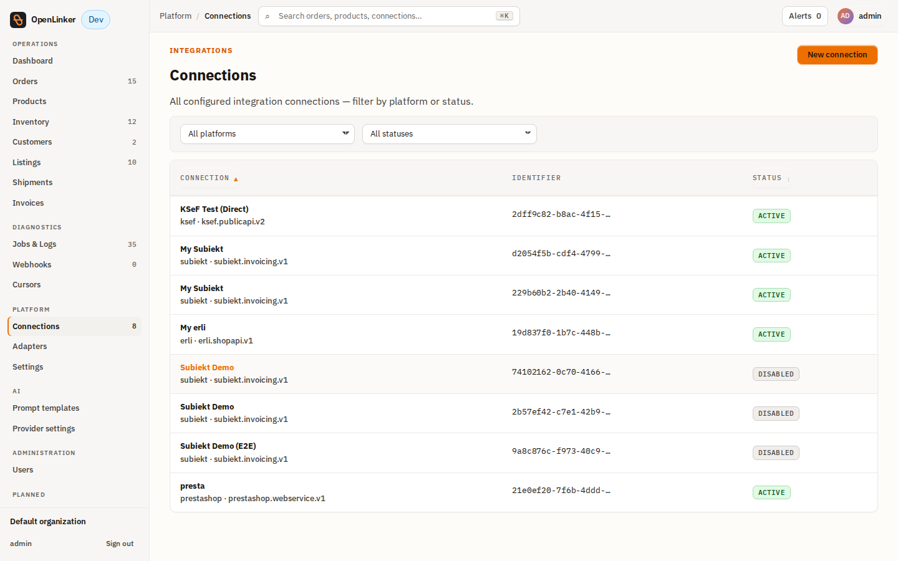

Pick **Subiekt GT** on the platform picker.

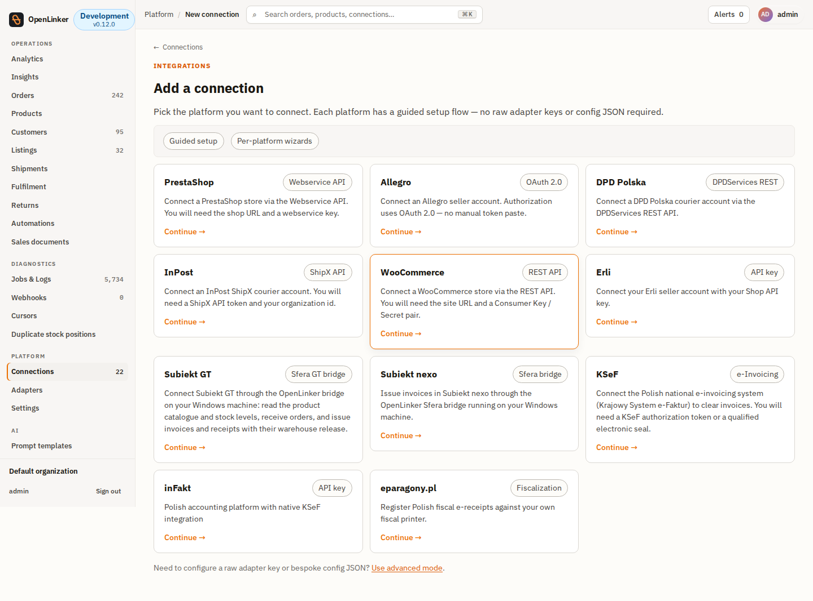

Fill the wizard:


- **Connection name** — a label, e.g. `My Subiekt`.
- **Bridge URL** — the bridge address, **without** `/api` (the adapter appends the paths),
  e.g. `http://192.168.1.50:5056`, or `https://192.168.1.50:5055` once you configure a
  certificate.
- **Bridge token** — **required**. The value you chose in
  [Part A](#part-a--run-the-bridge-on-windows) step 3. The bridge rejects every request
  without it. Stored encrypted, never shown again.

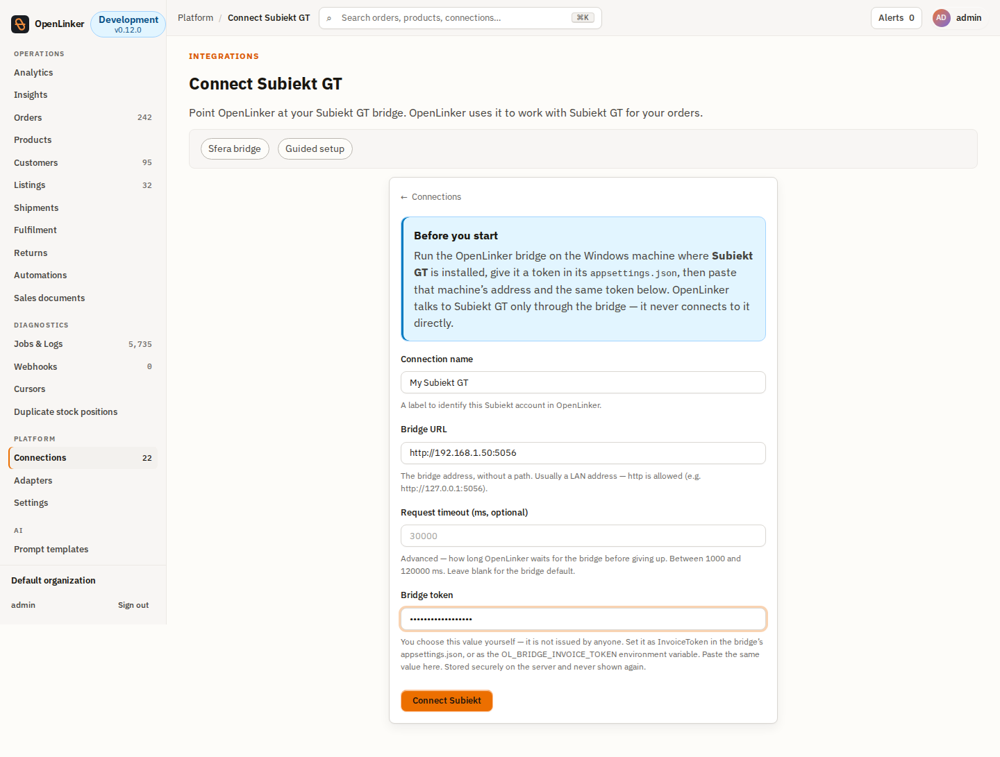

Click **Connect Subiekt**. After it's created, click **Test connection** — this probes an
authorized bridge route, so a green result means the bridge is reachable **and** your token
works.

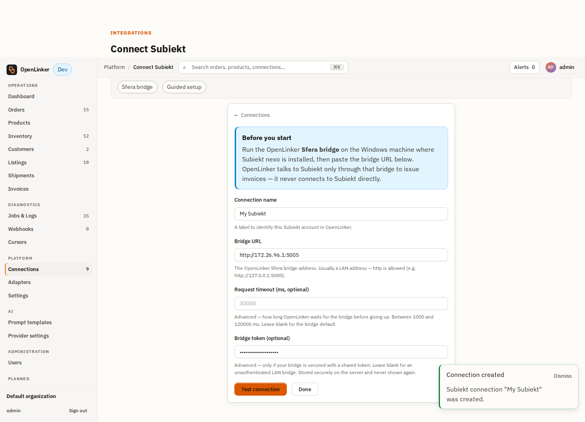

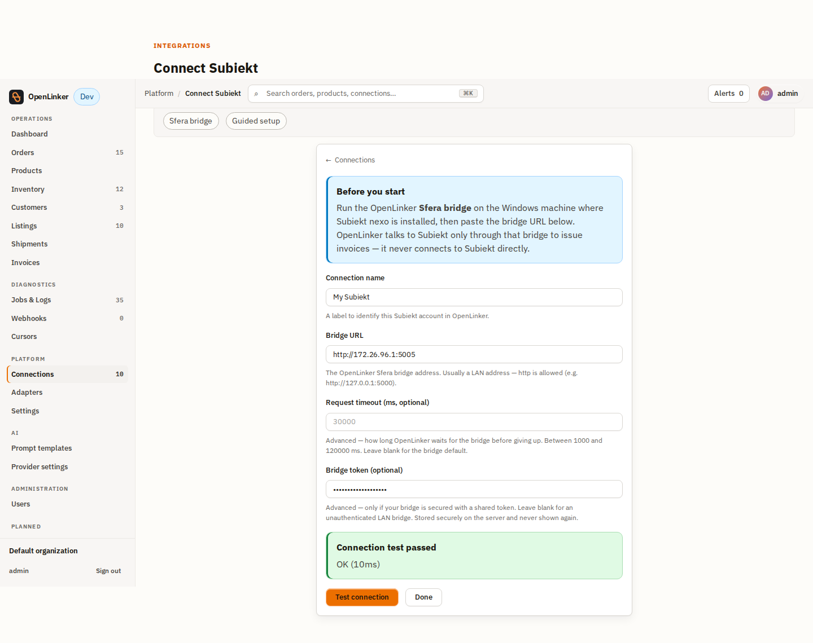

The new connection shows up with its capabilities — `Invoicing`, `ProductMaster`,
`InventoryMaster`, `OrderSource` and `OrderProcessorManager`:

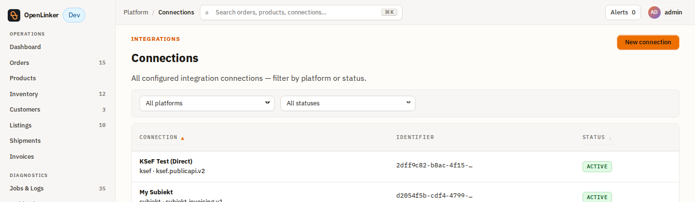

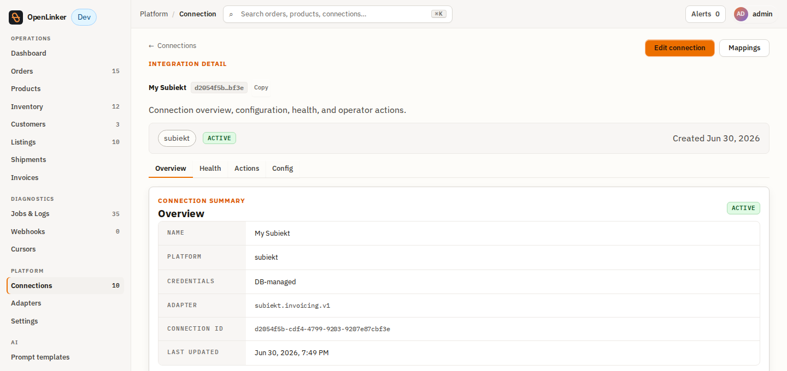

> **Advanced mode (alternative).** You can also add the connection via **Add connection →
> Use advanced mode**: `Platform type = subiekt-gt`, `Adapter key = subiekt.gt.v1`,
> `Credentials JSON = { "bridgeToken": "<token>" }`,
> `Config JSON = { "bridgeBaseUrl": "http://<host>:5056", "invoicing": { "triggerModel": "manual" } }`.
> Leave `Enabled capabilities` empty so the API fills it from the adapter manifest — typing a
> narrower set here is how a connection silently loses a capability it should have had.
> **Do not type `subiekt` or `subiekt.invoicing.v1`**: those are retired, nothing validates
> them, and the connection would be created and then recognised by no adapter.

---

## Part B2 — Configure the connection (settings & triggers)

Open the connection and click **Edit** (or **Connections → My Subiekt → Edit**) to reach
the settings. Everything you set in the wizard is editable here, plus:

- **Invoice trigger** — how issuance is kicked off:
  - **Manual** — you issue from the order screen (Part D). Default.
  - **Auto on order paid** — OpenLinker enqueues issuance automatically when an order
    becomes paid.
  - **Auto on order shipped** — same, on the shipped transition.
  - **Batched** — issuance is deferred and processed in scheduled batches.
- **Show KSeF status badge** — surface the bridge-reported regulatory (KSeF) status on
  orders for this connection.
- **Rotate bridge token** — replace the stored bearer token without restarting the API
  (e.g. after the bridge's token is rotated). The token is write-only — stored
  encrypted, never shown back.
- **Adapter key** — `subiekt.gt.v1` (inferred from the platform; rarely changed).

Click **Save changes**.

---

## Part C — Get an order (PrestaShop example)

OpenLinker issues invoices for orders it has ingested. Any order source works; this example
uses a **PrestaShop** order with a company buyer (for a B2B faktura).

In the PrestaShop back office, create the customer.

Add a company address for them (the **Company** + **VAT number / NIP** fields make it a B2B
buyer).

Create the order (**Orders → Add new order**): pick the customer, add a product, choose the
company address, a carrier, **Payment = accepted**, and create it.

OpenLinker ingests the order on its next PrestaShop poll (or webhook). It appears on the
**Orders** screen, `ready`, with its line items and the buyer address.

---

## Part D — Issue the invoice

Open the order in OpenLinker. The **Invoice** panel shows **Not issued** with a
**document-type** dropdown and an **Issue invoice** button. Pick the document type —
**Invoice (faktura)** for B2B (with the buyer NIP) or **Receipt (paragon)** for B2C — then
issue. (If more than one Invoicing connection is active, the panel also shows a connection
picker; pick the right Subiekt connection so the document isn't issued against the wrong
one.)

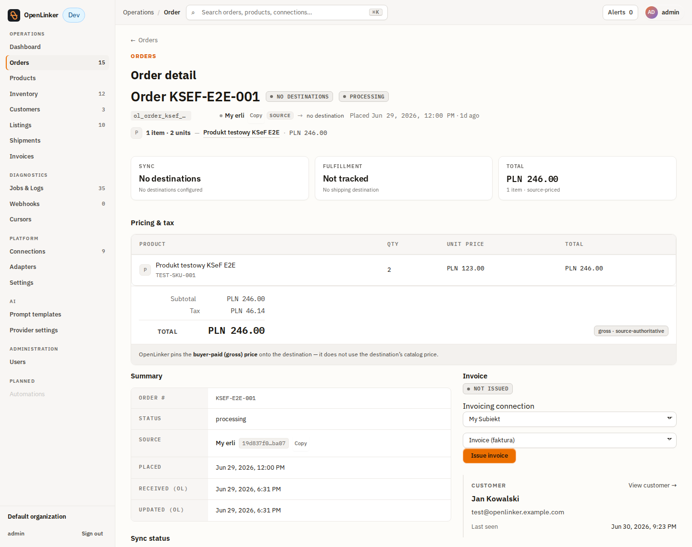

Click **Issue invoice**. OpenLinker calls the bridge, Subiekt issues the document, and the
panel flips to **Issued** with the document number, type, and KSeF badge:

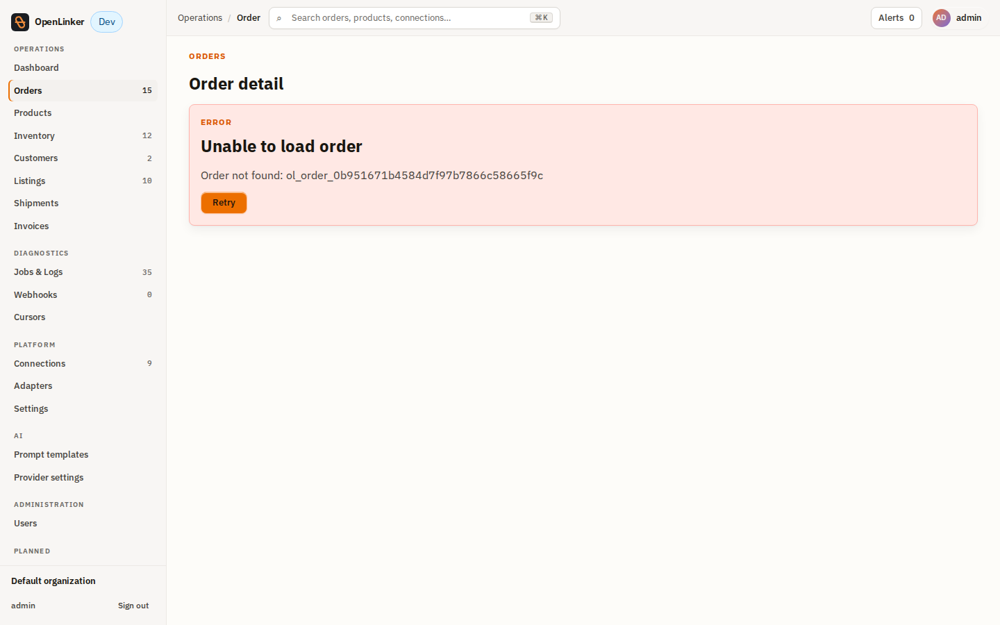

To issue **without clicking** per order, use an automatic trigger — see
[Part E](#part-e--automatic-issuance-retry--idempotency).

### Verify

1. **In OpenLinker — `/invoices`** (Operations → Invoices): the list, filterable by status,
   KSeF state, connection and date. Your document is there with its number and KSeF badge;
   the PDF link works.

   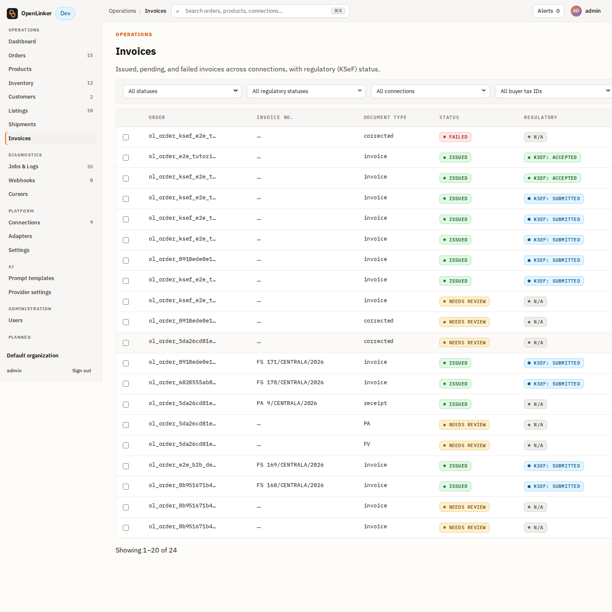

2. **In Subiekt GT** — open **Dokumenty → Sprzedaży** and find the number (e.g.
   `FS …/CENTRALA/2026`). Line items, VAT and the buyer match.

   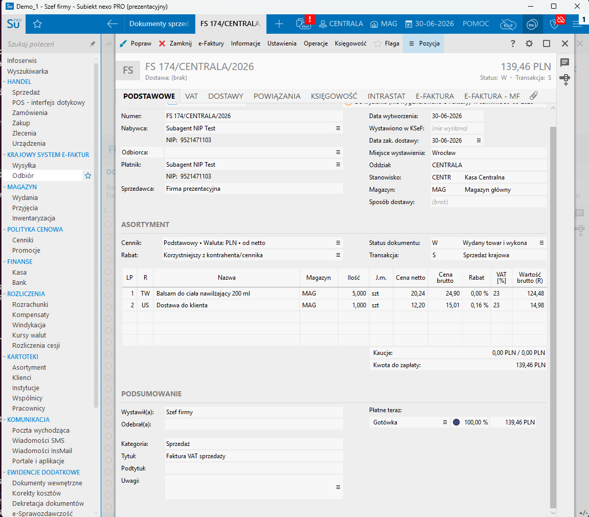

3. **KSeF** — the badge moves from `pending` to `accepted` as the regulatory reconcile job
   refreshes it (demo/trial environments report a non-authoritative status).

---

## Part E — Automatic issuance, retry & idempotency

**Auto-issue.** Instead of clicking per order, set the connection's **Invoice trigger**
([Part B2](#part-b2--configure-the-connection-settings--triggers)) to **Auto on order
paid** (or **shipped**). When an ingested order reaches that state, OpenLinker enqueues
issuance automatically — no operator action. The result shows on the order's Invoice panel
and on `/invoices` exactly as a manual issue does.

**Idempotency.** Issuance is keyed `invoice:{connectionId}:{orderId}`. A repeated trigger
event — or an operator who clicks twice — never creates a second document; OpenLinker
returns the existing one. An explicit attempt to re-issue an already-issued order is
rejected with **409 Conflict** ("Invoice already issued for order"). This is the guarantee
that makes auto-issue safe to leave on.

**Retry a failure.** If issuance fails (e.g. the bridge was briefly unreachable, or the
buyer NIP was malformed), the document shows **Failed** on the order panel and on
`/invoices`, and the panel offers a **Retry** button. Fix the cause (e.g. correct the NIP)
and retry — the same idempotency key applies, so a retry that actually succeeded upstream
won't duplicate. The `/invoices` list lets you filter by **Failed** to find everything
needing attention.

## Part F — Invoice PDF & KSeF status

**PDF.** When the bridge returns a document PDF URL, the issued Invoice panel and the
`/invoices` row expose an **invoice PDF** link (a signed, time-limited URL the bridge
renders from Subiekt). If the bridge doesn't return one, the number degrades to copy-text —
no broken link.

**KSeF (e-faktura).** With **Show KSeF status badge** enabled on the connection, issued
documents carry a regulatory badge — `pending → sent → accepted` (or `rejected`).
OpenLinker refreshes it asynchronously via the regulatory-status reconcile job; you don't
poll manually. On a demo/trial database the status is reported by the bridge but is **not**
an authoritative government clearance — see the [runbook](./runbook.md#ksef--e-faktura).

---

## Next steps & reference

- Operational reference — TLS/auth/firewall, env keys, the **version support matrix**,
  trial constraints, and troubleshooting — is in the [runbook](./runbook.md).
- The neutral invoicing domain and why document-type policy sits above the adapter:
  [ADR-026](../../../../docs/architecture/adrs/026-country-agnostic-invoicing-domain.md).
