# Subiekt nexo — Operator Tutorial

Issue faktura (FS) and paragon (PA) documents in Subiekt nexo for OpenLinker orders —
complete A-to-Z guide covering the bridge, the OpenLinker wizard, and the full
order → invoice flow.

> **Happy path only.** For TLS config, firewall, version matrix, and troubleshooting
> see [`runbook.md`](./runbook.md).

---

## What you need before you start

- **Windows machine** with Subiekt nexo PRO + Sfera (the SDK ships with the
  demo/trial database; a production nexo requires the paid Sfera add-on).
- **.NET 8 runtime** on the Windows machine.
- The [`openlinker-subiekt-bridge`](https://github.com/openlinker-project/openlinker-subiekt-bridge)
  repository cloned (not yet published).
- OpenLinker running (API + worker + web) and reachable from the Windows machine.
- A **source connection** (e.g. PrestaShop or Allegro) already set up in OpenLinker
  so that orders flow in.

---

## Part 1 — Configure and run the bridge

The bridge translates OpenLinker's neutral invoice command into Sfera SDK operations
that Subiekt nexo executes. It runs as a console app on Windows (started via
PowerShell — **not** a compiled exe).

### 1a — Configure `appsettings.json`

Open `bridge/Subiekt.Bridge.Api/appsettings.json` and fill in the Sfera paths
and SQL connection. Secrets go in **environment variables only** — never in the file.

```json
{
  "Port": 5005,
  "Auth": { "Enabled": true, "ApiKey": "" },
  "Sfera": {
    "BinariesDir": "%LOCALAPPDATA%\\InsERT\\Deployments\\Nexo\\<deployment>\\Binaries",
    "SqlServer":   "localhost\\INSERTNEXO",
    "SqlDatabase": "Nexo_Demo_1",
    "SqlUseWindowsAuth": true,
    "NexoUser":    "Szef"
  }
}
```

> **Auth is header-fixed, not configurable.** The bridge only accepts
> `Authorization: Bearer <token>` — there is no `HeaderName` option to change
> it. OpenLinker's client also sends a redundant `x-bridge-token: <token>`
> header alongside `Authorization`, but the bridge ignores it; only the
> `Authorization: Bearer` value is checked.

Replace `<deployment>` with the folder name visible under
`%LOCALAPPDATA%\InsERT\Deployments\Nexo\`.

> **Windows auth:** `SqlUseWindowsAuth: true` uses the current Windows session —
> no SQL password needed. Set `false` and supply `Sfera__SqlPassword` if you use
> SQL Server auth instead.

### 1b — Set secrets in PowerShell

Open **PowerShell** and navigate to the repository root. Set the secret
environment variables for the current session:

```powershell
cd C:\Users\<user>\repos\openlinker-subiekt-bridge

$env:Auth__ApiKey       = "a-strong-random-token"   # copy this — it's your bridgeToken
$env:Sfera__NexoPassword = "your-nexo-operator-password"
# Only needed when SqlUseWindowsAuth = false:
# $env:Sfera__SqlPassword = "your-sql-password"
```

> If OpenLinker runs on the same machine as the bridge, `http://127.0.0.1:5005`
> works as the **Bridge URL** in Part 2. If OpenLinker runs elsewhere on your
> network, use this machine's LAN IP (`ipconfig` → IPv4 Address) instead.

### 1c — Start the bridge

```powershell
dotnet run -c Release --project bridge/Subiekt.Bridge.Api
```

The console should print:

```
Now listening on: http://127.0.0.1:5005
...
Sfera session opened — zalogowano
```

> **Non-loopback binding (remote):** if OpenLinker runs on a different machine,
> the bridge must listen on a non-loopback address with TLS. Generate a dev cert:
> ```powershell
> dotnet dev-certs https -ep dev-cert.pfx -p your-cert-password
> $env:Tls__CertPassword = "your-cert-password"
> $env:ASPNETCORE_URLS = "https://0.0.0.0:5005"
> dotnet run -c Release --project bridge/Subiekt.Bridge.Api
> ```

### 1d — Smoke-test the bridge

From another PowerShell window:

```powershell
Invoke-RestMethod http://127.0.0.1:5005/health
# → {"status":"ok","bridge":"up","sferaSession":"valid","subiekt":"reachable"}
```

A `"sferaSession":"valid"` confirms the bridge authenticated with Sfera and
Subiekt nexo is reachable.

---

## Part 2 — Create a Subiekt connection in OpenLinker

In OpenLinker, go to **Connections** and click **Add connection**.


On the platform picker, find and select **Subiekt nexo**.


The guided setup wizard opens. Fill in the fields:

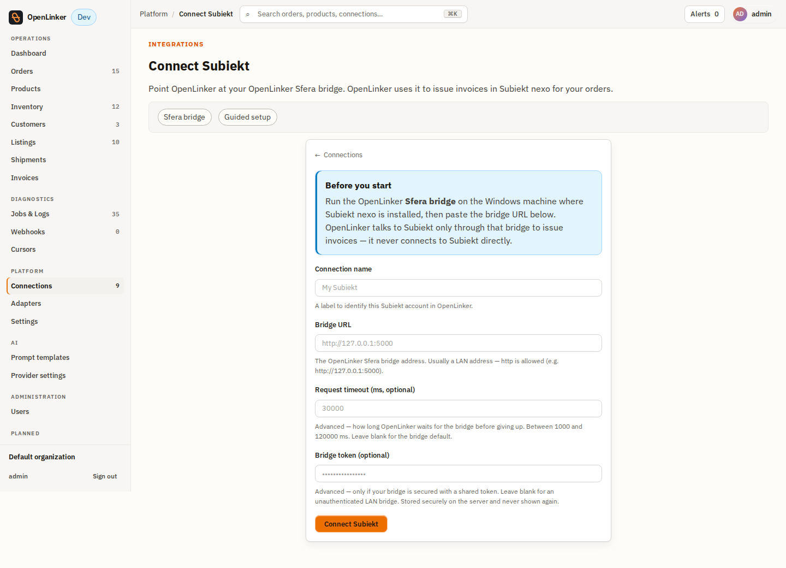

- **Connection name** — a human-readable label, e.g. `My Subiekt`.
- **Bridge URL** — the bridge base URL **without** a path suffix, e.g.
  `http://127.0.0.1:5005` (same machine) or `http://192.168.1.50:5005` (bridge
  on a different machine). The adapter appends `/api/…` paths automatically.
- **Bridge token** — paste the value you set as `Auth__ApiKey` in Part 1b.
  Stored encrypted; never shown again after save.

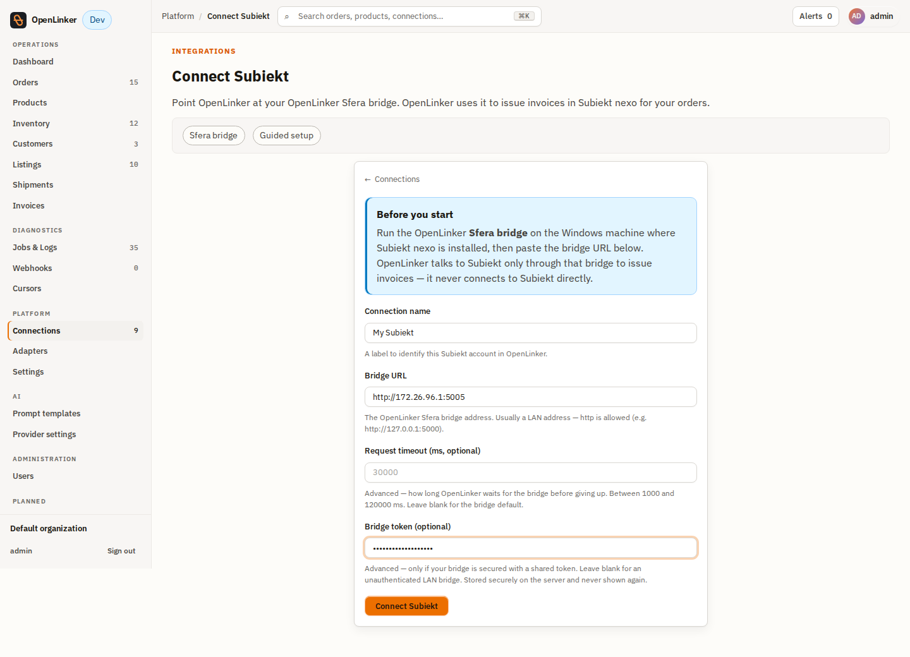

Click **Connect Subiekt**. OpenLinker creates the connection record:

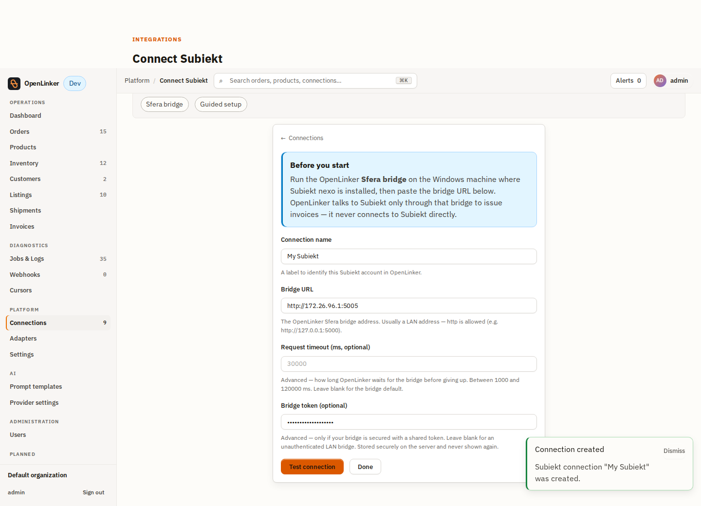

Click **Test connection** — OpenLinker calls `GET /health` on the bridge and
shows the result inline.

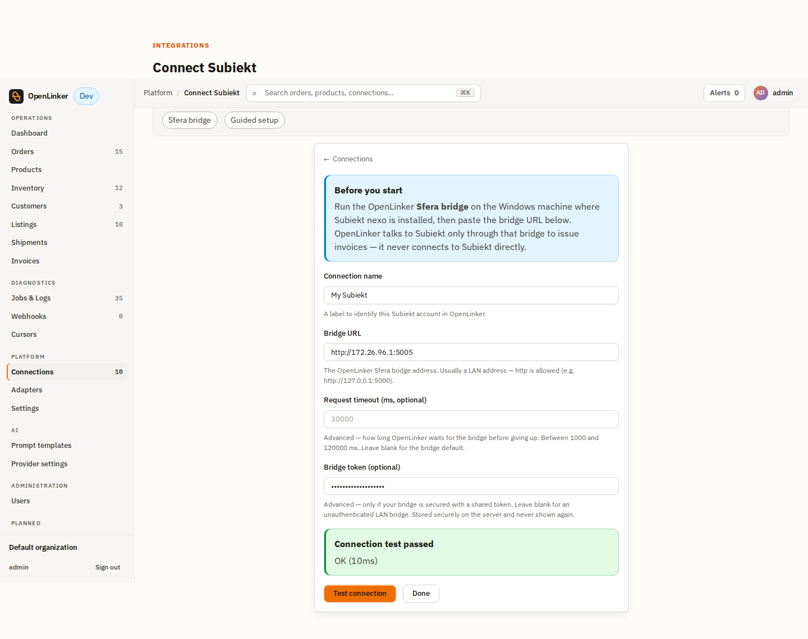

The connection now appears in the Connections list with the **Invoicing** capability badge:

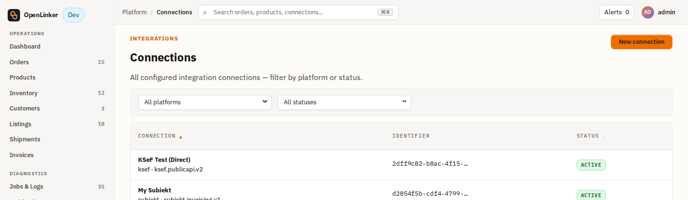

Click the connection to view its detail page:

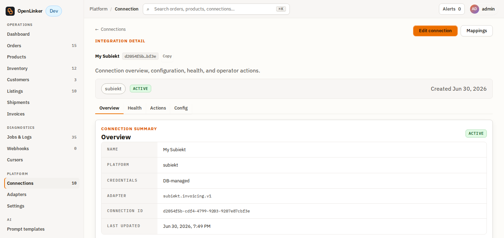

> **Advanced mode (alternative):** Add connection → Use advanced mode:
> `Platform type = subiekt`, `Adapter key = subiekt.invoicing.v1`,
> `Enabled capabilities = Invoicing`,
> `Credentials JSON = { "bridgeToken": "<token>" }`,
> `Config JSON = { "bridgeBaseUrl": "http://<host>:5005" }`.

## Part 2b - Payment method, bank account & cash register (optional)

Subiekt can stamp fiscal defaults on every invoice this connection issues: the **payment
method**, the seller **bank account** (for transfers), and the **cash register** (Stanowisko
Kasowe). Set them once and every issued faktura carries them.

Edit the connection (**Connections -> My Subiekt -> Edit**) and open the **Payment method for
invoice** section. Set **Default payment method** to `Transfer` to reveal the **bank account**
picker - the list is loaded live from Subiekt, so you pick a real account by name and number.
(Accounts are grouped by owner/platnik; a warning appears if the install has more than one
seller platnik.)


The **Cash register (Stanowisko Kasowe)** picker is also loaded live. Note the help line: the
branch (Oddzial) is fixed to the bridge session's Centrala and is not switchable per invoice,
so you only choose the cash register.

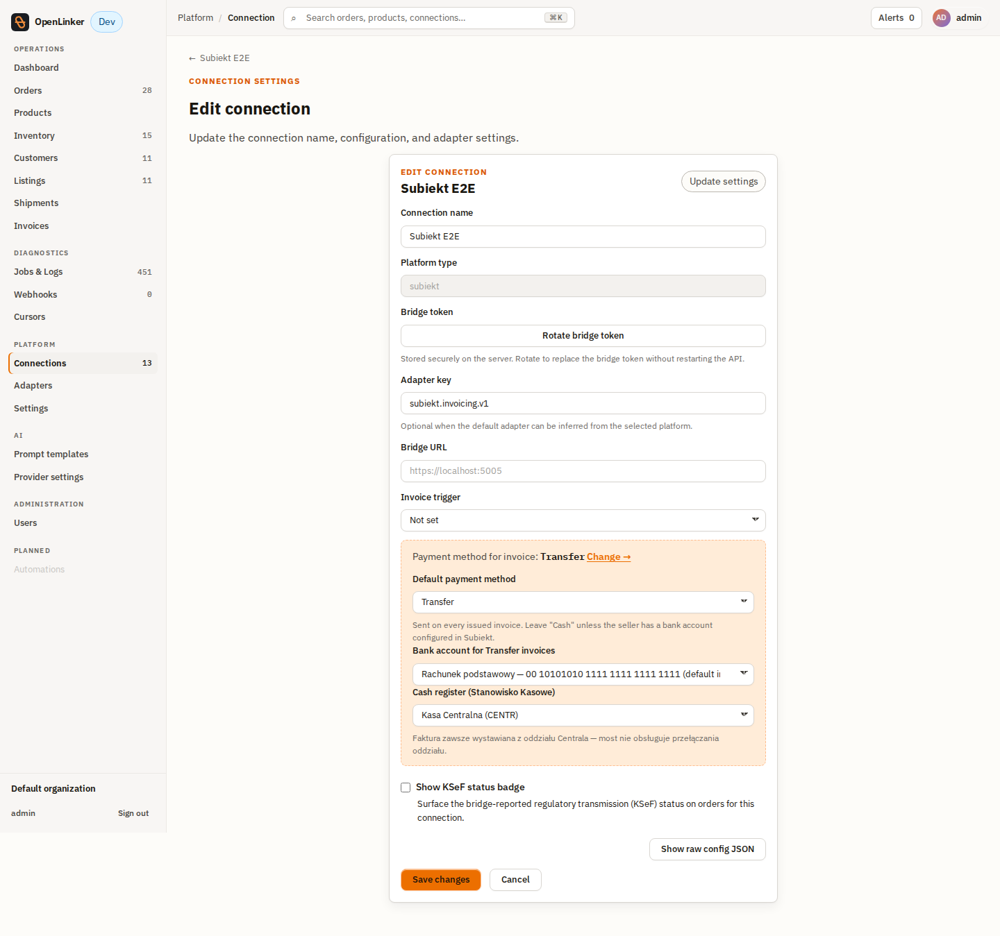

Click **Save changes**. From now on, invoices issued through this connection use these
defaults: a `Transfer` invoice books the amount to Subiekt's deferred-payment bucket and
carries the chosen bank account, and the chosen cash register lands on the document.

> **These defaults apply to a faktura (FV), not a paragon.** If the order has no buyer NIP,
> OpenLinker issues a **paragon (PA)** and the payment selection is rejected (the bridge
> returns 422). Issue a faktura (buyer with NIP, or pick **Invoice (faktura)** in Part 4) for
> the payment method / bank account / cash register to take effect.

---

## Part 3 — Get an order into OpenLinker

Orders flow into OpenLinker from any configured source connection (PrestaShop,
Allegro, WooCommerce, Erli, …). For a B2B faktura, the buyer address must
include a **NIP** (Polish VAT number) — OpenLinker reads this to auto-select
the `VAT` document type.

For a quick test with PrestaShop:

1. In the PrestaShop back office, go to **Customers → Add new customer** and
   create a customer.
2. Add a company address: fill **Company** and **VAT number (NIP)**.
3. Go to **Orders → Add new order**: pick the customer, add a product, select
   the company address, set **Payment = accepted**, click **Create the order**.

OpenLinker ingests the order on its next poll (or via webhook). It appears in
**Operations → Orders**.

---

## Part 4 — Issue the invoice

Open **Operations → Orders**. Find the ingested order and click it.

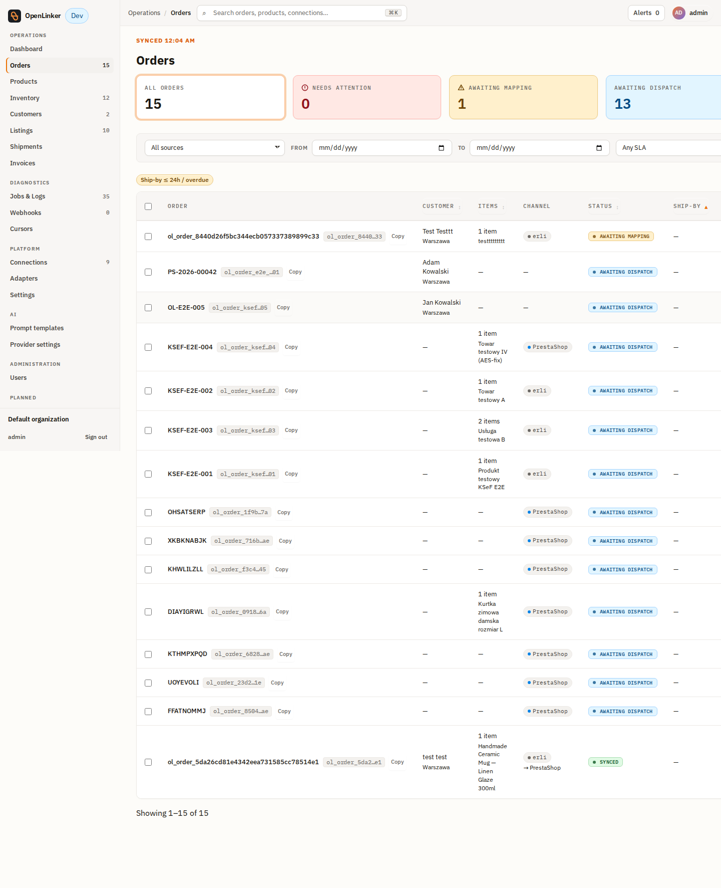

The order detail page shows the full order with the **Invoice** panel at the bottom.

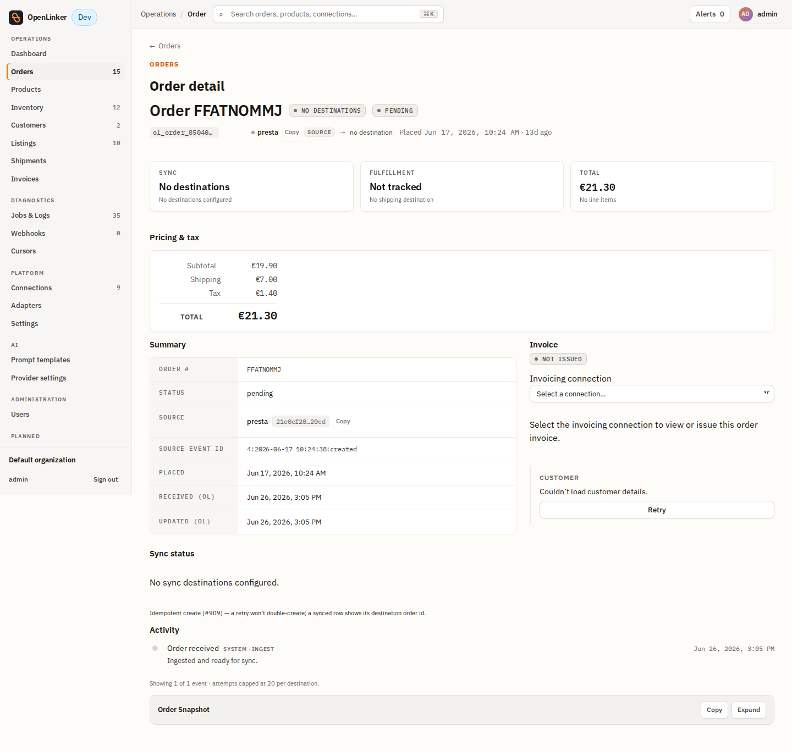

If you have multiple invoicing connections configured, the Invoice panel first
shows a **connection picker** — select the Subiekt connection you want to issue
through.

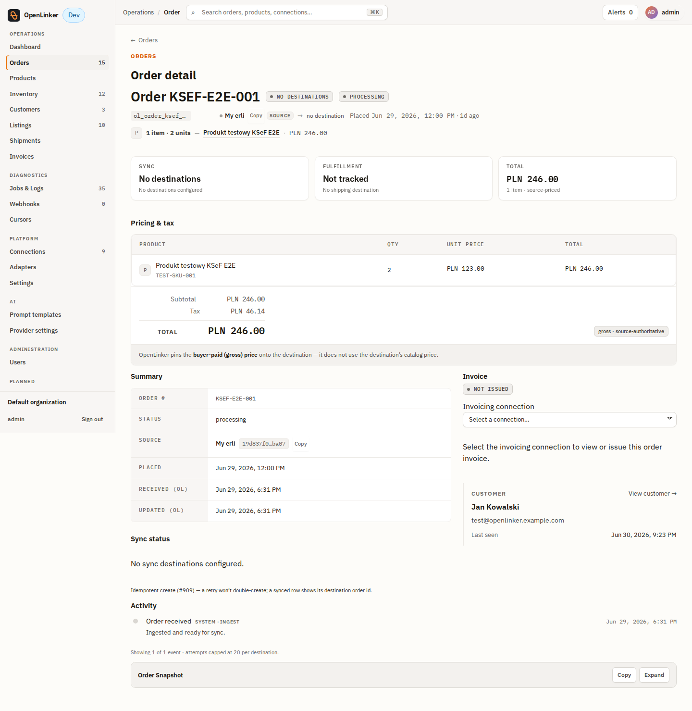

After selecting the connection, the panel loads the invoice state. If no invoice
exists yet, it shows the document-type dropdown and the **Issue invoice** button.
OpenLinker pre-selects **Invoice (faktura VAT)** when the buyer address contains
a NIP.

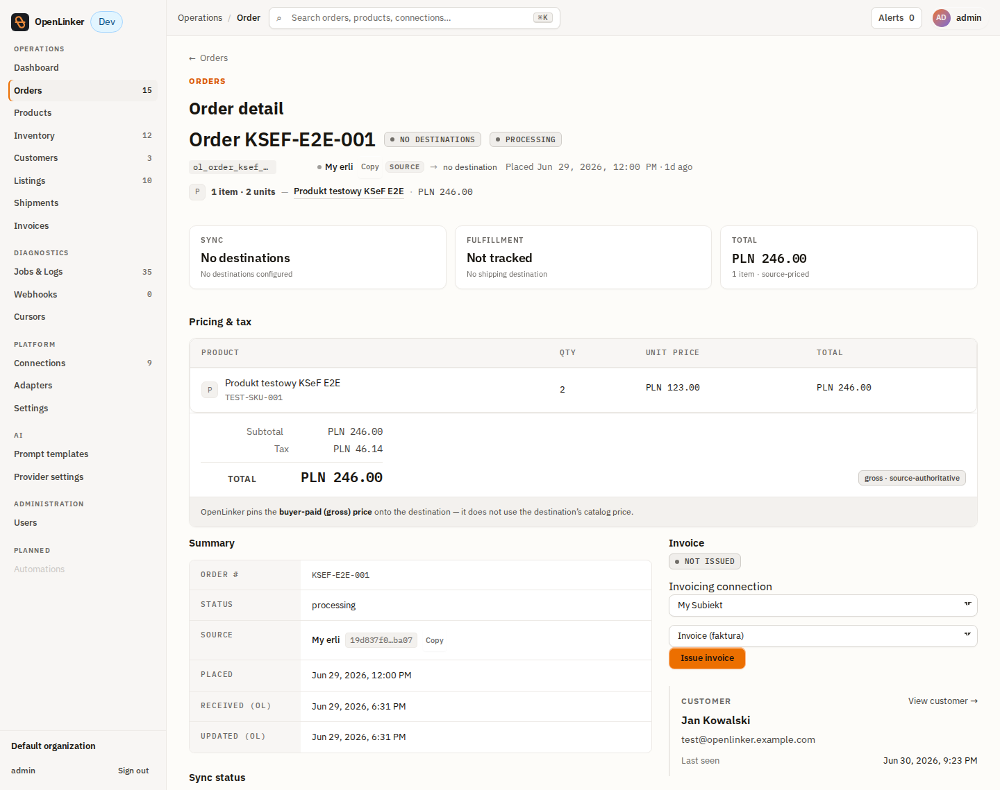

Click **Issue invoice**. OpenLinker sends the command to the bridge → bridge calls
Sfera → Subiekt nexo creates the document. The panel briefly shows **Issuing…**
then flips to **Issued**.

The **Issued** state shows the Subiekt document number (e.g. `FS 175/CENTRALA/2026`)
and, if KSeF submission is configured, the regulatory status badge.

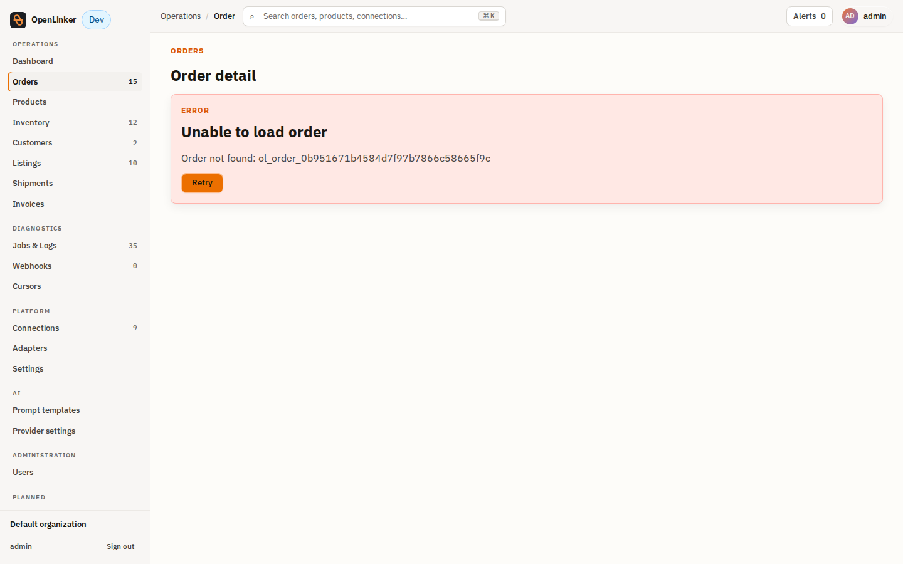

---

## Part 5 — Verify in Subiekt nexo

Open Subiekt nexo and go to **Dokumenty → Sprzedaży** (Sales documents). The
new FS document appears at the top of the list. Open it to verify the line items,
VAT breakdown, and buyer NIP — the document number matches the one shown in
OpenLinker's Invoice panel.

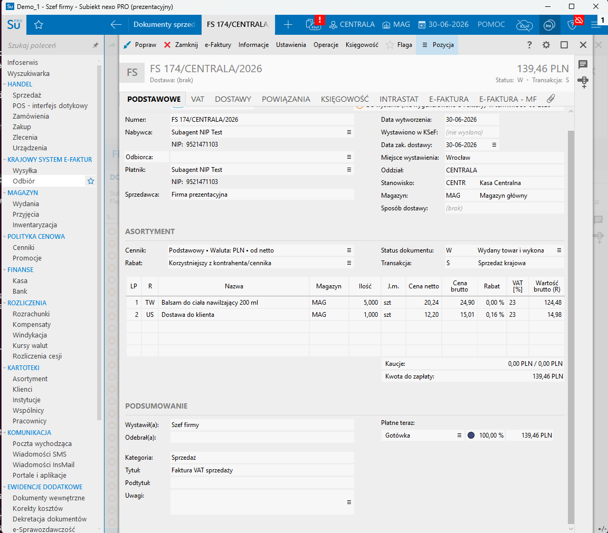

---

## Part 6 — Invoices list in OpenLinker

Go to **Operations → Invoices** (`/invoices`). Every issued document appears
here with its number, document type, issue date, and a PDF link (when the
bridge returns one).

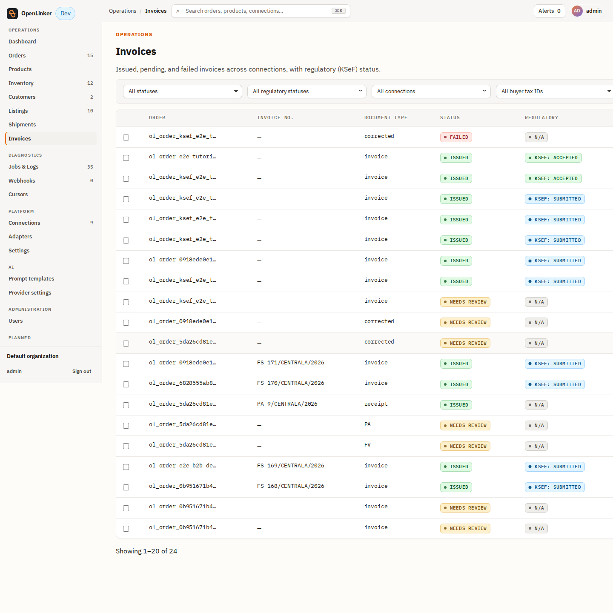

---

## Part 7 — B2C receipt (paragon) variant

An order placed by an individual buyer (no NIP in the address) becomes a
**paragon** (PA). Create an order for a customer without a VAT number.

OpenLinker auto-selects **Receipt (paragon)** in the document-type dropdown.
Click **Issue invoice** — the bridge routes the command to Sfera as a paragon
issuance.

The Issued state shows a `PA …` document number instead of `FS …`.

---

## Part 8 — Automatic issuance

Instead of clicking per order, change the connection's **Invoice trigger model**
to fire automatically. Edit the connection (**Connections → My Subiekt → Edit**)
and set the trigger (e.g. `auto-on-paid` or `auto-on-shipped`).

OpenLinker enqueues issuance automatically when an ingested order reaches that
state — the document appears in the Invoice panel and on `/invoices` exactly as
a manual issue does.

**Idempotency:** a repeated trigger or a double-click never creates a second
document. OpenLinker keys each issuance attempt by
`invoice:{connectionId}:{orderId}`. Re-triggering an already-issued order returns
the existing document silently (no duplicate in Subiekt nexo).

---

## Next steps

- **Retry a failure:** if issuance fails (bridge unreachable, malformed NIP,
  Sfera error), the panel shows **Failed** with a **Retry** button and the
  error message. Fix the root cause and click Retry — the same idempotency key
  applies, so no duplicate is created.

- **PDF download:** when the bridge returns a PDF URL in its response,
  the `/invoices` row shows an **Invoice PDF** link.

- **KSeF integration:** pair the Subiekt connection with a KSeF connection to
  automatically submit the issued FS document for e-invoicing clearance. See
  [`ksef tutorial`](../../ksef/docs/tutorial.md).

- **Operational reference** — version matrix, TLS/auth/firewall, troubleshooting:
  [`runbook.md`](./runbook.md).
