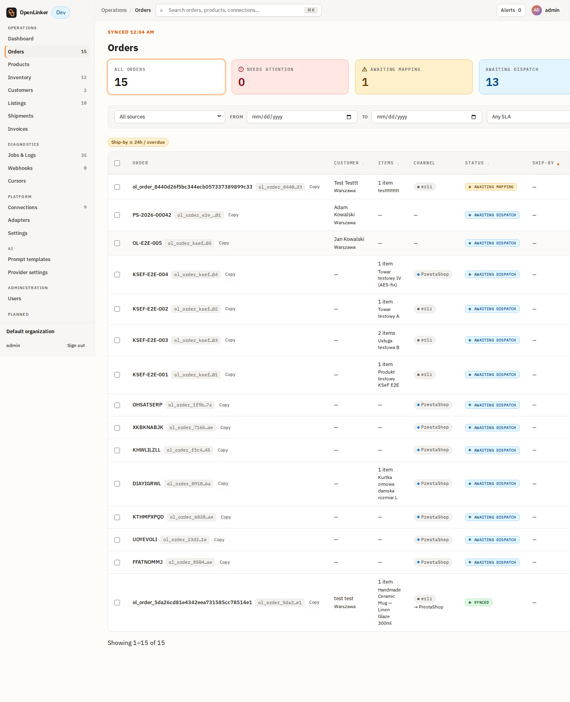
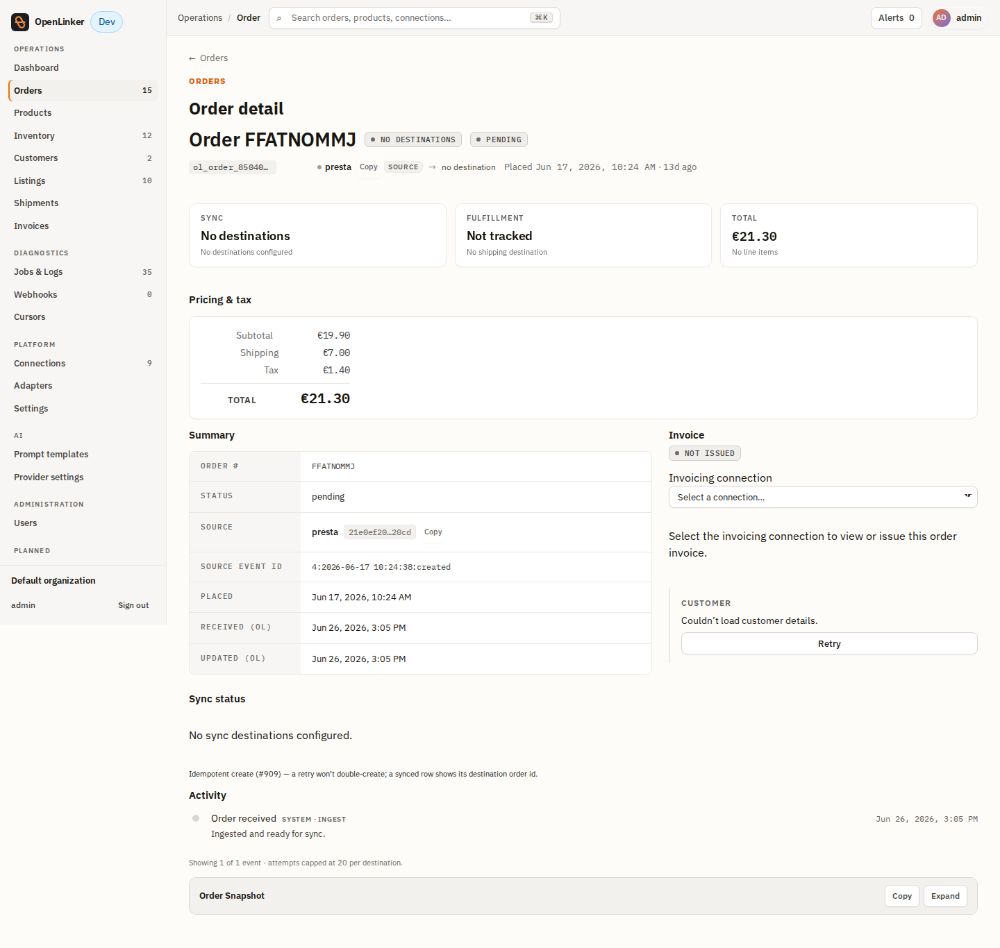
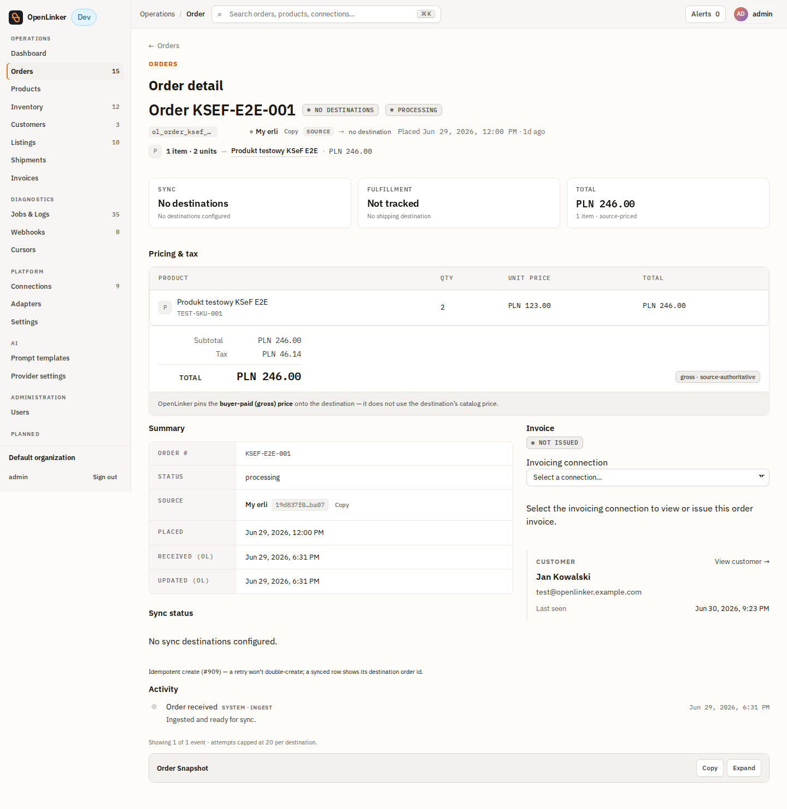

# Subiekt GT — Operator Tutorial

Issue faktura (FS) and paragon (PA) documents in Subiekt GT for OpenLinker orders —
complete A-to-Z guide covering the bridge, the OpenLinker wizard, and the full
order → invoice flow.

> **Happy path only.** For TLS config, firewall, version matrix, and troubleshooting
> see [`runbook.md`](./runbook.md).

---

## What you need before you start

- **Windows machine** with Subiekt GT (InsERT GT product line) and Sfera GT —
  the classic COM automation layer for Subiekt GT (ProgID `InsERT.GT`). This is
  a different product/API from the .NET Sfera SDK (`InsERT.Moria.Sfera`) used
  by Subiekt nexo — the bridge does not use that SDK at all.
- **.NET 8 runtime** on the Windows machine.
- The [`openlinker-subiekt-bridge`](https://github.com/openlinker-project/openlinker-subiekt-bridge)
  repository cloned (not yet published).
- OpenLinker running (API + worker + web) and reachable from the Windows machine.
- A **source connection** (e.g. PrestaShop or Allegro) already set up in OpenLinker
  so that orders flow in.

---

## Part 1 — Configure and run the bridge

The bridge translates OpenLinker's neutral invoice command into Sfera GT COM
automation calls that Subiekt GT executes. It runs as a console app on Windows,
started via a `.bat` launcher script.

### 1a — Configure `appsettings.json`

Open `bridge/Subiekt.Bridge.Api/appsettings.json` and fill in the Sfera GT
connection details. Secrets go in **environment variables only** — never in
the file.

```json
{
  "Port": 5005,
  "Auth": { "Enabled": true, "ApiKey": "" },
  "Sfera": {
    "SqlServer":   "localhost\\INSERTGT",
    "SqlDatabase": "Demo",
    "SqlUseWindowsAuth": true,
    "GtUser":      "Szef"
  }
}
```

> **Auth is two fixed credential pairs, not user-configurable.** The bridge is
> deployed with a fixed Basic-auth username/password pair for its general
> endpoints, and a separate bearer token (`x-token`) for the invoicing endpoints
> specifically. These values are set by whoever built and deployed the bridge —
> consult your bridge operator for the actual credentials used in your
> deployment; they are not something you configure per-installation.

> **Windows auth:** `SqlUseWindowsAuth: true` uses the current Windows session —
> no SQL password needed. Set `false` and supply a SQL password if you use
> SQL Server auth instead.

### 1b — Configure the public base URL (optional)

If OpenLinker or Allegro need to fetch images that the bridge returns (e.g.
product photos referenced from a generated document), those URLs must resolve
from *outside* the bridge machine — the bridge's own loopback address won't
work for a remote caller. Set:

```
OL_BRIDGE_PUBLIC_BASE = http://<this-machine-host-or-ip>:5056
```

If unset, it defaults to `http://host.docker.internal:5056`, which is correct
when OpenLinker runs in Docker on the same machine as the bridge.

### 1c — Start the bridge

Run `start-bridge.bat` (double-click it, or run it from a `cmd` window). This
keeps a console window open for as long as the bridge runs — **closing the
window stops the bridge process.** There is no Windows Service wrapper and no
automatic restart on crash or reboot; if the bridge needs to stay up
unattended, you're responsible for supervising the process yourself (e.g. a
scheduled task, NSSM, or similar).

The console should print that the bridge is listening and that a Sfera GT
session opened successfully.

The bridge listens on two ports:

- **5055** — HTTPS, using a self-signed certificate.
- **5056** — plain HTTP, used only so a browser or image-fetcher can reach the
  bridge without needing to trust the self-signed cert.

### 1d — Smoke-test the bridge

From a browser or `curl`/`Invoke-RestMethod`, hit the bridge's health endpoint
and confirm it reports the Sfera GT session as valid and Subiekt GT as
reachable.

This tutorial was verified live against **InsERT GT 1.89 SP1**.

---

## Part 2 — Create a Subiekt connection in OpenLinker

In OpenLinker, go to **Connections** and click **Add connection**.


On the platform picker, find and select **Subiekt GT**.


The guided setup wizard opens. Fill in the fields:


- **Connection name** — a human-readable label, e.g. `My Subiekt`.
- **Bridge URL** — the bridge base URL **without** a path suffix, e.g.
  `http://127.0.0.1:5005` (same machine) or `http://192.168.1.50:5005` (bridge
  on a different machine). The adapter appends `/api/…` paths automatically.
- **Bridge token** — paste the bearer token your bridge operator configured
  for the invoicing endpoints. Stored encrypted; never shown again after save.


Click **Connect Subiekt**. OpenLinker creates the connection record:


Click **Test connection** — OpenLinker calls `GET /health` on the bridge and
shows the result inline.


The connection now appears in the Connections list with the **Invoicing** capability badge:


Click the connection to view its detail page:


> **Advanced mode (alternative):** Add connection → Use advanced mode:
> `Platform type = subiekt`, `Adapter key = subiekt.invoicing.v1`,
> `Enabled capabilities = Invoicing`,
> `Credentials JSON = { "bridgeToken": "<token>" }`,
> `Config JSON = { "bridgeBaseUrl": "http://<host>:5005" }`.

---

## Part 3 — Get an order into OpenLinker

Orders flow into OpenLinker from any configured source connection (PrestaShop,
Allegro, WooCommerce, Erli, …). For a B2B faktura, the buyer address must
include a **NIP** (Polish VAT number) - Subiekt needs it on the issued
document. You pick the document type yourself in Part 4.

For a quick test with PrestaShop:

1. In the PrestaShop back office, go to **Customers → Add new customer** and
   create a customer.
2. Add a company address: fill **Company** and **VAT number (NIP)**.
3. Go to **Orders → Add new order**: pick the customer, add a product, select
   the company address, set **Payment = accepted**, click **Create the order**.

OpenLinker ingests the order on its next poll (or via webhook). It appears in
**Operations → Orders**.

---

## Part 4 — Issue the invoice

Open **Operations → Orders**. Find the ingested order and click it.



The order detail page shows the full order with the **Invoice** panel at the bottom.



If you have multiple invoicing connections configured, the Invoice panel first
shows a **connection picker** — select the Subiekt connection you want to issue
through.



After selecting the connection, the panel loads the invoice state. If no invoice
exists yet, it shows the document-type dropdown and the **Issue invoice** button.
The dropdown always defaults to **Invoice (faktura)** - it is NOT derived from the
buyer's NIP, so check the selection matches the order (Invoice for a B2B buyer
with a NIP, Receipt for B2C) before issuing.


Click **Issue invoice**. OpenLinker sends the command to the bridge → bridge calls
Sfera GT → Subiekt GT creates the document. The panel briefly shows **Issuing…**
then flips to **Issued**.

The **Issued** state shows the Subiekt document number (e.g. `FS 175/CENTRALA/2026`)
and, if KSeF submission is configured, the regulatory status badge.


---

## Part 5 — Verify in Subiekt GT

Open Subiekt GT and go to **Dokumenty → Sprzedaży** (Sales documents). The
new FS document appears at the top of the list. Open it to verify the line items,
VAT breakdown, and buyer NIP — the document number matches the one shown in
OpenLinker's Invoice panel.


---

## Part 6 — Invoices list in OpenLinker

Go to **Operations → Invoices** (`/invoices`). Every issued document appears
here with its number, document type, issue date, and a PDF link (when the
bridge returns one).


---

## Part 7 — B2C receipt (paragon) variant

An order placed by an individual buyer (no NIP in the address) should be issued
as a **paragon** (PA). Create an order for a customer without a VAT number.

In the Invoice panel, manually select **Receipt (paragon)** in the document-type
dropdown - the dropdown defaults to Invoice (faktura) and OpenLinker does NOT
switch it for you based on the missing NIP. Then click **Issue invoice** - the
bridge routes the command to Sfera GT as a paragon issuance.

The Issued state shows a `PA …` document number instead of `FS …`.

---

## Part 8 — Automatic issuance

Instead of clicking per order, change the connection's **Invoice trigger model**
to fire automatically. Edit the connection (**Connections → My Subiekt → Edit**)
and set the trigger (e.g. `auto-on-paid` or `auto-on-shipped`).

OpenLinker enqueues issuance automatically when an ingested order reaches that
state — the document appears in the Invoice panel and on `/invoices` exactly as
a manual issue does.

**Idempotency:** a repeated trigger or a double-click never creates a second
document. OpenLinker keys each issuance attempt by
`invoice:{connectionId}:{orderId}`. Re-triggering an already-issued order returns
the existing document silently (no duplicate in Subiekt GT).

---

## Next steps

- **Retry a failure:** if issuance fails (bridge unreachable, malformed NIP,
  Sfera error), the panel shows **Failed** with a **Retry** button and the
  error message. Fix the root cause and click Retry — the same idempotency key
  applies, so no duplicate is created.

- **PDF download:** when the bridge returns a PDF URL in its response,
  the `/invoices` row shows an **Invoice PDF** link.

- **KSeF integration:** pair the Subiekt connection with a KSeF connection to
  automatically submit the issued FS document for e-invoicing clearance. See
  [`ksef tutorial`](../../ksef/docs/tutorial.md).

- **Operational reference** — version matrix, TLS/auth/firewall, troubleshooting:
  [`runbook.md`](./runbook.md).
