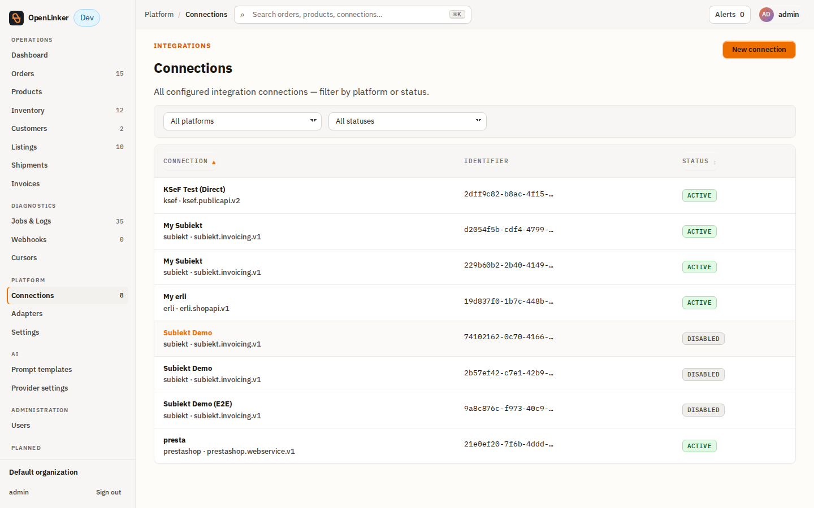
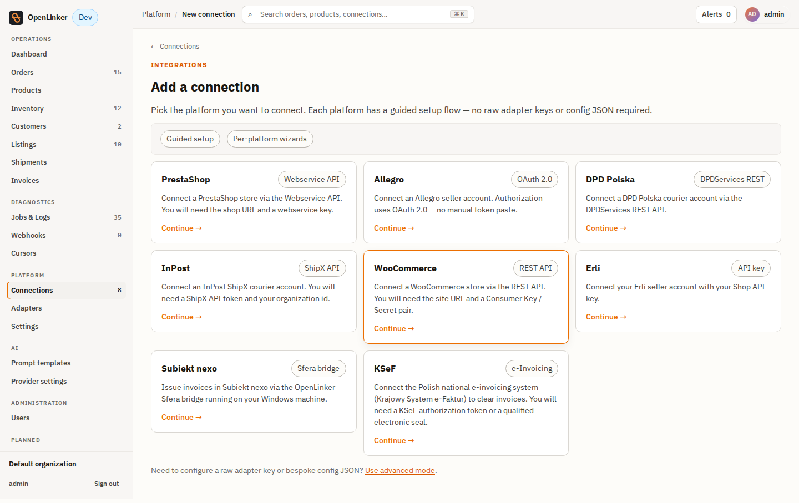
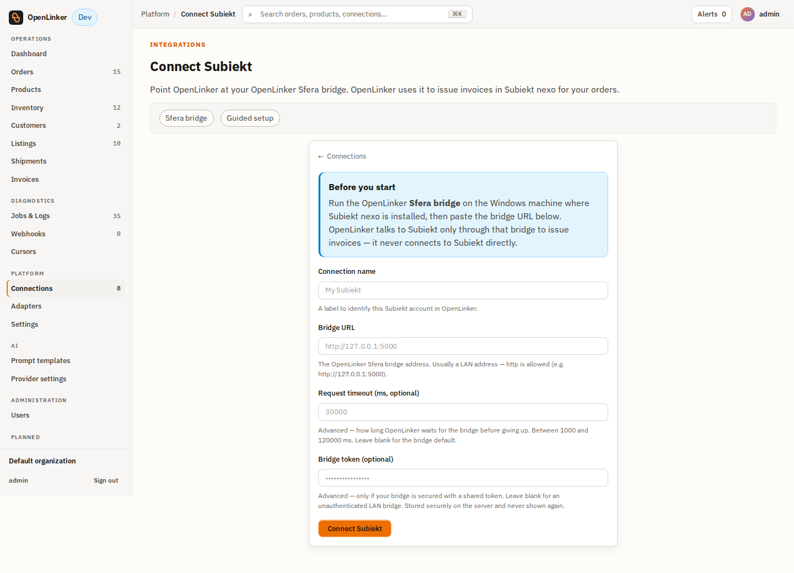
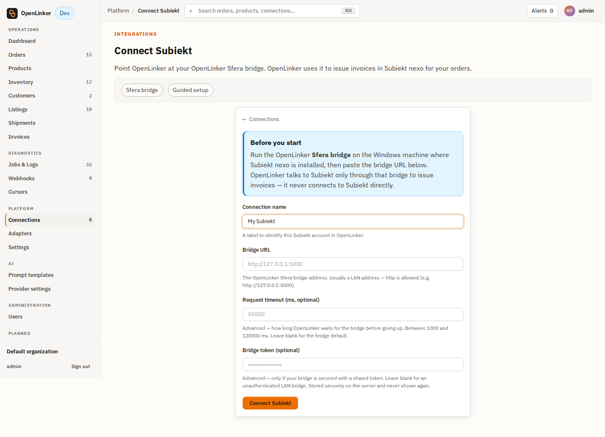
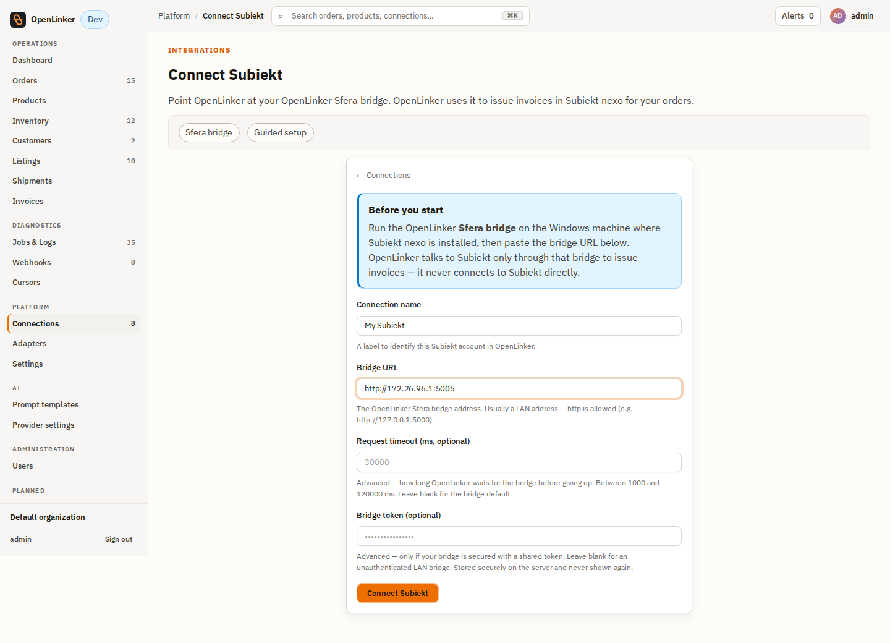
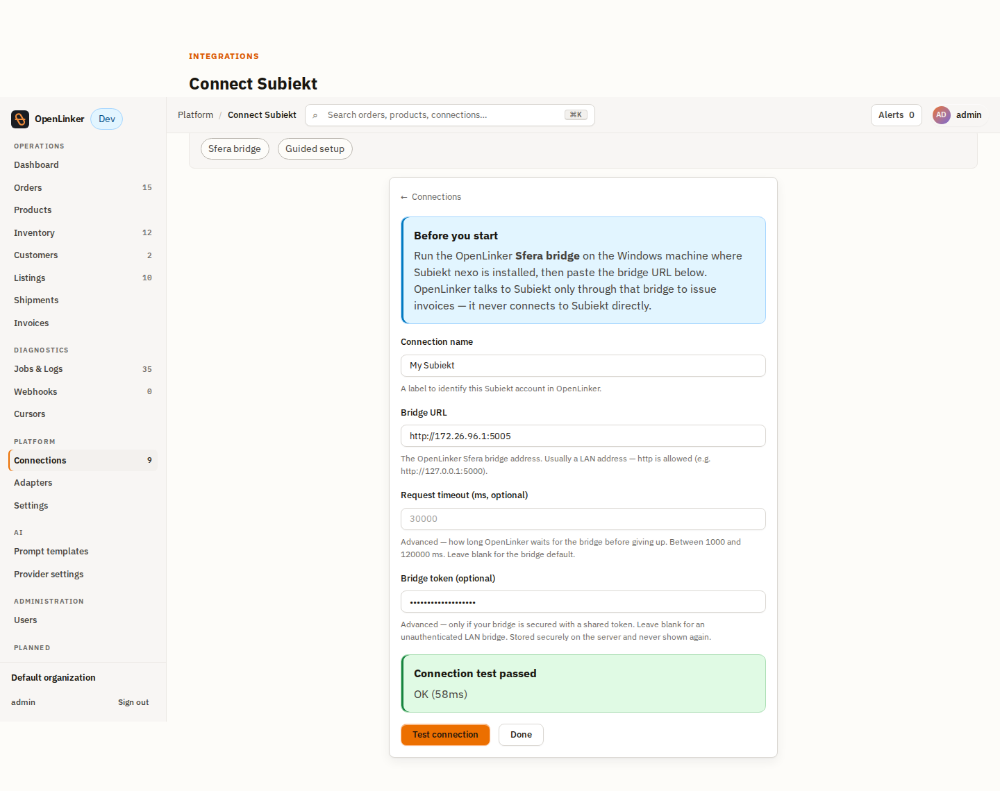
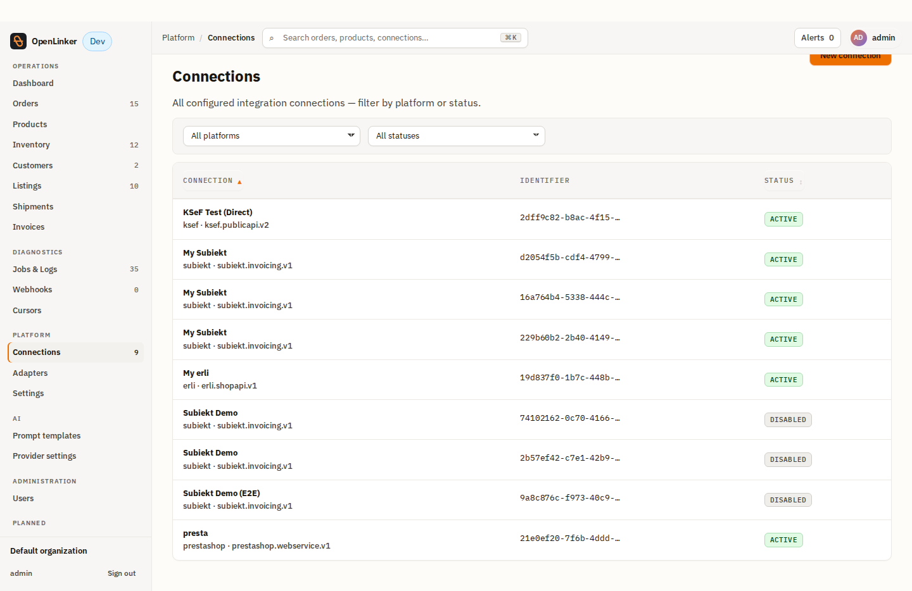
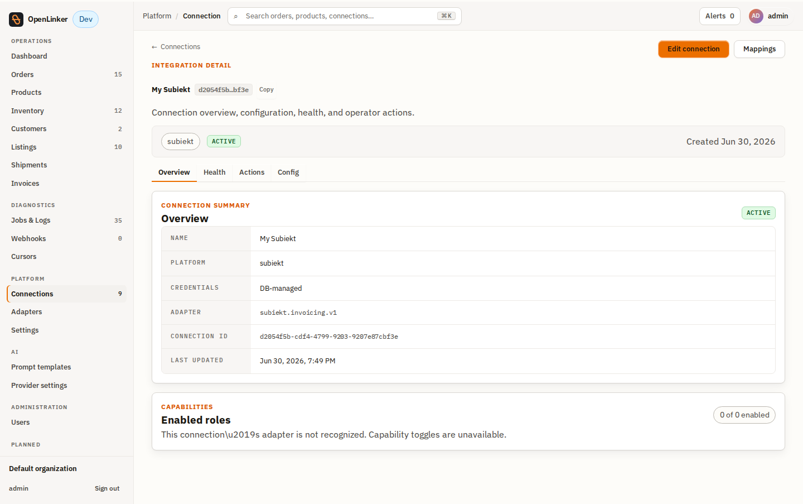

# Subiekt nexo — Operator Tutorial

Issue faktura (FS) and paragon (PA) documents in Subiekt nexo for OpenLinker orders —
complete A-to-Z guide covering the bridge, the OpenLinker wizard, and the full
PrestaShop → OpenLinker → Subiekt flow.

> **Happy path only.** For TLS config, firewall, version matrix, and troubleshooting
> see [`docs/integrations/subiekt/runbook.md`](../../../docs/integrations/subiekt/runbook.md).

---

## What you need before you start

- **Windows machine** with Subiekt nexo PRO + Sfera (the SDK ships with the
  demo/trial database; a production nexo requires the paid Sfera add-on).
- **.NET 8 runtime** on the Windows machine.
- The [`openlinker-subiekt`](https://github.com/norbert-kulus-blockydevs/openlinker-subiekt)
  bridge repository cloned — use the **`without-exe-packaging` branch**.
- OpenLinker running (API + worker + web) and reachable from the Windows machine.
- A **PrestaShop connection** already set up in OpenLinker (as the order source).

---

## Part 1 — Configure and run the bridge

The bridge translates OpenLinker's neutral invoice command into Sfera SDK operations
that Subiekt nexo executes. It runs as a console app on Windows (started via
PowerShell — **not** a compiled exe).

### 1a — Configure `appsettings.json`

Open `bridge/Subiekt.Bridge.Api/appsettings.json` and fill in the Sfera paths
and SQL connection. Secrets go in **environment variables only** — never in the file.

```json
{
  "Sfera": {
    "BinariesDir": "%LOCALAPPDATA%\\InsERT\\Deployments\\Nexo\\<deployment>\\Bin",
    "ConfigDir":  "%LOCALAPPDATA%\\InsERT\\Deployments\\Nexo\\<deployment>\\Config",
    "TempDir":    "%TEMP%\\SferaBridge",
    "SqlServer":  "localhost\\SQLEXPRESS",
    "SqlDatabase": "NexoDB",
    "NexoUser":   "operator"
  },
  "Tls": {
    "CertPath": "dev-cert.pfx"
  }
}
```

Replace `<deployment>` with the folder name visible under
`%LOCALAPPDATA%\InsERT\Deployments\Nexo\`.


### 1b — Set secrets in PowerShell

Open **PowerShell** (in WSL: `pwsh`, or Windows Terminal). Navigate to the repository
root and set the secret environment variables:

```powershell
cd /mnt/c/Users/<user>/repos/openlinker-subiekt   # adjust to your path

$env:Sfera__NexoPassword = "your-nexo-operator-password"
$env:Sfera__SqlPassword  = "your-sql-password"
$env:Auth__ApiKey        = "a-strong-random-token"   # copy this — it's your bridgeToken
$env:Tls__CertPassword   = "your-cert-password"
$env:ASPNETCORE_URLS     = "https://0.0.0.0:5005"
```

> **Note for WSL users:** The Windows host's IP seen from WSL is typically your
> default gateway. Find it with:
> ```bash
> ip route show default | awk '{print $3}'
> # e.g. 172.26.96.1
> ```
> Use this IP as the `bridgeBaseUrl` when you create the connection in Part 2.


### 1c — Generate a TLS certificate (first run only)

If you don't have a TLS cert yet:

```powershell
dotnet dev-certs https -ep dev-cert.pfx -p your-cert-password
```

Move `dev-cert.pfx` to the project root and set `Tls__CertPath = "dev-cert.pfx"` in
`appsettings.json`.

### 1d — Start the bridge

```powershell
dotnet run -c Release --project bridge/Subiekt.Bridge.Api
```

The console should print:

```
Now listening on: https://[::]:5005
...
Sfera: zalogowano
```


### 1e — Smoke-test the bridge

From another terminal (or from WSL bash):

```bash
curl -k https://172.26.96.1:5005/health
# → {"status":"ok","bridge":"up","sferaSession":"valid","subiekt":"reachable"}
```


---

## Part 2 — Create a Subiekt connection in OpenLinker

In OpenLinker, go to **Connections** and click **Add connection**.



On the platform picker, select **Subiekt nexo**.



The guided wizard opens. Fill in the three fields:



- **Connection name** — e.g. `My Subiekt`.

  

- **Bridge URL** — the bridge address **without** `/api`, e.g.
  `https://172.26.96.1:5005`. The adapter appends `/api/…` paths automatically.

  

- **Bridge token** — paste the value you set as `Auth__ApiKey` above. Stored
  encrypted; never shown again.

  

Click **Connect Subiekt**. The connection is created:


Click **Test connection** — OpenLinker calls `GET /health` on the bridge.



The connection appears in the list with the **Invoicing** capability badge:





> **Advanced mode (alternative):** **Add connection → Use advanced mode**:
> `Platform type = Subiekt`, `Adapter key = subiekt.invoicing.v1`,
> `Enabled capabilities = Invoicing`,
> `Credentials JSON = { "bridgeToken": "<token>" }`,
> `Config JSON = { "bridgeBaseUrl": "https://<host>:5005", "invoicing": { "triggerModel": "manual" } }`.

---

## Part 3 — Get a PrestaShop B2B order into OpenLinker

Subiekt issues a **faktura** (FS) when the buyer has a NIP, and a **paragon** (PA)
when there is no NIP. This part shows the B2B (NIP) path.

In the PrestaShop back office, go to **Customers → Add new customer** and create
a customer.


Add a company address: fill **Company** and **VAT number (NIP)**. This field is
what OpenLinker reads to decide whether to issue a faktura.


Go to **Orders → Add new order**: pick the customer, search for a product and
add it to the cart, select the company address, choose a carrier, set
**Payment = accepted**, and click **Create the order**.


OpenLinker ingests the order on its next poll (or webhook). It appears in
**Orders** with the buyer NIP visible in the address block.


---

## Part 4 — Issue the invoice (B2B faktura)

Open the order in OpenLinker. The **Invoice** panel shows **Not issued**
with a document-type dropdown.

Select **Invoice (faktura)** — OpenLinker pre-selects it when a buyer NIP is
present. Then click **Issue invoice**.


OpenLinker calls the bridge; the bridge calls Sfera; Subiekt issues the document.
The panel flips to **Issued** with the FS number and the KSeF badge.


---

## Part 5 — Verify in Subiekt nexo

> **Manual step — Windows screenshots.** The following screenshots are taken
> directly in the Subiekt nexo desktop application on Windows and are placeholders
> until the operator adds their own captures.

Open Subiekt nexo and go to **Dokumenty → Sprzedaży**. The new FS document
appears in the list.


Open the document to verify the line items, VAT breakdown, and buyer data
(including NIP).


---

## Part 6 — Invoices list in OpenLinker

Go to **Operations → Invoices** (`/invoices`). The document appears with its FS
number, KSeF badge, and a PDF link (if the bridge returns one).


---

## Part 7 — B2C receipt (paragon) variant

An order placed by an individual buyer (no NIP on the address) becomes a
**paragon** (PA). Create a second customer and order without filling the
VAT number field.

OpenLinker auto-selects **Receipt (paragon)** in the dropdown. Click
**Issue invoice**.


> **Manual step — Windows screenshots.** Verify the PA document in Subiekt nexo:


---

## Part 8 — Automatic issuance and idempotency

Instead of clicking per order, set the connection's **Invoice trigger**
to **Auto on order paid** (or **shipped**). OpenLinker enqueues issuance
automatically when an ingested order reaches that state.

Edit the connection (**Connections → My Subiekt → Edit**) and change the
trigger setting:

> See `docs/integrations/subiekt/setup-guide.md#part-b2` for the full
> settings panel walkthrough.

Once the trigger fires, the document appears in the order's Invoice panel and
on `/invoices` just as a manual issue does:


**Idempotency:** a repeated trigger or a double-click never creates a second
document. OpenLinker keys issuance by `invoice:{connectionId}:{orderId}` —
re-issuing an already-issued order returns the existing document (HTTP 409
on explicit re-issue, silent dedup on auto-trigger).


---

## Next steps

- **Retry a failure:** if issuance fails (bridge unreachable, malformed NIP),
  the panel shows **Failed** with a **Retry** button. Fix the cause and retry —
  the same idempotency key applies.

- **PDF download:** when the bridge returns a PDF URL, the `/invoices` row shows
  an **Invoice PDF** link.

- **KSeF badge:** enable **Show KSeF status badge** on the connection to surface
  the bridge-reported KSeF regulatory status (`pending → sent → accepted`) on orders.

- **Operational reference** — version matrix, TLS/auth/firewall, troubleshooting:
  [`docs/integrations/subiekt/runbook.md`](../../../docs/integrations/subiekt/runbook.md).

---

## Screenshot capture notes

> **For the person running the capture session:**
>
> **Bridge and Subiekt nexo screenshots** (`01-`–`05-`, `24-`–`25-`, `29-`) are
> **manual** — taken in the Windows console and Subiekt nexo desktop. Use placeholder
> text in the tutorial until you have real captures.
>
> **OpenLinker + PrestaShop screenshots** are automated by Playwright:
>
> - `apps/web/e2e/subiekt-walkthrough.mjs` → shots `06-`–`15-` (connection wizard)
> - `apps/web/e2e/subiekt-invoice.mjs` → shots `20-`–`28-` (order + issuance)
> - `apps/web/e2e/subiekt-proofs.mjs` → shots `30-`–`31-` (auto-trigger + idempotency)
>
> Helper scripts from the `subiekt-capture` worktree:
>
> - `ps-create-cust.mjs`, `ps-create-addr.mjs` — create PrestaShop customer + address
> - `ps-order-full2.mjs` — create PrestaShop order end-to-end
> - `ol-issue-flow.mjs` — click Issue invoice on a specific OL order ID
> - `ol-invoice-shots.mjs` — capture the issued invoice panel + `/invoices` list
>
> **Bridge:** clone `openlinker-subiekt`, check out **`without-exe-packaging`**,
> start with `dotnet run -c Release --project bridge/Subiekt.Bridge.Api` from
> PowerShell (WSL or Windows Terminal). Do **not** use a compiled exe.
>
> Place all PNGs in `libs/integrations/subiekt/assets/` with the exact filenames above.
